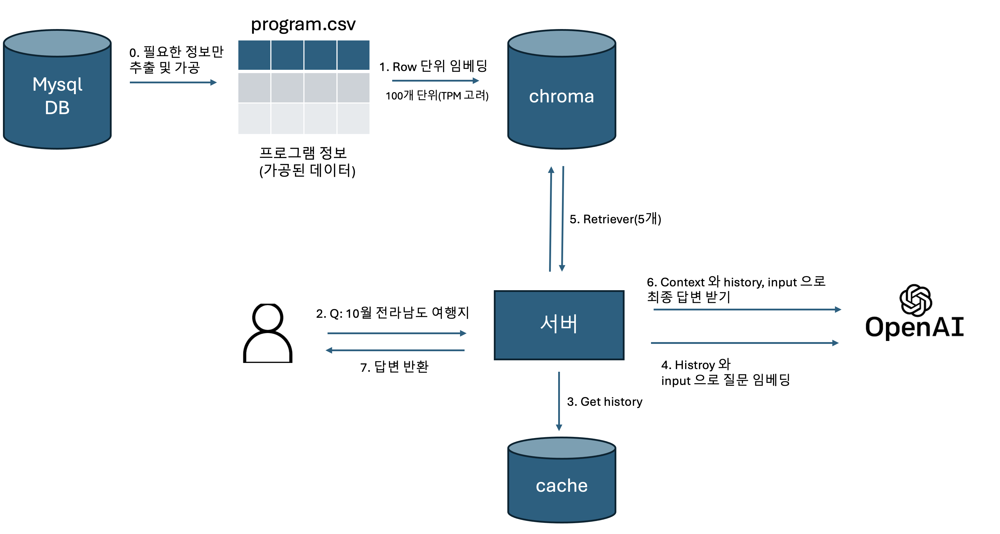

[깃허브](https://github.com/hobeen-kim/AI-program-reco)

# 0. 챗봇 구현 화면

.png)

# 1. Chatbot 플로우



## 0.0 정보 추출 및 가공

program 데이터는 여러 테이블로 나눠져 있습니다. (program, program_subsidy, program_theme, ...) 따라서 하나의 테이블로 묶은 뒤(join) csv 파일로 만들어줍니다. json 과  csv 중에 고민했는데 둘 다 임베딩 상 차이는 없을 것 같고 csv 에 대한 설명이 많은 것 같아서 구글링이 잘되는 csv 를 사용했습니다. 가져올 때 필요한 열만 가져옵니다.

program 의 detail_text 에는 p, strong, b, img 등 태그가 여러 개 있는데 해당 태그들도 모두 삭제해줍니다. 이미지는 따로 변환하지 않고 그대로 삭제해줬습니다. 보통 모든 내용은 타이핑으로 detail_text 에 넣기 때문입니다.

# 1. Row 단위 임베딩

## 1.0 split

 특정 질문에 하나의 프로그램 단위로 가져와야 하기 때문에 따로 토큰단위로 나누지는 않고 csv 의 행(row) 단위로 임베딩했습니다. 예를 들어 "강원도 여행 지원 프로그램은?"이라는 질문에 대해 "A 프로그램", "B 프로그램", ... 을 가져와서 context 으로 활용합니다.

 만약 그렇지 않다면 필요한 정보가 없을 수도 있습니다. 예를 들어서 A 프로그램이 너무 커서 2개의 chunk 로 나눠졌다고 가정하겠습니다.(A-1, A-2). LLM 이 답변을 할 때 제목과 여행일자가 필요한데, 제목은 A-1 에 있고 여행일자가 A-2 에 있으면 LLM 은 두 chunk 를 모두 받아야 제대로 답변할 수 있습니다.

 문제는 토큰이 지나치게 큰 프로그램이 있을 수 있다는 점입니다. 프로그램 상세 설명이 있는 detail_text 에서 그럴 수 있는데요. 해당 컬럼의 크기가 특정 임계값을 넘는다면 detail_text 를 LLM 으로 요약한 뒤 (전처리) 다시 저장할 수 있겠습니다. 이것까지 구현하지는 않았습니다.

## 1.1 임베딩 및 vector_store 저장

임베딩은 chatGPT 의 `text-embedding-3-small` 을 사용했습니다. 한번에 임베딩하려니까 TPM (Token Per Minute) 을 초과해서 100개씩 끊어서 했습니다. 그리고 ChromaDB 에 저장해줍니다.

# 2. 사용자 질문

애플리케이션은 대화형식으로, python 의 streamlit 으로 구현되어있습니다. 사용자의 질문과 답변이 캐시에 저장됩니다.

# 3 ~ 6. langChain 으로 구성된 체인

langChain 으로 구성되어있어서 한번에 설명하는게 나아보입니다.

```python
history_aware_retriever = create_history_aware_retriever(llm, retriever, contextualize_q_prompt)
    question_answer_chain = create_stuff_documents_chain(llm, qa_prompt)
    return create_retrieval_chain(history_aware_retriever, question_answer_chain)
```

history_aware_retriever 은 retriever 종류로 history 와 input 을 통해 retriever 을 할 적절한 질문을 생성하는 것입니다. 예를 들어,

- Human: 대한민국의 수도는?
- AI: 서울입니다.
- Human: 그 도시에 대해 설명해줘.

위 대화에서 "그 도시에 대해 설명해줘" 라는 질문을 벡터 임베딩을 한 후 retriever 을 실행하면 서울에 대한 문서를 정확히 얻을 수 없을 것입니다. 질문 자체에 "서울"이라는 단어가 없기 때문입니다. 하지만 history 를 보고 질문을 "서울에 대해 설명해줘"로 변경한다면 적절한 문서를 얻을 수 있습니다.

question_answer_chain 은 질문에 대해 llm 으로 답변을 얻는 chain 입니다. 앞의 history_aware_retriever 와 결합해 create_retrieval_chain 로 사용합니다. chain 을 사용해서 답변을 gpt 로부터 받아서 사용자에게 반환합니다.

# 알게된 점

1. 어떤 모델을 사용하느냐도 중요하지만 데이터 가공, 임베딩이 중요하다는 걸 알게 되었습니다. 처음에는 program 의 컬럼을 그대로 사용했는데 한글에 대한 질문과 program 의 컬럼을 제대로 매칭하지 못하는 것 같았습니다. 예를 들어, possibleChild 는 아이와 함께 동반가능한 프로그램이라는 뜻인데,  possibleChild 를 그대로 사용하는 것보다 "아이와 함께 동반 가능"처럼 컬럼명을 바꿔주는게 답변이 더 잘나왔습니다. 그리고 필요없는 정보는 버리고, 중요한 정보는 좀 더 가공하는 작업이 필요했습니다.
2. 프롬프트 엔지니어링이란 보다 적은 토큰으로 원하는 대답을 받는 것이라고 생각했습니다. 지시사항이나 예시, 히스토리 등이 많으면 많을수록 당연히 답변의 질이 상승하겠지만 요금도 그만큼 증가합니다. 지금은 질문 한번에 7000~8000토큰 정도가 필요한데 3000토큰 정도로 줄이면서 답변의 질을 유지하는게 목표입니다.
3. 답변의 정확성을 어떻게 측정하는지 공부해야겠다고 생각했습니다. 예를 들어서 "창원에서 열리는 프로그램이 뭐야?" 라고 질문했을 때 어떤 프롬프트는 A, B 를 추천하고, 어떤 건 B, C 를 추천한다면 더 좋은 프롬프트는 무엇일까 생각이 들었습니다. 회사에서 개발 중인 모델은 `NDCG@20` 와 cos_sim 을 사용하던데 그런 지표는 무엇에 근거하는지 확인해봐야겠구요.