포스팅 내용은 [쉽게 설명하는 aws 기초 강좌](https://www.youtube.com/playlist?list=PLfth0bK2MgIan-SzGpHIbfnCnjj583K2m) 를 보면서 필요한 내용을 정리하였습니다.

# S3

S3(Simple Storage Service) 는 파일을 보관하기 위한 객체 스토리지 서비스입니다. S3 는 글로벌 서비스지만 데이터는 region 에 저장됩니다. S3 는 Standard 의 경우 최소 3개의 AZ 에 데이터를 분산 저장합니다. 

**버킷이란**

- S3 의 저장 공간을 구분하는 단위입니다.
- 디렉토리/폴더와 같은 개념입니다.
- 버킷 이름은 전 세계에서 고유 값이며 region 에 관계없이 중복된 이름은 허용되지 않습니다.

**보안설정**

- S3 모든 버킷은 새로 생성 시 기본적으로 Private 이며 따로 설정을 통해 불특정 다수에게 공개가능합니다.
- 보안 설정은 객체 단위(ACL, Acess Control List) 와 버킷 단위(Bucket Policy) 로 구성되지만 거의 모든 설정은 버킷 단위로 합니다.
- MFA 를 통해 객체 삭제를 방지할 수 있습니다.
- Versioning 을 통해 파일 관리가 가능합니다.
- 액세스 로그를 생성하고 전송할 수 있습니다.

# S3 예제

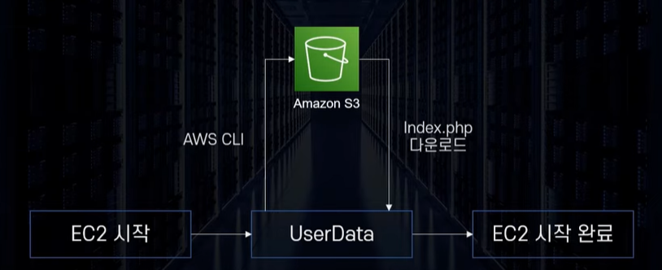

- EC2 를 시작하자마자 S3 의 데이터(index.php)를 받아서 EC2 를 시작하는 것으로 만들어보겠습니다.

1. S3 에 들어가서 버킷 만들기 버튼을 누릅니다. 이름을 임의로 설정하고, region 은 서울 Region 으로 하겠습니다. 객체 소유권은 ACL 비활성화로 합니다. 나중에 필요 시 활성하시키겠습니다.

   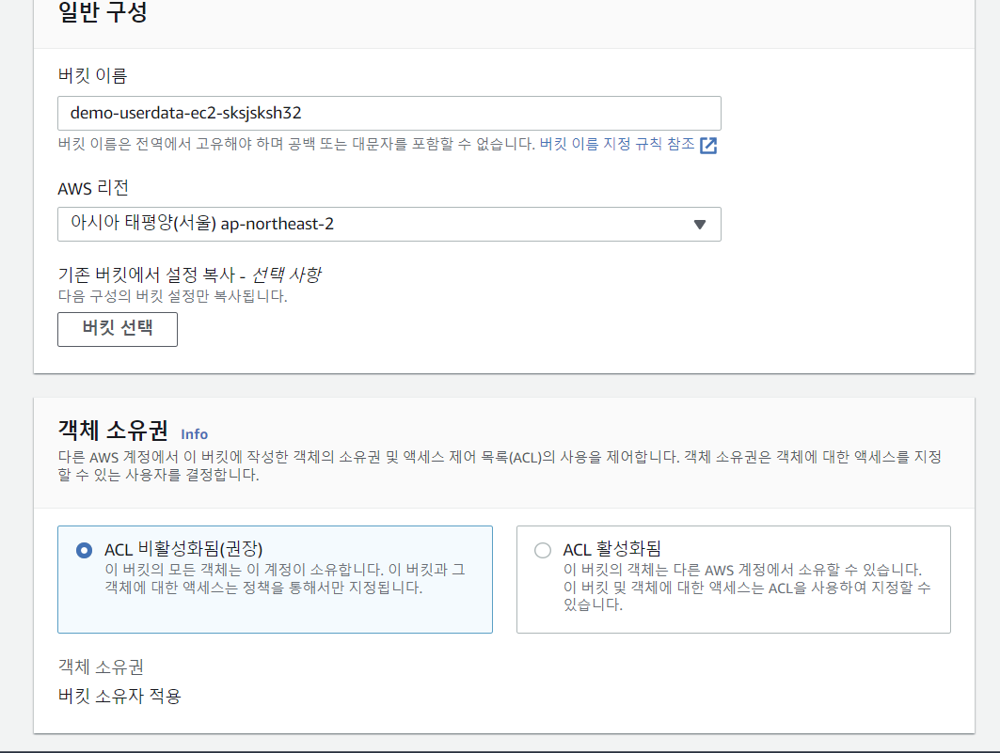

2. 버킷 버전관리는 비활성화하고 기본암호화는 아래 사진처럼 default 설정을 따르겠습니다. 이후 버킷 만들기 버튼을 누릅니다.

   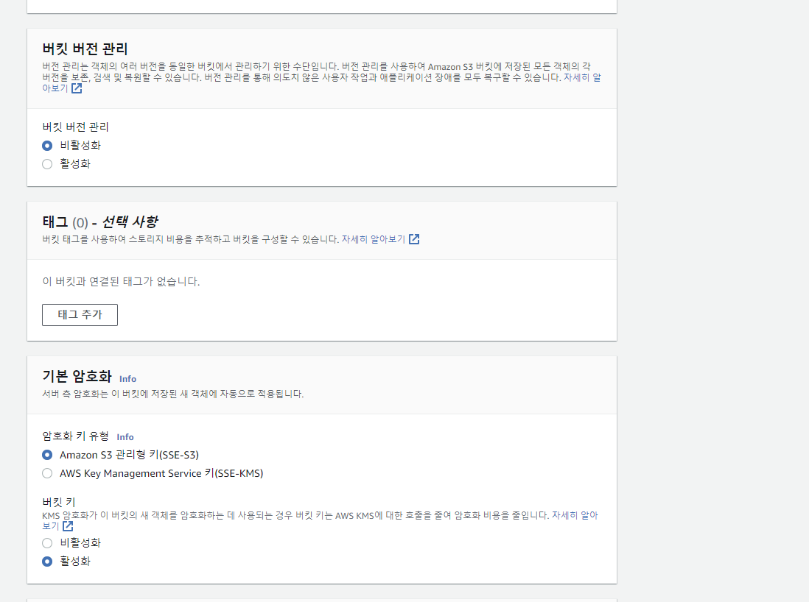

3. 이제 S3 가 생성되었습니다. 해당 위치에 php 파일을 업로드하겠습니다. php 파일은 유튜브 '기초강좌 20' 에 있습니다.

   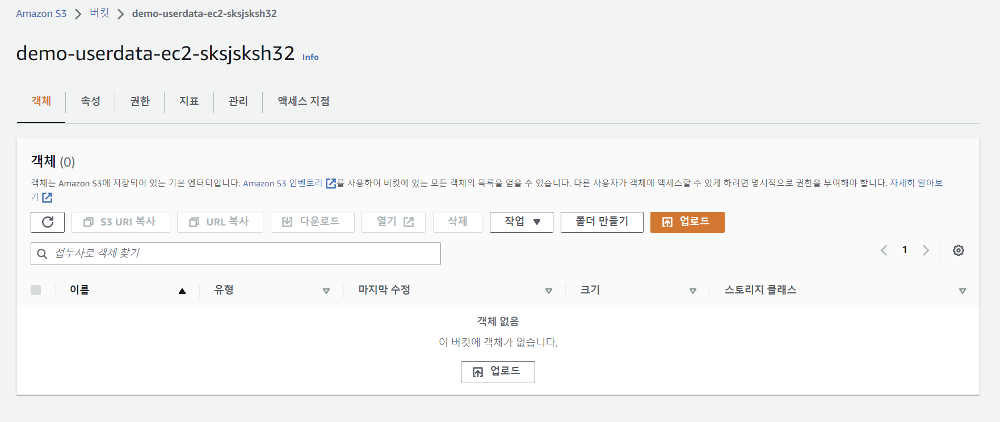

   - 여기에 Drag&Drop 으로 파일을 업로드 합니다.

     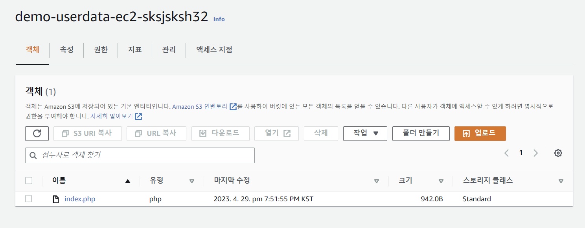

   - 파일이 정상적으로 올라간 걸 볼 수 있습니다.

4. 이제 EC2 에서 인스턴스를 생성하겠습니다. 하지만 그전에 S3 에 접근할 수 있도록 역할을 만들기 위해 IAM 콘솔에서 역할 > 역할 만들기로 들어갑니다. 먼저 아래와 같이 설정하고 다음 버튼을 누릅니다.

   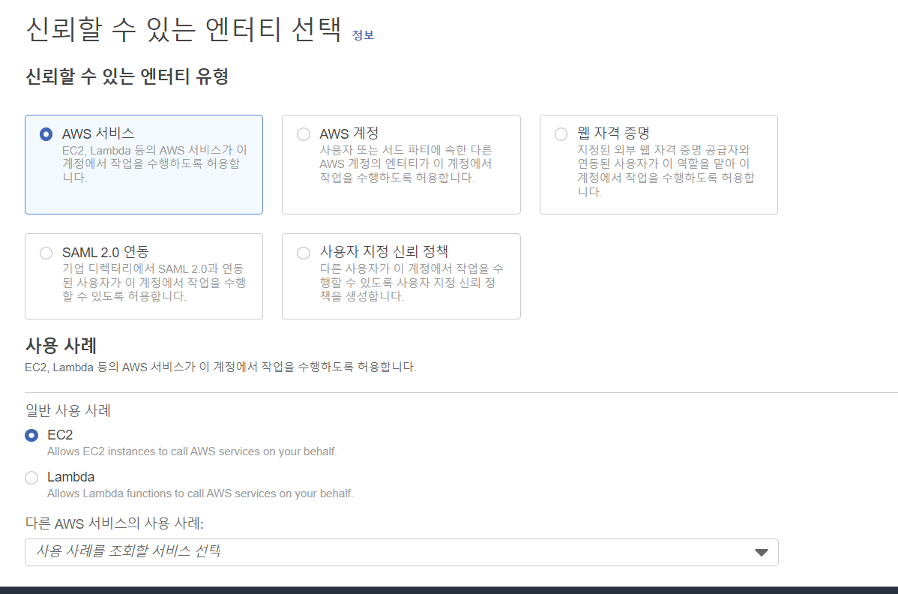

5. 다음은 권한 설정입니다. S3 로 검색해서 'AmazonS3FullAccess' 를 체크하고 다음으로 넘어갑니다.

   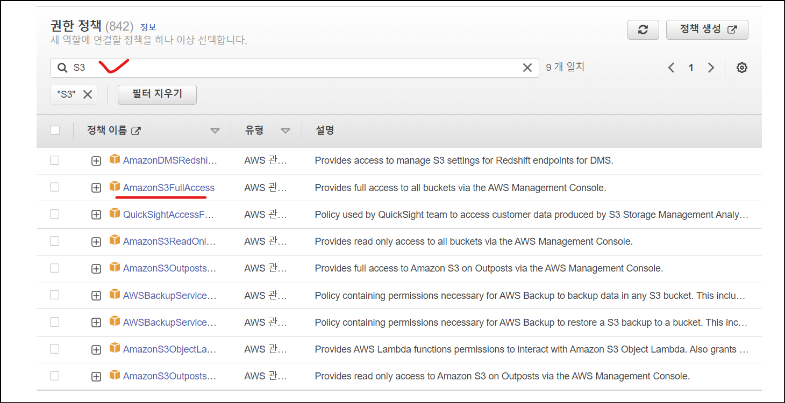

6. 다음 단계는 이름 지정 및 검토, 생성입니다. 이름을 임의로 지정하고 생성을 누릅니다. 다음과 같이 S3-EC2 역할이 생성된 것을 볼 수 있습니다.

   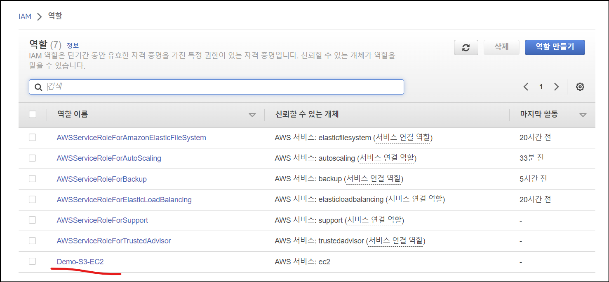

7. 이제 인스턴스를 만듭니다. 인스턴스 이름을 임의로 지정하고, AMI 는 Linux 2, 인스턴스 유형은 t2.micro, 키페어 없음, default 보안그룹으로 설정합니다. 고급 세부 정보가 중요한데, 아래와 같이 편집합니다.

   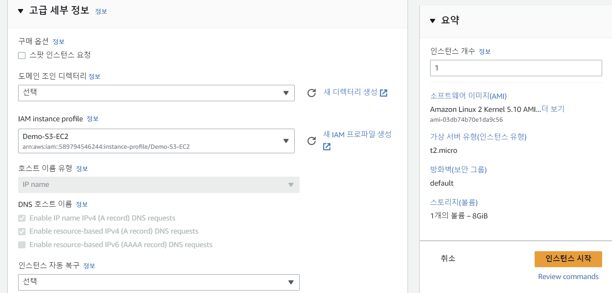

   - IAM instance profile 에 아까 만들었던 IAM 권한 설정을 넣습니다.

   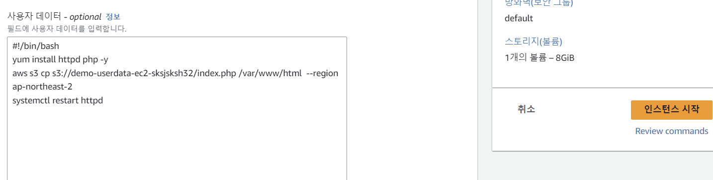

   - 사용자 데이터에 위와 같이 넣습니다.
     1. 아파치 서버 설치 (`yum install httpd php -y`)
     2. s3 에서 `index.php` 파일을 가져와서 저장 (`aws s3 cp s3://demo-userdata-ec2-sksjsksh32/index.php /var/www/html  --region ap-northeast-2`)
        - 이때 `s3://` 다음에 자신의 s3 이름을 넣어야 합니다. 저는 `demo-userdata-ec2-sksjsksh32` 입니다.
     3. http restart (`systemctl restart httpd`)

8. 이제 만들어진 EC2 의 퍼블릭 IP 로 접속하면 다음과 같이 넣어둔 index.php 를 볼 수 있습니다.

   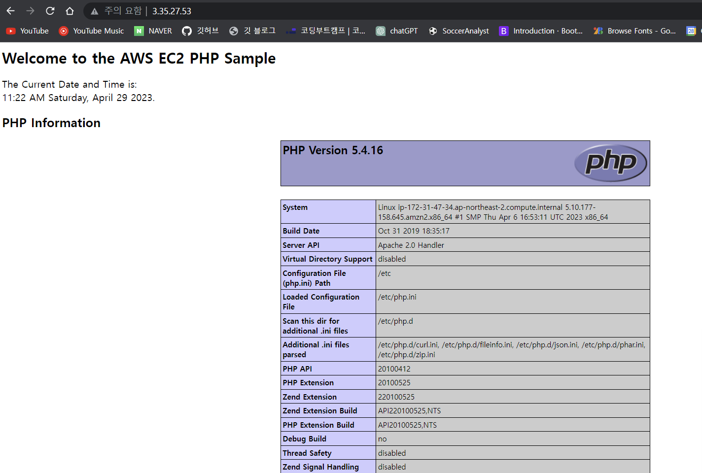

   

# S3 의 스토리지 클래스

S3 는 저장의 목적, 예산에 따라 다른 저장방법을 적용합니다. 총 8가지의 클래스가 있습니다.

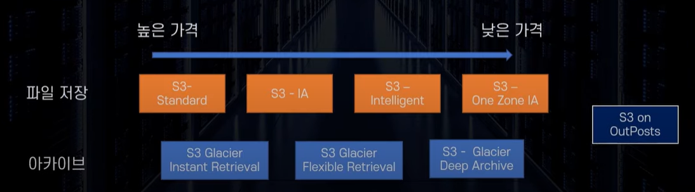

**S3 스탠다드**

- 99.99% 가용성, 99.999999999% 내구성을 가집니다.
- 최소 3개 이상의 AZ 에 분산 보관됩니다.
- 최소 보관 기간, 최소 보관 용량이 없습니다.
- 파일 요청비용은 없지만 전송 요금은 발생합니다.

**S3 스탠다드 IA (Infrequently Accessed)**

- 자주 사용되지 않는 데이터를 저렴한 가격에 보관할 수 있습니다.
- 최소 3개 이상의 AZ 에 분산 보관됩니다.
- 최소 저장용량 128kb, 최소 저장 기간 30일 입니다. (1일만 보관해도 30일 요금 청구됨)
- 데이터 요청 비용이 발생합니다. 데이터를 불러올 때마다 비용을 지불합니다.

**S3 One Zone-IA**

- 스탠다드 IA 와 똑같지만 단 한 개의 AZ 에만 보관합니다.
- 자주 사용하지 않으며 쉽게 복할 수 있는 파일을 보관합니다. (오래된 썸네일 등)

**S3 Glacier Instant Retrieval**

- 아카이브용 저장소입니다.
- 최소 저장용량 128kb, 최소 저장 기간 90일 입니다.
- 바로 액세스가 가능합니다.
- 의료 이미지, 뉴스 아카이브 등을 저장하기 위해 사용합니다.

**S3 Glacier Flexible Retrieval**

- 아카이브용 저장소입니다.
- 최소 저장용량 40kb, 최소 저장 기간 90일 입니다.
- 요청 후 분 ~ 시간 단위 이후 액세스가 가능합니다.
- 장애 복구용 데이터, 백업 데이터 등에 사용합니다.

**S3 Glacier Deep Retrieval**

- 아카이브용 저장소입니다.
- 최소 저장용량 40kb, 최소 저장 기간 90일 입니다.
- 요청 후 12~48시간 이후 액세스가 가능합니다.
- 오래된 로그 저장, 사용할 일이 거의 없지만 법적으로 보관해야 하는 서류 등에 사용합니다.

**S3 Intelligent-Tiering**

- 머신 러닝을 사용해 사용 패턴에 맞는 클래스로 자동으로 변경시킵니다. (요금 최적화 가능)

**S3 on Outposts**

- 온프레미스 환경에 S3 를 제공합니다.
- 내구성을 확보한 상태로 파일을 저장하도록 설계되어 있습니다.
- IAM, S3 SDK 등을 사용할 수 있습니다.

# 마치며

S3 강의는 2개 강의정도로 짧습니다. 따로 더 공부할 필요가 있겠습니다!