# EC2 인스턴스 스토리지

## EBS

- IOPS 32000 이상을 요구하면 Nitro io2 or io1 를 선택해야 합니다.
- EBS multi-attach 는 io1, io2 만 가능하고 16개까지 가능합니다.
- EBS 암호화를 하면  KMS(AES-256) 를 이용해서 모든 움직이는(in flight)는 암호화되고, 모든 스냅샷도 암호화됩니다.
- 암호화되지 않은 EBS 는 암호화되는 스냅샷으로 저장할 수 있습니다.
- 암호화되지 않은 스냅샷으로부터 암호화된 EBS 를 만들 수도 있습니다.
- HDD 는 부트 볼륨으로 사용할 수 없습니다.

## EFS (NFS)

- pay per use
- MAX-I/O 는 높은 처리량으로 빅데이터, 미디어 작업 등에 유용합니다.
- Bursting mode - 파일 시스템과 동일한 용량을 가집니다.
- Provisionted mode - 스토리지 크기에 상관없이 처리할 수 있습니다.
- inter-region VPC peering connection 을 통해서 다른 리전의 EC2 와 연결하거나 AWS VPN 연결로 온프레미스와 연결할 수 있습니다.

# ELB

- 인스턴스 상태를 확인할 수 있습니다.
- SSL 을 이용하여 HTTPS 통신이 가능합니다. 
- 관리형 로드밸런서로, AWS 가 가용성을 보장합니다.

## ALB

- 7계층 전용 LB 로 HTTP, HTTPs, WebSocket 에서 작동합니다.
- 포트 매핑이 있기 때문에 컨테이너와 ECS 로 사용하기 좋습니다.
- URL 로 대상 경로 설정이 가능합니다. (example.com/users & example.com/posts)
- hostname 기반으로 대상 경로 설정이 가능합니다. (one.example.com & other.example.com)
- 쿼리, 헤더를 기반으로도 설정 가능합니다.

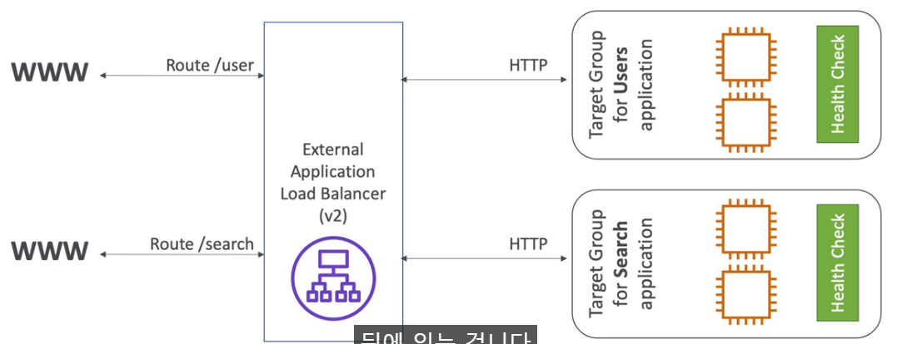

**타겟 그룹**의 대상은 Ec2, ECS, 람다 함수, IP 주소(Private) 가 있습니다. 타겟그룹을 정하는 방법은 쿼리 문자열로 하면 됩니다.

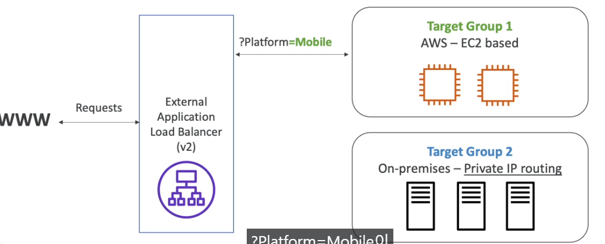

**보안설정** 

​	EC2 의 보안 그룹에서 인바운드 규칙은 로드밸런서 SG 에서만 들어오는 걸 허용하도록 설정하면 됩니다.

**규칙 설정**

​	LB 에서 규칙 수정을 할 수 있습니다. 아래 예시는 /error path 면 404 에러를 보내는 규칙입니다. 이를 통해 특정 url 을 다른 곳으로 보낸다거나 하는 등의 설정이 가능합니다.

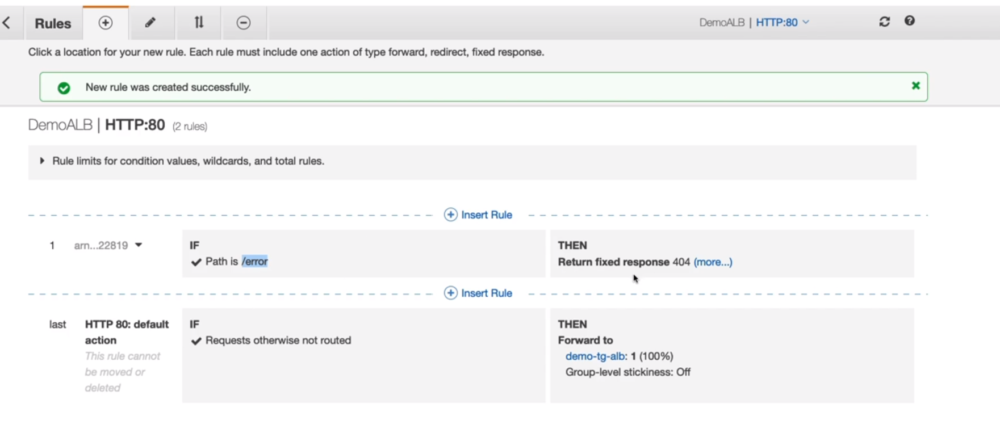

## NLB

- TCP, UDP 트래픽을 다룹니다.
- 초고속 환경을 구축할 때 사용합니다. 초당 수백만건 요청 처리가 가능하고 레이턴시가 짧습니다. (~100ms)
- 가용영역별로 하나의 고정 IP 가지고 탄력적 IP 주소를 할당할 수도 있습니다. 여러 개의 고정 IP 를 가진 어플을 노출할 때 선택할 수 있는 옵션입니다.

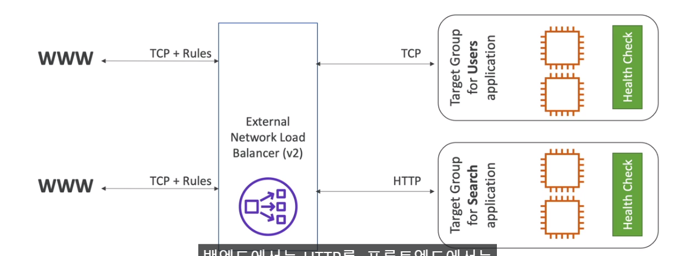

**대상그룹** 

​	EC2, IP 주소(반드시 하드코딩, private ip), ALB(ALB 입장에서는 고정 IP 주소를 얻고, NLB 입장에서는 HTTP 유형의 트래픽을 처리하는 규칙을 얻음) 를 사용할 수 있습니다.

**헬스체크**

​	TCP, HTTP, HTTPS 프로토콜을 지원합니다.

## **GWLB**

- 보안, 침입 탐지, 방화벽에 특화되어 있습니다.
- 배포 및 확장과 AWS 의 타사 네트워크 가상 어플라이언스의 플릿 관리에 사용합니다.
- 모든 트래픽이 방화벽, IDPS, DPIS, payload manipulation 등을 통과하게 됩니다.
- GWLB 를 등록하면 루트테이블에 자동으로 등록됩니다.
- L3 에서 작동됩니다.(IP)
- 모든 트래픽에 대한 단일 입출구인 Transparent Network Gateway 입니다. 
- 6081 포트의 GENEVE 프로토콜을 사용합니다.
- **대상 그룹** : EC2, IP(private, 자체 네트워크 등)

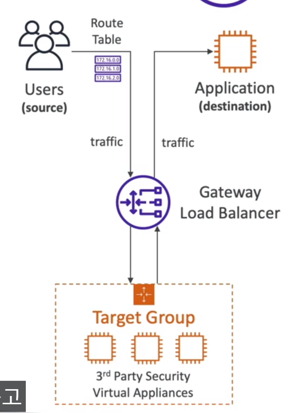

## Sticky Sessions(Session Affinity)

- 클라이언트가 페이지를 리로딩해도 같은 EC2 를 계속 이어줍니다.
- 쿠키를 통해 붙이고, 만료되면 다시 로드밸런싱을 진행합니다.
- Load balance generated cookie 와 Application-based cookie 가 있습니다.

## Cross-Zone Load Balancing

- 각각 LB 인스턴스가 모든 AZ 에 통들어서 트래픽이 고르게 분배됩니다.
- ALB 에서 기본 설정입니다. AZ 간 데이터 이동에 비용이 없습니다.
- NLB, GLB 는 disable 이 기본 설정이며 사용하려면 비용 지불해야 됩니다.

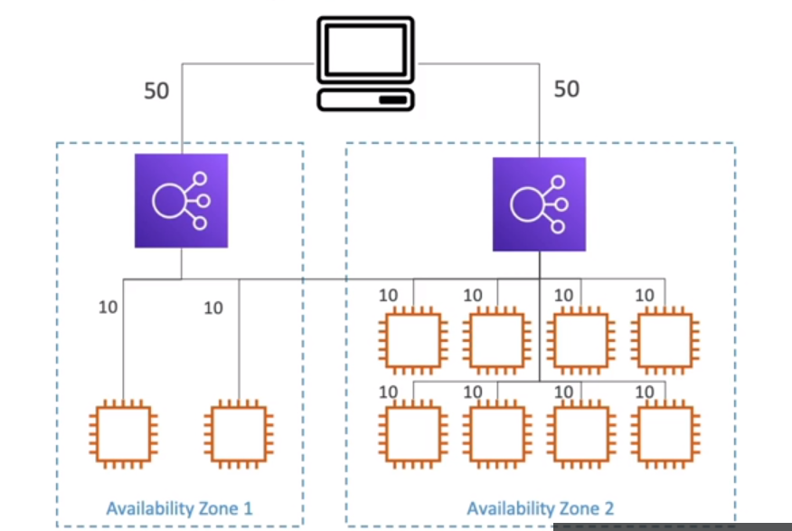

**Cross-Zone Load Balancing 을 비활성화 하면 이렇게 됩니다.**

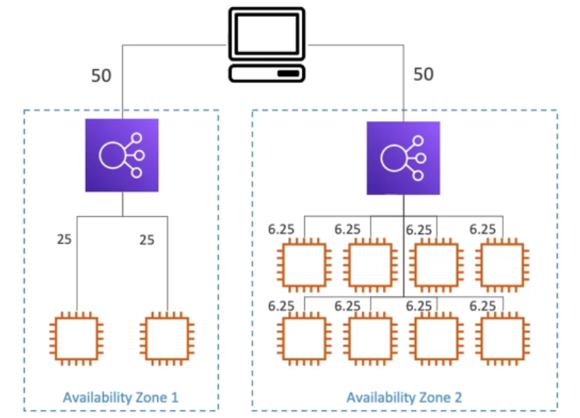

## SSL/TLS

- ACM 을 통해 인증서를 관리합니다.

**SNI**

- 여러 개의 SSL 을 하나의 웹 서버에 적용할 수 있게 합니다.
- **ALB, NLB, CloudFront** 에서 적용됩니다.
- 클라이언트가 요청하는 페이지에 따라 SSL 을 보냅니다. 아래 그림과 같습니다.

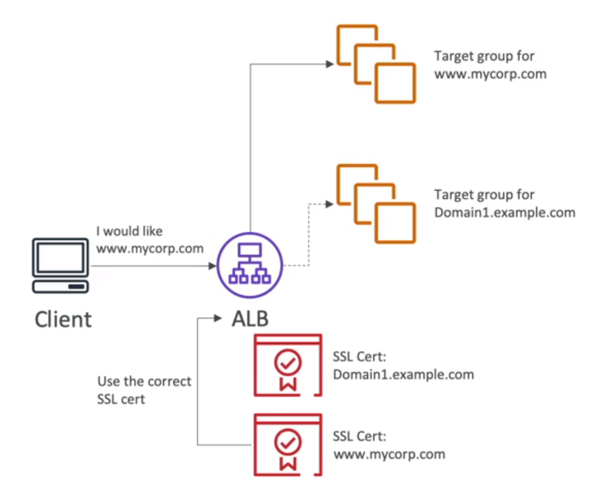

## Connection Draining

ALB, NLB 에서는 Deregistaration Delay 라고도 부릅니다. 인스턴스가 de-registering 되거나 unhealthy 일 때 현재까지의 연결은 어느정도 시간을 주어 보장해주는 것입니다. 1~3600 초 범위 내에서 설정 가능하고 기본은 300초입니다. 0 이면 사용안하겠다는 뜻입니다.

# ASG

- ASG 는 무료입니다.
- ASG 는 ELB 와 연결 가능. ELB 가 ASG 의 EC2 로 트래픽을 분산합니다.
- ELB 가 인스턴스의 상태를 확인하고 ASG 로 전달합니다.
- ASG health check 는 EC2 를 지정할 수도 있고 ELB 를 지정할 수 있는데, ELB 로 하는 것이 권장됩니다.
- AGS EC2 종료 순서 : AZ 중 ec2 숫자가 작은거 - 할당 전략(spot or instance) - 오래된 AMI - 오래된 configuration - next billing hour 가 가까운 인스턴스
- CloudWatch 의 알람으로도 스케일이 가능합니다. (Cloudwatch 가  CPU 나 custom metric 을 통해 트리거됨)
- Launch Template 을 사용해서 EC2 를 만듭니다. 템플릿에 들어가는 내용은 아래 그림과 같습니다.

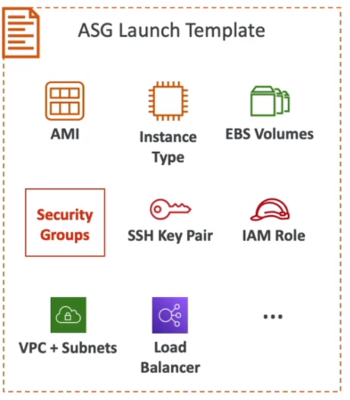

## ASG - Dynamic Scaling Policies

**Target Tracking Scaling** 

- ASG 의 평균 CPU 로 스케일링합니다.

**Simple / Step Scaling**

- CloudWatch 알람이 CPU 사용률로 트리거 해서 70%가 넘으면 2개를 더해라, 30% 미만으로 떨어지면 1개를 삭제해라 등 ASG 를 스케일링 합니다.

**Scheduled Action** 

- 예상되는 사용량에 미리 스케일링 예약합니다.

**Predictive scaling**

- 로드를 분석해서 미리 예측하고 스케일링을 진행합니다.

**metrics** 

- 사용되는 메트릭스는 평균 CPU 사용률, RequestCountPerTarget (EC2 는 평균 1000개가 적절), 평균 Network I/O, custom metrics 등이 있습니다.

**Scaling cooldown** 

- 인스턴스 생성, 삭제 후 쿨다운 기간을 가지게 됩니다. 쿨다운 기간에는 ASG 가 인스턴스를 추가, 삭제되지 않습니다. 기본값은 300초입니다.

# 데이터베이스

## RDB 

- auto-scaling 이 가능합니다.

**읽기전용**

- async 로 복사되며 DB 로 승격시킬 수 있습니다. 
- 자체 생애주기가 있고 select 명령문만 사용할 수 있습니다.
-  데이터 분석에 사용할 수 있습니다.
- AZ 간 비용은 없고 Region 간 비용은 있습니다. 
- 재해복구 대책으로도 쓸 수 있습니다.

**multi-AZ**

- sync 로 복사되는 standby instance 입니다. 
- 네트워크 손실에 대한 조치이고 **스케일링에 사용되지 않습니다.** 
- multi-AZ 로 확장할 때 다운타임이 없습니다.
- DB 엔진 레벨을 업그레이드할 때 multi-AZ 가 활성화되어있어도 동시에 업그레이드가 진행되기 때문에 다운타임이 발생합니다.
- 만들 때는 스냅샷이 복사된 후 standbyDB 를 설정합니다. 그리고 sync 로 복사합니다. 스냅샷은 다른 region 으로 보낼 수 있습니다.
- RDS custom : os 와 기저 db 에 접근 가능 (oracle, microsoft sql server)

## Aurora (postgres, mysql)

**특징**

- 읽기 전용본은 최대 15개입니다. 반면 RDS 인 mysql 은 5개입니다. 
- 읽기 전용본은 0-15 티어를 가지며 장애조치 시 높은 티어가 승계합니다. 티어가 같으면 용량이 큰 읽기전용본이 승계합니다.
- 컴퓨팅과 스토리지가 분리된 서비스입니다.
- 자동 스케일링되며, 리더 엔드포인트가 db 복제본 앞에 있어서 로드밸런싱이 됩니다. 라이터 엔드포인트도 있습니다.
- 3개 AZ 에 총 6개의 copy 가 생깁니다.(리전 당 2개). 각기 다른 볼륨에 기록됩니다.
- custom endpoint 를 지정하기 읽기 전용본을 할당 할 수 있습니다.
- aurora serverless 로 비정기적, 예측불가능한 요청에 대해 관리할 수 있습니다.
- multi-master : 즉각적인 장애조치를 위해 쓰기가능한 db 를 추가로 만듭니다.
- aurora global database : 1개의 주요 리전, 5개의 보조 리전을 가지고 리전당 16개 읽기전용본이 있습니다. 리전 간 스토리지 복제에 걸리는 시간은 1초 미만입니다. **복구시간 (RTO) 는 1분 미만입니다.(자주출제)**
- sagemaker, comprehend 가 오로라와 결합되어 지원할 수 있습니다. 따라서 머신 러닝이 가능합니다.
- cloning 을 통해 기존 클러스터에서 새 클로스터를 만들 수 있습니다. 스냅샷보다 빠릅니다.

## 백업

**RDS 백업**

- 데일리 풀 백업, 트랜잭션 로그 백업(5분마다) 등이 있고 1~35일동안 저장 가능합니다.
- 수동 스냅샷은 원하는 만큼 보유할 수 있습니다. RDS 는 정지되어도 비용을 내기 때문에 오래 정지하고 싶으면 스냅샷을 찍고 삭제하고 나중에 복구하는 게 비용을 절감할 수 있습니다.

**오로라 백업**

- 1~35일 저장 가능한데 해당 기능은 비활성화가 불가능합니다.
- **point in time 으로 어느시점이든 복구 가능합니다.**
- 수동 스냅샷도 있습니다.
- 테스트를 위해 cloning 을 할 수 있습니다. 프로덕션 DB 에 영향을 주지않고, 빠르고 경제적입니다.

## RDS, Aurora 보안

- AWS KMS 사용합니다.
- **암호화안된 걸 암호화할려면 해당 DB 를 스냅샷으로 찍고 스냅샷으로 암호화 DB 로 만들어야 합니다.** 즉 새로 만들어야 합니다.
- 전송중 암호화 기능이 기본입니다.
- 인증을 하기 위해 IM ROLE 을 통해 인증할 수도 있습니다.
- RDS CUSTOM 만 SSH 로 접근 가능하며, 나머지는 안됩니다.

## RDS proxy

- RDS(mysql, postgre, mariadb for rds) 와 Aurora(mysql, postgre) 에 적용 가능합니다.
- 프록시가 DB 를 하나의 풀로 모아 연결을 단일화 해줍니다.
- serverless 이며 장애조치시간을 66% 가량 줄일 수 있습니다.
- DB 에 IAM 인증을 강제하며 ASM 에 해당 인증이 저장됩니다.
- **RDS proxy 는 VPC 로만 접근 가능합니다.** 퍼블릭으로는 접근할 수 없습니다.
- 아래와 같이 람다함수와 함께 사용할 때 좋습니다.

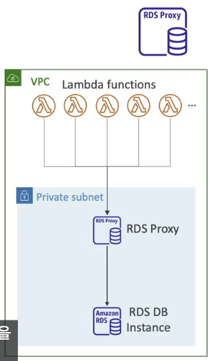

##  elasticache

- Redis, Memcached 는 인메모리 DB 로, 읽기 집약적인 워크로드의 부하를 줄이게 도와줍니다.
- 어플을 stateless 를 만드는 데 도움을 줍니다. (세션 저장 등)
- 캐시를 위한 EC2 인스턴스 유형을 프로비저닝해야 계속 진행할 수 있습니다.
- IAM, SG, KMS, Redis Auth 를 통해 보안할 수 있습니다.
- 데이터를 불러오는 패턴은 3가지가 있습니다.
  - lazy loading : 읽기 데이터가 모두 캐시됩니다.
  - write through : DB 에 쓸 때 캐시됩니다.
  - session store : 일시적으로 세션을 저장합니다.
- 게이밍 리더보드에 elaticache 가 주로 사용됩니다. (정렬된 집합 사용)

**Redis**

- **Redis** 는 자동 장애 조치로 다중 AB 를 수행하는 기술이 있고 읽기 전용 복제본은 읽기 스케일링에 사용됩니다. 다중 AZ 에 최대 5개 설정할 수 있습니다. RDS 와 유사하게 백업과 기능 복원이 있습니다.
- Redis auth 를 이용하여 인증을 사용할 수 있습니다.
- 레디스는 전송 중 암호화를 위해 SSL 을 지원합니다.

**Memcached**

- **Memcached**는 멀티 노드로, 고가용성이 아니며 백업 및 복원이 없습니다. 멀티 스레디드 아키텍처로 단순한 분산 서비스입니다.
- 멤캐시는 SASL 인증을 지원합니다. (강화된 버전)
  

# Route 53

## DNS 종류

- A 레코드 : 호스트 이름은 ipv4 로 매핑합니다.
- AAAA :ipv6 을 지원합니다.
- Cname : 다른 호스트 네임으로 타게팅합니다. topnode 에 대한 cname 은 만들수없습니다. (example.com 이 있을 때 CNAME 으로 example.com 은 안됨, Alias 사용해야 함.)
- NS - 호스팅 존의 이름 서버로, 서버의 DNS 이름 또는 주소로 호스팅 존에대한 dns 쿼리에 응답할 수 있습니다.
  - 호스팅 존은 레코드의 컨테이너입니다. public host 존과 private host 존이 있습니다. (VPC 내에서만 쿼리가능)
- alias : 무료이며  **TTL 을 설정 할 수 없습니다.**
  - **ELB, CloudFront, api grateway, elasticbeanstalk, s3 website 등에 사용가능합니다.**
  - **ec2 dns name 은 대상이 될 수 없습니다.**

## DNS 쿼리 라우팅 정책

- Simple : 기존의 사용 방식입니다. 만약 여러 개의 ip 를 주면 주면 클라이언트가 선택해서 접속을 합니다.

- weighted : 가중치를 통해 어느 ip 를 줄지 결정합니다. (70, 20, 10 등) 가중치가 0 이면 거기로 보내지 않습니다. 단 모두가 0 이면 동일한 가중치로 취급합니다.

- latency-based : 지연시간이 가장 짧은 dns 로 리다이렉트합니다. route53 이 지연시간을 측정합니다.

- health check : route 53 에서 헬스 체크가 가능합니다. **다음과 같이 3가지로 측정할 수 있습니다.**

  - 공용 엔드포인트 : HTTP request 를 보내서 체크합니다. 간격은 기본 30초이고 10초단위 설정가능합니다. 비쌀 수 있습니다.

  - Calculated Health Checks : 여러개의 헬스체크를 합쳐줍니다. child 헬스체크가 ec2 를 모니터하고, parent 헬스체크가 그거를 모니터링합니다. AND, OR, NOT 등 조건을 설정 가능합니다.

    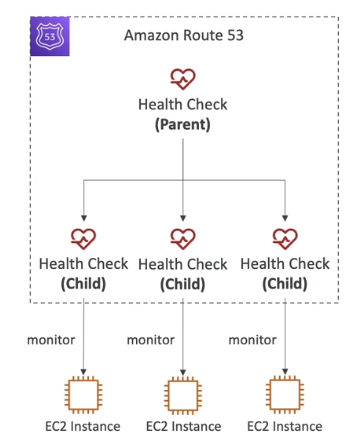

  - priavte hosted zone : clouldwatch 를 통해 priavte hosted zone 에 있는 엔드포인트로 확인가능합니다.

- faliover : 상태확인에 실패하면 보조 EC2 로 DNS 를 라우팅합니다. 따라서 2개의 IP 로 primary, secondary 를 A 레코드 설정해야 합니다. primary 가 실패하면 secondary 로 라우팅됩니다.

- geolocation : 사용자의 실제 위치를 기반으로 합니다. 아무 지역에도 속하지 않는 사용자를 위해 default 지역 설정 필요합니다.

- geoproximity routing policy : 지역별 편향 값을 통해 어느 곳으로 라우팅될 지 적용합니다. 편향값이 없다면 위치값의 중간이 되며, 편향값이 0, 50 이면 오른쪽으로 트래픽이 더 몰리게 됩니다. 아래 그림과 같습니다.

  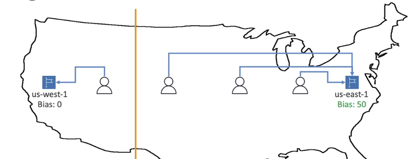

- multi-value : Simple 과 비슷하지만 헬스체크가 병행되어 연결 가능한 IP 만 반환합니다. 반환된 IP 값 중 클라이언트가 선택하면 됩니다.

- private hosted zones : 내부 사용을 위해 설정합니다. VPC 에서 enableDnsSupport 와 enableVpcHostnames 옵션을 활성화 해줘야 합니다.

# S3

- 버킷은 리전수준에서 공유되며 전역 서비스가 아닙니다.
- 객체의 키는 full path 입니다.
- 객체의 최대사이즈는 5TB 입니다. 또한 5GB 이상이면 업로드 할 때 multi-part upload 를 해야 합니다.
- tag 는 보안과 생명주기 관리에 유용합니다.

## S3 Security

**user-based** 

- IAM policy 로 명백한 거부는 없습니다.

**resource-based** 

- bucket policy - 가장 일반적인 경우입니다.
- object ACL - object 별로 ACL 을 설정합니다. 더 세밀한 보안으로 설정할 수 있습니다.
- 버킷 ACL - 버킷 수준의 ACL 입니다.

암호화키를 이용한 암호화도 가능합니다.

**버킷정책**

- user 에게 IAM ROLE 이 있거나, bucket policy 가 허용하는 경우 둘 중에 하나라도 충족되면 S3 에 접근 가능합니다.
- ec2 도 마찬가지로 iam role 이 있으면 S3 로 접근할 수 있습니다.
- Cross-Account Access 는 리소스 대상이 되는 s3 의 bucket policy 에서 Cross account 가 허용되어 있어야 합니다.
- block public access 도 있는데, 이 설정이 활성화되어있다면 공개되지 않습니다.

## 정적 웹사이트

- 버킷 정책이 버킷읽기를 허용하지 않으면 403 에러가 나게 됩니다.

## S3 버저닝

- 의도치 않은 삭제를 방지해줍니다.
- 이전 버전으로 쉽게 롤백이 가능해집니다.
- 버전관리를 중단해도 이전 버전은 사라지지 않습니다.
- 버전을 삭제하면 해당 버전이 영구 삭제됩니다.
- 객체 삭제를 하면 Delete marker 가 붙는 것이고, 실제 삭제되는 게 아닙니다. 

## S3 복제

- 복제는 CRR(cross region replication) 과 SRR(same region replication) 이 있습니다.

- 복제는 async 로 됩니다.

- 두 버킷에 버저닝이 되어있어야 합니다.
- 복제가 되려면 적절한 IAM 권한이 원본 S3 에 있어야 합니다.
- **CRR** 은 법규 준수, 레이턴시 감소, 계정 간 복사에서 사용 가능합니다. 동적 컨텐츠 전송에 유리할 수 있습니다.
- **SRR** 은 다수의 S3 버킷의 로그를 통합할 때나 개발 환경이 별도로 있어 운영환경과 개발환경 간 실시간 복제가 필요할 때 사용합니다.
- 새로운 객체만 복제대상이 되고 기존 객체를 복사하려면 S3 batch replication 을 사용해야 합니다. 기존 객체와 복제 실패한 객체를 복제할 수 있습니다.
- 만약 작업을 삭제하려면 소스 버킷에서 대상 버킷으로 삭제 마커를 복사하면 됩니다. 이 기능은 소스 버킷에서 선택할 수 있습니다.
- 원본에서 버전 ID 로 삭제하는 경우에는 대상 버킷에 삭제 자체가 반영되지는 않습니다.
- 체이닝 복제는 안됩니다. 즉 s1 -> s2, s2 -> s3 일 때 s1->s3 는 자동으로 되지 않습니다.

## 스토리지 클래스

- 모든 스토리지의 내구성은 11 9 으로 동일합니다.
- S3 standard : 빅테이터분석, 모바일 게임 어플 배포 등에 사용될 수 있습니다.
- S3 IA :  **최소 30일**을 보관해야 하며 검색 비용이 발생합니다. 재해 복구와 백업 등에 사용됩니다.
- S3 One Zone-IA :  **최소 30일**을 보관해야 하며 2차 백업으로 사용됩니다. 재생성가능한 데이터를 주로 넣습니다.
- Glacier 는 보관비용과 검색비용이 모두 있습니다.
- Glacier Instant Retrieval : 최소 90일을 보관해야 하며 밀리초내 검색이 가능합니다.
- Glacier Flexible Retrieval : 최소 90일을 보관해야 하며 클래스에 따라 검색 시간이 다릅니다. 1~5분(Expedited), 3~5시간(standard) 5~12시간(bulk, 무료)
- Glacier Deep Archive: 최소 180일을 보관해야 하며 검색시간은 12시간(standard) 48시간(bulk) 이 있습니다.
- S3 Intelligent-Tiering : 검색 비용은 없으나 모니터링과 자동티어링 비용이 있습니다.

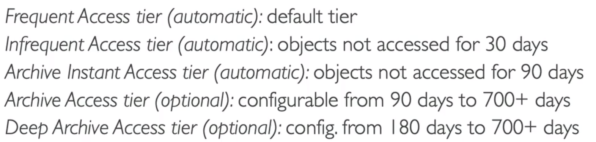

- 스토리지를 만든 이후에도 아래 티어 스토리지 클래스를 변경할 수 있습니다. 또한 이전버전을 자동으로 다른 스토리지 클래스로 변경할 수 있습니다.
- storage class analysis : 객체를 적절한 스토리지 클래스로 보내는데 도움을 줍니다. standard 와 standard IA 에서 사용 가능. 매일 리포트가 업데이트됩니다. 24~48 시간 내에 데이터 분석을 할 수 있습니다.

## Requester Pays

- 요청자가 객체 데이터 다운로드 비용을 지불하게 합니다. 요청자는 AWS 인증을 받아야 합니다.

## S3 Event Notification

- 객체 삭제, 복원, 생성, 복제 시 발생할 수 있는 이벤트 알림입니다. 이름으로 필터링이 가능합니다.
- 이벤트를 통해 객체를 **SNS, SQS, 람다, eventbridge** 로 보낼 수 있습니다. eventbridge 는 18 개 이상의 AWS 서비스에 보낼 수 있습니다.
- 이벤트를 보낼 때는 받는 쪽에서 정책 설정이 되어있어야 합니다.

## S3 성능 최적화

- multi-part upload : 객체를 나눠서 보내는 기능입니다. 5기가 이상일 때 무조건 사용해야 하며, 100 메가 이상일 때 권고됩니다.
- s3 transfer acceleration : 파일을 엣지 로케이션으로 전송해서 전송 속도를 높이고 데이터를 대상 리전에 있는 S3 버킷으로 전송합니다. 멀티파트 업로드랑 함께 사용 가능합니다.
- s3 byte-range fetches : 다운로드 속도를 높일 때 사용합니다. 특정 바이트 범위만 요청할 수 있습니다. 또한 데이터 일부분만 읽어서 해당 파일이 어떤건지 검색할 수 있습니다.
- S3 + cloudfront = 1기가 미만 object 만 캐시됩니다. 그 외에는 s3 transfer acceleration 사용해야 합니다.

## S3 Select & Glacier Select

- S3 측에서 자체적인 필터링을 거친 후 데이터를 보닙니다. 간단한 필터링에 적합합니다.

## S3 Batch Operation

- 암호화되지 않은 모든 객체를 암호화할 수 있습니다.
- ACL, 태그 변경 등 작업도 가능합니다.
- 객체의 메타데이터나 속성을 변경할 수 있습니다.
- S3 버킷 간 객체 복사에 사용됩니다.
- 재시도 관리가 가능하며, 진행 상황 추적, 알림, 보고서 생성 등이 가능합니다.
- S3 inventory 로 객체를 가져오고 S3 Select 로 배치를 실행할 객체를 가져와서 배치할 수 있습니다.
- 예를 들어 암호화 안된 객체를 모두 가져온 다음 암호화 수행하는 작업 등이 있습니다.

# S3 암호화

## 암호화 방법

- Server-Side Encryption (SSE) : SSE-S3, SSE-KMS, SSE-C
- Client-Sdie Encryption

**SSE-S3**

- aws 에서 관리하는 키로 암호화(AES-256) 합니다. 사용자가 접근할 수 없으며 암호화 헤더를 사용해서 보내야 합니다.

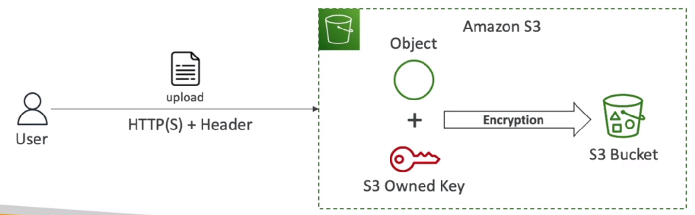

**SSE-KMS**

- KMS 로 자신의 키를 직접 관리하는 방식입니다. 사용자가 키를 직접 제어할 수 있습니다.
- ClouldTrail 로 감시 가능합니다. 마찬가지로 https 헤더에 암호화를 명시해야 합니다.
- 키를 사용하기 위해 KMS 에서 API call 이 필요합니다. 따라서 쓰로틀링 문제가 생길 수 있습니다.

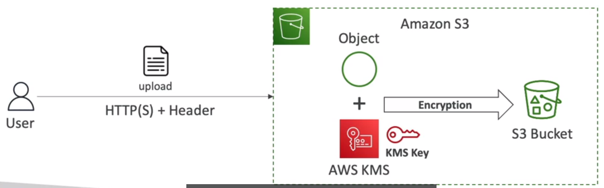

**SSE-C**

- AWS 외부에서 관리되는 키로 암호화합니다. S3 는 키를 보관하지 않습니다. 
- HTTPS 가 사용되어야 하며 헤더에 키를 포함합니다.

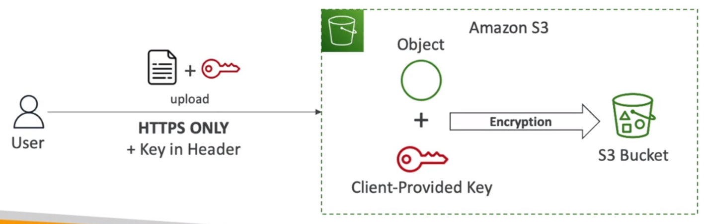

**Client-Side Encryption**

- S3 에 보내기전에 암호화해서 보냅니다.

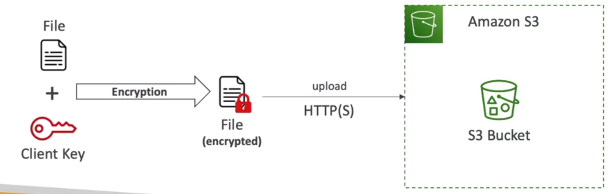

## 기본 암호 옵션 vs 버킷 정책

- 버킷 정책을 통해 암호화 헤더가 없는 api call 을 거부할 수 있습니다.

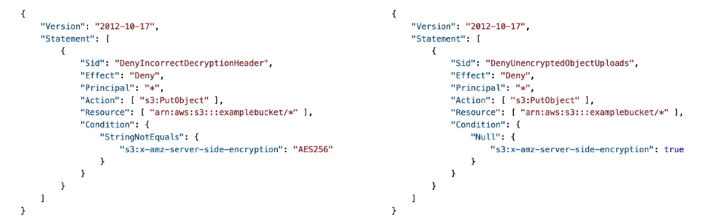

- 기본 암호화(default encyption) 를 통해서도 암호화가 가능합니다. 이때 버킷정책은 S3 에서 암호화하기 전에 평가됩니다.

## CORS

- cors 를 허용하기 위해서 permissions 에 cors setting 이 있습니다. AllowOrgin 을 설정해줘야 합니다.

## MFA Delete

- 영구 삭제를 방지하고 버저닝을 유지해줍니다.
- 버저닝을 해야 해당 기능 활성화가 가능합니다.
- 버전 리스트를 보거나, 버저닝을 시작하는 건 MFA 인증이 필요없습니다.
- 루트 계정만 MFA Delete 를 on/off 할 수 있습니다.

## S3 Access Logs

- 감사 목적으로 S3 버킷에 대한 모든 액세스를 기록할 수 있습니다.
- 대상 로깅 버킷은 같은 AWS 리전에 있어야 합니다.
- 로깅 버킷을 모니터링 버킷과 동일하게 설정하면 무한루프에 빠지는 문제점이 있으므로 로깅 버킷은 따로 설정해줘야 합니다.
- 모니터링 버킷에 액세스 로그 설정을 하면 로깅 버킷에 자동으로 정책이 설정됩니다.

## Pre-Signed URL

- 파일에 대한 Get/put 권한을 승계해줄 주 있습니다. url 을 통해 private bucket 에 접근할 수 있게 됩니다. 
- S3 콘솔로 최대 12시간, CLI 로 최대 168시간 까지 설정할 수 있습니다.

## S3 Glacier Vault Lock

- WORM 모델 적용을 위해 사용합니다.
- 수정하거나 삭제할 수 없도록 하며 객체를 절대 삭제할 수 없습니다.

## S3 Object Lock

- WORM, 모든 객체에 각각 적용할 수 있는 잠금입니다.
- 특정 객체 버전이 특정 시간 동안 삭제되는 걸 차단합니다.
- 규정준수 모드(Retention mode Compliance) - S3 glacier Vault Lock 모드와 같습니다. 누구도 객체 삭제할 수 없습니다.
- 거버넌스 모드(Retention mode Governance) - 몇몇 유저는 보존 기간을 변경하거나 객체를 삭제할 수 있습니다.
- Legal Hold :  리텐션 모드와 관계없이 객체를 무한정 보호 합니다. putObjectLegalHold IAM 권한을 가지만 법적 보존을 설정하거나 삭제할 수 있습니다.

## S3 Access Points, Object Lambda

- Access Point 를 설정하여 해당 AP 에 따라 R/W 권한을 부여하고, prefix 를 통해 S3 에 접근할 수 있습니다.
- 각 AP 마다 고유의 DNS 와 정책이 있습니다. 이를 통해 액세스 제한할 수 있습니다. 하나의 정책만 가지니까 관리가 간단해집니다.

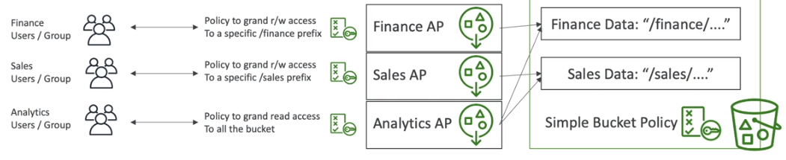

**S3 Object Lambda**

- 어플리케이션이 객체에 접근하기 전에 해당 객체를 변경하기 위해 사용합니다.
- 예를 들어 민감한 정보가 제거된 object 가 필요할 때, AP 를 만들고 람다가 AP 에 접근하도록 합니다. 그러면 S3 버킷을 새로 만들 필요가 없습니다.
- 람다 함수는 S3 Object Lambda AP 와 연결되어 있고, 어플리케이션은 해당 AP 로 접근합니다.

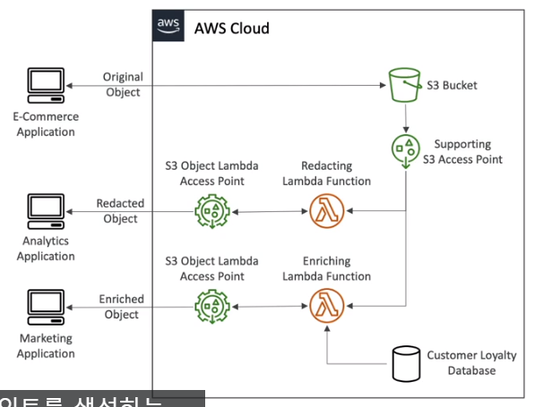

# CloudFront

- CDN 서비스로, 엣지 로케이션에 컨텐츠를 캐시해서 속도를 향상시킵니다.
- **DDOS 공격 방어가 가능합니다.**
- **signed URLs** 과 **signed cookies** 를 통해 제한된 접근 구현이 가능합니다.

## Origin(원본 제공 방식)

- S3 : OAC(Origin Access Control) 을 통해 내부망으로 CloudFront 로 접근하고 CloudFront 로 업로드 가능(ingress) 합니다.
- HTTP : ALB, EC2, S3 website 등을 Origin 으로 설정 가능합니다.

## ALB 을 원본으로 사용할 경우

- EC2 에 접근하려면 EC2 는 퍼블릭이 되어야 합니다. cloudfront 는 VPC 에 들어갈 수 없기 때문입니다.
- ALB 를 퍼블릭으로 하고 연결할 수도 있습니다. 이때는 EC2 가 private 이라도 가능합니다.

## ClouldFront Geo Restriction

- **국가를 기반**으로 Allowlist, Blocklist 를 설정할 수 있습니다.
- 사용 예시로, 컨텐츠 저작권법 등을 위해 설정할 수 있습니다.

## CloudFront pricing

- 엣지 로케이션마다 가격이 다릅니다.
- 가격 정책은 다음과 같이 3가지가 있습니다.
  - price classes : price class All, price Class 200(가장 비싼 리전은 제거), price Class 100(값싼 리전만 사용)

## Cache Invalidation (캐시 무효화)

- 전체 또는 일부의 캐시를 강제로 새로고침해서 TTL 을 무효화하는 것입니다.
- S3 버킷을 변경하고 업데이트 사항을 최대한 빨리 반영하기 위해 사용할 수  있습니다.
- CloudFront 에 `/index.html` 이나 `/images/*` 등의 invalidation 명령으로 캐시를 없앱니다.

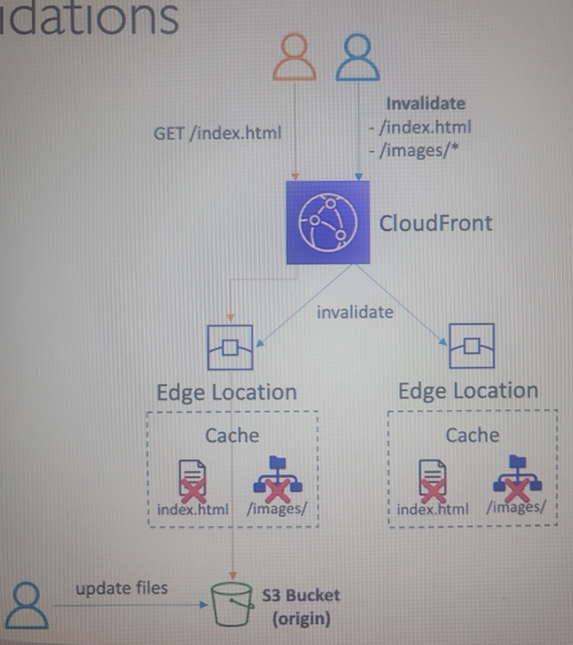

## AWS Global Accelerator

- 지연시간을 최소화하기 위해 사용합니다.
- **2개의 애니캐스트**를 이용해서 가장 가까운 엣지 로케이션으로 트래픽을 보내고, aws 망을 통해서 트래픽을 ALB 로 보냅니다.
- end-point 로 Elastic IP, EC2, ALB, NLB, private/public ip 를 설정할 수 있습니다.
- 리전 장애 조치가 신속하게 일어납니다.
- 아무것도 캐시하지 않기 때문에 캐시문제가 없습니다.
- 어플리케이션에 대해 헬스체크를 하고, 헬스 체크에 실패하면 다른 리전의 ALB 로 보냅니다.
- **DDoS 공격을 방어할 수 있습니다.**
- 애니캐스트 2개를 사용하기 때문에 글로벌하게 고정 IP 를 필요로 할 때도 유용하게 사용할 수 있습니다.

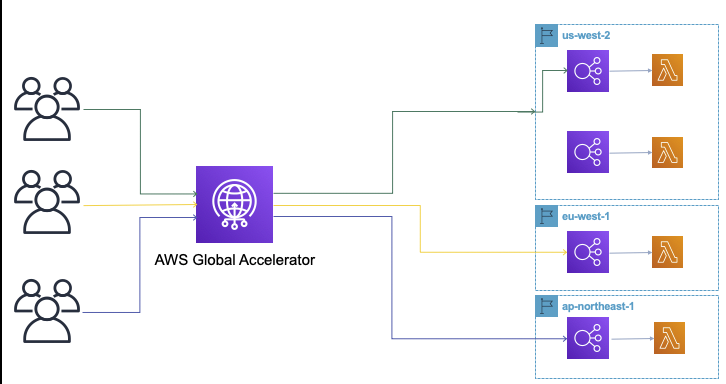

# AWS 스토리지 추가 기능

## snow Family

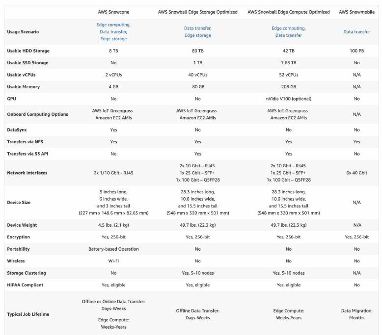

**snowcone**

- 컴퓨팅 가능한 작은 장치로 엣지컴퓨팅, 데이터 스토리지 용입니다. 24TB 까지 권장됩니다.
- 공간의 제약을 받을 때 사용할 수 있으며 배터리와 케이블은 직접 준비해야 합니다. 
- AWS DataSync 로 AWS 로 재전송이 가능합니다. 인터넷이 없는 곳에서 사용하기 적합니다.
-  용량은 8TB 입니다. 엣지컴퓨팅을 위해 2CPU, 4GB 메모리, wifi 가 있고 USB-C 충전 혹은 배터리 사용이 가능합니다. 

**snowball edge** 

- TBs, PBs 를 전송할 때 사용합니다. 1PB 까지 권장됩니다.
- Snowball Edge Storage Optimized 와 Snowball Edge Compute Optimized 가 있습니다. 
- 15개까지는 snowball edge 를 합칠 수 있습니다. 엣지컴퓨팅을 위해 하나의 스토리지로 클러스팅 가능합니다.
- Snowball Edge Compute Optimized : 80TB of HDD,52CPU, 208GB 메모리, Optional GPU, 42TB usable storage
-  Snowball Edge Storage Optimized : 42TB of HDD, 40CPU, 80GB 메모리, Object storage clustering available

**snowmobile**

- 각각의 차량은 100PB 용량이며 1EB 까지 전송가능합니다. 10PB 이상 전송하려면 snowball 보다 낫습니다.

**EdgeComputing**

- 인터넷이 없는 곳에서의 컴퓨팅 서비스입니다. (데이터 처리, 머신 러닝, 미디어 transcoding 등) 
- AWS IoT Greengrass 서비스로 컴퓨터 안에서 EC2 나 람다함수를 실행할 수 있습니다.
- 장기 배포 옵션을 사용할 수 있습니다. (1년에서 3년 빌리면 할인)

**OpsHub**

- 컴퓨터, 노트북에 설치하는 소프트웨어로, Snow 장치에 연결하게 합니다.
- SnowFamily 를 구성 및 사용할 수 있도록 합니다. 
- 파일 전송, EC2 관리, 모니터링, AWS 서비스 사용 등도 가능합니다.

## Snowball into Glacier

- SnowFamily 에서 Glacier 로 바로 넣을 수 없고 S3 에 넣고 생명주기 정책으로 glacier 로 넣어야 합니다.

## Amazon FSx

- 완전 관리형 서비스로, 타사의 고성능 파일 시스템을 실행시킵니다.
- NetApp ONTAP, OpenZFS, Windows File Server, Lustre 가 있습니다.

**FSx for Windows File Server**

- 완전 관리형 Windows 파일 서버 공유 드라이브입니다.
- SMB 프로토콜과 Windows NTFS 지원합니다.
- Microsoft Active Directory 통합을 지원하므로 사용자 보안을 추가할 수 있고 ACL 로 사용자 할당량을 추가해 액세스를 제어할 수 있습니다.
- Linux EC2 에도 마운트가 가능합니다.
- 10s of GB/s, 수백만 IOPs, 100s PB 데이터 저장 등의 성능을 보입니다.
- SSD, HDD 를 선택해서 사용할 수 있습니다.
- VPN 이나 Direct Connect 로 접근 가능합니다.
- 고가용성을 위해 다중 AZ 설정 가능합니다.
- 재해복구 목적으로 S3 에 매일 백업 됩니다.

**FSx for Lustre**

- 머신러닝, HPC 등에 사용됩니다. (Linux + cluster)
- 100s GB/s, 수백만 IOPS, 1ms 미만 레이턴시 성능을 보입니다.
- S3 를 파일 시스템처럼 읽을 수 있습니다. 그리고 연산 출력값을 다시 S3 에 쓸 수 있습니다.
- VPN 이나 Direct Connect 로 접근 가능합니다.
- FSx for Lustre는 ‘핫 데이터(hot data)’를 병렬로, 그리고 분산식으로 모두 처리할 능력을 제공할 뿐만 아니라 ‘콜드 데이터’를 간단히 Amazon S3에 저장할 능력도 제공합니다. 

**FSx File System Deployment Options (Lustre 배포 옵션)**

- Scratch File System
  - 임시 스토리지로 데이터 복구가 안됩니다.
  - 초과 버스트를 사용가능해서 성능을 Persistent 보다 6배로 낼 수 있습니다. (초당 200메가)
  - 단기 처리 데이터에 쓰입니다.
  - 데이터 복제가 없어서 비용을 최적화가 가능합니다.
  - FSx 의 데이터 저장소로 S3 버킷을 선택적으로 사용 가능합니다.
- Persistent File System
  - 장기 스토리지이며 같은 AZ 에서 데이터 복제해서 저장합니다.
  - 민감한 데이터의 장기 처리 및 스토리지가 가능합니다.
  - 데이터 저장소로 S3 버킷을 선택적으로 사용 가능합니다.

**FSx for NetApp ONTAP**

- NFS, SMB, iSCSI 프로토콜과 호환됩니다.
- EC2, ECS, EKS, macOS, VMware Cloud, AppStream, Amazon WorkSpaces, On-premises Server 등과 사용 가능합니다. 즉, 호환가능 폭이 넓습니다.
- 오토스케일링됩니다.
- 복제와 스냅샷 기능이 있으며 데이터 압축이나 중복제거가 가능합니다.
- 지정시간 복제 기능 있습니다. 신속히 복제가 가능하며 테스트 워크로드로 사용 가능합니다.

**FSx for OpenZFS**

- NFS 프로토콜과 호환됩니다.
- ZFS 에서 사용되는 워크로드를 AWS 로 옮긴 것입니다.
- 스냅샷, 압축을 지원하지만 데이터 중복제거 기능은 없습니다.
- 지정시간 동시 복제 기능 있습니다.

## 스토리지 Gateway

- 재해 복구, 백업, 스토리지 확장 등 목적으로 사용할 수 있습니다.
- 온프레미스 캐시나 파일 접근을 위한 로우 레이턴시를 위해 사용합니다.
- 게이트웨이는 회사의 온프레미스에 설치되어야 합니다.
- 회사의 온프레미스가 없으면 Storage Gateway hardware appliance 를 설치해야 합니다.

**S3 File Gateway**

- S3 버킷(Glacier 를 제외)을 사용합니다.
- 최대 1Gbps 입니다.
- NFS, SMB 프로토콜로 S3 File Gateway 에 요청하고, File Gateway 는 S3 에 HTTPS 요청으로 데이터를 보냅니다.
- Glacier 로 넣으려면 수명주기 정책 사용해야 합니다.
- 캐시를 위해서 최근에 접근한 파일만 File Gateway 에 보관할 수도 있습니다.
- 버킷에 액세스하려면 각각 File Gateway 마다 IAM Role 이 있어야 합니다.
- SMB 프로토콜을 사용하면 사용자 인증을 위해 Active Directory 와 통합해야 합니다.

**FSx File GateWay**

- FSx for Windows File Server 에 접근 가능합니다.
- 이미 온프레미스 시스템에서 FSx for Windows File Server 는 접근가능하지만 게이트웨이를 생성하면 자주 액세스하는 데이터를 캐시할 수 있습니다.
- SMB, NTFS, Active Directory 가 호환 가능합니다.

**Volume Gateway**

- Block 스토리지로 S3 가 백업하는 iSCSI 프로토콜 사용합니다.
- 볼륨이 EBS 스냅샷으로 저장되어 필요에 따라 온프레미스 볼륨으로 복구 가능합니다.
- 두 가지 옵션이 있습니다.
  - 캐시 볼륨 : 낮은 레이턴시, 최근 데이터 접근
  - stored 볼륨 : 전체 데이터 세트가 온프레미스에 있으며 주기적 S3 백업이 있음

**Tape Gateway**

- 물리적인 테이프를 사용해 백업을 하는 회사가 백업에 테이프 대신에 클라우드를 활용할 수 있게 합니다.
- VTL(Virtual Tape Library) 은 S3 와 Glacier 사용합니다.

## AWS Transfer Family

- FTP 프로토콜로 파일을 전송하고 싶을 때 사용합니다.
- FTP, FTPS, SFTP 프로토콜 지원(암호화 지원)
- multi-AZ 를 적용할 수 있습니다.
- S3 나 EFS 로 파일을 전송합니다.

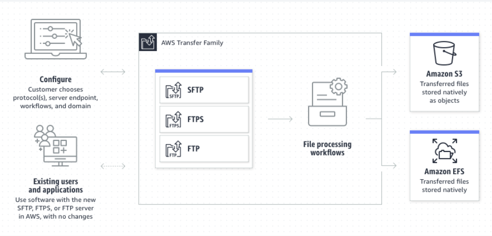

## DataSync

- 데이터를 동기화하며 대용량의 데이터를 옮길 수 있습니다.
- 온프레미스나 다른 AWS cloud 에서 AWS 로 옮길 때 사용합니다.
- Glacier 를 포함한 모든 S3 스토로지 클래스, EFS, FSx 로 저장할 수 있습니다
- 일정을 지정하여 주기적인 데이터 동기화가 가능합니다. (시간, 일, 주)
- 파일 권한과 메타데이터 저장 기능이 있습니다.(보안 관련) 따라서 파일을 다른 곳으로 옮길 때 파일의 메타데이터를 보존할 수 있습니다.
- 10Gbps 를 사용할 수 있으며 네트워크 성능을 위해 대역폭 제한이 가능합니다.
- dataSync 를 사용하려는데 네트워크 용량이 따라주지 못한다면 Snowcone 을 사용할 수 있습니다. Snowcone 안에 DataSync 가 있기 때문입니다.

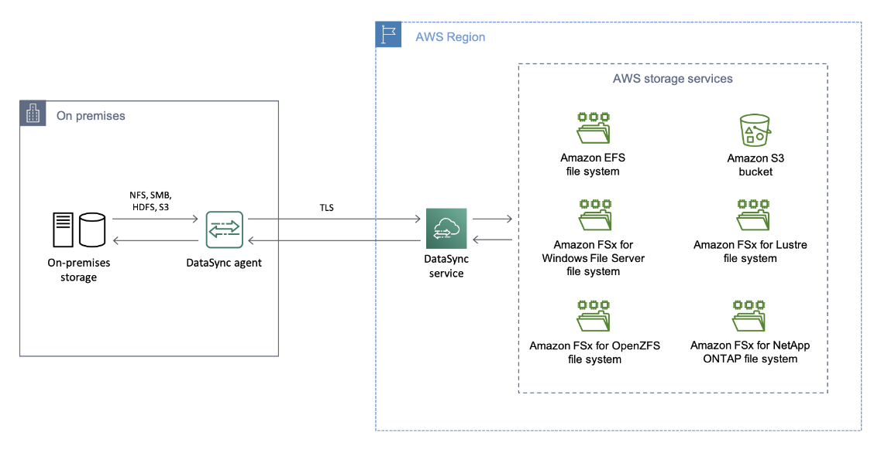

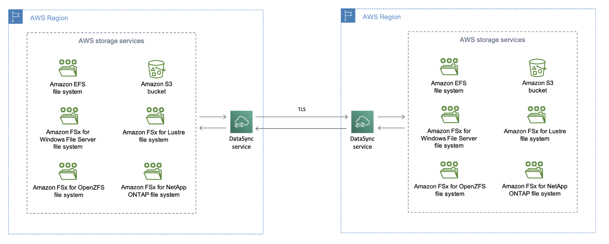

# SQS

- SQS 대기열에 메세지를 보내는 주체는 producer, 메세지를 처리하는 주체는 consumer 입니다.
- 애플리케이션 디커플링을 위해 사용합니다.

## standard queue

- 무제한 처리량을 얻을 수 있습니다.
- 각 메세지는 기본값으로 4일동안 대기열에 남습니다. 최대 14일입니다.
- 지연시간이 짧아서 빠르게 응답이 가능합니다.
- SQS 메시지는 256KB 미만입니다.
- 중복 메세지가 있을 수도 있습니다.

## producing message

- SendMessageAPI 를 통해서 SDK 를 사용해 SQS 로 보냅니다.

## consuming message

- 소비자는 EC2, 서버, 람다, 온프레미스 등이 될 수 있습니다.
- consumer 가 한번에 최대 10개씩 메세지를 받습니다.
- 이후 메세지를 처리합니다.
- 메세지를 처리하고 나서 DeleteMessage API 로 메세지를 삭제합니다.

## SQS Security

-  HTTPS 로 in-flight 암호화가 가능합니다. 디폴트값입니다.
- KMS 키로 At-rest 암호화가 가능합니다.
- Client-side 암호화도 가능합니다. 하지만 SQS 에서 해당 메세지를 해석할 수는 없습니다.
- Access 제어를 위한 IAM 정책 설정이 가능합니다.
- SQS Acess policies 설정이 가능합니다. (S3 버킷 정책과 비슷합니다.) 교차계정이나 SQS 큐에 다른 서비스를 허용할 때 유용합니다.

## Message Visibility Timeout

- 한 소비자가 메세지를 폴링하고 다른 소비자가 접근할 수 없도록 시간 설정하는 것입니다. 30초가 기본 값이며 0초부터 12시간까지 설정할 수 있습니다.
- 시간 내에 메세지가 삭제되지 않으면 다시 보이게 되고 다른 소비자가 접근할 수 있습니다.
- 따라서 해당 시간 내에 처리되지 않으면 메세지가 두번 처리될 수도 있습니다. 
- ChangeMessageVisibility API 를 통해 소비자는 메세지 처리를 위해 시간이 더 필요하다는 것을 SQS 에 알립니다. 이는 프로그래밍을 따로 해야 합니다.

## SQS Long Polling

- 소비자가 대기열에 메세지가 없다면 대기하게 됩니다.(1초 ~ 20초)
- 그러다가 메세지가 도착하면 바로 메세지를 처리하게 됩니다.
- API 호출 숫자를 줄여서 효율성을 증대하고 레이턴시를 감소시킵니다.
- 롱폴링을 구성하는 방법은 두가지가 있습니다.
  - 대기열 레벨에서 구성하여 아무 소비자로부터 롱 폴링을 활성화하는 방법이 있습니다.
  - WaitTimeSeconds 를 소비자별로 설정할 수 있습니다.

## FIFO Queue

- 대기열에 첫번째로 도착한 메세지가 대기열을 떠날 때도 첫번쨰가 되도록 정렬되어야 합니다.
- 처리량 한계가 있습니다. 300msg/s 또는 배치를 했을 때 3000msg/s 입니다.
- 중복을 제거해주는 기능도 포함됩니다. (옵션)
- 만들 때 이름에 .fifo 를 붙여야 합니다.
- 만들 때 content-based deduplication 을 체크하면 중복 방지 가능합니다.

## SQS + ASG

- 처리량을 늘리려면 소비자를 늘려야 합니다. 따라서 ASG 와 함께 쓸 수 있습니다.

- CloudWatch Metric 의 ApproximateNumberOfMessages 를 사용하여 알람 설정이 가능합니다. 특정 수를 넘으면 알람이 ASG 에게 스케일아웃을 하게 합니다.

- 사용 예시는 다음과 같이, 많은 처리량에도 DB 에 누락없이 보관해야 할 때 사용할 수 있습니다.

  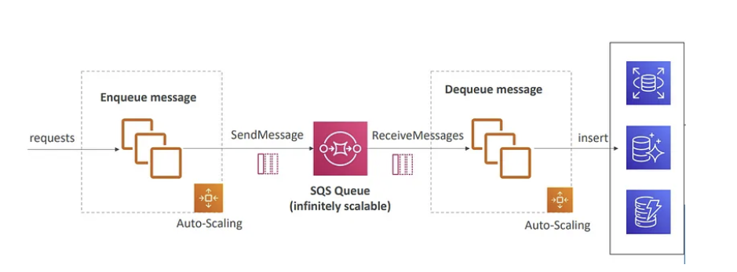

- 어플리케이션 티어를 디커플링하는 데에도 사용됩니다.

  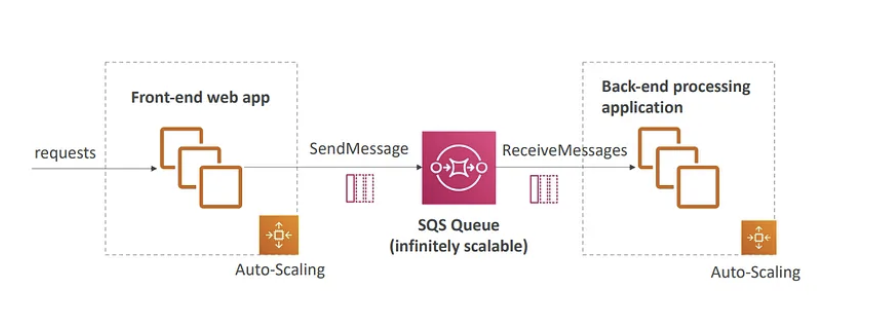

# SNS

- Pub/Sub 를 통해 구독자(서비스들) 가 주제에 대한 이벤트를 수신할 수 있습니다.
- Event producer 는 1개의 SNS 주제에 대한 이벤트만 송신합니다.
- 많은 Event reciever(구독자) 가 SNS 주제를 수신할 수 있습니다.
- 모든 구독자가 메세지 수신합니다.
- 주제별 최대 1250만 구독자가 가능합니다.
- 계정 당 가질 수 있는 주제는 최대 10만 개입니다.
- 구독자는 이메일, SMS, HTTPs end point, SQS, 람다, Firehose (S3, RedShift) 등이 될 수 있습니다.
- producer 는 cloudWatch, AWS budgets, ASG, S3, CloudFormation, AWS DMS, 람다, DynamoDB, RDS envent 등이 될 수 있습니다.

## how to publish

- 토픽과 구독자를 만든 뒤 토픽을 Publish 합니다.
- 또는 플랫폼 어플리케이션을 만들고 플랫폼 엔드포인트를 만든 다음 플랫폼 앤드포인트로 Publish 합니다.

## Security

- SQS 와 비슷합니다.
- HTTPS 로 in-flight 암호화가 가능합니다. 디폴트값입니다.
- KMS 키로 At-rest 암호화가 가능합니다.
- Client-side 암호화도 가능합니다.
- Access 제어를 위한 IAM 정책 설정이 가능합니다. 모든 SNS API 가 IAM 정책으로 규제됩니다.
- SNS Acess policies 설정이 가능합니다. (S3 버킷 정책과 비슷합니다.) 교차계정이나 SQS 큐에 다른 서비스를 허용할 때 유용합니다.

## SNS + SQS Fan out 패턴

- 여러 SQS 에 같은 메세지를 보내고 싶을 때 사용합니다.
- SNS 로 보내고 SQS 가 구독하게 합니다.
- 이를 위해서 SQS 큐 Access Policy 가 SNS 의 쓰기작업을 허용해야 합니다.
- 리전 간 delivery 도 가능합니다.
- SNS 에는 FIFO 가 가능합니다.(이름은 .fifo)
- SNS 에서 메세지 필터링이 가능합니다. 메세지 필터링을 하려면 JSON 으로 필터링 정책을 적용해야 합니다. 예를 들어 SNS 토픽 중 주문완료된 메세지만 필터링해서 SQS 에 넣을 수 있습니다.

# Kinesis

- 실시간 스트리밍 데이터를 손쉽게 수집하고 처리하여 분석할 수 있습니다.

## Kinesis Data Streams

- 데이터 스트림을 수집하여 처리하고 저장합니다.
- 큰 규모의 데이터 흐름을 다룹니다.
- 여러 개의 샤드로 구성되어 있고 기본적으로 미리 프로비저닝해야 합니다.
- 데이터는 모든 샤드로 분배됩니다.
- 생산자가 데이터를 Kinesis Data Streams 로 보내면 데이터는 partition key, data blob 로 구성됩니다.
- 파티션 키는 레코드가 이용할 샤드를 결정하는 데 사용됩니다.
- 데이터 블롭은 값 자체입니다.
- 초당 1MB/sec or 1000msg/sec per shard 의 처리량을 가집니다. 여섯개의 샤드가 있으면 초당 6MB or 6000개 메세지를 처리할 수 있습니다.
- 소비자는 APPs(KCL, SDK 에 의존), 람다, kinesis data firehose, kinesis data analytics 등이 있습니다. 
- 소비자로 보내는 레코드는 partition key, sequence no., Data Blob 으로 이루어집니다.
- 샤드 당 초당 2 MB 처리량을 모든 소비자가 공유하거나 팬아웃 방식이라면 소비자마다 샤드당 1초에 2MB 씩 받을 수도 있습니다. 
- 보존기간은 하루~365일이며 데이터를 다시 보거나 처리할 수 있습니다.
- 데이터가 일단 들어가면 삭제할 수 없습니다.
- 파티션 키를 기반으로 데이터를 정렬할 수 이습니다.
- Provisioned mode : 샤드 수를 정하고 직접 스케일링해야 합니다.
- On-demand mode : 용량이 자동으로 조절 됩니다. 디폴트 값은 초당 4MB 나 4000 개 메세지 처리합니다. 처리량에 따라 요금이 부과됩니다.

**Security**

- IAM 정책을 사용하여 샤드를 생성하거나 접근 권한 제어가 가능합니다.
- HTTPS 로 in-flight 암호화가 가능하며 미사용 데이터(샤드 안) 는 KMS 로 암호화 가능합니다.
- VPC 엔드포인트로 EC2 가 접근할 수 있습니다.
- CloudTrail 로 API call 모니터링을 할 수 있습니다.

## Kinesis Data Firehose

- 데이터 스트림을 AWS 내부나 외부의 데이터 저장소로 읽어들입니다.
- Apps, Client, SDK, KPL, Kinesis Data Stream, Cloudwatch, AWS IoT 등이 데이터 생산을 할 수 있습니다.
- 람다 기능을 사용하여 데이터를 변환할 지 결정할 수 있습니다. (옵션)
- 배치를 통해 write 를 하며 별도 코드 작성이 불필요합니다.
- S3, Redshift(S3 에 먼저 써서 복사해야 함), ElasticSearch 등을 수신처로 정할 수 있습니다.
- HTTP 엔드포인트가 있는 자체 API 를 보유하고 있다면 커스텀 수신처로 데이터를 보낼 수 있습니다.
- 모든 데이터 혹은 실패한 데이터를 S3 로 보낼 수 있습니다.
- 서버리스이며 용량 자동 확장이 가능합니다. 데이터를 쓴 만큼 요금이 부과됩니다.
- 실시간은 아니며 실시간에 가까운 서비스입니다. (최소 60초 지연)
- 버퍼를 통해 해당 버퍼가 다 차면 보냅니다.(1~128MiB,권장 5MiB). buffer interval 을 활용해 버퍼가 다 차지 않아도 보낼 수 있도록 설정합니다. (60~900초, 권장 300초)

## Kinesis Data Streams  vs Firehose 

| streams                | firehose                                              |
| ---------------------- | ----------------------------------------------------- |
| 대용량 스트리밍 서비스 | S3, RedShift, custom HTTP, ES 에 스트리밍 데이터 저장 |
| 커스텀 코드 작성 가능  | 완전 관리형                                           |
| 200ms 미만의 실시간    | 실시간에 가까움 (최소 60초 버퍼링)                    |
| 스케일링 관리 필요     | 오토 스케일링                                         |
| 데이터 저장 1~365일    | 데이터 저장소 없음                                    |
| 데이터를 리플레이 가능 | 데이터를 리플레이 불가능                              |
| 여러 개의 목적지       | 단일 목적지                                           |

## Kinesis Data Analytics

- SQL 언어나 Apache Flink 를 활용하여 데이터 스트림을 분석할 수 있습니다. 

## Kinesis 와 SQS FIFO 에 대한 데이터 정렬

- kinesis 는 파티션 키를 수신받아서 각 파티션 키의 해시값에 따라 샤드를 할당합니다. 따라서 파티션 키에 따라 들어가는 샤드는 항상 동일합니다. 샤드 숫자에 따라 소비자 수가 정해집니다.
- SQL FIFO 의 그룹 ID 를 통해 그룹을 구분할 수 있습니다. 그룹 ID 가 많아질 수록 소비자가 많아진다는 뜻입니다. 그룹 ID 에 따라 동적으로 소비자 수를 변경하고 싶을 때 사용할 수 있습니다.

## SQS vs SNS vs Kinesis

- SQS
  - 데이터를 풀링해서 소비하고 데이터는 소비 후 없어집니다
  - 작업자나 소비자 수에 제한이 없습니다
  - 처리량 프로비저닝이 필요없습니다
  - 순서를 보장하려면 FIFO 큐를 사용해야 합니다
  - 메세지에 지연기능이 있습니다. 
- SNS
  - 게시/구독 모델로 메세지의 복사본을 보냅니다
  - 데이터가 SNS 로 보내지면 지속되지 않습니다. 따라서 읽었는데 오류가 발생하면 다시 읽을 수 없습니다
  - 프로비저닝이 필요없으며 팬아웃 패턴으로 SQS 와 결합할 수 있습니다.
- Kinesis
  - 데이터가 지속되기 때문에 재생이 가능합니다. 따라서 실시간 빅데이터 분석, ETL 등에 사용됩니다. 
  - 샤드량을 미리 정해야 합니다. 
  - 1~365일 동안 메세지가 보존됩니다. 
  - provisioned 모드와 ondemand 모드가 있습니다.

# Amazon MQ

- SNS, SQS 는 AWS 프로토콜 사용합니다. 반면 온프레미스에서 MQTT, AMQP, STOMP, Openwire, WSS 프로토콜 사용합니다.
- 온프레미스에서 서비스를 AWS 로 옮기면서 기존 프로토콜을 사용하고 싶을 때 Amazon MQ 사용합니다.
- RabblitMQ 와 ActiveMQ 두 가지 기술을 위한 관리형 메세지 브로커 서비스입니다.
- 확장성이 크지 않습니다.
- 고가용성을 위해 다중 AZ 설정이 가능합니다. (active 와 Standby 로 구성, EFS 와 함께 구성)
- SQS 처럼 보이는 큐 기능과 SNS 처럼 토픽 서비스를 사용할 수 있습니다.

# ECS

## EC2 Launch Type

- AWS 에서 컨테이너를 실행하는 것은 ECS 클러스터에서 ECS 를 실행하는 것입니다.
- 각각의 EC2 는 ECS 클러스터에 등록하는 ECS 에이전트를 실행시켜야 합니다.
- ECS 를 시작하면 잠깐 멈췄다가 실행됩니다.
- EC2 인스턴스 프로파일입니다.

## Fargate Launch Type

- 인프라를 프로비저닝하지 않아 서버리스입니다.
- ECS 태스크 정의만 생성하면 필요한 CPU 나 RAM 에 따라 ECS 태스크를 AWS 가 대신 실행합니다.
- EC2 보다 관리가 쉽습니다.

## IAM Roles for ECS

**EC2 Instance Profile**

- EC2 생성 유형(Launch Type) 만 EC2 인스턴스 프로파일를 생성합니다.
- ECS 에이전트만 EC2 인스턴스 프로파일을 사용하며 그 프로파일을 이용해 API 를 호출합니다. 그럼 인스턴스가 저장된 ECS 서비스가 CloudWatch 로그에 API 호출을 해서 컨테이너 로그를 보내고 ECR 로부터 도커 이미지를 가져옵니다.

**ECS Task Role**

- ECS Task 는 ECS Task Role 을 가집니다. 이는 EC2 와 Fargate 시작 유형 모두에 해당됩니다.
- 두개의 태스크가 있다면 각자에 특정 역할을 만들 수 있습니다. 역할이 각자 다른 ECS 서비스는 다른 서비스에 연결될 수 있습니다.

## Load Balancer 통합(EC2, Fargate)

- ALB 와 NLB 를 사용할 수 잇습니다. 처리량이 높을 때나 AWS Private Link 와 함께 사용할 때 NLB 을 사용합니다.

## Data Volumes(EFS)(EC2, Fargate)

- EFS 를 사용하면 두 시작유형 모두에게 사용할 수 있습니다.
- ECS task 에 파일 시스템을 직접 마운트할 수 있습니다.
- Fargate + EFS = Serverless

## ECS Auto Scaling

- 세 개 지표 (CPU, RAM, 타겟 당 요청수) 로 오토 스케일링을 합니다.
- 타겟 트래킹(CloudWatch metric 으로 스케일링), 스텝 스케일링(CloudWatch 알람으로 스케일링), 스케줄 스케일링(특정 시간/날짜에 스케일링) 이 있습니다.
- 태스크 레벨의 ECS 오토 스케일링은 EC2 클러스터 확장과 다릅니다.
- 따라서 EC2 오토스케일링이 필요없다면 Fargate 를 사용하면 됩니다.
- ASG 를 사용해서 CPU 사용이 급등할 때 사용할 수 있습니다.
- 또는 ECS Cluster Capacity Provider 를 사용하여 새 태스크를 실행할 용량이 부족하면 자동으로 ASG 가 사용됩니다. (RAM, CPU 등) 권장되는 방법입니다.

## ECS tasks invoked by EventBridge

- S3 버킷이 EventBridge 와 연관되어, EventBridge 가 ECS task 를 만들 수 있습니다. 그러면 ECS 태스크는 S3 에서 객체를 받아서 처리하고 Amamzon DynamoDB 로 결과를 보냅니다. 이때 S3, DynamoDB 에 대한 ECS Task Role 이 필요합니다.

## ECS tasks invoked by EventBridge schedule

- EventBridge 가 1시간마다 ECS Task 를 만드는 이벤트를 발생시키면 ECS 가 S3 의 파일에 대한 배치작업을 할 수도 있습니다.

## ECS - SQS Queue Example

- ECS 가 SQS 큐와 연결되어 있다면 큐가 쌓일 때 오토스케일링으로 ECS Task 를 늘릴 수 있습니다.

## ECR

- ECR 은 Elastic Container Registry 로 도커이미지를 저장합니다.
- private, public 저장소에 저장할 수 있습니다.
- EC2 인스턴스에 IAM 역할을 지정해서 ECR 에 대한 접근을 하용합니다. 그러면 ECR 에서 이미지를 끌어올 수 있습니다.
- 이미지에 대한 취약점 분석, 버저닝, 이미지 태그, 이미지 생명주기 관리 등을 합니다.

## Amazon EKS

- Amazon Elastic Kuberneetes Service 의 약자로 관리형 쿠버네틱스 서비스를 실행합니다.
- ECS 와 API 가 다릅니다. 쿠버네틱스는 표준화 오픈소스입니다.
- EC2 실행 모드와 Fargate 모드가 있습니다.
- 회사가 온프레미스에서 쿠버네틱스를 쓰고 있는데 AWS 로 옮기고 싶을 때 사용할 수 있습니다.
- 쿠버네틱스는 클라우드 애그노스틱으로 Azure, Google cloud 등 모든 클라우드에서 지원됩니다.
- 이름에 Pods 가 있으면 EKS 와 관련됩니다.
- 노드 타입
  - 관리형 노드 그룹 : EC2 인스턴스를 생성하고 관리합니다. 온디맨드나 스팟 인스턴스를 지원합니다.
  - 자체 관리형 노드 : 노드를 직접 만들어서 EKS 클러스터로 등록하고 ASG 로 관리합니다. 사전 빌드된 AMI 인 EKS 최적화 AMI 를 사용하면 시간을 절약할 수 있습니다. 온디맨드나 스팟 인스턴스를 지원합니다.
  - **EKS Fargate** : 노드를 관리할 필요가 없으며 컨테이너만 실행하면 됩니다.
- 데이터 볼륨을 지정하려면 EKS 클러스터에 스토리지 클래스 매니페스트를 지정해야 합니다.
- 컨테이너 스토리지 인터페이스(Container Storage Interface) 라는 규격 드라이버를 활용합니다.
- EBS, EFS(for Fargate), FSx for Lustre, FSx for NetApp ONTAP 을 지원합니다.

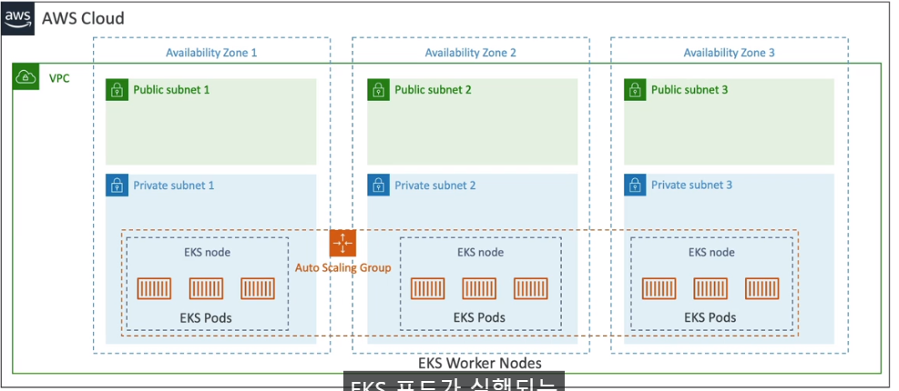

## App Runner

- 웹 어플리케이션과 API 를 쉽게 배포할 수 있습니다.
- 인프라나 컨테이너, 소스 코드 필요없습니다.
- 소스 코드와 도커 이미지를 통해서 세팅을 구성(CPU, RAM, AutoScaling, Health Check) 합니다.
- 오토스케일링, 고가용성, 로드 밸런싱, 암호화 기능을 제공합니다.
- 신속한 프로덕션 배 포가 필요할 때 사용합니다.

# 서버리스

- 서버리스는 프로비저닝이 필요없는 서비스를 말합니다.

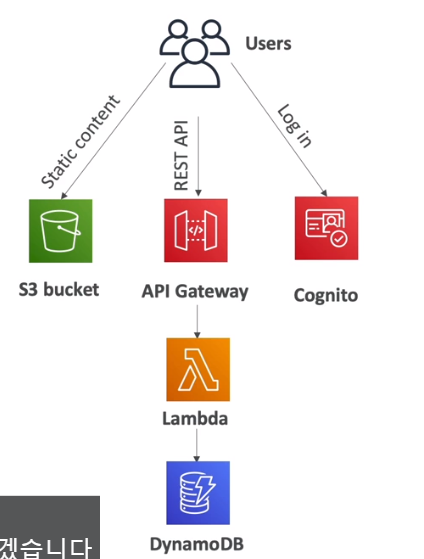

# 람다함수

- 함수 당 최대 10GB 램을 프로비저닝할 수 있습니다.

- 람다 컨테이너 이미지는 람다 런타임 API 를 구현해야 합니다.

- 람다에 컨테이너를 실행할 떄 런타임 API 를 구성하지 않으면 ECS, Fargate 에서 구현해야 합니다.

- 아래는 서버리스 섬네일 생성 플로우입니다.

  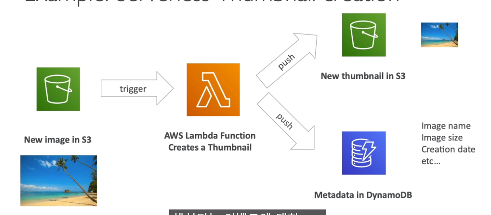

- Serverless CRON job : CRON 이란 EC2 에 작업을 생성하는 방법인데, 5분마다, 월요일 10시마다 작동됩니다. 이때 동작하지 않을 때 EC2 가 낭비됩니다. 따라서 CloudWatch event 규칙이나 EventBridge 규칙을 만들고 1시간마다 작동하게 하면서 람다 함수가 결합하면 서버리스 CRON 을 만들 수 있습니다.

- 첫 백만 건 무료이며 백만 건마다 20센트 요금이 부과됩니다. 40만GB 램까지 무료이 이후 60만GB 램부터 1달러가 부과됩니다.

## 람다 제한

- 실행 메모리는 128MB ~ 10GB 입니다.
- 최대 실행시간은 15분입니다.
- 환경변수는 4KB 를 가질 수 있습니다.
- 큰 파일이 왔을 때 임시용량을 가질 수 있습니다. 용량은 512MB ~ 10GB 입니다.
- 최대 1000개 까지 실행 가능하지만 더 증가시킬 수 있습니다.
- 압축시 최대크기가 50mb 이거나 압축하지 않았을 때 250mb 까지 허용됩니다. 이걸 넘어가면 tmp 디렉토리에 저장됩니다.
- 배포시에도 환경변수 크기는 4KB 입니다.

## couldFront Fuctions & 람다@엣지

- cloudfront 배포에 사용합니다.
- 사용 목적
  - 웹사이트 보안 및 프라이버시
  - 동적 어플레케이션을 엣지에서 사용
  - 검색 엔진 최적화
  - 실시간 이미지 변환
  - AB 테스트
  - 사용자 인증 및 권한 부여

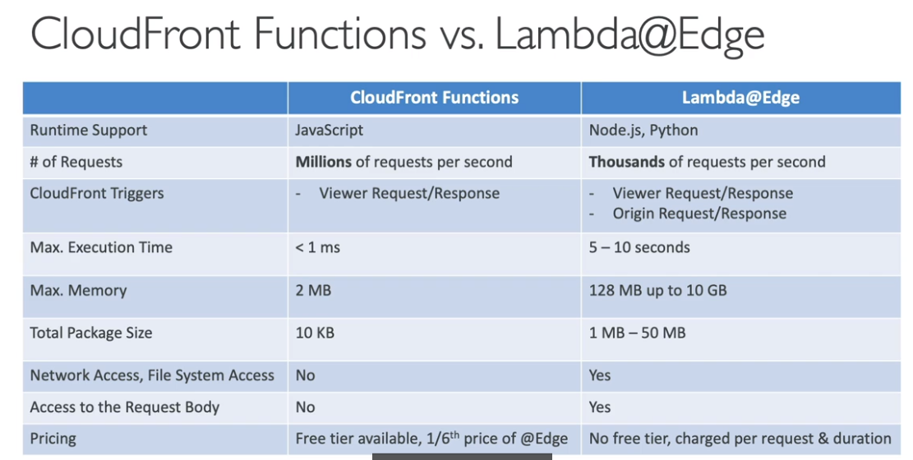

**couldFront Fuctions** 

- js 로 작성된 경량화된 함수로 확장이 잘되고 레이턴시가 낮습니다. 초당 백만 개의 요청을 처리합니다.
- 뷰어 요청과 응답을 수정할 때만 사용합니다.
- 모든 코드가 클라우드프론트에서 사용됩니다.
- 최대 실행 시간은 1ms 미만입니다.
- 사용
  - 캐시 키를 정규화
  - 헤더를 조작
  - URL 을 다시 쓰거나 리다이렉트
  - 인증 및 권한 요청

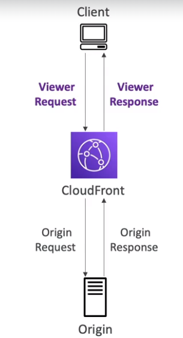

**람다@엣지**

- nodejs 나 파이썬으로 작성합니다.
- 람다 엣지를 통해 Cognito 와 연결할 수 있습니다.
- 초당 수천 개의 요청을 처리할 수 있습니다.
- 모든 cloudfront 요청 및 응답을 수정할 수 있습니다.
- 함수는 us-east-1 에서만 작성할 수 있습니다.
- 실행에 5~10 초 가량 걸립니다.
- 사용
  - 여러 라이브러리 로드 가능
  - 네트워크 액세스로 외부 서비스에서 데이터를 처리할 수 있음
  - 파일 시스템이나 HTTP 요청 본문에도 바로 액세스 가능

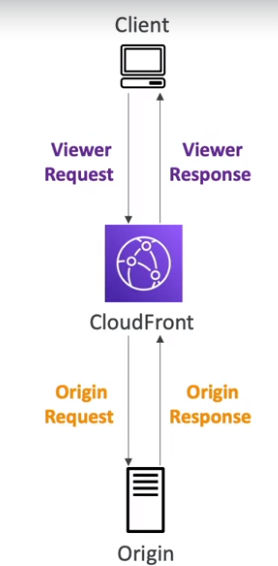

## 람다 in VPC

- 람다는 VPC 외부에서 수행됩니다. 따라서 VPC 안에 있는 리소스에 대한 접근이 불가능합니다.
- DynamoDB 는 AWS 의 퍼블릭 리소스이기 때문에 람다함수가 접근이 가능합니다.
- 이를 해결하기 위해 VPC 에서 람다를 실행해야 합니다.
- VPC ID, 서브넷, 보안 그룹을 추가합니다.
- 람다가 서브넷에 ENI 를 생성합니다.
- 하지만 VPC 내부에서 RDS 에 접근했을 때 람다 함수가 갑자기 많이 생성되어 접근하면 RDS 로드가 상승해 시간 초과 등의 문제로 이어집니다. 이를 해결하기 위해 RDS 프록시를 사용해서 람다함수를 프록시에 연결해야 합니다.

# DynamoDB

- 데이터가 다중 AZ 간 복제됩니다.
- 트랜잭션 지원 기능이 있습니다.
- 초당 수백만 개의 요청을 처리할 수 있습니다.
- 보안과 관련된 모든 기능은 IAM 과 통합되어 있습니다.
- 오토스케일링이 가능하며 프로비저닝이 필요없습니다.
- standard & IA table class 로 총 2개 클래스가 있습니다.
- **항목의 최대 크기는 400KB 로 큰 객체를 저장할 때는 적합하지 않습니다.**
- 스키마를 빠르게 전개해야 할 때 선택할 수 있습니다.
- 키는 파티션 키와 선택사항인 정렬 키(sort key) 로 구성됩니다.
- 프로비저닝 모드 : 미리 read, write 를 예측 가능할 때 사용합니다. 프로비저닝된 RCU, WCU 만큼 비용을 지불합니다. 오토스케일링이 가능하기는 합니다.
- 온디맨드 모드 : 읽기/쓰기 용량이 워크로드에 따라 자동 확장됩다. 사용한 만큼 비용을 지불합니다. 프로비저닝 모드보다 빠르게 확장됩니다.

## DynamoDB Accelerator(DAX)

- DAX 는 고가용성 완전 관리형 메모리 캐시입니다.
- 마이크로 수준의 레이턴시를 가집니다.
- 기존 DynamoDB API 와 호환되기 때문에 바로 DAX 를 만들면 됩니다.
- 캐시 기본 TTL 은 5분입니다.
- DAX 는 DynamoDB 앞에 있고 개별 객체 캐시와 쿼리와 스캔캐시를 처리하는 데 유용합니다.
- 집계 결과를 저장할 때는 ElastiCache 가 좋고, 대용량 연산에 DAX 가 좋습니다.

## DynamoDB Stream Processing

- 테이블의 모든 수정사항의 스트림을 생성할 수 있습니다.
- DynamoDB 테이블의 변경사항을 실시간으로 반응하는 데 좋습니다. (웰컴 이메일을 보내는 등)
- 실시간 사용 분석, 파생 테이블 삽입, 리전간 복제, 테이블 변경 사항에 대한 람다 실행 등을 위해 사용할 수 있습니다.
- DynamoDB Stream : 보존 기간 24시간, 소비자 수 제한, 람다 트리거와 함께 쓰면 좋음, 자체적으로 읽기를 실행하려면 DynamoDB Stream Kinesis 어댑터 사용
- Kinesis Data Stream : 보존 기간 1년, 더 많은 소비자 수, 람다, Kinesis Data Analytics, Kinesis Data Firehose, Glue 등 연결되는 데이터 처리 서비스가 많음

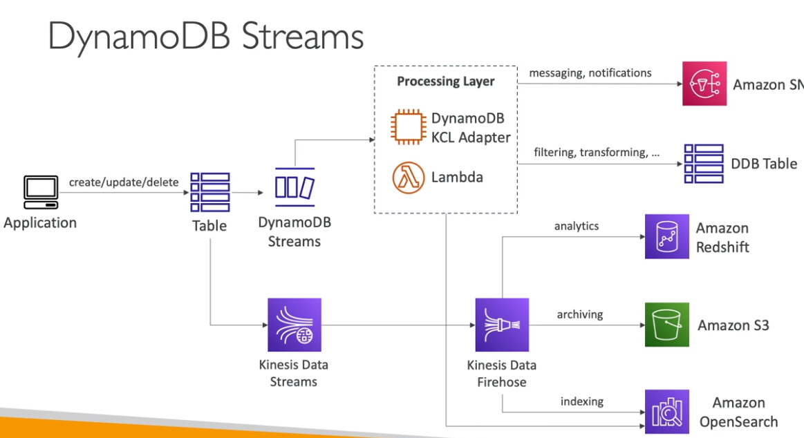

## DynamoDB Global Tables

- 여러 리전 간에 복제가 가능한 테이블입니다.
- 양방향 복제가 가능합니다.
- 복수의 리전에 짧은 레이턴시로 접근할 수 있습니다.
- 글로벌 테이블을 활성화 하려면 DynamoDB Stream 을 활성화 해야 합니다.

## DynamoDB TTL

- TTL 을 정의해서 만료처리 및 삭제할 수 있습니다.
- 웹 세션 핸들링에 사용할 수 있습니다.

## DynamoDB Backups for disaster recovery

- point in time recovery(PITR) 로 지속적인 백업이 가능합니다.
- 35일 동안 지속되며 활성화를 선택할 수 있습니다.
- 복구 진행 시 새로운 테이블이 생성됩니다.
- 온디멘드 백업 : 직접 삭제할 때 까지 지속됩니다. 레이턴시에 영향을 주지 않습니다.
- AWS Backup service : 백업에 수명 주기 정책을 활성화할 수 있습니다. 리전간 백업을 복사할 수 있습니다.

## DynamoDB Integration with S3

- S3 에 데이터를 내보낼 수 있는데 PITR 이 활성화되어야 합니다.
- 테이블을 내보내도 테이블의 읽기 용량이나 성능에 영향을 주지 않습니다.
- Athena 로 데이터 분석/감사 목적/S3 데이터에 대한 ETL 등 대규모 변경 후 다시 DynamoDB import 등에 사용합니다.
- JSON 이나 ION 포맷으로 보냅니다.
- S3 에서 import 할 때는 CSV, JSON, ION 포맷으로 import 하고, 쓰기 용량에 영향을 주지 않습니다.
- 가져올 때 발생한 오류는 CloudWatch 에 기록됩니다.

# API Gateway

- 웹소켓 프로토콜, HTTP API, REST API 을 지원합니다.
- API 버저닝을 핸들링합니다.
- 인증, 권한 등 보안 기능을 수행합니다.
- API 키 생성할 수 있으며 스로틀링 핸들링이 가능합니다.
- 스웨거나 open API 로 신속하게 API 정의가 가능합니다.
- API Gateway 수준에서 요청과 응답을 변형하거나 유효성을 검사해 올바른 호출이 실행되게 합니다.
- 최대 29초 이후 타임아웃이 되며 비활성화가 가능합니다.

## Integrations

- 람다 : 람다 지연호출을 위해 사용합니다. 람다함수를 REST API 로 노출시키는 가장 쉬운 방법입니다. 리소스 정책 설정이 필요합니다.

- HTTP : 온프레미스의 내부 HTTP API, ALB 등에 사용합니다. 속도 제한, 캐싱, 사용자 인증, API 키 추가 기능이 있기 때문입니다.

- AWS 서비스 : 어떤 AWS API 라도 노출 가능합니다. API gateway 로 SQS 에 직접 메세지를 넣을 수 있습니다. 인증, 퍼블릭 배포, 속도제한을 위해 사용합니다.

- 예시 : Kinesis Data Streams 에 사용자가 데이터는 전송할 수 있지만 AWS 자격 증명은 가질 수 없도록 할 때

  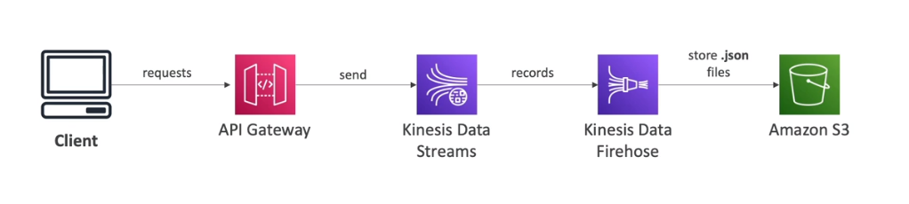

## 배포방법 (Endpoint Types)

- Edge-Optimized(default) : 전 세계 누구나 액세스 가능하며 cloudfront 엣지 로케이션으로 라우팅되어 레이턴시가 낮습니다.
- Regional : 모든 사용자는 API Gateway 를 생성한 리전과 같은 리전에 있어야 합니다. 자제 CloudFront 배포를 생성할 수 있습니다. 엣지 최적화 배포와 동일한 효과를 보이며 더많은 권한이 있습니다.
- Private : VPC 내에서만 엑세스할 수 있습니다. 인터페이스 VPC 엔드포인트 사용해야 합니다. 엑세스를 정의할 때는 리소스 정책을 사용합니다.

## API Gateway Security

- 사용자 식별 방법 : IAM Role, Cognito 가 있으며 자체 로직을 실행하려면 사용자 지정 권한 부여자를 사용하면 됩니다. (Custom Authorizer 이며 람다 함수입니다.)
- ACM 과 통합하여 HTTPS 를 사용할 수 있습니다.

# Step Functions

- 서버리스 워크플로를 시각적으로 구성할 수 있는 기능입니다.
- 주로 람다함수를 오케스트레이션하는 데 사용합니다.
- 시퀀싱, 병행 실행, 조건 설정, 타임아웃, 에러 처리 기능이 있습니다.
- 람다뿐만 아니라 EC2, ECS, 온프레미스 서버, API Gateway, SQS 등을 워크플로에 넣을 수 있습니다.
- 사람이 개입해서 승인을 해야만 진행되는 단계를 설정할 수 있습니다.

# Serverless 설계 예시

# DocumentDB

- 몽고 DB 와 같습니다.
- JSON 데이터를 저장, 쿼리, 인덱스 합니다.
- 완전 관리형 DB 로 3개의 가용영역에 복제됩니다. 자동으로 10GB 단위로 증가되며 최대 64TB 까지 증가합니다.
- 초당 수백만건 요청의 워크로드를 처리할 수 있도록 설계되었습니다.

# Neptune

- 소셜 네트워크, 추천 엔진, 위키피디아 등과 같은 그래프 DB 에 활용됩니다.
-  3AZ 에 걸쳐 최대 15개의 읽기 전용 복제본을 생성합니다.

# Keyspaces

- **관리형 Apache Cassandra (NoSQL)**
- 서버리스, 완전 관리형이며 트래픽에 따라 자동으로 확장/축소 됩니다.
- 멀티 AZ 에 세번 복제됩니다.
- 쿼리를 수행하려면 Cassandra Qeury Language(CQL) 를 실행합니다.
- 온디맨드, 프로비저닝 모드가 있습니다.
- 암호화, 백업, PITR 35일을 지원합니다.

# QLDB

- Quantum Ledger Database 입니다.
- 금융 트랜잭션 원장을 가지게 됩니다.
- 서버리스, 완전 관리형, 3개의 가용영역에 복제됩니다.
- 시간에 따른 모든 변경내역을 검토하는 데 사용됩니다.
- DB 에 무언가를 쓰면 삭제하거나 수정할 수 없습니다.

# Timestream

- 시계열 데이터베이스입니다.
- 자동 오토스케일링이 됩니다.
- SQL 과 호환됩니다.
- 전송중 및 DB 암호화를 지원합니다.

# Athena

- S3 버킷에 저장된 데이터 분석에 사용하는 서버리스 쿼리 서비스입니다.
- 표준 SQL 언어로 쿼리합니다.
- S3 버킷의 이동없이 바로 분석합니다.
- CSV, JSON, ORC, Avro 의 양식을 읽습니다.
- Quicksight 를 통해 리포트와 대시보드를 생성합니다.
- **서버리스 SQL 엔진을 사용한 S3 데이터 분석이 나오면 Athena 입니다.**

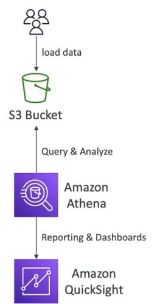

## Athena Performance Improvement

- 스캔된 데이터 TB 당 요금이 책정됩니다. 따라서 데이터를 적게 스캔할 유형의 데이터를 사용해야 합니다.
- 열 기반으로 필요한 열만 확인하므로 성능이 향상됩니다.
- 따라서 Apache Parquet 나 ORC 가 추천됩니다.
- Glue 를 이용하여 데이터를 Apache Parquet 나 ORC 으로 변환 가능합니다.
- 데이터를 압축하여 검색하면 성능이 향상됩니다.
- 데이터세트를 분할해서 열별로 특정 값을 붙입니다. 스캔할 때 어떤 데이터를 스캔할 지 정할 수 있습니다.
- 128MB 이상의 큰 파일을 사용, 파일이 클수록 스캔과 검색이 쉽습니다.

## Athena Federated Query

- Athena 는 S3 뿐만 아니라 어떤 곳의 데이터도 쿼리할 수 있습니다.
- 람다가 실행하는 Data Source Connectors 로 Federated Queries 를 실행하여 RDS, DynamoDB, ClouldWatcch Logs 등에 접근합니다.

# RedShift

- 데이터베이스이자 분석 엔진입니다.
- 데이터가 PB 규모로 확장됩니다.
- 프로비저닝한 인스턴스에 대해 비용을 지불합니다. 비용을 절약하려면 예약 인스턴스를 사용합니다.
- SQL 문 사용합니다.
- RedShift 는 Athena 와 다르게 인덱싱을 하기 때문에 성능이 더 좋습니다.
- S3 의 임시 쿼리라면 Athena 가 좋은 사용 사례이지만 쿼리가 많고 복잡하며 조인하거나 집계하는 등 집중적인 데이터웨어하우스면 RedShift 가 좋습니다.

## RedShift Snapshots & Disaster Recovery

- Multi-AZ 모드가 없고 한 가용영역에 저장됩니다.
- 스냅샷을 찍어서 백업할 수 있고 point-in-time 백업이 있으며 S3 내부에 변경된 사항만 저장됩니다.
- 새로운 RedShift 클러스터에 스냅샷을 복원할 수 있습니다.
- 자동 모드 : 스냅샷을 8시간 또는 5GB 마다 찍도록 자동화할 수 있고 스냅샷의 보존 기간을 설정할 수 있습니다.
- 수동 모드 : 스냅샷을 삭제할 때까지 보존합니다.
- 자동이든 수동이든 스냅샷을 다른 AWS 리전에 자동으로 복사하도록 RedShift 를 구성하여 재해 복구 전략을 수립할 수 있습니다.

## RedShift 에 데이터 적재

- **Kinesis Data Firehose** : Firehose 에서 S3 를 통해 RedShift 에 적재할 수 있습니다.
- **Firehose -> S3 -> (인터넷 or VPC) -> RedShift** 순서로 적재할 수 있습니다. S3 에 IAM Role 이 설정되어야 합니다.
- JDBC 드라이버를 통해 Redshift 에 적재할 수 있습니다. 큰 배치로 데이터를 쓰는 것이 좋으며 한 번에 한 행씩 쓰는 건 비효율적입니다.

## RedShift Spectum

- S3 에 있는 데이터를 RedShift 를 사용해 분석하지만 RedShift 에 로드하지는 않습니다.
- 쿼리는 FROM S3. 로 시작해야 합니다.
- 클러스터에서 프로비저닝한 것보다 처리능력이 더 높습니다.

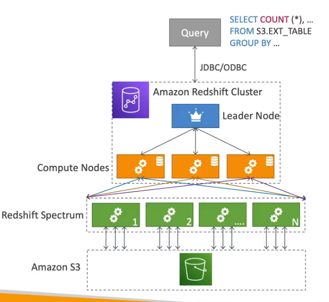

# OpenSearch(ElasticSearch)

- 부분적으로 일치하는 필드를 포함해 모든 필드를 검색할 수 있습니다.

- 어플리케이션에서 검색 기능을 제공할 때 많이 사용됩니다.

- 인스턴스의 클러스터를 생성해야 합니다. 자체 쿼리 언어가 있습니다. (서버리스가 아님)

- Kinesis Data Firehose, AWS IoT, CloudWatch Logs 로부터 데이터를 받을 수 있습니다.

- Cognito, IAM, KMS 암호화, TLS 등으로 보안을 강구합니다.

- 아래와 같이 특정 단어로 검색하고, M5 는 그 결과를 가지고 해당 item 을 DynamoDB 에서 얻습니다.

  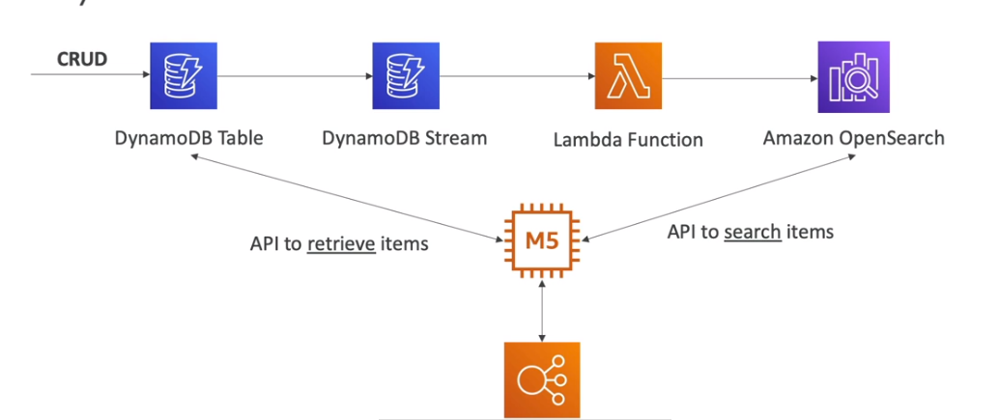

- 아래와 같이 ClouldWatch Log 와 결합할 수 있습니다.

  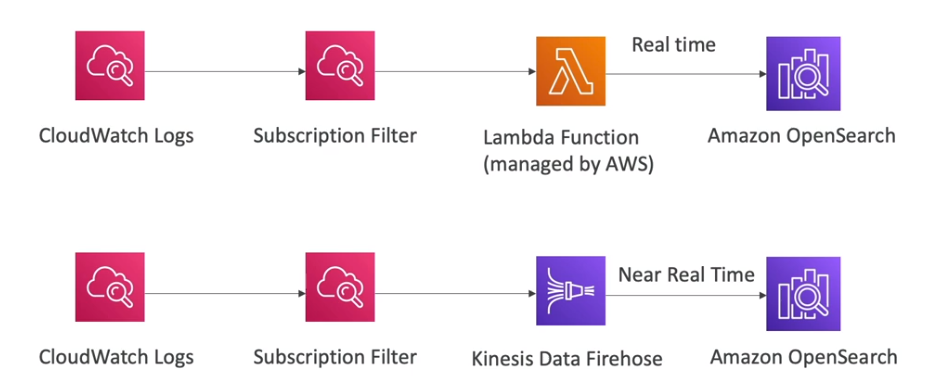

- 아래와 같이 Kinesis Data Streams 와 결합할 수 있습니다.

  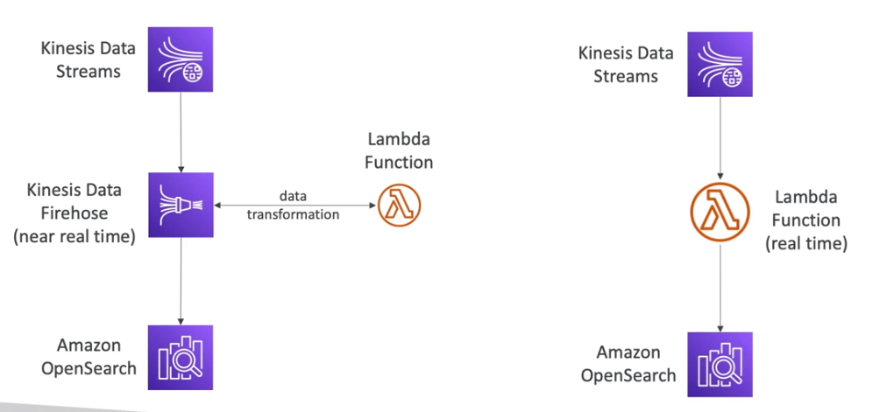

# EMR

- 빅데이터 작업을 위한 하둡 클러스터 생성에 사용됩니다. 따라서 하둡 단어가 나오면 EMR 을 고르면 됩니다.
- 하둡 클러스터는 프로비저닝 해야 하며 수백개의 EC2 로 이루어져있습니다.
- EMR 은 빅데이터 전문가가 사용하는 여러 도구와 함께 제공됩니다. (Apache Spark, HBase, Presto, Flink)
- 오토 스케일링이 가능하고 스팟 인스턴스와 통합할 수 있습니다.
- 마스터 노드, 코어 노드(태스크 실행, 데이터 저장), 태스크 노드(선택사항, 태스크만 실행, 주로 스팟 인스턴스)
- 온디맨드 옵션, 예약 인스턴스(최소 1년, 마스터 노드와 코어 노드에 적용), 스팟 인스턴스(태스크 노드)

# QuickSight

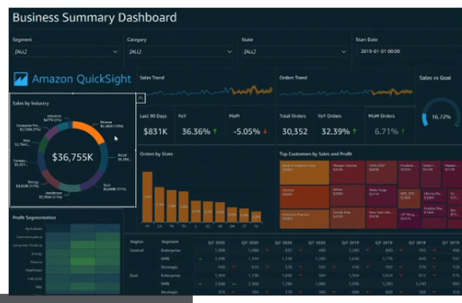

- 서버리스 머신러닝 비즈니스 인텔리전스입니다.

- 대화형 대시보드를 생성합니다.

- 오토 스케일링이 가능합니다.

- 세션당 비용을 지불합니다.

- RDS, Aurora, Athena, RedShift, S3 등과 연결합니다.

- 인메모리 SPICE 엔진을 사용하며 데이터를 직접 가져올 때 사용됩니다. 다른 DB 에 연결되어 있을 때는 사용되지 않습니다.

- 아래와 같이 통합되어 사용됩니다.

  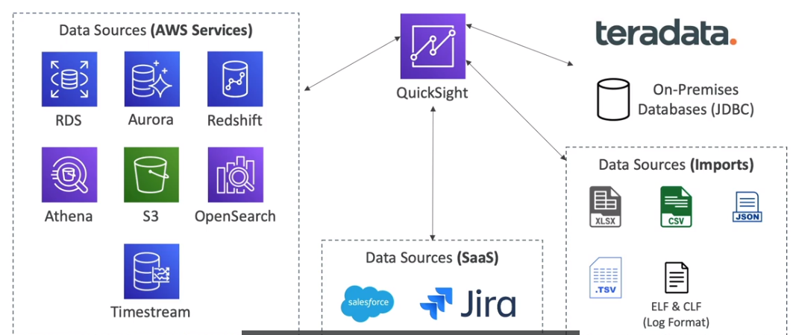

## Dashboard & Analysis

- User 와 Groups 를 지정할 수 있는데 Groups 는 엔터프라이즈 버전만 가능합니다. (IAM 과 다른 개념)
- 대시보드는 읽기 전용입니다.
- 특정 사용자나 그룹과 대시보드 공유가 가능합니다. 액세스 권한이 있는 사용자는 기본 데이터를 볼 수 있습니다.

# AWS Glue

- ETL 서비스입니다. (데이터 추출, 변형 및 로드)

- 서버리스 서비스입니다.

- Parquet 포맷으로 변경해서 Athena 와 함께 사용하기 좋습니다. 람다나 EventBridge 와 결합해서 ETL 을 자동실행 할 수 있습니다.

  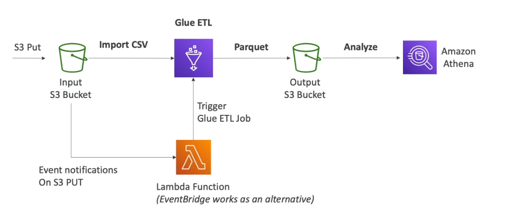

## Glue Data Catalog

- 모든 DB 를 읽어서 메타 데이터를 추출하고 Table 로 만듭니다.

- Athena, Redshift Spectrum, EMR 모두 Glue Data Catalog 를 백그라운드에서 활용합니다.

  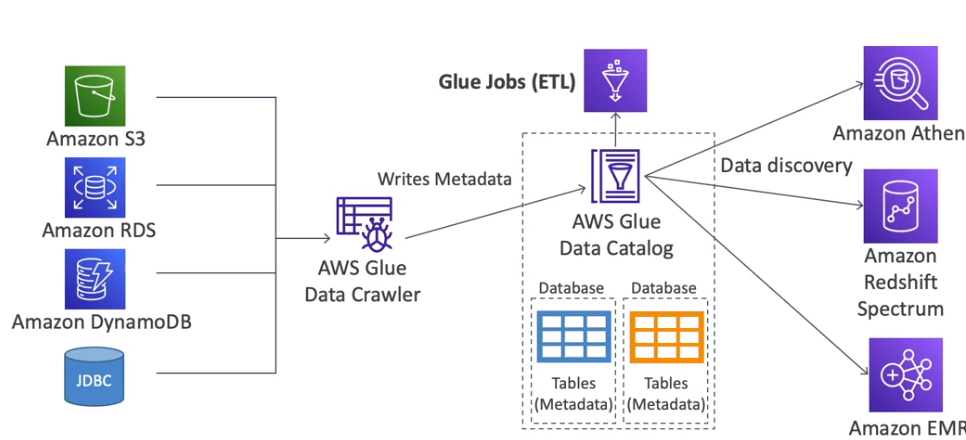

## Glue 시험 나올 만한 내용

- Glue Job Bookmarks : 새 ETL 작업 시 이전 데이터의 재처리를 방지합니다.
- Glue Elastic Views : SQL 을 사용해 여러 데이터 스토어의 데이터를 결합하고 복제합니다. 여러 DB 에 걸친 가상 테이블을 생성할 수 있습니다.
- Glue DataBrew : 데이터를 정리하고 정규화합니다.
- Glue Studio : ETL 을 위한 GUI 입니다.

# Lake Formation

- 데이터 분석을 위한 데이터 레이크 (중앙 집중식 저장소) 를 생성하는 완전 관리형 서비스입니다.

- 데이터 검색, 정제, 변환을 도우며 중복제거도 가능합니다.

- 블루프린트를 제공합니다.

- 중앙화된 권한을 위해 사용합니다.

- 애플리케이션에서 열, 행 수준의 세분화된 액세스 제어를 할 수 있습니다.

- Lake Formation helps you **manage fine-grained access** for internal and external customers from a centralized location and in a scalable way.

  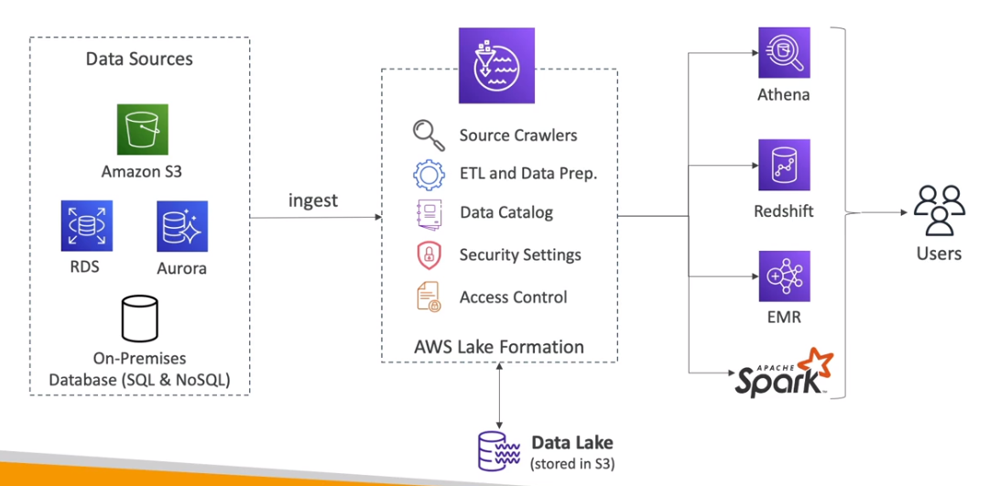

# Kinesis Data Analytics

## For SQL applications

- 서버리스, 오토스케일링입니다.

- Kinesis Data Streams 나 Kinesis Data Firehose 로부터 데이터를 받아서 SQL 쿼리문을 실행합니다.

- S3 에서 참조 데이터를 조인할 수도 있습니다.

- 그러고 나서 여러 대상에 전송합니다. (Kinesis Data Stream, Kinesis DateFirehose)

  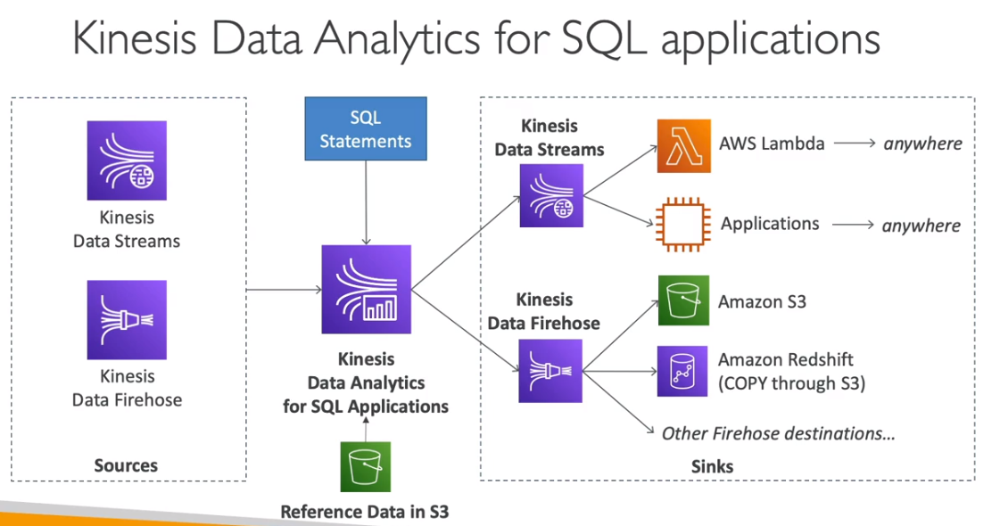

## For Apache Flink

- 고급 쿼리가 필요하거나 MSK 로부터 스트리밍 데이터를 읽는 능력이 필요할 때 사용합니다.

- 컴퓨팅 리소스를 자동 오토스케일링하며, 체크포인트와 스냅샷으로 구현되는 어플리케이션 백업이 있습니다.

- Kinesis Data Firehose 는 읽지 못합니다. 

  

# MSK - Managed Streaming for Apache Kafka

- Amazon Kinesis 의 대안입니다.

- 클러스터를 생성, 수정, 삭제하도록 합니다.

- 서버리스로 사용가능합니다. (프로비저닝, 용량 관리 필요없음)

- 원한다면 EBS 에 1년간 데이터를 보관할 수 있습니다.

  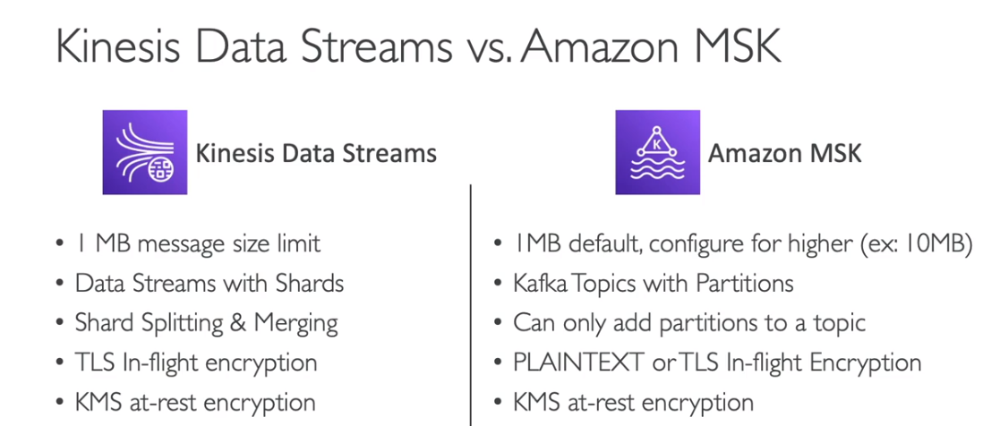

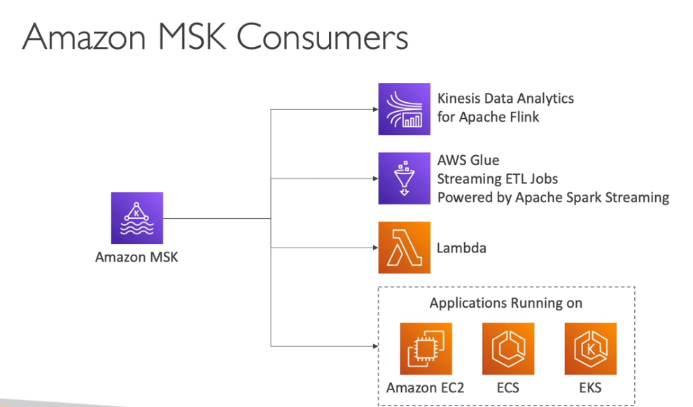

# 빅데이터 수집 파이프 라인 설계

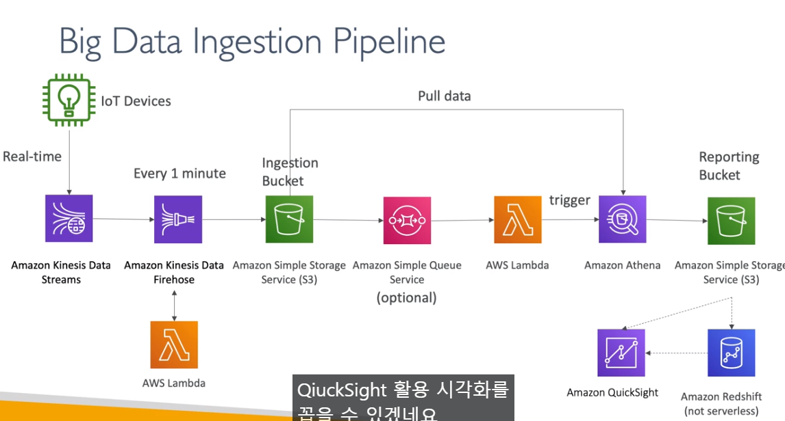

# Machine Learning

## Rekognition

- 기계 학습을 통해 이미지와 비디오 처리합니다.
- 이동경로를 따라가므로 경기 분석도 가능합니다.
- Content Moderation : 불쾌감이나 부적절한 내용을 탐지하는 기술입니다.
- 이후 A2I 에서 인적 검토를 할 수 있습니다. (옵션)

## Transcribe

- 음성을 텍스트로 자동 변환해줍니다.
- Redaction 을 사용하여 PII 를 자동으로 제거할 수 있습니다.

##  Polly

- 택스트를 음성으로 변환해줍니다.

## Translate

- 번역 서비스입니다.

## Lex

-  Alexa 구현 기술(빅스비) 입니다.

## Amazon Connect

- 가상 고객 센터로 Connect 가 Lex 를 사용하고 Lex 가 람다를 호출하여 로직을 수행합니다.

## Comprehend

- NLP 서버리스 서비스입니다.
- Comprehend Medical 은 의료 관련 문서에서 정보를 추출해냅니다.

## SageMaker

- 높은 수준의 머신러닝 서비스로 머신러닝 모델을 만들고 구축하기 위해 사용합니다.

## Forecast

- 머신러닝을 사용해 에측을 도와주는 서비스입니다.

## Kendra

- 머신러닝을 통한 문서 검색 서비스입니다.
- 문서를 통해서 질문에 대한 답을 추출합니다.

## Personalize

- 실시간 맞춤화 추천 (마케팅 등)

## Textract

- 택스트, 손글씨, 데이터를 통해서 텍스트를 추출

# CloudWatch

- CloudWatch 는 모든 AWS 서비스의 메트릭스를 제공합니다.
- 지표당 최대 측정 기준은 최대 10개 입니다.
- 클라우드와치 메트릭스를 다른 목적지로 근 실시간 보낼 수 있는데, Kinesis Data Firehose 등이 될 수 있습니다.
- 서드 파티 서비스에도 보낼 수 있습니다.

## CloudWatch Logs

- 로그를 그룹화합니다.

- 로그 만료일을 설정할 수 있습니다.

- S3, Kinesis Data Stream, Kinesis Data Firehose, 람다, Elastic Search 에 보낼 수 있습니다.

- 표현식을 통해 로그를 필터링하고 알람을 만들 수 있습니다.

- S3 Export : 실시간은 아니며 스트림하려면 구독 필터를 사용해야 합니다.

  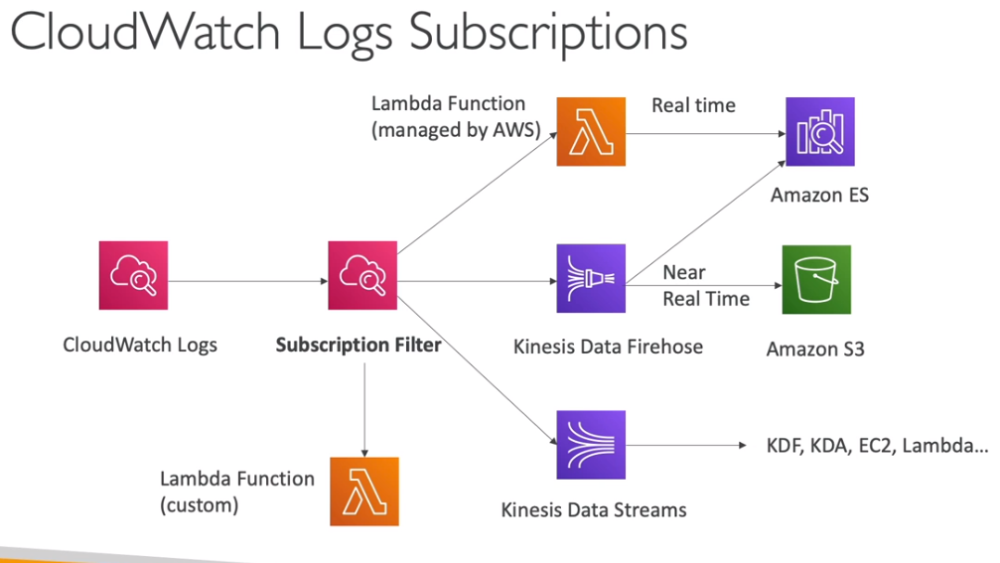

- 각각 계정의 구독필터는 멀티 계정, 멀티 리전에서 하나의 Data Firehose 로 모을 수 있습니다.

## Cloudwatch Logs for EC2

- Cloudwatch logs agent 를 설치해야 합니다.
- EC2 인스턴스에 IAM 역할이 있어야 합니다.
- cloudwatch logs agent : 로그만 보냅니다.
- cloudwatch unified agent : 로그와 시스템 레벨 메트릭스도 보냅니다. SSM 파라미터 스토어를 통해 중앙 집중식 환경을 구성합니다.

## CloudWatch 경보

- OK, INSUFFICIENT_DATA, ALARM 상태가 있습니다.
- 타겟 : EC2 동작, ASG 트리거, SNS 알람 등이 있습니다.
- EC2 복구를 위해 다른 EC2 로 옮기거나, 종료, 리부트 등의 동작을 설정할 수 있습니다.
- Logs 를 통해 알람을 발생시키고 SNS 로 보낼 수 있습니다.

## EventBridge

- Cron 작업 예약이 가능하며 람다함수 트리거해서 스크립트를 실행합니다.

- 이벤트 패턴에도 반응할 수 있습니다. root 계정 로그인 등 이벤트가 발생하면 메세지가 발생(SNS) 합니다.

- EC2, CodeBuild, S3, TrustedAdvisor, CloudTrail(API call), Schedule 이 EventBridge 에 이벤트를 전송합니다.

- 그러면 JSON 문서를 작성해서 다양한 대상으로 보냅니다.

  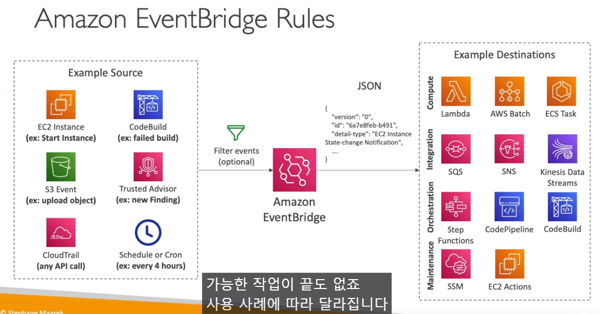

- 다른 이벤트 버스나 자체 이벤트 버스를 받을 수 있습니다.

- 이벤트를 아카이빙할 수 있습니다. 디버깅에 유용합니다.

## EventBridge Schema Registry

- 이벤트를 분석해 스키마를 추론할 수 있습니다.
- 버저닝가능합니다.

## EventBridge Resource-based Poilicy

- 특정 이벤트 버스를 허용하거나 거부할 수 있습니다. (다른 계정이나 리전의 이벤트)
- 리소스 기반 정책이 없다면 이벤트 버스 소유자만 이벤트 버스에 이벤트를 전송할 수 있습니다.
- 예를 들어 중앙 이벤트브릿지 버스를 만들고 리소스기반 정책을 만듭니다.

## CloudWatch Insights

- Container Insights : 컨테이너로부터 매트릭스와 로그를 수집합니다.
- Lambda Insights: 마찬가지로 람다에서 지표를 모니터링합니다.
- Contiributor Insights : VPC 로그, DNS 로그 등 모든 로그에서 특정 행위에 대한 사용량이 많은 로그를 찾을 수있습니다. 예를 들어 트래픽 상위 10 IP 를 찾아서 공격이면 차단하거나 하는 등의 행동을 합니다.
- Application Insights : 자동화된 대시보드를 생성해 사용하는 애플리케이션과 관련된 AWS 서비스나 어플리케이션의 트러블 슈팅을 돕습니다.

# CloudTrail

- 거버넌스, 감사, 규정 준수를 돕습니다.
- 기본적으로 활성화되어 있습니다.
- 모든 이벤트 및 API 콜이 기록됩니다.
- 90일 이상 저장하려면 CloudWatch logs 로 보내든지, S3 로 보내야 합니다. 감사 목적으로 S3 로 보내고 Athena 로 분석하면 됩니다.
- CloudTrail Insights : 이벤트를 분석해서 계정 내 특이한 행동을 감지합니다.
- EventBridge 와 통합 : CloudTrail 이 DB 의 테이블 삭제를 감지합니다. 모든 로그는 EventBridge 에 이벤트로 기록됩니다. 특정 테이블 삭제 API 호출을 찾아서 SNS 에 알릴 수 있습니다.

# AWS Config

- 리소스에 대한 감사 목적입니다.
- 구성과 구성시간에 따른 변화를 추적할 수 있습니다.
- 버킷에 공용 액세스가 있나? SSH 엑세스가 제한되지 않은 보안 그룹이 있나? 등 질문을 확인할 수 있습니다.
- 구성 데이터를 S3 에 저장해서 분석할 수 있습니다.
- 행동을 차단할 수 없지만, SSM Automation 을 통해서 규정을 미준수할 때마다 수정을 트리거할 수 있습니다. 
- EventBridge 를 통해 트리거를 보낼 수 있습니다.

# AWS Organizations

- 멤버 계정은 한 조직에만 속합니다.
- 계정 간 예약 인스턴스, savings plan 을 공유할 수 있습니다.
- SCP 정의 가능 : 특정 OU 또는 계정에 적용되는 IAM 정책으로, 해당 사용자와 역할 모두가 할 수 있는 권한에 제한을 할 수 있습니다.
- 정책에 명시적 거부가 있으면 허용이 있어도 거부됩니다. SCP 는 상위조직으로부터 상속됩니다.
- SCP 에는 차단목록과 허용목록이 있습니다. 허용목록이 있으면 해당 계정은 해당 리소스만 허용됩니다.

# IAM Conditions

- aws:SourceIP : API 호출이 생성되는 클라이언트 IP 를 제한합니다.
- aws:RequestedRegion : API 호출 리전을 제한하고 SCP 보다 글로벌하게 제한합니다.
- ec2:ResourceTags : 태그가 ~~ 일 때 특정 액션을 허용합니다.
- aws:MultiFacorAuthPresent : 멀티팩트인증을 강제합니다.

## IAM for S3 

- s3:ListBucket : 버킷 수준 (arn:aws:s3:::test)
- s3:PutObject, GetObject, DeleteObject : 객체 수준(arn:awn:s3:::test/*)

## 리소스 정책 & aws:PrincipalOrgID

- aws:PrincipalOrgID : 멤버 계정에만 리소스 정책이 적용되도록 제한합니다.

## IAM Roles vs Resource Based Policies

- 예를 들어 아래와 같이 다른 계정의 S3 에 접근할 때 IAM Role 을 사용하거나 S3 Bucket Policy 를 사용할 수 있습니다.

  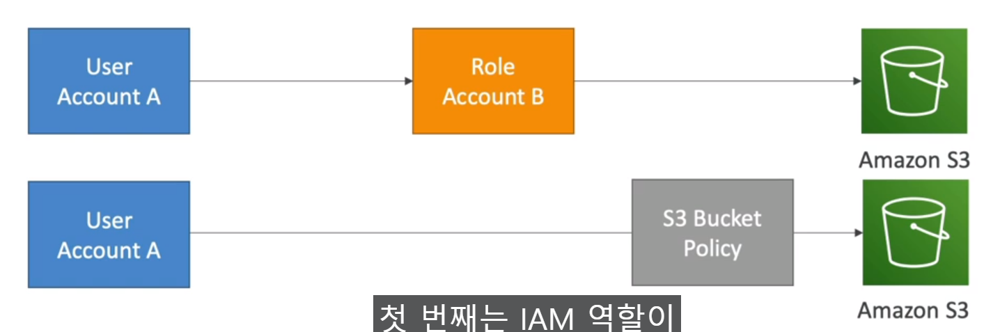

- 역할을 맡으면 기존의 권한을 모두 포기하고 해당 역할을 맡게 됩니다. 기존의 권한은 사용할 수 없습니다.

- 대신 리소스 기반 정책을 맡으면 권한을 포기할 필요 없습니다.

- 리소스 기반 정책은 **S3, SNS, SQS, 람다, API Gateway, CloudWatch Logs** 등에 사용할 수 있습니다.

- 특히 Kinesis Data Stream 은 IAM Roles 사용합니다.

## IAM Permission Boudaries

- 유저와 role 에만 지원하고 그룹에는 지원하지 않습니다.

- IAM 개체의 최대 권한을 제한합니다.

  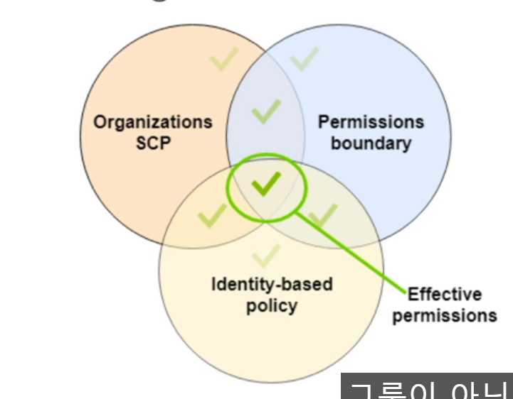

- SCP 에 명시적 거부가 있다면 Deny
- SCP 에 명시적 허용이 없다면 암시적 거부로 Deny
- 리소스 기반 정책에 허용되면 허용
- IAM 정책이 허용되고 Permsiion 바운더리 허용이어야만 허용

# Cognito

- AWS 외부 사용자가 대상입니다.
- User Pool : 가입 기능 제공하 API Gateway 및 ALB 와 통합해서 주로 사용합니다. OAuth, MFA 로그인도 가능합니다.
- Identity Pool : 임시 AWS 자격을 줘서 리소스에 접근 가능하도록 합니다.
- DynamoDB 에서 행수준 보안 설정이 가능합니다. 

# AWS IAM Identity Center

- 한번 로그인해서 모든 액세스를 할 수 있으며 여러 개의 AWS 계정을 가지고 있으면 유용하게 사용할 수 있습니다.
- Permission Set 을 설정해서 사용자를 그룹에 할당하는 하나 이상의 IAM 정책을 정의합니다.

## Microsoft Active Directory 

- AD 는 AD 도메인 서비스를 사용하는 모든 윈도우서버에 적용되는 서비스입니다.
- AWS Microsoft Active Directory 는 액티브 디렉토리를 생성합니다. 
- AWS Managed Microsoft AD : 자체 액티브 디렉토리 생성하고 MFA 인증이 가능합니다. 로컬에서 사용 가능하며 온프레미스 AD 와 신뢰관계를 구축할 수 있습니다.
- AD Connector : 프록시로 동작해서 연결 요청을 전달하기만 합니다. MFA 를 지원합니다.
- Simople AD : 온프레미스 AD 가 없을 때 사용합니다.
- IAM Identity Center 와 Single sign on 으로 connect 가능합니다.

# AWS Control Tower

- 규정을 준수하는 다중 계정 AWS 환경을 손쉽게 설정하고 관리할 수 있습니다.
- Organization 을 사용해 계정을 생성합니다.
- 가드레일을 사용하여 정책관리, 몇번의 클릭으로 환경 설정, 정책위반감지와 교정, 대화형 대시보드 등 기능이 있습니다.
- 가드레일 : 모든 계정에 관한 거버넌스를 얻습니다.
  - preventive guardrail : SCP 를 사용해 모든 계정에 적용해서 특정 행동을 예방합니다.
  - Detective guardrail : Config 를 사용해서 탐지하고 규칙을 실행하지않으면 SNS 로 보내서 알리거나 람다로 수정을 할 수 있습니다.

# KMS

- 권한 부여를 통해 IAM 과 통합
- CloudTrail 로 사용 API 가 추적됨
-  키 타입
  - Symmetric : 단일 암호화 키, 대칭키, 키 자체는 액세스 불가능, API 키로 호출
  - Asymmetric : 비대칭키, 퍼블릭 키는 다운로드 가능
- 3가지 키
  - AWS Managed Key : 무료, AWS 에서 관리
  - Customer Managed Key : 1달에 1달러, 대칭, 비대칭 둘다 가능
  - Customer Managed Key imported : 자체 키 구성 요소를 가져올 수 있음, 1달에 1달러
- AWS Managed Key 는 자동으로 1년마다 로테이션, customer Managed Key 는 1년마다 로테이션을 활성화할 수 있습니다.
- imported KMS key 는 수동으로만 교체할 수 있습니다.

## 크로스 리전

- KMS 로 암호화된 EBS 볼륨옮기기

  - 먼저 스냅샷을 찍고 다른 리전으로 스냅샷을 복사

  - 자체 EBS 를 복원하고 KMS key 를 복원 (이거는 KMS 에서 자체 생성)

    

## KMS Key Policies

- KMS 키에 키 정책이 없다면 누구도 액세스할 수 없습니다.
- 아무 설정을 하지 않으면 계정의 모든 사람이 키에 액세스하도록 허용됩니다.
- 액세스할 수 있는 유저, 롤을 지정하고 누가 키를 관리하는지 특정할 수 있습니다.
- 예를 들어 계정간 스냅샷을 복사할 때,
  - 자체 KMS 키로 암호화한 스냅샷을 생성하면 고객키정책을 연결해야 하므로 customer managed key 가 되며 **교차 계정 액세스 권한 부여를 위해 KMS 키 정책을 연결**합니다.
  - 암호화된 스냅샷을 대상 계정에 공유하면 스냅샷으로 리소스를 만들고, 해당 대상 계정에서 다른 고객 관리형 키로 암호화합니다.

## KMS Multi-Region Keys

- 키 구성요소가 다른 리전으로 복사됩니다.
- 다른 리전으로 데이터를 옮길 때 데이터를 재암호화하지 않아도 됩니다. 
- client side encryption 을 통해 데이터의 특정 필드나 속성을 보호할 수 있고, API 키 액세스 권한이 있는 클라이언트만 복호화할 수 있습니다.

## S3 암호화된 복제

- 한 버킷에서 다른 버킷으로 복제를 활성화하면 암호화되지 않은 객체와 SSE-S3 로 암호화된 객체가 기본적으로 복사됩니다. 
- 고객 제공 키인 SSE-C 로 객체를 암호화하면 복제되지 않습니다.
- SSE-KMS 로 암호화된 객체를 복제하려면 옵션을 활성화해야 합니다.
- 먼저 대상 버킷 내 객체를 암호화하는지 지정합니다.
- 그리고 이 KMS 키 정책을 대상 키에 적용해야 하고, S3 복제 서비스를 허용하는 IAM 역할을 생성해서 소스 버킷의 데이터를 먼저 복호화하도록 한 뒤 대상 KMS 키로 대상 버킷의 데이터를 다시 암호화합니다.
- 이렇게 하면 수많은 암호화와 복호화가 발생합니다.

## 암호화된 AMI 

- A 계정에서 먼저 시작 권한으로 AMI 수정, B 계정으로 공유합니다.
- B 계정에서 KMS 를 사용할 수 있도록 IAM 역할이나 IAM 사용자를 설정합니다.

## SSM Parameter Store

- 구성 및 암호를 위한 보안 스토리지이며 매개변수를 관리합니다.
- 스탠다드(4KB) 와 어드밴스(8KB) 가 가능합니다.
- 어드밴스에서 TTL 을 적용할 수 있고 2개 이상의 정책을 적용할 수 있습니다.

# AWS Secrets Manager

- 암호를 저장하는 최신 서비스로, 강제로 암호를 교체하는 기능이 있어 암호 관리를 더 효율적으로 합니다.
- 새 암호를 생성할 람다 함수를 정의해서 암호 자동 생성이 가능합니다.
- RDS 와 잘 통합됩니다. DB 에 접근하기 위한 사용자 이름과 비밀번호가 바로 저장되고 교체될 수 있습니다.
- 암호는 KMS 로 암호화됩니다.
- multi-region 이 되고, 암호 복제본이 재해 복구 전략이 됩니다. (승격)

# ACM (AWS Certificate Manager)

- TLS 인증서입니다.
- 퍼블릭과 프라이빗 TLS 를 지원하며 퍼블릭은 무료입니다.
- 인증서 자동 갱신 기능이 있습니다.
- ELB, CloudFront, API Gateway 등에 사용합니다.
- EC2 는 안됩니다!!
- 가져온 인증서는 만료 45일 전부터 eventBridge 나 Config 를 통해 SNS, 람다, SQS 트리거를 발동시킬 수 있습니다.
- API Gateway 와 통합하기 위해서는 API Gateway 에 Custom Domain Name 을 만들어야 합니다.
- CNAME 이나 A-Alias 가 DNS 를 가리키도록 설정하면 됩니다.

# WAF

- L7 공격을 방어합니다.
- ALB, API Gateway, CloudFront, Cognito User Pool, AppSync GraphQL API 에 연결가능합니다. (NLB x)
- Web ACL 로 IP 주소를 기반으로 거부할 수 있습니다.
- SQL 인젝션 공격, XSS 공격 방어 가능합니다.
- 특정 국가를 허용 또는 차단할 수 있습니다.
- Rate-based rules 로 DDoS 공격 방어가 가능합니다.

# Shield

- DDoS 공격을 방어합니다. 무료입니다.
- 어드밴스는 더 정교한 디도스 공격을 막아주고 AWS DDoS 대응 팀이 있습니다.

# Firewall Manager

- 모든 계정의 방화벽 규칙을 관리하는 매니저입니다.
- 보안 규칙의 집합인 보안 정책을 설정할 수 있습니다.
- WAF 규칙, Shield, SG for EC2, ALB and ENI in VPC, VPC 레벨의 Network Firewall, route 53 DNS Firewall, region level 의 Policies
- WAF vs Firewall Manager vs Shield
  - 리스스별 보호는 WAF 가 적절합니다.
  - 여러 계정에서 WAF 를 사용하고 새 리소스 보호를 자동화하려면 Firewall Manager 를 사용합니다.
  - Shield 는 디도스 공격을 방어하고, AWS DDoS 대응 팀이 있습니다. 

# GuardDuty

- 지능형 위협 탐지 서비스입니다.
- CloudTrail 에서 API 콜을 받아서 분석하여 권한이 없는 행동을 찾습니다.
- VPC Flow Logs 로 비정상적인 인터넷 트래픽과 IP 주소를 찾습니다.
- DNS 로그로 DNS 쿼리에서 인코딩된 데이터를 전송할 EC2 인스턴스가 손상되었는지 확인할 수 있습니다.
- Kubernetes Audit Logs 로 의심스러운 활동을 찾을 수 있습니다.
- 탐색 결과를 람다나 SNS 로 알림을 받을 수 있습니다.
- GuardDuty 로 암호화폐 공격을 방어할 수 있습니다. 

# Inspector

- 자동화된 보안 평가 서비스입니다.
- EC2 에서 의도되지 않은 네트워크 접근이나 취약점을 분석합니다.
- 컨테이너 이미지로 ECR 를 만들 때 취약점에 대해 분석합니다.
- 람다가 배포될 때 함수 코드 및 패키지 디팬던시에서 소프트웨어 취약성을 평가합니다.
- 작업을 완료하면 결과 및 결과 이벤트를 EventBridge 에 보내고, Security Hub 로 보고합니다.
- **EC2, Container Image, 람다 함수에만 활용됩니다.**

# Macie

- 완전 관리형 데이터 보안 패턴 매칭 머신러닝입니다.
- **S3 를 분석하고 PII 를 찾아서 eventBridge 에 결과를 보냅니다.**

