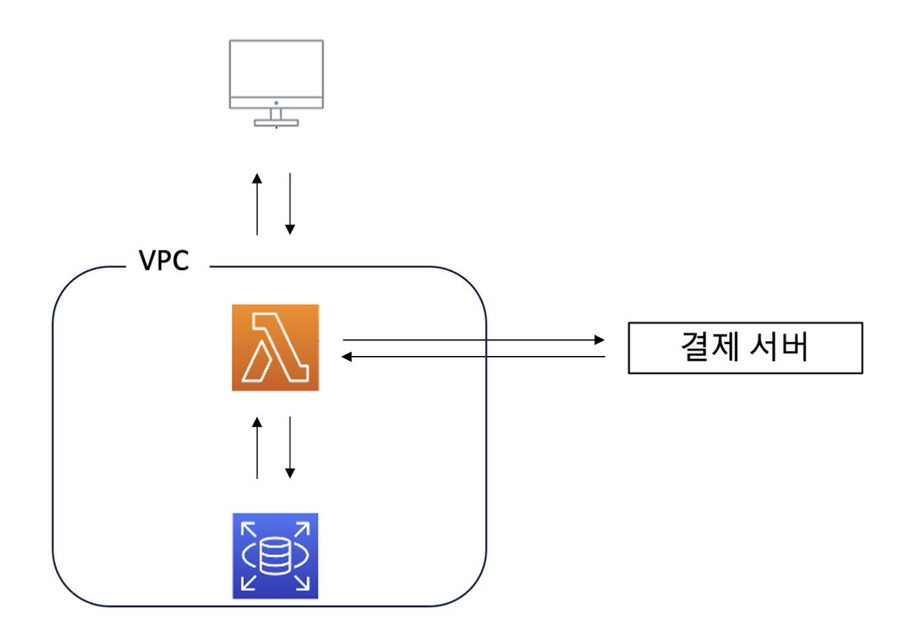

 스프링 코드를 API Gateway + Lambda 로 배포하면서 겪은 문제입니다.

## 문제상황

 먼저 아키텍처는 아래와 같이 간단하게 설명할 수 있습니다.

- 유저가 람다 서비스로 결제 요청
- 람다 서비스는 결제 서버와 통신 후 결제 결과를 DB 에 저장
- 결제 결과를 유저에게 반환(주로 리다이렉트)

 이 때 DB 조회만 있는 로직은 잘 수행되었지만 (결제해야 할 가격 조회 등) 결제 서버와의 통신이 필요한 로직은 람다 timeout 이 발생했습니다. 따라서 내부적으로 로직이 오래걸리거나 timeout 이 발생할 내용이 있다는 건데, **로컬에서는 잘 수행되었으므로 결제 서버와의 통신이 잘 안된다고 판단했습니다.** 하지만 lambda 는 public 서브넷에 있었고, 당연히 IGW 로 통신이 될 것이라고 생각했기 때문에 공식문서부터 찾아보았습니다.

## 해결

 [AWS 공식문서](https://docs.aws.amazon.com/ko_kr/lambda/latest/dg/configuration-vpc.html#vpc-setup-guidelines) 에는 다음과 같이 적혀있습니다.

> ...
> 프라이빗 서브넷에서의 인터넷 액세스에는 NAT(Network Address Translation)가 필요합니다. 함수에 인터넷 액세스 권한을 부여하려면 아웃바운드 트래픽을 퍼블릭 서브넷의 NAT 게이트웨이로 라우팅합니다. NAT 게이트웨이는 퍼블릭 IP 주소가 있으므로 VPC의 인터넷 게이트웨이를 통해 인터넷에 연결할 수 있습니다.
> ...

 

 **결론적으로 서브넷과 NAT Gateway 가 연결되어야 합니다.** 그리고 제가 찾아본 바로는 Lambda 함수가 특정한 IGW 를 통해 직접 퍼블릭 인터넷으로 나가는 것을 허용하지 않습니다. 따라서 람다의 서브넷이 public subnet 이라고 하더라도, NAT Gateway 로 연결되는 라우팅 테이블이 있는지 확인해봐야 합니다.

 회사 서버에서 서브넷은 총 5개로, public subnet 4개와 private subnet 1개가 있었는데 private subnet 에만 NAT Gateway 가 연결되어있었습니다. 그리고 람다는 5개 서브넷 중 1개에서 실행되는 것으로 되어있었습니다. 따라서 방법은 아래 두 가지입니다.

- public subnet 과 NAT Gateway 연결
- 람다를 private subnet 에서만 실행

 저는 여기서 두 번쨰 방법을 선택했는데, 전체적인 구성을 변경하지 않으면서도 목적을 달성할 수 있기 때문입니다. 결제 서비스의 경우 고객사를 대상으로 하기 때문에 실행 수가 많지 않아 고가용성이 요구되지 않았습니다. 람다의 Configuration > VPC 탭에서 서브넷을 private subnet 만 선택하는 걸로 해결했습니다.
