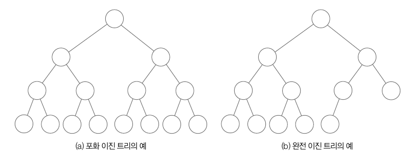
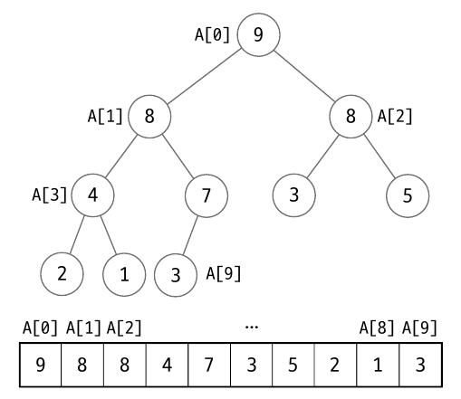
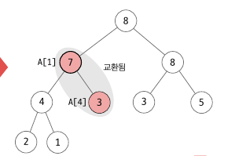
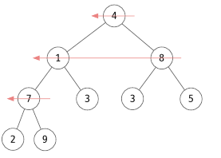
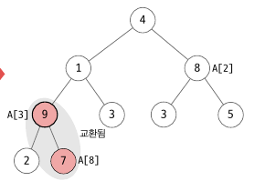
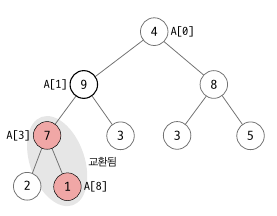
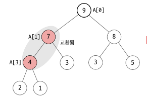

<div class="notice--danger">
    <b>'쉽게 배우는 자료구조 with 자바 (문병로)' 내용 중 일부입니다.</b>
</div>

# 힙이란

​	힙은 우선순위 큐를 구현하는 대표적인 자료구조입니다. 우선순위 큐란 우선순위가 가장 높은 데이터부터 빠져나오는 큐 구조입니다. 이러한 우선순위 큐를 구현하는 힙은 완전 이진 트리 구조를 사용합니다.  완전 이진 트리 구조란 리프노드를 제외한 모든 노드가 포화 이진 트리 구조이면서, 리프 노드는 왼쪽부터 정렬된 상태입니다. 



힙은 다음과 같은 조건을 만족해야 합니다.
	1. 완전 이진 트리
	1. 힙 특성 : 모든 노드는 값을 갖고, 자식 노드 값보다 크거나 같다.

​	조건 2 를 만족하게 되면 루트 노드에는 제일 큰 값이 들어오는데, 이를 최대 힙(Max Heap) 이라고 합니다. 루트 노드에 최소값이 들어오는 것을 최소 힙(Min Heap) 이라고 합니다. 최대 힙과 최소 힙은 대소만 변경될 뿐 성질은 동일합니다.

​	임의의 배열 A[1...n] 은 항상 조건 1번을 만족합니다. 왜냐하면 다음 그림과 같이 A[k] 의 자식 노드는 항상 A[2k+1], A[2k+2] 이기 때문입니다. 따라서 배열로 만든 데이터는 모두 완전 이진 트리 구조입니다. 


​	하지만 조건 2는 배열의 위치를 변경하며 수정해야 합니다. 따라서 배열을 힙 구조를 만드는 과정은 조건 2 를 만족하도록 변경하는 과정과 같습니다.

# 힙 만들기

## 힙 객체의 구조

힙 객체는 아래와 같은 필드와 메서드를 가집니다.

```
A[] <- 힙을 저장하는 배열
numItems <- 힙의 원소 수를 저장

insert(x) <- 힙에 x 를 삽입
deleteMax() <- 힙의 최대 원소를 반환하면서 삭제
buildHeap() <- 배열 A[] 를 힙으로 만든다
max() <- 힙의 최대 원소를 반환
isEmpty() <- 힙이 비었는지 확인 
clear() <- 힙을 청소
```

## 원소 삽입

​	힙 A[0...n-1] 에 원소가 삽입되면 먼저 맨 끝에 추가한 다음 (A[0...n]) 힙 특성을 만족하도록 올라가면서 수선합니다. 예를 들어 다음과 같은 힙이 있고 원소 8 을 추가한다고 가정하겠습니다.

A[9, 7, 8, 4, 3, 3, 5, 2, 1] + 8 => A[9, 7, 8, 4, 3, 3, 5, 2, 1, 8] 

8 은 A[9] 로 부모 노드는 A[4] = 3 입니다. 자식 노드가 더 크므로 자리를 변경합니다.

A[9, 7, 8, 4, 8, 3, 5, 2, 3]

다시 A[4] 와 그 부모노드인 A[2] = 7 를 비교하여 자리를 변경합니다.

A[9, 8, 8, 4, 7, 3, 5, 2, 3]

다시 A[2] 와 그 부모노드인 A[1] = 9 을 비교합니다. 부모노드가 더 크니까 교환을 안하고 종료합니다. 이러한 작업을 percolate Up(스며오르기) 라고 합니다. 노드 A[i] 를 부모의 값과 비교해서 힙 특성을 깨면 둘의 자리를 맞바꾸는 것으로 재귀적인 작업입니다.

아래는 먼저 비재귀적인 원소 삽입입니다.

```
insert(x):
	i <- n 	//삽입 위치
	A[i] <- x
	while(i > 0 and A[i] > A[parent])
		A[i] <-> A[parent]
		i <- parent
		parent <- (i-1)/2
    n++ //힙 증가
```

아래는 재귀적인 원소 삽입입니다.

```
insert(x):
	A[i] <- x
	percolateUp(n)
	n++
	
percolateUp(i):
	parent <- (i-1)/2
	if(i > 0 and A[i] > A[parent])
		A[i] <-> A[parent]
		percolateUp(parent)
```


## 원소 삭제

​	힙으로 대표되는 우선순위 큐에서 삭제는 무조건 우선순위 값이 가장 큰 원소를 대상으로 합니다. 따라서 루트 노드를 삭제한 뒤 반환하고 힙 크기를 1 감소시키면 됩니다. 삭제는 삽입과 반대로 Percolate Down (스며내리기) 을 사용합니다. A[0] 에 마지막 인덱스 원소를 넣어준 후 자식 노드와 비교해서 자식 노드보다 작으면 위치를 변경해 줍니다. 이 때 자식 노드들 중 더 큰 값과 변경합니다. 예를 들어 다음과 같은 경우에 부모 노드인 3 의 자식 노드는 4, 7 로 둘 다 부모노드보다 크지만, 더 큰 7 과 바꿔줍니다.


다음은 원소 삭제 알고리즘입니다.

```
deleteMax():
	max <- A[0]
	A[0] <- A[n-1]
	n--
	percolateDown(0)
	return max
	
percolateDown(k):
	child <- 2k + 1
	right <- 2k + 2
	if(child <= n - 1)
	if(right <= n - 1 and A[child] < A[right])
		child <- right  // child 를 A[2k + 1] 과 A[2k + 2] 중 더 큰 원소의 인덱스로 선택
    if(A[k] < A[child])
    	A[k] <-> A[child]
    	percolatedDown(child)
```


## 힙 생성

​	힙은 빈 배열부터 만들 수 있고, 임의의 배열이 주어지면서 해당 배열을 힙으로 만들 수도 있습니다. 여기서는 주어진 배열을 힙으로 만들겠습니다. 수선은 다음과 같이 맨 마지막 노드의 부모노드부터 앞으로 진행됩니다. 


여기서 A[3] 부터 A[2], A[1], A[0] 차례로 이들을 루트로 하는 서브 트리를 수선합니다. 서브 트리에서는 부모 노드와 자식 값 두개 중 가장 큰 값을 비교하여 더 큰 값을 부모 노드로 올립니다. A[3] 을 보면 자식 노드가 2, 9 인데 더 큰 9 의 값과 비교합니다. 9 의 값이 더 크므로 7 과 9의 자리를 변경합니다.


이제 A[3] 을 부모 노드로 하는 서브트리를 정렬되었습니다. 그 다음은 A[2] 를 부모노드로 하는 서브트리를 정렬합니다. 8 은 3, 5 중 최대값인 5 보다 더 크므로 정렬된 상태입니다. 그 다음으로 A[1] 을 부모 노드로 하는 서브 트리를 정렬합니다. A[1] 과 A[3], A[4] 를 비교하교 교환하면 A[1] <-> A[3] 이 됩니다. 그리고 다시 A[3] 을 루트 노드로 하는 서브 트리를 정렬합니다. 이 때 A[3] <-> A[8] 이 되고 중간 형태는 아래와 같습니다.


같은 방법으로 A[0] 를 정렬하면 아래와 같이 됩니다. A[0] <-> A[1], A[1] <-> A[3] 과정이 진행되었습니다.


​	지금까지의 과정은 임의의 노드에서 percolate down 과정을 반복한 것입니다. 위의 예제에서는 A[3] percolate down -> A[2] percolate down -> ... -> A[0] percolate down 을 진행했습니다. 최초 시작하는 노드는 A[n-1] 의 부모 노드인 A[(n-2)/2] 입니다. 아래와 같이 이전에 작성한 percolateDown 를 사용하여 알고리즘을 작성할 수 있습니다.

```
buildHeap():
	for i <- (n-2)/2 downto 0
		percolateDown(i)
```


## 기타작업

```
max():
	if(isEmpty()) /*error*/
	else return A[0]
	
isEmpty():
	return n == 0
	
clear():
	n <- 0
```


# 힙 구현

먼저 인터페이스입니다.

```java
public interface PQInterface<E> {

    void insert(E newItem) throws CustomException;
    E deleteMax() throws CustomException;
    E max() throws CustomException;
    boolean isEmpty();
    void clear();
}
```

다음은 클래스 구현입니다. 알고리즘에서는 <, <= 연산자를 사용했는데 primitive Type 이 아니면 이런 기초 연산자를 사용할 수 없습니다. 따라서 제네릭 클래스 E 는 Comparable 을 상속하는 타입만 받을 수 있게 만들고, 비교는 compareTo() 메서드로 진행합니다. `x.compareTo(y)` 를 해서 x 값이 더 크면 1, y 값이 더 크면 -1, 같으면 0 을 반환합니다.

```java
package datastructure.heap;

import datastructure.common.CustomException;

public class Heap<E extends Comparable<E>> implements PQInterface<E>{

    private E[] A;
    private int numItems;

    public Heap(int arraySize){
        A = (E[]) new Comparable[arraySize];
        numItems = 0;
    }

    public Heap(E[] B, int numElements){
        A = B;
        buildHeap();
        numItems = numElements;
    }

    @Override
    public void insert(E newItem) throws CustomException {
        if(numItems < A.length){
            A[numItems] = newItem;
            percolateUp(numItems);
            numItems++;
        }else throw new CustomException();

    }

    private void percolateUp(int i){
        int parent = (i - 1) / 2;
        if(parent >=  0 && A[i].compareTo(A[parent]) > 0){
            E temp = A[i];
            A[i] = A[parent];
            A[parent] = temp;
            percolateUp(parent);
        }
    }

    @Override
    public E deleteMax() throws CustomException {
        E max = A[0];
        A[0] = A[numItems - 1];
        numItems--;
        percolateDown(0);
        return max;
    }

    private void percolateDown(int i){
        int child = 2 * i + 1;
        int right = 2 * i + 2;
        if(child <= numItems - 1){
            if(right <= numItems - 1 && A[child].compareTo(A[right]) < 0){
                child = right;
            }
            if(A[i].compareTo(A[child]) < 0){
                E temp = A[i];
                A[i] = A[child];
                A[child] = temp;
                percolateDown(child);
            }
        }
    }

    private void buildHeap(){
        for(int i = (numItems - 2) / 2; i >= 0; i--){
            percolateDown(i);
        }
    }

    @Override
    public E max() throws CustomException {
        if(!isEmpty()) return A[0];
        else throw new CustomException();
    }

    @Override
    public boolean isEmpty() {
        return numItems == 0;
    }

    @Override
    public void clear() {
        A = (E[]) new Object[A.length];
        numItems = 0;
    }
}
```

- 생성자 : 생성자 중 배열과 크기를 받아 정렬하여 Heap 으로 만드는 생성자가 있습니다. `A = B` 로 하면 reference 가 복사되니, 그게 싫다면 새로운 E[] 로 선언한 후 for loop 로 아래와 같이 일일히 복사합니다.

  - ```java
    A = (E[]) new Comparable[B.length];
    for(int i = 0; i < numElements; i++){
        A[i] = B[i];
    }
    ```

  - 하지만 여기서도 각 배열의 주소값이 복사되는데요. Wrapper 클래스나 String 은 immutable 하기 때문에 상관없지만 다음과 같은 임의의 클래스는 변경될 수 있습니다.

    - ```java
      class TestNode implements Comparable<TestNode> {
      
          private int testData;
      
          public TestNode(int testData){
              this.testData = testData;
          }
      
          public int getTestData(){
              return testData;
          }
      
          public void setTestData(int testData){
              this.testData = testData;
          }
      
          @Override
          public int compareTo(TestNode o) {
              return this.testData - o.testData;
          }
      }
      
      public class Main{
      
          public static void main(String[] args) {
              TestNode node = new TestNode(1);
              TestNode node2 = new TestNode(2);
              TestNode node3 = new TestNode(3);
      
      
              TestNode[] arr = {node, node2, node3};
              Heap<TestNode> heap = new Heap<>(arr,3);
              //heap 에 있는 node2 의 값도 10으로 변경됨
              node2.setTestData(10);
      
              System.out.println(heap.deleteMax().getTestData()); //3
              System.out.println(heap.deleteMax().getTestData()); //10
              System.out.println(heap.deleteMax().getTestData()); //1
          }
      }
      ```

- percolateUp, percolateDown : 비교연산자 대신 compareTo 를 사용합니다. 

# 힙 수행시간

​	**먼저 buildHeap() 의 시간복잡도는 θ(n) 입니다.** buildHeap() 은 각 percolateDown() 의 소요 시간의 합인데요. percolateDown() 자체는 원소 비교를 총 2번하고 그 다음 percolateDown() 를 호출하게 됩니다. buildHeap() 은 마지막 노드의 부모 노드부터 percolateDown() 을 하면서 루트 노드까지 진행합니다. 이 때 대상이 되는 노드는 전체 개수의 절반인 n/2 정도 입니다. 나머지는 리프 노드라서 대상이 아닙니다. 그리고 높이가 n 인 서브트리는 percolateDown() 을 총 n-1 번 하게 됩니다. 결론적으로 아래와 같이 진행됩니다.

원소의 개수가 n 인 트리의 최대 높이는 logn + 1 의 자연수 부분(k)이며, (예를 들어 n = 15 면 최대 높이는 4)

- 높이가 1 인 서브 트리 -> 총 n/2 개 -> 리프 노드이기 때문에 percolateDown() 호출 안함
- 높이가 2 인 서브 트리 -> 총 n/4 개(남은 n/2 개 중 1/2) -> 1개 당 percolateDown() 1번씩 호출 -> n/4 번 수행
- 높이가 3 인 서브 트리 -> 총 n/8 개 (남은 n/4 개 중 1/2)-> 1개 당 percolateDown() 2번씩 호출 -> 2 * n/8 번 수행
- 높이가 4 인 서브 트리 -> 총 n/16 개(남은 n/8 개 중 1/4) -> 1개 당 percolateDown() 3번씩 호출 -> 3 * n/16 번 수행
- 높이가 5 인 서브 트리 -> 총 n/32 개 -> 1개 당 percolateDown() 4번씩 호출 -> 4 * n/32 번 수행
- 높이가 최대 높이(k)인 서브 트리 -> 1개 -> percolateDown() 를 k 번 호출 -> n / (2^k) 번 수행

총 수행횟수 =  n(1/4 + 1/8 + 1/16 + 1/32 + ... + 1/2^k) = percolateDown() 는 1/2 n 번 호출됩니다. 이 때 percolateDown() 2번의 비교연산을 수행하므로 총 n 번 수행됩니다. 따라서 시간복잡도는 θ(n) 입니다. 

​	힙의 원소를 삽입하는 insert() 와 deleteMax() 는 총 높이만큼 percolateUp() 이나 percolateDown() 을 하므로 최대 높이인 logn 번 수행되므로 **시간복잡도는 θ(logn)** 입니다. 삽입 시 최선의 경우는 한번의 비교로 끝나는  θ(1) 이고 삭제의 경우에도 힙의 모든 원소가 동일할 때에는 θ(1) 입니다.