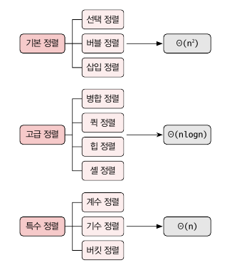

<div class="notice--danger">
    <b>'쉽게 배우는 자료구조 with 자바 (문병로)' 내용 중 일부입니다.</b>
</div>

# 정렬

​	정렬은 수행 시간에 따라 대략 세 그룹으로 나뉩니다. 여기서 특수 정렬은 원소들이 특수한 성질을 만족할 때 용됩니다



# 선택정렬

선택 정렬은 가장 큰 원소를 찾아서 제일 오른쪽으로 옮기는 작업을 반복하는 것입니다. 제일 작은 걸 찾은 뒤 왼쪽으로 옮겨도 결과는 같습니다.

```
selectionSort(A[0 ... n-1], n):
	for last <- n-1 downto 1
		A[0 ... last] 중 가장 큰 수 A[k] 를 찾는다
		A[k] <-> A[last]
```

선택정렬의 수행횟수는 n(n - 1)/2 로 