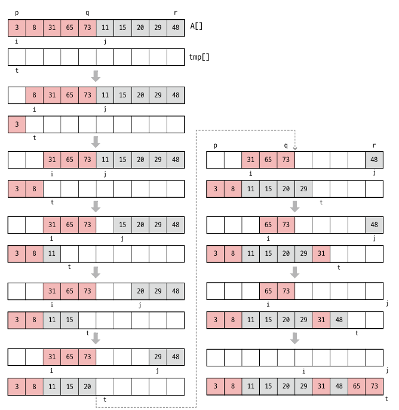
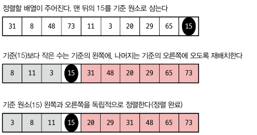
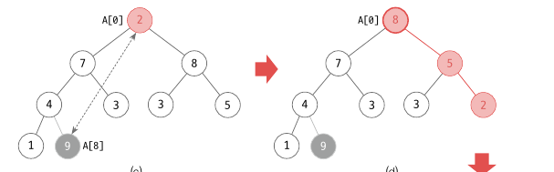
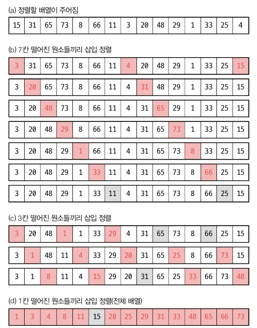

<div class="notice--danger">
    <b>'쉽게 배우는 자료구조 with 자바 (문병로)' 내용 중 일부입니다.</b>
</div>


# 병합 정렬

​	병합 정렬은 먼저 입력을 반으로 나눈 후 앞, 뒤를 각각 독립적으로 정렬합니다. 이후 정렬된 두 부분을 병합하여 정렬된 배열을 얻습니다. 나누어진 앞 뒤도 각각 병합 정렬을 실시합니다. 즉, 재귀적으로 문제를 풀어나갑니다.

```
mergeSort(A[], p, r): //A[p...r] 을 정렬합니다.
	if(p < r)
		q <- (p+r)/2
		mergeSort(A, p, q)
		mergeSort(A, q+1, r)
		merge(A, p, q, r)

merge(A[], p, q, r):
	정렬된 두 배열 A[p...q] 와 A[q+1...r] 을 합쳐 정렬된 하나의 배열 A[p...r] 을 만듭니다.
```


구체적으로 기술하면 아래와 같습니다.

```
merge(A[], p, q, r):
	i <- p; j <- q+1; t <- 0
	while(i <= q and j <= r)
		if(A[i] <= A[j]) tmp[t++] <- A[i++]
		else tmp[t++] <- A[j++]
    while(i <= q) //왼쪽 부분 배열이 남은 경우
    	tmp[t++] <- A[i++]
    while(j <= r)
    	tmp[t++] <- A[j++]
    i <- p; t <- 0
    while(i <= r)
    	A[i++] <- tmp[t++] //결과인 tmp 를 A[p...r] 에 복사
```



시간복잡도를 귀납적으로 살펴보면 다음과 같습니다. 먼저 병합하는 merge() 의 과정은 모든 원소를 tmp 으로 옮긴 뒤 A 로 다시 옮기므로 2n 번 수행합니다. 그리고 각각의 앞뒤 배열은 2/n 씩 나누어 수행됩니다.

T(n) = 2T(n/2) + 2n

그리고 n = 2^k 로 가정하고 점근식을 풀어보겠습니다.
$$
T(n) = 2T(n/2) + 2n \\
= 2(2T(n/2^2) + 2n) + 2n = 2^2T(T/2^2) + 2 * 2n \\
= 2^2T(2T(n/n^3) + n/2) + 2 * 2n = 2^3T(n/2^3) + 3*2n \\
... \\
= 2^kT(1) + k*2n \\
= n * c + 2nlogn \\
= θ(nlongn)
$$
최종적으로 시간복잡도는 θ(nlongn) 입니다. 개략적으로 봐도, n 개를 병합하는 과정이 n번일어나고, 나눠지는 게 n/2 씩 logn 번 나눠지므로 c* nlogn 이 됩니다. 

​	이론적으로 병합정렬은 완벽한 θ(nlongn) 을 보장하지만 **병합 과정에서 같은 크기의 보조배열 tmp[] 이 필요합니다**. 주어진 배열 이외에 추가로 공간을 사용하지 않는 정렬을 내부정렬(In-plce sorting) 이라고 부르는데, 병합정렬은 내부정렬이 아닙니다. 따라서 시간, 공간적으로 낭비가 생깁니다. 이를 해결하기 위해서는 배열 A[] 와 배열 tmp[] 가 주, 보조 배열 역할을 매번 바꾸면서 정렬한다면 평균적으로 15% 정도 빨라진다고 합니다.

```java
public void mergeSort(){
    int[] B = new int[A.length];
    mSort(0, A.length - 1, B);
}

private void mSort(int p, int r, int[] B){
    if(p < r){
        int q = (p + r) / 2;
        mSort(p, q, B);
        mSort(q + 1, r, B);
        merge(p, q, r, B);
    }
}

private void merge(int p, int q, int r, int[] B){
    int i = p;
    int j = q + 1;
    int t = 0;

    //앞뒤 남았을 때
    while(i <= q && j <= r){
        if(A[i] <= A[j]) B[t++] = A[i++];
        else B[t++] = A[j++];
    }

    //앞만 남았을 때
    while(i <= q){
        B[t++] = A[i++];
    }
    //뒤만 남았을 때
    while(j <= r){
        B[t++] = A[j++];
    }
    i = p;
    t = 0;
    while(i <= r){
        A[i++] = B[t++];
    }
}
```


# 퀵 정렬

​	퀵 정렬은 기준 원소를 하나 잡아서 기준 원소보다 작은 원소와 큰 원소로 그룹을 나누어 분할한 다음 다시 각각 정렬하는 방법입니다. 아래와 같이 동작합니다.


```
quickSort(A[], p, r):
	if(p < r)
		q <- partition(A, p, r) //A 를 분할
		quickSort(A, p, q-1)
		quickSort(A, q+1, r)
		
partition(A[], p, r):
	x <- A[r] //pivot
	i <- p-1 // i 는 1구역의 끝 시점
	for j <- p to r-1 // j 는 3구역의 시작 지점
		if(A[j] < x)
			A[++i] <-> A[j]
    A[i+1] <-> A[r]
    return i+1;
```

병합 정렬이 작은 배열부터 정렬한 뒤 병합했다면, 퀵 정렬은 배열을 나눈 뒤 각각 더 작은 단위로 쪼개면서 정렬을 합니다. 여기서 1, 2, 3구역은 임의로 r 보다 작은 구역, r 보다 큰 구역, 아직 정렬되지 않은 구역으로 나눈겁니다.

​	퀵정렬의 시간복잡도는 평균 θ(nlongn) 입니다. 병합정렬과 마찬가지로 정렬하는 데 n 번, 각각이 평균적으로 절반으로 쪼개진다고 가정하면 쪼개지는 개수가 logn 번 입니다. 하지만 최악의 경우에는 θ(n^2) 으로, 한쪽으로 계속 몰리는 경우입니다. 그러면 n/(n-1)/2 번 수행됩니다. 한쪽으로만 몰리지 않아도 극심하게 균형이 맞지 않으면 시간은 역시 θ(n^2) 가 됩니다.

​	입력이 이미 정렬되어 있거나 거의 정렬되어 있는 경우에도 균형이 맞지 않기 때문에  θ(n^2) 입니다. 역순 정렬일 때도 마찬가지 입니다. 이럴 경우를 방지하고자 한다면 기준 원소를 맨 앞이나 맨 뒤로 잡지 말고 임의의 한 원소를 고르면 됩니다.

​	또한 동일한 원소가 많이 존재하는 경우에도 분할의 균형이 맞지가 않아 수행횟수가 많아질 수 있으며, 극단적으로 모두 동일할 경우 이미 정렬된 상태처럼 균형이 항상 최악이 됩니다. 이 문제를 해결하기 위해서는 기준 원소와 동일한 원소를 만날 때 양쪽에 골고루 나누어주도록 변경하면 됩니다.

```java
public void quickSort(){
    qSort(0, A.length - 1);
}

private void qSort(int p, int r){
    if(p < r){
        int q = partition(p, r);
        qSort(p, q - 1);
        qSort(q + 1, r);
    }
}

private int partition(int p, int r){
    int i = p - 1;
    int tmp;
    for(int j = p; j < r; j++){
        if(A[r] < A[j]){
            tmp = A[++i];
            A[i] = A[j];
            A[j] = tmp;
        }
    }
    tmp = A[++i];
    A[i] = A[r];
    A[r] = tmp;
    return i;
}
```


# 힙정렬

​	힙 정렬은 힙 자료구조를 사용해서 정렬을 합니다. 먼저 배열 A[0...n-1] 을 buildHeap() 으로 힙 자료구조로 만듭니다. 루트 노드가 제일 큰 원소이니 루트노드와 마지막 리프노드를 변경한 후 percolateDown() 으로 수선해줍니다.


힙 구조인 [9, 7, 8, 4, 3, 3, 5, 1 2] 에서 위 그림과 같이 A[0] 과 A[8] 의 자리를 바꿔줍니다. 그리고 A[0] 에 대해 percolateDown() 을 진행합니다. 그러면 A[8] 은 정렬되었고 다시 A[0] 와 A[7] 을 변경해주면 됩니다. 이런 식으로 모든 배열을 정렬합니다.

```
heapSort():
	buildHeap()
	for i <- n-1 downto 1
		A[i] <-> A[0]
		percolateDown(0, i) // 0번을 i번째 인덱스까지 정렬
```

​	힙정렬의 수행시간은 평균 θ(nlongn) 이며 최악의 경우에도 θ(nlongn) 입니다. 최선의 경우는 모든 원소가 동일한 경우로 θ(n) 시간에 끝납니다. 또한 힙정렬은 In-place Sorting 입니다.

```java
public void heapSort(){
    buildHeap();
    int tmp;
    for(int i = A.length - 1; i >= 1; i--){
        tmp = A[0];
        A[0] = A[i];
        A[i] = tmp;
        percolateDown(0, i - 1);
    }
}

private void percolateDown(int i, int n){ //i 부터 n 까지 percolateDown
    int child = 2 * i + 1;
    int right = 2 * i + 2;
    if(child <= n){
        if(right <= n && A[child] < A[right]){
            child = right;
        }
        if(A[i] < A[child]){
            int temp = A[i];
            A[i] = A[child];
            A[child] = temp;
            percolateDown(child, n);
        }
    }
}

private void buildHeap(){
    if(A.length >= 2){
        for(int i = (A.length - 2) / 2; i >= 0; i--){
            percolateDown(i, A.length - 1);
        }
    }
}
```


# 셸 정렬

​	셸 정렬은 삽입 정렬의 평균 시간이 θ(n) 임을 활용한 정렬입니다. 삽입 정렬은 이미 정렬되어있거나 거의 정렬되어 있으면 시간은 θ(n) 이 됩니다. 셸 정렬은 배열 전체를 특정 간격으로 나누어 삽입 정렬을 한 다음, 더 좁아진 간격으로 다시 삽입 정렬을 합니다. 마지막으로 간격이 1 이 되면 전체가 하나의 그룹으로 삽입 정렬을 하고 끝이 납니다.

​	이 간격 수열 h0, h1, ...  을 갭 수열이라고 합니다. 이 수열을 잡는 방법은 다양합니다. 31, 15, 7, 3, 1 과 같이 2^k - 1 로 잡거나 h1 = n/7 로 잡고 hi = h(i-1)/5 -1 처럼 h 가 5보다 큰 동안 삽입 정렬을 수행한 다음 마지막으로 전체 배열에 대해 삽입정렬을 합니다. **셸 정렬은 앞의 준비 단계에 소모한 시간이 얼마나 작으냐에 달려 있습니다.** 아래는 15개의 원소를 가진 배열을 7, 3, 1 의 간격으로 정렬하는 예시입니다.



먼저 7칸씩 떨어진 원소들끼리 삽입정렬을 하고, 3칸씩 떨어진 원소들끼리 삽입정렬을 합니다. 마지막으로 전체 배열에 대해 삽입 정렬을 실시합니다.

```
shellSort(A[]):
	for h <- h0, h2, ..., 1 //갭 수열
		for k <- 0 to h-1
			stepInsertionSort(A, k, h)

stepInsertionSort(A[], k, h):
	for(i <- k+h; i <= n-1; i <- i+h)
		insertionItem <- A[i]
		for(j <- i - h; 0 <= j and isertionItem < A[j]; j <- j-h)
			A[j+h] <- A[j]
        A[j+h] <- insertionItem
```

```java
public void shellSort(){
    for(int h = A.length / 7; h > 5; h = h/5 - 1){
        for(int k = 0; k <= h - 1; k++){
            stepInsertionSort(k, h); //k 는 시작 인덱스, h 는 간격
        }
    }
    stepInsertionSort(0, 1); //마지막으로 삽입정렬
}

private void stepInsertionSort(int k, int h){ 
    int j, insItem;
    for(int i = k + h; i <= A.length - 1; i += h){
        insItem = A[i];
        for(j = i - h; j >= 0 && A[i] > insItem; j -= h){
            A[j + h] = A[j];
        }
        A[j + h] = insItem;
    }
}
```

