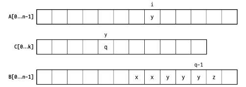
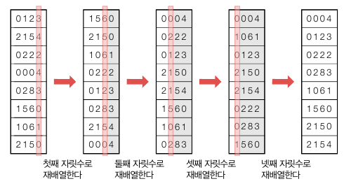
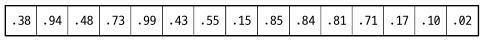
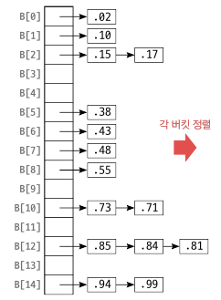

<div class="notice--danger">
    <b>'쉽게 배우는 자료구조 with 자바 (문병로)' 내용 중 일부입니다.</b>
</div>

# 계수 정렬

​	계수정렬은 정렬하고자 하는 원소들의 값이 -O(n) ~ O(n) 범위의 정수인 경우에 사용할 수 있습니다. 예를 들어 A[0 ... n-1] 에 있는 원소의 값이 0 ~ 2n, -n ~ 3n 등 의 범위에 있는 정수인 경우입니다. 

​	원소들의 값이 모두 0 ~ k 사이의 정수라고 할 때 계수 정렬은 먼저 배열에 있는 원소를 다 훑어서 1 부터 k 까지의 자연수가 각각 몇번 나타나는지 셉니다. 이 정보가 있으면 배열 A[] 의 각 원소가 몇번째 자리에 놓이면 되는지 계산할 수 있습니다.

```
countingSort(A[], n): //A 의 원소는 0 ~ k 사이의 값을 가짐
	C[0...k]
	for j <- 0 to n-1
		C[A[j]]++ //A 의 원소값에 해당하는 인덱스++
    for i <- 1 to k
    	C[i] <- C[i] + C[i-1] //누적합 계산
    for j <- n-1 downto 0
    	B[C[A[j]] - 1] <- A[j] 
    	C[A[j]]--
    return B
```

`B[C[A[j]] - 1] <- A[j] ` 여기를 보면, 예를 들어 A[j] 의 누적합이 50 이면 49 부터 밑으로 A[j] 의 개수만큼은 A[j] 라는 뜻입니다.



시간 복잡도는 θ(n) 입니다. 여기서 k 가 O(n) 을 초과하면 시간 복잡도는 θ(k) 가 됩니다.

```java
public int[] countingSort(int K){ //A 의 범위가 0 ~ k-1 일 때
    int[] cnt = new int[K];

    for(int i = 0; i < A.length; i++){
        cnt[A[i]]++;
    }

    cnt[0]--; //A[0] 부터 시작하므로 1 을 빼주는 조정이 필요. ex) cnt[0] = 2 일 때 B[2] = 0, B[1] = 0 이 됨, 의도는 B[1] = 0, B[0] = 0
    //대신 마지막 for 문에서 B[] 에서 -1 을 안해줘도 됨
    for(int i = 1; i < K; i++){
        cnt[i] += cnt[i - 1];
    }
    int[] B = new int[A.length];

    for(int j = A.length - 1; j >= 0; j--){
        B[cnt[A[j]]] = A[j];
        cnt[A[j]]--;
    }
    return B;
}
```


# 기수 정렬

​	기수 정렬은 원소들이 모두 상수 k 개 이하의 자릿수를 가진 자연수와 같은 특수한 경우에 사용할 수 있습니다. 이때 자연수가 아닌 제한된 길이를 가진 알파벳도 해당합니다. 가장 낮은 자릿수 정렬 -> 둘째 자릿수 정렬 -> ... -> 가장 높은 자릿수 정렬 순서대로 정렬합니다.



알고리즘은 아래와 같습니다.

```
radixSort(A[], n, k): //k 는 최대자리수, n 은 원소의 개수
	for i <- 1 to k
		i 번쨰 자릿수에 대해 A[0...n-1] 의 안정성을 유지하면서 정렬합니다.
```

​	여기서 "안정성을 유지" (**stable sort**) 한다는 것은 값이 같은 원소끼리 정렬 후에 원래의 순서가 바뀌지 않는 성질입니다. 예를 들어 두번째 자릿수를 보면 1560 과 1061 을 정렬할 때 정렬 기준인 둘째 자릿수는 "6" 으로 같지만 1560 이 앞에 있으니 정렬 후에도 1061 보다는 앞에 있어야 한다는 것입니다. 

​	그리고 각 자릿수를 정렬할 때도 앞에서 배운 정렬방법이 아닌,  θ(n) 의 시간복잡도를 가지는 정렬을 사용해야 합니다. 예를 들어서 0 부터 9 까지 표시된 10개의 버킷을 준비해놓고 각각의 수를 가진 입력을 해당 공간에 차례대로 넣어주는 방법을 사용해야 합니다. 이 부분을  θ(n) 시간에 끝내면서 k 번 반복하여  θ(kn) 의 시간복잡도를 가집니다. 여기서 k 가 상수가 아니라면 기수 정렬의 의미가 없어집니다. (ex. n 자리의 자연수 n 개 등)

```java
public void radixSort(){ //A[0...n-1] 은 최대 numDigits 자릿수의 양의 정수
    int[] cnt = new int[10];
    int[] start = new int[10];

    int[] B = new int[A.length];
    int max = -1;
    for(int i = 0; i < A.length; i++){
        if(A[i] > max) max = A[i];
    }
    int numDigits = (int) Math.log10(max) + 1; //최대 자릿수
    
    //0~9 사이의 수이므로 계수정렬
    for(int digit = 1; digit <= numDigits; digit++){
        for(int d = 0; d <= 9; d++){ //cnt[] 배열 초기화
            cnt[d] = 0;
        }
        for(int i = 0; i < A.length; i++){ 
            cnt[(int)(A[i]/Math.pow(10, digit - 1)) % 10]++; //cnt[] 에서 i 번째 수의 digit 번째 자리수 숫자 ++
        }
        start[0] = 0;
        for(int d = 1; d <= 9; d++){
            start[d] = start[d - 1] + cnt[d - 1]; //누적 합
        }
        for(int i = 0; i < A.length; i++){
            B[start[(int)(A[i]/Math.pow(10, digit - 1)) % 10]++] = A[i];
        }
        for(int i = 0; i < A.length; i++){
            A[i] = B[i];
        }
    }
}
```


# 버킷 정렬

​	버킷 정렬은 정렬하고자 하는 원소들이 균등 분포를 이룰 때 유리합니다. 즉, 데이터가 전 영역에 걸쳐 고루 존재해야 한다는 뜻입니다. 정확하게 균일할 필요는 없고, 전 영역에서 어느 지점이나 데이터가 존재할 확률이 같다는 겁니다. 컴퓨터에서 랜덤으로 생성한 데이터는 전형적으로 이러한 분포를 갖습니다.

예를 들어 다음과 같은 A[0 ... 15] 배열이 있습니다. 원소의 값은 0 ~ 1 사이입니다.


이 배열에 15 를 곱한 후 정수부만 취한 값을 인덱스로 하여 B[0...15] 에 넣습니다. 그러면 다음과 같이 됩니다.


이제 각 버킷을 정렬한 뒤 차례대로 배열 A[] 로 옮깁니다.

​	원소 값이 반드시 [0,1] 일 필요는 없으며 그냥 [a, b] 사이의 실숫값이면 됩니다. 특정 값으로 나누면 [0,1] 로 매핑되기 때문입니다. 각 버킷을 정렬할 때에는 삽입 정렬 등으로 '간단히' 정리합니다.

​	버킷 정렬은 균등 분포를 이루는 입력에 대해 이론적으로 θ(n) 의 시간복잡도를 가지지만, 숨어 있는 상수인자가 매우 큽니다. 버킷 리스트를 만드는 메모리 할당과 시간 소요가 크기 때문입니다. 거의 θ(nlogn) 에 가깝습니다. 

```java
public void bucketSort(){
    LinkedList<ArrayList<Integer>> B = new LinkedList<>();
    int numLists = A.length;
    for(int i = 0; i < numLists; i++){
        B.add(new ArrayList<>());
    }
    int max;
    if(A[0] < A[1]) max = 1;
    else max = 0;

    for(int i = 2; i < A.length; i++){
        if(A[max] < A[i]) max = i;
    }
    int band = A[max] + 1;
    int bucketId;
    for(int i = 0; i < A.length; i++){
        bucketId = (int) ((float) (A[i] / band) * numLists);
        B.get(bucketId).add(A[i]);
    }
    int finger = 0, p, r = -1;
    for(int i = 0; i < numLists; i++){
        for(int j = 0; j < B.get(i).size(); j++){
            A[finger++] = B.get(i).get(j);
        }
        p = r + 1;
        r = finger - 1;
        rangeInsertionSort(p, r);
    }
}

private void rangeInsertionSort(int p, int r) { //삽입 정렬
    for(int i = p + 1; i <= r; i++){
        int location = i - 1;
        int x = A[i];
        while(location >= p && A[location] > x){
            A[location + 1] = A[location];
            location--;
        }
        A[location + 1] = x;
    }
}
```

