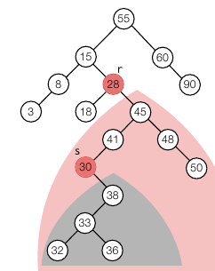

<div class="notice--danger">
    <b>'쉽게 배우는 자료구조 with 자바 (문병로)' 내용 중 일부입니다.</b>
</div>


# 색인

​	색인이란 데이터를 잘 찾을 수 있도록 만들어진 키워드입니다. DB 에서는 개체의 레코드를 검색하기 위한 것으로 볼 수 있습니다. 색인은 주로 해당 레코드를 대표할 수 있는 필드로 만듭니다. 주민번호, 학번 등이 될 수 있습니다. 

# 이진 검색 트리

​	검색 트리는 색인을 통해 검색을 하기 위한 방법 중 하나입니다. 검색 트리는 저장되는 장소에 따라 내장 검색 트리와 외장 검색 트리로 나뉘는데, 내장 검색 트리는 검색 트리가 메인 메모리 내에 존재하는 것이고, 외장 검색 트리는 외부(HDD 등) 에 존재하는 것입니다. 어떤 프로그램이든 메인 메모리 전체를 검색 트리에 사용할 수 없으므로 외장 검색 트리도 존재하는 것입니다.

​	이진 검색 트리는 검색 트리 중 각 노드 당 2개의 자식 노드를 갖추는 트리 구조입니다. 임의의 노드 키값에 대해 왼쪽 아래에 있는 모든 노드의 키값보다 크고, 오른쪽 아래에 있는 모든 키캆보다 작아야 합니다. 각 노드는 필드로 item, left, right 를 가집니다. 그리고 이진 검색 트리 클래스는 검색, 삽입, 삭제 등의 메서드를 가집니다.

​	원소 n 개의 노드를 가진 이진 트리의 최소 높이는 log(n+1) 이며 최대 높이는 n 입니다. 최소 높이일 때는 이진 포화 트리일 때이며 최대 높이일 때는 모든 노드가 일자로 연결되어 있을 때입니다. 따라서 평균 검색, 삽입 등의 시간은 O(logn) 이지만 최악의 경우 O(n) 이 됩니다.

## 검색

```
search(t, x): //t 는 트리의 루트 노드 레퍼런스, x 는 검색하고자하는 키
	if(t == null || t.item = x)
		return t
    else if (x < t.item)
    	return search(t.left, x)
    else
    	return search(t.right, x)
```

검색은 재귀적으로 자식노드의 키값과 비교하면서 아래로 내려갑니다. 검색에 실패한다면 null 값을 리턴합니다.

## 삽입

```
insert(x):
	root <- isertItem(root, x)

insertItem(t, x):
	if(t = null)
		r.item <- x
		r.left <- null
		r.right <- null
		return r
    else if(x < t.item)
    	t.left <- insertItem(t.left, x)
    	return t
    else if(x > t.item)
    	t.right <- insertItem(t.right, x)
    	return t
    else
    	return t
```

삽입은 전체적으로 검색과 같은 구조를 가집니다. x 의 값이 t.item 과 같다면 메서드가 그대로 종료됩니다. 좌, 우측 노드를 찾으면서 해당 노드가 null 이면 새로운 노드인 r 을 만들고 넣어줍니다.

## 삭제

삭제는 3가지 경우로 나뉩니다. 리프 노드일 때, 자식이 1개일 때, 자식이 2개일 때 입니다. 리프 노드일 때는 그냥 삭제하면 됩니다. 자식이 1개일 때도 해당 노드를 삭제하고, 해당 노드의 부모 노드와 자식 노드를 연결하면 됩니다. 복잡한 건 자식이 2개일 때인데요. 해당 노드를 삭제하고, 왼쪽 노드 중 가장 큰 노드를 넣거나, 오른쪽 노드 중 가장 작은 노드를 넣어야 합니다. 이중에서 "오른쪽 노드 중 가장 작은 노드" 를 찾으려면 오른쪽 서브 트리 중 가장 제일 왼쪽 노드입니다. 즉, 왼쪽으로 계속 내려갔을 때 왼쪽 자식 노드가 없는 노드가 "오른쪽 노드 중 가장 작은 노드" 입니다.


여기서 본다면 "28" 을 삭제했을 때, 오른쪽 서브 트리 중(45를 루트 노드로 하는 트리) 왼쪽으로 내려갔을 때 왼쪽 자식 노드가 없는 노드인 "30" 이 r 자리에 올 수 있습니다.

```
delete(t, x):
	if(t = null) /*error*/
	else if(x = t.item)
		t <- deleteNode(t)
		return t
    else if(x < t.item)
    	t.left <- delete(t.left, x)
    	return t
    else
    	t.right <- delete(t.right, x)
    	return t

deleteNode(t):
	if(t.left = null && t.right = null) //리프노드 일 때
		return null
    else if(t.left = null) //오른쪽 자식노드만 있을 때
    	return t.right
    else if(t.right = null) //왼쪽 자식노드만 있을 때
    	return t.left
    else
    	(minItem, node) <- deleteMinItem(t.right)
    	t.item <- minItem
    	t.right <- node
    	return t
    	
deleteMinItem(t):
	if(t.left = null)
		return (t.item, t.right)
    else 
    	(minItem, node) = deleteMinItem(t.left)
    	t.left <- node
    	return (minItem, t)
```

리프노드일 때와 자식노드가 1개일 때는 검색을 통해 내려가면서 해당 노드가 나오면 그 노드를 삭제하고 부모노드와 자식노드를 연결해주면 됩니다. 하지만 자식노드가 2개일 때는 변경할 노드까지 내려가서 변경할 노드를 임시 저장한 후 부모노드와 자식노드를 이어주고 다시 올라갑니다.


1. 삭제할 28 을 찾고 변경해줄 30 을 찾으러 내려갑니다.
2. 30 을 찾으면 자식 노드가 1개 뿐이니까 부모, 자식 노드를 연결해줍니다. (41, 38 연결)
3. 다시 올라가면서 30 을 28 자리에 넣어줍니다.

삭제는 좌우 균형 상태에 따라 O(logn) 이 될 수도 있고 O(n) 이 될 수도 있습니다. 

# 이진 검색트리 순회

순위의 구현은 간단하게 할 수 있습니다.

```
preOrder(r): //r 은 루트노드
	if(r != null)
		r.visited = true
		preOrder(r.left)
		preOrder(r.right)
		
inOrder(r):
	if(r != null)
		inOrder(r.left)
		r.visited = true
		inOrder(r.right)
		
postOrder(r):
	if(r != null)
		postOrder(r.left)
		postOrder(r.right)
		r.visited = true
```

여기서 각 노드에 대해 방문 여부를 설정했지만 다른 로직을 통해 값을 저장하는 등의 행동이 가능합니다.

# 구현

먼저 인터페이스입니다.

```java
public interface IndexInterface<T> {
    T search(Comparable x);
    void insert(Comparable x);
    void delete(Comparable x);
    boolean isEmpty();
    void clear();
}
```

다음은 TreeNode 입니다.

```java
package datastructure.tree.common;

public class TreeNode {
    public Comparable key;
    public TreeNode left;
    public TreeNode right;

    public TreeNode (Comparable key){
        this.key = key;
        left = null;
        right = null;
    }

    public TreeNode(Comparable newKey, TreeNode left, TreeNode right){
        key = newKey;
        this.left = left;
        this.right = right;
    }
}
```

다음은 구현 클래스 BinarySearchTree 입니다. root 가 private 인 것을 제외하고는 알고리즘과 똑같습니다.

```java
package datastructure.tree.BST;

import datastructure.tree.common.TreeNode;

public class BinarySearchTree implements IndexInterface<TreeNode> {

    private TreeNode root;
    public BinarySearchTree(){
        root = null;
    }

    @Override
    public TreeNode search(Comparable x) {
        return searchItem(root, x);
    }

    private TreeNode searchItem(TreeNode tNode, Comparable x) {
        if(tNode == null) return null;
        else if(x.compareTo(tNode.key) == 0) return tNode;
        else if(x.compareTo(tNode.key) < 0) return searchItem(tNode.left, x);
        else return searchItem(tNode.right, x);
    }

    @Override
    public void insert(Comparable x) {
        root = insertItem(root, x);
    }

    private TreeNode insertItem(TreeNode tNode, Comparable newItem) {
        if(tNode == null) return new TreeNode(newItem, null, null);
        else if(newItem.compareTo(tNode.key) < 0) tNode.left = insertItem(tNode.left, newItem);
        else tNode.right = insertItem(tNode.right, newItem);
        return tNode;
    }

    @Override
    public void delete(Comparable x) {
        root = deleteItem(root, x);
    }

    private TreeNode deleteItem(TreeNode tNode, Comparable x) {
        if(tNode == null) return null;
        else {
            if(x == tNode.key) tNode = deleteNode(tNode);
            else if(x.compareTo(tNode.key) < 0) tNode.left = deleteItem(tNode.left, x);
            else tNode.right = deleteItem(tNode.right, x);
        }
        return tNode;
    }

    private TreeNode deleteNode(TreeNode tNode) {
        if((tNode.left == null) && (tNode.right == null)) return null;
        else if(tNode.left == null) return tNode.right;
        else if(tNode.right == null) return tNode.left;
        else {
            ReturnPair rPair = deleteMinItem(tNode.left);
            tNode.key = rPair.key;
            tNode.right = rPair.node;
            return tNode;
        }
    }

    private ReturnPair deleteMinItem(TreeNode tNode) {
        if(tNode.left == null) return new ReturnPair(tNode.key, tNode.right);
        else {
            ReturnPair rPair = deleteMinItem(tNode.left);
            tNode.left = rPair.node;
            rPair.node = tNode;
            return rPair;
        }
    }

    private class ReturnPair {
        private Comparable key;
        private TreeNode node;
        public ReturnPair(Comparable key, TreeNode node){
            this.key = key;
            this.node = node;
        }
    }

    @Override
    public boolean isEmpty() {
        return root == null;
    }

    @Override
    public void clear() {
        root = null;
    }
}

```

