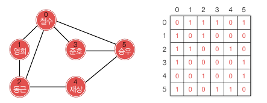
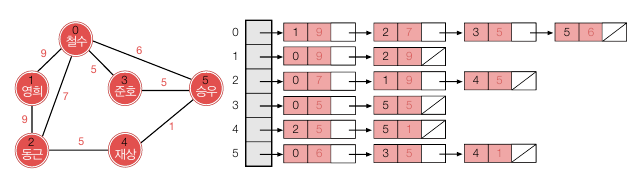
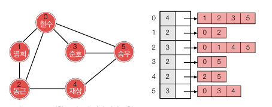
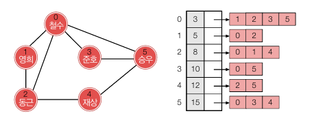
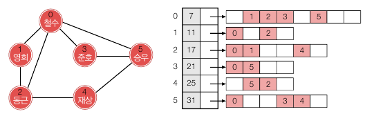
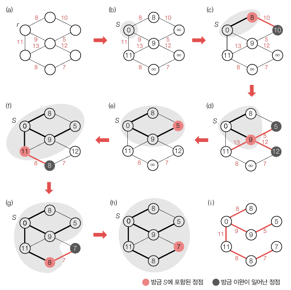
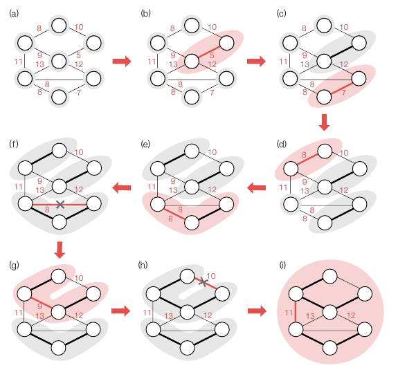

<div class="notice--danger">
    <b>'쉽게 배우는 자료구조 with 자바 (문병로)' 내용 중 일부입니다.</b>
</div>

# 그래프

​	그래프란 현상이나 사물을 정점(Vertax)  와 간선(Edge) 로 나타낸 것으로, 정점은 대상이나 개체, 간선은 관계를 표현합니다. 간선은 단방향, 양방향(무향)일 수 있으며, 거리나 친밀도 등의 정보도 포함될 수 있습니다. 정점의 집합 V 와 간선 집합 E 로 구성된 그래프 G 를 보통 G = (V, E) 로 표현하며 정점의 총 수는 n 으로 표기됩니다. 정점 u 와 v 를 잇는 간선은 보통 {u, v} 또는 (u, v) 로 나타내는데, 관행적으로 전자는 무방향, 후자는 방향 간선을 나타냅니다. 혹은 (u-v), (u -> v) 로 표기할 수 있습니다.

# 그래프의 표현

## 인접행렬

​	그래프에서 정점의 총 수가 n 일 때 n x n 행렬이 필요합니다. 정점 i 에서 j 로 가는 간선이 있으면 G[i]\[j] = 1 입니다. 아래는 무향 그래프를 인접행렬로 나타낸 것입니다. 무향 그래프에서 G[i]\[j] = 1 이면 G[j]\[i] = 1 을 만족할 것입니다.



만약 간선에 가중치가 있으면 1 의 값을 가중치로 변경해주면 됩니다.

행렬은 표현법은 쉽지만 n^2 만큼의 공간이 필요하고, 원소를 채우는 데만 n^2 에 비례하는 시간이 듭니다. **간선의 밀도가 아주 높은 그래프에서는 인접 행렬 표현이 적합합니다.** 하지만 반대의 경우, 예를 들어 100개의 정점을 가진 방향 그래프에서 간선이 총 200개밖에 없는 경우에 행렬 표현을 쓰면 시간과 공간이 많이 낭비됩니다. 이 때 행렬의 총 원소 수는 10,000개인데 이 중 2% 밖에 사용하지 않기 때문입니다.

## 인접 리스트

​	각 정점마다 리스트를 하나씩 만들고 (보통 연결리스트) 인접한 정접들을 하나의 연결 리스트에 매다는 것입니다. 따라서 존재하지 않는 간선은 리스트에 나타나지 않습니다. 가중치를 더하는 경우에는 노드 안에 추가해주면 됩니다. 아래는 가중치가 있는 인접 리스트입니다.



**인접 리스트는 간선의 수가 적을 때 유용합니다.** 반대로 거의 모든 정점 쌍에 대해 간선이 존재하는 경우 오히려 링크 정보를 표현하기 위한 오버헤드 공간만 더 차지합니다. 또한 i -> j 간선이 존재하는지 확인하기 위해 리스트를 차례대로 훑어야 하기 때문에 인접 행렬 표현보다 시간이 많이 걸립니다. 

## 인접 배열

​	인접 배열은 인접 리스트처럼 간선 수만큼만 저장하면서 인접 행렬만큼 빠른 시간에 검색이 가능합니다. 인접 배열은 각 정점에 연결된 정점들을 연결 리스트 대신 배열로 저장합니다. 이를 통해 링크로 인한 공간 낭비를 막고, 메모리가 흩어지는 걸 방지할 수 있습니다. 



이렇게 저장하면 값이 정렬되어 있어 검색 시에 이진 탐색을 사용할 수 있기 때문에 logn + 1번 이내로 검색이 가능합니다. 각 정점의 인접 배열 헤더에 인접 정점이 몇 개인지 표시해두면 쉽게 탐색할 수 있습니다. (제 생각엔 그냥 배열만 저장해도 length 필드로 인접 정점 개수를 얻을 수 있어서 개수 표시는 필요없을 것 같습니다.)

​	아래는 공간을 깔끔하게 사용하기 위해 하나의 배열로 모든 간선을 저장하는 방법입니다. 간선은 모두 하나의 배열에 저장되며, 배열에 접근하기 위한 배열을 사용하면 될 듯 합니다.



예를 들어 A = [3, 5, 8, 10, 12, 15], B = [1, 2, 3, 5, 0, 2, 0, 1, 4, 0, 5, 2, 5, 0, 3, 4] 로 저장하면, 0번 정점의 간선은 A[0] 의 값인 B[0...3] 이고, 1번 정점의 간선은 A[0] + 1 부터 A[1] 까지인 B[4...5] 가 됩니다.

## 인접 해시 테이블

​	인접 배열이라고 해도 정점 당 인접 배열의 평균 크기가 백만 이라면 이진 탐색을 해도 최대 20회의 비교가 필요합니다. 따라서 인접 배열 각각을 해시 테이블로 대체할 수도 있습니다. 각 인접 배열 크기의 2배 정도 되는 공간을 할당하여 적재율을 0.5 로 만들면 평균 2번의 비교로 간선을 찾을 수 있습니다.



위 배열은 인접 배열과 비슷한 모양이며, 각 정점의 배열 크기만 2배로 늘어난 걸로 보면 됩니다. 

# BFS, DFS

<div class="notice--primary">
    <b>여기에 없는 내용만 추가했습니다. <a href="https://hobeen-kim.github.io/til-codestates/codestates-tree-traversal,-graph-traversal/">[codestates] tree traversal, graph traversal]</a></b>
</div>

## BFS

BFS 의 알고리즘은 아래와 같습니다.

```
BFS(G, s):
	for each v //s 와 연결된 정점
		v.visited <- false
    s.visited <- true
    enqueue(Q, s) //Q : 큐
    while(Q is not empty)
    	u <- dequeue(Q)
    	for each v //u 의 인접 정점
    		if(v.visited = false)
    			v.visited <- true
				enqueue(Q, v)
```

BFS 의 수행시간은 각 정점별 간선의 수만큼 방문해야 하므로 θ(V + E) 입니다.

## DFS

```
DFS(G, v):
	v.visited <- true
	for each x //x 는 정점 v 의 인접 정점 집합
		if(x.visited = false)
			DFS(G, x)
```

DFS 도 모든 정점과 간선을 방문한다면 수행시간은 θ(V + E) 입니다.

# 최소 신장 트리

​	신장 트리는 G = (V, E) 에서 정점 집합 V 는 그대로 두고 간선을 |V| - 1 개만 남겨 최소한의 간선으로 하나의 그래프 구조를 유지하게 하는 것입니다. 이러한 그래프 구조는 트리와 같은 구조가 됩니다. 그래프의 간선에 가중치가 있다면 신장 트리를 구성하는 간선의 가중치를 다 더한 것을 그 **신장 트리의 비용**이라고 합니다. 그리고 최소 신장 트리는 모든 신장 트리 중 비용이 가장 낮은 트리를 말합니다.

​	이제 소개할 프림 알고리즘과 크루스칼 알고리즘의 무결성은 다음 정리를 기반으로 하고 있습니다. S 와 V-S 사이의 교차 간선드 중 가장 가벼운 간선을 최소 교차 간선이라고 하겠습니다.

> 간선이 가중치를 갖는 무방향 그래프 G = (V, E) 의 정점들이 임의의 두 집합 S 와 V-S 로 나누어져 있을 때, 간선 (u-v) 가 S 와 V-S 사이의 최소 교차 간선이면 (u-v) 를 포함하는 그래프 G 의 최소 신장 트리가 반드시 존재한다.

## 프림 알고리즘(Prim Algorithm)

​	프림 알고리즘은 아무 간선도 없는 상태에서 간선을 하나씩 더하는 작업을 |V| - 1 번 반복합니다. 먼저 시작 정점 r 을 기준으로 한 번에 정점을 하나씩 더해갑니다. 정점을 더하는 것이 간선을 더하는 것과 같습니다. 알고리즘과 그림을 보면서 설명하겠습니다.

```
Prime(G, r): //G : 주어진 그래프, r : 시작 정점
	S <- {r} //S : 정점 집합
	r.cost <- 0
	for each u in V-{r}// u 는 r 을 제외한 모든 정점
		u.cost <- Wru
    while (S != V)
        u <- deleteMin(V-S)
        S <- S U {u}
        for each v in u.adj //u.adj 는 정점 u 에 인접한 정점 집합
            if(v in V-S and Wuv < v.cost)
                v.cost <- Wuv
                v.tree <- u
					
delteMin(Q):
	집합 Q 에서 u.cost 값이 가장 작은 정점 u 를 삭제하면서 리턴
```

v.cost 는 정접 집합에 연결되기 위한 최소 비용입니다. 그리고 Wuv 는 (u - v) 의 비용이며 v.tree 는 v 가 최소 비용으로 연결되는 정접 집합 내 정점입니다.



1. (a) 시작할 정점 r 을 정합니다.

2. (b) r 을 S 집합의 원소로 포함시킵니다. r.cost = 0 으로 설정하고 나머지 원소들의 cost 는 인접하지 않는 한 무한으로 설정합니다. r 에 인접한 원소의 cost 는 Wru 로, 각각 8, 9, 11 이 됩니다. 아래 알고리즘 단계입니다.

   ```
   for each u in V-{r} // u 는 r 을 제외한 모든 정점
       u.cost <- Wru //Wru 는 r 과의 거리이며 직접 연결되어 있지 않다면 무한(or Integer.MAX_VALUE) 로 설정
   ```

3. (c) S 집합에 포함되지 않는 원소 집합 중 S 집합과 최소 비용으로 연결되는 정점을 찾습니다. cost 가 가장 작은 원소의 비용은 8 이기 때문에 해당 정점을 S 에 포함시킵니다. 아래 알고리즘 단계 중 `u <- deleteMin(V-S)` 과 `S <- S U {u}` 입니다.

   이후 8 정점에 인접한 집합(V-S) 에서 각각의 v.cost 를 비교하면서 Wuv 가 현재의 V.cost 보다 작으면 v.cost 를 Wuv 로 변경하고 v.tree 는 u 로 변경합니다. 여기서 8 과 연결된 정점은 1개로, cost 가 무한대에서 10 으로 변경되었으며 10.tree 는 8 로 변경되었습니다. 아래 알고리즘 단계 중 for loop 입니다.

   ```
   ...
   while (S != V)
   	u <- deleteMin(V-S) //u 는 S 를 제외한 전체 집합 중 cost 가 가장 낮은 정점입니다.
   	S <- S U {u}
   	for each v in u.adj //u.adj 는 정점 u 에 인접한 정점 집합
               if(v in V-S and Wuv < v.cost)
                   v.cost <- Wuv
                   v.tree <- u        
   
   delteMin(Q):
   	집합 Q 에서 u.cost 값이 가장 작은 정점 u 를 삭제하면서 리턴 //굳이 삭제는 안해도 될 듯합니다.
   ```

4. (d) 다시 while 문이 돌면서 `deleteMin(V-S)` 을 실행하는데, 이 때 가장 작은 원소는 9 입니다. 그리고 9 에 연결된 원소들의 cost 가 생기는데, 이때 이전 단계에서 8 과 연결되어 비용이 10 으로 설정되었던 원소도 5 로 변경됩니다.

5. (e) ~ (h) 같은 방법으로 반복되며 모든 원소를 연결시킵니다. 최종적으로 (i) 와 같은 모습이 됩니다.
   

**시간 복잡도**

프림 알고리즘의 시간 복잡도는 O(ElogV) 입니다. 다시 알고리즘을 보면서 시간 복잡도를 계산해보겠습니다.

```
Prime(G, r): 
	S <- {r} 
	r.cost <- 0
	for each u in V-{r} //1
		u.cost <- Wru
    while (S != V) 
        u <- deleteMin(V-S) //2
        S <- S U {u}
        for each v in u.adj //3
            if(v in V-S and Wuv < v.cost)
                v.cost <- Wuv
                v.tree <- u
					
delteMin(Q):
	집합 Q 에서 u.cost 값이 가장 작은 정점 u 를 삭제하면서 리턴
```

1. (1) 은 정점의 개수 - 1 만큼 수행됩니다. O(V) 입니다.
2. (2) 는 정점의 집합 중 가장 작은 수를 찾아서 반환해야 합니다. 힙으로 구성되어있다고 했을 때 logV 의 시간이 걸리며, while 문을 통해 V 번 반복한다고 했을 때 시간 복잡도는 O(VlogV) 입니다. 하지만 `v.cost <- Wuv` 에서 정점의 cost 가 변경되면 힙을 조정해야 하는데, 이 시간이 logV 이며 이러한 조정은 간선의 개수인 E 만큼 반복될 수 있습니다. (이건 아래에서 살펴봅니다.) 따라서 O(ElogV) 입니다.
3. (3) 은 얼핏 보면 while 문에 정점별 반복으로 V * V 라고  생각할 수 있습니다. 하지만 (3) 의 for 문으로 계산되는 각 Wuv 간선은 모든 반복을 통틀어 2번만 호출됩니다. 예를 들어서 (1-2) 라는 간선이 있을 때 원소 1 이 u 로 추가될 때 인접 원소 2 를 훑어볼 때 확인되며, 원소 2가 추가될 때 훑어보게 됩니다. 따라서 간선 당 2번밖에 호출되지 않습니다. 각 간선이 연결된 원소가 2개니까요. 그러므로 for loop 는 2 * E 만큼 반복되며 시간 복잡도는 O(2E) 입니다. 또한 원소 1 이 S 에 추가될 때 간선의 cost 가 변경되며, 원소 2 가 S 에 추가될 때는 cost 가 변경되지 않습니다. 따라서 (2) 에서 2E 가 아니라 E 만큼 반복하는 이유가 됩니다.
   

## 크루스칼 알고리즘(Kruskal Algorithm)

​	크루스칼 알고리즘은 '여러' 정점 집합으로 시작해서 집합들을 합쳐나가는 방식으로 작동합니다. 각 정점 집합은 싸이클이 없는 연결된 그래프로 하나의 트리에 해당합니다. 이런 두 트리를 합쳐서 하나의 트리를 만들려면 양 끝점이 두 집합에 걸쳐 있는 간선이 필요합니다. 이런 식으로 n 개의 트리로 시작하여 트리를 합치는 과정을 n-1 번 수행하면 하나의 트리가 됩니다.

​	크루스칼 알고리즘은 먼저 모든 간선을 비용이 작은 순서로 정렬하고, 순서대로 살피면서 정점 집합을 합칠 수 있으면 간선이 선택되며 최소 신장 트리의 일부로 확정됩니다. 

```
Kruskal(G):
	T <- null //T: 신장트리
	각각 단 하나의 정점만으로 이루어진 n 개의 집합을 초기화합니다.
	모든 간선을 가중치의 크기 순으로 정렬하여 배열 A[0...|E|-1] 에 저장합니다.
	while(T 의 간선 수 < n-1)
		A 에서 최소 비용의 간선 (u-v) 를 제거합니다.
		if(정점 u 와 v 가 다른 집합에 속함)
			T <- T U {(u-v)}
			정점 u 와 v 가 속한 두 집합을 하나로 합칩니다.
```



1. (a) 주어진 그래프입니다. 7 개의 집합으로 시작합니다.
2. (b) 가장 작은 간선인 5 를 선택하고 두 집합을 합칩니다.
3. (c) ~ (e) 같은 과정을 반복합니다.
4. (f) 남은 8 을 선택하면 사이클이 만들어지기 때문에 해당 간선은 버립니다.
5. (g) 간선 9 를 선택하여 두 집합을 합칩니다.
6. (h) 간선 10 을 선택하면 사이클이 만들어지기 때문에 해당 간선은 버립니다.
7. (i) 간선 11 을 선택하여 최종적으로 최소 신장 트리를 만듭니다. 

**시간 복잡도**

```
Kruskal(G):
	T <- null //T: 신장트리
	각각 단 하나의 정점만으로 이루어진 n 개의 집합을 초기화합니다.
	모든 간선을 가중치의 크기 순으로 정렬하여 배열 A[0...|E|-1] 에 저장합니다. //1
	while(T 의 간선 수 < n-1) //2
		A 에서 최소 비용의 간선 (u-v) 를 제거합니다. //3
		if(정점 u 와 v 가 다른 집합에 속함) //4
			T <- T U {(u-v)} //5
			정점 u 와 v 가 속한 두 집합을 하나로 합칩니다. //6
```

1. 가중치의 크기 순 정렬은 O(ElogE) = O(ElogV) 입니다. E 의 최대 개수가 V(V-1)/2 이니 logE = logV 로 봐도 무방합니다.
2. while 문은 최소 |V| - 1회, 최대 |E| 회 반복됩니다.
3. 간선 제거는 상수 시간이 듭니다.
4. 4와 6번은 두 정점이 다른 집합에 속하는지 확인하고 합치는 작업으로 while 문까지 통틀어 O(E + VlogV) 시간에 처리됩니다.
5. 간선을 단순히 합치는 작업은 상수 시간이 듭니다.

여기서 가장 오래걸리는 건 1번인, 크기 순 정렬이 되며 **총 수행시간은 O(ElogV)** 입니다.
