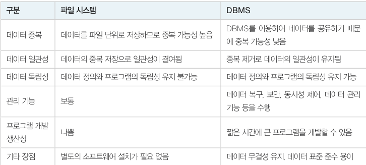
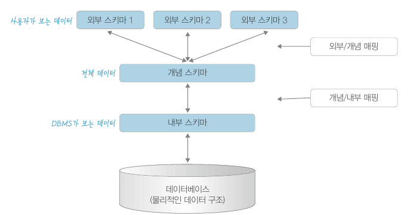
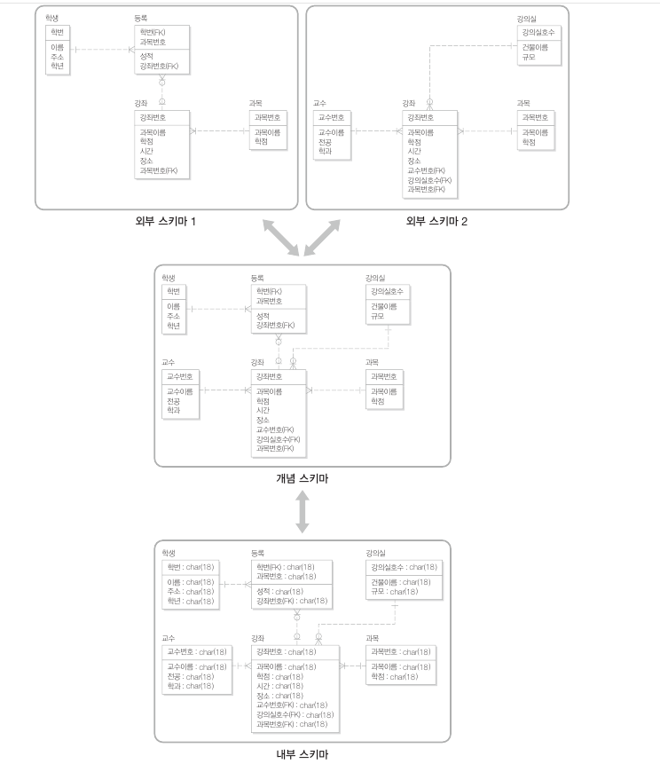

# 데이터베이스 시스템 구성

​	데이터베이스 시스템은 DBMS 를 도입하여 데이터를 통합관리하는 시스템입니다. **DBMS, DB, Data Model** 로 구성됩니다.

- DBMS : 사용자와 데이터베이스를 연결시켜주는 소프트웨어로, 주기억장치에 상주합니다.
- DB : 컴퓨터 내부의 하드디스크에 저장되는 데이터입니다.
- Data Model : **데이터가 저장되는 기법**에 관한 내용으로, **눈에 보이지 않는 논리적인 개념**입니다. 관계 데이터 모델도 하나의 데이터 모델입니다.

## 데이터를 저장하는 방법

1. 데이터를 프로그램 내부에 저장
2. 파일 시스템을 사용 (별도의 파일에 저장)
   - 문제점 : 데이터 구조 변경 시 파일 시스템을 새로 컴파일해야 합니다. 또한 같은 파일을 두 개의 프로그램이 공유할 수 없습니다. (운영체제의 도움이 있다면 가능합니다.)
3. DBMS 를 사용
   - 데이터 정의와 데이터 값을 DBMS 가 관리합니다. 프로그램에 데이터 정의나 데이터 값을 포함하지 않기 때문에 데이터 구조가 바뀌어도 다시 컴파일할 필요가 없습니다.

다음은 파일 시스템과 비교한 DBMS 의 장점입니다.

# 데이터베이스의 개념적 구조

​	데이터베이스의 개념적 구조는 복잡한 DB 구조를 3단계로 분리하여 단순하게 표현한 것입니다.

- **외부 스키마** : 일반 사용자나 응용 프로그래머가 접근하는 계층으로, 전체 DB 중 하나의 논리적인 부분을 의미합니다.
- **개념 스키마** : 전체 DB 정의를 의미합니다. 하나의 DB 는 하나의 개념 스키마가 있습니다. 데이터와 관계, 제약사항, 무결성에 대한 내용이 포함됩니다.
- **내부 스키마** : 물리적 저장장치에 DB 가 실제 저장되는 방법을 표현합니다. 인덱스, 데이터 레코드의 배치 방법, 데이터 압축 등에 관한 사항이 포함됩니다.

아래는 대학교 수강신청을 위한 DB 의 구조입니다.

이러한 3단계 DB 구조의 특징은 **데이터 독립성**입니다.

1. 논리적 데이터 독립성(logical data independece)

   **외부 단계와 개념 단계 사이의 독립성으로, 개념 스키마가 변경되어도 외부 스키마에는 영향을 미치지 않도록 지원합니다.** 예를 들어 개념 스키마의 테이블을 생성하거나 변경하여도 외부 스키마가 직접 다르는 테이블이 아니면 영향이 없습니다.

2. 물리적 데이터 독립성(physical data independence)

   **개념 단계와 내부 단계 사이의 독립성으로ㅗ, 저장장치 구조 변경과 같이 내부 스키마가 변경되어도 개념 스키마에 영향을 미치지 않도록 지원합니다.** 예를 들어 성능 개선을 위하여 물리적 저장장치를 재구성할 경우 개념 스키마나 응용 프로그램 같은 외부 스키마에 영향이 없습니다. 