# 관계 데이터 모델의 개념

1. **릴레이션** : 행과 열로 구성된 테이블입니다. 스키마와 인스턴스로 이루어져있습니다.
2. **스키마** :  릴레이션에 어떤 정보가 담길지 정의합니다. 각 열을 속성이라고 합니다.
   - 속성 : 릴레이션 스키마의 열
   - 도메인 : 속성이가질 수 있는 값의 집합 (1 보다 큰 정수의 집합 등)
   - 차수 : 속성의 개수
3. **인스턴스** : 릴레이션 스키마에 실제 저장된 데이터의 집합입니다.
   - 투플 : 릴레이션의 행
   - 카디날리티 : 투플의 수

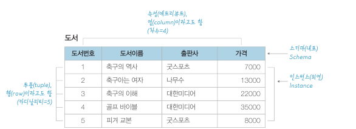

​	관계 데이터 모델은 데이터를 **2차원 테이블 형태인 릴레이션**으로 표현하며, 릴레이션에 대한 **제약조건(constraints)** 과 관계 연산을 위한 관계대수(relational algebra) 를 정의합니다. 이러한 **관계 데이터 모델을 컴퓨터 시스템에 구현한 것을 관계 데이터베이스 시스템**이라고 합니다.

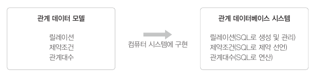

# 무결성 제약조건

​	데이터를 저장하는 데 있어서 DB 는 일관성을 유지하고 중복을 제거하는 등 데이터 신뢰도를 유지해야 합니다. 따라서 삽입, 삭제, 수정 시 여러가지 제약조건이 따릅니다.

## 키

**슈퍼키(super key)**

​	슈퍼키는 튜플을 유일하게 식별할 수 있는 하나의 속성 혹은 속성의 집합입니다. 두 개 이상의 속성을 조합한 것도 슈퍼키입니다.

**후보키(candidate key)**

​	튜플을 유일하게 식별할 수 있는 속성의 최소 집합입니다. 예를 들어서 (주민번호, 이름) 은 슈퍼키지만 후보키는 아닙니다. 주민번호만으로도 유일하게 식별할 수 있기 때문입니다. **기본키로 선정되지 않은 후보키는 대체키입니다.**

**기본키(primary key)**

​	여러 후보키 중 하나를 선정하여 대표로 삼는 키를 말합니다.

**대리키(surrogate key)**

​	일련번호 같은 가상의 속성을 만들어 기본키로 활용하는 키입니다. id 를 임의로 1, 2, 3, ... 과 같이 붙이는 것을 의미합니다.

**외래키(foreign key)**

​	다른 릴레이션의 기본키를 참조하는 속성을 말합니다. 기본키가 변경되면 이 기본키를 참조하는 외래키 값 역시 변경되어서 데이터 일관성을 유지해야 합니다. 외래키는 NULL 값을 포함할 수 있고 중복값도 허용합니다. **이 때 참조하는 릴레이션과 참조되는 릴레이션이 꼭 다른 릴레이션일 필요는 없습니다.**

## 무결성 제약 조건

​	무결성 제약조건에는 튜플에 삽입 가능한 데이터의 값을 제한하는 도메인 무결성 제약조건, 관계 데이터 모델의 핵심인 관계 표현을 위한 개체 무결성 제약조건, 참조 무결성 제약조건이 있습니다.

- **도메인 무결성 제약조건** : 도메인 제약이라고도 합니다. 릴레이션 내의 튜플들이 각 속성의 도메인에 지정된 값만을 가져야 한다는 조건입니다.
- **개체 무결성 제약조건** : 기본키 제약이라고도 합니다. 기본키는 NULL 값을 가져서는 안되며 릴레이션 내에 오직 하나의 값만 존재해야 한다는 조건입니다.
- **참조 무결성 제약조건** : 외래키 제약이라고도 합니다. 자식 릴레이션의 외래키는 부모 릴레이션의 기본키와 도메인이 동일해야 하며, 자식 릴레이션의 값이 변경될 때 부모 릴레이션의 제약을 받는다는 조건입니다.

> **UNIQUE 제약조건(유일성 제약조건)**
>
> 실제 DBMS 에서는 UNIQUE 제약조건도 사용합니다. UNIQUE 제약조건은 속성의 모든 값들에 서로 같은 값이 없어야 한다는 것입니다. 이는 릴레이션 내의 각각의 튜플을 유일하게 식별할 수 있는 속성들의 집합으로 볼 수 있습니다.

**참조 무결성 제약조건에 따른 삭제**

​	자식 릴레이션에서 튜플이 삭제되는 경우에는 바로 삭제할 수 있습니다. 하지만 부모 릴레이션의 튜플이 삭제되는 경우에 문제가 발생할 수 있고, DBMS 는 먼저 부모 릴레이션의 기본키를 참조하고 있는 다른 릴레이션이 없는지 확인해야 합니다. 그리고 있으면 조치방법으로 다음과 같은 네 가지를 고려할 수 있습니다.

- **RESTRICTED** : 즉시 작업을 중지
- **CASCADE** : 자식 릴레이션의 관련 튜플도 모두 삭제
- **DEFAULT** : 초기에 설정된 다른 어떤 값으로 변경
- **NULL** : NULL 값으로 설정

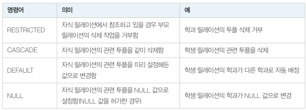

​	이 때 수정도 비슷한 방식대로 일어나는데요. 수정은 삭제와 삽입 명령이 연속해서 수행된다고 보면 됩니다. **부모 릴레이션의 수정이 일어날 경우 삭제 옵션에 따라 처리된 후 다시 삽입 제약조건에 따라 처리됩니다.** RDBMS 가 CASCADE UPDATE 옵션을 지원한다면 해당 옵션으로 기본키가 변경될 때 외래키도 함께 변경할 수 있습니다.

# 관계대수

​	관계대수는 어떤 데이터를 어떻게 찾는지에 대한 처리 절차를 명시하는 절차적 언어로, DBMS 내부의 처리 언어로 사용됩니다.

## 관계대수 연산자

- 순수 관계 연산 : 셀렉션(selection), 프로젝션(projection), 조인(join), 디비전(division), 개명(rename)
- 일반 집합 연산 : 합집합(union), 차집합(difference), 교집합(intersection), 카티전 프로덕트(cartesian product)

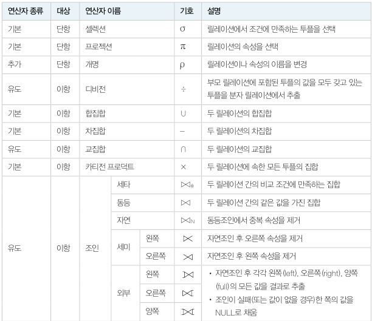

**관계대수식**

​	관계대수식은 관계대수 연산을 수행하기 위한 식입니다. 수학의 연산과 동일하게 괄호`()` 안의 식이 우선하며 왼쪽에서 오른쪽으로 진행됩니다.

- 단항 연산자 : $연산자_{<조건>}$ 릴레이션
- 이항 연산자 : 릴레이션1 $연산자_{조건}$ 릴레이션2

관계대수식의 결과는 릴레이션으로 반환되며, 릴레이션의 모든 특징을 따릅니다. 예를 들어 아래와 같은 R1, R2 릴레이션이 있습니다.

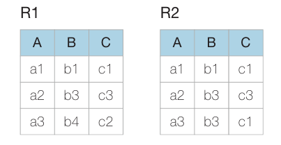

아래는 관계 대수식의 사용 예시입니다.

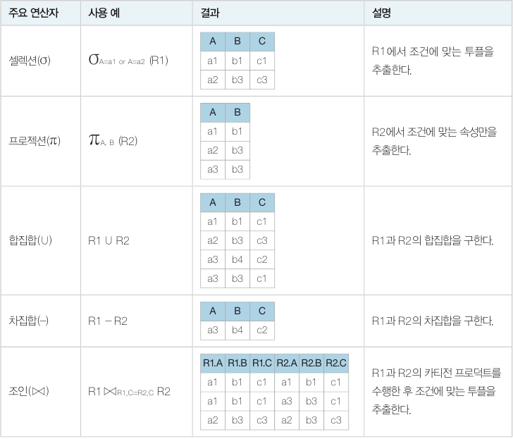

## 셀렉션과 프로젝션

​	셀렉션과 프로젝션은 관계대수에서 가장 기본적인 연산으로, 단항 연산자이자 순수 관계 연산자입니다.

**셀렉션**

​	셀렉션(selection) 은 릴레이션의 튜플을 추출하기 위한 연산입니다. `AND(∧)`, `OR(∨)`, `NOT(ㄱ)` 등의 논리 연산자를 사용하여 여러 개의 조건들을 하나의 조건으로 결합시킬 수도 있습니다.

- `판매 도서 중 8,000원 이하인 도서는?` : $σ_{가격 < = 8000}$(도서)
- `판매 도서 중 가격이 8,000원 이하이고 도서번호가 3 이상인 도서는?` : $σ_{가격 < = 8000∧도서번호 >= 3}$(도서)

**프로젝션**

​	프로젝션(projection) 은 릴레이션의 속성을 추출하기 위한 단항 연산자입니다.

- `고객 테이블에서 (이름, 주소, 핸드폰) 만 추출하여 주소록 작성` : $π_{이름, 주소, 핸드폰}$(고객)

## 집합연산

​	수학의 집합 연산과 같은 연산으로 합집합(U), 교집합(∩), 차집합(-), 카티전 프로덕트(X) 등이 있습니다. 이 중 카티전 프로덕트를 제외한 연산자는 두 릴레이션의 차수 및 도메인과 속성의 순서가 동일해야 합니다. 이 조건을 **합병 가능(union compatible)** 이라고 합니다.

**합집합**

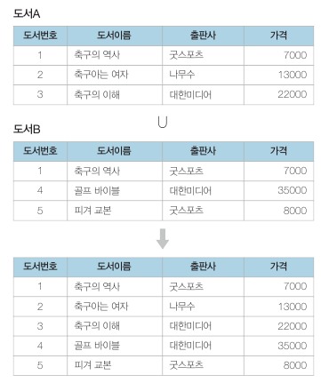

**차집합**

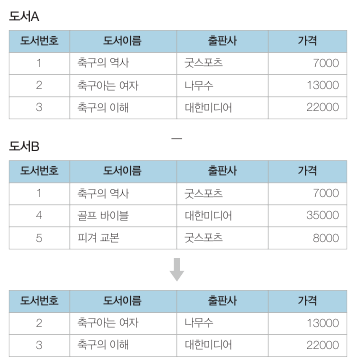

**교집합**

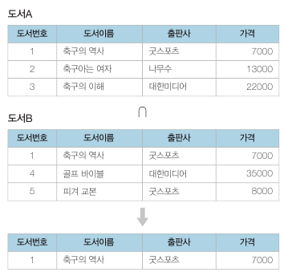

**카티전 프로덕트(일부 생략)**

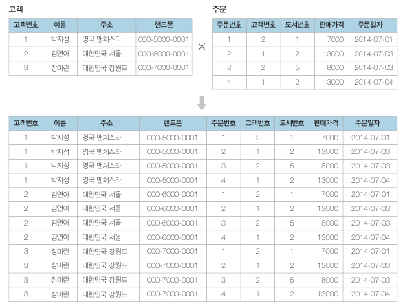

## 조인

​	조인은 두 릴레이션의 공통 속성을 기준으로 속성값이 같은 튜플을 수평으로 결합하는 연산입니다. **즉, 두 릴레이션을 카티전 프로덕트 연산을 한 후 셀렉션 연산을 한 것으로 정의할 수 있습니다.** 조인의 연산 기호는 ⋈ 입니다. 아래 식은 기본 연산자로 조인 연산을 표현한 것입니다.

R $⋈_c$S = $σ_c$(RXS) (c 는 조인 조건)

**세타조인과 동등조인**

​	세타조인은 조인에 참여하는 두 릴레이션의 속성 값을 비교하여 조건을 만족하는 튜플만 반환합니다. 세타조인의 조건은 `=, !=, <=, >=, <, >` 중에 하나가 됩니다.

세타조인 : R $⋈_{r 조건 s}$S 

​	동등조인은 세타 조인에서 `=` 연산자를 사용한 조인을 말합니다. 보통 조인연산이라고 하면 동등조인을 말합니다.

동등조인 :  R $⋈_{r = s}$S  (ex. 고객 $⋈_{고객.고객번호 = 주문.고객번호}$주문)

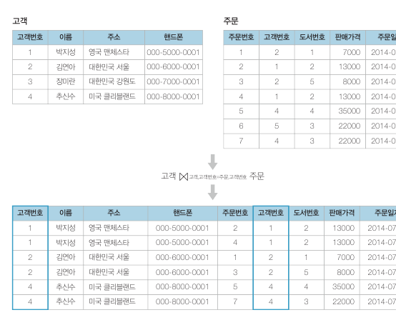

**자연조인**

​	자연조인은 동등조인에서 조인에 참여한 속성이 두 번 나오지 않도록 두 번째 속성을 제거한 결과를 반환합니다.

- `고객과 고객의 주문사항을 모두 보여주되 같은 속성은 한번만 표시` : 고객 $⋈_{N(고객.고객번호 = 주문.고객번호)}$주문

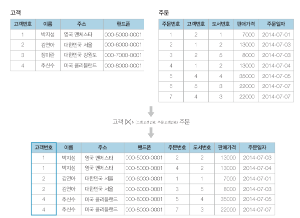

**외부조인**

​	외부조인은 자연조인의 확장된 형태로, 값이 없는 대응 속성에는 NULL 값을 채워서 반환합니다. 외부조인은 모든 속성을 보여주는 기준 릴레이션의 위치에 따라 left 외부조인, right 외부조인, full 외부조인으로 나뉩니다. 기호는 각각 ⟕, ⟖, ⟗ 입니다. 아래는 왼쪽 외부조인의 예시입니다.

- `고객 기준으로 주문내역이 없는 고객도 모두 보이게 하기` : 고객 $⟕_{(고객.고객번호, 주문.고객번호)}$주문 (left outer join)
- `주문내역이 없는 고객과 고객번호가 없는 주문 모두 보이게 하기` : 고객 $⟗_{(고객.고객번호, 주문.고객번호)}$주문 (full outer join)
- `주문내역 기준으로 고객번호가 없는 주문도 모두 보이게 하기` : 고객 $⟖_{(고객.고객번호, 주문.고객번호)}$주문 (right outer join)

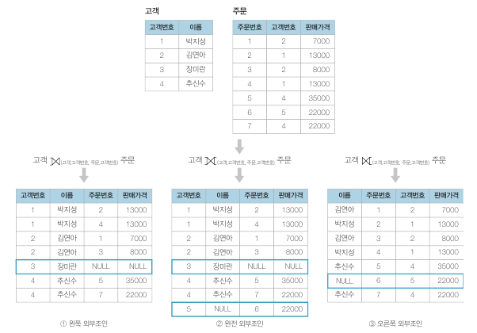

**세미조인**

​	세미조인은 자연조인을 한 후 두 릴레이션 중 한쪽 릴레이션의 결과만 반환합니다. ⋉ 와 ⋊ 를 사용합니다. R$⋉_{(r,s)}$S 와 같이 사용합니다. 기호에서 닫힌 쪽 릴레이션 튜플만 반환합니다.

- `고객 릴레이션에서 주문 내역이 있는 고객의 고객정보 출력` :  고객$⋉_{(고객.고객번호, 주문.고객번호)}$주문

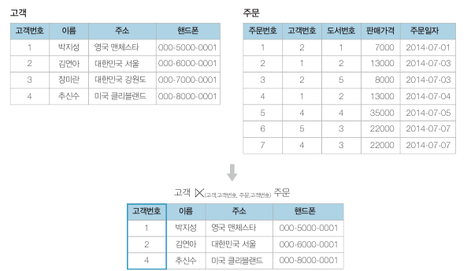

최초에는 자연조인처럼 6개의 튜플이 생성되지만 닫힌 쪽 릴레이션(고객 릴레이션) 만 반환되므로 동일한 튜플은 제거되고 3개만 남습니다.

## 디비전

​	디비전은 다른 연산과 달리 **릴레이션의 속성 값의 집합으로 연산을 수행**합니다. 

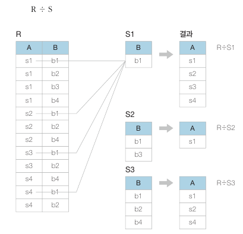

- R ÷ S1 : 릴레이션 R 에서 B 속성에 b1 튜플이 존재하는 속성 A = {s1, s2, s3, s4} 를 반환합니다.
- R ÷ S2 : 릴레이션 R 에서 B 속성에 {b1, b3} 가 모두 존재하는 A = {s1} 을 반환합니다.
- R ÷ S3 : 릴레이션 R 에서 B 속성에 {b1, b2, b4} 가 모두 존재하는 A = {s1, s2, s4} 를 반환합니다.

## 관계대수 예제

​	관계대수식은 여러 연산자들을 복합하여 사용하는 경우가 많습니다.

### 셀렉션, 프로젝션, 집합 연산의 복합사용

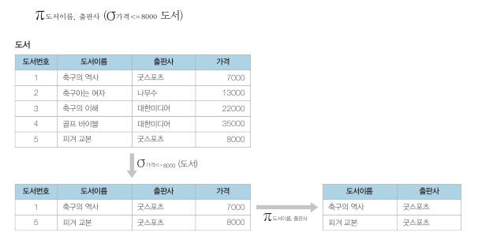

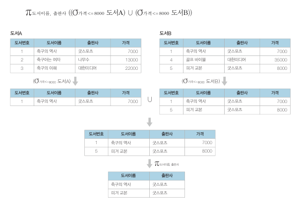

### 카티전 프로덕트를 사용한 연산

문 : 서점의 박지성 고객의 거래 내역 중 주문번호, 이름, 가격을 보이시오.

1. 고객X주문 연산
2. 셀렉션 연산 (`고객.고객번호=주문.고객번호 AND 고객.이름='박지성'`)
3. 프로젝션 연산(`주문.주문번호, 고객.이름, 주문.판매가격`)

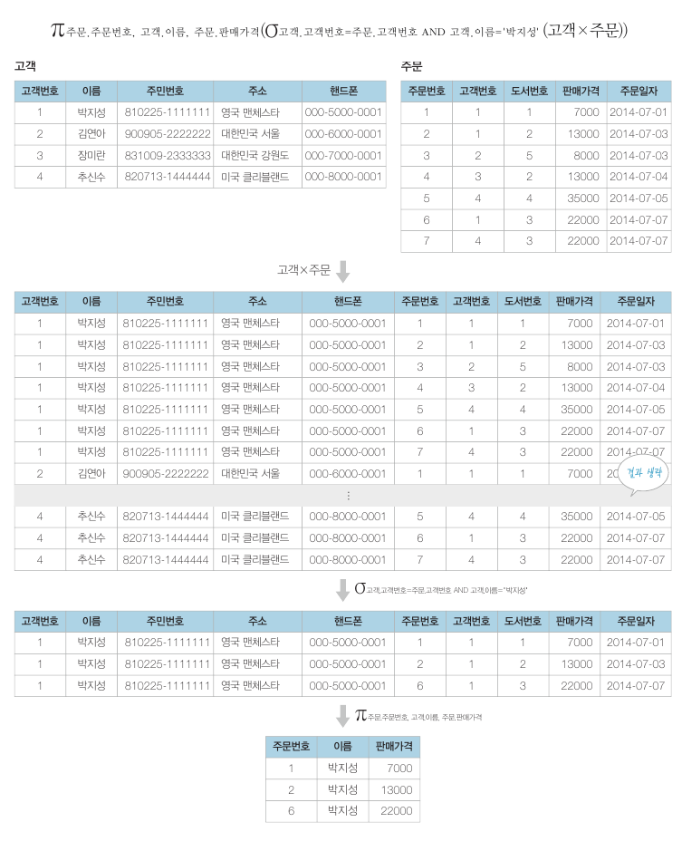

### 조인을 사용한 연산

​	위 질의를 조인을 사용하면 간결하게 표현할 수 있습니다.

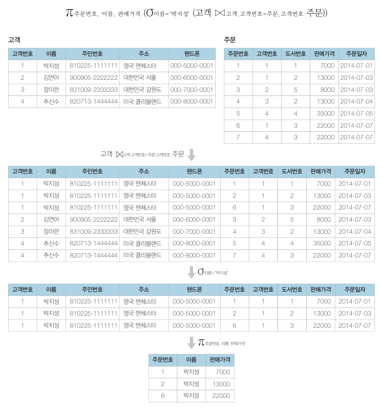