# 실습 환경 구성

## Workbench 에서 구성

먼저 `root` 계정을 통해 `madang` DB 와 `madang` 사용자 계정을 생성합니다. 

```mysql
DROP DATABASE IF EXISTS madang;
DROP USER IF EXISTS madang@localhost;

create user madang@localhost identified WITH mysql_native_password by 'madang';
create database madang;
grant all privileges on madang.* to madang@localhost with grant option;
commit;
```

기본 테이블은 `Book`, `Customer`, `Orders`, `Imported_Book` 입니다.

``` mysql
CREATE TABLE Book (
    bookid INTEGER PRIMARY KEY,
    bookname VARCHAR(40),
    publisher VARCHAR(40),
    price INTEGER
);

CREATE TABLE Customer (
    custid INTEGER PRIMARY KEY,
    name VARCHAR(40),
    address VARCHAR(50),
    phone VARCHAR(20)
);

CREATE TABLE Orders (
    orderid INTEGER PRIMARY KEY,
    custid INTEGER ,
    bookid INTEGER ,
    saleprice INTEGER ,
    orderdate DATE,
    FOREIGN KEY (custid) REFERENCES Customer(custid),
    FOREIGN KEY (bookid) REFERENCES Book(bookid)
);

CREATE TABLE Imported_Book (
    bookid INTEGER,
    bookname VARCHAR(40),
    publisher VARCHAR(40),
    price INTEGER
);
```

`madang` 사용자 계정이 생성되고 테이블을 넣었으면 아래와 같이 Workbench 홈 화면에서 `+`  버튼을 눌러서 `madang` 사용자용 접속(Connection) 을 만듭니다.

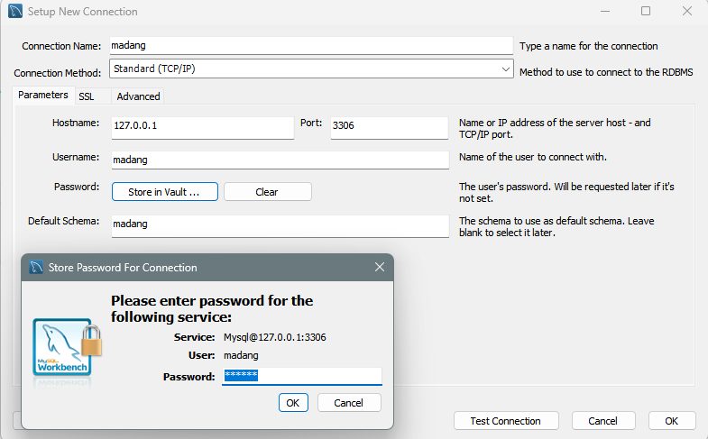

## CLI 명령창

MYSQL 기본 명령어는 아래와 같습니다.

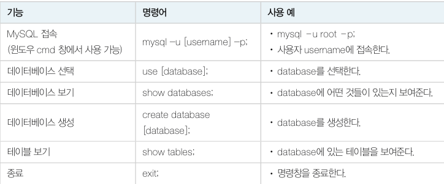

# SQL 개요

DBMS 는 SQL(Structured Query Language) 문을 해석하고 프로그램으로 변환하여 실행 한 후 결과를 알려줍니다. SQL 은 완전한 프로그래밍 언어가 아니라 데이터 부속어(Data Sublanguage) 입니다. 그 이유는 <u>데이터베이스의 데이터와 메타 데이터를 생성하고 처리하는 문법만 갖고 있기 때문</u>입니다.

SQL 은 기능에 따라 **데이터 정의어**(**DDL**, Data Definition Language), 데이터 조작어(**DML**, Data Manipulation Language), **데이터 제어어**(**DCL**, Data Control Language) 로 나뉩니다.

- **DDL** : 데이블이나 관계의 구조를 생성하는 데 사용합니다. (CREATE, ALTER, DROP)
- **DML** : 테이블에 데이터를 검색, 삽입, 수정, 삭제하는 데 사용합니다. (INSERT, DELETE, UPDATE, SELECT) 여기서 SELECT 문은 특별히 질의어(query) 라고 부릅니다.
- **DCL** : 데이터의 사용 권한을 관리하는 데 사용합니다. (GRANT, REVOKE)

SQL 문은 실행 순서가 없는 비절차적 언어입니다. 즉, 찾는 데이터만 기술하고 어떻게 찾는지 그 절차는 기술하지 않습니다.

# 데이터 조작어 - 검색

SELECT 문은 데이터를 검색하는 기본 문장으로, 특별히 질의어(query) 라고 부릅니다. 기본문법은 아래와 같습니다.

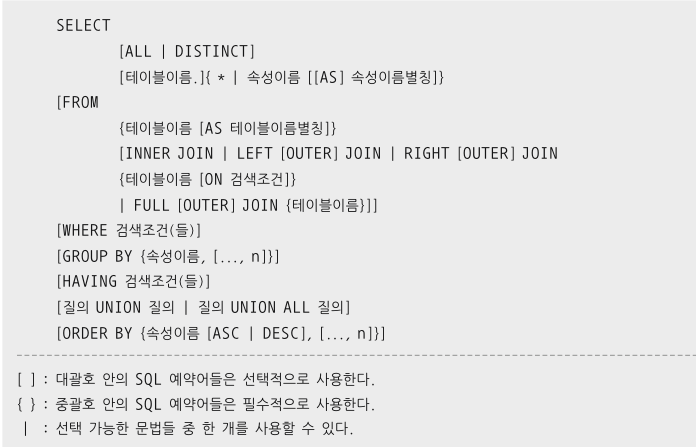

<u>SQL 문은 관계대수와 달리 기본적으로 중복을 제거하지 않습니다.</u> 따라서 결과에 같은 값이 두개 이상 나올 수 있습니다. 중복을 제거하고 싶으면 DISTINCT 키워드를 사용해야 합니다.

```mysql
SELECT DISTINCT publisher FROM Book;
```

## WHERE 조건

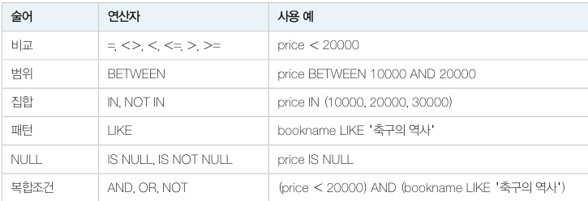

### 와일드 카드

문자열 검색 시 LIKE 와 같이 사용하는 와일드 문자는 아래와 같습니다.

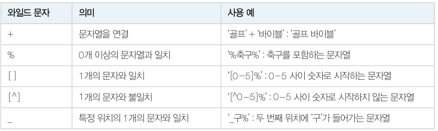

패턴에서 와일드 문자는 `%` 입니다. 아래와 같이 사용합니다.

- 질의 : "도서이름에 '축구' 가 포함된 출판사를 검색하시오."

  ```mysql
  SELECT bookname, publisher
  	FROM Book 
  	WHERE bookname LIKE '%축구%';
  ```

`_(밑줄기호)` 는 특정 위치에 한 문자만 대신할 때 사용합니다.

- 질의 : "도서이름의 왼쪽 두 번째 위치에 '구' 라는 문자열을 갖는 도서를 검색하시오."

  ```mysql
  SELECT *
  	FROM Book
  	WHERE bookname LIKE '_구%';
  ```

## ORDER BY

SQL 문의 실행 결과를 특정 순서대로 출력하고 싶으면 ORDER BY 절을 사용합니다. <u>정렬의 기본은 **오름차순**입니다. 만약 내림차순으로 정렬하려면 열 이름 다음에 DESC 키워드를 사용해야 합니다.</u>

- 질의 : "도서를 가격의 내림차순으로 검색하시오. 만약 가격이 같다면 출판사의 오름차순으로 출력하시오."

  ```mysql
  SELECT *
  	FROM book
  	ORDER BY price DESC, publisher ASC;
  ```

## 집계 함수와 GROUP BY

도서 판매 총액, 일별 판매량 등 **집계된 정보를 얻기 위해서 GROUP BY 문을 사용**합니다.

- 질의 : "고객이 주문한 도서의 총 판매액을 구하시오"

  ```mysql
  SELECT SUM(saleprice)
  	FROM Orders;
  ```

- 질의 : "마당서점의 도서 판매 건수를 구하시오."

  ```mysql
  SELECT COUNT(*)
  	FROM Orders;
  ```

주요 집계함수는 아래와 같습니다.

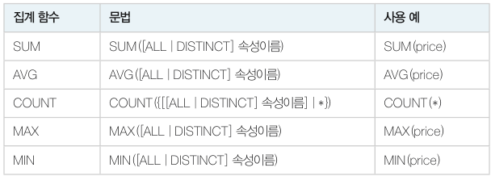

​	SQL 문에서 **GROUP BY 절을 사용하면 속성 값이 같은 값끼리 그룹을 만들 수 있습니다.** 

- 질의 : "고객별로 주문한 도서의 총 수량과 총 판매액을 구하시오."

  ```mysql
  SELECT custid, COUNT(*) AS 도서수량, SUM(saleprice) AS 총액
  	FROM Orders
  	GROUP BY custid;
  ```

  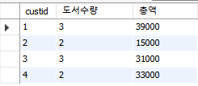

- 아래와 같은 방식으로 구해진다고 볼 수 있습니다.

  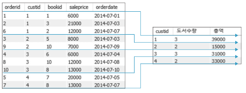

### HAVING

​	HAVING 절은 GROUP BY 절의 결과가 나타나는 그룹을 제한하는 역할을 합니다. 

- 질의 : "가격이 8,000원 이상인 도서를 구매한 고객에 대하여 고객별 주문 도서의 총 수량을 구하시오. 단, 두 권 이상 구매한 고객만 구하시오."

  ```mysql
  SELECT custid, COUNT(*) AS 도서수량
  	FROM Orders
  	WHERE saleprice >= 8000
  	GROUP BY custid
  	HAVING 도서수량 >=2;
  ```

  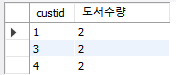

### GROUP BY 와 HAVING 절의 문법과 주의사항

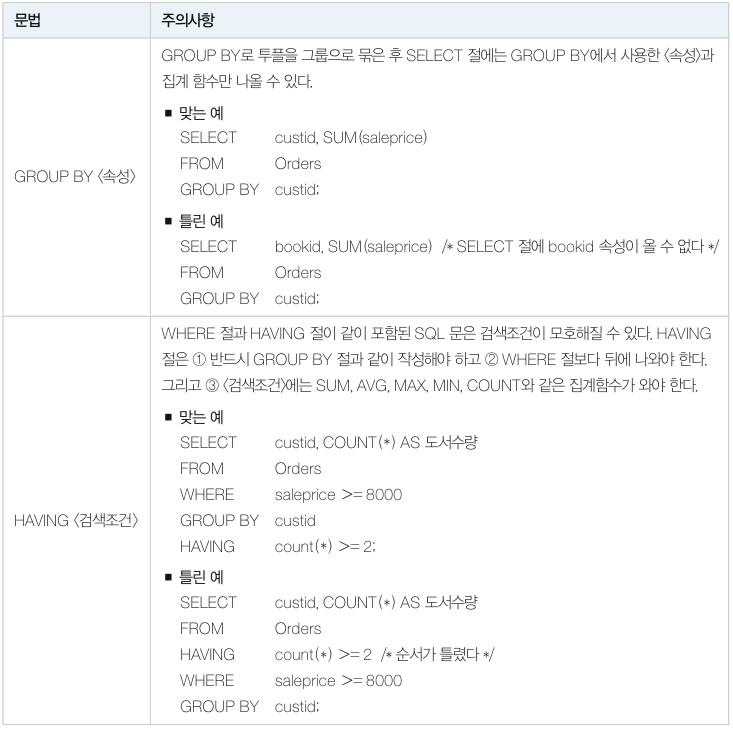

### GROUP BY 절의 포함된 SQL 문의 실행 순서

SQL 문은 실행 순서가 없는 비절차적인(non procedural) 언어지만 내부적으로 실행 순서가 있습니다. 예를 들어 아래와 같은 SQL 실행 시 순서는 그림과 같습니다. (FROM -> WHERE -> GROUP BY -> HAVING -> SELECT -> ORDER BY)

```mysql
SELECT custid, COUNT(*) AS 도서수량
	FROM Orders
	WHERE saleprice >= 8000
	GROUP BY custid
	HAVING 도서수량 > 1
	ORDER BY custid;
```

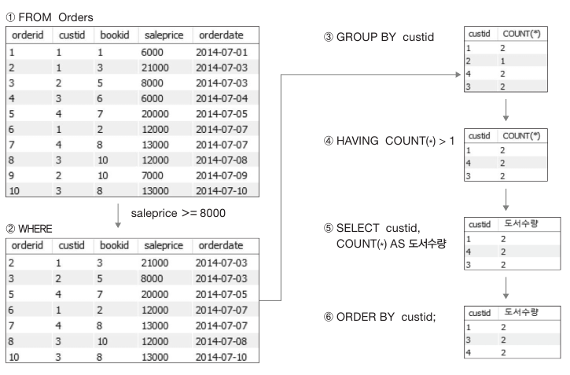

## 두 개 이상 테이블에서 SQL 질의

​	두개 이상의 테이블을 이용하여 질의하는 방법은 조인(join) 과 부속질의(subquery) 가 있습니다.

### 조인

​	일반적인 조인 문법은 아래와 같습니다. `JOIN` 을 명시적으로 사용하지 않아도, WHERE 조건을 통해 조인을 할 수 있습니다.

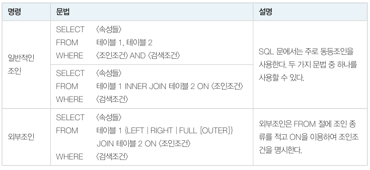

- 질의 : "고객과 고객의 주문에 관한 데이터를 모두 보이시오"

  ```
  SELECT *
  	FROM Customer, Orders
  	WHERE Customer.custid = Orders.custid;
  ```

  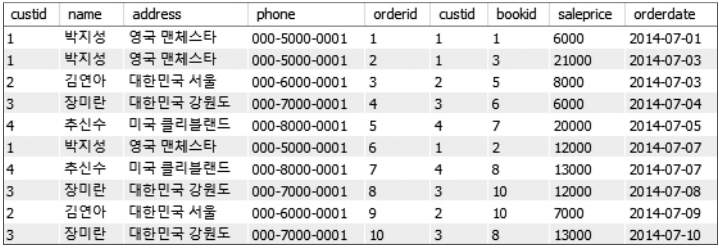

모든 SQL  질의 결과는 단일 테이블입니다. 따라서 **결과 테이블에 GROUP BY 절과 ORDER BY 절 등 SQL 문법을 적용할 수 있습니다.**

- 질의 : "고객별로 주문한 모든 도서의 총 판매액을 구하고, 고객별로 정렬하시오"

  ```mysql
  SELECT name, SUM(saleprice)
  	FROM Customer, Orders
  	WHERE Customer.custid = Orders.custid
  	GROUP BY Customer.name
  	ORDER BY Customer.name;
  ```

**셀프조인**

셀프조인은 하나의 테이블을 대상으로 조인하는 것을 말합니다.

- 질의 : "사원 'BLANK' 가 관리하는 부하사원의 이름과 직급을 출력하시오"

  ```mysql
  SELECT staff.ename, satff.job
  	FROM Emp staff, Emp manager
  	WHERE staff.mgr = manager.empno and manager.ename LIKE 'BLAKE';
  ```

- 여기서 Emp 테이블을 Emp 테이블과 중복으로 조인하게 되면 조인에 참여하는 속성명이 같아지는 문제가 있기 때문에 **별칭(alias) 를 사용해야 합니다.**

**외부조인**

- 질의 : "도서를 구매하지 않은 고객을 포함하여 고객의 이름과 고객이 주문한 도서의 판매가격을 구하시오"

  ```mysql
  SELECT Customer.name, saleprice
  	FROM Customer LEFT OUTER JOIN Orders
  		ON Customer.custid = Order.custid;
  ```

### 부속질의

​	다음과 같은 질의가 부속질의라고 할 수 있습니다.

- 질의 : "가장 비싼 도서의 이름을 보이시오"

  ```mysql
  SELECT bookname
  	FROM Book
  	WHERE price = (
  					SELECT MAX(price) 
  					FROM Book
                  );
  ```

- 위와 같이 SELECT 문의 WHERE 절에 또 다른 테이블 결과를 이용하기 위해 다시 SELECT 문을 괄호로 묶는 것을 부속질의라고 합니다.

부속질의는 SQL 문입니다. SQL 문의 결과는 테이블이며 테이블의 결과는 다음 네 가지 중 하나가 됩니다.

1. 단일행 - 단일열 (1 x 1)
2. 다중행 - 단일열 (n x 1)
3. 단일행 - 다중열(1 x n)
4. 다중행 - 다중열 (n x n)

위 예시에서는 단일행-단일열의 결과를 반환하고 있습니다. **부속 질의 결과가 다중행-단일열로 여러 개의 값을 반환하면 IN 키워드를 사용하면 됩니다.**

- 질의 : "도서를 구매한 적이 있는 고객의 이름을 검색하시오"

  ```java
  SELECT name
  	FROM Customer
  	WHERE custid IN (SELECT custid FROM Orders);
  ```

- 첫번째 서브쿼리인 `SELECT custid FROM Orders` 의 결과값은 여러 `custid` 입니다.

- 두번째 쿼리문은 `SELCT name FROM Customer WHERE custid IN (1, 2, 3 ...)` 과 같은 형태가 됩니다.

이번에는 서브쿼리가 두 번 반복되는 쿼리입니다.

- 질의 : "대한미디어에서 출판한 도서를 구매한 고객의 이름을 보이시오"

  ```java
  SELECT name
  	FROM Customer
  	WHERE custid IN(SELECT custid
  					FROM Orders
  					WHERE bookid IN(SELECT bookid
  									FROM Book
  									WHERE publisher='대한미디어'));
  ```

- 첫번째 서브쿼리의 값은 여러 개의 `bookid` 입니다.

- 두번째 서브쿼리는 `SELECT custid FROM Orders WHERE bookid IN (1, 2, 3 ...)` 과 같은 쿼리문입니다. 결과값은 여러 개의 `custid` 입니다.

- 마지막 메인쿼리문은 `SELECT name FROM Customer WHERE custid IN (1, 2, 3 ...)` 과 같은 쿼리문입니다. 

아래는 하위 부속질의가 상위 부속질의에서 도서와 출판사가 주어지면 종속적으로 출판사의 도서 평균을 구하는 예시입니다. 상위 부속질의는 이 도서가 평균보다 비싼지 비교합니다.

- 질의 : "출판사별로 출판사의 평균 도서 가격보다 비싼 도서를 구하시오"

  ```mysql
  SELECT b1.bookname
  	FROM Book b1
  	WHERE b1.price > (SELECT AVG(b2.price)
  						FROM Book b2
  						WHERE b2.publisher = b1.publisher)
  ```

### 집합연산

SQL 에서 집합 연산 중 합집합을 UNION 으로 나타냅니다.

- 질의 " 대한민국에 거주하는 고객 이름 집합과 도서를 주문한 고객의 이름 집합의 합집합을 구하시오"

  ```mysql
  SELECT name
  	FROM Customer
  	WHERE address LIKE '대한민국%'
  UNION
  SELECT name
  	FROM Customer
  	WHERE custid IN (SELECT custid FROM Orders);
  ```

  - UNION 을 사용하면 중복이 제거되고, UNION ALL 은 중복을 포함합니다.

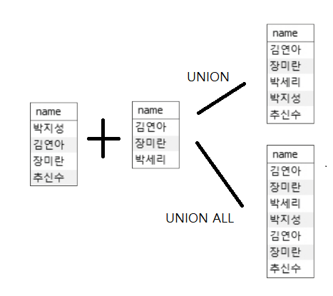

**MINUS, INTERSECT**

MYSQL 에는 MINUS, INTERSECT 연산자가 없으므로 다음과 같이 표현합니다.

- 질의 : "대한민국에서 거주하는 고객의 이름에서 도서를 주문한 고객의 이름을 빼고 보이시오"

- MINUS -> NOT IN 을 사용합니다.

  ```mysql
  SELECT name
  	FROM Customer
  	WEHRE address LIKE '대한민국%' AND
  		name NOT IN (SELECT name
  					FROM Customer
  					WHERE custid IN (SELECT custid FROM Orders));
  ```

- 질의 : "대한민국에서 거주하는 고객 중 도서를 주문한 고객의 이름을 보이시오"

  ```mysql
  SELECT name
  	FROM Customer
  	WEHRE address LIKE '대한민국%' AND
  		name IN (SELECT name
                      FROM Customer
                      WHERE custid IN (SELECT custid FROM Orders));
  ```

### EXISTS

EXISTS 는 상관 부속질의문 형식입니다. 조건에 맞는 투플이 존재하면 결과에 포함시킵니다.

- 질의 : "주문이 있는 고객의 이름과 주소를 보이시오"

  ```mysql
  SELECT name, address
  	FROM Customer cs
  	WHERE EXISTS(SELECT *
  				FROM Orders od
  				WHERE cs.custid = od.custid);
  ```

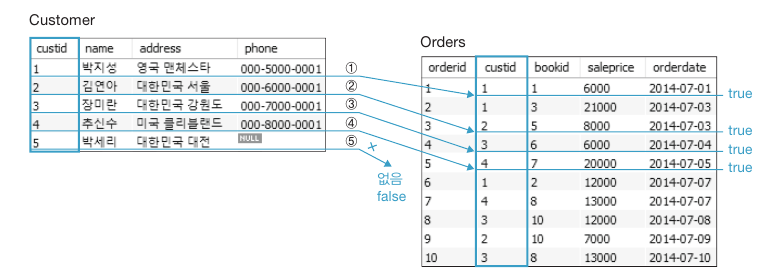

먼저 `cs` 의 첫 행을 가져와서 부속질의문의 `cs` 값으로 입력하고, 부속질의문 `od` 의 어떤 행에서 `cs` 의 고객번호와 같은 것을 1개라도 찾으면 EXISTS 는 참이 되어 `cs` 첫 행에 대한 `name` 과 `address` 가 반환됩니다. 해당 과정이 반복됩니다.