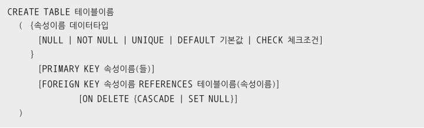
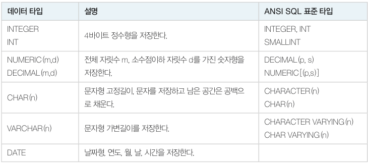
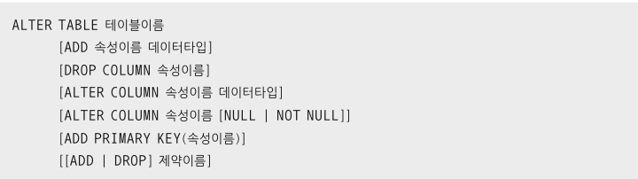

# 데이터 정의어

​	데이터를 저장하려면 먼저 데이터를 저장할 테이블 구조를 만들어야 합니다. SQL 의 DDL 은 바로 이 구조를 만드는 명령입니다. CREATE, ALTER, DROP 이 있습니다.

## CREATE

​	기본문법은 아래와 같습니다.



`{}` 는 반복가능, `[]` 는 선택적으로 사용, `|` 은 1개를 선택, `<>` 은 해당되는 문법이 있다는 뜻입니다. ON DELETE 는 튜플 삭제 시 외래키 속성에 대한 동작을 나타냅니다. 옵션으로는 CASCADE, SET NULL 이 있습니다. 명시하지 않으면 RESTRICT(NO ACTION) 입니다.

- 질의 : "다음과 같은 속성을 가진 `NewOrders` 테이블을 생성하시오"

  ```
  orderid(주문번호) - INTEGER, 기본키
  custid(고객번호) - INTEGER, NOT NULL 제약조건, 외래키(NewCustomer.custid, 연쇄 삭제)
  bookid(도서번호) - INTEGER, NOT NULL 제약조건
  saleprice(판매가격) - INTEGER
  orderdate(판매일자) - DATE
  ```

  ```mysql
  CREATE TABLE NewOrders (
  	orderid INTEGER PRIMARY KEY,
  	custid INTEGER NOT NULL,
  	bookid INTEGER NOT NULL,
  	saleprice INTEGER,
  	orderdate DATE,
  	FOREIGN KEY(custid) REFERENCES NewCustomer(custid) ON DELETE CASCADE
  );
  ```

  - 외래키 제약조건을 명시할 때는 주의할 점이 있습니다. **반드시 참조되는 테이블이 존재해야 하며 참조되는 테이블의 기본키여야 합니다.**
  - `ON DELETE CASCADE` 옵션을 통해 `NewCustomer.custid` 가 3 인 튜플이 삭제되면 `NewOrders` 에서 해당 `custid` 를 가진 튜플이 연쇄(CASCADE) 삭제됩니다.

MYSQL 에서 데이터 타입의 종류는 아래와 같습니다.



## ALTER

ALTER 문의 문법은 다음과 같습니다.



- 질의 : "NewBook 테이블에 VARCHAR(13) 의 자료형을 가진 isbn 속성을 추가하시오"

  ```mysql
  ALTER TABLE NewBook ADD isbn VARCHAR(13);
  ```

- 질의 : "NewBook 테이블의 isbn 속성의 데이터 타입을 INTEGER 형으로 변경하시오"

  ```mysql
  ALTER TALBE NewBook MODIFY isbn INTEGER;
  ```

- 질의 : "NewBook 테이블의 isbn 속성을 삭제하시오"

  ```mysql
  ALTER TABLE NewBook DROP COLUMN isbn;
  ```

- 질의 : "NewBook 테이블의 bookid 속성에 NOT NULL 제약조건을 적용하시오"

  ```mysql
  ALTER TABLE NewBook MODIFY bookid INTEGER NOT NULL;
  ```

- 질의 : "NewBook 테이블의 bookid 속성을 기본키로 변경하시오"

  ```mysql
  ALTER TABLE NewBook ADD PRIMARY KEY(bookid);
  ```

## DROP

​	DROP 은 테이블의 구조와 데이터를 모두 삭제하므로 주의해서 사용해야 합니다. 데이터만 삭제하려면 DELETE 문을 사용해야 합니다.

- 질의 : "NewBook 테이블을 삭제하시오"

  ```mysql
  DROP TABLE NewBook;
  ```

만약 삭제하려는 테이블의 기본키를 다른 테이블에서 참조하고 있다면 삭제가 거절됩니다. 만약 NewCustomer 테이블의 기본키를 NewOrders 에서 참조하고 있다면 NewOrders 테이블부터 삭제해야 합니다.

- ```mysql
  DROP TABLE NewOrders;
  DROP TABLE NewCustomer;
  ```

# 데이터 조작어

​	테이브에 튜플을 삽입, 삭제, 수정하는 방법입니다.

## INSERT


- 질의 : "Book 테이블에 새로운 도서 '스포츠 의학' 을 삽입하시오. 스포츠 의학은 한솔의학서적에서 출간했으며 가격은 90,000원입니다"

  ```mysql
  INSERT INTO Book(bookid, bookname, publisher, price) VALUES (11, '스포츠 의학', '한솔의학서적', 90000);
  ```

- 질의 : "Book 테이블에 새로운 도서 '스포츠 의학' 을 삽입하시오. 스포츠 의학은 한솔의학서적에서 출간했으며 가격은 **미정**입니다"

  ```mysql
  INSERT INTO Book(bookid, bookname, publisher) VALUES (11, '스포츠 의학', '한솔의학서적');
  ```

  - 위에서 가격이 들어가지 않았는데, 그 해당 튜플에 가격은 0 이 아닌 NULL 로 저장됩니다.

- 질의 : "수입도서목록(Imported_book) 을 Book 테이블에 모두 삽입하시오"

  ```mysql
  INSERT INTO Book(bookid, bookname, price, publisher) 
  	SELECT bookid, bookname, price, publisher
  	FROM Imported_book;
  ```

  - 위 쿼리문처럼 한꺼번에 여러 개의 튜플을 삽입할 수 있습니다. **이때 `Imported_book` 테이블에서는 `Book` 테이블과 같은 타입의 데이터가 저장되어 있어야 합니다.**

## UPDATE


- 질의 : "Customer 테이블에서 고객번호가 5 인 고객의 주소를 '대한민국 부산' 으로 변경하시오"

  ```mysql
  SET SQL_SAFE_UPDATES = 0; # Safe Update 옵션 해제
  UPDATE Customer
  	SET address = '대한민국 부산'
  	WHERE custid = 5;
  ```

> SAFE UPDATES 모드
>
> Workbench default 로, MYSQL UPDATE 및 DELETE 수행 시 실수를 방지하기 위해 기본키 속성을 사용해서만 가능하도록 한 안전 옵션입니다.

- 질의 : "Book 테이블에서 14번 '스포츠 의학' 의 출판사를 imported_book 테이블의 21번 책 출판사와 동일하게 변경하시오."

  ```mysql
  UPDATE Book
  	SET publisher = (SELECT publisher
  					FROM imported_book
  					WHERE bookid = '21')
      WHERE bookid = '14';
  ```

  - 위 쿼리문처럼 UPDATE 문은 다른 테이블의 속성 값을 이용할 수도 있습니다.

## DELETE


- 질의 : "Book 테이블에서 도서번호가 11 인 도서를 삭제하시오."

  ```mysql
  DELETE FROM Book
  	WHERE bookid = '11';
  ```

  