# 내장 함수

​	DBMS 에는 DBMS 가 제공하는 내장함수와 사용자가 필요에 따라 직접 만드는 사용자 정의 함수가 있습니다. 

## SQL 내장 함수

 	SQL 내장함수는 SELECT, WHERE, UPDATE 절 등에서 모두 사용할 수 있습니다. 아래는 주요 내장 함수입니다.

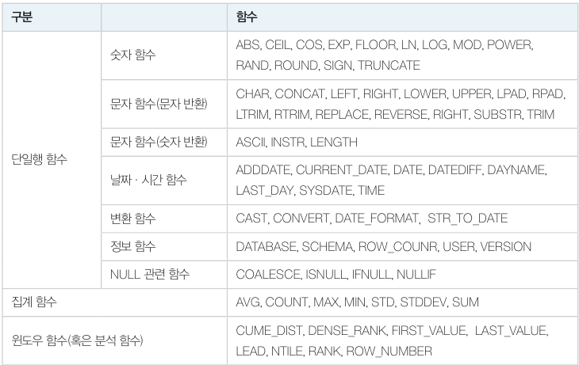

### 숫자 함수

SQL 문에서는 수학의 기본 사칙 연산자나 나머지 연산자 기호 (`+`, `-`, `*`, `/`, `%`) 를 그대로 사용합니다. 그리고 절대값, 로그 등의 계산을 함수로 할 수 있습니다.

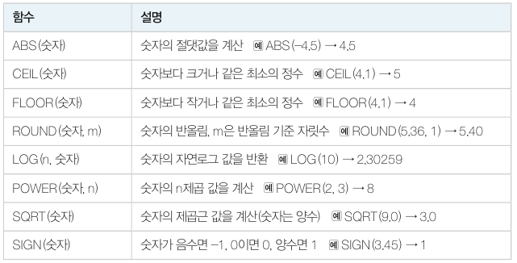

- 질의 "고객별 평균 주문 금액을 백원 단위로 반올림한 값을 구하시오"

  ```mysql
  SELECT custid '고객번호', ROUND(SUM(saleprice)/COUNT(*), -2) '평균금액'
  	FROM Orders
  	GROUP BY custid;
  ```

  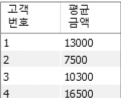

### 문자함수

​	문자 함수는 주로 CHAR 나 VARCHAR 의 데이터 타입을 대상으로 단일 문자나 문자열을 가공한 결과를 반환합니다.

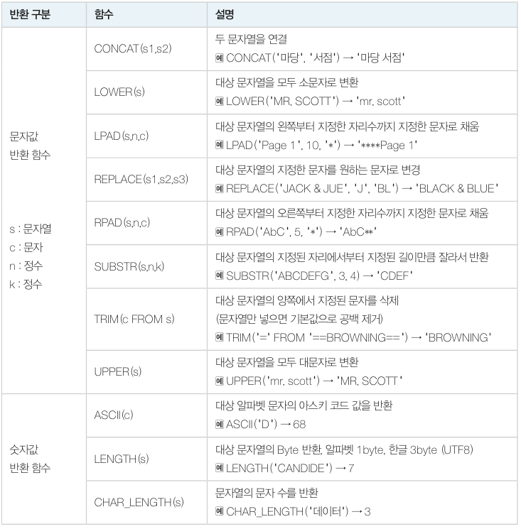

- 질의 : "도서 제목에 야구가 포함된 도서를 농구로 변경한 후 도서 목록을 보이시오"

  ```mysql
  SELECT bookid, REPLACE(bookname, '야구', '농구') bookname, publisher, price 
  	FROM Book;
  ```

### 날짜, 시간 함수

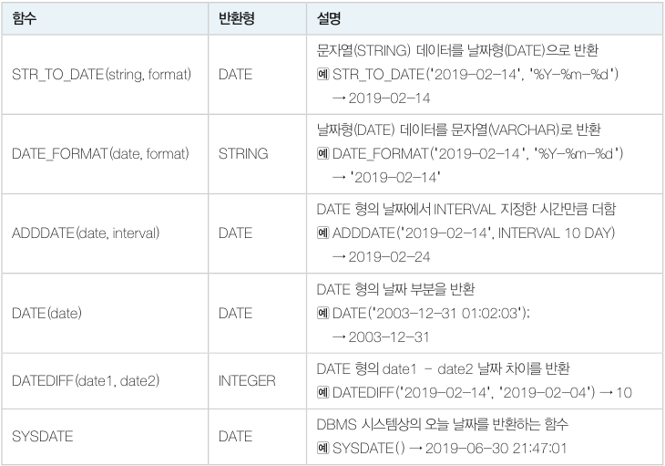

format 의 주요 지정자는 아래와 같습니다.

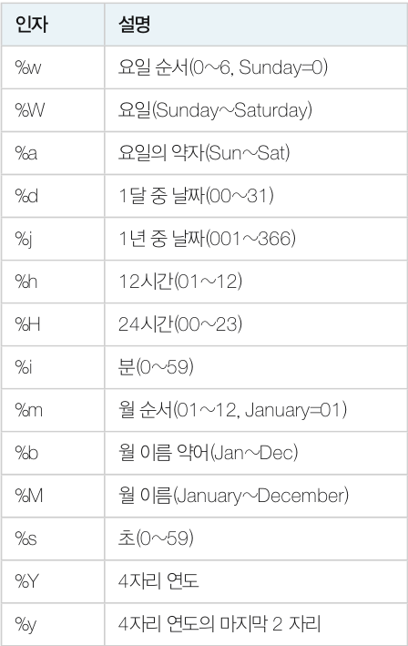

- 질의 : "마당서점은 주문일로부터 10일 후 매출을 확정한다. 각 주문의 확정일자를 구하시오"

  ```mysql
  SELECT orderid '주문번호', orderdate '주문일', ADDDATE(orderdate, INTERVAL 10 DAY) '확정'
  	FROM Orders;
  ```

  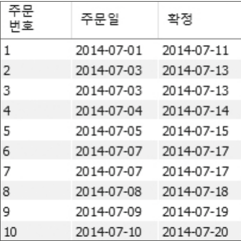

- 질의 : "마당서점이 2014년 7월 7일에 주문받은 도서의 주문번호, 주문일, 고객번호, 도서번호를 모두 보이시오 (%Y-%m-%d) 형태로 표시"

  ```mysql
  SELECT orderid '주문번호', STR_TO_DATE(orderdate, '%Y-%m-%d') '주문일', custid '고객번호', bookid '도서번호'
  	FROM Orders
  	WHERE orderdate=DATE_FORMAT('20140707', '%Y%m%d');
  ```

  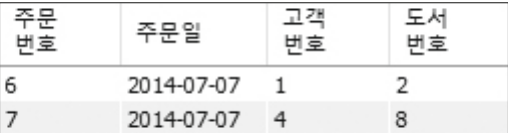

## NULL 값 처리

​	`Null` 값은 아직 지정되지 않은 값이므로 `=`, `<`, `>` 등과 같은 연산자로 비교하지 못합니다. 또 Null 값의 연산을 수행하면 결과 역시 Null 값으로 반환됩니다.

- `Null` + 숫자 연산의 결과는 `Null` 입니다.
- 집계 함수 계산 시 `Null` 이 포함된 행은 집계에서 빠집니다.
- 해당되는 행이 하나도 없을 경우 SUM, AVG 함수의 결과는 `Null` 이 되고, COUNT 함수 결과는 0 입니다.

Null 값을 찾을 때는 `IS NULL` 이나 `IS NOT NULL` 을 사용합니다.

**IFNULL(속성, 값)**

IFNULL 함수는 NULL 값을 다른 값으로 대치하여 연산하거나 다른 값으로 출력하는 함수입니다.

- 질의 : "이름, 전화번호가 포함된 고객목록을 보이시오. 단, 전화번호가 없는 고객은 '연락처없음' 으로 표시하시오."

  ```mysql
  SELECT name '이름', IFNULL(phone, '연락처없음') '전화번호'
  	FROM Customer;
  ```

  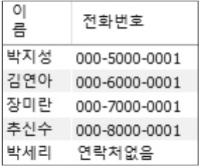

## 행번호 출력

​	SQL 문 결과로 나오는 행에 번호를 붙이거나 행번호에 따라 결과의 개수를 조절할 수 있습니다. 변수는 이름 앞에 `@` 기호를 붙이며 치환문에서는 SET 과 `:=` 기호를 사용합니다.

- 질의 : "고객 목록에서 고객번호, 이름, 전화번호를 앞의 두명만 보이시오"

  ```mysql
  SET @seq:=0;
  SELECT (@seq:=@seq+1) '순번', custid, name, phone
  	FROM Customer
  	WHERE @seq < 2;
  ```

  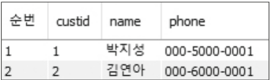

# 부속질의

​	부속질의는 다른 테이블에서 가져온 데이터로 현재 테이블에 있는 정보를 찾거나 가공할 때 사용합니다. 두 테이블을 연관시킬 때 조인을 선택할지 부속질의를 선택할지 여부는 데이터의 형태와 양에 따라 달라집니다. 일반적으로 **데이터가 대량일 경우 데이터를 모두 합쳐서 연산하는 조인보다 필요한 데이터만 찾아서 공급해주는 부속질의의 성능이 더 좋습니다.**

부속질의는 **위치와 역할에 따라 SELECT 부속질의(스칼라 부속질의), FROM 부속질의(인라인뷰), WHERE 부속질의(중첩질의)**로 구분됩니다.


## 스칼라 부속질의

​	스칼라 부속질의는 SELECT 절에 사용되는 부속질의로, **결과값은 단일 행, 단일 열의 스칼라 값**입니다. 만약 결과값이 다중 행이거나 다중 열이면 어떤 행, 어떤 열을 출력해야 하는지 알 수 없어 에러를 출력합니다.	

:white_check_mark: 질의 : "마당서점의 고객별 판매액을 보이시오(고객이름과 고객별 판매액 출력)"

```mysql
SELECT (SELECT name
		FROM Customer cs
		WHERE cs.custid=od.custid) 'name', SUM(saleprice) 'total'
    FROM Orders od
    GROUP BY od.custid;
```

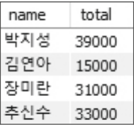

:white_check_mark: 질의 : "Order 테이블에 도서이름("bname") 을 추가하고 각 주문에 맞는 도서이름을 입력하시오."

```mysql
ALTER TABLE Orders ADD bname VARCHAR(40);

UPDATE Orders
SET bname=(SELECT bookname
			FROM Book
			WHERE Book.bookid=Orders.bookid);
```

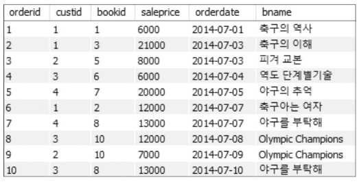

- 만약에 서브쿼리를 사용하지 않는다면 모든 도서에 대해 도서이름을 아래와 같이 각각 수정해야 합니다.

  ```mysql
  UPDATE Orders
  	SET bname='피겨 교본'
  	WHERE bookid=1;
  ```

## 인라인 뷰

​	인라인 뷰는 기존 테이블로부터 일시적으로 만들어진 가상의 테이블을 말합니다. <u>SQL 문의 FROM 절에는 테이블 이름이 위치하는데, 여기에 테이블 이름 대신 인라인 뷰 부속질의를 사용하면 보통의 테이블과 같은 형태로 사용할 수 있습니다.</u> 하지만 가상 테이블 뷰 형태이기 때문에 상관 부속질의는 사용할 수 없습니다.

:white_check_mark: 질의 : "고객 번호가 2 이하인 고객의 판매액을 보이시오. (고객이름과 고객별 판매액 출력)"

```mysql
SELECT cs.name, SUM(od.saleprice) 'total'
	FROM (SELECT custid, name
			FROM Customer
			WHERE custid <= 2) cs,
    	Orders od
    WHERE cs.custid=od.custid
    GROUP BY cs.name;
```

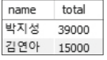

- FROM 절안에는 2개의 테이블이 있습니다. Customer 테이블에서 고객번호가 2 이하인 행만 선택한 cs 테이블, 그리고 Orders 테이블 od 입니다.
- Customer 테이블과 Orders 테이블을 동등조인한 후 고객번호가 2 이하인 고객만 출력하는 형태로 작성할 수도 있습니다. 하지만 이 방법은 조인 결과 테이블에서 필요없는 데이터를 제거해야 하므로 성능 저하가 발생합니다.
- **인라인 뷰를 사용하면 조인에 참여하기 직전 Customer 테이블에서 필요한 데이터만 뽑아 조인시킬 수 있으므로 처리 성능을 높입니다.**

## 중첩질의 - WHERE 부속 질의

​	중첩질의는 WHERE 절에 서술합니다. 주질의의 자료 집합에서 한 행씩 가져와 부속질의를 수행하며, 연산 결과에 따라 WHERE 절의 조건이 참인지 거짓인지 확인하여 참일 경우 주 질의의 해당 행을 출력합니다.

아래는 중첩질의 연산자의 종류입니다.


### 비교 연산자

​	비교 연산자는 부속질의가 반드시 단일 행, 단일 열을 반환해야 합니다.

:white_check_mark: 질의 : "평균 주문금액 이하의 주문에 대해서 주문번호와 금액을 보이시오."

```mysql
SELECT orderid, saleprice
	FROM Orders
	WHERE <= (SELECT AVG(saleprice)
				FROM Orders);
```

### IN, NOT IN 

​	IN 연산자는 주질의의 속성 값이 부속질의에서 제공한 결과 집합에 있는지 확인하는 역할을 합니다.

:white_check_mark: 질의 : "대한민국에 거주하는 고객에게 판매한 도서의 총 판매액을 구하시오."

```mysql
SELECT SUM(saleprice) 'total'
	FROM Orders
	WHERE custid IN (SELECT custid
					FROM Customer
					WHERE address LIKE '%대한민국%');
```

### ALL, SOME(ANY)

​	ALL, SOME(ANY) 연산자는 비교 연산자와 함께 사용됩니다. ALL 은 모든, SOME, ANY 는 어떠한 (최소한 하나라도) 이라는 의미를 가집니다.

:white_check_mark: 질의 : "3번 고객이 주문한 도서의 최고금액보다 더 비싼 도서를 구입한 주문의 주문번호와 판매금액을 보이시오."

```mysql
SELECT orderid, saleprice
	FROM Orders
	WHERE saleprice > ALL(SELECT saleprice
						FROM Orders
						WHERE custid='3');
```

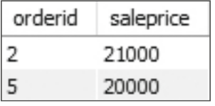

- 위 SQL 문에서 부속질의만 따로 수행해보면 세 개의 행을 반환하며 saleprice 값은 6000, 12000, 13000 입니다. 주질의의 '> ALL' 연산자는 결과 집합의 모든 값보다 큰 값을 뜻하므로 가장 큰 13000원보다 큰 판매금액을 결과로 출력합니다.

### EXISTS, NOT EXISTS

​	EXISTS, NOT EXISTS 연산자는 데이터의 존재 유무를 확인하는 연산자입니다. 주질의에서 부속질의로 제공된 속성의 값을 가지고 부속질의에 조건을 만족하여 값이 존재하면 참이 되고, 주질의는 해당 행의 데이터를 출력합니다.

:white_check_mark: 질의 : "EXISTS 연산자를 이용하여 대한민국에 거주하는 고객에게 판매한 도서의 총 판매액을 구하시오."

```mysql
SELECT SUM(saleprice) 'total'
	FROM Orders od
	WHERE EXISTS(SELECT *
				FROM Customer cs
				WHERE address LIKE '%대한민국%' AND cs.custid=od.custid);
```

