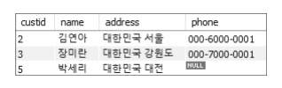
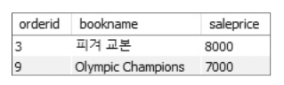
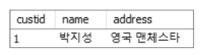
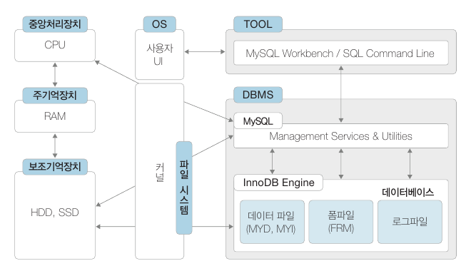
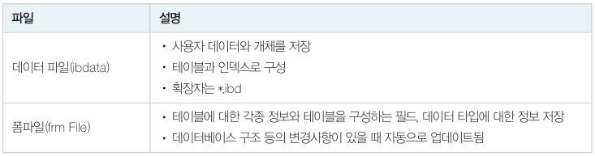
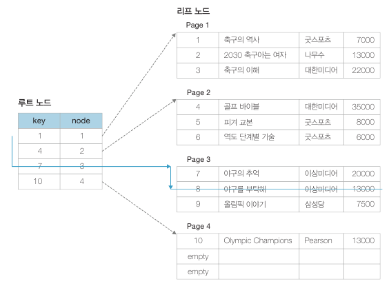
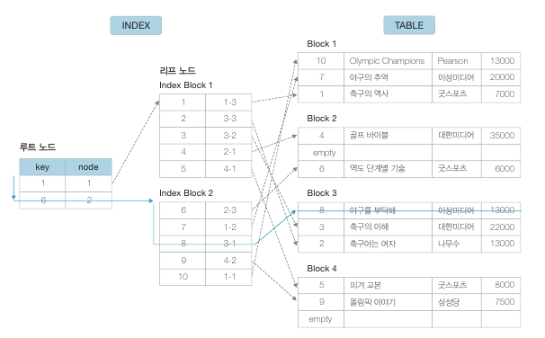
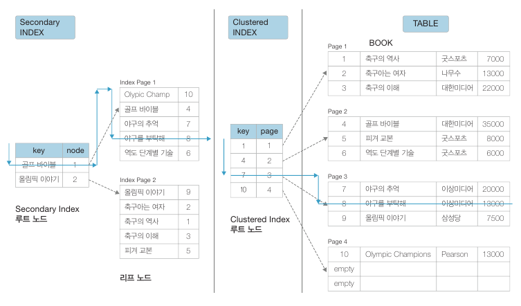
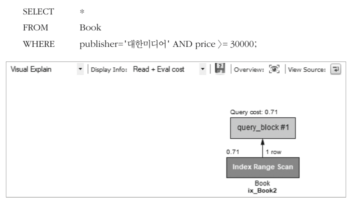

# 뷰

​	뷰는 하나 이상의 테이블을 합하여 만든 가상의 테이블입니다. "합한다" 는 말은 SELECT 문을 통해 얻은 최종 결과를 뜻하며, 뷰는 이러한 결과를 가상 테이블로 정의하여 실제 테이블처럼 사용할 수 있도록 만든 DB 개체입니다.

​	예를 들어서 개발자가 보고서를 만들기 위해 Orders 테이블과 Customer 테이블, 그리고 Book 테이블을 조인하거나 부속질의를 한다고 가정해보겠습니다. 매번 작업마다 조인이나 부속질의를 하는 건 상당히 번거롭기 때문에 다음 두가지 방법을 사용할 수 있습니다.

1. 실제 물리적인 테이블에 열을 추가하여 데이터를 넣는 방법
2. **Orders, Customer, Book 테이블을 조인한 후 가상의 테이블인 Vorders(뷰) 를 생성하는 방법**

1번 방법은 테이블 자체를 수정하기 때문에 저장 용량이 늘어나고, 유지 보수문제도 있어서 좋은 방법이 아닙니다. 반면에 2번 방법으로 만든다면 실제 데이터를 디스크에 저장하지 않고, DBMS 가 저장하면서도 사용자는 일반적인 테이블과 같이 사용할 수 있습니다.

## 뷰의 생성


:white_check_mark: 질의 : "주소에 '대한민국' 을 포함하는 고객들로 구성된 뷰를 만들고 조회하시오. 뷰의 이름은 vw_Customer 로 설정하시오"

```mysql
CREATE VIEW vw_Customer
AS SELECT *
	FROM Customer
	WHERE address Like '%대한민국%';
```

결과를 확인하면 다음과 같습니다.

```mysql
SELECT * FROM vw_Customer;
```



:white_check_mark: 질의 : "Orders 테이블에서 고객이름과 도서이름을 바로 확인할 수 있는 뷰를 생성한 후, '김연아' 고객이 구입한 도서의 주문번호, 도서이름, 주문액을 보이시오."

```mysql
CREATE VIEW vw_Orders (orderid, custid, name, bookid, bookname, saleprice, orderdate)
AS 
SELECT od.orderid, od.custid, cs.name, od.bookid, bk.bookname, od.saleprice, od.orderdate
	FROM Order od, Customer cs, Book bk
	WHERE od.custid=cs.custid AND od.bookid=bk.bookid;
```

결과를 확인하면 다음과 같습니다.

```mysql
SELECT orderid, bookname, saleprice
	FROM vw_Orders
	WHERE name='김연아';
```



## 뷰의 수정

​	뷰도 필요에 따라 정의된 SQL 문의 수정을 필요합니다. 뷰의 수정은 CREATE VIEW 문에 OR REPLACE 명령을 더하여 작성합니다.


:white_check_mark: 질의 : "주소에 '대한민국' 을 포함하는 고객들로 구성된 뷰(vw_Customer) 를 '영국' 을 주소로 가진 고객으로 변경하시오. 그리고 phone 속성은 필요없으므로 포함시키지 마시오." (현재 vw_Customer 가 있는 상태)

```mysql
CREATE OR REPLACE VIEW vw_Customer(custid, name, address)
AS
SELECT custid, name, address
	FROM Customer
	WHERE address LIKE '%영국%';
```

결과를 확인하면 다음과 같습니다.

```mysql
SELECT * FROM vw_Customer;
```



## 뷰의 삭제

:white_check_mark: 질의 : "vw_Customer 뷰를 삭제하시오." (현재 vw_Customer 가 있는 상태)

```mysql
DROP VIEW vw_Customer;
```

# 인덱스

DBMS 는 B-tree 를 통해 인덱스를 만들고 검색합니다.

## 데이터베이스의 물리적 저장

​	DBMS 는 해당 DBMS 만의 고유한 방식으로 데이터를 저장하고 관리합니다.



​	그림을 보면 SQL 작업도구 (TOOL) 을 통해 SQL 문을 작성하여 실행하면 DBMS 에 의해 처리 방법이 결정되고, 운영체제를 통해 각 장치에 명령이 내려져 작업이 처리됩니다. 

​	여기에서 주의 깊게 살펴봐야할 점은 **실제 데이터가 저장되는 곳이 보조기억장치**라는 점입니다. 따라서 DBMS 가 하드디스크에 데이터를 저장하고 읽어올 때는 근본적으로 속도 문제가 발생할 수밖에 없습니다. **이 속도 차이를 줄이기 위해 버퍼 풀을 만들어서 자주 사용하는 데이터를 저장하고, LRU 알고리즘으로 사용빈도가 높은 데이터 위주로 저장하고 관리합니다.**

​	DBMS 는 데이터베이스별로 하나 이상의 데이터 파일을 생성합니다. 테이블은 생성 시 정의된 내용에 따라 논리적으로 구분지어 각각의 데이터 파일에 저장합니다. 이러한 파일을 DBMS 별로 구유한 파일 구조를 가지며 동시에 수많은 사용자가 사용해야 하므로 특별한 처리방법을 통해 관리됩니다. MYSQL 의 저장장치 엔진은 플러그인 방식으로 선택할 수 있는데, InnoDB 엔진이 기본으로 설치되어 있습니다. 사용하는 데이터베이스별로 별도의 파일을 생성합니다.



## 인덱스와 B-tree

​	인덱스란 자료를 쉽고 빠르게 찾을 수 있도록 만든 데이터 구조입니다. 일반적으로 RDBMS 의 인덱스는 대부분 B-tree 구조로 이루어져있습니다. B-tree 구조에 대한 설명은 [[자료구조] ch11. 균형검색트리](https://hobeen-kim.github.io/datastructure/%EC%9E%90%EB%A3%8C%EA%B5%AC%EC%A1%B0-Ch-11.-%EA%B7%A0%ED%98%95%EA%B2%80%EC%83%89%ED%8A%B8%EB%A6%AC/#b-%ED%8A%B8%EB%A6%AC) 를 참고해주세요.

​	B-tree 는 데이터를 검색할 때마다 검색 대상이 줄어 접근 시간이 적게 걸립니다. 100만 개의 튜플을 가진 데이터도 3~4번의 디스크 블록으로 읽으면 찾을 수 있습니다. 하지만 데이터의 변경이나 추가가 잦을 경우 B-tree 의 모양을 유지하기 위해 노드 분할 및 이동이 자주 발생합니다.

​	인덱스의 특징을 정리하면 다음과 같습니다.

- 인덱스는 테이블에서 한 개 이상의 속성을 이용하여 생성합니다.
- 빠른 검색과 함께 효율적인 레코드 접근이 가능합니다.
- 순서대로 정렬된 속성과 데이터의 위치만 보유하므로 테이블보다 작은 공간을 차지합니다.
- 저장된 값들은 테이블의 부분집합이 됩니다.
- 일반적으로 B-tree 형태의 구조를 가집니다.
- 데이터의 수정, 삭제 등의 변경이 발생하면 인덱스의 재구성이 필요합니다.

## MySQL 인덱스

​	MySQL 인덱스는 클러스터 인덱스(clustered index) 와 보조 인덱스(secondary index) 로 나누어지며, 모두 B-tree 인덱스를 기본으로 합니다. 

### 클러스터 인덱스

​	클러스터 인덱스는 인덱스의 리프 노드들이 정렬된 상태로 저장된 테이블 자체가 됩니다. 아래는 예시입니다.



도서번호 8번을 찾을 경우 루트 노드의 키 8 을 비교해서 3번째 행의 7 보다 크고 4번째 행의 10 보다는 작다는 것을 발견하고, 이에 따라 페이지 3 으로 이동하여 1행부터 순서대로 데이터를 찾게 됩니다.

​	이러한 클러스터 인덱스는 테이블 당 하나만 생성할 수 있습니다. 테이블의 데이터가 키 값에 따라 정렬된 형태로 저장되어 있어서 특정 값을 쉽게 찾을 수 있으며 범위 검색도 쉽게 할 수 있습니다. 또한 인덱스 페이지가 단순해져서 저장 시 차지하는 공간도 작습니다. **클러스터 인덱스는 테이블 생성 시 기본키(PK) 를 생성하면 자동으로 생성됩니다.**

### 보조 인덱스

​	데이터의 저장과 수정, 삭제가 반복되다보면 레코드들의 순서가 뒤섞이게 됩니다.이럴 때 보조 인덱스를 사용합니다.



위 예시는 Book 테이블의 `bookid` 속성을 인덱스를 생성한 경우입니다. 인덱스의 리프 노드는 실제 데이터 값이 아닌 테이블 상의 데이터 위치를 지정하는 rowid  를 저장합니다. rowid 는 <Block 번호 - Block 내의 Row 가 위치한 순번> 의 형태로 구성되어 있어서 테이블의 자료가 아무리 무작위로 저장되어 있어도 쉽게 찾을 수 있습니다. 이러한 인덱스는 테이블 당 여러 개를 만들 수 있으며 여러 개의 컬럼을 복합적으로 결합하여 사용하는 인덱스도 만들 수 있습니다. 예를 들어 출판사 이름 컬럼과 가격 컬럼을 대상으로 인덱스를 생성하여 '어떠한 출판사의 얼마짜리' 책을 찾는 등과 같은 업무를 빠르게 할 수 있습니다.

### MySQL 인덱스

​	클러스터 인덱스와 보조 인덱스는 보통 같이 사용됩니다. 예를 들어 `bookname` 을 검색할 경우 보조 인덱스를 이용하여 `bookid` 를 찾은 다음 다시 `bookid` 에 대한 클러스터 인덱스를 사용합니다. 이렇게 하는 이유는 클러스터 인덱스로 저장된 데이터의 순서를 가능한 유지하면서 데이터의 삽입과 삭제에 대한 인덱스 관리 비용을 줄이기 위해서입니다.

​	예를 들어 '야구를 부탁해' 책을 찾는 과정을 보겠습니다.



보조 인덱스로 야구를 부탁해의 `bookid` 가 8 임을 찾고, 클러스터 인덱스로 `bookid` 가 8 인 튜플을 꺼냅니다.

## 인덱스 생성

​	무조건 인덱스를 생성한다고 검색이 빠른 건 아닙니다. 데이터의 양이 별로 없거나 데이터 값이 몇종류 안되어 선택도가 높은 경우 인덱스가 없는 게 더 빠를 수 있습니다. 여기서 **선택도**란 `'1/서로 다른 값의 개수'` 를 말하는 것으로 예를 들어 값이 (남, 여) 두 가지면 선택도가 높다고 할 수 있습니다.

​	따라서 의미없는 인덱스 생성을 피하기 위해 다음과 같은 몇 가지 고려사항이 있습니다.

- 인덱스는 WHERE 절에 자주 사용되는 속성이어야 합니다.
- 인덱스는 조인에 자주 사용되는 속성이어야 합니다.
- 단일 테이블에 인덱스가 많으면 속도가 느려질 수 있습니다. (테이블 당 4 ~ 5개 권장)
- 속성이 가공되는 경우 사용하지 않습니다.
- 속성의 선택도가 낮을 때 유리합니다. (속성의 모든 값이 다른 경우)

인덱스 생성 문법은 아래와 같습니다.


위 문법에서 UNIQUE 는 테이블 속성 값에 대해 중복이 없는 유일한 인덱스를 생성하는 것을 말합니다.

:white_check_mark: 질의 : "Book 테이블의 bookname 열을 대상으로 인덱스 ix_Book 을 생성하시오."

```mysql
CREATE INDEX ix_Book ON Book(bookname);
```

:white_check_mark: 질의 : "Book 테이블의 publisher, price 열을 대상으로 인덱스 ix_Book2 를 생성하시오"

```mysql
CREATE INDEX ix_Book2 ON Book(publisher, price);
```

생성된 인덱스는 SHOW INDEX 명령어로 확인할 수 있습니다.

```mysql
SHOW INDEX FROM Book;
```

MYSQL 이 생성된 인덱스를 활용하는지 확인하려면 Workbench 에서 [Query] -> [Explanin Current Statement] 를 누르면 됩니다.



## 인덱스 재구성과 삭제

​	인덱스 재구성은 ANALYZE TABLE 명령을 사용하여 수행합니다. B-tree 인덱스는 데이터 수정, 삭제, 삽입이 잦으면 노드의 갱신이 주기적으로 일어나 단편화 현상이 발생합니다. **단편화란 삭제된 레코드의 인덱스 값 자리가 비게 되는 상태를 말하는데, 검색 성능 저하로 이어집니다.** 

:white_check_mark: 질의 : "Book 테이블의 인덱스를 최적화하시오."

```mysql
ANALYZE TABLE Book;
```

하나의 테이블에 인덱스가 많으면 DB 성능에 악영향을 미치므로 사용하지 않는 인덱스는 삭제해야 합니다.

:white_check_mark: 질의 : "인덱스 ix_Book 을 삭제하시오."

```mysql
DROP INDEX ix_Book ON Book;
```

