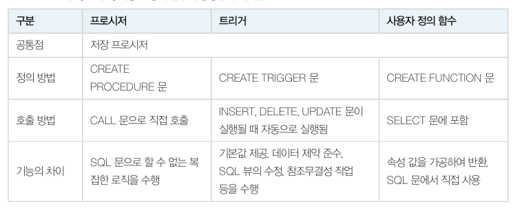
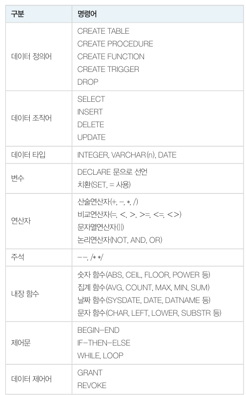
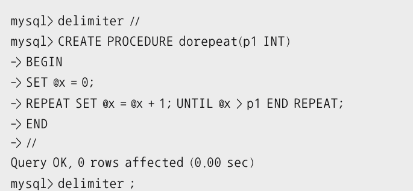
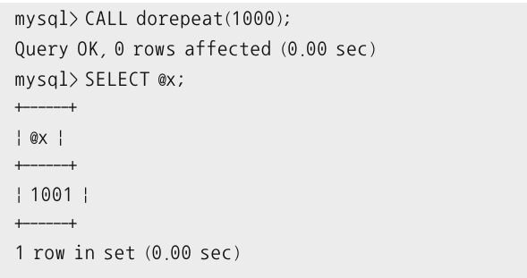
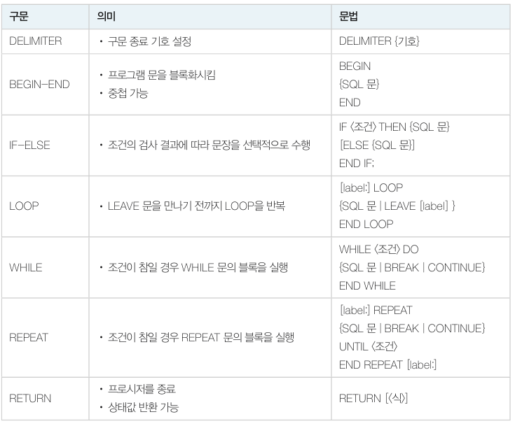
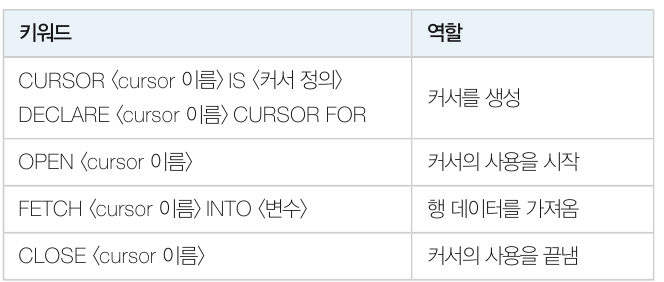
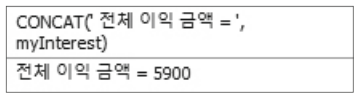
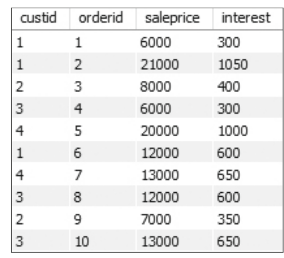

# 저장 프로그램

​	저장 프로그램은 데이터베이스 응용 프로그램을 작성하는 데 사용하는 MYSQL 의 SQL 전용 언어입니다. SQL 전용 언어는 SQL 문에 변수, 제어, 입출 등의 프로그래밍 기능을 추가하여 SQL 만으로 처리하기 어려운 문제를 해결합니다.

프로시저, 트리거, 사용자 정의 함수 차이는 아래와 같습니다.



아래는 저장 프로그램의 기본 문법입니다.



## 저장 프로그램

​	저장 프로그램은 프로그램 로직을 프로시저로 구현하여 객체 형태로 사용합니다.

​	프로시저를 정의하려면 CREATE PROCEDURE 문을 사용합니다. 아래는 n 번만큼 1 을 더하는 프로시저입니다.



프로시저의 끝을 `;` 로 하면 프로시저 안의 명령어 끝을 나타내는 `;` 와 구분되지 않으므로 구문 구분자(delimeter) 를  `//` 로 정의하고 마지만에 다시 `;` 로 재정의해야 합니다.



`CALL dorepeat(1000);` 을 실행시키면 1001 이 저장됩니다.

### 삽입 작업을 하는 프로시저

Book 테이블에 데이터를 삽입하는 프로시저입니다.

```mysql
delimeter //
CREATE PROCEDURE InsertBook(
	IN myBookID INTEGER,
	IN myBookName  VARCHAR(40),
	IN myPublisher VARCHAR(40),
	IN myPrice INTEGER)
BEGIN
	INSERT INTO Book(bookid, bookname, publisher, price)
	VALUES(myBookID, myBookName, myPublisher, myPrice);
END;
```

3 ~ 6행은 프로시저의 매개변수를 정의하는 문장입니다. 이후 BEGIN-END 에 INSERT 문을 작성합니다.

```mysql
CALL InsertBook(13, '스포츠과학', '마당서적', 25000);
```

정의된 프로시저를 CALL 문으로 호출할 수 있습니다.

```mysql
DROP PROCEDURE InsertBook;
```

DROP PROCEDURE 명령어로 생성된 프로시저를 삭제할 수 있습니다.

### 제어문을 사용하는 프로시저

​	저장 프로그램은 제어문을 통해 코드의 실행을 제어할 수 있습니다. 제어문은 아래와 같습니다.



아래는 데이터 삽인 전 IF 문으로 동일한 도서가 있는지 점검한 후 삽입하는 프로시저입니다. 삽입하려는 도서와 동일한 도서가 있으면 도서 가격만 새로운 값으로 변경합니다.

```mysql
delimiter //
CREATE PROCEDURE BookInsertOrUpdate(
	myBookID INTEGER,
	myBookName VARCHAR(40),
	myPublisher VARCHAR(40),
	myPrice INTEGER)
BEGIN
	DECLARE mycount INTEGER;
	SELECT count(*) INTO mycount FROM Book
		WHERE bookname LIKE myBookName;
    IF mycount != 0 THEN
    	SET SQL_SAFE_UPDATES = 0; /*DELETE, UPDATE 연산에 필요한 설정문 */
    	UPDATE Book SET price = myPrice
    		WHERE bookname LIKE myBookName;
    ELSE
    	INSERT INTO Book(bookid, bookname, publisher, price)
    		VALUES(myBookID, myBookName, myPublisher, myPrice);
    END IF;
END;
//
delimeter ;
```

- `DECLARE mycount INTEGER` : 지역변수를 선언합니다.
- `count(*) INTO mycount` : 지역 변수에 해당 책이 몇 개 있는지 할당합니다.
- `IF mycount != 0` : 만약 책이 1권 이상이라면 가격만 업데이트 합니다.
- `ELSE` : 그게 아니라면 책을 삽입합니다.

실행은 아래와 같이 합니다.

```mysql
CALL BookInsertOrUpdate(15, '스포츠 즐거움', '마당과학서적', 25000);
```


### 결과를 반환하는 프로시저

​	함수와 같이 계산된 결과만 반환할 수도 있습니다. 반환하는 방법은 프로시저를 선언할 때 인자의 타입을 OUT 으로 설정한 후 이 인자변수에 값을 주면 됩니다.

​	아래는 Book 테이블에 저장된 도서의 평균가격을 반환하는 프로시저입니다.

```mysql
delimiter //
CREATE PROCEDURE AveragePrice(
	OUT AverageVal INTEGER)
BEGIN
	SELECT AVG(price) INTO AverageVal
		FROM Book WHERE price IS NOT NULL;
END;
//
delimeter ;
```

- `OUT AverageVal INTEGER` : 출력값입니다. 
- `AVG(price) INTO AverageVal` : 평균 가격을 `AverageVal` 에 넣습니다.

실행은 아래와 같이 합니다.

```mysql
CALL AveragePrice(@myValue);
SELECT @myValue;
```

### 커서를 사용하는 프로시저

​	SQL 문의 실행 결과가 다중행 또는 다중열일 경우 프로그램에서는 한 행씩 처리합니다. 커서는 실행 결과 테이블을 한번에 한 행씩 처리하기 위하여 테이블의 행을 순서대로 가리키는 데 사용합니다.



아래는 커서를 사용하여 Orders 테이블의 판매 도서에 대한 이익금을 계산하는 프로시저입니다. 도서의 가격이 30000원 이상이면 이익이 10% 이고, 그 미만이면 5% 입니다.

```mysql
delimiter //
CREATE PROCEDURE Interest()
BEGIN
	DECLARE myInterest INTEGER DEFAULT 0.0;
	DECLARE Price INTEGER;
	DECLARE endOfRow BOOLEAN DEFAULT FALSE;
	DECLARE InterestCursor CURSOR FOR SELECT saleprice FROM Orders;
	DECLARE CONTINUE handler FOR NOT FOUND SET endOfRow = TRUE;
	OPEN InterestCursor;
	cursor_loop: LOOP
		FETCH InterestCursor INTO Price;
		IF endOfRow THEN LEAVE cursor_loop;
		END IF;
		IF Price >= 30000 THEN
			SET myInterest = myInterest + Price * 0.1;
		ELSE
			SET myInterest = myInterest + Price * 0.05;
		END IF;
	END LOOP cursor_loop;
	CLOSE InterestCursor;
	SELECT CONCAT(' 전체 이익 금액 = ', myInterest);
END;
//
delimiter ;
```

하나씩 보겠습니다.

```mysql
DECLARE InterestCursor CURSOR FOR SELECT saleprice FROM Orders;
DECLARE CONTINUE handler FOR NOT FOUND SET endOfRow = TRUE;
```

- `InterestCursor` 변수를 선언합니다. SELECT 문의 결과 테이블을 차례대로 가리키는 포인터로, 맨 처음에는 첫번째 튜플을 가리킵니다.
- 마지막 행이면 `endOfRow` 가 TRUE 가 됩니다.

```mysql
OPEN InterestCursor;
	cursor_loop: LOOP
	
	...
	END LOOP cursor_loop;
CLOSE InterestCursor;
```

- `OPEN InterestCursor` 은 커서의 사용을 알리는 문장입니다.
- `cursor_loop: LOOP` 로 루프를 시작합니다.

```mysql
FETCH InterestCursor INTO Price;
IF endOfRow THEN LEAVE cursor_loop;
END IF;
```

- `FETCH InterestCursor INTO Price` 는 `InterestCursor` 의 현재값(price) 를 지역변수 Price 에 넣습니다.
- `IF endOfRow` 이면 루프를 끝냅니다.

실행은 아래와 같이 합니다.

```mysql
CALL Interest();
```



## 트리거

​	트리거는 데이터의 변경 (INSERT, DELETE, UPDATE) 문이 실행될 때 자동으로 같이 실행되는 프로시저를 말합니다. 트리거는 데이터의 변경이 일어날 때 부수적으로 필요한 작업을 수행합니다.

​	예를 들어 Book 테이블에 새로운 도서를 삽입할 때 삽입된 내용을 Book_og 에 기록해보겠습니다. 물론 INSERT 문을 같이 수행할 수도 있지만 번거롭기도 하고 보안상 백업을 감추어야 할 수도 있습니다.

​	먼저 트리거 작동을 위해 다음 문장을 실행해줍니다.

```mysql
SET global log_bin_trust_function_creators=ON;
```

 	아래는 트리거입니다.

```mysql
delimiter //
CREATE TRIGGER AfterInsertBook
	AFTER INSERT ON Book FOR EACH ROW
BEGIN
	DECLARE average INTEGER;
	INSERT INTO Book_log
		VALUES(new.bookid, new.bookname, new.publisher, new.price);
END;
//
delimiter ;
```

- `AFTER INSERT ON Book FOR EACH ROW` : Book 테이블에 INSERT 가 실행되면 자동으로 실행된다는 의미입니다.

Book 에 튜플을 삽입하면 자동으로 Book_log 에도 삽입되는 것을 볼 수 있습니다.

## 사용자 정의 함수

사용자 정의 함수는 수학의 함수와 마찬가지로 입력된 값을 가공하여 결과 값을 되돌려줍니다. 프로시저와 비슷해 보이지만 **프로시저는 CALL 명령에 의해 실행되는 독립된 프로그램**이고, **사용자 정의 함수는 SELECT 문이나 프로시저 내에서 호출되어 SQL 문이나 프로시저에 그 값을 제공하는 용도**로 사용됩니다.

아래는 판매된 도서의 이익을 계산하기 위해 각 주문 건별로 실제 판매가격인 salesprice 를 입력받아 가격에 맞는 이익 (30000원 이상이면 10%, 30000원 미만이면 5%) 을 계산하여 반환하는 함수입니다.

```mysql
delimiter //
CREATE FUNCTION fnc_Interest(
	Price INTEGER) RETURNS INT
BEGIN
	DECLARE myInterest INTEGER;
	IF Price >= 30000 THEN SET myInterest = Price * 0.1;
	ELSE SET myInterest = Price * 0.05;
	END IF;
	RETURN myInterest;
END; //
delimiter ;
```

- `CREATE FUNCTION fnc_Interest(Price INTEGER) RETURNS INT` : fnc_Interest 함수를 만듭니다. INTEGER 를 받아서 INT 를 리턴합니다.
- `RETURN myInterest` : 함수의 최종적인 리턴값입니다.

아래는 해당 함수를 사용하는 SELECT 문입니다.

```mysql
SELECT custid, orderid, saleprice, fnc_Interest(saleprice) interest 
	FROM Orders;
```



만약 ERROR 1418 이 발생한다면 root 계정에서 아래와 같이 실행합니다.

```mysql
SET GLOBAL log_bin_trust_function_creators = ON;
```

*이후 자바, 웹서버와 연결하는 내용은 뺐습니다.*
