# 데이터 모델링 개념

## 데이터베이스 생명주기

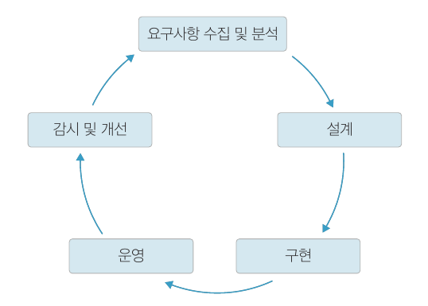

데이터베이스는 최초 사용자의 요구에 의해 구축되어 사용되다가 필요에 따라 개선 또는 다시 구축되어 사용됩니다.

## 데이터 모델링 과정

​	데이터 모델링은 데이터베이스 생명주기 중 요구사항 수집 및 분석부터 설계까지의 과정을 말합니다. 아래의 과정에 따라 실시됩니다.

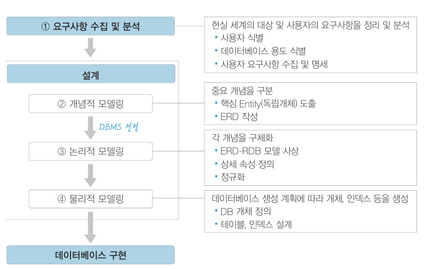

### 개념적 모델링

​	개념적 모델링은 요구사항을 수집하고 분석한 결과를 토대로 업무의 핵심적인 개념을 구분하고 전체적인 뼈대를 만드는 과정입니다.

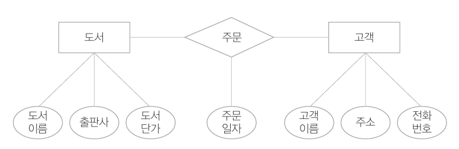

### 논리적 모델링

​	논리적 모델링은 개념적 모델링에서 만든 ERD 를 사용하고자 하는 DBMS 에 맞게 매핑하여 실제 DB 로 구현하기 위한 모델을 만드는 과정입니다.

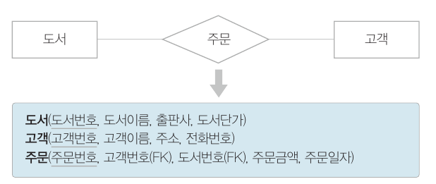

논리적 모델링은 다음 몇 가지 과정을 거칩니다.

- 개념적 모델링에서 추출하지 않았던 상세 속성들을 모두 추출합니다.
- 정규화를 수행합니다.
- 데이터 표준화를 수행합니다. 
  - 데이터 용어 사진과 도메인을 정의하여 동일하게 사용되는 용어를 정리하고 데이터의 형태 및 크기 등을 확정합니다.

### 물리적 모델링

​	물리적 모델링은 작성된 논리적 모델을 실제 컴퓨터의 저장 장치에 저장하기 위한 물리적 구조를 정의하고 구현하는 과정입니다.

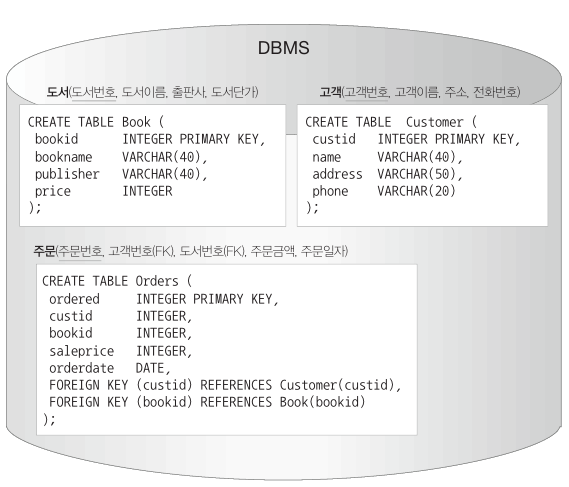

다음은 물리적 모델링 시 트랜잭션, 저장 공간 설계 측면에서 고려사항입니다.

- 응답시간을 최소화해야 합니다.

- 얼마나 많은 트랜잭션을 동시에 발생시킬 수 있는지 검토해야 합니다.

- 데이터가 저장될 공각을 효율적으로 배치해야 합니다

  - 데이터 사용 형태에 따라 검색을 위한 인덱스를 설계해서 최적의 성능을 낼 수 있도록 합니다.

  

# ER 모델

​	ER 모델은 개념적 모델링에 사용하는 모델입니다. 개체, 속성, 관계를 규명합니다. ER 모델은 ERD 라는 표준화된 그림으로 표현됩니다.

## 개체와 개체 타입

​	개체(entity) 는 사람, 사물, 장소, 개념, 사건과 같이 유무형의 정보를 가지고 있는 독립적인 실체입니다. 개체는 비슷한 속성을 가진 개체 타입(entity type) 을 구성하며 개체 집합(entity set) 으로 묶입니다.

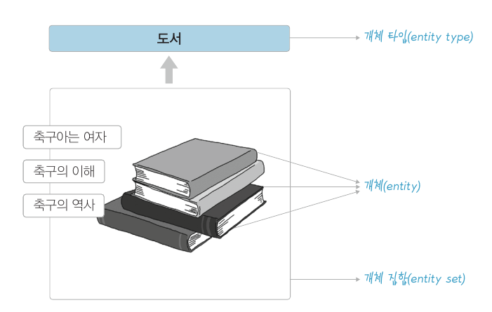

개체는 다음과 같은 특징이 있습니다.

- 유일한 식별자에 의해 식별이 가능합니다.
- 꾸준한 관리를 필요로 하는 정보입니다.
- 두 개 이상 영속적으로 존재합니다.
- 업무 프로세스에 이용됩니다.
- 반드시 자신의 특징을 나타내는 속성을 포함합니다.
- 다른 개체와 최소 한 개 이상의 관계를 맺고 있습니다.

### 개체 타입의 ER 다이어그램 표현

​	ER 다이어그램 상에서 개체 타입은 직사각형으로 나타냅니다. 

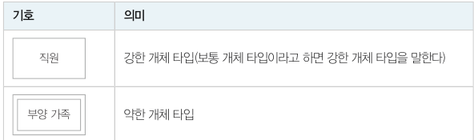

강한 개체(strong entity) 타입은 다른 개체의 도움 없이 독자적으로 존재할 수 있습니다. 반면 약한 개체(weak entity) 타입은 독자적으로 존재할 수 없고 반드시 상위 개체 타입을 가집니다.

## 속성

​	속성은 기본적으로 타원으로 표현하며 개체 타입과 실선으로 연결됩니다.

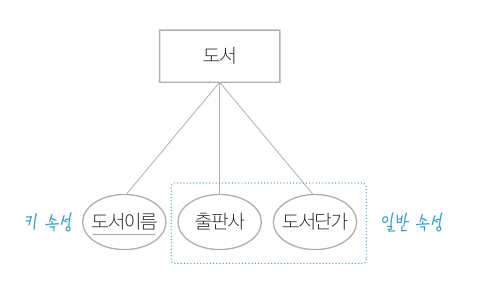

### 속성의 유형

속성은 값의 형태에 따라 다음과 같이 구분됩니다.

## 관계와 관계 타입

​	ER 모델은 개체와 개체 사이의 관계를 표현합니다. 관계(relationship) 란 개체 간의 연관성을 말하며, 관계 타입(relationship type) 은 개체 타입과 개체 타입 간의 연결 가능한 관계를 정의한 것입니다. 관계 집합(relation set) 은 관계로 연결된 집합을 의미합니다.

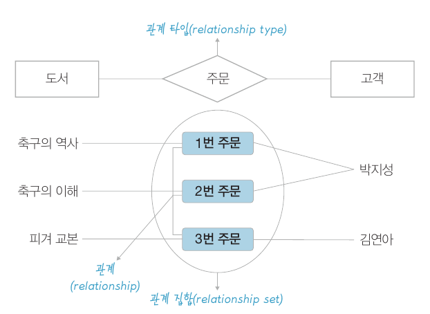

### 관계 타입의 ER 다이어그램 표현

​	관계 타입은 마름모로 표현합니다. 아래는 관계의 예시입니다.

​	관계 타입은 위 그림의 '수강' 과 같이 속성을 가질 수 있습니다. 이 속성은 관계가 어떠한 관계인지에 대한 추가적인 정보를 제공합니다.

### 관계 타입의 유형

​	관계 타입은 각 개체 타입이 관계를 맺은 형태에 따라 몇 가지 유형으로 구분할 수 있습니다.

**차수에 따른 유형**

관계 집합에 참가하는 개체 타입의 수를 관계 타입의 차수라고 합니다.

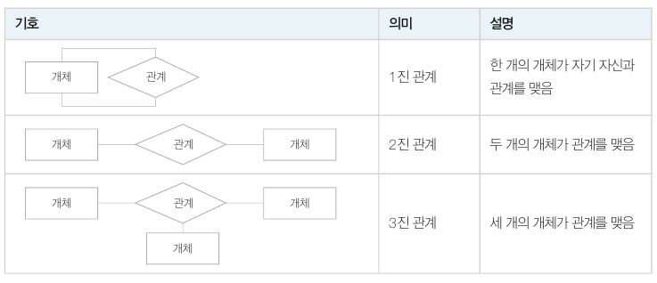

**관계 대응 수에 따른 유형**

​	관계 대응 수는 두 개체 타입의 관계에 실제로 참여하는 개별 개체 수를 의미합니다.

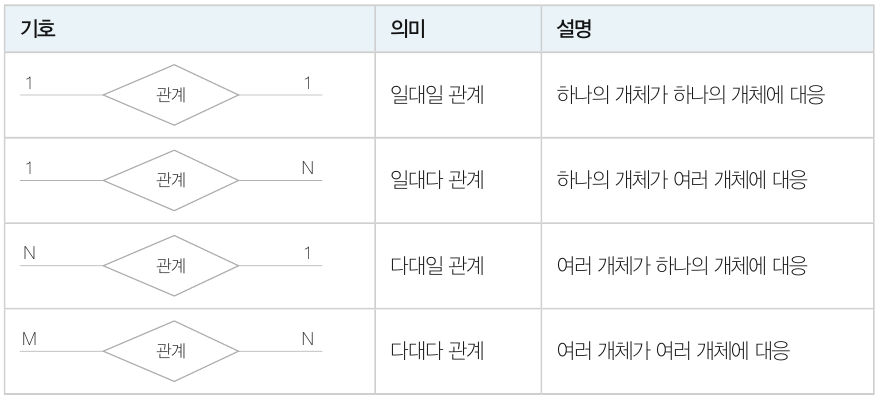

**관계 대응수의 최솟값과 최댓값**

​	관계 대응 수는 최댓값을 표시하지만 최솟값은 표시하는 않는 문제점이 있습니다. 이를 보완하기 위해 관계실선 위에 최솟값까지 표현할 수 있습니다.

최솟값이 0 이라는 뜻은 반드시 참여할 필요가 없다는 뜻입니다.

다음은 1:1, 1:N, M:N 관계를 (min, max) 로 표기한 것입니다.

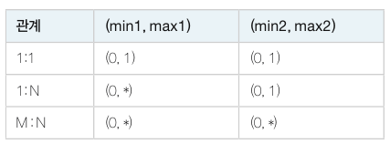

(최댓값, 최솟값) 으로 관계 대응수를 표기할 때는 각 개체의 간점에서 관계에 참여하는 횟수를 적습니다.

학과는 학생이 한명도 없을 수도 있고, 여러 명일 수 있습니다. 학생 입장에서는 학과는 무조건 1개입니다. 따라서 위와 같이 표현되는 겁니다.

### ISA 관계

개체 집합들이 맺고 있는 관계 중 상하 관계를 표현하기 위해 ISA 관계를 사용합니다. 이때 상위 개체 타입을 슈퍼클래스, 하위 개체 타입을 서브클래스라고 합니다.

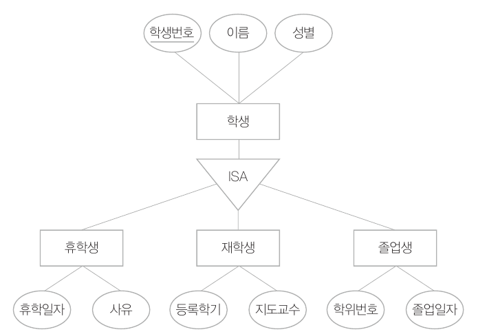

​	상위 개체인 학생 개체 타입은 슈퍼클래스로, 학생이면 기본으로 가지는 공통 속성을 가집니다. 그리고 서브클래스에서 신분에 따라 추가적인 고유 속성을 가집니다.

​	이처럼 ISA 관계로 표현하면 모두 하나의 개체로 표현하거나 완전히 다른 세 개의 개체로 표현하는 것보다 모델링이 훨씬 정교해집니다.

### 참여 제약 조건

​	참여 제약 조건은 개체 집합 내 모든 개체가 관계에 참여하는지 여부에 따라 **전체 참여**와 **부분 참여**로 구분됩니다. 전체 참여를 (최솟값, 최대값) 으로 표현하면 최솟값이 1 이상으로 모두 참여한다는 뜻이고, 부분 참여는 최솟값이 0 이상이 됩니다.

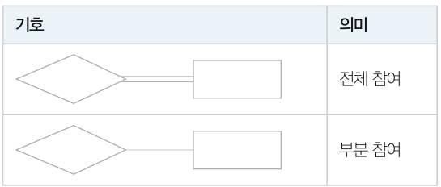

예를 들어, 모든 학생이 강좌를 수강하지는 않지만, 모든 강좌는 학생을 1명 이상 가지고 있을 때 다음과 같이 표현할 수 있습니다.

### 역할

​	개체 타입 간의 관계를 표현할 때 각 개체들의 고유할 역할을 표현할 수 있습니다.

​	일반적으로 역할은 관계만으로 알 수 있으면 생략합니다.

### 순환적 관계

​	순환적 관계(recursive relationship) 는 하나의 개체 타입이 자기 자신과 순환적으로 관계를 가지는 형태입니다. 예를 들어 학생 간에 멘토링 관계를 맺거나, 사원 간 직위에 따라 지시를 이루어지는 관계입니다.

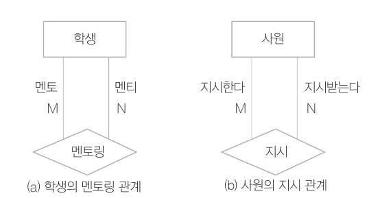

## 약한 개체 타입과 식별자

​	강한 개체 타입은 각 개체를 식별할 수 있는 기본키를 가집니다. 하지만 약한 개체 타입은 자신의 기본키만으로 식별이 어렵기 때문에 강한 개체 타입의 기본키를 상속받아 사용합니다. 

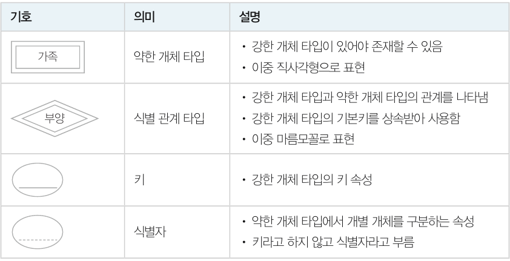

예를 들어, 회사에서 직원 개체 타입과 가족 개체 타입이 '부양' 관계를 맺고 있다고 하겠습니다.

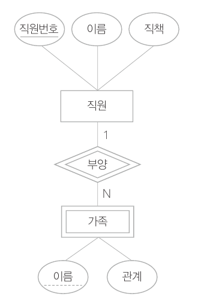

가족 개체 타입의 경우 직원번호 없이는 누구의 가족인지 알 수 없습니다. 따라서 직원번호와 이름을 함께 사용하여 구분합니다. 이처럼 **독립적인 키로는 존재할 수 없지만 상위 개체 타입의 키와 결합하여 개별 개체를 식별하는 속성을 식별자(discriminator) 혹은 부분키(partial key)** 라고 합니다.

## IE 표기법

IE 표기법은 ER 표기법과 다른 표기법입니다. IE 표기법에서는 개체 타입과 속성을 직사각형으로 표현합니다. 

관계는 마름모꼴 대신 개체 타입인 직사각형을 관계 실선으로 연결하고, 아래와 같은 기호로 관계 대응 수 등을 표현합니다.

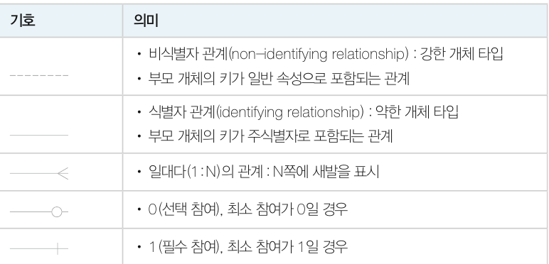

​	예를 들어 부서와 직원은 강한 개체 타입 간의 관계이고, 직원이 없는 부서는 있지만 부서가 없는 직원은 없을 떄 다음과 같이 표현할 수 있습니다.

​	약한 개체 타입과 식별자를 IE 표기법으로 그리면 아래와 같이 됩니다.

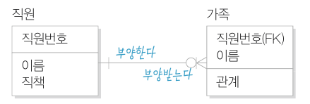

