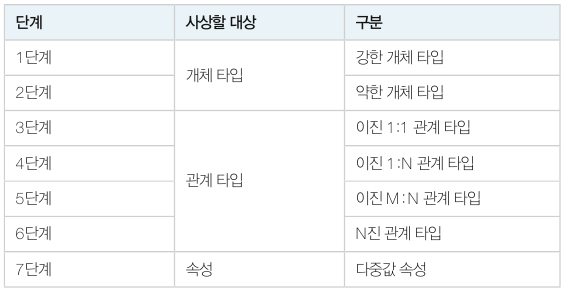
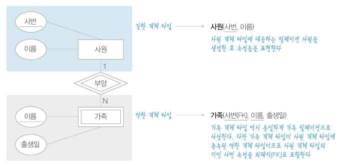
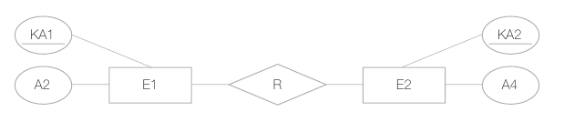
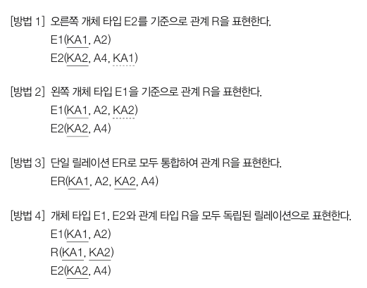
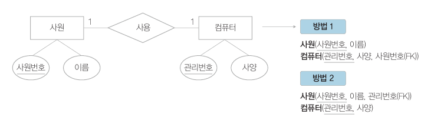
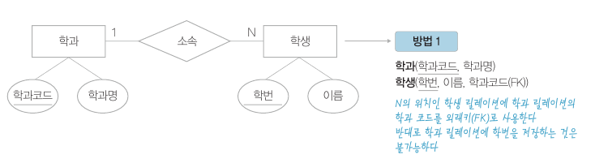
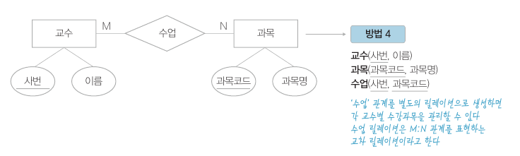
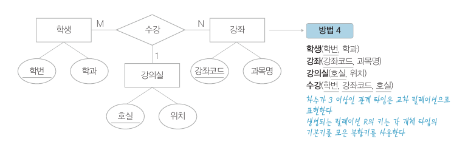
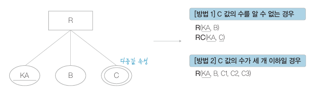

# ER 모델을 관계 데이터 모델로 매핑

​	완성된 ER 모델은 실제 DB 로 구축하기 위해 논리적 모델링 단계를 거치는데 이 단계에서 매핑이 이루어집니다.

​	매핑은 각각 개체 타입의 유형과 관계 타입 유형에 따라 다른 방법으로 진행됩니다. 아래와 같이 7단계로 구분됩니다.

## 개체 타입의 매핑

### 1단계 - 강한(정규) 개체 타입

​	정규 개체 타입 E 의 경우 대응하는 릴레이션 R 을 생성합니다. 각 개체 타입의 일반 속성은 각각 새로 생성하는 릴레이션의 속성으로 표시하고, 기본키와 외래키는 PK 나 FK 등으로 표시합니다.

### 2단계 - 약한 개체 타입

​	약간 개체 타입에서 생성된 릴레이션은 강한 개체 타입의 키를 외래키로 매핑하여 기본키를 구성합니다.

## 관계 타입의 매핑

​	관계 타입은 각 관계 타입이 맺고 있는 차수와 대응 수에 따라 매핑 방식을 구분할 수 있습니다.

방식은 총 4가지입니다.

### 3단계 - 이진 1:1 관계 타입

​	해당 타입은 방법 1 ~ 방법 4 까지 모든 유형으로 매핑할 수 있습니다. 하지만 방법 4 는 불필요한 개체를 생성하기 때문에 사용하지 않습니다. **방법 1 이나 방법 2 중 FK 에 NULL 값이 덜 발생하는 방법을 사용하면 됩니다.**

### 4단계 - 이진 1:N 관계 타입

​	N 의 위치에 따라 방법 1 또는 바업 2 유형으로 매핑됩니다.

### 5단계 - 이진 M:N 관계 타입

해당 타입은 방법 4 유형으로 매핑됩니다. 새로운 릴레이션을 교차 테이블이라고 합니다.

### 6단계 - N진 관계 타입

​	ER 모델의 차수가 3 이상인 다진 관계 타입의 경우 방법 4 로 매핑합니다. 그리고 **생성되는 릴레이션의 키는 각 개체 타입의 기본키를 모은 복합키로 사용**합니다.

## 다중값 속성의 매핑

​	다중값 속성은 취미가 (등산, 스키, 노래) 인 것과 같이 하나의 속성에 여러 값을 가질 수 있는 속성을 말합니다. 다중값 속성을 가진 ER 모델을 관계 데이터 모델로 매핑하는 방법은 다음과 같은 두 가지 방법이 있습니다.

### 7단계 - 다중값 속성

​	속성의 개수를 알 수 없는 경우 방법 1 을, 속성의 개수가 제한적으로 생기는 경우 방법 2 를 사용합니다.

*이후 실습은 따로 작성하지 않겠습니다.*