# 이상현상

​	잘못된 설계 테이블로 삽입, 삭제, 수정 같은 데이터 조작 시 이상현상이 발생합니다. 이상현상(anamaly) 란 튜플 삽입 시 부득이하게 Null 값이 입력되거나, 삭제 시 연쇄삭제 현상이 발생하거나, 수정 시 데이터의 일관성이 훼손되는 현상입니다.

## 이상현상의 개념

예를 들어 아래와 같은 '학생수강' 테이블이 있다고 하겠습니다.

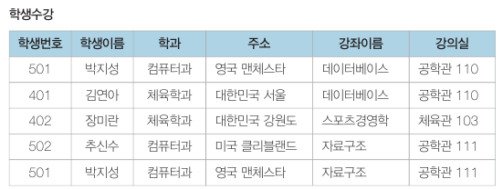

### 삭제이상

​	삭제이상(deletion anomaly) 이란 튜플 삭제 시 같이 저장된 다른 정보까지 연쇄적으로 삭제되는 현상입니다. 예를 들어 장미란 학생이 스포츠경영학 수강을 취소해서 DELETE 문으로 3번 째 튜플을 삭제했는데, 장미란 학생의 학생번호, 학과, 주소가 없어지는 것입니다. 

### 삽입이상

​	삽입이상(insertion anomaly) 이란 튜플 삽입 시 특정 속성에 해당하는 값이 없어 NULL 값을 입력해야 하는 현상입니다. 예를 들어 박세리 학생이 체육학과 입학해 INSERT 문으로 (학생번호, 학생이름, 학과, 주소) 정보는 삽입했지만 수강신청 전이라서 (강좌이름, 강의실) 속성은 NULL 을 입력하는 것입니다.

NULL 값은 집계함수 사용 시 원치 않는 결과를 만들어낼 수도 있습니다.

### 수정이상

​	수정이상(update anomaly) 이란 튜플 수정 시 중복된 데이터의 일부만 수정되어서 데이터의 불일치문제가 일어나는 현상입니다. 예를 들어 현재 '박지성' 이름을 가진 튜플은 2개입니다. 박지성 학생의 주소를 대한민국으로 변경했는데 하나의 튜플만 바뀌면 데이터의 일관성이 깨집니다.

# 함수 종속성

​	이상현상이 발생하는 테이블을 수정하여 정상으로 만드는 과정을 정규화(normalization) 이라고 합니다. 정규화를 위해서는 먼저 테이블을 분석하여 기본키와 함수 종속성을 파악해야 합니다.

다음 테이블 예시를 보겠습니다.

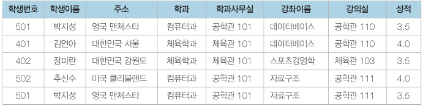

위 테이블에서 강좌이름이 '데이터베이스' 인 경우 강의실은 '공학관 110' 호 한 곳뿐입니다. 이와 같이 어떤 속성 A 의 값을 알면 다른 속성 B 의 값이 유일하게 정해지는 의존 관계를 '속성 B 는 속성 A 에 종속한다' 라고 합니다.

학생이름, 주소는 학생번호에 종속합니다. 강의실은 강좌이름에 종속하며 학과사무실은 학과에 종속합니다. 이렇듯 릴레이션의 속성 간에 종속하는 성질을 **함수 종속성**이라고 합니다.

## 함수 종속성 다이어그램

​	함수 종속성을 나타내는 표기법으로 함수 종속성 다이어그램이 있습니다. 

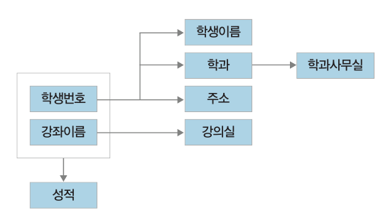

릴레이션 속성을 직사각형, 종속성을 화살표로 나타내며, 복합속성의 경우 직사각형으로 묶어서 그립니다. 여기서 결정자가 복합 속성일 수도 있습니다. 성적은 학생번호와 강좌이름으로 특정되기 때문입니다.

## 함수 종속성 규칙

​	릴레이션에 존재하는 모든 종속관계 집합 {X -> Y, ......} 을 구하면 이 집합으로부터 유도할 수 있는 종속관계가 있습니다.

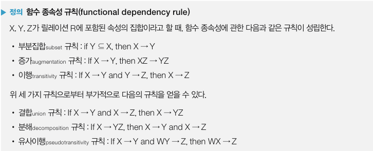

학생수강성적을 통한 예시입니다.

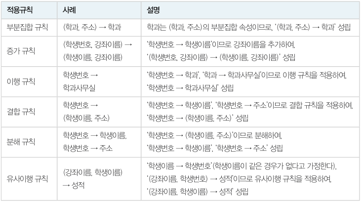

## 함수 종속성과 기본키

​	함수 종속성 파악을 위해서는 우선 기본키를 찾아야 합니다. 예를 들어 릴레이션 R(K, A, B, C) 가 있고 K 가 기본키라고 가정하겠습니다. 릴레이션에서 기본키 값은 유일하기 때문에 같은 값을 갖는 K 가 없습니다. 따라서 K -> A, K -> B, K -> C 가 성립합니다. 여기에 결합 규칙을 적용하면 K -> ABC 가 성립하므로 K -> R 임을 알 수 있습니다.

## 이상현상과 결정자

​	이상현상은 한 개의 릴레이션에 두 개 이상의 정보가 포함되어 있을 때 나타납니다. 아래 학생수강성적 릴레이션의 경우 학생 정보(학생번호, 이름, 주소, 학과) 와 강좌 정보 (강좌이름, 강의실) 가 한 릴레이션에 포함되어 있기 때문에 이상현상이 나타납니다.

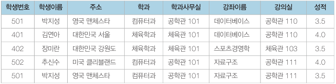

아래는 해당 릴레이션의 함수 종속성 다이어그램입니다.

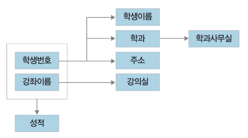

여기서 결정자는 (학생번호, 강좌이름), '학생번호', '강좌이름', '학과' 입니다. (학생번호, 강좌이름) 은 기본키이면서 결정자입니다. 반면 나머지 3개의 결장자는 기본키가 아니면서 결정자입니다. **이상현상은 기본키가 아니면서 결정자인 속성 (비후보키 결정자 속성) 이 있을 때 발생합니다.**

따라서 이상현상을 해결하기 위해 릴레이션에서 부분 릴레이션을 분해합니다. 분해할 때 부분 릴레이션의 결정자는 원래 릴레이션에 남겨두어야 관계를 형성할 수 있습니다. 분리하면 아래와 같이 됩니다.

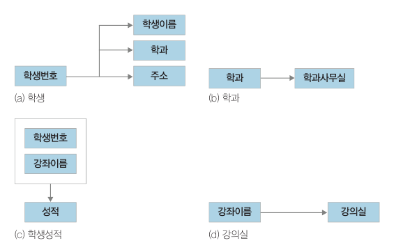

# 정규화

​	이상현상의 원인은 여러 가지가 있지만 대부분 두 가지 이상의 정보가 한 릴레이션에 저장되어 있기 때문에 발생합니다. **이상현상이 발생하는 릴레이션을 분해하여 이상현상을 없애는 과정을 정규화(normalization) 라고 합니다.**

## 정규화 과정

​	이상현상이 있는 릴레이션은 이상현상을 일으키는 함수 종속성의 유형에 따라 등급을 분류할 수 있습니다. 이를 정규형이라고 하는데, 정규형이 높을수록 이상현상이 줄어듭니다.

### 제 1 정규형

​	릴레이션 R 의 모든 속성 값이 원자값을 가지면 제 1 정규형이라고 합니다. 아래는 속성이 원자값이 되도록 변환한 예시입니다.

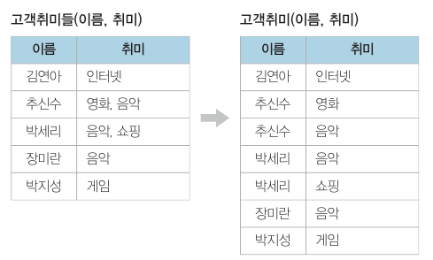

### 제 2 정규형

​	릴레이션 R 이 제 1 정규형을 만족하면서 기본키가 아닌 속성이 기본키에 완전 함수 종속일 때 제 2 정규형이라고 합니다. 제 2 정규형은 릴레이션의 기본키가 복합키일 때, 복합키의 일부분이 다른 속성의 결정자인지 여부를 판단하는 것입니다. 여기서 완전 함수 종속이란 A 와 B 가 릴레이션 R 의 속성이고 A -> B 종속성이 성립할 때, B 가 A 의 속성 전체에 함수 종속하고 부분 집합 속성에 함수 종속하지 않을 경우 완전 함수 종속(full functional dependency) 이라고 합니다.

​	아래는 제 2 정규형을 만족하지 못하는 예시입니다.

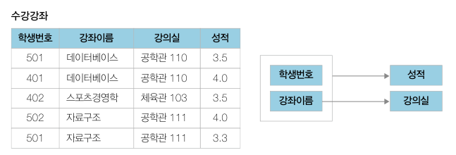

​	해당 릴레이션에서 기본키는 (학생번호, 강좌이름) 인데, 나머지 속성인 강의실과 성적은 기본키에 함수적으로 종속되어있지만 강의실은 기본키의 일부인 강좌 이름에 한 번 더 종속되어있어서 불완전 함수 종속되어있습니다.

​	제 2 정규형으로 변환한다면 아래와 같습니다.

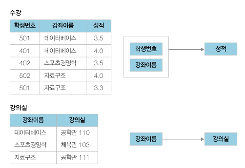

### 제 3 정규형

​	릴레이션 R 이 제 2 정규형이고 기본키가 아닌 속성이 기본키에 비이행적(non-transitive) 으로 종속할 때 (직접 종속) 제 3 정규형이라고 합니다. 이행적 종속이란 A -> B, B -> C 가 성립할 때 A -> C 가 성립되는 함수 종속성을 말합니다.

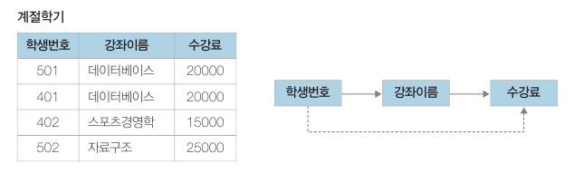

위 계절학기 릴레이션은 수강 정보와 수강료 정보를 저장합니다. 이때 학생은 한 강좌만 신청할 수 있다고 가정하겠습니다.

- 삭제이상 : 402번 학생이 수강을 취소하면 스포츠경영학 과목의 수강료에 대한 정보가 사라집니다.
- 삽입이상 : 컴퓨터입문 과목이 개설되어 수강료 15000원을 삽입해야 하는데, 신청한 학생이 없어서 NULL 값으로 삽입해야 합니다.
- 수정이상 : 데이터베이스 수강료를 15000원으로 변경하는 경우 데이터 불일치가 발생할 가능성이 있습니다.

이상형상의 원인은 학생번호 -> 강좌이름 -> 수강료 로 수강료가 기본키에 이행적으로 종속적이기 때문입니다. **따라서 이상현상을 일으키는 (강좌이름, 수강료) 를 분해해야 합니다.**

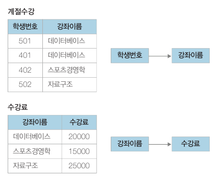

### BCNF

​	릴레이션 R 에서 함수 종속성 X -> Y 가 성립할 때 모든 결정자 X 가 후보키이면 BCNF(Boyce Codd Normal Form) 정규형이라고 합니다.

​	예를 들어 특강수강 릴레이션이 있고, 한 학생은 한 개 이상의 특강을 신청할 수 있으며 교수는 한 특강만 담당한다고 가정하겠습니다.

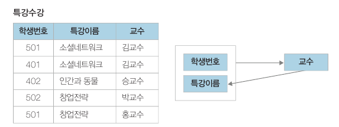

- 삭제이상 : 402번 학생이 수강을 취소하면 인간과 동물 특강을 담당하는 교수 정보가 사라집니다.
- 삽입이상 : 최교수가 취업특강을 새로 맡았는데 신청한 학생이 없어 학생번호를 NULL  값으로 입력해야 합니다.
- 수정이상 : 김교수의 특강 제목을 소셜네트워크에서 소셜네트워크 분석으로 변경할 경우 데이터 불일치가 발생할 가능성이 있습니다.

해당 이상현상의 원인은 '교수 '-> '특강이름' 관계가 성립한다는 것입니다. 하지만 '교수'는 해당 릴레이션에서 후보키가 아닙니다. 이와 같이 결정자이면서 후보키가 아닌 속성이 존재하면 이상현상이 발생합니다.

따라서 BCNF 정규형으로 변환하면 아래와 같이 됩니다.

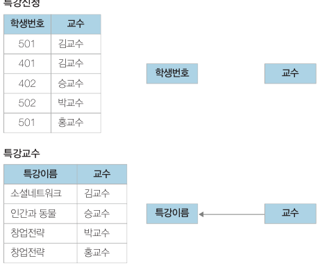

## 무손실 분해

​	분해된 릴레이션 간 관계를 유지하기 위해 분해된 릴레이션에 공통 속성을 한 개 이상 두어야 합니다. 해당 속성은 조인할 때 사용됩니다. 이때 릴레이션 R 을 릴레이션 R1 과 R2 로 분해할 때 R1 ⋈ R2 = R 이면 무손실 분해라고 합니다. 무손실 분해를 위한 조건은 공통된 속성이 릴레이션 R1 의 키이거나 혹은 릴레이션 R2 의 키여야 합니다. 

예를 들어 BCNF 에서 사용한 특강신청 릴레이션을 두 가지 방법으로 분해해보겠습니다.

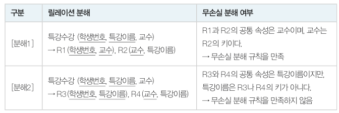

분해 1 은 무손실 분해를 만족합니다. 분해 2에서 공통속성은 특강이름으로, 아래와 같이 나눠집니다.

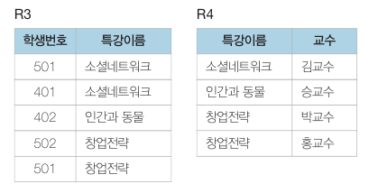

이때 R3 와 R4 를 다시 조인하면 두 개의 튜플이 추가로 생깁니다. 의미 없는 튜플이 생긴 이유는 무손실 분해 조건을 만족하지 못했기 때문입니다.

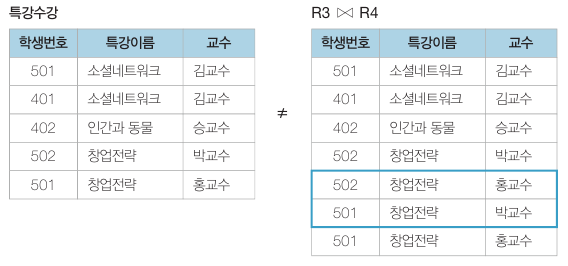

**즉, 공통 속성이 분해된 릴레이션 중 한 쪽의 키가 되어야 합니다.**

## 제 4, 5 정규형

​	제 4 정규형은 다치종속성(multivalued dependency) 을 가진 릴레이션에 관한 내용이고, 제 5 정규형은 조인종속성(join dependency) 을 가진 릴레이션에 관한 내용입니다. 대부분의 릴레이션은 BCNF 까지 정규화하면 실제적인 이상현상은 없어집니다.