# 트랜잭션

​	트랜잭션(transaction) 은 DBMS 가 데이터베이스를 다룰 때 사용하는 작업 단위입니다.

## 트랜잭션의 개념

​		트랜잭션(transaction) 은 DBMS 가 데이터를 다루는 논리적인 작업 단위입니다. 트랜잭션을 정의하는 이유는 다음과 같습니다.

- 데이터베이스에서 데이터를 다룰 때 장애가 일어나는 경우가 있는데, 트랜잭션은 데이터를 복구하는 작업의 단위가 됩니다.
- 데이터베이스에서 여러 작업이 동시에 같은 데이터를 다룰 때가 있는데, 트랜잭션은 이 작업을 서로 분리하는 단위가 됩니다.

​	아래와 같이 사용합니다.

```
START TRANSACTION
	SQL 문 1 ...
	SQL 문 2 ...
COMMIT
```

​	예를 들어 계좌이체 트랜잭션이 실행될 때 구체적인 상황을 보겠습니다.

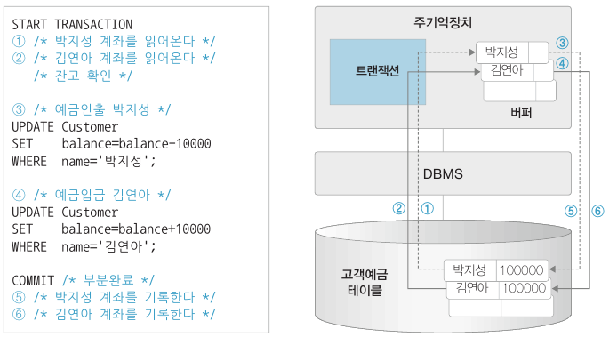

​	여기서 중요한 점은, 데이터는 하드디스크에 저장되어 있고 처리를 위해서는 반드시 주기억장치 버퍼로 사본을 읽어와야 한다는 점입니다. 먼저 트랜잭션은 데이터베이스에 저장된 테이블을 읽어와 주기억창치 버퍼에 저장하고 버퍼에 저장된 데이터를 수정한 후 최종적으로 데이터베이스에 다시 저장합니다.

​	COMMIT 은 트랜잭션의 종료를 알리는 SQL 문인데, 트랜잭션의 사실적인 종료는 6번까지 끝난 후지만 DBMS 는 4번까지 수행하고 사용자에게 완료사실을 알립니다. <u>그리고 나머지 5, 6 은 DBMS 가 책임지고 수행합니다.</u> 이렇게 하는 이유는 DBMS 가 동시에 많은 트랜잭션을 수행할 때 각각의 트랜잭션이 하드디스크에 개별 접근하는 것을 피하고 DBMS 가 일괄적으로 하드디스크에 접근하여 처리함으로써 사용자에게 빠른 응답성을 보장하기 위해서입니다.

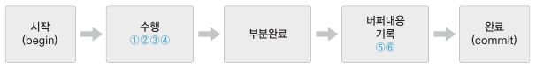

## 트랜잭션의 성질

​	트랜잭션은 ACID 성질을 가지고 있습니다.

### 원자성 Atomicity

​	원자성이란 트랜잭션이 원자처럼 더 이상 쪼개지지 않는 하나의 프로그램 단위로 동작해야 한다는 의미입니다. 이는 COMMIT, ROLLBACK 등을 통해 이루어집니다. 아래는 트랜잭션 제어 명령어 입니다.

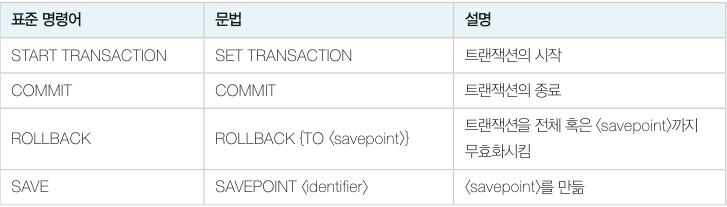

트랜잭션의 길이가 길면 트랜잭션의 중간 지점에 수정내용을 반영하는 포인트를 만들 수 있습니다. 트랜잭션이 잘못될 경우 처음으로 돌아가는 게 아니라 해당 포인트로 돌아갑니다.

```
START TRANSACTION;
	SQL 문 1 ...
	SQL 문 2 ...
SAVEPOINT a;
	SQL 문 3 ...
	SQL 문 4 ...
ROLLBACK TO a;
	SQL 문 5 ...
	SQL 문 6 ...
COMMIT;
```

### 일관성 Consistency

​	트랜잭션은 데이터베이스의 일관성을 유지해야 합니다. 일관성은 테이블이 생성될 때 CREATE 문과 ALTER 문의 무결성 제약조건을 통해 명시됩니다. 트랜잭션은 이 조건에 따라 일관성을 유지합니다. 다만 수행 중 일시적으로 일관성을 유지하지 못하는 상태가 있을 수 있습니다. 

​	예를 들어 계좌이체 트랜잭션의 일관성 조건이 A 계좌 + B 계좌 = 20만 원 이라고 할 때 A 계좌에서 만 원을 인출하여 B 계좌로 입금하기 전에는 총액이 일시적으로 19만 원으로 줄어드는 일관성 없는 (inconsistent) 상태가 됩니다. 트랜잭션 종료 후에는 다시 20만 원이 됩니다.

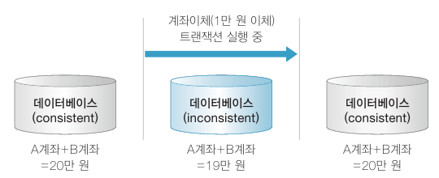

### 고립성 Isolation

​	여러 트랜잭션이 동시에 수행될 때 상호 간섭이나 데이터 충돌이 일어나지 않는 현상을 고립성이라고 합니다.

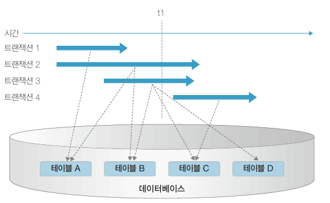

​	위 그림에서 시간 t1 을 보면 트랜잭션 2 와 3 이 테이블 B 를 동시에 다루고 있습니다. 이 때 데이터의 일관성이 훼손될 수 있는데, 따라서 동시에 수행되는 트랜잭션이 같은 데이터를 가지고 충돌하지 않도록 제어하는 작업이 필요합니다. 이 작업을 **동시성 제어(concurrency control)** 라고 합니다. 그리고 동시성 제어보다 완화된 방법으로 트랜잭션 고립 수준(isolation level) 에 따라 트랜잭션의 상호 간섭을 완화시키는 방법도 있습니다.

### 지속성 Durability

​	지속성은 트랜잭션이 정상적으로 완료 혹은 부분완료한 데이터는 반드시 데이터베이스에 기록되어야 한다는 성질입니다. 트랜잭션 상태도는 아래와 같습니다.

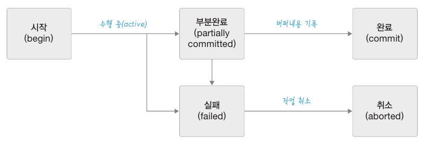

- 부분완료 : 트랜잭션 수행은 완료되었지만 변경 내용에 데이터베이스에 기록되었는지 확실하지 않은 상태입니다. 이 상태에서 DBMS 가 최종적으로 변경 내용을 데이터베이스에 기록해야 완료(commited) 상태가 됩니다. 만약 시스템 내부의 문제 혹은 시스템 다운 등으로 DBMS 가 변경 내용을 데이터베이스에 기록하지 못하면 실패(failed) 상태가 됩니다.
- 실패 : 트랜잭션을 중간에 중단하였거나 부분완료 상태에서 변경 내용을 데이터베이스에 저장하지 못한 상태를 말합니다. 실패 상태에서 DBMS 는 트랜잭션이 수행한 작업을 모두 원상복구시킵니다.

### 트랜잭션의 성질을 유지시키는 DBMS 기능


# 동시성 제어

​	트랜잭션이 동시에 수행될 때 일관성을 해치지 않도록 트랜잭션의 데이터 접근을 제어하는 DBMS 기능을 **동시성 제어(concurrency control)** 라고 합니다.

​	아래는 두 개의 트랜잭션이 한 개의 데이터에 동시 접근할 때 발생할 수 있는 상황입니다.

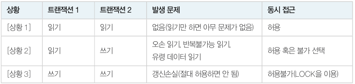

## 갱신손실 문제

​	갱신손실(lost update) 문제는 두 개의 트랜잭션이 한 개의 데이터를 동시에 갱신(update) 할 때 발생합니다. 갱신손실 문제는 데이터베이스에서 절대 발생하면 안됩니다.

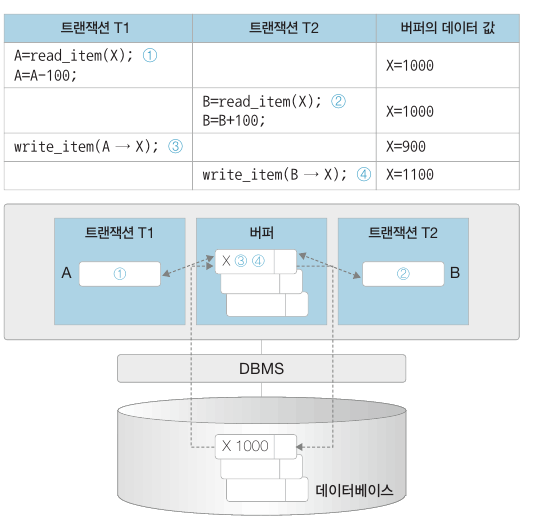

​	위 그림은 갱신손실을 나타내는 시나리오입니다. T1 이 1000 을 가져와서 100 을 빼고 900 으로 저장했습니다. 하지만 중간에 T2 가 끼어들어 1000 을 가져와서 100 을 더하고 1100 을 저장합니다. 그러면 T1 이 900 을 저장한 내용이 무시되고 T2 가 수행한 내용만 기록됩니다.

​	갱신손실 문제를 해결하려면 트랜잭션을 순서대로 실행하면 되지만, 데이터베이스의 공유와 빠른 응답 처리를 위해 그럴 수는 없습니다. 갱신손실 문제를 해결하고 트랜잭션을 동시에 실행시킬 수 있는 방법을 알아보겠습니다.

## 락

​	갱신손실 문제를 해결하려면 상대방 트랜잭션이 데이터를 사용하는지 여부를 알 수 있는 규칙이 필요합니다. 알리는 방법으로 락(lock) 이라는 잠금장치를 사용합니다.

> 데이터베이스의 락(lock)을 거는 단위는 데이터베이스 관리 시스템(DBMS)과 사용하는 락의 종류에 따라 다릅니다. 일반적으로 락은 테이블 단위와 행(레코드) 단위 모두 가능합니다.
>
> 1. **테이블 레벨 락(Table-level lock)**: 이는 테이블 전체에 락을 거는 방식으로, 락을 건 테이블의 모든 데이터는 해당 락이 해제될 때까지 다른 트랜잭션에서 수정할 수 없습니다. 테이블 레벨 락은 구현이 비교적 간단하지만 동시성(concurrency)이 낮아지는 단점이 있습니다.
> 2. **행 레벨 락(Row-level lock)**: 이는 특정 행(레코드)에만 락을 거는 방식으로, 더욱 세밀한 락 제어가 가능합니다. 행 레벨 락은 동시성이 높지만, 락을 관리하는 오버헤드가 크다는 단점이 있습니다. 특히 많은 수의 행에 락을 걸어야 할 경우에는 이 문제가 더욱 심각해질 수 있습니다.
>
> 따라서 데이터베이스의 락 단위는 트랜잭션의 특성, 동시성 요구 사항, 성능 고려 사항 등에 따라 결정됩니다. 예를 들어, 금융 시스템 같은 곳에서는 높은 동시성을 유지하면서 데이터의 일관성을 보장하기 위해 행 레벨 락을 주로 사용하고, 반면에 락 관리의 복잡성을 줄이고 간단한 데이터 업데이트를 수행하는 경우에는 테이블 레벨 락을 사용할 수 있습니다.

### 락의 개념

​	락은 트랜잭션이 데이터를 읽거나 수정할 때 데이터에 표시하는 잠금 장치입니다. 예를 들어 아래와 같은 두 트랜잭션이 있다고 가정하겠습니다.

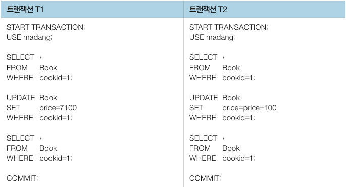

​	두 트랜잭션을 동시에 실행시켜보겠습니다. 먼저 T1 의 SELECT, UPDATE 문을 실행시킨 후 잠시 멈추면 T1 이 Book 테이블에 대한 락을 가지고 있습니다. <u>T2 를 실행시키면 SELECT 문을 실행한 후 UPDATE 문을 실행하려는 순간 락이 걸려 있어서 실행을 멈추고 대기하게 됩니다.</u> 이후 T1 이 다시 SELECT, COMMIT 문을 실행하고 종료하면 락이 해제됩니다. T2 는 대기 상태에서 해제되어 락을 얻은 다음 다시 실행을 시작하여 UPDATE 문을 진행하고 종료합니다. 아래와 같은 흐름입니다.

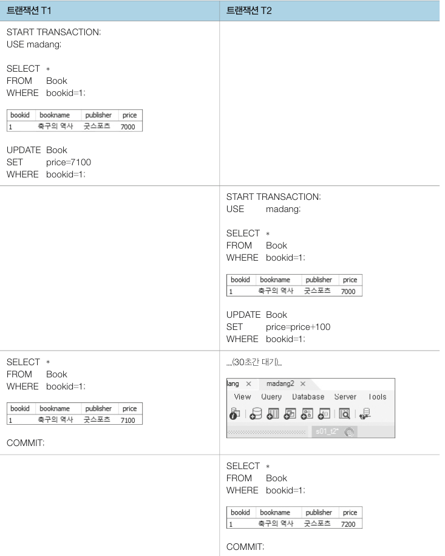

### 락의 유형

​	트랜잭션을 다루는 데이터는 **읽기만 하는 데이터, 읽고 쓰는 데이터, 쓰기만 하는 데이터**가 있습니다. 이 중에서 읽기만 하는 데이터를 다루는 트랜잭션은 어느 정도 허용을 해도 문제가 없습니다. 이를 고려하여 락의 유형을 두 가지로 나눕니다. 트랜잭션이 읽기를 할 때 상용하는 공유락(LS, shared lcok) 과 읽기/쓰기를 할 때 사용하는 배타락(LX, exclusive lock) 이 있습니다. 

​	데이터 X 에 대한 공유락과 배타락을 사용하는 규칙은 다음과 같습니다.

- 데이터에 락이 걸려있지 않으면 트랜잭션은 데이터에 락을 걸 수 있습니다.
- 트랜잭션이 데이터 X 를 읽기만 할 경우 LS(X) 를 요청하고 읽거나 쓰기를 할 경우 LX(X) 를 요청합니다.
- 다른 트랜잭션이 데이터에 LS(X) 를 걸어두면, LS(X) 요청은 허용하고 LX(X) 는 허용하지 않습니다.
- 다른 트랜잭션이 데이터에 LX(X) 를 걸어두면, LS(X) 와 LX(X) 모두 허용하지 않습니다.
- 트랜잭션이 락을 허용받지 못하면 대기 상태가 됩니다.

아래는 락의 허용관계를 행렬로 표시한 것입니다.

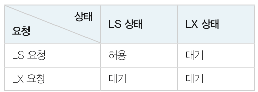

### 2단계 락킹

​	락을 사용하면 갱신손실 문제를 해결할 수 있지만 락을 걸고 해제하는 시점에 제한을 두지 않으면 두 개의 트랜잭션이 동시에 실행될 때 일관성이 깨질 수 있습니다. 

​	예를 들어, 아래는 두 개의 데이터에 두 개의 트랜잭션이 접근하여 갱신하는 작업입니다. T1 은 A 에서 B 계좌로 100원을 입급하고, T2 는 두 계좌의 잔고를 10% 씩 증가시킵니다. 작업 결과는 어느 순서로 실행해도 A + B 는 2200 여야 합니다.

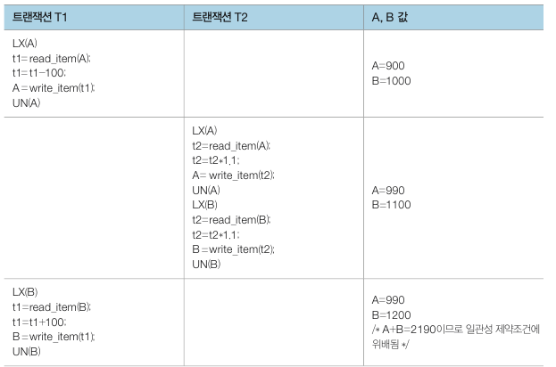

그런데 위 결과를 보면 A + B = 2190 으로 일관성 제약조건에 위배됩니다. <u>원인은 T1 이 쓰기 작업 중인 중간 데이터를 가져와 T2 가 작업을 했기 때문입니다.</u>

​	이것을 방지하기 위하여 2단계 락킹(2 phase locking) 기법을 사용합니다. 이 기법은 트랜잭션이 락을 걸고 해제하는 시점을 다음과 같이 2단계로 나누어 진행합니다.

- 확장단계(Growing phase, Expanding phase) : 트랜잭션이 필요한 락을 획득하는 단계로, 이 단계에서는 이미 획득한 락을 해제하지 않습니다.
- 수축단계(shrinking phase) : 트랜잭션이 락을 해제하는 단계로, 이 단계에서는 새로운 락을 획득하지 않습니다.

2단계 락킹 기법을 사용하여 위 문제를 해결해보겠습니다.

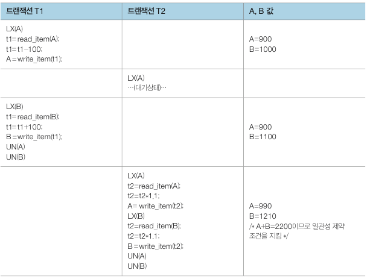

T1 은 A 데이터에 대한 작업을 끝낸 후 앞으로 B 에 락을 걸 예정이므로 A 에 걸었던 락을 미리 해제하지 않습니다. 이를 통해 일관성 제약 조건이 지켜졌습니다.

### 데드락

​	2단계 락킹 기법을 사용하면 데이터의 읽관성을 유지할 수 있습니다. 하지만 두 개 이상의 트랜잭션이 각각 자신의 데이터에 대해 락을 획득하고 상대방 데이터에 대해 락을 요청하면 무한 대기 상태에 빠질 수 있습니다. 이러한 현상을 데드락(Deadlock) 혹은 교착상태라고 합니다.

​	예시로 두 개의 데이터에 두 개의 트랜잭션이 접근하여 갱신하는 작업을 보겠습니다. 마당서점 데이터를 접근하는 트랜잭션 T1, T2 가 있고, T1 은 도서번호가 1 인 도서와 2 인 도서의 가격을 100원 올리고, T2 는 역순으로 도서번호가 2 인 도서와 1 인 도서의 가격을 10% 인상합니다.

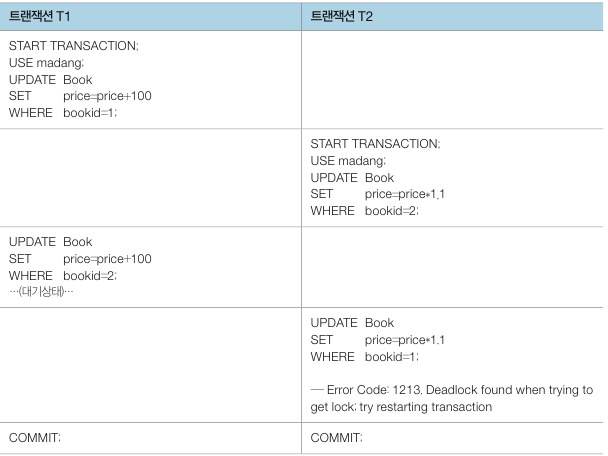

​	T1 은 bookid 가 1인 도서에 락을 걸고, T2 는 bookid 가 2인 도서에 락을 거는데 이 때 각각의 데이터에 다시 락을 요청하면 둘 다 서로 상대방이 락을 해제하기를 기다리는 상태가 됩니다. <u>일반적으로 데드락이 발생하면 DBMS 는 두 작업 중 하나를 강제로 중지시킵니다. 이 때 중지시키는 트랜잭션에서 변경한 데이터는 원래 상태로 되돌려 놓습니다.</u>

​	데드락은 대기 그래프(wait-for graph) 를 그려보면 발생 여부를 판단할 수 있습니다. 대기 그래프는 트랜잭션을 노드로, 락 요청을 화살표로 표현하는데 대기 그래프에서 사이클이 존재하면 데드락이 발생한 것입니다.

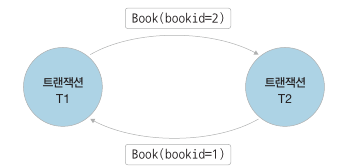

# 트랜잭션 고립 수준

​	위에 설명한 락은 두 트랜잭션이 (쓰기, 쓰기) 인 상황을 해결하기 위한 것입니다. 그러나 (쓰기, 읽기) 상황에서 락을 사용하기에는 동시 진행 정도를 과도하게 막게 됩니다.

## 트랜잭션 동시 실행 문제

​	(쓰기, 읽기) 상황에서 발생할 수 있는 문제는 오손 읽기(dirty read) 문제, 반복불가능 읽기(non-repeatable read) 문제, 유령 데이터(phantom read) 문제 등이 있습니다. 읽기 트랜잭션이 쓰기 트랜잭션에서 작업하는 중간 데이터를 읽기 때문에 발생하는 문제들입니다.

### 오손 읽기

​	오손 읽기는 읽기 트랜잭션 1 이 쓰기 트랜잭션 2 가 작업한 중간 데이터를 읽기 때문에 생기는 문제입니다. 작업 중인 트랜잭션 2 가 롤백할 경우 트랜잭션 1 은 무효가 된 데이터를 잃게 됩니다.

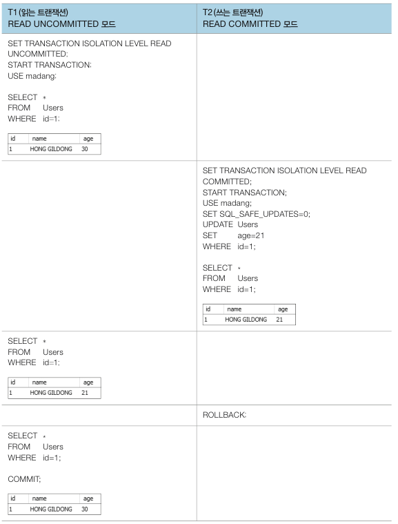

위 예시처럼 T2 가 변경한 데이터를 T1 이 읽은 후 T2 가 롤백하게 된다면 T1 은 T2 가 정상적으로 종료하지 않은 상태에서 변경한 데이터를 보고 작업을 하게 됩니다.

### 반복불가능 읽기

​	반복불가능 읽기는 트랜잭션 1 이 데이터를 읽고 이후에 트랜잭션 2 가 데이터를 쓸 때(UPDATE) 트랜잭션 1 이 다시 한번 데이터를 읽으면 생기는 문제입니다. 즉, <u>트랜잭션 1 이 읽기 작업을 반복할 경우 이전의 결과가 반복되지 않는 현상입니다.</u>

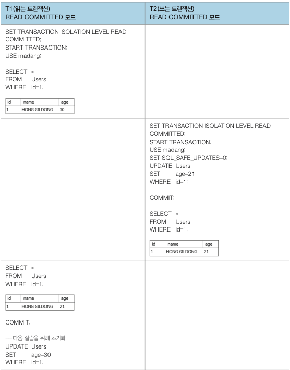

​	위 예시에서 T1 이 데이터를 읽고 작업하던 중 T2 가 데이터를 변경하였습니다. T1 은 변경한 데이터를 보고 다시 한번 작업을 합니다. <u>오손 읽기와 달리 이번에는 T2 가 정상적으로 COMMIT 했기 때문에 틀린 데이터는 아닙니다.</u> 그런데 T1 입장에서는 같은 SQL 문이 다른 결과를 도출합니다.

### 유령데이터 읽기

​	유령데이터 읽기는 트랜잭션 1 이 데이터를 읽고 트랜잭션 2 가 데이터를 쓰고(삽입, INSERT), 다시 트랜잭션 1 이 데이터를 읽을 때 생기는 문제입니다. 트랜잭션 1 이 읽기 작업을 다시 반복할 경우 이전에 없던 데이터(유령 데이터) 가 나타나는 현상을 유령데이터 읽기라고 합니다.

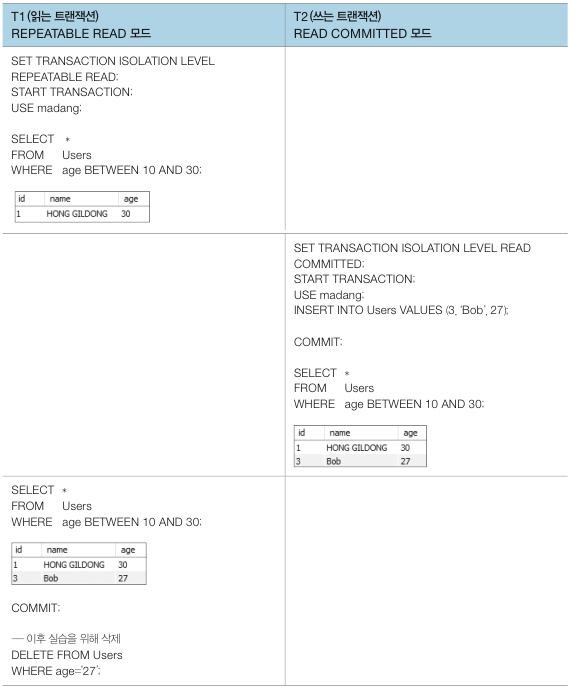

​	위 예시에서 T1 이 T2 가 새로운 데이터를 삽입한 지 모르고 작업을 합니다. T2 가 COMMIT 했기 때문에 틀린 데이터는 아니지만 T1 입장에서는 새로운 데이터가 반영되어 반복불가능 읽기와 마찬가지로 같은 SQL 문이 다른 결과를 도출합니다. <u>유령데이터 읽기는 반복불가능 읽기와 비슷하지만 없던 데이터가 삽입되기 때문에 다르게 구분합니다.</u>

> MySQL 에서는 유령데이터 읽기가 발생하지 않습니다. MySQL 의 REPEATABLE READ 는 트랜잭션이 처음 데이터를 읽어올 때 SNAPSHOT 을 구축하여 자료를 가져오며 그에 따라 다른 세션의 자료가 변경되더라도 동일한 결과를 보여줍니다.

## 트랜잭션 고립 수준 명령어

​	앞의 세 가지 문제를 해결하기 위해 락을 사용할 수도 있지만 DBMS 는 트랜잭션을 동시에 실행시키면서 락보다 더 완화된 방법으로 해결하는 명령어를 제공합니다. (ANSI 표준)

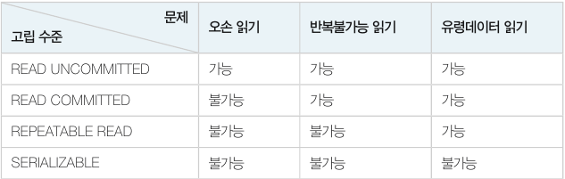

트랜잭션 고립 명령어는 `SET TRANSACTION ISOLATION LEVEL [고립 수준]` 으로 설정할 수 있습니다.

### READ UNCOMMITED (level=0)

​	READ UNCOMMITED 는 고립 수준이 가장 낮은 명령어로, **아무런 공유락을 걸지 않습니다.** 또한 <u>다른 트랜잭션에 공유락과 배타락이 걸린 데이터를 대기하지 않고 읽으며 심지어 다른 트랜잭션이 COMMIT 하지 않은 데이터도 읽을 수 있습니다.</u> 그 때문에 오손 읽기 문제가 생깁니다. 

### READ COMMITED (level=1)

​	READ COMMITED 는 오손 읽기를 피하기 위해 **자신의 데이터를 읽는 동안 공유락을 걸지만 트랜잭션이 끝나기 전이라도 해지가능**합니다.

### REPEATABLE READ(level=2)

​	**자신의 데이터에 설정된 공유락과 배타락을 트랜잭션이 종료할 때까지 유지하여 다른 트랜잭션이 자신의 데이터를 갱신(UPDATE) 할 수 없도록 합니다.** 다른 고립화 수준에 비해 데이터의 동시성(concurrency) 이 낮아 특별한 상황이 아니면 사용하지 않는 게 좋습니다.

​	MYSQL 은 공유락을 걸지 않고 최초 트랜잭션 SELECT 수행 시 스냅샷을 만든 후 그 스냅샷으로 SELECT 를 수행하여 다른 트랜잭션의 변경 시에도 동일한 결과를 유지합니다.

> `REPEATABLE READ` 격리 수준에서는 주로 행 레벨 락이 사용되며, 어떤 트랜잭션이 특정 행에 락을 걸면 그 트랜잭션이 종료될 때까지 다른 트랜잭션이 해당 행을 수정하거나 삭제하는 것을 방지합니다.

### SERIALIZABLE(level=3)

​	고립 수준이 가장 높은 명령어로, 실행 중인 트랜잭션은 다른 트랜잭션으로부터 완벽하게 분리됩니다. 이 명령어는 SELECT 질의 대상이 되는 테이블에 미리 배타락을 설정한 것과 같은 효과입니다. 네 가지 고립화 수준 중 제한이 가장 심하고 데이터의 동시성도 낮습니다.

아래는 4가지 모드를 정리한 표입니다.

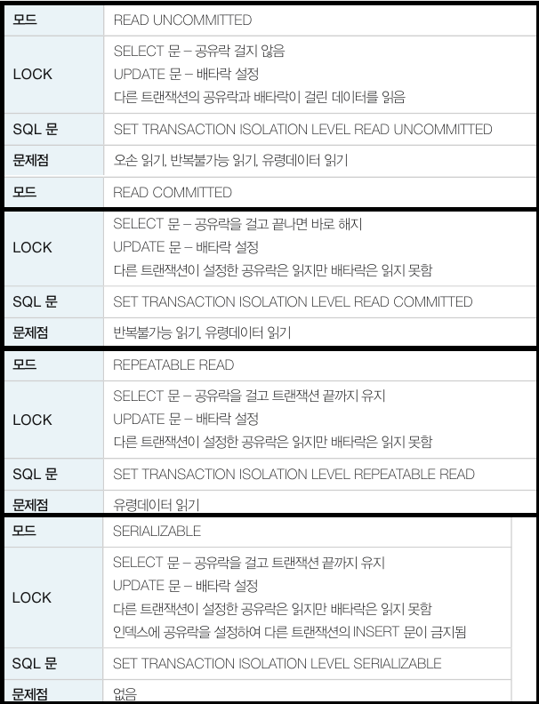

# 회복

​	회복(recovery) 은 데이터베이스에 장애가 발생했을 때 데이터베이스를 일관성 있는상태로 되돌리는 DBMS 기능입니다. 발생할 수 있는 장애 유형은 아래와 같습니다.

- **시스템 충돌** : 하드웨어 혹은 소프트웨어의 오류로 주기억장치가 손실되는 것을 말합니다. 처리 중인 프로그램과 데이터 일부 혹은 전부가 손실됩니다.
- **미디어 장애** : 헤드 충돌이나 읽기 장애로 보조기억장치가 손실되는 것을 말합니다. 보조기억장치에 저장 중인 데이터 일부 혹은 전부가 손실됩니다.
- **응용 소프트웨어 오류** : 소프트웨어의 논리적인 오류로 트랙잭션의 수행이 실패하는 것을 말합니다.
- **부주의 혹은 태업(sabotage)** : 운영자나 사용자의 부주의로 데이터가 손실되거나 의도적인 손상을 입는 것을 말합니다.

위 유형 중 회복에 중점을 두는 유형은 시스템 충돌, 미디어 장애, 응용 소프트웨어 오류입니다. 이러한 장애는 <u>주기억장치가 손실되거나 하드디스크가 손실되는 두 가지 결과를 일으킵니다.</u>

## 트랜잭션과 회복

​	트랜잭션은 데이터베이스 회복의 단위입니다. 트랜잭션은 데이터 변경 내용(버퍼) 을 로그(임시 디스크) 에 기록한 후 데이터베이스에 반영합니다. 

​	**DBMS 의 회복 관리자(recovery manager) 는 트랜잭션 ACID 성질 중 원자성과 지속성을 보장하여 장애로부터 데이터베이스를 보호합니다.** 장애가 발생하면 로그의 내용을 참조해 트랜잭션의 변경 내용을 모두 반영하거나 아니면 아예 반영하지 않는 방법으로 원자성을 보장합니다. 지속성도 마찬가지로, 트랜잭션이 일단 COMMIT 한 내용은 로그를 이용하여 반드시 데이터베이스에 기록합니다.

아래는 트랜잭션의 수행과정을 상태도와 함께 나타낸 그림입니다.

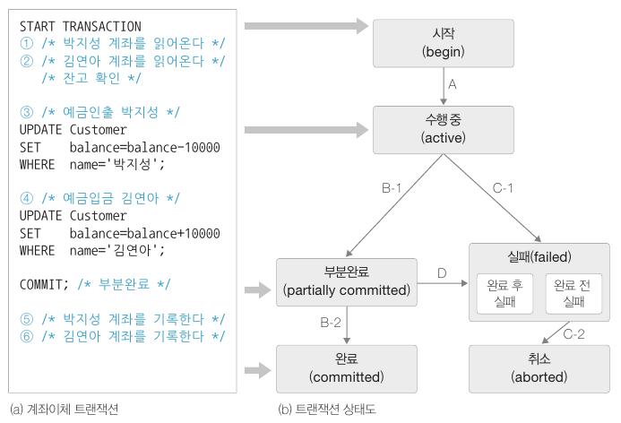

- 트랜잭션이 시작(A) 하면 수행 상태가 됩니다.
- 정상적으로 수행(B-1) 되면 COMMIT 문을 만나 부분완료됩니다.
- 부분완료 후 버퍼의 내용을 데이터베이스에 기록하면(B-2) 트랜잭션이 최종완료됩니다.
- 만약 수행 중 문제가 생겨(C-1) 완료 전에 실패하면 취소(abort) 과정을 거쳐(C-2) 이제까지 작업을 롤백합니다. <u>변경된 데이터 중 혹시 데이터베이스에 이미 기록된 데이터가 있으면 로그를 이용해 되돌립니다.</u>
- 부분완료를 했으나 실패가 된 경우라면(D), 취소과정을 거쳐(C-2) 이제까지 진행한 작업을 거꾸로 돌려놓습니다. <u>부분완료 후 실패하는 경우는 컴퓨터 시스템 장애, 트랜잭션 오류, 데드락 등 여러 원인이 있을 수 있습니다.</u>

## 로그 파일

​	DBMS 는 트랜잭션 수행 시 데이터베이스 손실을 방지하기 위해 데이터베이스 기록을 추적하는 로그 파일을 사용합니다. <u>로그 파일은 트랜잭션이 반영한 모든 데이터 변경사항을 데이터베이스에 기록하기 전에 미리 기록하는 별도의 데이터베이스입니다.</u> 

​	로그 파일 구조는 다음과 같습니다.

<트랜잭션번호, 로그 타입, 데이터 항목 이름, 수정 전 값, 수정 후 값>

아래는 로그 파일 예시입니다.

```
<T1, START>
<T1, UPDATE, Customer (박지성).balance, 100000, 90000>
<T1, UPDATE, Customer (김연아).balance, 100000, 110000>
<T1, COMMIT>
```

아래 트랜잭션 수행 과정을 보겠습니다.

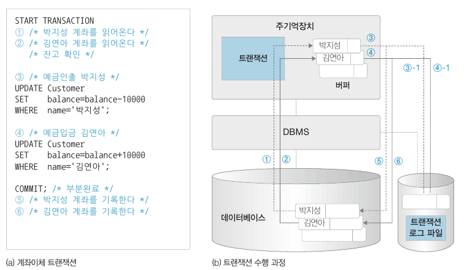

​	트랜잭션은 '시작-수행-부분완료-완료' 상태를 거치는데 수행 중에 변경된 데이터는 주기억장치의 버퍼에 기록됩니다. 그리고 **데이터의 변경이 일어날 때마다 변경 내용은 로그 파일에 저장됩니다.** 

​	부분완료에 도달하면 변경된 데이터는 모두 로그 파일에 기록되어있습니다. 만약 5, 6 번 과정에서 시스템이 정지된다하더라도 시스템은 로그 파일을 참조하여 데이터베이스에 반영할 수 있습니다.

## 로그 파일을 이용한 회복

​	로그 파일을 통한 회복 예시를 보겠습니다. 아래는 T1, T2 트랜잭션이 실행되는 예시입니다. SELECT, UPDATE 는 `read_item()`, `write_item()` 으로 대체됩니다.

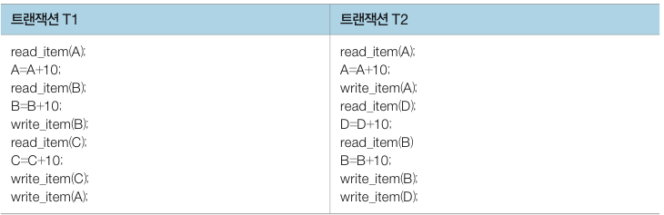

​	트랜잭션이 T1 -> T2 순으로 실행된다면 아래와 같은 로그 파일이 생성됩니다.

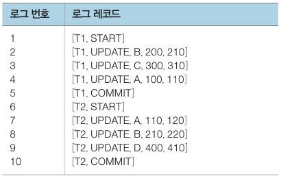

만약 시스템 운영 중 장애가 발생한다면 DBMS 는 로그 파일을 먼저 살펴봅니다. 그리고 **트랜잭션이 종료되었는지 혹은 중단되었는지 여부를 판단하여 재실행(REDO) 또는 취소(UNDO) 를 진행**합니다. 해당 작업을 통해 모든 로그 값에 대하여 (변경 전 값, 변경 후 값) 중 어느 하나를 데이터베이스에 맞는 값으로 수정합니다.

### 트랜잭션의 재실행(REDO)

​	장애가 발생한 후 시스템을 재가동했을 때 **로그 파일에 트랜잭션의 시작(START) 과 종료(COMMIT) 가 있는 경우**입니다. 트랜잭션이 모두 완료되었다는 뜻이지만 변경 내용이 버퍼에서 데이터베이스에 기록되지 않았을 가능성이 있습니다. 따라서 로그를 보면서 트랜잭션이 변경한 내용은 데이터베이스에 다시 기록합니다.

### 트랜잭션의 취소(UNDO)

​	장애가 발생한 후 시스템을 재가동했을 때 **로그 파일에 트랜잭션의 시작(START) 만 있고 종료(COMMIT) 가 없는 경우**입니다. 트랜잭션이 완료되지 못했다는 의미로, 트랜잭션이 한 일을 모두 취소해야 합니다. 이 <u>경우 완료는 못했지만 버퍼의 변경 내용이 데이터베이스에 기록되어 있을 가능성이 있기 때문에 로그를 보면서 트랜잭션이 변경한 내용을 데이터베이스에서 원상복구시켜줘야 합니다.</u> 이 과정을 **UNDO** 라고 합니다.

​	T1, T2 로그 파일을 다시 보겠습니다. 예를 들어 로그에 7번 작업까지 남아있을 경우 T1 은 REDO 작업을 하고 T2 는UNDO 작업을 합니다.

​	지금까지 설명한 방법은 부분완료 전에라도 트랜잭션이 변경한 내용 일부가 데이터베이스에 기록될 수 있음을 가정한 방법입니다. 이를 **즉시갱신**이라고 합니다. 반대로 반드시 부분완료된 후 변경 내용을 기록하는 방법을 **지연갱신**이라고 합니다.

### 즉시갱신

​	즉시갱신(immediate update) 에서는 '버퍼 -> 로그파일', '버퍼 -> 데이터베이스' 작업이 부분완료 전에 동시에 진행될 수 있습니다.

​	T1, T2 로그 파일을 아래와 같이 적용할 수 있습니다.

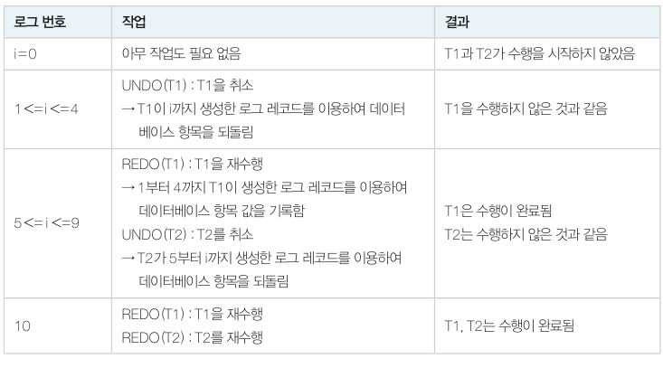

### 지연갱신

​	지연갱신(deferred update) 에서는 '버퍼 -> 로그파일' 이 모두 끝난 후 부분완료를 하고 이후 '버퍼 -> 데이터베이스' 작업을 진행하는 방법입니다. 부분완료 전에는 갱신 내용이 실제 데이터베이스에 반영되지 않습니다.

​	따라서 트랜잭션이 부분완료되지 않은 채 장애가 발생했다면 데이터베이스에 실제 반영된 내용이 없으므로 UNDO 과정을 거칠 필요가 없어집니다.

​	T1, T2 로그 파일을 아래와 같이 적용할 수 있습니다.

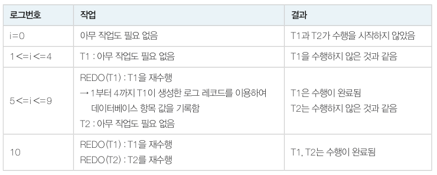

## 체크포인트를 이용한 회복

​	로그를 이용한 회복은 시스템 장애 시 어느 시점까지 되돌아가야 하는지 알 수 없습니다. 따라서 회복 시 많은 양의 로그를 검색하고 갱신하는 시간을 줄이기 위해 몇 십 분 단위로 데이터베이스와 트랜잭션 로그 파일을 동기화한 후 동기화 시점을 로그 파일에 기록해두는 방법 혹은 그 시점을 **체크포인트**라고 합니다.

​	체크포인트 시점에는 다음과 같은 작업을 진행합니다.

- 주기억장치의 로그 레코드를 모두 하드디스크 로그 파일에 저장합니다.
- 버퍼에 있는 변경 내용을 하드디스크의 데이터베이스에 저장합니다. (즉시 갱신의 경우)
- 체크포인트를 로그 파일에 표시합니다.

아래 그림을 보면서 예시를 살펴보겠습니다.

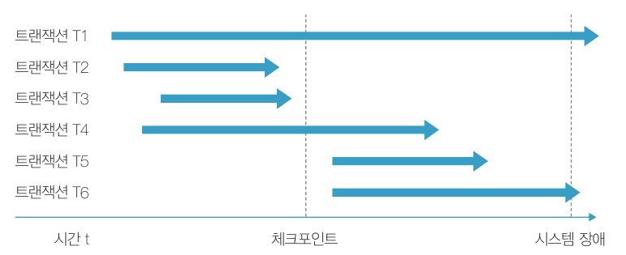

### 체크포인트 이전에 COMMIT 기록이 있는 트랜잭션

​	해당 트랜잭션은 이미 변경 내용이 체크포인트에 의하여 데이터베이스에 모두 기록된 후이기 때문에 아무 작업이 필요없습니다. (T2, T3)

### 체크포인트 이후에 COMMIT 기록이 있는 트랜잭션

​	REDO 를 진행합니다. (T4, T5)

### 체크포인트 이후 COMMIT 기록이 없는 트랜잭션

​	즉시갱신 방법을 사용했다면 UNDO 를 진행하고, 지연갱신 방법을 사용했다면 아무것도 할 필요가 없습니다. (T1, T6)

### 로그 기록을 사용한 예시

위 표와 다른 예시입니다. 트랜잭션 T1, T2, T3 가 동시에 실행된 후 장애가 발생했다고 해보겠습니다.

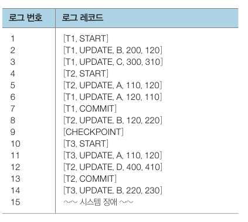

CHECKPOINT 이후의 기록만 보면 되기 때문에 REDO(T2), UNDO(T3) 만 진행하면 됩니다. 만약 CHECKPOINT 가 없었다면 모든 기록을 살펴봐야겠죠.
