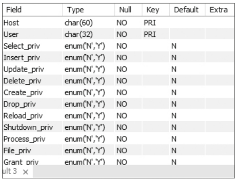
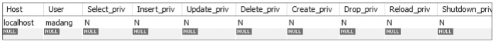
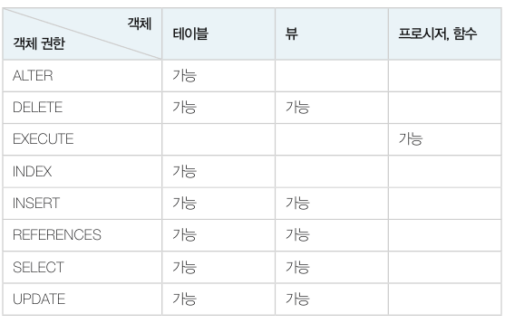

# 데이터베이스 관리의 개요

​	데이터베이스의 관리 업무는 서비스 관리, 점검 및 모니터링, 장애 대처, 백업과 복원, 사용자 관리 및 권한 관리, 시스템 데이터베이스 관리, 사용자 데이터베이스 관리, 데이터베이스 저장공간 관리, 인덱스 관리 등이 있습니다.

## 데이터베이스 관리 기본 명령어

​	데이터베이스를 관리하는 몇 가지 기본 명령어를 보겠습니다.

### 데이터베이스 현황 보기

```mysql
SHOW DATABASES;
```

​	DB 에 있는 데이터베이스가 어떤 것이 있는지 보여줍니다. 

### 데이터베이스 테이블 보기

```mysql
USE mysql;
SHOW TABLES;
```

​	 mysql DB 에 들어가서 해당 DB 의 테이블을 보여줍니다.

### 테이블 구조 보기

```mysql
DESC User;
```

User 테이블의 구조를 살펴봅니다.



# 보안과 권한

​	일반적으로 DBMS 는 로그인 단계에서 **DBMS 접근을 제한하는 로그인 사용자 관리**와 **DB 및 테이블 사용을 제한하는 권한 관리** 기능을 제공합니다.


## 로그인 사용자 관리

​	로그인 사용자를 생성하고 삭제하는 방법을 알아보겠습니다.

### 사용자 생성

```mysql
CREATE USER [사용자이름] IDENTIFIED BY [비밀번호];
```

​	해당 명령어는 관리자(root) 계정에서 사용할 수 있습니다. MYSQL 은 사용자 생서 시 사용자 이름과 접속가능한 호스트 이름을 같이 표시합니다. 따라서 사용자 이름은 'user@hostname' 과 같은 모양입니다. 사용자 이름이 같아도 접속 호스트 이름이 다르면 다른 계정입니다. 

​	외부에서 접속 가능한 사용자는 아래와 같이 생성합니다.

```mysql
CREATE USER madang@ '%' IDENTIFIED BY 'madang';
```

​	특정 사이트 'happy.md.kr' 에서 접속 가능한 사용자 계정은 아래와 같이 생성합니다.

```mysql
CREATE USER madang@ '%.happy.md.kr' IDENTIFIED BY 'madang';
```

User 테이블을 조회하여 사용자가 생성되었는지 확인할 수 있습니다.

```mysql
SELECT * FROM mysql.User WHERE User LIKE 'madang';
```



### 사용자 삭제

사용자 계정은 DROP 으로 삭제합니다.

```mysql
DROP USER [사용자이름];
```

mdguest@localhost 사용자를 삭제하려면 다음과 같이 합니다.

```mysql
DROP USER mdguest@localhost;
```

## 권한 관리

​	MySQL 에서 사용자가 접속하면 세션이 생성되어 명령을 처리합니다. 새로운 사용자는 권한이 없기 때문에 데이터베이스에 접속할 수 없습니다.

​	사용 권한을 관리하기 위한 명령어를 DCL(Data Control Language) 이라고 합니다. 대표적인 DCL 문에는 권한 허가를 위한 GRANT 문과 권한 취소를 위한 REVOKE 문이 있습니다.

### 권한 허가 - GRANT

```mysql
GRANT 권한 [(컬럼리스트)]
	[ON 객체] TO {사용자:롤}
	[WITH GRANT OPTION]
```

- 권한 : 허가할 권한을 지정합니다. 객체 타입별로 지정 가능한 권한은 아래 표와 같습니다.

  

- 컬럼리스트 : 사용 권한을 부여할 테이블의 열 이름들을 지정합니다.

- 객체 : 사용권한을 부여할 객체를 지정합니다. 테이블이나 뷰 등이 올 수 있습니다.

- TO 사용자 : 권한을 부여할 사용자를 지정합니다. 또한 권한 묶음인 롤에 권한을 추가할 수도 있습니다.

- WITH GRANT OPTION : 허가받은 권한을 다른 사용자에게 다시 부여할 수 있습니다.

:white_check_mark: 질의 : "madang 사용자에게 데이터베이스 생성(CREATE) 및 테이블 생성에 관한 모든 권한을 GRANT OPTION 과 함께 부여하시오."

```mysql
GRANT ALL PRIVILEGES ON *.* TO madang@localhost WITH GRANT OPTION;
```

​	이제 madang 계정으로 Book 테이블을 만들고 mdguest 가 해당 테이블에 접근할 수 있는 권한을 부여해보겠습니다. Book 테이블을 만든 madang 계정에서 해당 권한을 부여할 수 있습니다.

```mysql
GRANT SELECT ON madang.Book TO mdguest@localhost;
```

​	이제 mdguest 는 다음 질의를 수행할 수 있습니다.

```mysql
Use madang;
SELEcT * FROM Book;
```

:white_check_mark: 질의 : "mdguest 에게 Customer 테이블의  SELECT, UPDATE 권한을 WITH GRANT OPTION 과 함께 부여하시오."

```mysql
GRANT SELECT, UPDATE ON madang.Customer TO mdguest@localhost WITH GRANT OPTION;
```

이제 mdguest 는 해당 테이블의 SELECT, UPDATE 가 가능할 뿐만 아니라 다른 사용자에게 권한을 재부여할 수도 있습니다.

### 권한 취소 - REVOKE

```mysql
REVOKE 권한 [컬럼리스트]
	[ON 객체] FROM {사용자:롤}
```

GRANT 문과 비슷합니다. 다른 점은 GRANT 문은 TO 를 사용했다면 여기에서는 FROM 을 사용합니다.

:white_check_mark: 질의 : "mdguest 에게 부여된 Customer 테이블의 SELECT 권한을 취소하시오."

```mysql
REVOKE SELECT ON madang.Customer FROM mdguest@localhost;
```

만약 mdguest 가 mdguest2 에게 Customer 에 대한 권한을 재부여했다면 해당 권한도 연쇄적으로 같이 제거됩니다. <u>하지만 MySQL 에서는 재부여한 권한은 회수되지 않습니다.</u>

# 백업과 복원

​	**백업**은 장애에 대비하여 데이터베이스를 복제하여 보관하는 작업을 말하며 **복원**(recovery) 은 장애가 발생하여 데이터 손상 시 기존에 복사해 둔 백업 파일을 사용하여 원래대로 되돌려 놓는 작업을 말합니다.

## 백업의 종류

​	백업은 일반적으로 전체 백업, 차등 백업, 증분 백업으로 나눌 수 있습니다. 

### 전체 백업 

​	데이터베이스 개체, 시스템 테이블, 데이터 등 데이터베이스 전체를 백업하는 것입니다. 백업 시점의 데이터 베이스 복사본을 만들어둡니다. 여러 번하면 각 백업 파일에 데이터가 중복 저장됩니다. 또한 데이터 양이 많을 경우 백업을 수행할 때마다 많은 시간이 소요됩니다.

### 차등 백업

​	차등 백업은 전체 백업을 수행한 이후 변경된 데이터만 저장합니다. 전체 백업으로 데이터베이스의 복사본을 만든 후 그 복사본과 차이가 있는 변경 부분만 백업하는 방법입니다.

### 증분 백업

​	데이터베이스에서 수행한 작업을 기록하고 있는 트랜잭션 로그 파일을 저장하는 방법입니다. 최초에 전체 백업을 수행한 후 로그 백업을 수행합니다. 로그 백업은 빠르게 수행할 수 있으나 복구 시 많은 시간이 소요됩니다. 따라서 대량의 데이터 작업이 발생한 경우에는 가급적 사용하지 말아야 합니다.

## 데이터베이스 백업 방법

​	MySQL 의 경우 백업 방법을 물리적 백업(Physical Backup) 과 논리적 백업(Logical Backup) 으로 나눌 수 있습니다. 각 방법별로 운영하는 환경에 맞게 전체 백업, 차등 백업, 증분 백업 등의 방법을 적용하면 됩니다.

### 물리적 백업

​	물리적 백업은 필요한 모든 파일을 물리적으로 복사하는 방법입니다. 실제 DBMS 의 운영 파일 및 데이터 파일을 보관하는 방식이므로 DMBS 버전이나 운영체제 버전이 달라지면 복구할 수 없을 수도 있습니다. 콜드 백업과 핫 백업으로 나누어집니다.

- 콜드백업 : 데이터베이스를 셧다운한 후 백업을 진행합니다.
- 핫 백업 : 운영 중인 데이터베이스의 파일을 복사합니다. 사용량이 많은 시간대에는 백업을 수행하지 않는 것이 좋습니다.

### 논리적 백업

​	논리적 백업은 실제 데이터베이스를 구성하는 물리적 파일을 직접 복사하는 방법이 아니라 데이터베이스가 가지고 있는 콘텐츠를 별도의 파일로 옮겨 백업하는 방법입니다. MySQL 에서 제공하는 유틸리티인 mysqldump 를 통해 수행합니다. 논리적 백업은 데이터를 일종의 스크립터 형태로 백업하므로 버전 및 운영체제가 달라도 백업된 자료를 기준으로 좀 더 유연하게 복구할 수 있습니다. 백업 도중 데이터가 변경될 경우 백업 시작 지점과 종료 시점의 데이터 불일치 문제가 발생할 수 있습니다.

