# Docker

도커(Docker)는 애플리케이션을 컨테이너 기술을 이용해 빠르게 배포하고 실행할 수 있도록 도와주는 오픈소스 플랫폼입니다. 도커 컨테이너(Docker Container)는 도커 이미지를 바탕으로 생성된 가볍고 독립적인 실행 단위입니다. 도커 컨테이너는 호스트 OS와 다른 컨테이너와 격리되어 있으며, 필요에 따라 자원을 할당받아 실행됩니다. 이렇게 생성된 도커 컨테이너는 마치 가상머신처럼 동작하지만, 오버헤드가 적기 때문에 가볍고 빠르게 실행됩니다.

## 도커 이미지와 컨테이너

### 이미지

​	도커에서 **서비스 운영에 필요한 서버 프로그램, 소스코드 및 라이브러리, 컴파일된 실행파일을 묶는 형태**를 Docker Image 라고 합니다. 즉, 특정 프로세스를 실행하기 위한 모든 파일과 설정값(환경)을 지닌 상태의 파일입니다.

1) 이미지는 상태 값을 가지지 않고 변하지 않습니다. (Immutable)
2) 하나의 이미지는 여러 컨테이너를 생성할 수 있습니다.
3) 도커 이미지들은 DockerHub 를 통해 버전 관리 및 배포가 가능합니다.
4) 다양한 API 가 제공되어 원하는 만큼 자동화가 가능합니다.
5) 도커는 Dockerfile 이라는 파일로 이미지를 만듭니다. Dockerfile 에는 소스와 함께 의존성 패키지 등 사용했던 설정 파일을 버전 관리하기 쉽도록 명시되어집니다. 

### 레이어

​	레이어(Layer) 란 **기존 이미지에 추가적인 추가적인 파일이 필요할 때 다시 다운로드받는 방법이 아닌 해당 파일을 추가하기 위한 개념**입니다. 이미지는 여러 개의 Read-only 레이어로 구성되고 파일이 추가되면 새로운 Layer 가 생성됩니다. 그리고 도커는 여러 개의 레이어를 묶어서 하나의 파일시스템으로 사용할 수 있게 합니다. 그래서 이미지를 공유할 때는 바뀐 부분만 주고받는 게 가능합니다.

### 컨테이너

​	컨터이너(container) 는 이미지를 실행한 상태로, 응용프로그램 종속성과 함께 응용프로그램 자체를 패키징하여 격리된 공간에서 프로세스를 동작시키는 기술입니다.

1. 컨터이너에는 이미지 Layer 에 읽기/쓰기 Layer 를 추가하는 것으로 생성/실행됩니다. 따라서 여러 개의 컨테이너를 생성해도 최소한의 용량만 사용되며, 바뀐 부분을 읽기/쓰기 Layer 에 적습니다.
2. 한 서버 내에서 컨테이너는 각각 독립적으로 실행됩니다.
3. 컨테이너는 커널 공간과 호스트 OS 자원(시스템콜) 을 공유합니다.
4. 컨테이너를 삭제하면 컨테이너에서 생성한 파일을 모두 사라집니다.

# 도커 설정

## 도커 다운로드

도커 다운로드 : https://docs.docker.com/desktop/install/windows-install/

다운로드 후 cmd 에서 `docker --version` 명령어로 설치 여부를 확인합니다.

## 도커 컨테이너 생성

도커 컨테이너는 이미지를 통해 만들 수 있습니다.

`$ docker run -it --name mycontainer -p 8080:8080 openjdk:11`

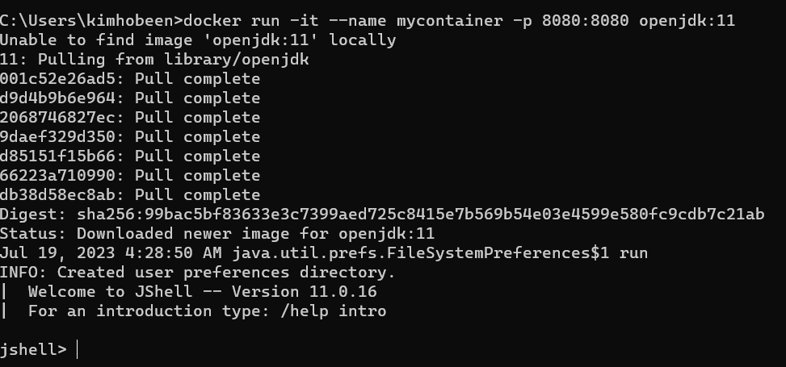

- `docker run` : 도커 컨테이너를 생성하고 실행하는 명령어입니다.
- `-it` : 컨테이너와 상호작용을 위해 표준 입력(stdin)을 연결합니다. **(컨테이너를 대화형 모드로 실행)**
- `--name mycontainer` : 컨테이너의 이름을 "mycontainer" 로 지정합니다. 필요에 따라 다른 이름으로 변경할 수 있습니다. (—name 옵션 미 입력 시 도커에서 랜덤으로 지정)
- `-p 8080:8080` : 호스트의 8080 포트와 컨테이너의 8080 포트를 매핑합니다. 이렇게 하면 호스트의 8080 포트로 들어오는 요청이 컨테이너의 8080 포트로 전달됩니다.
- `openjdk:11` : 이미지를 통해 컨테이너를 만들게 되는데 사용할 베이스 이미지를 지정합니다. (여기서는 OpenJDK 11 이미지를 사용)

<u>`Unable to find image 'openjdk:11' locally` 이 뜨면서 도커 Hub를 통해 해당 이미지를 Pulling 합니다.</u>

`jshell` 에 자바 코드를 입력하고 실행할 수 있습니다.

### 기타 옵션

- `-d` : 컨테이너를 백그라운드에서 실행합니다.
- `-i` : 컨테이너와 상호작용을 위해 표준 입력(stdin)을 연결합니다.
- `-t` : TTY(터미널)을 연결합니다.
- `-p <호스트 포트>:<컨테이너 포트>` : 호스트 포트와 컨테이너 포트를 연결합니다.
- `-P` : 호스트와 컨테이너 포트를 랜덤으로 연결합니다.
- `--name <컨테이너 이름>` : 컨테이너의 이름을 설정합니다.
- `--rm` : 컨테이너가 종료될 때 자동으로 삭제합니다.
- `-v <호스트 경로>:<컨테이너 경로>`: 호스트와 컨테이너의 디렉터리를 연결합니다.
- `-e <환경변수>`: 컨테이너 내부의 환경변수를 설정합니다.
- `--link <다른컨테이너 이름>:<별명>`: 다른 컨테이너와 연결합니다.
- `--network <네트워크 이름>`: 컨테이너가 속한 네트워크를 설정합니다.
- `--expose <포트>`: 컨테이너의 포트를 노출합니다.
- `--entrypoint <명령어>`: 컨테이너가 시작될 때 실행될 명령어를 설정합니다.
- `--user <사용자>`: 컨테이너 내부에서 실행될 사용자를 설정합니다.
- `--restart <정책>`: 컨테이너 재시작 정책을 설정합니다.

### 컨테이너 시작하기

컨테이너를 시작하려면, `docker start` 명령어를 사용합니다. 

`docker start [컨테이너 이름 또는 ID]`

`docker start` 명령어는 도커 컨테이너를 시작하는 데 사용됩니다. 다음과 같은 옵션을 사용할 수 있습니다.

- `-a, --attach` : 컨테이너와 터미널을 연결합니다. 터미널에 연결되어 컨테이너의 출력을 볼 수 있습니다.
- `-i, --interactive` : 컨테이너와 상호작용을 위해 표준 입력(stdin)을 연결합니다.
- `-p, --publish` : 호스트와 컨테이너 포트를 연결합니다.
- `-d, --detach` : 컨테이너를 백그라운드에서 실행합니다.
- `-e, --env` : 컨테이너 내부의 환경변수를 설정합니다.
- `-u, --user` : 컨테이너 내부에서 실행될 사용자를 설정합니다.
- `-a, --attach` : 컨테이너 출력을 표시합니다.

### 컨테이너 중지하기

테이너를 중지하려면, `docker stop` 명령어를 사용합니다. 다음과 같은 형식으로 입력합니다.

`docker stop [컨테이너 이름 또는 ID]`

다음과 같은 옵션을 사용할 수 있습니다.

- `t`, `-time`: 컨테이너가 종료되기까지 대기하는 시간을 지정합니다. 기본값은 10초입니다.
- `-time-format`: 대기 시간의 형식을 지정합니다. 기본값은 "s"입니다.

### 컨테이너 목록 보기

도커 컨테이너 목록을 확인하려면, `docker ps` 명령어를 사용합니다.

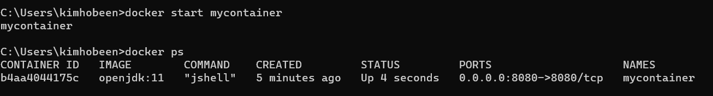

별도의 옵션을 사용하지 않는 ps 명령어는 **가동 중인 컨테이너만** 출력해 줍니다. 옵션은 아래와 같습니다.

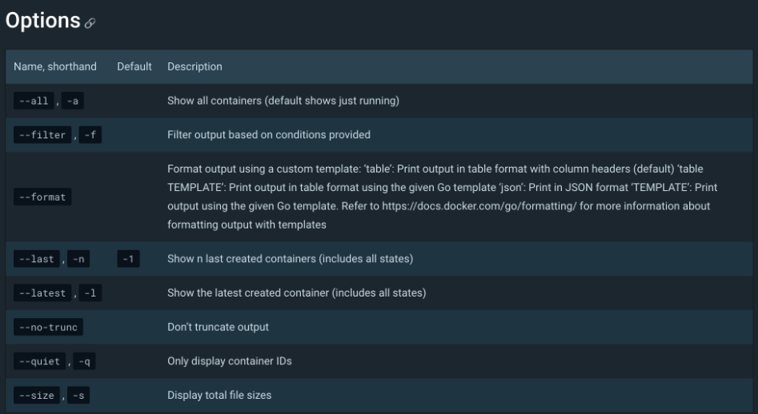

이 중 `--filter` 는 특정 값으로 검색합니다. 예를 들어 이름이 mycontainer 인 이미지를 검색하려면 아래와 같이 사용합니다.

`docker ps -f name=mycontainer` or ``docker ps -f "name=mycontainer"`

중지된 이미지도 보려면 `-a` 옵션을 붙입니다. `docker ps -af name=mycontainer`

필터 키는 아래와 같습니다.

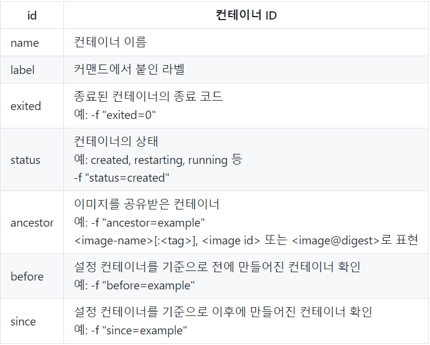

### 컨테이너 삭제하기

컨테이너를 삭제하려면, `docker rm` 명령어를 사용합니다. `docker rm [컨테이너 이름 또는 ID]`

다음과 같은 옵션을 사용할 수 있습니다.

- `-f`, `--force`: 실행 중인 컨테이너를 강제로 삭제합니다.
- `-l`, `--link=false`: 해당 컨테이너를 참조하는 링크를 제거합니다.
- `-v`, `--volumes=false`: 컨테이너와 관련된 볼륨을 제거합니다.
- `-n`, `--name`: 컨테이너의 이름을 지정합니다.
- `-q`, `--quiet`: 컨테이너의 ID만 출력합니다.
- `--help`: 도움말을 출력합니다.

# 도커 저장소

​	도커 저장소는 도커 이미지를 저장하고, 관리하며, 공유할 수 있는 곳입니다. 여러분이 만든 도커 이미지를 저장소에 등록하면, 다른 사람들도 해당 이미지를 다운로드하여 사용할 수 있습니다. 

도커 저장소는 크게 <u>Docker Hub, Private Registry, Public Registry</u> 세 가지로 나뉩니다. 

도커저장소는 dockerHub 의 Repository 탭에서 만듭니다.

`docker push {도커 유저네임}/{이미지 명}:{태그}` 명령어를 통해 이미지를 저장소에 업로드할 수 있습니다.

# 도커 이미지

도커 이미지(Docker Image)는 도커 컨테이너를 생성하기 위한 템플릿입니다. 도커 이미지는 애플리케이션을 실행하는 데 필요한 모든 환경과 라이브러리, 소스 코드 등을 포함하고 있으며, 이를 기반으로 도커 컨테이너가 생성됩니다. <u>도커 이미지는 불변하며, 한 번 생성되면 수정할 수 없습니다.</u>

## 도커 이미지 목록 확인하기

도커 이미지 목록을 확인하려면, `docker images` 명령어를 사용합니다.

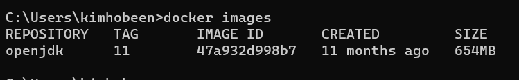

## 도커 이미지 pull 하기

​	도커 이미지를 pull 하기 위해서는 dockerhub 로 접속한 뒤 필요한 도커 이미지를 검색합니다. 그리고 필요한 이미지를 선택하고 pull 명령어를 확인합니다.

​	예를 들어 openjdk 를 검색하면 다음과 같은 결과를 얻습니다.

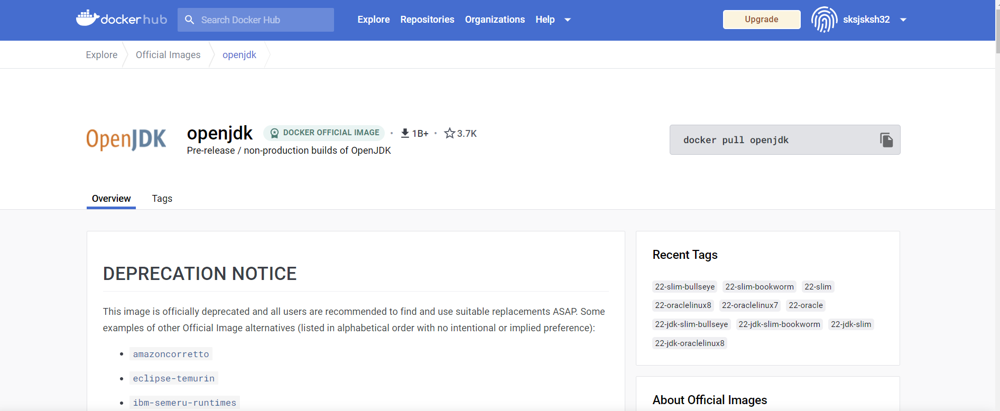

​	pull 명령어는 `docker pull openjdk` 입니다. 터미널 창에 입력하면 신 버전의 공식 openjdk 이미지가 다운로드됩니다.

​	만약 특정 버전의 openjdk 이미지를 사용하려면, `openjdk:버전` 형태로 명령어를 입력합니다. 

​	도커 이미지를 다운로드하는 데 사용하는 `docker pull` 명령어에는 다양한 옵션들이 있습니다. 명령어 뒤에 옵션을 추가하여 원하는 조건에 맞는 이미지를 다운로드할 수 있습니다.

- `-a, --all`: 모든 이미지 목록을 출력합니다. 기본적으로 dangling 이미지를 제외한 이미지만 출력되므로, dangling 이미지를 포함하여 출력하고 싶으면 `-a` 옵션을 사용합니다.
- `--digests`: 이미지의 digest 정보를 출력합니다.
- `--no-trunc`: 모든 컬럼 정보를 출력합니다.
- `-q, --quiet`: 이미지 ID 정보만 출력합니다.
- `--filter`: 출력할 이미지를 필터링합니다. `dangling=true`, `label=<key>`, `before=<image-name>`, `since=<image-name>` 등이 사용 가능합니다.
- `--format`: 출력할 정보의 형식을 지정합니다. Go 템플릿 형식을 사용합니다.

## 도커 이미지 삭제하기

이미지를 삭제하려면, `docker rmi` 명령어를 사용합니다. 다음과 같은 형식으로 입력합니다.

`docker rmi [이미지 이름 또는 ID]`

다음과 같은 옵션을 사용할 수 있습니다.

- `-f`, `--force`: 이미지를 강제로 삭제합니다.
- `--no-prune`: 해당 이미지를 참조하는 다른 이미지나 컨테이너를 삭제하지 않습니다.
- `-q`, `--quiet`: 삭제한 이미지 ID만 출력합니다.
- `--help`: 도움말을 출력합니다.

# 도커 빌드

​	도커 이미지를 생성하는 과정을 도커 빌드라고 합니다. 도커 Hub에 이미지를 올리기 위해서는 **Dockerfile**을 만들어 이미지를 빌드할 수 있습니다.

도커 이미지를 만들기 위해 도커 빌드를 수행하려면 **우선 프로젝트를 빌드**해야 합니다. 그리고 해당 프로젝트의 최상위 경로(root)에 Dockerfile이라는 이름으로 파일을 생성하여 아래 스크립트를 작성합니다.

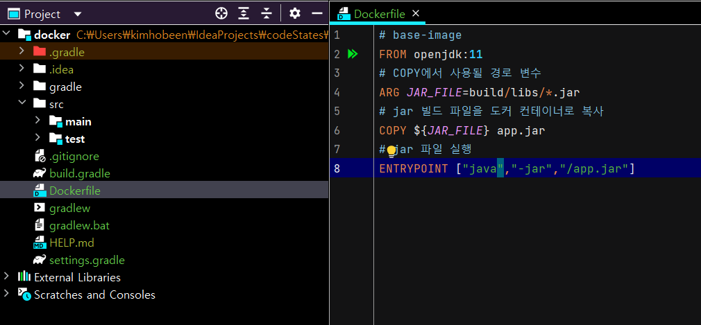

```
# base-image
FROM openjdk:11
# COPY에서 사용될 경로 변수
ARG JAR_FILE=build/libs/*.jar
# jar 빌드 파일을 도커 컨테이너로 복사
COPY ${JAR_FILE} app.jar
# jar 파일 실행
ENTRYPOINT ["java","-jar","/app.jar"]
```

- `FROM`은 베이스 이미지를 설정하는 부분입니다.
- ARG에서 JAR_FILE이라는 변수를 통해 build/libs/*.jar 값을 저장합니다.
  - COPY에서 ${JAR_FILE}을 통해 사용하고 있습니다.
- `ENTRYPOINT`는 컨테이너가 시작될 때 실행될 명령을 설정하는 부분입니다.

Dockerfile 주요 문법은 아래와 같습니다.

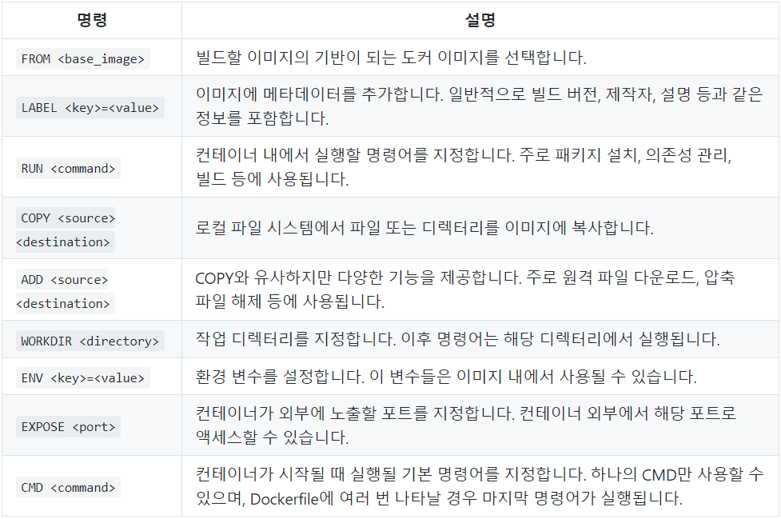

## 도커 빌드

Dockerfile을 작성한 후, 다음 명령어를 이용해 이미지를 빌드할 수 있습니다. IntelliJ 프로젝트에서 터미널을 실행시켜 아래 명령어를 통해 도커 이미지로 빌드합니다.

```
docker build -t username/repository:tag .
```

`username/repository:tag` 는 도커 이미지 저장소(Docker hub)의 아이디와 생성한 저장소명으로 변경해 주어야 합니다. 

# SpringBoot 애플리케이션으로 도커 만들기

먼저 간단한 스프링부트 애플리케이션을 만들고 빌드합니다.

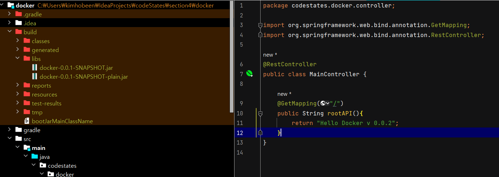

루트 페이지로 접속하면 "Hello Docker v 0.0.2" 를 출력합니다.

> 생성된 JAR 파일을 통해 바로 컨테이너에 배포할 수 있습니다.
>
> docker run -p 8080:8080 -v C:/Users/사용자명/Downloads/docker/build/libs/docker-0.0.1-SNAPSHOT.jar:/app/docker.jar openjdk:11 java -jar /app/docker.jar
>
> -v 옵션을 사용하면 로컬 파일을 통해 컨테이너 쪽으로 디렉터리 또는 파일을 공유할 수 있습니다.
>
> - jar 파일이 있는 로컬 절대 경로 `/Users/사용자명/Downloads/docker/build/libs/docker-0.0.1-SNAPSHOT.jar:/app/docker.jar`를 통해 컨테이너 내부에 /app/docker.jar 파일로 공유하게 됩니다.
>
> openjdk:11 이미지를 사용해 컨테이너 내부에서 java -jar /app/docker.jar 명령어를 실행합니다.

그리고 Dockerfile 에서 설정 정보를 넣습니다.

```
FROM openjdk:11
COPY build/libs/*.jar app.jar
ENTRYPOINT ["java", "-jar", "/app.jar"]
```

Base 이미지는 `openjdk:11` 입니다.

설정 정보를 다 넣었다면 이제 이미지로 빌드합니다.

 `docker build -t myimage:0.0.1 .`

> 해당 이미지를 도커Hub이름/도커Repository이름:tag 로 바꾸는 명령어는 아래와 같습니다. (sksjsksh32/my_first_docker 로 변경)
>
> ```
> docker tag myimage:0.0.1 sksjsksh32/my_first_docker:0.0.2
> ```

이미지를 빌드했다면 이제 도커 허브에 등록합니다.

`docker push sksjsksh32/my_first_docker:0.0.2`

이제 해당 이미지가 제대로 작동하는지 확인해보겠습니다. 먼저 로컬에 있는 컨테이너 및 이미지를 제거합니다.

```
// 컨테이너 확인
docker ps -a

// 컨테이너 제거
docker rm 컨테이너이름

//** 이미지 제거 (위 아래는 같은 명령어)
docker rmi 도커Hub이름/도커Repository이름:tag
docker image rm 도커Hub이름/도커Repository이름:tag
```

이제 다시 도커허브에서 로컬로 가져옵니다.

```
// hub에서 이미지 가져오기
docker pull sksjsksh32/my_first_docker:0.0.2

// 가져온 이미지로 컨테이너 실행
docker run -p 8080:8080 --name mycontainer sksjsksh32/my_first_docker:0.0.2
```

이제 8080 포트를 실행하면 잘 동작하는 걸 볼 수 있습니다.

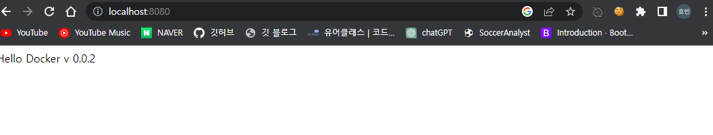

# 기타 명령어

## 도커 컨테이너 내 파일 접근

`docker exec -it {컨테이너_이름} bash` 로 컨테이너 파일로 접근할 수 있습니다. 그러면 root:/usr/local/apache2 로 접근하게 됩니다.

## docker-compose CLI

 두 개 이상의 컨테이너를 Docker Compose를 이용해 한 번에 실행할 수 있습니다. 

먼저 **docker-compose.yaml** 파일을 만듭니다.

```java
version: '3.8'

services:
  nginx:
    image: sebcontents/client
    restart: 'always'
    ports:
      - "8080:80"
    container_name: client

  spring:
    image: 0xnsky/server-spring
    restart: 'always'
    ports:
      - "4999:3000"
    container_name: server-spring
```

각각 image 와 container_name 을 지정합니다. 여기서는 `nginx` 와 `spring` 을 실행합니다. `docker-compose up -d` 으로 실행할 수 있습니다. `-d` 옵션은 백그라운드 실행입니다.

종료는 `docker-compose down` 로 하며 `docker-compose up {특정 이미지}` 를 통해 특정 이미지를 실행할 수 있습니다.

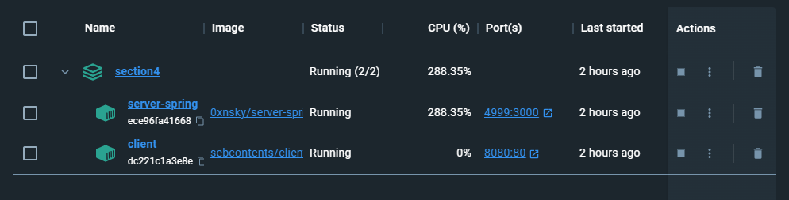

위와 같이 2개가 한번에 실행됩니다.

# Ref.

[도커 컨테이너(Container) 와 이미지(Image) 란?](https://hoon93.tistory.com/48)
