# 쿠버네티스란

​	쿠버네티스(Kubernetes) 란 테이너 오케스트레이션(orchestration) 도구로, 대규모 분산 애플리케이션의 배포, 관리, 확장을 자동화하는 오픈 소스 플랫폼입니다. 쿠버네티스는 컨테이너 기술인 도커(Docker) 와 같은 컨테이너 런타임을 기반으로 동작합니다. 도커는 애플리케이션을 컨테이너로 패키징하여 이식성과 확장성을 갖도록 해주는 기술이며, 쿠버네티스는 이러한 도커 컨테이너를 관리하고 조율하여 클러스터 내에서 효율적으로 운영할 수 있도록 합니다.

## 쿠버네티스 주요 기능

1. 컨테이너 스케줄링
   - 쿠버네티스는 클러스터 내에서 컨테이너를 적절히 분배하고 스케줄링하여 자원을 효율적으로 활용합니다.
   - 노드 간의 부하 분산, 자동 복구 및 확장 기능을 제공합니다.
2. 자동화된 롤링 업데이트
   - 애플리케이션의 업데이트나 패치를 자동으로 배포하고 관리할 수 있습니다.
   - 서비스의 가용성을 유지하면서 사용자에게 중단 없는 업데이트를 제공할 수 있습니다.
3. 스케일 인/아웃
   - 쿠버네티스는 애플리케이션의 수평 스케일링을 지원하여 필요에 따라 자동으로 애플리케이션 인스턴스의 개수를 조정할 수 있습니다.
   - 부하에 따라 자원을 동적으로 조절하여 성능을 향상할 수 있습니다.
4. 서비스 디스커버리와 로드 밸런싱
   - 쿠버네티스는 애플리케이션 인스턴스를 위한 네트워크 서비스 디스커버리와 로드 밸런싱을 제공합니다.
   - 내부와 외부의 트래픽을 적절히 분배하여 안정적인 서비스를 제공할 수 있습니다.
5. 자가 치유와 자동 복구
   - 쿠버네티스는 애플리케이션 및 노드의 상태를 지속적으로 모니터링하고, 장애가 발생하면 자동으로 장애를 탐지하고 복구합니다.
   - 서비스의 가용성과 안정성을 높일 수 있습니다.

##  주요 개념

| 리소스                   | 용도                                                         |
| ------------------------ | ------------------------------------------------------------ |
| 노드(Node)               | **쿠버네티스 클러스터를 구성하는 개별 서버 또는 가상 머신을 나타내는 리소스** <br />노드는 애플리케이션 컨테이너를 실행하고 관리하는데 사용된다. 각 노드는 CPU, 메모리, 스토리지 등의 자원을 가지고 있으며, Pod가 노드 상에서 실행한다. |
| 파드(Pod)                | **쿠버네티스에서 가장 작은 배포 단위**이며, 하나 이상의 컨테이너를 포함한다. 관련 컨테이너를 함께 실행하고 네트워크와 스토리지 리소스를 공유할 수 있다. |
| 레플리카세트(ReplicaSet) | **Pod의 복제본 집합을 정의하는 리소스** <br />레플리카셋은 Pod의 원하는 개수를 지정하고, Pod의 가용성을 보장하며, 스케일링과 롤링 업데이트를 관리한다. 지정된 개수의 Pod가 항상 실행되도록 유지하며, Pod의 실패 또는 삭제된 경우 자동으로 복구한다. |
| 디플로이먼트(Deployment) | **애플리케이션의 버전 관리 및 롤링 업데이트를 지원하는 리소스** <br />Pod를 관리하고, Pod의 수를 자동으로 조정하며, 애플리케이션의 가용성과 확장성을 유지한다. |
| 서비스(Service)          | **여러 Pod에 대한 로드 밸런싱, 서비스 디스커버리 및 네트워크 연결을 제공하는 리소스** <br />애플리케이션에 대한 단일 진입점을 만들어 외부에서 접근할 수 있게 한다. |
| 인그레스(Ingress)        | **외부에서 클러스터 내부로의 HTTP 및 HTTPS 트래픽을 관리하는 리소스** <br />로드 밸런싱, 경로 기반 라우팅, SSL 인증서 관리 등을 제공하여 애플리케이션에 대한 인바운드 트래픽을 제어한다. |
| 컨피그맵(ConfigMap)      | **설정 데이터를 저장하고 Pod에서 사용할 수 있도록 제공하는 리소스** <br />환경 변수, 설정 파일 등을 저장하고 애플리케이션의 동적인 구성 변경을 지원한다. |
| 잡(Job)                  | **잡은 일회성 작업을 실행하는 리소스** <br />특정 작업이 성공적으로 완료될 때까지 Pod를 실행하고 관리한다. 잡은 배치 작업, 데이터 처리, 크론 작업 등 한 번 실행되고 종료되는 작업에 적합하며 작업이 성공적으로 완료될 때까지 Pod를 유지하며, 실패한 경우에도 재시작하여 안정성을 제공한다 . |
| 네임스페이스(Namespace)  | **쿠버네티스 클러스터 내에서 리소스를 그룹화하고 격리하는 논리적인 공간** <br />네임스페이스는 리소스의 이름 충돌을 방지하고, 다른 팀 또는 애플리케이션 간의 리소스를 분리하여 관리할 수 있다. 네임스페이스는 클러스터 관리를 단순화하고 보안 및 리소스 관리를 용이하게 한다. |

# 쿠버네티스 작동 원리

쿠버네티스 아키텍처는 아래와 같습니다.

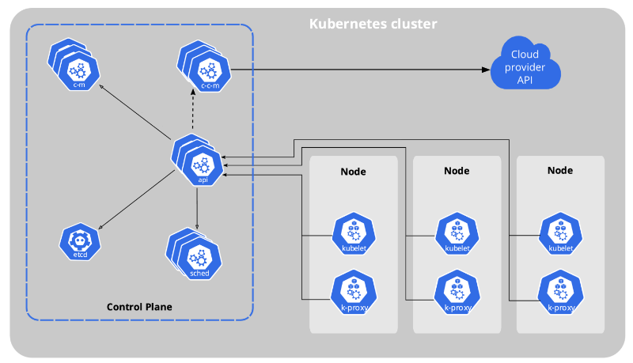

클러스터는 최소 하나 이상의 제어판(Control Plane) 컴포넌트와, 이것과 연결된 몇개의 워커 노드로 구성되어 있습니다.

## 노드

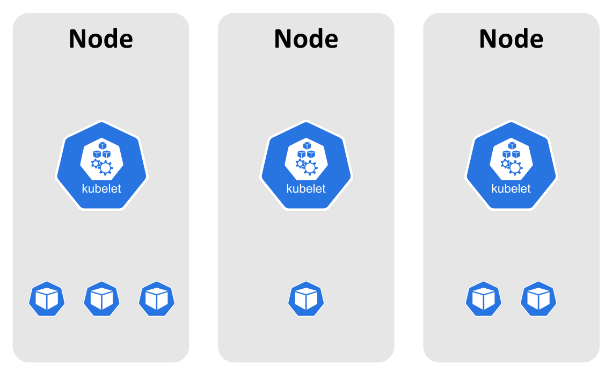

​	워커 노드는 kubelet이라는 프로세스가 돌아가고 있는데, 이 kublet 은 다른 노드와 서로 통신하거나 컨테이너를 실행하는 등의 태스크를 실행할 수 있게 합니다. 그리고 워커 안에는 한개 이상의 컨테이너가 자리잡고 있습니다. 쿠버네티스에서는 이러한 컨테이너(정확히는 컨테이너 그룹)와 컨테이너가 사용하는 볼륨, 그리고 컨테이너의 작동 정보를 특별히 파드(Pod)라는 이름으로 부릅니다.

## API 서버

​	관리를 위해 필요한 프로세스들은 전부 제어판 컴포넌트에 있습니다. 제어판 컴포넌트는 클러스터가 잘 작동할 수 있게 돕습니다.

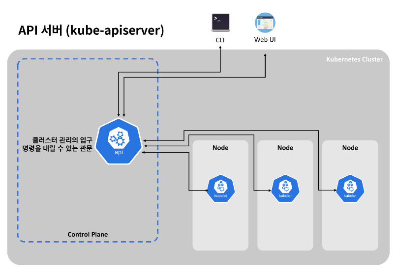

​	API 서버는 모든 클러스터 관리의 입구로서, 명령을 내릴 수 있는 관문입니다. 실제로 쿠버네티스에서 제공되는 UI나 CLI등에서 클러스터 관리를 위해 뭔가 명령을 내리면 API가 호출됩니다. 당연히 직접 호출할 수도 있습니다.

## 컨트롤러 매니저

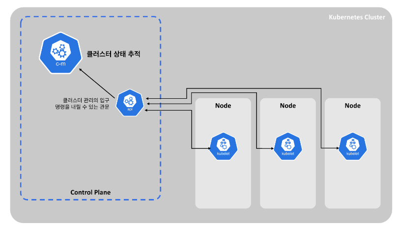

​	컨트롤러 매니저는 클러스터에서 무슨 일이 발생하는지를 추적하는 역할을 합니다. 예를 들어 컨테이너가 죽거나 재시작되었을 경우, 컨트롤러 매니저는 이를 알 수 있습니다.

## 스케줄러

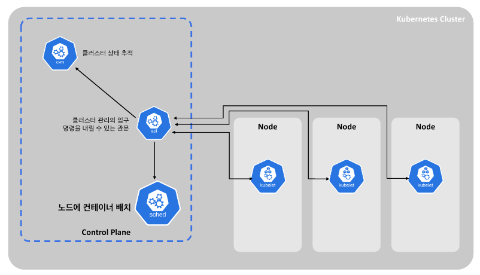

스케쥴러는 서버(노드) 리소스를 바탕으로 컨테이너(정확히는 pod)가 노드에 배치되게 만드는 역할을 담당합니다. 새로 생성된 컨테이너를 찾아 노드에 할당합니다.

## 키-값 저장소 ETCD

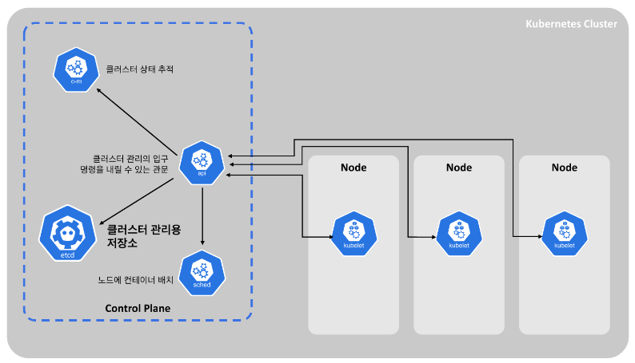

​	ETCD 데이터베이스는 Key-value 저장소로 클러스터 관리에 필요한 모든 데이터를 저장하는 공간입니다. 인프라를 원하는 상태로 만들기 위해서는, 정상 상태에 대한 snapshot 및 관리에 필요한 메타데이터가 어딘가에 저장되어야 하는데, ETCD는 바로 이를 담당합니다.

공식문서 : https://kubernetes.io/ko/docs/concepts/overview/components/

# 쿠버네티스 설치

## minikube 설치

https://minikube.sigs.k8s.io/docs/start/ 해당 사이트에서 운영체제에 맞는 minikube 를 다운로드 받고 실행시킵니다.

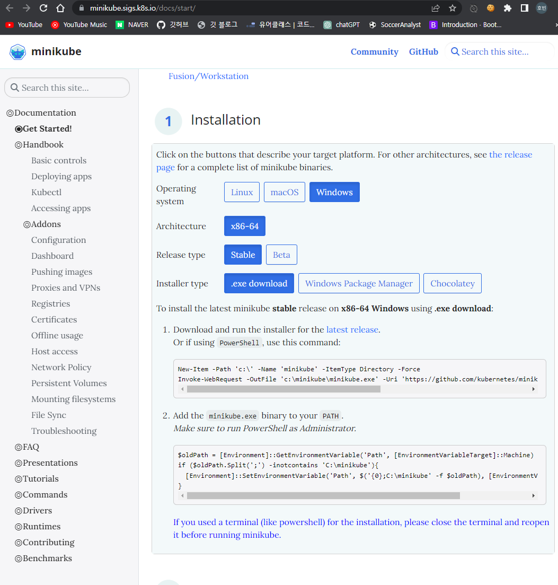

## minikube 실행

도커와 같은 가상화 도구가 실행된 상태에서 cmd 명령창에서 `minikube start` 로 실행할 수 있습니다. 잘 작동되는지 확인하려면 `kubectl get pods -A` 명령을 실행하면 됩니다. 모든 네임스페이스(`-A` 옵션) 존재하는 모든 파드를 조회하는 명령어입니다. 

1. cozserver라는 이미지를 사용해 배포 가능한 리소스(디플로이먼트, deployment)를 생성합니다.

   ```
   kubectl create deployment hello-minikube --image=sebcontents/cozserver:1.0
   ```

2. 서비스(service)로 노출합니다.

   ```
   kubectl expose deployment hello-minikube --type=NodePort --port=8080
   ```

   - 위에서 만든 deployment를 통해 hello-minikube라는 서비스를 8080 포트로 설정해 줍니다.

3. 로컬 클러스터를 호스트 컴퓨터에서 접속할 수 있도록 포트 포워딩을 합니다.

   ```
   kubectl port-forward service/hello-minikube 3333:8080
   ```

 브라우저를 열어 http://localhost:3333 으로 접속하면 아래와 같이 실행됩니다.

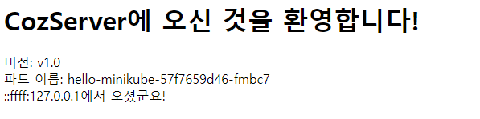

## Pod 제거

`kubectl get pods` 명령어로 전체 Pods 를 조회할 수 있습니다. Pods 를 제거하면 아래와 같이 입력합니다.

```
kubectl delete pod Pod-NAME
```

하지만 단순히 Pods 만 제거한다해서 우리가 원하는 파드가 사라지지 않는 경우들이 존재합니다. **파드를 만들어 주는 replicaset이 있다면 아무리 파드를 제거하더라도 계속 만들어지게 됩니다.** 완전히 제거하기 위해 먼저 replicaset을 만들어 주는 deployment를 수정해야 합니다.

### deployment로 replicaset 수정 방법

```
// 명령어
kubectl edit deployment hello-minikube

// 편집 (spec 내부에 replicas: 1이라고 되어있는 부분을 0으로 변경)
spec:
  progressDeadlineSeconds: 600
  replicas: 0
	...
```

`kubectl edit deployment hello-minikube` 를 실행하면 편집창이 나오는데, replicas 를 0 으로 수정합니다.

혹은 `kubectl delete deployment hello-minikube` 명령어를 통해 deployment 를 삭제할 수도 있습니다.

# 파드 (Pods)

파드(Pod)는 쿠버네티스의 배포 가능한 가장 작은 컴퓨팅 유닛입니다. 파드는 그 자체로 하나의 논리적인 호스트입니다. 파드는 다음을 포함할 수 있습니다. 마치 도커 컨테이너처럼 파드 내에서 다음 요소들은 격리됩니다.

- 하나 이상의 애플리케이션 컨테이너
- IP 주소
- 볼륨과 같은 공유 스토리지

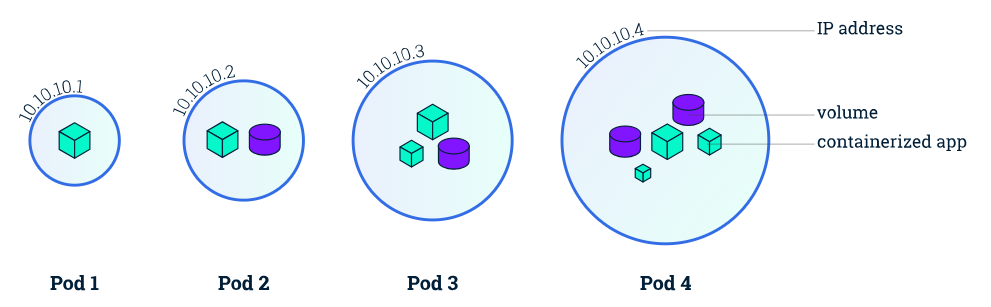

쿠버네티스에서는 “워크로드 리소스”를 만들기 위해 YAML 파일과 같은 리소스 정의 파일을 사용할 수 있습니다. 워크로드란 <u>어떤 애플리케이션을 실행할 때 필요한 IT 리소스의 집합이라는 의미</u>로 통용되며 쿠버네티스에서는 <u>쿠버네티스상에서 작동되는 애플리케이션</u>을 의미합니다.

파드를 생성하기 위해 파드를 정의할 때 다음과 같은 형태의 YAML 파일을 사용할 수 있습니다.

```yml
apiVersion: v1
kind: Pod
metadata:
  name: nginx
spec:
  containers:
  - name: nginx
    image: nginx:1.14.2
    ports:
    - containerPort: 80
```

위 파드 정의 파일을 실제로 만들기 위해서는, 다음 명령을 사용합니다.

`kubectl apply -f simple-pod.yaml`

만들고 난 이후 `kubectl get pods` 를 통해 상태를 확인할 수 있습니다.

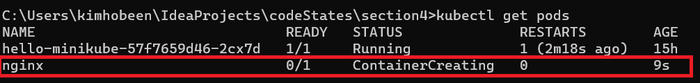

또한 kubectl describe pod [파드이름] 명령어로 pod 의 정보를 확인할 수 있습니다.

## 파드 관리

​	쿠버네티스에서는 사실 직접 사용자가 개별 파드를 만들 일이 그리 많지 않습니다. 왜냐하면 **파드는 일시적이고, 언제나 삭제될 수 있음을 감안하고** 만들기 때문입니다. 쿠버네티스의 핵심은 **컨테이너를 오케스트레이션**하는 것으로, 파드 장애시 자동 복구하거나, 복제하거나 하는 등의 일을 자동으로 처리하는 데에 있습니다. 결론적으로, 파드는 **디플로이먼트, 스테이트풀셋, 데몬셋**을 이용해 관리하는 것이 바람직합니다. 해당 워크로드 리소스는 파드 템플릿을 항상 포함하고 있습니다.

아래는 디플로이먼트의 예시입니다.

```yml
apiVersion: apps/v1
kind: Deployment
metadata:
  name: nginx-deployment
  labels:
    app: nginx
spec:
  replicas: 3
  selector:
    matchLabels:
      app: nginx
  template:
    # 여기서부터 파드 템플릿입니다.
    metadata:
      labels:
        app: nginx
    spec:
      containers:
      - name: nginx
        image: nginx:1.14.2
        ports:
        - containerPort: 80
    # 여기까지 파드 템플릿입니다.
```

## 디플로이먼트

​	디플로이먼트는 파드를 업데이트하기 위한 선언적 명세입니다. 디플로이먼트 리소스를 통해 다음을 할 수 있습니다.

- (레플리카셋, 즉 복제본 구성을 이용하여) 파드를 원하는 개수만큼 실행시킬 수 있습니다.
- (제어판 *Control Plane*을 이용하여) 파드를 업데이트할 수 있습니다.
- 마찬가지로, 파드를 롤백하는 것도 가능합니다.

## 서비스

​	클러스터 안에 파드는 각각 고유의 IP를 가지고 있지만, 직접 우리가 내부망에 접속할 수 있는 것은 아닙니다. 대신 서비스 리소스로 접근할 수 있습니다.

> 서비스 리소스를 사용하면 파드에서 실행 중인 애플리케이션을 클러스터 외부에서 접근할 수 있습니다. 또한 서비스를 사용하여 클러스터 내부에서 사용할 수 있는 서비스만 게시할 수 있습니다. 쿠버네티스에서 서비스는 파드의 집합에 접근할 수 있는 정책을 정의하는 추상적 개념입니다. 서비스 리소스가 정의된 YAML 파일에 selector라는 것을 이용해 서비스할 대상 타겟을 설정할 수 있습니다.

다음은 서비스 리소스 예제입니다.

```yml
apiVersion: v1
kind: Service
metadata:
  name: nginx
  namespace: default
spec:
  selector:
    app: nginx # 배포하려는 파드를 지정합니다. 당연히 파드가 이미 실행 중이어야 합니다.
  type: LoadBalancer
  ports:
  - name: nginx
    protocol: TCP
    port: 80
    targetPort: 80
```

LoadBalancer로 서비스를 만들고, 백엔드에 cozserver라는 이름을 가진 파드 집합에 연결되도록 지정했습니다. 

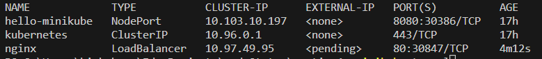

 minikube에서는 EXTERNAL-IP가 pending 상태로 진전이 되지 않습니다.

`minikube tunnel` 명령을 이용하면, EXTERNAL-IP가 `127.0.0.1`로 설정되며, 그때부터 [http://localhost](http://localhost/) 로 접속이 가능해집니다. 접속이 원활하지 않을 경우, tunnel을 중지하고 해당 명령을 다시 시도하면 됩니다.