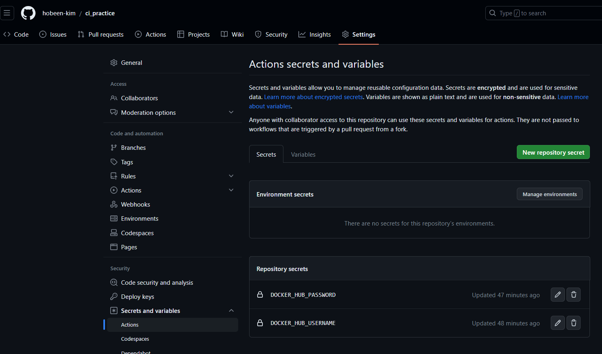
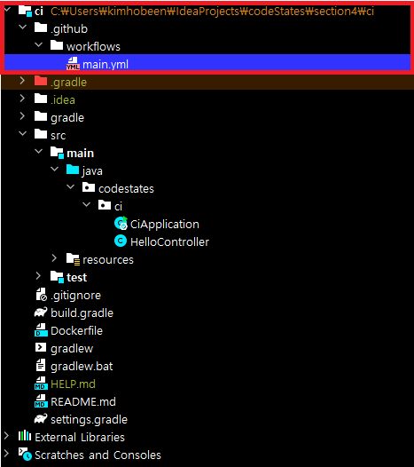
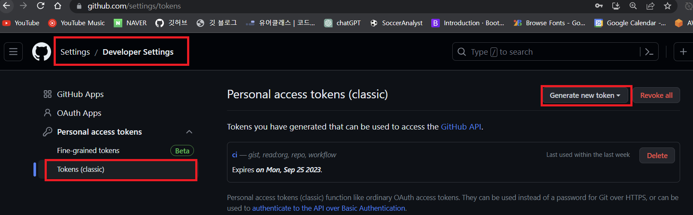
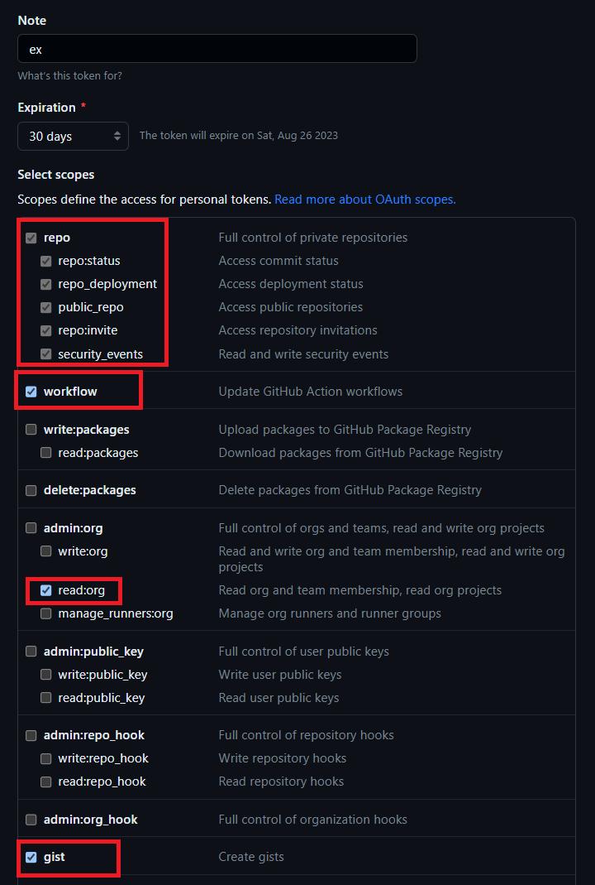
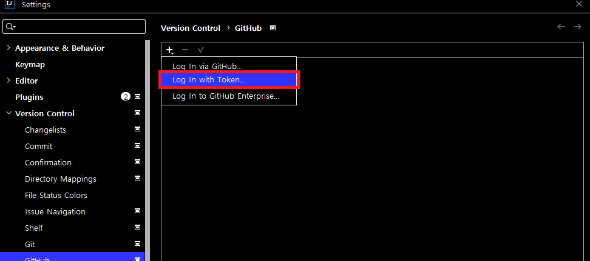
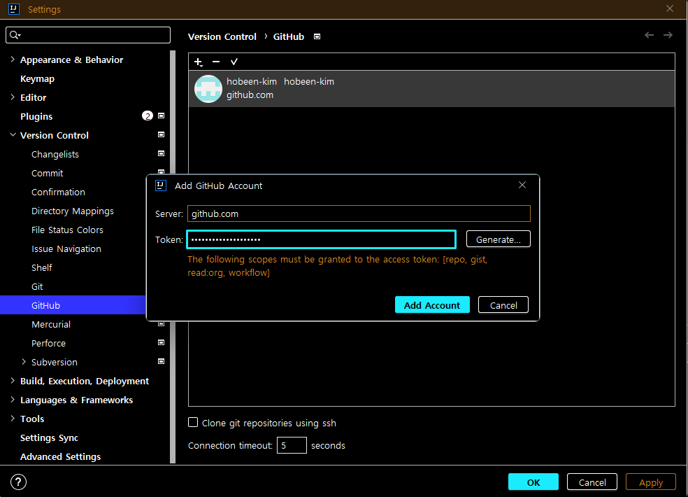
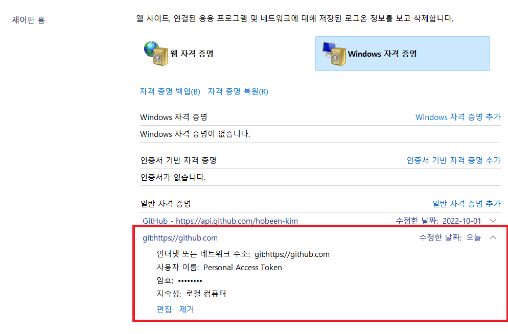
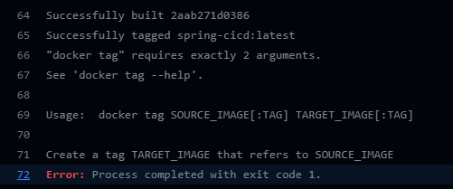
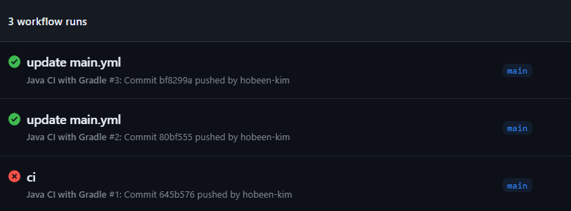

# git action 을 활용한 CI

흐름은 아래와 같습니다.

1. Github 로 push
2. Github Actions 작동
3. 코드 테스트 및 빌드 (`./gradlew build`)
4. Dockerfile 을 통해 도커 이미지 생성 및 업로드

## github 변수 설정

먼저 해당 repository 의 settings 에 들어가면 환경 변수를 넣을 수 있습니다. 도커 이미지를 업로드하기 위해서는 도커 hub 의 ID, PW 가 필요하니 환경변수로 넣어줍니다.



## 프로젝트 설정

프로젝트에서 gradle 수정, Dockerfile 생성, workflow 작성을 해야합니다.

### build.gradle

​	빌드 시 `{file_name}.jar`와 `{file_name}-plain.jar` 두 개의 파일이 생성되는데, 두 개 파일이 생성되면 CI 시 어떤 JAR 파일로 생성할지에 대한 문제가 발생하기 때문에 지속적 통합 작업 도중에 실패가 발생합니다. 따라서 Gradle 설정에서 -plain이 붙은 JAR 파일 생성 기능을 비활성화하여 미리 방지합니다.

```
jar {
    enabled = false
}
```

### Dockerfile 생성

```
# (1) base-image
FROM openjdk:11

# (2) COPY에서 사용될 경로 변수
ARG JAR_FILE=build/libs/*-SNAPSHOT.jar

# (3) jar 빌드 파일을 도커 컨테이너로 복사
COPY ${JAR_FILE} app.jar

# (4) jar 파일 실행
ENTRYPOINT ["java","-jar","/app.jar"]
```

### workflow 생성

파일 구조는 아래와 같습니다. (`.github` > `workflows` > `main.yml`)



```yml
name: Java CI with Gradle

on:
  push:
    branches: [ main ]

jobs:
  build:

    runs-on: ubuntu-latest

    steps:
      - uses: actions/checkout@v2
      - name: Set up JDK 11
        uses: actions/setup-java@v2
        with:
          java-version: '11'
          distribution: 'zulu'
      - name: Grant execute permission for gradlew
        run: chmod +x gradlew
      - name: Build with Gradle
        run: ./gradlew build
      - name: Docker build
        run: |
          docker login -u ${{ secrets.DOCKER_HUB_USERNAME }} -p ${{ secrets.DOCKER_HUB_PASSWORD }}
          docker build -t spring-cicd . 
          docker tag spring-cicd ${{ secrets.DOCKER_HUB_USERNAME }}/spring-cicd:${GITHUB_SHA::7}
          docker push ${{ secrets.DOCKER_HUB_USERNAME }}/spring-cicd:${GITHUB_SHA::7}
```

각 옵션에 대한 설명은 다음과 같습니다.

- `on`: 이벤트를 트리거하는 조건을 지정합니다. 여기서는 `push` 이벤트가 `main` 브랜치에 발생할 때 작업이 실행됩니다.
- `jobs`: 하나 이상의 작업을 정의합니다.
- `build`: 작업의 이름입니다.
- `runs-on`: 작업을 실행하는 머신의 운영체제를 지정합니다.
- `steps`: 작업을 수행하기 위해 실행되는 일련의 단계를 정의합니다. 각 단계는 `name`과 `run`으로 구성됩니다.
- `name`: 작업에 대한 이름을 지정합니다.
- `use`: Github Actions의 마켓플레이스에 등록된 작업을 실행합니다. Github Actions에서 특정 작업을 일종의 라이브러리처럼 마켓플레이스에 등록해 놓을 수 있습니다.
- `run`: 해당 단계가 실행될 때 수행할 명령을 지정합니다.

steps의 하위 `-name`은 하나의 작업이라고 볼 수 있습니다. 각각 Set up JDK, Grant Execute permission for gradlew, Docker build 총 세 개의 작업으로 구성되어 있습니다. 작업은 작성된 순서대로 진행됩니다.

1. Set up JDK
   - 코드를 빌드하기 위해 JDK를 설정하고 점검합니다.
2. Grant Execute permission for gradlew
   - 코드를 gradle로 빌드합니다.
3. Docker build
   - 빌드 완료된 JAR 파일을 run에 기입된 명령대로 수행합니다.
     - Dockerfile을 이용해 도커 이미지로 만든 후 이미지를 DockerHub에 배포(Push)합니다.
   - `DOCKER_HUB_USERNAME`과 `DOCKER_HUB_PASSWORD`는 도커 이미지 저장소에 로그인하기 위해 필요한 계정 정보입니다. Github Secret에 등록한 환경변수를 읽어와 로그인합니다.
   - DockerHub의 본인 계정에 spring-cicd라는 이름의 리포지토리가 없다면 자동으로 생성되어 업로드됩니다.

# 오류해결

위 설정까지 끝났다면 Push 하면 자동으로 build 와 docker 생성까지 완료됩니다. 하지만 하는 도중 2가지 오류가 났습니다.

## workflow 권한 없음

git push 시 아래와 같은 오류가 떴습니다.

```
 ! [remote rejected] main -> main (refusing to allow an OAuth App to create or update workflow ''.github/workflows/main.yml' without 'workflow' scope)
```

아래 포스팅을 통해 해결했습니다. 자세한 내용은 아래에 계속 적었습니다.

- [[How to resolve "refusing to allow an OAuth App to create or update workflow" on git push](https://stackoverflow.com/questions/64059610/how-to-resolve-refusing-to-allow-an-oauth-app-to-create-or-update-workflow-on)](https://stackoverflow.com/questions/64059610/how-to-resolve-refusing-to-allow-an-oauth-app-to-create-or-update-workflow-on)
- [어디서 많이 본 workflow Scope 에러 해결법](https://limm-jk.tistory.com/11)

### token 발급 받기

​	먼저 github 에서 accessToken 을 발급받습니다. 이때 scope 를 설정해야 해서 classic 으로 발급받았습니다. 먼저 아래와 같이 Settings > Developer Settings 로 들어간 다음 `Generate new token` 버튼을 누릅니다. classic 으로 선택합니다.



권한은 `repo`, `gist`, `read:org`, `workflow` 가 필요합니다. 앞에 3개는 접근을 위한거고 `workflow` 는 git actions 를 위해 필요합니다. 아래와 같이 체크하고 만듭니다.



생성하면 accessToken 이 발급됩니다. 이제 해당 accessToken 으로 로그인을 진행하겠습니다.

### intellij 에 token 으로 로그인

intellij 에서 `ctrl` + `alt` + `s` 로 설정으로 접근한 뒤 github 를 검색합니다. 그러면 기존에 로그인된 계정이 있을텐데요. ID, PW 로 로그인한 해당 계정은 삭제하고 `"+"` 버튼을 눌러서 TOKEN 인증으로 로그인을 합니다.






### 제어판에서 자격 증명 관리 수정

여기까지 했을 때 될줄 알았는데요. 그래도 안되는 상황이 발생했습니다. 그래서 본 게 위에 링크걸어놓은 두번째 포스팅입니다.

먼저 `제어판\사용자 계정\자격 증명 관리자` 으로 들어갑니다.



그러면 위와 같이 git 계정이 있습니다. 여기에 자격 증명이 입력이 되기에 push 할 때 마다 일일히 로그인을 안해줘도 되는 것입니다. 근데 intellij 에서 변경해도 여기에는 반영이 느리나? 생각을 했습니다. 지금은 잘 되기에 다음에 또 안되면 다시 알아봐야겠습니다.

일단 ID, PW 로 로그인된 자격 증명은 삭제한 뒤 사용자 이름이 Personal Access Token 인 계정에 편집을 누릅니다. 그리고 Access Token 을 암호로 넣어주면 완료됩니다.

이제 push 하면 이상없이 잘 됩니다.

## Docker 업로드 중 오류

이번에는 git actions 에서 오류입니다.



보면 `Usage:  docker tag SOURCE_IMAGE[:TAG] TARGET_IMAGE[:TAG]` 라고 되어있는데요. 도커 이미지 태그를 변경하면서 오류가 일어난 것 같습니다.

이거는 제 workflow 에서 `main.yml` 의 오류였습니다. 원래 Docker build 단계의 값은 아래와 같았습니다.

```
...
- name: Docker build
        run: |
          docker login -u ${{ secrets.DOCKER_HUB_USERNAME }} -p ${{ secrets.DOCKER_HUB_PASSWORD }}
          docker build -t spring-cicd . 
          docker tag spring-cicd {도커 유저네임}/spring-cicd:${GITHUB_SHA::7}
          docker push {도커 유저네임}/spring-cicd:${GITHUB_SHA::7}
```

보이시나요? 맞습니다. `{도커 유저네임}` 이라는 변수가 있는 게 아닌데 그대로 사용했습니다. (ctrl c, v 의 폐해입니다.) 해당 변수를 원래는 제 도커 username 인 sksjsksh32 로 변경했다가, 생각해보니까 `secrets.DOCKER_HUB_USERNAME` 변수를 만들어놨잖아요. 그대로 사용하기로 했습니다.

```
...
- name: Docker build
        run: |
          docker login -u ${{ secrets.DOCKER_HUB_USERNAME }} -p ${{ secrets.DOCKER_HUB_PASSWORD }}
          docker build -t spring-cicd . 
          docker tag spring-cicd ${{ secrets.DOCKER_HUB_USERNAME }}/spring-cicd:${GITHUB_SHA::7}
          docker push ${{ secrets.DOCKER_HUB_USERNAME }}/spring-cicd:${GITHUB_SHA::7}
```

이렇게 하고 다시 올립니다. 그러면 이상없이 완료됩니다.

