*이전 포스트인 CI 와 연결됩니다.*

# 배포 자동화

배포 자동화는 애플리케이션 배포할 때 일어나는 반복적이고 수동적인 작업을 자동화하는 방식입니다.

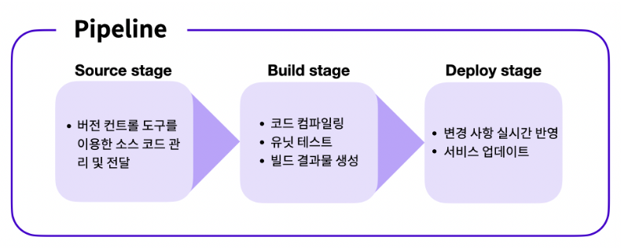

파이프 라인은 아래와 같이 구분됩니다.

1. **Source 단계**: Source 단계에서는 원격 저장소에 관리되고 있는 소스 코드에 변경 사항이 일어날 경우, 이를 감지하고 다음 단계로 전달하는 작업을 수행합니다.
2. **Build 단계**: Build 단계에서는 Source 단계에서 전달받은 코드를 컴파일, 빌드, 테스트하여 가공합니다. 또한 Build 단계를 거쳐 생성된 결과물을 다음 단계로 전달하는 작업을 수행합니다.
3. **Deploy 단계**: Deploy 단계에서는 Build 단계로부터 전달받은 결과물을 실제 서비스에 반영하는 작업을 수행합니다.

## Github Actions를 통한 지속적 배포 실습 흐름

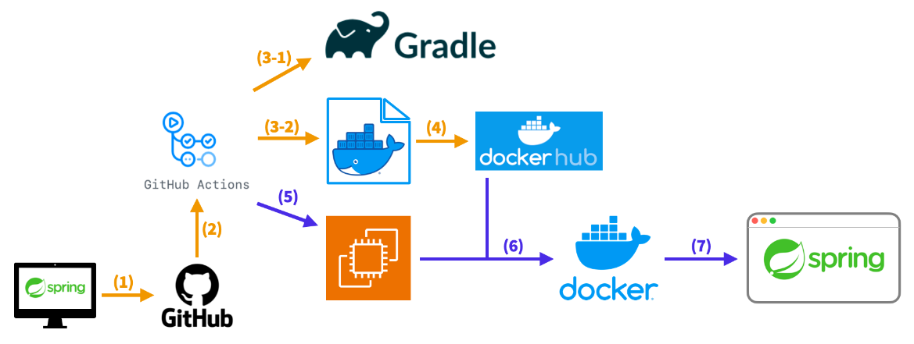

1. 백엔드 개발자의 IDE(e.g. 로컬 환경의 IntelliJ) 에서 코드 작업 후 연결된 Github 저장소로 Commit & Push 합니다.
2. Github Repository에 변화가 감지되면 Github Actions 가 작동합니다.
3. 작성한 Github Actions Workflow의 순서대로 명령이 실행됩니다. 3-1. Github Repository 에 갱신된 코드에 테스트 및 빌드를 진행합니다. (`./gradlew build`를 명령한 것과 같습니다.) 3-2. Repository 에 있는 Dockerfile 을 통해 웹 애플리케이션을 도커 이미지로 만듭니다.
4. Github Actions Workflow 에 의해 (3-2) 에서 생성된 이미지가 DockerHub 에 업로드 됩니다.
5. Github Actions Workflow 에 의해 AWS EC2 에 연결합니다.
   - EC2 인스턴스에 연결하기 위해선 SSH 연결, 세션매니저 연결 등 다양한 연결 방법이 있습니다. EC2를 연결하는 방식에 따라 Github Actions를 이용한 연결도 다양한 방법으로 진행될 수 있습니다.
6. ~ 7. DockerHub 에 올라간 도커 이미지를 EC2 에 Pull 을 받아와 도커를 통해 컨테이너를 8080번 포트를 통해 접근할 수 있도록 실행합니다.

## 배포 자동화 준비

### AWS Access Key 발급

IAM 으로 접속해서 ACCESS KEY 를 발급받습니다. IAM > Security Credentials 에서 발급받을 수 있습니다. 해당 키는 Git Repository 에 변수로 넣습니다.

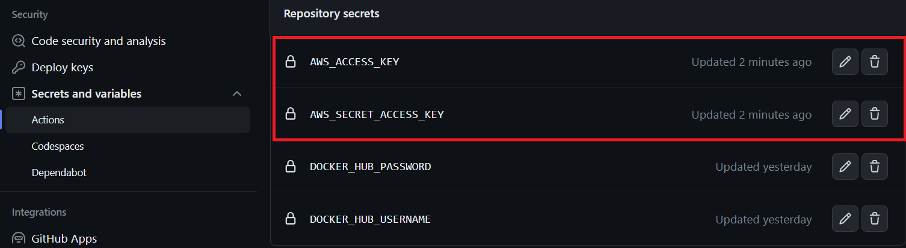

### Github Actions에 배포 자동화를 위한 Workflow 작성

Github Actions의 동작을 정의하는 yml 파일에 지속적 배포를 위한 작업을 추가합니다. 

```yml
name: Java CI with Gradle

on:
  push:
    branches: [ main ]

jobs:
  build:

    runs-on: ubuntu-latest

    steps:
      - uses: actions/checkout@v2
      - name: Set up JDK 11
        uses: actions/setup-java@v2
        with:
          java-version: '11'
          distribution: 'zulu'
      - name: Grant execute permission for gradlew
        run: chmod +x gradlew
      - name: Build with Gradle
        run: ./gradlew build
      - name: Docker build
        run: |
          docker login -u ${{ secrets.DOCKER_HUB_USERNAME }} -p ${{ secrets.DOCKER_HUB_PASSWORD }}
          docker build -t spring-cicd . 
          docker tag spring-cicd ${{ secrets.DOCKER_HUB_USERNAME }}/spring-cicd:${GITHUB_SHA::7}
          docker push ${{ secrets.DOCKER_HUB_USERNAME }}/spring-cicd:${GITHUB_SHA::7}
      #위 내용은 지속적 통합을 위한 스크립트입니다.
      #지속적 통합을 위한 스크립트 아래에 작성합니다.
      - name: Configure AWS credentials
        uses: aws-actions/configure-aws-credentials@v1
        with:
          aws-access-key-id: ${{ secrets.AWS_ACCESS_KEY }}
          aws-secret-access-key: ${{ secrets.AWS_SECRET_ACCESS_KEY }}
          aws-region: ap-northeast-2
      - name: Start Session Manager session
        run: aws ssm start-session --target {인스턴스 id 값}
      - name: Deploy to Server
        env:
          AWS_ACCESS_KEY_ID: ${{ secrets.AWS_ACCESS_KEY }}
          AWS_SECRET_ACCESS_KEY: ${{ secrets.AWS_SECRET_ACCESS_KEY }}
          AWS_REGION: ap-northeast-2
        run: |
          aws ssm send-command \
            --instance-ids {인스턴스 id 값} \
            --document-name "AWS-RunShellScript" \
            --parameters "commands=[
              'if sudo docker ps -a --format \\'{{.Names}}\\' | grep -q \'^server$\\'; then',
              '  sudo docker stop server',
              '  sudo docker rm server',
              'fi',
              'sudo docker pull ${{ secrets.DOCKER_HUB_USERNAME }}/spring-cicd:${GITHUB_SHA::7}',
              'sudo docker tag ${{ secrets.DOCKER_HUB_USERNAME }}/spring-cicd:${GITHUB_SHA::7} spring-cicd',
              'sudo docker run -d --name server -p 8080:8080 spring-cicd'
            ]" \
            --output text
```

1. Configure AWS credentials
   - AWS의 액세스 키와 비밀 액세스 키의 정보를 가지고 AWS에 인증합니다.
2. Start Session Manager session
   - AWS 세션매니저를 이용해 EC2에 연결합니다. `{인스턴스 id 값}` 자리엔 본인 리소스의 인스턴스 id 값을 입력합니다.
   - e.g. ) `aws ssm start-session --target i-03fcf92a9ea84738c`
3. Deploy to Server
   - 직전 단계에서 연결한 특정 EC2 인스턴스의 세션매니저를 통해 실행하고 싶은 명령어를 전송합니다.
   - 도커 허브에 업로드 된 웹 애플리케이션 이미지를 pull 받은 후 server라는 이름의 컨테이너로 실행합니다.
     - 이미 server라는 이름의 컨테이너가 실행중이라면 종료 후 삭제합니다.
     - 지속적 통합 과정에서 도커 허브에 업로드 된 특정 태그 이미지를 EC2 인스턴스에 pull 받습니다.
     - 특정 태그의 이미지를 바탕으로 태그가 없는 spring-cicd 이미지를 생성합니다.
     - spring-cicd 이미지를 server라는 이름의 컨테이너로 8080번 포트를 통해 접근할 수 있도록 실행합니다.

# AWS 으로 CodePipeLine 구축

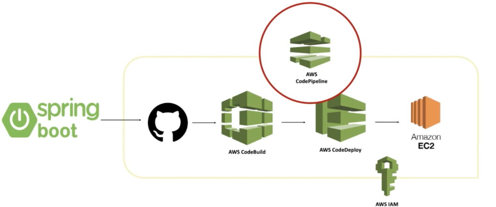

- AWS 개발자 도구 서비스를 이용해서 배포 자동화 파이프라인을 구축합니다.
  - Code Pipeline을 이용해서 각 단계를 연결하는 파이프라인을 구축합니다.
  - Source 단계에서 소스 코드가 저장된 GitHub 리포지토리를 연결합니다.
  - Build 단계에서 Code Build 서비스를 이용하여 EC2 인스턴스로 빌드된 파일을 전달합니다.
  - Deploy 단계에서 Code Deploy 서비스를 이용하여 EC2 인스턴스에 변경 사항을 실시간으로 반영합니다.
- 나중에 변경 사항을 GitHub 리포지토리에 반영했을 경우, 배포 과정이 자동으로 진행되어야 합니다.

## 개발 환경 구축

먼저 EC2 에서 개발환경을 구축하겠습니다.

### AWS CLI 설치

```
$ cd ~
$ curl "https://awscli.amazonaws.com/awscli-exe-linux-x86_64.zip" -o "awscliv2.zip"
$ sudo apt install unzip
$ unzip awscliv2.zip
$ sudo ./aws/install
```

설치가 완료되면 `$ aws --version` 로 AWS CLI의 설치 여부를 확인할 수 있습니다.

### Code Deploy Agent 설치

```
$ cd ~
$ sudo apt update
$ sudo apt install ruby-full                # [Y / n] 선택 시 Y 입력
$ sudo apt install wget
$ cd /home/ubuntu
$ sudo wget https://aws-codedeploy-ap-northeast-2.s3.ap-northeast-2.amazonaws.com/latest/install
$ sudo chmod +x ./install
$ sudo ./install auto > /tmp/logfile
```

위의 마지막 명령어 실행 후 로그 파일 관련 에러가 발생하는 경우엔 관련 로그를 지운 뒤 다시 설치를 진행합니다. 삭제해야할 로그 파일은 아래와 같습니다.

- `/tmp/codedeploy-agent.update.log`
- `/tmp/logfile`

설치가 완료되면 다음 명령어를 이용해 서비스가 실행 중인지 확인합니다.

```
$ sudo service codedeploy-agent status
```

`active(runnung)` 문구를 확인할 수 있으면 정상 설치 후 실행 중입니다.

## EC2 에 S3 권한 부여

### 정책 설정

EC2 IAM ROLE 에서 S3FullAccess 과 AmazonEC2RoleforAWSCodeDeploy, AWSCodeDeployRole 권한을 부여합니다.

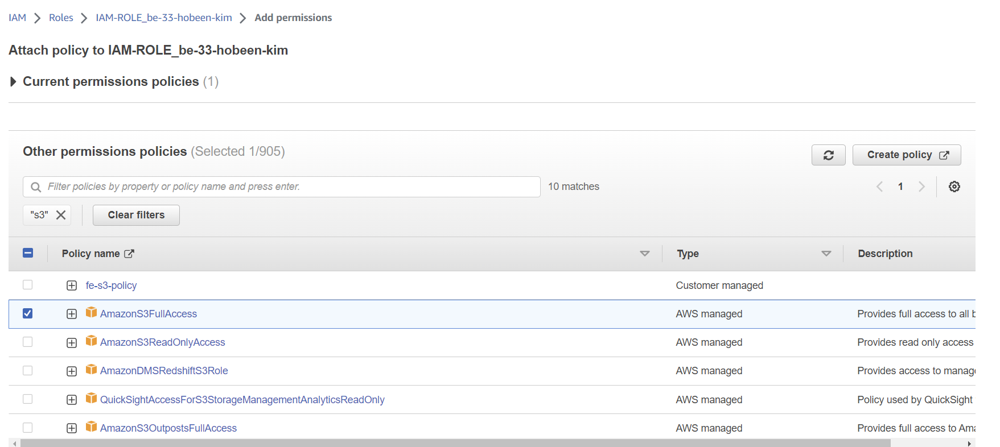

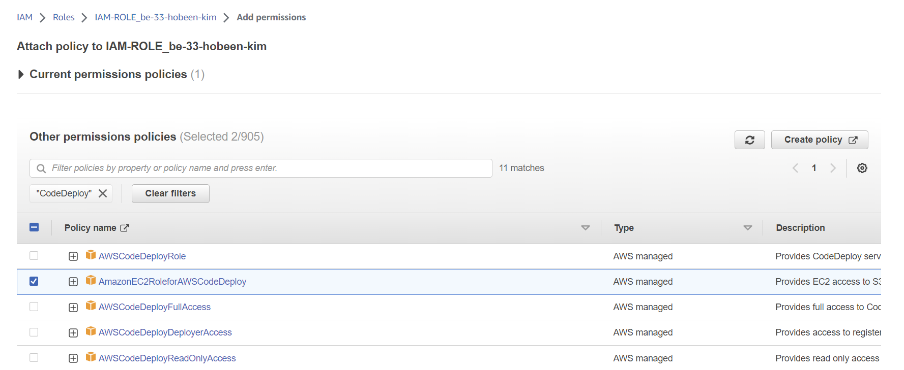

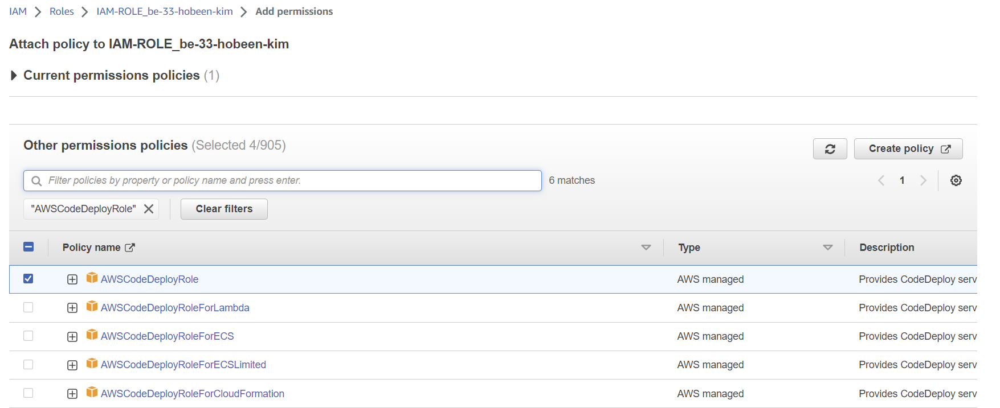

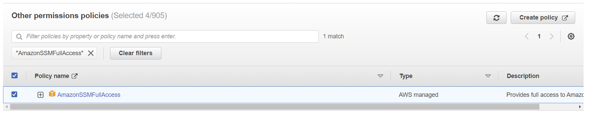

다 지정한 후 정책 연결을 클릭하면 완료됩니다. IAM ROLE 에서 권한을 보면 아래와 같이 되어있습니다.

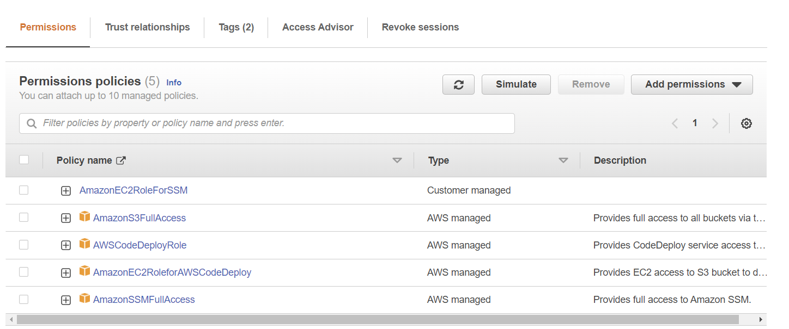

### 신뢰관계 편집

신뢰 관계를 편집합니다. 신뢰 관계란, 해당 역할을 취할 수 있는 서비스나 사용자를 명시하는 부분입니다. 앞서 access 정책 부여를 통해 역할을 생성해주었지만, access 할 수 있는 서비스를 신뢰 관계에서 명시함으로써 역할이 확실히 완성됩니다.

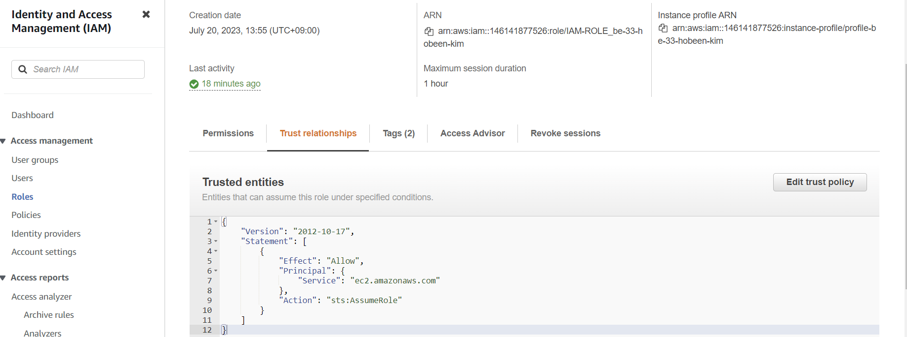

마찬가지로 IAM ROLE 에서 Trust relationships 탭을 클릭하고 Edit trust policy 를 합니다.

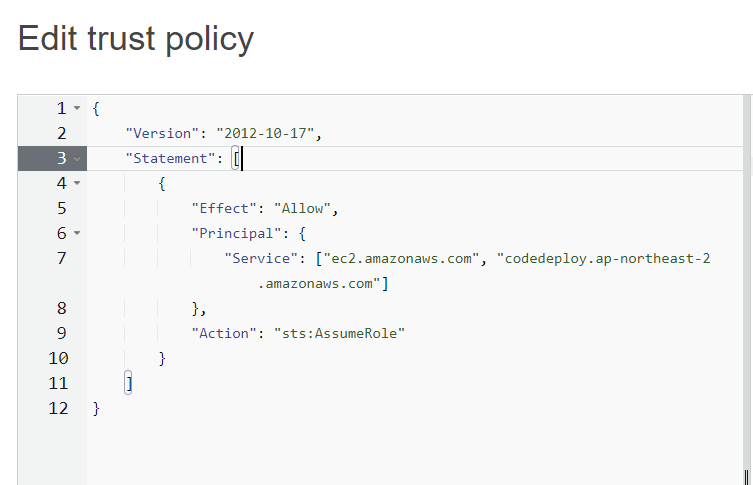

원래는 ec2.amazonaws.com"만 할당되어있었는데 "codedeploy.ap-northeast-2.amazonaws.com" 값을 추가했습니다.

## 로컬 설정

로컬에 있는 백엔드 애플리케이션에 저장할 파일들입니다. 루트 위치에 저장합니다.

### appspec.yml

`appspec.yml` 은 배포 자동화를 도와주는 CodeDeploy-Agent가 인식하는 파일입니다. `files` 의 `destination` 을 보면 파이프라인의 결과물이 EC2의 어느 위치에 복사될지 알 수 있습니다. `hooks` 는 CodeDeploy 에서 지정한 각 단계에 맞춰 어떤 셸 스크립트를 실행하는지 지정합니다.

```yml
version: 0.0
os: linux

files:
  - source: /
    destination: /home/ubuntu/build

hooks:
  BeforeInstall:
    - location: server_clear.sh
      timeout: 3000
      runas: root
  AfterInstall:
    - location: initialize.sh
      timeout: 3000
      runas: root
  ApplicationStart:
    - location: server_start.sh
      timeout: 3000
      runas: root
  ApplicationStop:
    - location: server_stop.sh
      timeout: 3000
      runas: root
```

### buildspec.yml

CodeBuild가 읽는 파일입니다. CodeBuild 가 지정한 각 단계에 맞춰 동작을 특정하여 명령합니다.

```yml
version: 0.2

phases:
  install:
    runtime-versions:
      java: corretto11
  build:
    commands:
      - echo Build Starting on `date`
      - cd DeployServer
      - chmod +x ./gradlew
      - ./gradlew build
  post_build:
    commands:
      - echo $(basename ./DeployServer/build/libs/*.jar)
artifacts:
  files:
    - DeployServer/build/libs/*.jar
    - DeployServer/scripts/**
    - DeployServer/appspec.yml
  discard-paths: yes
```

### 셸 스크립트

scripts 디렉토리에 저장합니다.

**scripts/initialize.sh**

빌드 결과물을 실행할 수 있도록 실행 권한을 추가합니다.

```
#!/usr/bin/env bash
chmod +x /home/ubuntu/build/**
```

**scripts/server_clear.sh**

빌드 결과물이 저장되어 있는 `build` 디렉토리를 제거합니다.

```
#!/usr/bin/env bash
rm -rf /home/ubuntu/build
```

**scripts/server_start.sh**

`DeployServer-0.0.1-SNAPSHOT.jar` 라는 빌드 결과물을 실행합니다.

```
#!/usr/bin/env bash
cd /home/ubuntu/build
sudo nohup java -jar DeployServer-0.0.1-SNAPSHOT.jar > /dev/null 2> /dev/null < /dev/null &
```

**scripts/server_stop.sh**

실행 중인 Spring Boot 프로젝트를 종료합니다.

```
#!/usr/bin/env bash
sudo pkill -f 'java -jar'
```

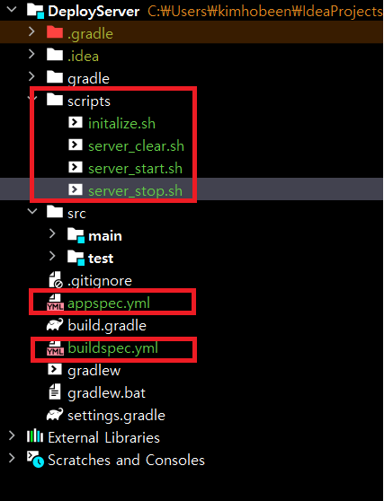

## CodeDeploy 설정

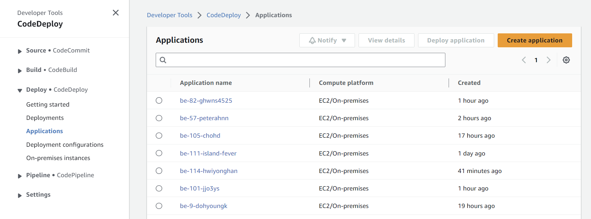

CodeDeploy 에서 create Application 버튼을 클릭합니다.

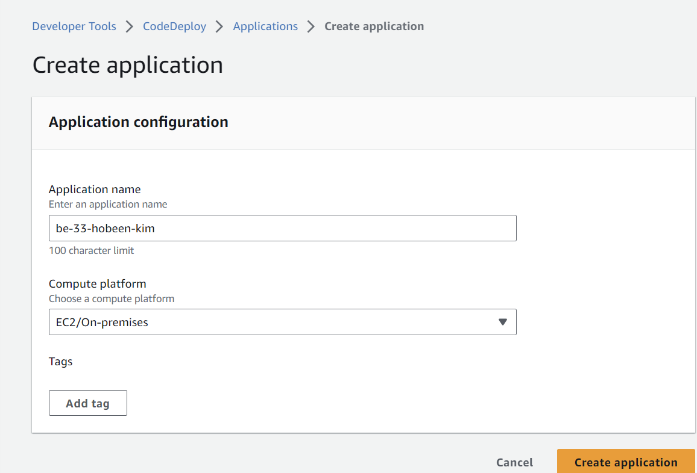

이름과 플랫폼을 선택하고 애플리케이션을 만듭니다. 이때 Application 이름은 EC2 이름으로 했습니다.

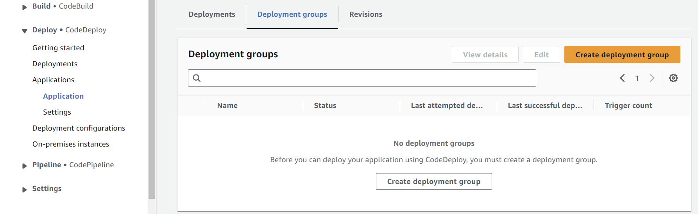

CodeDeploy 애플리케이션에서 Deployment groups 탭을 클릭한 후 create deployment 버튼을 누릅니다.

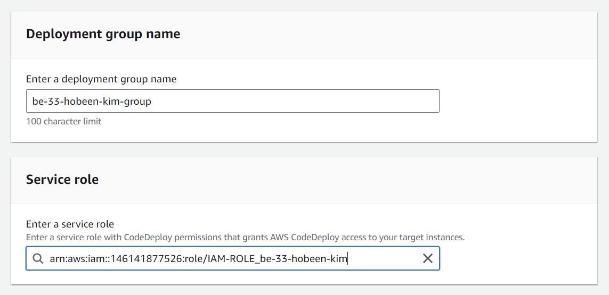

group 이름을 설정하고, 앞서 권한을 설정한 IAM ROLE 을 선택합니다.

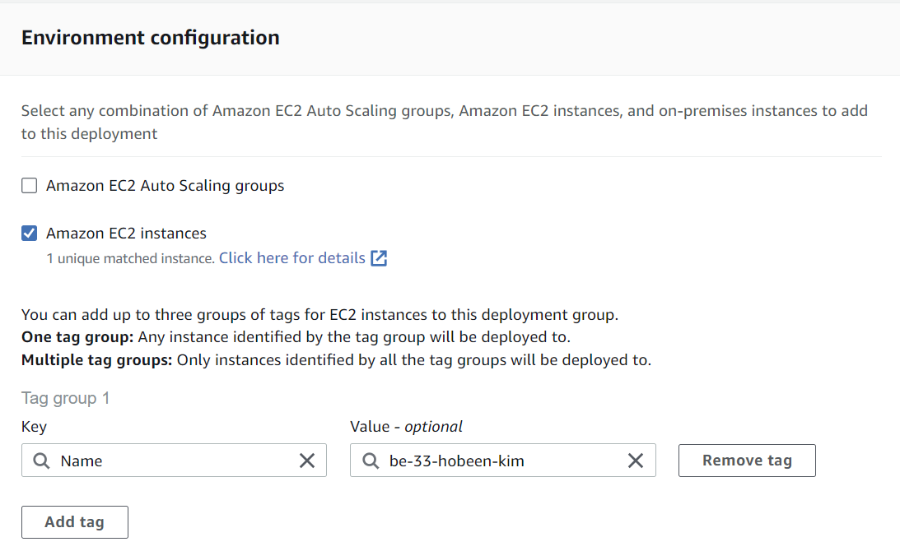

환경 구성 중 'Amazon EC2 인스턴스'를 선택하고, 태그 그룹에 EC2 인스턴스의 이름인 Name 태그 키와 값을 선택합니다.

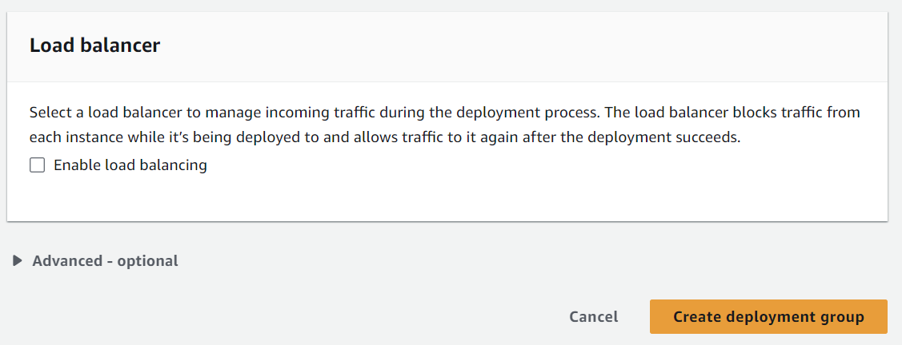

로드 밸런싱 활성화 체크 해제 후, `create deployment group` 버튼을 클릭합니다.

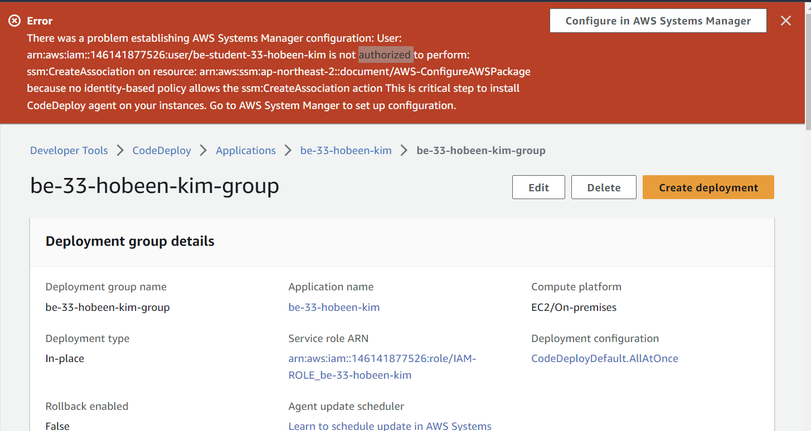

배포 그룹을 생성하고 나면 슬라이드의 화면처럼 에러 화면이 보일 수 있습니다. 앞서 수동으로 EC2 인스턴스에 CodeDeploy-Agent 설치를 완료 했기때문에 실습 진행에는 문제가 없습니다. 

## 파이프 라인 생성

이제 AWS CodePipeline 을 이용해 서버 배포 자동화 파이프라인을 구축하겠습니다. 

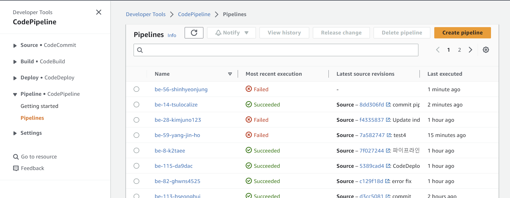

CodePipeline 으로 이동해서 `create pipeline` 을 클릭합니다.

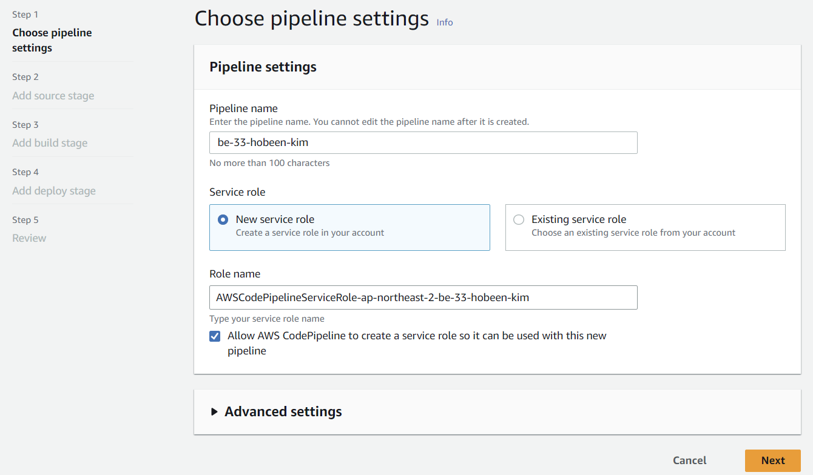

먼저 파이프라인 이름을 설정합니다.

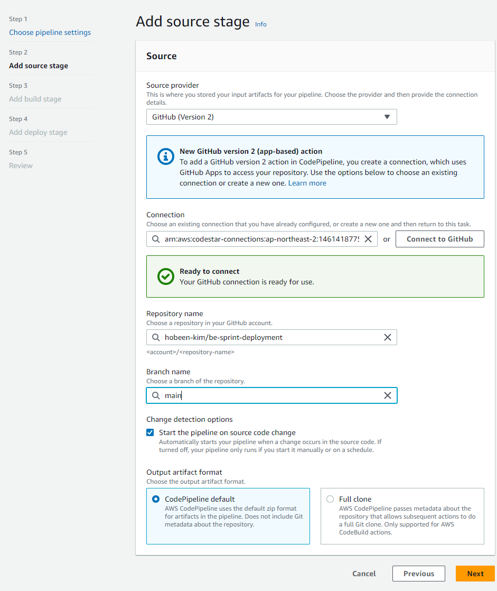

그리고 github 와 연결해야 하는데요. connection 에서 `Connect to GitHub` 버튼을 누르고 연결합니다. 그러면 repository name 과 branch name 을 선택할 수 있습니다. 출력 아티팩트 형식은 'CodePipeline default' 로 지정한 후 넘어갑니다.

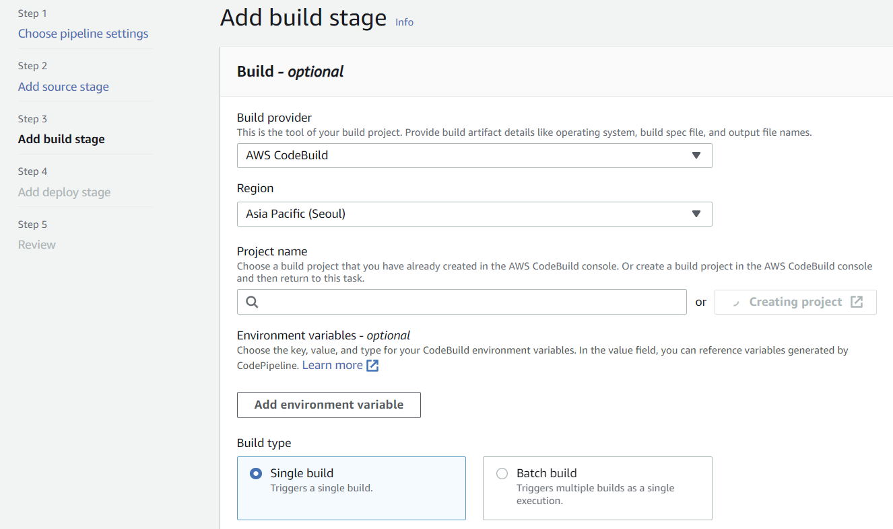

해당 단계에서 Build provider 를 AWS CodeBuild 로 선택하고 Project name 에서 Creating project 를 누릅니다.

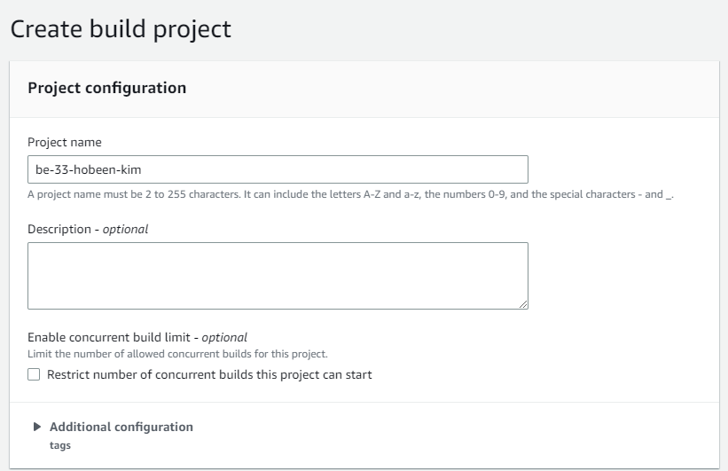

Creating project 내로 들어와서 먼저 프로젝트 이름을 설정합니다.

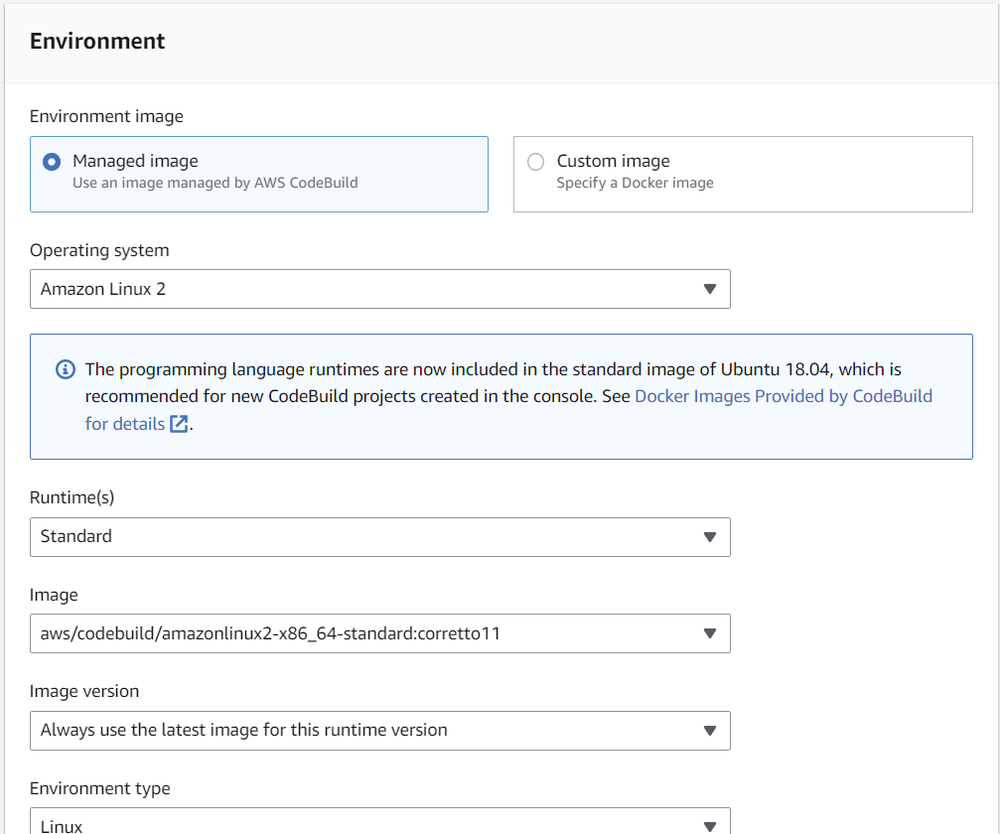

운영체제, 런타임, 이미지를 선택합니다. 운영체제는 Amazon Linux 2 를 선택, 런타임은 Standard 를 선택, 이미지는 aws/codebuild/amazonlinux2-x86_64-standart:corretto11 을 선택합니다.

이때 아래에 `Role name` 이 있는데, 해당 Role 로 만듭니다. 따라서 IAM 사용자는 CreateRole 권한이 있어야 합니다.

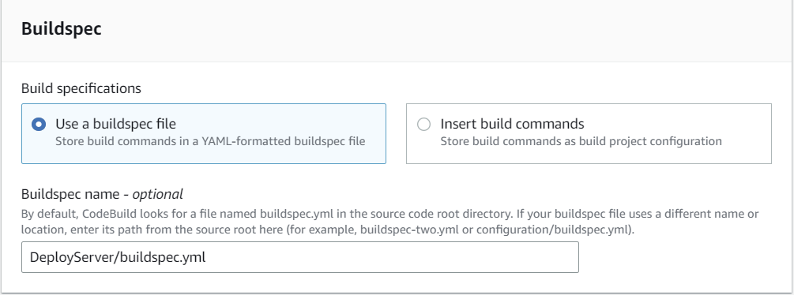

Buildspec 이름에 "DeployServer/buildspec.yml"을 작성하고 `Continue to CodePipeline` 버튼을 클릭합니다.

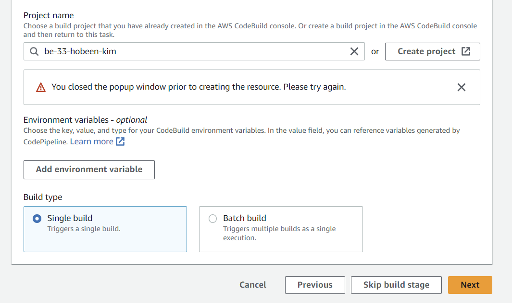

프로젝트 생성이 완료되면 next 버튼을 누릅니다.

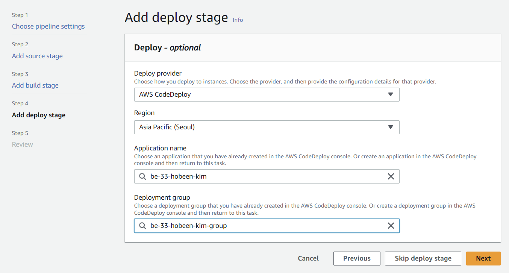

배포 스테이지 입니다. 배포 공급자는 'AWS CodeDeploy' 를 선택합니다. 리전은 서울을 선택합니다. next 를 누르고 create pipeline 을 합니다.

**파이프라인 생성과 동시에 소스 코드의 배포가 자동으로 실행됩니다.**

파이프라인이 실패하는 경우엔 실패한 단계(stage)에서의 로그를 살펴보며 문제를 해결해야 합니다. CodeDeploy-Agent 는 파이프라인 실행 때마다 로그를 해당 EC2 instance 에 저장합니다. EC2 인스턴스의 터미널에 `cd /opt/codedeploy-agent/deployment-root/deployment-logs` 명령어를 입력하여 로그 파일이 저장된 경로로 이동할 수 있습니다.

빌드 상황은 CodePipeline 에서 확인할 수 있습니다.


# 서버 환경 변수 설정

클라이언트와 서버를 서로 연결하고 노출되면 안 되는 값을 보호하기 위해 환경 변수를 설정해보겠습니다.

시작하기 전 아래 설정이 되어있다고 가정합니다.

- RDS 인스턴스 생성 완료
- EC2 안에 AWS CLI 설치 완료

## Parameter Store

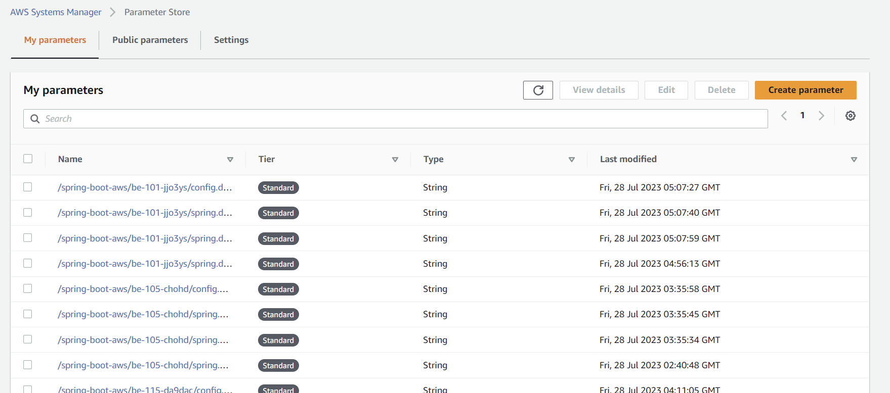

Parameter Store 에서 `Create parameter` 버튼을 누릅니다.

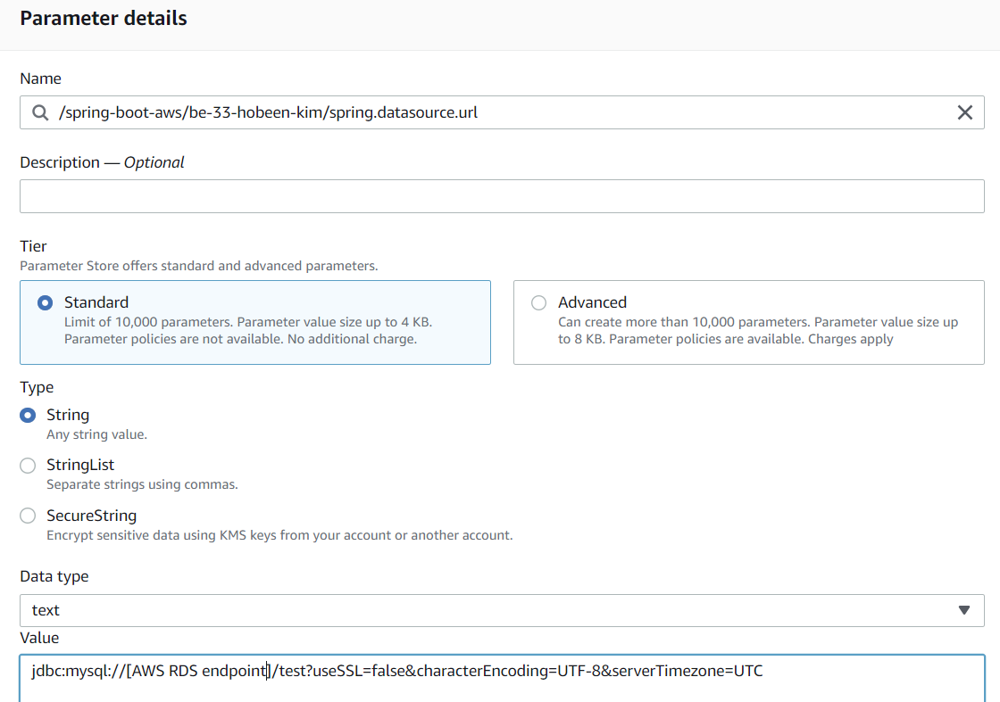

 이름에는 환경 변수명을 적어주고, 환경 변수에 할당되어야 할 값을 입력합니다. 이름은 꼭 /prefix/name/key 의 순서로 작성합니다. 작성이 완료되면 `create parameter` 로 작성완료합니다.

나머지 username, password, domain 등 properties 에 있는 환경 변수도 작성합니다.

## Application 코드 설정

로컬 서버의 애플리케이션을 환경 변수를 사용할 수 있게 변경합니다.

### build.gradle

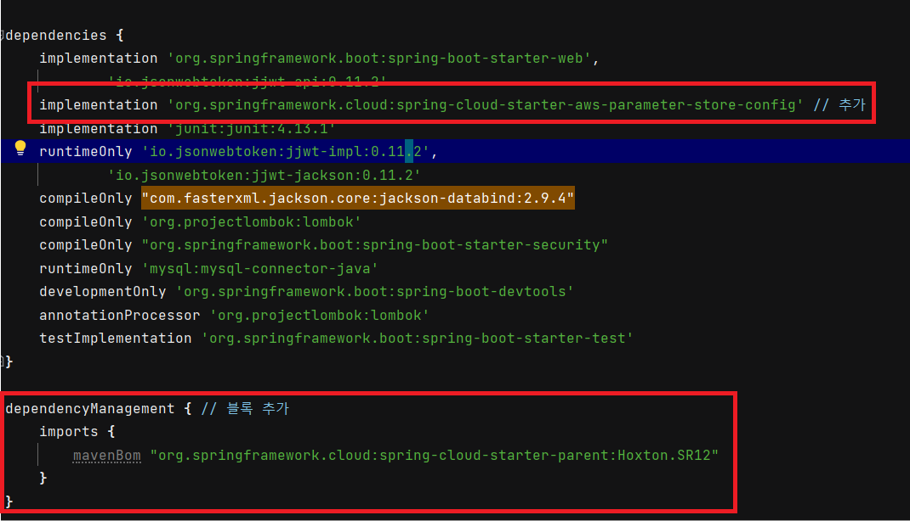

해당 의존성과 블록을 `build.gradle` 에 추가합니다.

### bootstrap.yml

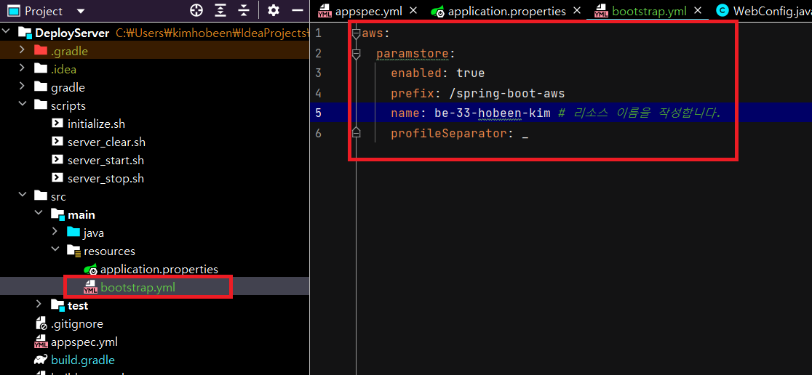

prefix, name 은 Parameter Store 에서 설정한 값입니다.

### application.properties

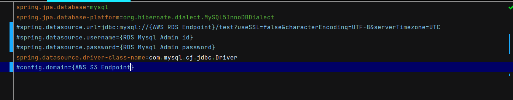

필요없는 내용은 모두 주석처리했습니다. 해당 변수들은 Parameter Store 에 저장되어 있습니다.

모든 설정이 끝났으니 push 합니다. 그러면 CI/CD 에 의해 자동으로 배포까지 됩니다.

