*결론 : cicd 시간 **3분 20초 -> 1분 58초**로 감소, 도커 이미지 **731mb -> 296mb** 로 감소*

# 1. 문제 상황

현재 CICD 를 깃허브 - 도커로 구축하고 있습니다. 그런데 TC 도 많아지고 의존성도 많아지다보니 배포하는 데 초기에는 2분 초반 ~ 중반정도 걸리던 작업들이 3분 이상 걸리기 시작했고 저는 이를 줄여야겠다는 생각이 들었습니다. 또한 이 과정에서 도커 이미지 최적화도 필요하겠다는 생각이 들었습니다.

문제 상황은 아래와 같습니다.

## 첫 번째 문제 : CICD 과정이 오래 걸림

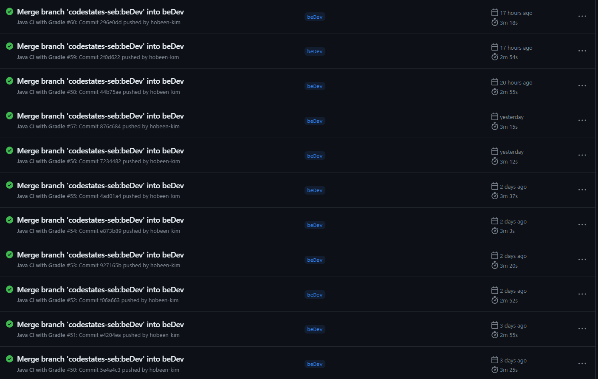

CICD 과정은 크게 `jar 파일 빌드` -> `도커 이미지 빌드 및 pull` -> `asg 를 순회하며 ec2 에 도커 이미지 설치 및 배포` 로 나눌 수 있는데요. 해당 과정에서 대략적으로 **짧으면 2분 55초에서 길면 3분 37초**까지 걸립니다. 중간 정도인 3분 20초일 때를 보겠습니다. (실제 오른쪽 값(s) 을 더하면 3분 9초 입니다.)

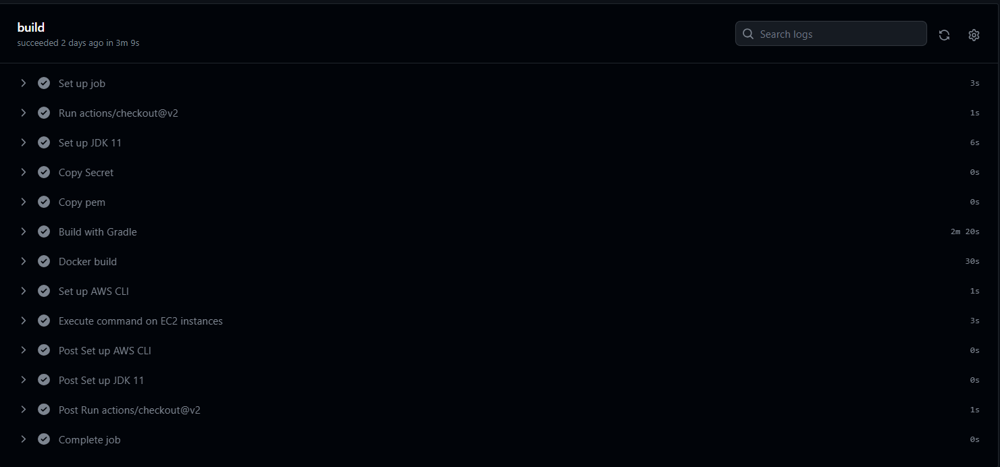

오래 걸리는 부분은 `build with gradle` 과 `docker build` 과정입니다. 각각 2분 20초와 30초가 걸렸습니다. 해당 과정은 아래와 같습니다.

```yml
- name: Build with Gradle
    run: |
      cd Server
      chmod +x gradlew
      ./gradlew build
- name: Docker build
    run: |
      docker login -u ${{ secrets.DOCKER_HUB_USERNAME }} -p ${{ secrets.DOCKER_HUB_PASSWORD }}
      docker build -t prometheus -f Server/Dockerfile Server
      docker tag prometheus ${{ secrets.DOCKER_HUB_USERNAME }}/prometheus:${GITHUB_SHA::7}
      docker tag prometheus ${{ secrets.DOCKER_HUB_USERNAME }}/prometheus:latest
      docker push ${{ secrets.DOCKER_HUB_USERNAME }}/prometheus:${GITHUB_SHA::7}
      docker push ${{ secrets.DOCKER_HUB_USERNAME }}/prometheus:latest
```

빌드 부분에서는 테스트가 오래걸리는 듯 싶었습니다. 현재 단위 및 통합 테스트가 총 701개인데 로컬 환경에서 약 1분 걸렸습니다.

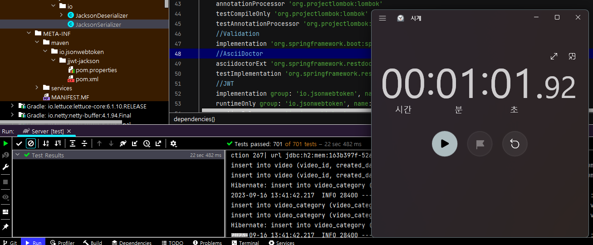


## 두 번째 문제 : 도커 이미지 사이즈가 큼

먼저 압축된 파일 기준으로 도커 이미지 크기는 383.15MB 입니다.

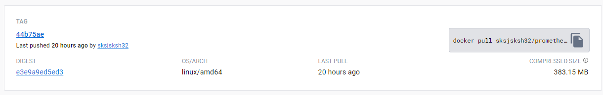

그리고 EC2 에서 다운받은 압축 해제 파일은 2배가량 되는 731MB 입니다.

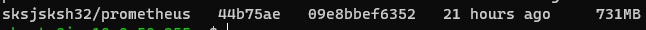

용량이 크면 gitaction 에서 Push 할 때, ec2 에서 pull 할 때 모두 많은 시간이 소요되고, 네트워크 비용도 증가합니다. 또한 EBS 용량도 차지하구요. 따라서 해당 도커 이미지 사이즈를 줄여야겠습니다.

# 2. 해결 1 : CICD 가 오래 걸리는 문제 해결 방법

해당 문제는 크게 2가지로 생각했습니다. 하나는 테스트 환경 최적화이고 두번째는 캐시 활용입니다. 세부적으로 아래와 같습니다. 최종적으로 선택된 것은 :white_check_mark: 표시가 된 것입니다. :x: 는 오히려 시간이 더 걸리기 때문에 채택하지 않았습니다.

1. 테스트 환경 최적화
   - 테스트 병렬 실행 :white_check_mark:
   - 테스트 구성 변경 :white_check_mark:
2. 캐시 활용
   - Gradle 캐싱 :white_check_mark:
   - Docker 이미지/레이어 캐싱 :x:

## # 1. 테스트 환경 최적화 (테스트 병렬 실행)

### junit-platfrom 설정

테스트 환경을 최적화하는 방법 중 테스트를 병렬로 실행할 수 있습니다. 병렬로 실행하려면 `gradle.properties` 에서 병렬 실행을 활성화하고 `build.gradle` 에서 테스트 작업 구성을 추가해줍니다.

**junit-platform.properties**

아래 설정을 통해 작업을 병렬로 실행하도록 설정합니다. 해당 설정은 test/resources 에 넣어 줍니다.

```properties
junit.jupiter.execution.parallel.enabled=true
junit.jupiter.execution.parallel.mode.classes.default=concurrent
junit.jupiter.execution.parallel.mode.default=same_thread
junit.jupiter.execution.parallel.config.strategy=fixed
junit.jupiter.execution.parallel.config.fixed.parallelism=2
```

**build.gradle**

그리고 maxParallelForks 를 2 로 설정합니다. 2개의 코어에서 병렬적으로 실행됩니다.

```
test {
    maxParallelForks = 2
    ...
}
```

하지만 실행 시간은 5회 측정 시 **병렬 실행은 평균 60초, 싱글 코어는 평균 61초**로 차이가 없었습니다. 명확한 원인은 찾을 수 없었지만 다음과 같이 추측해보았습니다.

테스트를 수행할 때 총 6번의 Spring 이 띄워지도록 했습니다. 이 때 각 코어별로 3번씩 가져가면 가장 이상적일 겁니다. 하지만 원하는대로 되지는 않겠죠. 각각의 코어가 각각의 Spring 을 6번씩 띄우는 과정이 있었습니다. 그러면 수행시간에 큰 차이가 없게 됩니다. 스프링을 띄우는 시간이 대부분이니까요. 아래는 제 로컬 환경에서 4개의 코어로 테스트를 동작하는 과정입니다. 명확하게 확인하기 위해 4개의 코어로 진행했습니다.


`xxxServiceTest` 가 총 3개가 수행되는데요. 해당 Service 테스트들은 하나의 스프링에서 같이 수행되어야 가장 효율적입니다. 하지만 이렇게 3개가 따로 수행된다면 테스트를 통합한 의미가 없어집니다.

### GitActions 에서 병렬 실행 (Job 병렬 실행)

원래는 gradle 설정에서 병렬 처리를 하려고 했으나 찾을 자료도 많이 없어서 실패했습니다. 다음에 모듈이 나눠지면 모듈별로는 병렬처리할 수 있을 것 같습니다. 

GitActions 에서 Job 은 기본적으로 병렬로 실행됩니다. 따라서 빌드에 필요없는 테스트는 따로 빼보도록 하겠습니다. 그러기 위해선 먼저 테스트를 아래와 같이 나눠줍니다.

**build.gradle**

```java
...

//테스트
tasks.register('testA', Test) {
    exclude '**/*ControllerTest.class'
    useJUnitPlatform()
}

tasks.register('buildTest', Test) {
    outputs.dir snippetsDir
    include '**/*ControllerTest.class'
    useJUnitPlatform()
}

test.onlyIf { // 전체 테스트를 실행할지 여부를 결정하는 함수
    !project.hasProperty('doNotRunTests')
}

build.dependsOn buildTest
...
```

기존의 test 는 비활성화하고 test 를 `testA` 와 `buildTest` 로 나눕니다. `buildTest` 는 빌드에 필요한 테스트로, API 문서화를 위한 컨트롤러 테스트를 포함합니다. `testA` 는 이외의 모든 테스트입니다. 테스트 방법은 아래와 같습니다.

- testA 실행 : ./gradlew testA
- buildTest 실행 : ./gradlew build (build 가 buildTest 를 의존하므로)

로컬에서 실행 결과 testA 실행은 55초, buildTest 는 1분 5초가 걸립니다. 병렬로 실행되면 빌드 시간 자체는 10초 정도 줄어들걸로 예상됩니다.

**workflow**

이제 gitactions 를 변경해보겠습니다.

```yml
name: Java CI with Gradle

on:
  # 생략

jobs:
  test:
    runs-on: ubuntu-latest
    steps:
      # 환경 설정 생략
      - name: Test with Gradle
        run: |
          cd Server
          chmod +x gradlew
          ./gradlew testA

  build:
    runs-on: ubuntu-latest
    steps:
      # 환경 설정 생략
      - name: Build with Gradle
        run: |
          cd Server
          chmod +x gradlew
          ./gradlew build -PdoNotRunTests
      - name: Archive SNAPSHOT jar
        uses: actions/upload-artifact@v2
        with:
          name: snapshot-jar
          path: Server/build/libs/*-SNAPSHOT.jar

  cd:
    needs: 
    - test
    - build
    runs-on: ubuntu-latest
    steps:
      - name: Checkout code
        uses: actions/checkout@v2
      - name: make dir
        run: |
          mkdir -p Server/build/libs
      - name: Download SNAPSHOT jar
        uses: actions/download-artifact@v2
        with:
          name: snapshot-jar
          path: Server/build/libs/
          
          # 기타 도커 이미지 업로드 및 배포 과정
```

job 은 크게 test, build, cd 로 나눠집니다. cd 는 needs 값을 통해 test, build 가 끝나야 실행됩니다. 이 때 build 단계의 jar 파일을 활용하기 위해 `Archive SNAPSHOT jar` 단계에서 파일을 저장하고 cd 단계에서 `Download SNAPSHOT jar` 로 가져옵니다.

빌드 및 배포가 끝난 후 시간은 아래와 같습니다.

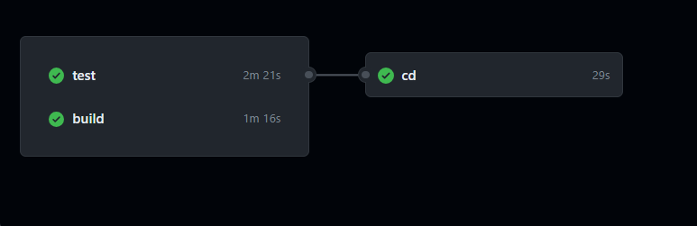

`test` 가 무려 2분 21초나 걸렸습니다. 그렇다면 `test` 를 다시 세부적으로 나누면 되겠네요. test 를 3개로 나눠봅시다.

```
tasks.register('testA', Test) {
    exclude '**/*ControllerTest.class'
    exclude '**/*IntegrationTest.class'
    exclude '**/*RepositoryTest.class'
    exclude '**/*ServiceTest.class'
    useJUnitPlatform()
}

tasks.register('testB', Test) {
    include '**/*IntegrationTest.class'
    include '**/*RepositoryTest.class'
    useJUnitPlatform()
}

tasks.register('testC', Test) {
    include '**/*ServiceTest.class'
    useJUnitPlatform()
}

tasks.register('buildTest', Test) {
    outputs.dir snippetsDir
    include '**/*ControllerTest.class'
    useJUnitPlatform()
}
```

testA 를 각각 A, B, C 3개로 나눴습니다. 그리고 아까와 같이 test job 을 나눈 후 실행시켜보면 아래와 같습니다.

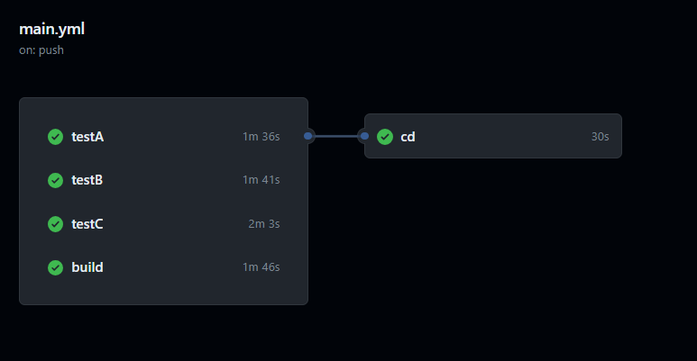

이전의 3분 9초에서 2분 33초로 약 30초 줄였습니다. 하지만 테스트를 위한 초기 세팅이 있다보니 여기서 테스트를 더 나눈다고 줄이기는 힘들 것 같습니다. 이제 아래에서 테스트 구성을 변경해보겠습니다.

## # 2. 테스트 환경 최적화 (테스트 구성 변경)

테스트 자체의 구성을 살펴볼 수 있는데요. 테스트에서 가장 시간이 많이 걸리는 작업은 스프링 부트를 띄우는 작업입니다. 아래 사진은 테스트를 걸린 시간 순으로 정렬했을 때 제일 아래에 있는 테스트들입니다.

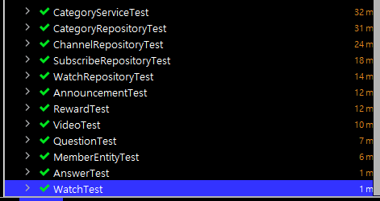

[Entity 클래스 + Test] 는 엔티티 클래스의 메서드를 테스트하는 테스트인데, 엔티티는 스프링이 필요없기 때문에 매우 짧은 시간이 걸린다고 볼 수 있습니다. 그러면 반대로 스프링을 많이 띄우면 많이 띄울 수록 테스트 시간이 길어진다고 할 수 있겠네요.

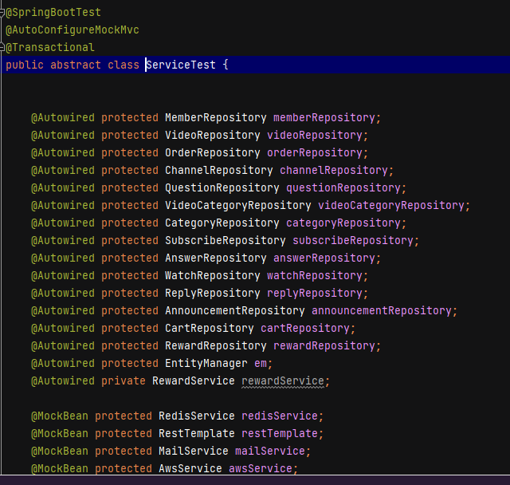

현재는 이런 식으로 각 테스트에 필요한 스프링을 공통 클래스로 만들어서 사용하고 있는데, 이런 공통 클래스를 제외하고 따로 스프링이 띄워지는 테스트가 있는지도 살펴봐야 합니다. 참고로 공통 클래스를 사용한다고 해도 별도로 Mock 처리한 클래스가 구체 테스트클래스에 포함되어있으면 해당 구체 클래스는 별도의 스프링이 띄워집니다.

### TestA

먼저 테스트 A 를 보겠습니다. 로컬 기준으로 평균 40초가 걸리고 SpringBoot 는 2번 실행됩니다. 그런데 `AuthenticationFilterTest` 가 `ServiceTest` 를 상속받으면서 `@Mock` 를 호출하고 있습니다. 

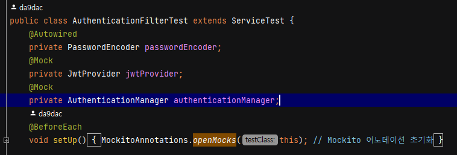

이렇게 되면 ServiceTest 를 상속받는 의미가 없이 SpringBoot 가 또 띄워지게 되는데요. 배포 환경에서는 ServiceTest 들과 FilterTest 가 별개라 상관없지만 로컬에서 테스트 전체를 실행할 때는 문제가 될 수 있습니다.

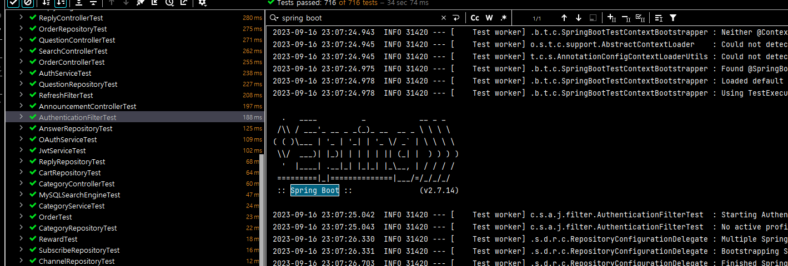

위 사진처럼 Spring Boot 가 다시 띄워집니다. 따라서 Mock 처리되는 부분은 ServiceTest 로 옮겨도 상관없으면 옮겨줍니다. 

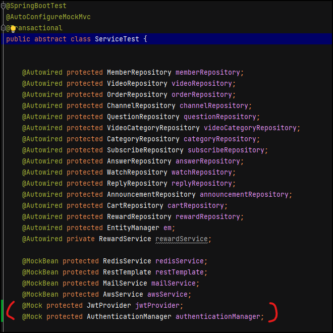

이제 FilterTest 도 ServiceTest 들과 함께 스프링부트가 띄워집니다.

### TestB

TestB 는 통합 테스트와 RepositoryTest 를 실행하고 로컬 기준으로 평균 40초가 걸리고 SpringBoot 는 2번 실행됩니다. 그런데 IntegrationTest 에서 트랜잭션 문제로 `@BeforeEach` 로 데이터를 넣고 있는데, 데이터를 넣는 작업때문에 테스트클래스 하나가 무려 12초나 걸렸습니다. 해당 `@BeforeEach` 를 `@BeforeAll` 로 변경하고, 트랜잭션 적용이 안돼서 더티체킹이 안되는 문제는 그냥 마지막에 각 엔티티를 saveAll 해주면서 더티체킹 대신 직접 저장해줬습니다.


이렇게 해서 해당 테스트 클래스의 실행 시간은 4초로 줄었습니다.

### TestC

A, B, C 중 가장 많은 시간이 걸린 TestC 입니다. 로컬 기준으로 평균 55초정도 걸리고 스프링 부트는 2번 띄워집니다. 원래 3번이었는데 중간에 `AwsServiceTest` 를 `AwsModuleTest` 로 만들어서 TestA 에게 줬습니다. 그리고 `OAuthServiceTest` 에서 추가로 띄워지는 SpringBoot 가 있었습니다.


바로 `DefaultOAuthUserService` 를 MockBean 처리해서 그런데요. 해당 MockBean 도 ServiceTest 로 옮겨도 테스트가 깨지지 않기 때문에 옮기도록 하겠습니다. 이렇게 해서 TestC 에서 SpringBoot 는 딱 1번 띄워집니다. 로컬기준 **30초**로 줄었습니다.

결론적으로 **스프링 부트는 716개 테스트 중 (글 작성 중 더 늘었습니다.) 6번 실행**됩니다. module 테스트, authcontroller 테스트(시큐리티 필터 테스트를 위해 따로 실행), repository 테스트, controller 테스트, service 테스트, integration 테스트에서 실행됩니다.

### 결과

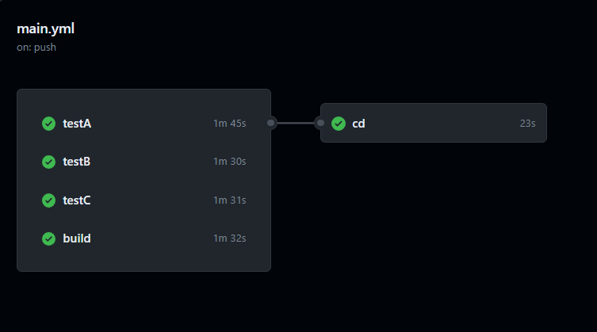

test 가 전반적으로 소요 시간이 줄었습니다. 위 gitAction 은 배포 과정을 뺀 job 이라서, 해당 과정을 대략 6초 정도 계산해서 넣으면 최종적으로 **2분 14초 정도**로 줄었다고 볼 수 있습니다.


## # 3. Gradle 캐시 활용

이번에는 **Gradle Dependencies 캐싱** 기능을 사용해보겠습니다. Gradle Dependencies 캐싱은 GitHub Actions 에서 빌드 시간을 단축시키기 위한 중요한 최적화 방법 중 하나입니다. 프로젝트를 빌드할 때, Gradle은 의존성들을 다운로드 받아야 하는데 여기서 꽤 오랜 시간이 걸릴 수 있습니다. 그래서 이 부분에서 캐싱을 사용하면 이전에 다운로드된 의존성들을 재사용하여 빌드 시간을 크게 줄일 수 있습니다.

```yml
 build:
    runs-on: ubuntu-latest
    steps:
      - uses: actions/checkout@v2
      # 환경설정 생략
      - name: Cache Gradle dependencies
        uses: actions/cache@v2
        with:
          path: |
            ~/.gradle/caches
            ~/.gradle/wrapper
          key: gradle-${{ runner.os }}-${{ hashFiles('**/*.gradle*', '**/gradle-wrapper.properties') }}
          restore-keys: |
            gradle-${{ runner.os }}-
      - name: Build with Gradle
        run: |
          cd Server
          chmod +x gradlew
          ./gradlew build -PdoNotRunTests
      - name: Archive SNAPSHOT jar
        uses: actions/upload-artifact@v2
        with:
          name: snapshot-jar
          path: Server/build/libs/*-SNAPSHOT.jar
```

`Cache Gradle dependencies` 단계가 Gradle Dependencies 캐싱입니다. 사실 지금까지 build 에서는 위 설정을 사용하고 있었는데 test 에는 사용하고 있지 않아서 test 에 적용시켜보겠습니다.

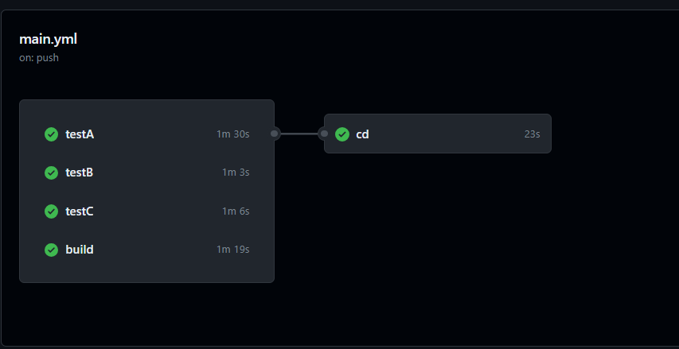

드디어 2분 안으로 들어왔습니다. 하지만 testA 가 계속 늦는데요. testA 의 작업 중 testC 의 ServiceTest 와 겹치는 부분이 있기 때문에 일부를 testC 로 넘겨주고 다시 실행해보겠습니다. **gradle 설정이 변경되면 새로운 캐시가 생성되기 때문에** 2번째 결과를 보겠습니다.

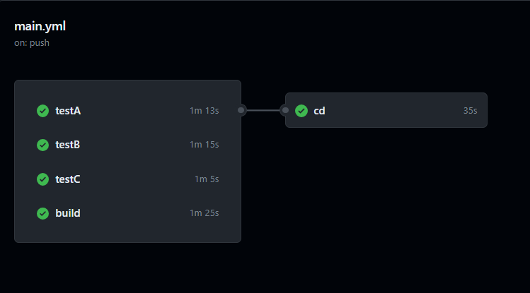

build job 에 따라 왔다갔다 하는데, 이제 2분 정도 걸리는 것 같습니다. 

## # 4. Docker 레이어 캐싱 활용

Docker는 이미지를 빌드할 때 이전에 빌드한 레이어가 변경되지 않았다면 해당 레이어를 다시 빌드하지 않고 캐시된 레이어를 사용합니다. 이렇게 함으로써 빌드 시간을 단축시킬 수 있습니다. 현재 Docker 를 빌드하는데 23~30초 가량 걸립니다. 이를 Docker 레이어 캐싱으로 줄여보겠습니다. 

```yml
  - name: Cache Docker layers
    uses: actions/cache@v2
    with:
      path: /tmp/docker-layers
      key: docker-layer-${{ runner.os }}-${{ github.sha }}
      restore-keys: |
        docker-layer-${{ runner.os }}-
  - name: Docker build
    run: |
      mkdir -p /tmp/docker-layers
      docker load -i /tmp/docker-layers/prometheus.tar || true
      docker login -u ${{ secrets.DOCKER_HUB_USERNAME }} -p ${{ secrets.DOCKER_HUB_PASSWORD }}
      docker build --cache-from=prometheus:latest -t prometheus -f Server/Dockerfile Server
      docker tag prometheus ${{ secrets.DOCKER_HUB_USERNAME }}/prometheus:${GITHUB_SHA::7}
      docker tag prometheus ${{ secrets.DOCKER_HUB_USERNAME }}/prometheus:latest
      docker push ${{ secrets.DOCKER_HUB_USERNAME }}/prometheus:${GITHUB_SHA::7}
      docker push ${{ secrets.DOCKER_HUB_USERNAME }}/prometheus:latest
      docker save -o /tmp/docker-layers/prometheus.tar prometheus:latest
```

레이어 캐싱을 하기 위해서는 레이어를 다운로드하는 과정과 다시 업로드하는 과정이 필요합니다. 그리고 빌드를 할 때 `--cache-from=prometheus:latest` 로 캐시를 사용한다고 명시적으로 표시합니다. 아래는 이미지 캐싱 과정을 추가한 빌드 시간입니다.

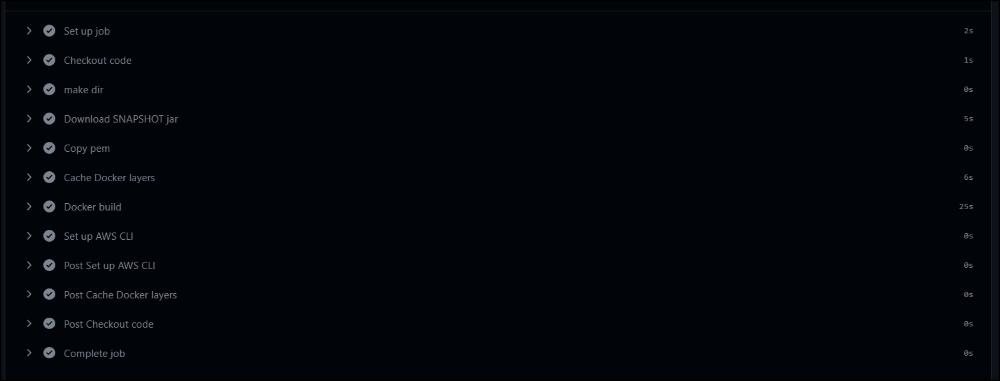

Cache Docker layers 에 6초 가량 걸렸고 도커 빌드에 큰 차이가 없었습니다. Docker 이미지 빌드가 간단하고 빠른 경우, 캐싱 과정에서 발생하는 추가 작업이 빌드 시간을 오히려 늘릴 수 있습니다. 따라서 **레이어 캐싱은 사용하지 않도록 하겠습니다.** 이는 dockerhub 에서 이미지를 다운로드 받아서 캐싱에 활용하는 이미지 캐싱도 마찬가지입니다.

# 3. 해결 2 : 도커 이미지 사이즈를 줄이는 방법

현재 이미지 파일의 크기는 731MB 입니다. 상당히 큰 문제가 있는데요. 해당 문제는 아래 2가지 해결 방법을 생각했습니다.

1. 멀티 스테이지 빌드
2. 불필요한 의존성을 확인하고 삭제하여 jar 파일 크기 줄이기

## # 1. 멀티 스테이지 빌드

프로젝트 중 CICD 라인에서 도커를 사용한다고 말씀드렸는데 멘토님께서 이미지 최적화와 멀티 스테이지에 대해 언급하셨습니다. 구체적인 얘기는 아니었고 '이런 게 있다' 정도였는데 지금 생각해보니 그 부분을 사용하면 이미지 사이즈를 줄일 수 있지 않을까 생각을 했습니다.

멀티 스테이지 빌드는 Docker에서 이미지를 빌드할 때 여러 단계를 통해 최종 이미지를 생성하는 기능입니다. 빌드 단계에서는 빌드에 필요한 파일을 설치하고, 배포 시에는 배포에 필요한 파일만 설치하는 것입니다. 아래와 같이 진행할 수 있습니다.

```
# 첫 번째 스테이지: 빌드 스테이지
FROM openjdk:11-jdk as build-stage
# 빌드 및 테스트 진행

# 두 번째 스테이지: 실행 스테이지
FROM openjdk:11-jre-slim AS runtime-stage
# jar 파일 실행
```

실행 스테이지에서 `openjdk:11-jre-slim` 을 base-image 로 사용하면서 파일 크기를 줄일 수 있습니다.

하지만 저는 멀티 스테이지 빌드를 사용하지는 않았는데요. 그 이유는 gitAction 에서 이미 빌드를 모두 하고 거기서 생성된 jar 파일을 배포하기 때문입니다. 따라서 빌드 스테이지는 필요없고, 실행 스테이지만 필요합니다.

원래 Dockerfile 은 아래와 같았습니다.

```
# (1) base-image
FROM openjdk:11

# (2) COPY에서 사용될 경로 변수
ARG JAR_FILE=build/libs/*-SNAPSHOT.jar

# (3) jar 빌드 파일을 도커 컨테이너로 복사
COPY ${JAR_FILE} app.jar
COPY src/main/resources/prometheus.pem prometheus.pem

# (4) pem 파일의 권한 설정
RUN groupadd -r ubuntu && useradd -r -g ubuntu ubuntu \
    && chmod 400 prometheus.pem && chown ubuntu:ubuntu prometheus.pem

# (5) jar 파일 실행
ENTRYPOINT ["java","-jar","/app.jar"]

```

여기서 base-image 가 `openjdk:11` 인데, `openjdk:11-jre-slim` 라는 더 경량화된 버전이 있습니다. 그 버전을 적용시키면 아래와 같습니다.

```
# (1) base-image
FROM openjdk:11-jre-slim AS runtime-stage

# 아래는 똑같음
```

`runtime-stage` 라는 걸 명시해줬습니다. 이제 빌드를 하면 크기는 다음과 같습니다.


위 140.8MB 는 DockerHub 의 압축된 크기이고 아래는 ec2 에서 압축해제된 크기입니다. **기존 731MB 에서 300MB 로 59% 줄였습니다.**

## # 2. jar 파일 크기 줄이기

*1000KB = 1MB 로 대략 계산했습니다.*

jar 파일의 크기를 줄이기 위해서는 필요없는 의존성을 줄이는 게 중요합니다. 아래는 plain.jar 와 executable jar 입니다.

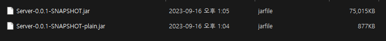

plain.jar 는 의존성을 포함하지 않고 작성된 소스코드의 클래스 파일과 리소스 파일만 포함되어있습니다. 1MB 가 채 되지 않습니다. 반대로 의존성이 포함된 executable jar 파일은 75MB 입니다. 다시 말해서 의존성이 파일 크기의 대부분을 차지합니다. 현재 프로젝트의 의존성은 아래와 같습니다.

```
dependencies {
    //스프링 웹
    implementation 'org.springframework.boot:spring-boot-starter-web'
    //스프링 테스트
    testImplementation 'org.springframework.boot:spring-boot-starter-test'
    //JPA
    implementation 'org.springframework.boot:spring-boot-starter-data-jpa'
    //시큐리티
    implementation 'org.springframework.boot:spring-boot-starter-security'
    testImplementation 'org.springframework.security:spring-security-test'
    //oAuth2
    implementation 'org.springframework.boot:spring-boot-starter-oauth2-client'
    //H2
    runtimeOnly 'com.h2database:h2'
    //MYSQL
    runtimeOnly 'com.mysql:mysql-connector-j'
    //롬복
    compileOnly 'org.projectlombok:lombok'
    annotationProcessor 'org.projectlombok:lombok'
    testCompileOnly 'org.projectlombok:lombok'
    testAnnotationProcessor 'org.projectlombok:lombok'
    //Validation
    implementation 'org.springframework.boot:spring-boot-starter-validation'
    //AsciiDoctor
    asciidoctorExt 'org.springframework.restdocs:spring-restdocs-asciidoctor'
    testImplementation 'org.springframework.restdocs:spring-restdocs-mockmvc'
    //JWT
    implementation group: 'io.jsonwebtoken', name: 'jjwt-api', version: '0.11.2'
    runtimeOnly group: 'io.jsonwebtoken', name: 'jjwt-impl', version: '0.11.2'
    runtimeOnly group: 'io.jsonwebtoken', name: 'jjwt-jackson', version: '0.11.2'
    //Email
    implementation 'org.springframework.boot:spring-boot-starter-mail'
    //Redis
    implementation 'org.springframework.boot:spring-boot-starter-data-redis'
    //Querydsl
    implementation "com.querydsl:querydsl-jpa"
    implementation "com.querydsl:querydsl-core"
    implementation "com.querydsl:querydsl-collections"
    annotationProcessor "com.querydsl:querydsl-apt:${dependencyManagement.importedProperties['querydsl.version']}:jpa"
    annotationProcessor "jakarta.annotation:jakarta.annotation-api"
    annotationProcessor "jakarta.persistence:jakarta.persistence-api"
    //p6spy
    implementation "com.github.gavlyukovskiy:p6spy-spring-boot-starter:1.8.0"
    //aws sdk
    implementation platform('software.amazon.awssdk:bom:2.20.56')
    implementation 'software.amazon.awssdk:s3:'
    implementation 'software.amazon.awssdk:cloudfront'
}
```

여기서 필요없는 의존성을 따져보겠습니다.

### spring-security-test

`testImplementation 'org.springframework.security:spring-security-test'` 는 스프링 시큐리티의 mock 유저를 가져오기 위해서 추가했는데, 현재 테스트에서는 사용하지 않습니다. 나중에 사용할 때 추가하기로 하고 빼주도록 합니다.

### jwt 의존성

```
implementation group: 'io.jsonwebtoken', name: 'jjwt-api', version: '0.11.2'
runtimeOnly group: 'io.jsonwebtoken', name: 'jjwt-impl', version: '0.11.2'
runtimeOnly group: 'io.jsonwebtoken', name: 'jjwt-jackson', version: '0.11.2'
```

jjwt-api 는 인터페이스이고 jjwt-impl 은 구현체입니다. jjwt-jackson 은 직렬화, 역직렬화에 필요한 의존성이니 이 부분은 그대로 두겠습니다.

### querydsl 의존성

```
implementation "com.querydsl:querydsl-jpa" // 1
implementation "com.querydsl:querydsl-core" // 2
implementation "com.querydsl:querydsl-collections" //3 
annotationProcessor "com.querydsl:querydsl- apt:${dependencyManagement.importedProperties['querydsl.version']}:jpa" //4
annotationProcessor "jakarta.annotation:jakarta.annotation-api" //5
annotationProcessor "jakarta.persistence:jakarta.persistence-api" //6
```

넘버링을 보면서 얘기해보겠습니다.

1. Querydsl의 JPA 연동을 위한 모듈입니다. JPA와 함께 Querydsl을 사용하려면 필요합니다. :white_check_mark:
2.  Querydsl의 핵심 모듈로, 기본적인 쿼리 구성과 실행을 위한 기능들이 포함되어 있습니다. :white_check_mark:
3. 메모리 상의 컬렉션에 대해 Querydsl 쿼리를 실행할 수 있게 해줍니다. :x: -> 삭제
4. APT(Annotation Processing Tool)를 사용하여 Querydsl의 Q 클래스를 생성하기 위한 도구입니다. :white_check_mark:
5. Jakarta Annotations API를 제공합니다. Querydsl과 직접적인 연결은 없지만, 프로젝트에서 어노테이션 처리에 사용되는 경우가 있을 수 있습니다. :x: -> 삭제
6. Jakarta Persistence (JPA) API를 제공합니다. JPA 어노테이션 및 인터페이스를 사용하려면 필요합니다. :white_check_mark:

3번의 컬렉션은 사용하지 않기 때문에 지우겠습니다. 그리고 5번은 springboot-starter 에 있는 걸 확인해서 중복으로 제거하겠습니다.

### 의존성 제거 후 jar 파일 크기 비교

그 외에 나머지는 전부 필요한 의존성이기 떄문에 앞서 제거하기로 한 3개의 의존성을 제거하고 다시 jar 파일을 빌드해보겠습니다. 

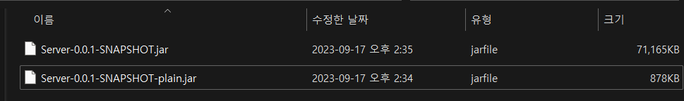

75MB 에서 71MB 로 무려 4MB 나 줄어들었습니다. 의존성이 정말 크기가 크네요. 이제 이미지 빌드 후 ec2 에서 다운로드 받아보겠습니다.

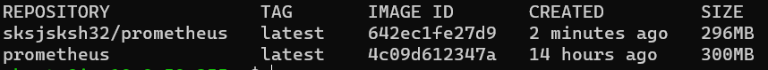

위에 있는 이미지가 필요없는 의존성을 제거한 버전이고, 아래에 있는게 이전 버전입니다. jar 파일을 줄인 크기인 4MB 만큼 딱 줄었습니다.

# 3. 마무리

## 추가적인 작업

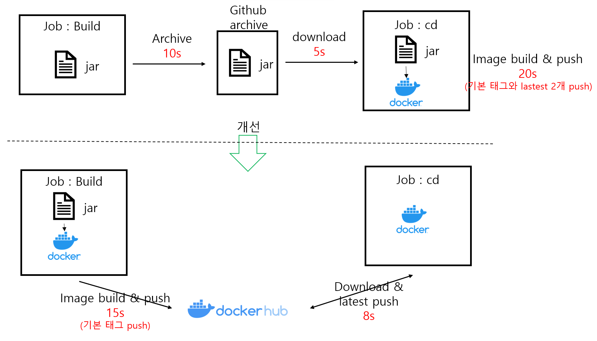

원래는 jar 파일을 `upload-artifact` 로 아카이브 한 뒤 cd 단계에서 다시 다운로드 받고 Docker 로 빌드했는데요. 아카이브와 다운로드 과정이 15초 정도 걸렸습니다. build 단계에서 docker 로 밀어넣는 것까지 하고 cd 단계에서 해당 이미지를 받아온 뒤 태그만 latest 로 변경하도록 했습니다. 최종적으로 10초 내외가 단축되었습니다.

왠지 모르겠지만 archive 를 하는 것보다 그냥 Docker hub 에 push 하고 Pull 하는 게 시간이 더 절약되는 것 같습니다. 물론 네트워크 트래픽 비용이 발생한다면 해당 비용도 고려해야겠습니다.

## 결과

1. CICD 시간 감소 (약 1분 20초 감소)

   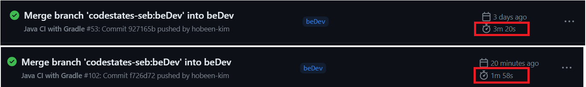

2. 이미지 크기 감소 (731MB -> 296MB, 약 60% 감소)

   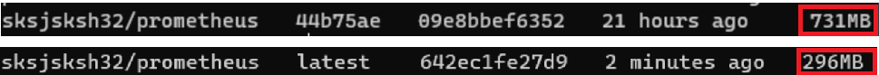

목표가 git actions 2분 안쪽이었는데 목표를 달성했네요. 다음에 또 길어지면 그때 손보겠습니다.