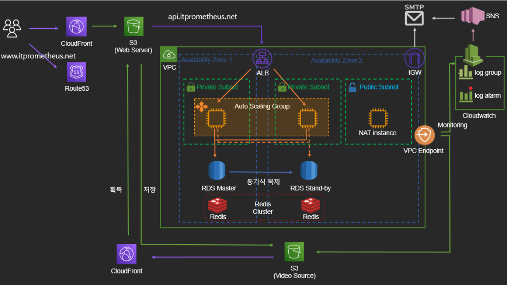
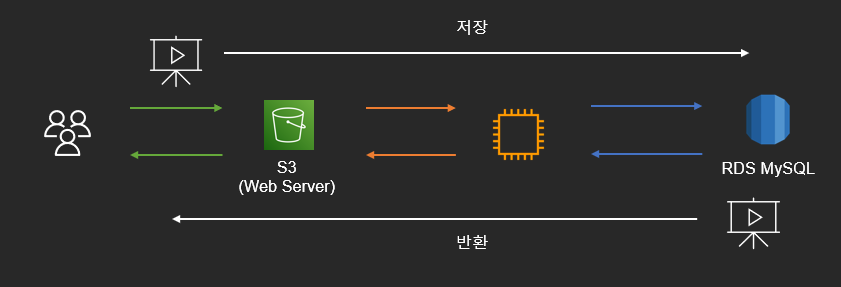
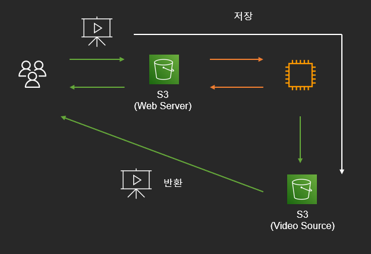
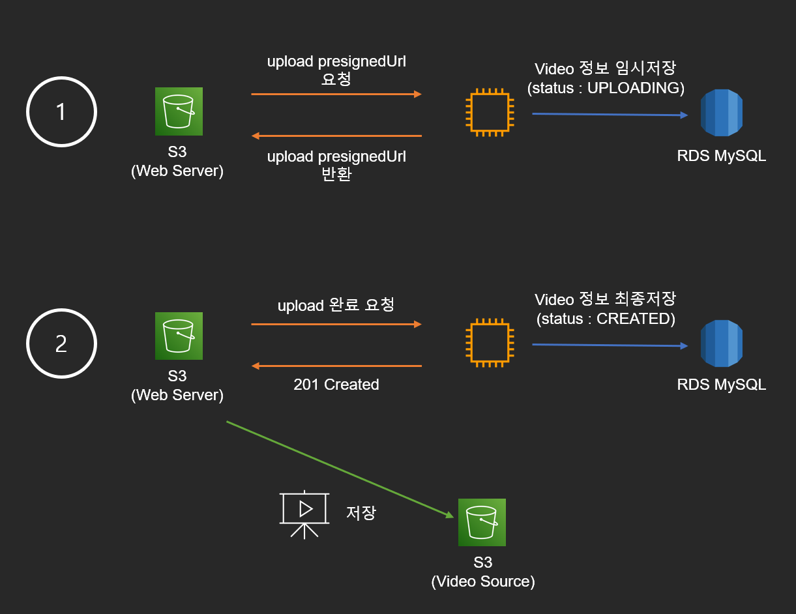
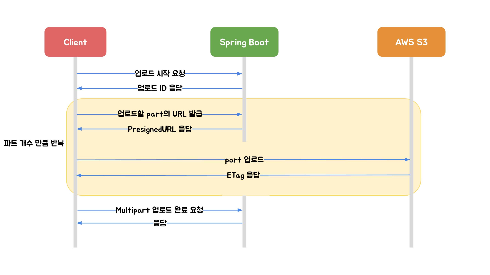

# 1. 아키텍처



팀 프로젝트의 아키텍처입니다. 아래는 README.md 에 있는 간단한 아키텍처 설명입니다. 해당 아키텍처를 만드는 도중 **`정적 파일 저장을 어디에, 어떻게 할 것인가` 에 대한 고민과 해결 과정을 이번 포스팅에 담았습니다.**

### 웹 클라이언트

- S3 버킷에 웹 서버 배포
- CloudFront 와 Route53 을 통해 라우팅, HTTPS 서버 구축, 정적 파일 캐싱

### 애플리케이션 서버

- private subnet 에 외부와 격리하여 배포, NAT instance 로 아웃바운드 통신
- Load Balancer 와 Auto Scaling Group 으로 트래픽 분산, 가용성 확보

### 데이터 베이스

- RDS(MySQL) 이중화 구성, Redis Cluster 구축

### CloudWatch

- API, DB 응답 시간 확인
- 에러 로그 로깅
- ASG 메모리 및 CPU, 각 요청별 응답 시간 모니터링 (대시보드 활용)

### 정적 리소스 파일

- 클라이언트가 직접 s3 버킷에 업로드 (presignedUrl 활용)
- CloudFront 로 파일 캐싱

# 2. 문제 상황

​	프로젝트의 핵심은 **"비디오 영상 서비스"** 입니다. 따라서 비디오 파일을 <u>어디에, 어떻게 저장하고 어떻게 보여줄 것인가</u>가 이 아키텍처의 핵심입니다. 그리고 아래처럼 나누어서 생각해보았습니다.

각 선택지의 기준은 보편적으로 사용하는 방식과 함께 기술적 난이도를 고려했습니다.

1. 어디에 저장할 것인가? MySQL <-> S3
2. 어떻게 저장할 것인가? 서버에서 통제해서 업로드 <-> 클라이언트에서 직접 업로드
3. 어떻게 보여줄 것인가? 저장 위치만 반환 <-> 정적 파일을 직접 반환

각 경우의 수를 조합하면 총 8가지지만, 고려되지 않는 것도 있습니다. 예를 들어 MySQL 에 저장했는데 클라이언트에서 직접 업로드하기에는 DB 를 노출할 수 없죠. 가능한 선택지에서 하나씩 살펴보겠습니다.

## MySQL 에 저장하고 서버를 통과하는 업로드/다운로드



간단하게 표현했습니다. 아키텍처 설계 자체는 제일 간단하고 저장 서버를 이원화하지 않습니다. 하지만 이 방법에는 몇 가지 문제가 있습니다.

1. RDS 에서 가져오는 데 **많은 시간 소요** -> DB 및 네트워크 성능 저하
2. 데이터베이스의 **용량이 급격히 증가**
3. **네트워크 비용 증가**(EC2 -> User) *\*RDS -> EC2 는 같은 AZ 로 무료*

>  정적 파일은 당연히 MySQL 에 저장하지 않는다는 생각을 하고 있었는데, 지금 시점에서 생각해보면 <u>하나의 Trade-off 지점이 있지 않을까</u> 생각합니다. 정적 파일 크기가 매우 작고(수십 ~ 수백 kb), 요청도 적고(관리자 페이지) 필요한 공간도 크지 않다면? 저장 서버를 이원화할 필요가 있을까 생각이 듭니다. 

## S3 에 저장하고 서버에서 업로드 및 저장 위치만 반환 (with presignedUrl)



서버에서 영상파일을 받아서 S3 에 저장하고, User 는 해당 파일의 presignedUrl 을 반환받아 접근하는 방식입니다. 스프링의 MultipartFile 업로드를 생각했고, 장/단점은 아래와 같습니다.

**장점**

- 파일에 대한 제어 가능(형식의 변환, 파일 업로드 위치 등)

**단점**

- 정적파일 저장에 따른 많은 리소스 소요 (네트워크, 디스크 등)
- 많은 요청 시 처리 지연으로 스레드의 고갈 위험성
- 업로드 시간 증가

Video 의 크기를 500MB 라고 했을 때, <u>현재 EC2 프리티어의 EBS 는 8GB 이므로 산술적으로 16개 정도의 요청이면 스레드가 고갈되기 전에 디스크가 고갈</u>될 수도 있습니다. 물론 OS 및 다른 프로그램이 차지하는 용량을 빼면 더 적겠죠.

## S3 에 저장하고 클라이언트에서 업로드 및 다운로드 (with presignedUrl)


서버에서는 S3 로 업로드(put 요청)를 할 수 있는 PresignedUrl 을 클라이언트에게 반환합니다. 그러면 client 는 S3 에 정적 파일을 올립니다. 장단점은 아래와 같습니다.

**장점**

- 서버 부하 감소, 리소스 절약(네트워크 비용, 스레드 및 디스크 사용 등)
- 업로드 시간 감소

**단점**

- 클라이언트가 직접 S3 에 접근하기 때문에 보안 통제가 취약해짐
- 파일에 대한 통제 불가능
- **서버와 클라이언트 데이터 일관성 문제**

여기서 가장 큰 문제는 데이터 일관성 문제였습니다. 

1. presignedUrl 을 받아놓고 정적 파일을 업로드했다고 서버에게 알려줬지만 실제로 정적파일을 업로드하지 않은 경우
2. presignedUrl 로 정적파일을 업로드 했지만 서버에 업로드했다고 알려주지 않은 경우

해당 아키텍처의 과정 자체가 클라이언트 측에서 대부분 이루어지다보니 서버에서는 S3 의 데이터가 서버가 알고 있는 것과 정확한지 최종적으로 확인하는 로직이 필요했습니다.

# 3. 해결

위 3가지를 선택지에 놓고 아키텍처를 선택했습니다. 선택할 당시는 지금 시점으로 한달 전이라서 당시 선택이 최선인줄 알았는데요. 지금 다시 찾아보니 더 좋은 방법이 있긴 했습니다. 여기에 대해선 4번 "추후 과제" 부분에서 후술하겠습니다. (`AWS Multipart 업로드` 내용입니다.)

## 아키텍처 선택

결론적으로 **클라이언트 측에서 S3 에 업로드하고 다운로드 받는 아키텍처를 선택**했습니다. 그 이유는 다음과 같습니다.

1. MySQL 에 저장하고 반환하기에는 리소스 소모가 크고 비용이 많이 듦
2. 서버에서 S3 에 직접 저장하면 요청이 몰릴 때 프리티어 리소스로 감당할 수 없음
3. 데이터 정합성 로직은 추가하면 됨

> 프리티어 기준 MySQL(t3.micro) 과 S3(standard) 비용 비교입니다.
>
> S3 는 5GB 까지 무료이고 이후 GB 당 0.023\$ 입니다. MySQL 은 20GB 까지 무료이고 이후 GB 당 0.135\$ 입니다. 따라서 23GB 정도까지는 MySQL 이 유리하고, 그 이후부터는 S3 가 유리합니다.
>
> 초기 실 사용자를 잠정적으로 1000명이라고 생각했었는데요. 한명 당 200MB 영상 3개씩만 올려도 600GB 로 S3 가 유리하겠습니다.
>
> 물론 용량만 비교하면 그렇고, 실제 서버 네트워크 비용이나 리소스 비용은 생각하지 않은 계산입니다.

## 아키텍처의 문제 해결

제가 해결한 방법은 아래와 같습니다. 먼저 아래와 같이 비디오 업로드 과정을 이원화했습니다. (더 간단하게 Client, Server 만 그렸습니다.)



1. 먼저 presignedUrl 을 요청하면 서버는 최소한의 정보(video 제목) 로 MySQL 에 video 정보를 저장하고 상태를 UPLOADING 으로 저장합니다. 그리고 클라이언트측으로 파일을 업로드할 수 있는 presignedUrl 을 반환합니다.
2. 클라이언트측은 S3 에 파일을 올리고 나서 upload 가 완료되었다고 서버에 알려줍니다. 그러면 서버는 Video 를 최종적으로 CREATED 로 변경합니다.

### 클라이언트에서 S3 에는 올렸는데 서버에 최종 완료 요청을 보내지 않은 경우

이 경우에는 Video 의 상태가 UPLOADING 입니다. 

1. 배치 작업을 통해 매일 새벽 1시마다 UPLOADING 상태인 Video 를 삭제합니다. 
2. S3 정적 파일 서버의 해당 Video 위치에 파일이 업로드되었는지 확인하고 해당 파일을 삭제해줍니다.

### 클라이언트에서 S3 에 올리지 않았는데 서버에 최종 완료 요청을 보낸 경우

1. Video 최종 완료 처리 시 S3 버킷에 해당 파일이 업로드되었는지 확인합니다. 업로드되지 않았다면 예외를 반환하고 video 를 UPLOADING 상태로 유지합니다. 
2. 새벽 1시에 MySQL 에 있는 해당 Video 정보는 배치작업으로 삭제됩니다.

# 4. 코드 레벨

지금까지 설명드린 내용은 `VideoService`, `AwsService`, `CancelVideoJobConfig` 등에서 관여하는 코드가 많은데 AwsService 인터페이스만 보면 설명이 편할 것 같습니다.

## AwsService

아키텍처 문제 해결을 위해 필요한 Aws 메서드들입니다.

```java
package com.server.module.s3.service;

import com.server.module.s3.service.dto.FileType;
import com.server.module.s3.service.dto.ImageType;

public interface AwsService {

    String getFileUrl(String fileName, FileType fileType);

    String getUploadVideoUrl(Long memberId, String fileName);

    String getPublicUploadUrl(Long memberId, String fileName, FileType fileType, ImageType imageType);

    void deleteFile(String fileName, FileType fileType);

    boolean isExistFile(String fileName, FileType fileType);
}
```

1. `getFileUrl` 메서드는 MySQL 에 저장된 fileName 으로 S3 위치를 반환합니다. 이때 video 의 위치는 `presignedUrl` 로 반환되고, 인증이 필요없는 파일(프로필, 비디오 썸네일 등) 은 public 주소로 반환됩니다.
2. `getUploadVideoUrl`, `getPublicUploadUrl` 은 **업로드를 위한 `presignedUrl` 을 반환**합니다.
3. `deleteFile` 은 해당 파일을 삭제합니다.
4. `isExistFile` 메서드는 해당 파일이 존재하는지 확인합니다. <u>`HEAD` Http Method 를 통해 파일을 읽지 않고 존재여부를 확인할 수 있습니다.</u>

이를 이용한 비디오 생성 로직은 아래와 같습니다.

1. 클라이언트는 Video 업로드를 위한 presignedUrl 을 서버로 요청 (videoName 도 함께 반환)
2. 서버는 VideoName 으로 임시 Video 엔티티를 만들고 memberId, videoId 를 조합하여 S3 버킷 내 위치 지정 (UPLOADING 상태)
3. S3 버킷 내 위치로 업로드할 수 있도록 presignedUrl 생성 후 클라이언트에게 반환 (`getUploadVideoUrl` 메서드 활용)
4. 클라이언트는 비디오 업로드 후 업로드를 완료했다고 서버에게 전달
5. 서버는 `isExistFile` 메서드로 비디오가 실제로 업로드되었는지 확인하고 비디오 생성 완료 처리

자세한 내용은 깃허브의 [VideoService](https://github.com/codestates-seb/seb45_main_026/blob/main/Server/src/main/java/com/server/domain/video/service/VideoService.java) 클래스에서 `getVideoCreatedUrl()` 과 `createVideo()` 메서드를 확인해주세요. 

# 5. 추후 과제

저는 이렇게 데이터 정합성을 맞추는 게 맞을까 하는 의문이 들었지만, 짧은 시간 내에 여러 기능을 구현해야 했기 때문에 찝찝함을 남긴 채 다른 기능을 구현해야 했습니다. 하지만 일주일 전(9.21) 에 ["우아한 기술 블로그" 에 올라온 글](https://techblog.woowahan.com/11392/)을 보고 이 방법을 빨리 알았더라면! 하는 생각이 들었습니다.

## Aws Multipart 업로드

이 글에서는 Stream 업로드, 스프링의 Multipart 업로드, Aws Multipart 업로드에 대해 말하고 있습니다. 이중 Aws Multipart 업로드는 아래와 같이 진행됩니다. 간단하게 정리하면 아래와 같습니다.



### 1. Multipart 업로드 시작

멀티파트 업로드 시작(initiate-upload)을 요청하면 서버는 멀티파트 업로드에 대한 고유 식별자인 `Upload ID`를 응답합니다. 부분 업로드, 업로드 완료 또는 업로드 중단 요청 시 항상 `Upload ID`를 포함해야 하기 때문에 클라이언트는 이 값을 잘 저장해야 합니다.

### 2. PresignedURL 발급

업로드를 위한 AWS의 서명된 URL을 발급받는 요청입니다. 멀티파트 시작 요청에서 받은 `Upload ID` 그리고 `PartNumber` 값을 함께 요청해야 합니다. 

### 3. PresignedURL part 업로드

발급받은 `PresignedURL`에 PUT 메소드로 파트의 바이너리를 실어서 요청합니다. 

### 4. Multipart 업로드 완료

멀티파트 업로드 완료는 `Upoad ID`, 각 `PartNumber`와 매칭되는 `ETag` 값이 배열로 포함되어야 합니다. 업로드 완료가 수행되어야 AWS S3에서 `PartNumber`와 `ETag`를 기준으로 객체를 재조립합니다.

### 설계 변경?

해당 블로그에 예제 코드도 있으니 다음에 비슷한 내용을 구현한다면 Aws multipart 업로드를 사용해보겠습니다. 지금 프로젝트에 적용하기에는 힘든 부분이 있는데요. 어쨋든 잘 동작하고 있기 때문입니다. 좋은 설계라는 명목 하에 과도한 리소스(인적 자원 포함) 를 투자하는 것도 좋지 않겠죠. 

그리고 설계 개념 자체는 제가 설계한거랑 Aws multipart 업로드랑 비슷(?) 하다고 생각하기 때문에 데이터 정합성이 틀어지지 않는 이상 급하게 변경할 일은 없을 것 같습니다. 이 내용을 한달만 더 빨리 알았다면 공부하면서 적용해볼텐데요 :smile: 공부만 하고, 적용은 다음에 해보겠습니다.