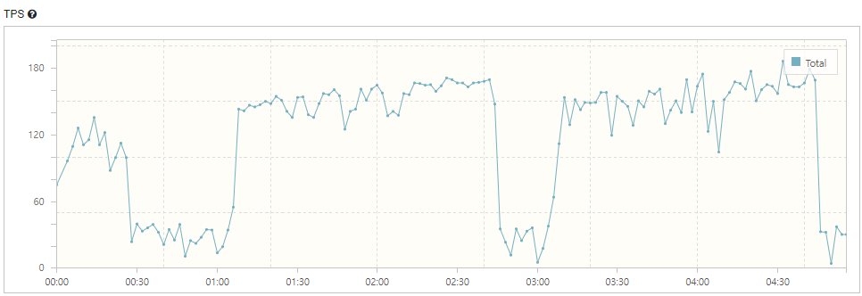
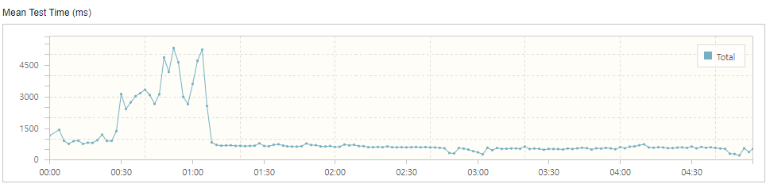
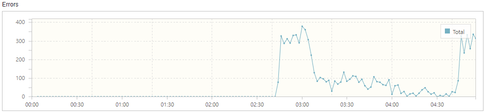
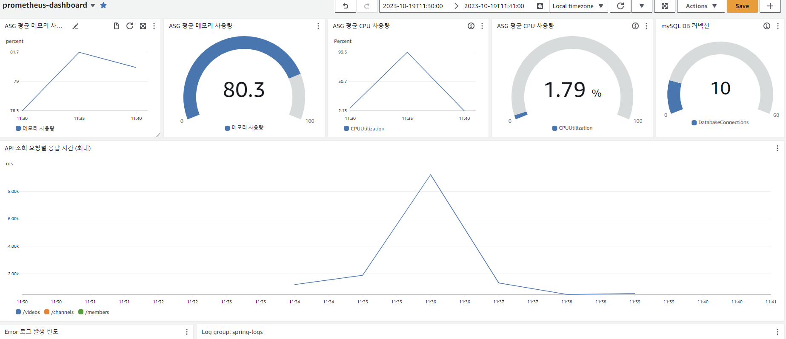
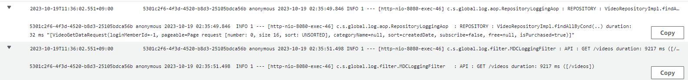
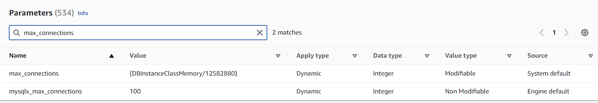
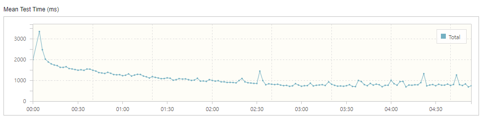
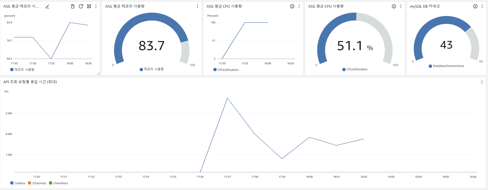
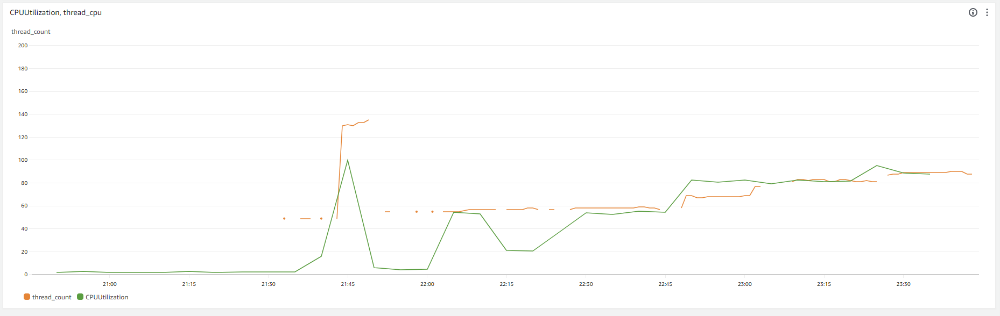

# nGrinder 로 첫 부하 테스트

'IT 프로메테우스' 프로젝트가 마무리되었습니다. 그리고 리팩토링을 제외하고는 비즈니스 로직의 변경이 불가능하므로 이제 부하테스트 및 코드 리팩토링을 하려고 합니다.

첫 단계로 nGrinder 로 활용한 부하테스트를 진행해보았습니다. 먼저 서버 설정은 아래와 같습니다.

## 서버 설정

- **서버** : ec2 t2.micro 1대 (1core 1 vCPU, 1.0GiB RAM, 8GB EBS)
- **DB** : db.t3.micro (1core 2 vCPU, 1.0GiB RAM, 20GB disk)
- **스프링 설정**
  - 톰캣 스레드풀 : spring 기본 설정(기본 스레드 10개, max 200개, Queue 100개)
  - DB 커넥션 : HikariCP 기본설정(기본 및 최대 10개)

## 목표 동시 사용자 수

그리고 동시 사용자 수를 계산해야 하는데 사실 이 부분이 어렵긴 했습니다. 2가지 방법으로 생각해보았습니다. **첫 번째는 서비스 유지에 필요한 동시 사용자 수입니다.** 다음과 같은 방법으로 역추산하였습니다.

1. **유지비** = 서버에 드는 유지 비용 + 인건비
   - 먼저 유지비를 계산합니다. 이익은 못내도 손해는 보지 말아야하니까요. 프리티어 미적용 기준으로, 한달에 약 4만원입니다. 개발이 다 끝나서 저 혼자 유지보수를 한다고 생각하고 인건비는 250만원으로 책정해서 총 유지비는 254만원이 되겠습니다.
2. 접속한 유저 중 몇 명이 실제 구매로 이어지는지 계산 (**실제 구매율**)
   - 그리고 실제로 접속한 유저 중 몇 명이 비디오를 구매할 지 계산합니다. 이 비율을 5% 로 임의로 선정했습니다.
3. **팔아야 하는 비디오 수** = 필요 유지비 / (평균 비디오 판매 금액 * 수수료)
   - 평균 비디오 판매 금액은 현재 DB 에 있는 가격 기준으로 422원이고 수수료는 20%로 책정했습니다. 한 달에 팔아야 하는 비디오 수는 약 3만 개입니다. 하루에 평균 1000개, 12시간 동안 사람들이 접속한다고 가정하고 **한 시간 당 83개가 팔려야 합니다.**
4. **필요 유저 수** = 팔아야 하는 비디오 수 / 실제 구매율
   - 시간 당 83개의 비디오가 팔리려면 **1660**명의 동시 접속자가 있어야 합니다. (평균 1시간 정도 사이트를 이용한다고 가정)

임의의 값이 많지만 이렇게 하면 최소한의 서버 비용을 확보할 수 있는데요. 

**두 번째 방법은 기존 시장의 가치와 접근성, 설문조사, 인식, 잠재적 고객 수 등등 여러 요소를 따져보는 겁니다.** 사실 이 부분이 쉽지 않은데요. 잠재적 고객으로만 계산하면, 국내 개발자가 17만 명입니다. 그리고 주로 주니어 개발자가 접속할테고, 시장에서 선점적인 역할을 하지 못한다고 가정해서 1% 가 활동한다고 하면 1700명이고, 단순 계산으로 시간 당 **141명**입니다. 

저는 **1660명**으로 계산해보겠습니다.

## Little's law

위에서 계산한 동시 사용자 수는 사실 서버에서 감당해야 하는 사용자는 아닙니다. 어떤 사용자는 자신이 원하는 비디오를 찾기 위해 열심히 사이트를 뒤적거리겠지만 다른 사용자는 가만히 비디오를 보고 있을 수도 있습니다. 따라서 적정 **TPS** 를 구해야 합니다. 이를 위해 Little's law 를 적용해보겠습니다.

Little's Law 는 공간 내에 머무르는 사용자(L) 는 사용자가 유입되는 양(λ) 과 사용자가 머무는 시간(W) 에 비례한다는 것입니다. 이를 다시 표현하면 아래와 같습니다.

> 공간 내에 머무르는 객체수(Active User) 는 객체의 유입량(TPS) 과 객체가 머무르는 시간(Response Time) 에 비례한다.
>
> CU(동시사용자) = λ(TPS) X W(Request Time + Think Time)
>
> 여기서 Request Time 은 응답 시간, Think Time 은 웹페이지를 보거나 생각하는 시간입니다.

이제 필요한 TPS 를 구해보겠습니다.

- Request Time = 500ms (임의)
- Think Time = 12s (1인당 1시간에 300회의 요청이 있다고 계산 -> <u>Video 를 보는 시간이 있기 때문에 Think Time 이 높음</u>)

TPS = W / CU 이므로 **138** 이 됩니다. 평균적인 수치일 뿐이며 이벤트, 주로 공부하는 시간(ex. 퇴근 2시간 후) 등 갑자기 트래픽이 몰리는 상황은 아직 고려하지 않았습니다.

# 간단한 테스트와 간단하지 못한 결과

nGrinder 를 사용하는 게 처음이었기 때문에 간단하게 100명의 유저가 `GET : /videos` 로 요청을 보낸다고 가정해보았는데 아래와 같은 결과가 나왔습니다.

## 문제 상황







막연하게 '이정도는 감당할 수 있지 않을까?' 라고 생각하고 보냈기 때문에 Error 에 대해 적잖이 당황했습니다. 

그래프만 보고 제가 생각한 원인은 아래와 같습니다.

1. 서버가 죽었다가 asg 로 새로 만들어짐
2. ALB 에서 반복되는 요청을 차단함(waf 설정?)
3. 톰캣 스레드 풀과 대기큐가 말라버리면서 요청이 거부됨
4. db 커넥션풀이 말라버리면서 스레드 대기시간이 늘어남 -> 스레드 풀이 말라버림
5. 로그 파일로 인해 ebs 용량이 꽉 참
6. cpu 가 많은 스레드를 소화할 컨텍스트 스위치를 하지 못함
7. 쿼리문 문제

이 중 원인이 아니라고 판단한 건 아래와 같습니다.

- 1번 -> ASG Activity history 기록에 새로 인스턴스를 연 기록이 없음
- 2번 -> WAF 를 설정해야 ALB 에서 반복되는 요청을 차단함. 따로 설정한 적이 없음
- 5번 -> EBS 용량 정상

그리고 3, 4, 6, 7번은 개별적인 문제라기보단 서로 관련이 있다고 판단했습니다. 해당 원인들은 아래에서 얘기하고, 그전에 Buckle Zone 에 대해 간단하게 얘기하겠습니다.

### Buckle Zone

 TPS 는 일반적으로 어느 정도까지는 선형적(Linear) 하게 증가하게 됩니다. 하지만 어느 시점 부터는 이러한 TPS가 변동이 없게 되는데, 바로 이 꺽이는 지점이 이 시스템이 낼수 있는 최대 TPS가 됩니다. 사실상 이 꺽이는 지점에 있는 Active User의 수를 넘어서 들어오게 되면 그 차이만큼 시스템에서는 큐잉(Queuing)이 발생하게 된다. 따라서 TPS는 변화가 없이 일정하게 유지됩니다. 이때 최고의 TPS를 나타내는 최초의 Active Client 의 수를 Saturation Point(임계점)이라고 합니다. 또한 임계점을 중심으로 아직 시스템이 자신이 할 수 있는 최대의 TPS의 전 단계를 **Light-Load Zone** 이라고 합니다 이 구간에서의 평균 응답 시간은 일정하게 유지합니다. 특정 Active client 부터는 일정한 TPS가 유지되는 구간이 있는데 이를 **Heavy-Load Zone** 이라고 합니다.

하지만 어떤 시점으로부터는 오히려 TPS 수치가 떨어지는 구간이 나타나고 있는데 이 구간을 **Buckle Zone** 이라고 합니다. 주로 Network나 Server CPU, 메모리 혹은 어플리케이션, DB 의 **병목현상**으로서 인해 나타납니다. 이러한 병목현상을 제거함으로서 saturation Point 을 향상 시킬 수 있습니다.

Buckle Zone 은 크게 3개로, 5분의 부하 테스트에서 30초 구간, 2분 30초 구간, 마지막 구간이 있었습니다.

## 원인 분석



위는 CloudWatch 대시보드입니다. 분석할 수 있는 건 아래와 같습니다.

1. 순간적으로 CPU 사용량이 99%가 되었음 (하지만 서버는 종료되지 않음)
2. 메모리는 최대 81.7% 사용
3. DB 커넥션 풀은 10개를 유지
4. API `GET : /videos` 응답이 최대 9217ms 가 걸림 (해당 시간대는 TPS 그래프 상 약 2분 정도)

그리고 로그도 함께 보았습니다. 아래 로그는 응답 시간이 9217ms 일 때 로그입니다.



로그를 해석하자면, `/videos` 를 호출할 때 수행시간이 `9217ms` 이었는데, 그중 `32ms` 는 db 에 접근하는 repository 수행 시간이라는 겁니다. **즉, 스레드를 할당 받은 후에 서비스 로직이 9초나 걸렸다는 뜻입니다.** (로그는 요청이 스레드를 할당받아야 찍히게 설정되어있습니다.)

### 가설

따라서 저의 생각은 아래와 같습니다.

1. 최초에는 요청이 정상적으로 들어오고 처리되면서 TPS 가 지속 증가
2. 하지만 DB 커넥션풀이 먼저 말라버리면서 응답시간이 늦어짐 (**1차 Buckle Zone**)
3. DB 커넥션풀을 기다리는 스레드가 증가
4. 스레드가 증가하면서 CPU 가 튀어오름
5. 스레드가 MaxPoolSize 도 넘고 Queue 에도 꽉 차면서 요청을 거부하기 시작(**2차 Buckle Zone, Error 증가**)
6. 위 문제가 반복되면서 **3차 Buckle Zone** -> 5분 이상 지속되었다면 계속 문제가 발생했을 것임

## 가설에 따른 문제 해결 방법

1. 스레드 200개는 t2.micro 서버에 부담이 되기 때문에 적정 숫자로 조정 필요
2. HikariCP 는 (기본 커넥션 사이즈 == max 커넥션 사이즈) 이기 때문에 사이즈 증가 필요

### 적정 스레드 개수

mean test time 그래프를 보면 안정되었을 때 500~600ms 정도의 응답시간을 확인할 수 있습니다. 보통 400ms 정도를 목표로 하고 있는데 대략 500ms 로 하겠습니다. 

단순 계산으로 **스레드 수가 100개일 때 초당 500ms 요청 200개를 처리**할 수 있습니다. 요구하는 TPS 가 138 정도이니 스레드가 100개여도 충분하겠다는 생각이 들었습니다. 또한 AWS 에서 CPU 사용 시 크레딧 문제가 있는데 이것도 다음 포스팅에서 알아보겠습니다. 어쨋든 스레드 개수를 100개로 조정해보겠습니다.

아래와 같이 `yml` 을 설정했습니다.

```properties
server:
  tomcat:
    threads:
      max: 100
      min-spare: 20
    max-connections: 8192
    accept-count: 100
    connection-timeout: 20000
```

### 커넥션 개수

서버의 커넥션 개수를 설정하기 전에 먼저 **DB 에서 지원하는 최대 커넥션 개수를 알아야 합니다.** RDB 의 Parameter Group 에서 `max_connections` 를 검색하면 아래와 같은 결과를 얻습니다.



즉 커넥션 개수는 `인스턴스의 메모리 / 12582880` 인데, db.t3.micro 의 메모리는 1GiB 이니 계산해보면 **85개**가 나옵니다. (이 값은 변경 가능하나, AWS 에서 설정한 최적의 개수라고 판단하고 따로 건들지는 않았습니다.) **나중에 서버를 2개로 Scale Out 할 것도 생각해서 절반 정도인 40개를 커넥션으로 할당해보겠습니다.**

```properties
spring:
  datasource:
    hikari:
      maximumPoolSize: 40 # 유휴 및 사용중인 connection을 포함하여 풀에 보관가능한 최대 커넥션 개수
```

## 스레드 및 커넥션 개수 수정 후 nGrinder 테스트


TPS 가 정상적으로 수행되었습니다. Error 는 없었습니다.



응답 시간이 평균 900ms ~ 1000ms 정도로 깁니다. 서비스 로직 상에서 많은 응답시간이 할애되었습니다.



또한 CPU 는 다시 100% 를 찍었습니다.

# CPU 사용량, 응답시간 최적화하기

현재 톰캣의 최대 스레드풀 개수가 100개인데, 다쓴다고 가정해도 CPU 100% 를 찍는 건 과하다고 생각해서 먼저 적정 스레드풀 개수를 먼저 찾아보겠습니다. 이를 위해 필요한 정보는 **실시간 CPU, 실시간 스레드 개수** 두 가지입니다.

그래서 CPU 목표 사용량을 90% 로 잡고 실시간 스레드 개수가 임계점을 초과했을 때 그 개수를 MaxSize 로 할 생각입니다. 이를 위해서 먼저 스레드 개수를 확인하는 모니터링툴이 필요한데, 툴을 사용하기보다는 로깅을 통해서 확인하고 cloudWatch 로 표시했습니다. 아래는 그 결과입니다.


노란색 선이 스레드 개수이고 파란색 선이 CPU 사용량입니다. 총 스레드 개수가 **133개 정도**되면 톰캣 스레드풀이 다 찬 것이고, CPU 사용량도 **100%** 가 되었습니다.

특이한 점은 부하 테스트가 시작되자마자 거의 10초만에 스레드풀이 다 차고 CPU 가 100% 가 되었다는 점입니다. 그렇다면 CPU 는 스레드 130개를 동시에 실행시킬만한 능력이 안되다는 뜻이겠죠. TPS 를 점점 낮춰보면서 CPU 가 100% 가 안되는 지점을 먼저 찾아보겠습니다.

vUser 를 10명부터 20명, 40명, 50명으로 올리면서 테스트한 결과입니다.



결론적으로, 마지막 50명에서 **CPU 약 90% 를 소모하면서 톰캣 스레드 60개 정도를 사용**했습니다. 그리고 당시 **TPS 는 128**, **Mean Test Time 은 419.10 ms** 여서 어느정도 목표치에 근접했습니다. 따라서 스레드풀의 최대 개수를 60개로 조정하려고 했습니다...만 과연 스레드풀의 개수를 조정해야 하는가 의문이 들기도 합니다.

스레드가 60개 이상 사용되면 Context Switching 이 빈번해지면서 CPU 사용률이 100% 가 됩니다. 그러면서 스레드 처리 속도가 느려집니다. 하지만 어쨋든 메모리 사용량은 남아있으니 (80%) 스레드 처리 속도가 느려지는 걸 감안하고 CPU 사용률을 100% 로 사용해도 되지 않을까요. 이 부분은 TPS 를 개선시킨 후에 부하 테스트를 다시해보겠습니다.

# 마치며

목표 TPS 에는 근접했으나 부족한 점이 많이 보입니다. 원래는 ASG 로 서버를 2대까지 늘리면서 확인하려고 했으나, scale-out 은 제일 마지막 선택지라고 생각했습니다. 로직을 개선하고 주어진 자원을 최대한 활용하면서 목표를 달성해야 하고, 그래도 안되면 그 다음이 scale-out 이겠죠.

## TPS 높이기

에러가 나지 않는 TPS 는 높게 잡아도 130 정도입니다. t2.micro 기준으로 다른 분들은 얼마나 TPS 가 나오나 확인해봤는데, 3대의 서버로 270~300 정도 나오는 분도 있고 1대 서버로 500 까지 나오는 분도 봤습니다. (이분은 DB 커넥션도 기본 설정으로 10개던데 로직이 어떻게 된건지 궁금합니다.) 4대의 서버로 1200 까지 나오는 분도 봤구요. 로직에 따라 다르겠지만 TPS 가 200 ~ 300 정도는 나와야하지 않을까 싶기도 합니다. <u>정 안되면 읽기 캐시를 사용해보려고 합니다.</u>

## AWS CPU 크레딧

CPU 를 계속 100% 로 안쓰려고 했던 이유는 T 인스턴스는 AWS CPU 크레딧을 고려해야하기 때문입니다. AWS 에서 T 인스턴스의 CPU 사용은 할당제와 같은 느낌인데요. CPU 를 일정 수준 이상으로 쓰면 나중에 CPU 를 사용에 제한받게 됩니다. 이 부분도 염두에 두어야 하는데, 다음 포스팅에서 알아보겠습니다.

## 실질적인 요청

이번 부하테스트는 `GET : /videos` 에 대한 부하테스트만 진행했습니다. 실제로는 그보다 다양한 요청이 있을건데, 다음에는 주요 API 에 대해서 실질적인 요청이 되도록 해보겠습니다.

## 모니터링 툴

CloudWatch 에서 JVM 을 상세히 확인하기는 어렵습니다. 시간이 된다면 JVM 모니터링 툴을 확인하고 AWS 환경에서 어떻게 적용할지 고민해보겠습니다.
