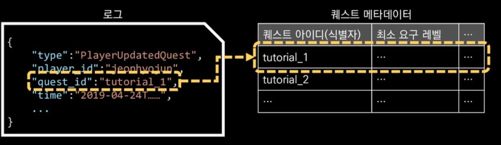
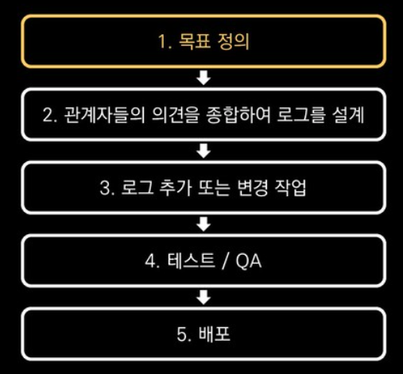

[여기](https://speakerdeck.com/devinjeon/jamag-ndc19-joheun-rogeuran-mueosinga-joheun-rogeureul-wihae-goryeohaeya-hal-geosdeul?slide=26)를 참조했습니다.

# 0. 로그

  로그는 시스템 로그와 서비스 로그로 나뉩니다.

- 시스템 로그 : 프로그램의 버그나 OS 레벨에서 시스템 이벤트를 추적하기 위해 남기는 로그
- 서비스 로그 : 운영하는 서비스에 대한 KIP 와 같은 지표를 분석하기 위해 또는 유저의 CS 에 대응하기 위해 남기는 로그

여기서는 서비스 로그에 대해서만 얘기합니다.

# 1. ''좋은 로그' 에 대한 정의

1. 필요한 정보가 있다.
2. 의미가 명확하다.
3. 편리하게 데이터를 얻을 수 있다.

  위 조건에 반대되는 상황을 꼽자면,

1. 필요한 정보가 없다.
2. 의미를 파악하기 어렵다. -> 이 이벤트는 대체 무슨 의미지?
3. 편리하게 데이터를 얻을 수 없다 -> 값에 여러 데이터가 포함되어 매번 가공 처리를 해야 함

# 2. 필요한 정보가 있는 로그를 위해 고려해야 할 것들

## 2.1 목표가 있는 로그

  로그에는 먼저 목표가 있어야 합니다.

- 목표를 한문장으로 정의하고,
- 하나의 지표에 대해서 다양한 각도로 고민합니다.
- 그리고 목표에 따라 남겨야 할 이벤트와 그 항목들을 정의합니다.

## 2.2 일관성

  일관성이란 같은 구성요소에 대해 같은 항목을 가지는 것을 말합니다. 여기서 구성요소라함은 서비스를 구성하는 각각의 요소를 말합니다. 예를 들어 "아이템 획득" 과 "아이템 사용" 로그가 있을 때, 두 로그 모두 같은 항목으로 구성되어있어야 합니다.

  아래는 일관성 없는 예입니다.

## 2.3 믿을 수 있는 로그

- 로그가 의도한 시점에서 발생했을 것이라는 믿음
- 의도한 대로 데이터가 남았을 것이라는 믿음

# 3. 의미가 명확한 로그를 위해 고려할 것들

## 3.1 이름에 대한 합의와 규약

- 의미를 충분히 표현할 수 있어야 함
- 나중에 이벤트 또는 항목의 이름을 바꾸는 것은 큰 비용이 듦
  - 따라서 길더라도 구체적인 이름을 사용하여 다른 의미와 혼동될만한 가능성을 피하고 미래에 들어가는 이름과 의미가 충돌할 가능성을 낮춤
- 이름을 정하기 위한 최소 규약(Naming convention) 정의

## 3.2 이벤트를 구별하는 기준

- **<상태> 의 시작, <상태> 의 종료로 이벤트를 분류**
  - 의미적으로 명확하게 구분이 가능하지만, 이벤트 종류가 많아짐
  - **시작과 완료 시 항목 구성의 차이가 큰 경우** 적합
  - 
- **<상태> 업데이트**
  - 로그 항목에서 상태변화를 알 수 있는 구조
  - 다음과 같은 경우 좀 더 편리하게 분석할 수 있음
    - 같은 구성요소에 대해 상태만 변함
    - 항목 구성이 비슷함
    - 이력의 변화가 중요
  - 

## 3.3 표현력

- 약간의 데이터 용량 절감을 위해 축약된 표현을 사용하지 않는다.
  - 저장 비용이 크지 않고, 압축 가능
  - 득보다 실이 많을 수 있음
- 경우에 따라 데이터 다입에 대한 고려 필요

## 3.4 빈 값의 의미

  빈 값은 다양하게 해석될 수 있습니다. 아예 정보가 존재하지 않거나, 값이 빈 값일 수 있습니다. 이를 명확히 구분해야 합니다.

# 4. 편리하게 데이터를 얻기 위해 고려할 것들

## 4.1 로그 형식

  일반적으로 Json 형식이 많이 사용됩니다.

## 4.2 메타데이터 사용에 대한 고민

  메타데이터란 서비스를 구성하는 정보에 대해, 식별자와 그상세정보가 매핑된 데이터입니다.

 메타데이터는 좋을 수 있지만, 남용하면 관리가 어려워지고 생산성 저하를 유발합니다. 또한 집계 시마다 로그 외의 다른 데이터를 참조해야 합니다. 아래와 같은 상황에서 사용합니다.

- 정적 데이터가 과도하게 많을 때
- 정의했던 로그의 목표에 필요하지 않은 경우
- 변경 주체가 서비스 제공자에게 있는 경우
- 메타데이터가 불가피하게 많아질 경우

## 4.3 문맥 식별자와 고유 식별자

- 문맥 식별자(Context identifier)
  - 하나의 행동으로 일어난 여러 개의 로그를 한 문맥으로 보여줍니다. (traceId 와 같은 역할)
- 고유 식별자(Unique identifier)
  - 중복 로그를 쉽게 식별
  - 특정한 로그 하날를 기준으로 잡기 편리

# 5. 다른 관점에서 생각해볼 것

**서비스에 대한 영향을 고려해야 합니다.**

  서버에 과도한 부하를 일으킬 수 있는 경우 서버에서 캐싱을 하거나, 모든 유저에 대해 n초마다 발생하는 로그는 샘플링 또는 변경 시에만 남기도록 할 수 있습니다. 

**할 수 있는 것부터**

  남기지 않고 있거나, 잘못 남겨진 데이터는 깔끔히 포기하고, 현 상황에서 최선의 방향과 개선 방향을 찾아야 합니다.

# 6. 로그 품질 관리

## 6.1 로그의 문서화

- 로그의 목표와 의미
- 로그의 정확한 발생 시점
- 각 항목들의 의미와 데이터 타입
- 항목의 추가/변경/삭제 이력
- 특이사항 기록(발생 일시, 내용)
- 로그가 사용되는 곳 (어떤 대시보드에서 어떤 용도로 사용되고 있음 -> 로그의 구조나 의미 변경 시 다른 지표에 대한 영향을 미리 파악할 수 있음)

## 6.2 로그 유실 모니터링

  비정상적인 로그 유실에 대한 감지를 위해 실시간으로 유입 상황과 유실을 모니터링할 수 있어야 하며, 버그 또는 시스템 이슈로 유실된 경우 언제, 얼마나, 어떤 데이터가 유실되었는지 기록해야 합니다.

## 6.3 로그 추가 및 변경의 포르세스화

