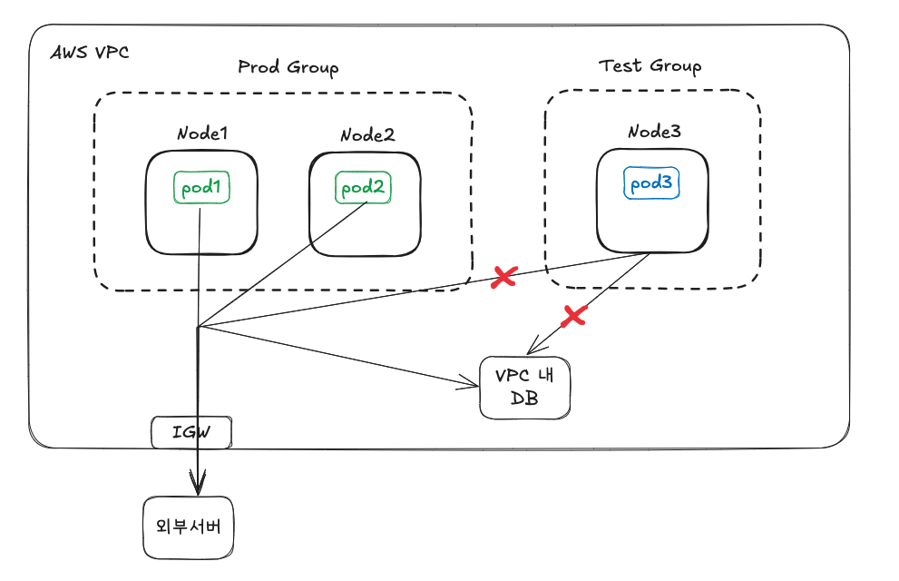
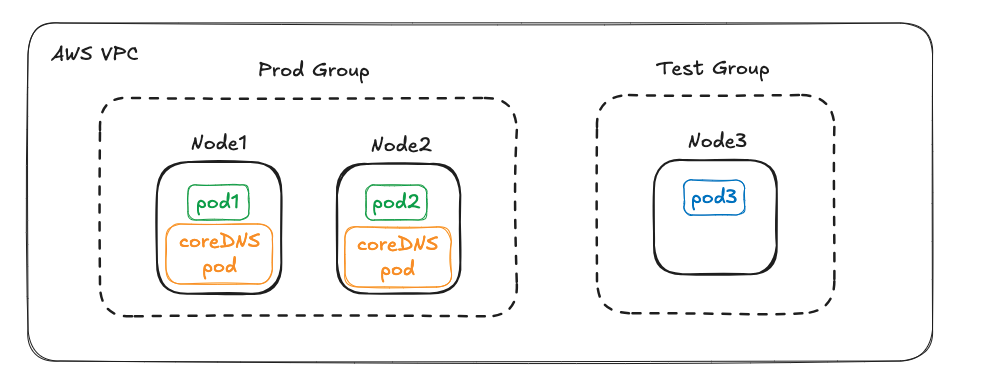

# 0. 문제 상황



Prod 노드그룹에서는 외부서버와 DB 를 잘 호출하는데 Test 노드그룹의 파드에서는 아래와 같은 에러로 호출이 되지 않았습니다.

**Test 파드(Pod3)에서 외부서버 호출 시 에러**

```
2025-01-23T08:10:56.534Z ERROR 1 --- [nio-8080-exec-5] o.a.c.c.C.[.[.[/].[dispatcherServlet]    : Servlet.service() for servlet [dispatcherServlet] in context with path [] threw exception [Request processing failed: org.springframework.web.client.ResourceAccessException: I/O error on GET request for "https://api.example.io/rec/a111": api.example.io] with root cause

java.net.UnknownHostException: api.eigene.io
```

**Test 파드(Pod3)에서 MongoDB 호출 시 에러**

```
ServerSelectionTimeoutError(
pymongo.errors.ServerSelectionTimeoutError: mongodbexample.c5oaf62juy.ap-northeast-2.docdb.amazonaws.com:27017: [Errno -3] Temporary failure in name resolution, Timeout: 30s, Topology Description: <TopologyDescription id: 67909ced38fb6b419822ffa6, topology_type: Single, servers: [<ServerDescription ('mongodbexample.c5oaf62juy.ap-northeast-2.docdb.amazonaws.com', 27017) server_type: Unknown, rtt: None, error=AutoReconnect('eg-interestdetection.c5oadcf62juy.ap-northeast-2.docdb.amazonaws.com:27017: [Errno -3] Temporary failure in name resolution')>]>
```

외부 서버 또는 DB 호출 시 공통적으로 호출하는 api 를 알 수 없다는 에러를 뱉었습니다. dns resolve 가 제대로 이루어지지 않았다는 뜻입니다.

해당 노드로 직접 접속해서 `curl https://api.example.io ` 를 호출했을 때는 정상적으로 작동하는 것으로 보아 파드에서 사용하는 DNS 문제였습니다.

# 1. 문제 원인

문제는 kube-system 에 있는 CoreDNS 에 접근이 되지 않아서였습니다.

```
NAMESPACE                NAME                             READY   STATUS    RESTARTS   AGE
kube-system              coredns-86f5954566-cc9tb         1/1     Running   0          23h
kube-system              coredns-86f5954566-h9xrr         1/1     Running   0          23h
```

## 1.1 kubenetes 의 DNS resolve 방법 (DnsPolicy)

  먼저  k8s의 dns 정책에 대해 확인해보겠습니다. DnsPolicy는 Pod의 DNS 설정을 결정하는 정책입니다. 4가지 주요 옵션이 있습니다.

1. `ClusterFirst` (기본값)
   - 클러스터의 DNS 서비스를 사용
   - 클러스터 도메인에 없는 쿼리는 상위 nameserver로 전달
2. `Default`
   - 노드의 DNS 설정을 그대로 상속
   - 노드의 `/etc/resolv.conf` 사용
3. `ClusterFirstWithHostNet`
   - hostNetwork: true 설정된 Pod용
   - `ClusterFirst`와 동일하게 작동
4. `None`
   - DNS 설정을 수동으로 지정
   - dnsConfig 필드를 통해 커스텀 설정 필요

**적용 방법**

```
apiVersion: v1
kind: Pod
metadata:
  name: dns-example
spec:
  dnsPolicy: "None"
  dnsConfig:
    nameservers:
      - 8.8.8.8
    searches:
      - ns1.svc.cluster.local
    options:
      - name: ndots
        value: "5"
```

### 1.1.1 DnsPolicy: ClusterFirst

기본은 ClusterFisrt 입니다. CoreDNS 파드에 먼저 질의를 한 후 nameserver 에 질의를 합니다. CoreDNS 에서는 쿠버네티스의 서비스명으로 dns 를 해석할 수 있습니다.

## 1.2 CoreDNS 위치

> EKS CoreDNS 관련 자료 : https://docs.aws.amazon.com/ko_kr/eks/latest/userguide/managing-coredns.html

CoreDNS 는 Deployment 로 2개가 배포됩니다.



위에서 Node3 이 Node1 또는 2에 접근이 안된다면 coreDNS 에 접근할 수 없습니다.

## 1.3 CoreDNS 포트

하지만 저는 보안그룹에서 노드 간 모든 포트에서 통신이 가능하도록 열어놨었습니다. (노드에서 오는 TCP 0 - 65535 개방)

그런데 찾아보니 DNS 쿼리는 UDP 53번 포트로 통신했었습니다. 따라서 **문제는 Node3 이 Prod NodeGroup 의 UDP 53번 포트에 접근할 수 없어서 였습니다.**

# 2. 해결

해결 방법은 2가지입니다.

1. Test Group 에도 coreDNS 배포
2. 보안그룹에서 Test Group -> Prod Group UDP 53번 포트 개방

저는 kube-system 의 파드 설정을 건드리기보다 UDP 53번 포트를 개방해 간단하게 해결했습니다.