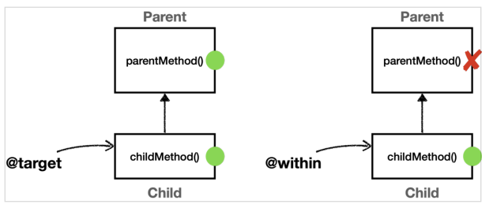
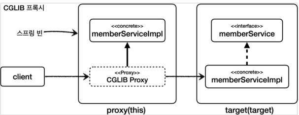

# 0. 포인트컷 지시자

 AspectJ 는 포인트컷을 편리하게 표현하기 위한 특별한 표현식을 제공한다.

ex) `@Pointcut("execution(* hello.aop.order..*(..))")`

**포인트컷 지시자**

포인트컷 표현식은 execution 같은 포인트컷 지시자(Pointcut Designator)로 시작한다. 줄여서 PCD라 한다.

**포인트컷 지시자의 종류**

- **execution** : 메소드 실행 조인 포인트를 매칭한다. 스프링 AOP에서 가장 많이 사용하고, 기능도 복잡하다.
- within : 특정 타입 내의 조인 포인트를 매칭한다. 
- args : 인자가 주어진 타입의 인스턴스인 조인 포인트 
- this : 스프링 빈 객체(스프링 AOP 프록시)를 대상으로 하는 조인 포인트 
- target : Target 객체(스프링 AOP 프록시가 가르키는 실제 대상)를 대상으로 하는 조인 포인트 
- @target : 실행 객체의 클래스에 주어진 타입의 애노테이션이 있는 조인 포인트 
- @within : 주어진 애노테이션이 있는 타입 내 조인 포인트 
- @annotation : 메서드가 주어진 애노테이션을 가지고 있는 조인 포인트를 매칭 
- @args : 전달된 실제 인수의 런타임 타입이 주어진 타입의 애노테이션을 갖는 조인 포인트 
- bean : 스프링 전용 포인트컷 지시자, 빈의 이름으로 포인트컷을 지정한다

# 1. 예제 만들기

포인트 컷 표현식을 이해하기 위한 예제

**ClassAop**

```java
package hello.aop.order.aop.member.annotation;

import java.lang.annotation.ElementType;
import java.lang.annotation.Retention;
import java.lang.annotation.RetentionPolicy;
import java.lang.annotation.Target;

@Target(ElementType.TYPE)
@Retention(RetentionPolicy.RUNTIME)
public @interface ClassAop {
}

```

**MethodAop**

```java
package hello.aop.order.aop.member.annotation;

import java.lang.annotation.ElementType;
import java.lang.annotation.Retention;
import java.lang.annotation.RetentionPolicy;
import java.lang.annotation.Target;

@Target(ElementType.METHOD)
@Retention(RetentionPolicy.RUNTIME)
public @interface MethodAop {
    String value();
}

```

**MemberService**

```java
package hello.aop.order.aop.member;

public interface MemberService {
    String hello(String param);
}

```

**MemberServiceImpl**

```java
package hello.aop.order.aop.member;

import hello.aop.order.aop.member.annotation.ClassAop;
import hello.aop.order.aop.member.annotation.MethodAop;
import org.springframework.stereotype.Component;

@ClassAop
@Component
public class MemberServiceImpl implements MemberService {

    @Override
    @MethodAop("test value")
    public String hello(String param) {
        return "ok";
    }

    public String internal(String param){
        return "ok";
    }
}
```

## Test

**ExecutionTest**

```java
package hello.aop.pointcut;

import hello.aop.order.aop.member.MemberServiceImpl;
import lombok.extern.slf4j.Slf4j;
import org.junit.jupiter.api.BeforeEach;
import org.junit.jupiter.api.Test;
import org.springframework.aop.aspectj.AspectJExpressionPointcut;

import java.lang.reflect.Method;

@Slf4j
public class ExecutionTest {

    AspectJExpressionPointcut pointcut = new AspectJExpressionPointcut();
    Method helloMethod;

    @BeforeEach
    public void init() throws NoSuchMethodException {
        helloMethod = MemberServiceImpl.class.getMethod("hello", String.class);
    }

    @Test
    void printMethod(){
        //public java.lang.String hello.aop.order.aop.member.MemberServiceImpl.hello(java.lang.String)
        log.info("helloMethod = {}", helloMethod);
    }
}

```

- AspectJExpressionPointcut 이 바로 포인트컷 표현식을 처리해주는 클래스다. AspectJExpressionPointcut 는 상위에 Pointcut 인터페이스를 가진다.

# 2. execution 사용 (test)

## execution 문법

```
execution(modifiers-pattern? ret-type-pattern declaring-type-pattern?namepattern(param-pattern)
 throws-pattern?)
 
 --> execution(접근제어자? 반환타입 선언타입?메서드이름(파라미터) 예외?
```

- `?` 가 붙으면 생략가능하다.

## ExecutionTest

`"execution(* 패키지..*(..))"` 로 패키지 하위의 모든 패키지의 메서드에 대해 포인트 컷을 지정할 수 있다.

```java
package hello.aop.pointcut;

import hello.aop.member.MemberServiceImpl;
import lombok.extern.slf4j.Slf4j;
import org.junit.jupiter.api.BeforeEach;
import org.junit.jupiter.api.Test;
import org.springframework.aop.aspectj.AspectJExpressionPointcut;

import java.lang.reflect.Method;

import static org.assertj.core.api.Assertions.*;

@Slf4j
public class ExecutionTest {

    AspectJExpressionPointcut pointcut = new AspectJExpressionPointcut();
    Method helloMethod;

    @BeforeEach
    public void init() throws NoSuchMethodException {
        helloMethod = MemberServiceImpl.class.getMethod("hello", String.class);
    }

    @Test
    void printMethod(){
        //public java.lang.String hello.aop.member.MemberServiceImpl.hello(java.lang.String)
        log.info("helloMethod = {}", helloMethod);
    }

    @Test
    void exactMatch(){
        //정확하게 매칭
        //public java.lang.String hello.aop.member.MemberServiceImpl.hello(java.lang.String)
        pointcut.setExpression("execution(public java.lang.String hello.aop.member.MemberServiceImpl.hello(java.lang.String))");

        assertThat(pointcut.matches(helloMethod, MemberServiceImpl.class)).isTrue();
    }

    @Test
    void allMatch(){
        //가장 많이 생략한 포인트 컷
        pointcut.setExpression("execution(* *(...))");
        assertThat(pointcut.matches(helloMethod, MemberServiceImpl.class)).isTrue();
    }

    @Test
    void nameMatch() {
        //메서드 이름이 hello 인 모든 메서드
        pointcut.setExpression("execution(* hello(..))");
        assertThat(pointcut.matches(helloMethod, MemberServiceImpl.class)).isTrue();
    }

    @Test
    void nameMatchStar1() {
        //메서드 이름이 hel 로 시작하는 모든 메서드
        pointcut.setExpression("execution(* hel*(..))");
        assertThat(pointcut.matches(helloMethod, MemberServiceImpl.class)).isTrue();
    }

    @Test
    void nameMatchStar2(){
        //메서드 이름에 ll 을 포함하는 모든 메서드
        pointcut.setExpression("execution(* *ll*(..))");
        assertThat(pointcut.matches(helloMethod, MemberServiceImpl.class)).isTrue();
    }

    @Test
    void nameMatchFalse(){
        //메서드 이름을 no 로 하여 매칭되는 메서드가 없게 함
        pointcut.setExpression("execution(* no(..))");
        assertThat(pointcut.matches(helloMethod, MemberServiceImpl.class)).isFalse();
    }

    @Test
    void PackageExactMatch1() {
        //hello.aop.member.MemberServiceImpl 하위의 hello 메서드
        pointcut.setExpression("execution(* hello.aop.member.MemberServiceImpl.hello(..))");
        assertThat(pointcut.matches(helloMethod, MemberServiceImpl.class)).isTrue();
    }

    @Test
    void PackageExactMatch2() {
        //hello.aop.member 패키지의 모든 클래스에 대한 hello 메서드
        pointcut.setExpression("execution(* hello.aop.member.*.*(..))");
        assertThat(pointcut.matches(helloMethod, MemberServiceImpl.class)).isTrue();
    }

    @Test
    void PackageExactFalse() {
        //hello.aop 패키지의 모든 클래스에 대한 hello 메서드
        //aop 하위의 클래스에 hello 메서드가 없으므로 오류
        pointcut.setExpression("execution(* hello.aop.*.*(..))");
        assertThat(pointcut.matches(helloMethod, MemberServiceImpl.class)).isFalse();
    }

    @Test
    void PackageMatchSubPackage1() {
        //member 패키지와 그 하위 패키지에 있는 모든 클래스의 모든 메서드
        pointcut.setExpression("execution(* hello.aop.member..*.*(..))");
        assertThat(pointcut.matches(helloMethod, MemberServiceImpl.class)).isTrue();
    }

    @Test
    void PackageMatchSubPackage2() {
        //aop 패키지와 그 하위 패키지에 있는 모든 클래스의 모든 메서드
        pointcut.setExpression("execution(* hello.aop..*.*(..))");
        assertThat(pointcut.matches(helloMethod, MemberServiceImpl.class)).isTrue();
    }


}
```

- `hello.aop.member.*(1).*(2)` : (1) 타입 (2) 메서드 이름

# 3. execution 사용 2 (test)

```java
@Test
void typeExactMatch() {
    //타입에 정확히 매칭
    pointcut.setExpression("execution(* hello.aop.member.MemberServiceImpl.*(..))");
    assertThat(pointcut.matches(helloMethod, MemberServiceImpl.class)).isTrue();
}

@Test
void typeMatchSuperType() {
    //부모타입에 매칭해도 자식 타입도 포함 (MemberService)
    pointcut.setExpression("execution(* hello.aop.member.MemberService.*(..))");
    assertThat(pointcut.matches(helloMethod, MemberServiceImpl.class)).isTrue();
}

@Test
void typeMatchInternal() throws NoSuchMethodException {
    //MemberServiceImpl 의 내부 메서드도 포함
    pointcut.setExpression("execution(* hello.aop.member.MemberServiceImpl.*(..))");
    Method internalMethod = MemberServiceImpl.class.getMethod("internal", String.class);
    assertThat(pointcut.matches(internalMethod, MemberServiceImpl.class)).isTrue();
}

@Test
void typeMatchNoSuperTypeMethodFalse() throws NoSuchMethodException {
    //부모타입(MemberService) 에서 선언하지 않은 자식타입(MemberServiceImpl) 의 메서드는 포함되지 않음
    pointcut.setExpression("execution(* hello.aop.member.MemberService.*(..))");
    Method internalMethod = MemberServiceImpl.class.getMethod("internal", String.class);
    assertThat(pointcut.matches(internalMethod, MemberServiceImpl.class)).isFalse();
}

@Test
void argsMatch(){
    //String 타입인 파라미터 허용
    pointcut.setExpression("execution(* *(String))");
    assertThat(pointcut.matches(helloMethod, MemberServiceImpl.class)).isTrue();
}

@Test
void argsMatchNoArgs(){
    //파라미터가 없어야 함
    pointcut.setExpression("execution(* *())");
    assertThat(pointcut.matches(helloMethod, MemberServiceImpl.class)).isFalse();
}

@Test
void argsMatchStar(){
    //정확히 하나의 파라미터 허용, 모든 타입 허용
    pointcut.setExpression("execution(* *(*))");
    assertThat(pointcut.matches(helloMethod, MemberServiceImpl.class)).isTrue();
}

@Test
void argsMatchAll(){
    //(), (xxx), (xxx, xxx) 모두 허용
    //숫자와 무관하게 모든 파라미터, 모든 타입 허용
    pointcut.setExpression("execution(* *(..))");
    assertThat(pointcut.matches(helloMethod, MemberServiceImpl.class)).isFalse();
}

@Test
void argsMatchComplex(){
    //(String), (String, xxx), (String, xxx, xxx) 모두 허용
    //String 타입으로 시작, 숫자와 무관하게 모든 파라미터, 모든 타입 허용
    pointcut.setExpression("execution(* *(String, ..))");
    assertThat(pointcut.matches(helloMethod, MemberServiceImpl.class)).isTrue();
}

@Test
void argsMatchComplex2(){
    //(String, xxx) 허용, 파라미터 개수는 2개
    //String 타입으로 시작, 숫자와 무관하게 모든 파라미터, 모든 타입 허용
    pointcut.setExpression("execution(* *(String, *))");
    assertThat(pointcut.matches(helloMethod, MemberServiceImpl.class)).isFalse();
}
```

**execution 파라미터 매칭 규칙** 

- (String) : 정확하게 String 타입 파라미터 
- () : 파라미터가 없어야 한다. 
- (\*) : 정확히 하나의 파라미터, 단 모든 타입을 허용한다. 
- (\*, \*) : 정확히 두 개의 파라미터, 단 모든 타입을 허용한다. 
- (..) : 숫자와 무관하게 모든 파라미터, 모든 타입을 허용한다. 참고로 파라미터가 없어도 된다. 0..* 로 이해하면 된다. 
- (String, ..) : String 타입으로 시작해야 한다. 숫자와 무관하게 모든 파라미터, 모든 타입을 허용한다. 
  - 예) (String) , (String, Xxx) , (String, Xxx, Xxx) 허용
- (String, \*) : String 타입으로 시작해야 하며 두 개의 파라미터만 허용한다.

# 4. Within 문법

within 지시자는 특정 타입 내의 조인 포인트들로 매칭을 제한한다. 쉽게 이야기해서 해당 타입이 매칭되면 그 안의 메서드(조인 포인트)들이 자동으로 매칭된다. 문법은 단순한데 execution 에서 타입 부분만 사용한다고 보면 된다.

```java
package hello.aop.pointcut;

import hello.aop.member.MemberServiceImpl;
import lombok.experimental.StandardException;
import org.assertj.core.api.Assertions;
import org.junit.jupiter.api.BeforeEach;
import org.junit.jupiter.api.Test;
import org.springframework.aop.aspectj.AspectJExpressionPointcut;

import java.lang.reflect.Method;

import static org.assertj.core.api.Assertions.*;

public class WithinTest {

    AspectJExpressionPointcut pointcut = new AspectJExpressionPointcut();
    Method helloMethod;

    @BeforeEach
    public void init() throws NoSuchMethodException {
        helloMethod = MemberServiceImpl.class.getMethod("hello", String.class);
    }

    @Test
    void withinExact() {
        //hello.aop.member.MemberServiceImpl 클래스 내에 있는 모든 메서드
        pointcut.setExpression("within(hello.aop.member.MemberServiceImpl)");
        assertThat(pointcut.matches(helloMethod, MemberServiceImpl.class)).isTrue();
    }

    @Test
    void withinStar(){
        pointcut.setExpression("within(hello.aop.member.*Service*)");
        assertThat(pointcut.matches(helloMethod, MemberServiceImpl.class)).isTrue();
    }

    @Test
    void withinSubPackage() {
        //hello.aop 패키지와 그 하위 패키지에 있는 모든 클래스의 모든 메서드
        pointcut.setExpression("within(hello.aop..*)");
        assertThat(pointcut.matches(helloMethod, MemberServiceImpl.class)).isTrue();
    }

    @Test
    void withinSuperTypeFalse() {
        //타겟의 타입에만 직접 적용되며 인터페이스를 선정하면 안됨
        pointcut.setExpression("within(hello.aop.member.MemberService)");
        assertThat(pointcut.matches(helloMethod, MemberServiceImpl.class)).isFalse();
    }

    @Test
    void executionSuperTypeTrue() {
        //위와 달리 execution 은 타입 기반으로, 인터페이스 선정이 가능
        pointcut.setExpression("execution(* hello.aop.member.MemberService.*(..))");
        assertThat(pointcut.matches(helloMethod, MemberServiceImpl.class)).isTrue();
    }
}

```

# 5. args 문법

메서드의 args 로 판단하는 문법이다. 많이 쓰이지 않는다. 사용법은 아래와 같다.

```java
package hello.aop.pointcut;
import hello.aop.member.MemberServiceImpl;
import org.junit.jupiter.api.BeforeEach;
import org.junit.jupiter.api.Test;
import org.springframework.aop.aspectj.AspectJExpressionPointcut;
import java.lang.reflect.Method;
import static org.assertj.core.api.Assertions.assertThat;

public class ArgsTest {

    Method helloMethod;
    @BeforeEach
    public void init() throws NoSuchMethodException {
        helloMethod = MemberServiceImpl.class.getMethod("hello", String.class);
    }
    private AspectJExpressionPointcut pointcut(String expression) {
        AspectJExpressionPointcut pointcut = new AspectJExpressionPointcut();
        pointcut.setExpression(expression);
        return pointcut;
    }
    @Test
    void args() {
        //hello(String)과 매칭
        assertThat(pointcut("args(String)")
                .matches(helloMethod, MemberServiceImpl.class)).isTrue();
        //String 타입은 Object 의 자식타입이므로 허용됨
        assertThat(pointcut("args(Object)")
                .matches(helloMethod, MemberServiceImpl.class)).isTrue();
        //기본적인 내용은 exucution 의 파라미터와 같다
        assertThat(pointcut("args()")
                .matches(helloMethod, MemberServiceImpl.class)).isFalse();
        assertThat(pointcut("args(..)")
                .matches(helloMethod, MemberServiceImpl.class)).isTrue();
        assertThat(pointcut("args(*)")
                .matches(helloMethod, MemberServiceImpl.class)).isTrue();
        assertThat(pointcut("args(String,..)")
                .matches(helloMethod, MemberServiceImpl.class)).isTrue();
    }
    /**
     * execution(* *(java.io.Serializable)): 메서드의 시그니처로 판단 (정적)
     * args(java.io.Serializable): 런타임에 전달된 인수로 판단 (동적)
     */
    @Test
    void argsVsExecution() {
        //Args
        assertThat(pointcut("args(String)")
                .matches(helloMethod, MemberServiceImpl.class)).isTrue();
        //String 의 부모타입은 Serializable 로도 정상 실행됨
        assertThat(pointcut("args(java.io.Serializable)")
                .matches(helloMethod, MemberServiceImpl.class)).isTrue();
        assertThat(pointcut("args(Object)")
                .matches(helloMethod, MemberServiceImpl.class)).isTrue();
        //Execution
        assertThat(pointcut("execution(* *(String))")
                .matches(helloMethod, MemberServiceImpl.class)).isTrue();
        assertThat(pointcut("execution(* *(java.io.Serializable))") //매칭 실패
                .matches(helloMethod, MemberServiceImpl.class)).isFalse();
        assertThat(pointcut("execution(* *(Object))") //매칭 실패
                .matches(helloMethod, MemberServiceImpl.class)).isFalse();
    }
}
```


# 6. @target, @within

주어진 타입의 어노테이션이 있는지 확인하여 pointcut 을 적용합니다.

**@target vs @within** 

- @target 은 인스턴스의 모든 메서드를 조인 포인트로 적용한다. 
- @within 은 해당 타입 내에 있는 메서드만 조인 포인트로 적용한다.

쉽게 이야기해서 @target 은 부모 클래스의 메서드까지 어드바이스를 다 적용하고, @within 은 자기 자신의 클래스에 정의된 메서드에만 어드바이스를 적용한다



**AtTargetAtWithinTest**

```java
package hello.aop.pointcut;
import hello.aop.member.annotation.ClassAop;
import lombok.extern.slf4j.Slf4j;
import org.aspectj.lang.ProceedingJoinPoint;
import org.aspectj.lang.annotation.Around;
import org.aspectj.lang.annotation.Aspect;
import org.junit.jupiter.api.Test;
import org.springframework.beans.factory.annotation.Autowired;
import org.springframework.boot.test.context.SpringBootTest;
import org.springframework.context.annotation.Bean;
import org.springframework.context.annotation.Import;

@Slf4j
@Import({AtTargetAtWithinTest.Config.class})
@SpringBootTest
public class AtTargetAtWithinTest {

    @Autowired
    Child child;
    @Test
    void success() {
        log.info("child Proxy={}", child.getClass());
        child.childMethod(); //부모, 자식 모두 있는 메서드
        child.parentMethod(); //부모 클래스만 있는 메서드
    }
    static class Config {
        @Bean
        public Parent parent() {
            return new Parent();
        }
        @Bean
        public Child child() {
            return new Child();
        }
        @Bean
        public AtTargetAtWithinAspect atTargetAtWithinAspect() {
            return new AtTargetAtWithinAspect();
        }
    }

    static class Parent {
        public void parentMethod(){} //부모에만 있는 메서드
    }

    @ClassAop
    static class Child extends Parent {
        public void childMethod(){}
    }

    @Slf4j
    @Aspect
    static class AtTargetAtWithinAspect {
        //@target: 인스턴스 기준으로 모든 메서드의 조인 포인트를 선정, 부모 타입의 메서드도 적용
        @Around("execution(* hello.aop..*(..)) && @target(hello.aop.member.annotation.ClassAop)")
            public Object atTarget(ProceedingJoinPoint joinPoint) throws Throwable
            {
                log.info("[@target] {}", joinPoint.getSignature());
                return joinPoint.proceed();
            }

        //@within: 선택된 클래스 내부에 있는 메서드만 조인 포인트로 선정, 부모 타입의 메서드 적용되지 않음
        @Around("execution(* hello.aop..*(..)) && @within(hello.aop.member.annotation.ClassAop)")
        public Object atWithin(ProceedingJoinPoint joinPoint) throws Throwable
        {
            log.info("[@within] {}", joinPoint.getSignature());
            return joinPoint.proceed();
        }
    }

```

**실행 결과**

```
[@target] void hello.aop.pointcut.AtTargetAtWithinTest$Child.childMethod()
[@within] void hello.aop.pointcut.AtTargetAtWithinTest$Child.childMethod()
[@target] void hello.aop.pointcut.AtTargetAtWithinTest$Parent.parentMethod()
```

parentMethod() 는 Parent 클래스에만 정의되어 있고, Child 클래스에 정의되어 있지 않기 때문에 @within 에서 AOP 적용 대상이 되지 않는다. 실행결과를 보면 child.parentMethod() 를 호출 했을 때 [@within] 이 호출되지 않은 것을 확인할 수 있다.

> **주의** 
>
>  다음 포인트컷 지시자는 단독으로 사용하면 안된다. args, @args, @target 
>
> 이번 예제를 보면 execution(* hello.aop..*(..)) 를 통해 적용 대상을 줄여준 것을 확인할 수 있다. args , @args , @target 은 실제 객체 인스턴스가 생성되고 실행될 때 어드바이스 적용 여부를 확인할 수 있다.
>
> 실행 시점에 일어나는 포인트컷 적용 여부도 결국 프록시가 있어야 실행 시점에 판단할 수 있다. 프록시가 없다면 판단 자체가 불가능하다. 그런데 스프링 컨테이너가 프록시를 생성하는 시점은 스프링 컨테이너가 만들어지는 애플리케이션 로딩 시점에 적용할 수 있다. 따라서 args , @args , @target 같은 포인트컷 지시자가 있으면 스프링은 모든 스프링 빈에 AOP를 적용하려고 시도한다. 앞서 설명한 것 처럼 프록시가 없으면 실행 시점에 판단 자체가 불가능하다. 
>
> 문제는 이렇게 모든 스프링 빈에 AOP 프록시를 적용하려고 하면 스프링이 내부에서 사용하는 빈 중에는 final 로 지정된 빈들도 있기 때문에 오류가 발생할 수 있다. 
>
> 따라서 이러한 표현식은 최대한 프록시 적용 대상을 축소하는 표현식과 함께 사용해야 한다.

# 7. @annotation, @args

**@annotation** : 메서드가 주어진 애노테이션을 가지고 있는 조인 포인트를 매칭

```java
package hello.aop.pointcut;

import hello.aop.member.MemberService;
import lombok.extern.slf4j.Slf4j;
import org.aspectj.lang.ProceedingJoinPoint;
import org.aspectj.lang.annotation.Around;
import org.aspectj.lang.annotation.Aspect;
import org.junit.jupiter.api.Test;
import org.springframework.beans.factory.annotation.Autowired;
import org.springframework.boot.test.context.SpringBootTest;
import org.springframework.context.annotation.Import;

@Slf4j
@Import({AtAnnotationTest.AtAnnotationAspect.class})
@SpringBootTest
public class AtAnnotationTest {

    @Autowired
    MemberService memberService;

    @Test
    void success() {
        log.info("memberService={}", memberService.getClass());
        memberService.hello("helloA");
    }

    @Slf4j
    @Aspect
    static class AtAnnotationAspect {

        @Around("@annotation(hello.aop.member.annotation.MethodAop)")
        public Object doAtAnnotation(ProceedingJoinPoint joinPoint) throws Throwable {
            log.info("[@annotation] {}", joinPoint.getSignature());
            return joinPoint.proceed();
        }
    }

}
```

실행 결과 : `[@annotation] String hello.aop.member.MemberService.hello(String)`


**@args** : 전달된 실제 인수의 런타임 타입이 주어진 타입의 애노테이션을 갖는 조인 포인트

- ex)  @args(test.Check) : 전달된 인수의 런타임 타입에 @Check 애노테이션이 있는 경우에 매칭한다.


# 8. bean

**bean** : 스프링 전용 포인트컷 지시자, 빈의 이름으로 지정한다.

- 스프링 빈의 이름으로 AOP 적용 여부를 지정한다. 이것은 스프링에서만 사용할 수 있는 특별한 지시자이다.
- `bean(orderService) || bean(*Repository)` 과 같이 사용할 수 있다.

```java
package hello.aop.pointcut;
import hello.aop.order.OrderService;
import lombok.extern.slf4j.Slf4j;
import org.aspectj.lang.ProceedingJoinPoint;
import org.aspectj.lang.annotation.Around;
import org.aspectj.lang.annotation.Aspect;
import org.junit.jupiter.api.Test;
import org.springframework.beans.factory.annotation.Autowired;
import org.springframework.boot.test.context.SpringBootTest;
import org.springframework.context.annotation.Import;

@Slf4j
@Import(BeanTest.BeanAspect.class)
@SpringBootTest
public class BeanTest {
    @Autowired
    OrderService orderService;

    @Test
    void success() {
        orderService.orderItem("itemA");
    }

    @Aspect
    static class BeanAspect {
        @Around("bean(orderService) || bean(*Repository)")
        public Object doLog(ProceedingJoinPoint joinPoint) throws Throwable {
            log.info("[bean] {}", joinPoint.getSignature());
            return joinPoint.proceed();
        }
    }
}
```

**실행결과**

```
[bean] void hello.aop.order.OrderService.orderItem(String)
[orderService] 실행
[bean] String hello.aop.order.OrderRepository.save(String)
[orderRepository] 실행
```


# 9. 매개변수 전달

`this, target, args,@target, @within, @annotation, @args` 등의 포인트컷 표현식으로 어드바이스에 매개변수를 전달할 수 있다.

```java
package hello.aop.pointcut;

import ...;

@Slf4j
@Import(ParameterTest.parameterAspect.class)
@SpringBootTest
public class ParameterTest {

    @Autowired
    MemberService memberService;

    @Test
    void success(){
        log.info("memberService Proxy={}", memberService.getClass());
        memberService.hello("helloA");
    }

    @Slf4j
    @Aspect
    static class parameterAspect {
        @Pointcut("execution(* hello.aop.member..*(..))")
        public void allMember() {}

        //joinPoint.getArgs()[0] 와 같이 매개변수를 전달 받는다.
        @Around("allMember()")
        public Object logArgs1(ProceedingJoinPoint joinPoint) throws Throwable {
            Object arg1 = joinPoint.getArgs()[0];
            log.info("[logarg1]{}, arg={}", joinPoint.getSignature(), arg1);
            return joinPoint.proceed();
        }

        //args(arg,..) 와 같이 매개변수를 전달 받는다.
        @Around("allMember() && args(arg, ..)")
        public Object logArgs2(ProceedingJoinPoint joinPoint, Object arg) throws Throwable {
            log.info("[logarg2]{}, arg={}", joinPoint.getSignature(), arg);
            return joinPoint.proceed();
        }

        //@Before 를 사용한 축약 버전이다. 추가로 타입을 String 으로 제한했다.
        @Before("allMember() && args(arg, ..)")
        public void logArgs3(String arg) {
            log.info("[logarg3] arg={}", arg);
        }

        //프록시 객체를 전달 받는다.
        @Before("allMember() && this(obj)")
        public void thisArgs(JoinPoint joinPoint, MemberService obj) {
            log.info("[this]{}, obj={}", joinPoint.getSignature(), obj.getClass());
        }

        //실제 대상 객체를 전달 받는다
        @Before("allMember() && target(obj)")
        public void targetArgs(JoinPoint joinPoint, MemberService obj) {
            log.info("[target]{}, obj={}", joinPoint.getSignature(), obj.getClass());
        }

        //타입의 애노테이션을 전달 받는다.
        @Before("allMember() && @target(annotation)")
        public void atTarget(JoinPoint joinPoint, ClassAop annotation) {
            log.info("[@target]{}, obj={}", joinPoint.getSignature(), annotation);
        }

        //타입의 애노테이션을 전달 받는다.
        @Before("allMember() && @within(annotation)")
        public void atWithin(JoinPoint joinPoint, ClassAop annotation) {
            log.info("[@within]{}, obj={}", joinPoint.getSignature(), annotation);
        }

        //메서드의 애노테이션을 전달 받는다. 여기서는 annotation.value() 로 해당 애노테이션의 값을 출력하는 모습을 확인할 수 있다.
        @Before("allMember() && @annotation(annotation)")
        public void atAnnotation(JoinPoint joinPoint, MethodAop annotation) {
            log.info("[@annotation]{}, annotationValue={}", joinPoint.getSignature(), annotation.value());
        }
    }

}

```

**실행결과**

```
memberService Proxy=class hello.aop.member.MemberServiceImpl$$EnhancerBySpringCGLIB$$82
[logArgs1]String hello.aop.member.MemberServiceImpl.hello(String), arg=helloA
[logArgs2]String hello.aop.member.MemberServiceImpl.hello(String), arg=helloA
[logArgs3] arg=helloA
[this]String hello.aop.member.MemberServiceImpl.hello(String), obj=class hello.aop.member.MemberServiceImpl$$EnhancerBySpringCGLIB$$8
[target]String hello.aop.member.MemberServiceImpl.hello(String), obj=class hello.aop.member.MemberServiceImpl
[@target]String hello.aop.member.MemberServiceImpl.hello(String), obj=@hello.aop.member.annotation.ClassAop()
[@within]String hello.aop.member.MemberServiceImpl.hello(String), obj=@hello.aop.member.annotation.ClassAop()
[@annotation]String hello.aop.member.MemberServiceImpl.hello(String),annotationValue=test value
```


# this, target

- this : 스프링 빈 객체(스프링 AOP 프록시)를 대상으로 하는 조인 포인트. this 는 스프링 빈으로 등록되어 있는 프록시 객체를 대상으로 포인트컷을 매칭한다.
- target : Target 객체(스프링 AOP 프록시가 가르키는 실제 대상)를 대상으로 하는 조인 포인트. target 은 실제 target 객체를 대상으로 포인트컷을 매칭한다.

다음과 같이 사용한다.

```
this(hello.aop.member.MemberService)
target(hello.aop.member.MemberService)
```

`*` 같은 패턴을 사용할 수 없다. 부모 타입을 허용한다.

**JDK 동적 프록시**


- MemberService 인터페이스 지정 : this, target 모두 AOP 적용됨
- MemberServiceImpl 구체 클래스 지정 : target 만 AOP 적용됨. JDK 동적 프록시로 만들어진 proxy 객체는 MemberService 인터페이스를 기반으로 구현된 새로운 클래스다. 따라서 MemberServiceImpl 를 전혀 알지 못하므로 AOP 적용 대상이 아니다.

**CGLIB 프록시**



- MemberService 인터페이스 지정 : this, target 모두 AOP 적용됨
- MemberServiceImpl 구체 클래스 지정 : this, target 모두 AOP 적용됨. this 에서  CGLIB로 만들어진 proxy 객체는 MemberServiceImpl 를 상속 받아서 만들었기 때문에 AOP가 적용된다. this 가 부모 타입을 허용하기 때문에 포인트컷의 대상이 된다.

## 예제(test)

```java
package hello.aop.pointcut;

import hello.aop.member.MemberService;
import lombok.extern.slf4j.Slf4j;
import org.aspectj.lang.ProceedingJoinPoint;
import org.aspectj.lang.annotation.Around;
import org.aspectj.lang.annotation.Aspect;
import org.junit.jupiter.api.Test;
import org.springframework.beans.factory.annotation.Autowired;
import org.springframework.boot.test.context.SpringBootTest;
import org.springframework.context.annotation.Import;

/**
 * application.properties
 * spring.aop.proxy-target-class=true CGLIB
 * spring.aop.proxy-target-class=false JDK 동적 프록시
 */
@Slf4j
@Import({ThisTargetTest.ThisTargetAspect.class})
//@SpringBootTest(properties = "spring.aop.proxy-target-class=false") //JDK 동적프록시
@SpringBootTest(properties = "spring.aop.proxy-target-class=true") //CGLIB
public class ThisTargetTest {

    @Autowired
    MemberService memberService;

    @Test
    void success() {
        log.info("memberService Proxy={}", memberService.getClass());
        memberService.hello("helloA");
    }

    @Slf4j
    @Aspect
    static class ThisTargetAspect{
        //부모 타입 허용
        @Around("this(hello.aop.member.MemberService)")
        public Object doThisInterface(ProceedingJoinPoint joinPoint) throws Throwable {
            log.info("[this-interface] {}", joinPoint.getSignature());
            return joinPoint.proceed();
        }

        //부모 타입 허용
        @Around("target(hello.aop.member.MemberService)")
        public Object doTargetInterface(ProceedingJoinPoint joinPoint) throws Throwable {
            log.info("[target-interface] {}", joinPoint.getSignature());
            return joinPoint.proceed();
        }

        //this: 스프링 AOP 프록시 객체 대상
        //JDK 동적 프록시는 인터페이스를 기반으로 생성되므로 구현 클래스를 알 수 없음
        //CGLIB 프록시는 구현 클래스를 기반으로 생성되므로 구현 클래스를 알 수 있음
        @Around("this(hello.aop.member.MemberServiceImpl)")
        public Object doThis(ProceedingJoinPoint joinPoint) throws Throwable {
            log.info("[this-Impl] {}", joinPoint.getSignature());
            return joinPoint.proceed();
        }

        //target: 실제 target 객체 대상
        @Around("target(hello.aop.member.MemberServiceImpl)")
        public Object doTarget(ProceedingJoinPoint joinPoint) throws Throwable {
            log.info("[target-Impl] {}", joinPoint.getSignature());
            return joinPoint.proceed();
        }
    }
}
```

**JDK 동적 프록시 사용(spring.aop.proxy-target-class=false)**

```
memberService Proxy=class com.sun.proxy.$Proxy53
[target-impl] String hello.aop.member.MemberService.hello(String)
[target-interface] String hello.aop.member.MemberService.hello(String)
[this-interface] String hello.aop.member.MemberService.hello(String)
```

- [this-Impl] 이 적용되지 않는다.

**CGLIB 사용(spring.aop.proxy-target-class=true, 또는 생략(스프링 부트 기본 옵션))**

```
memberService Proxy=class hello.aop.member.MemberServiceImpl$$EnhancerBySpringCGLIB$$7df96bd3
[target-impl] String hello.aop.member.MemberServiceImpl.hello(String)
[target-interface] String hello.aop.member.MemberServiceImpl.hello(String)
[this-impl] String hello.aop.member.MemberServiceImpl.hello(String)
[this-interface] String hello.aop.member.MemberServiceImpl.hello(String)
```

