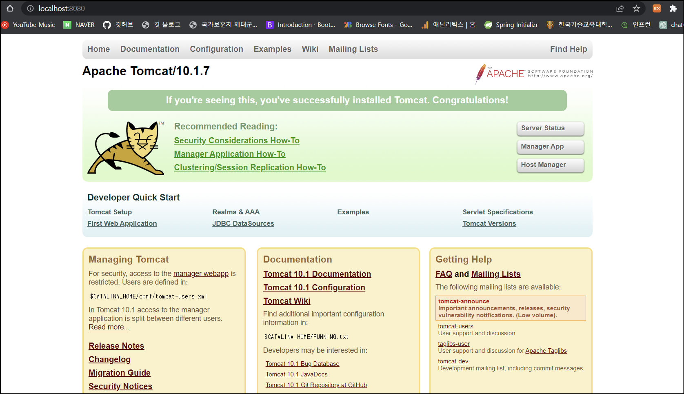
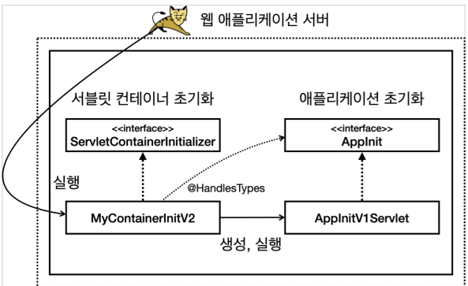
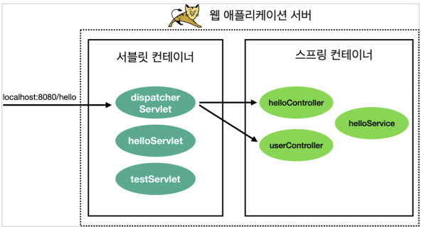
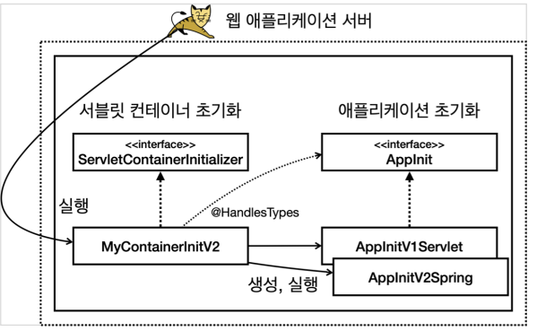
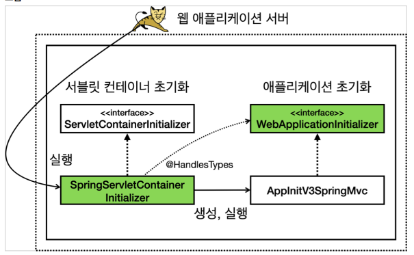
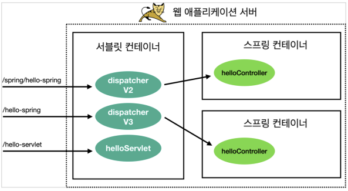

<div class="notice--danger">
    <b>해당 내용(톰캣서버 구성 등) 은 실사용 목적의 학습이 아닌, 스프링 부트 이해를 위한 학습입니다.</b>
</div>


# 0. 스프링 부트를 사용하는 이유

스프링 부트는 다음과 같은 핵심 기능 5가지를 제공한다.

- WAS: Tomcat 같은 웹 서버를 내장해서 별도의 웹 서버를 설치하지 않아도 됨 
- 라이브러리 관리
  - 손쉬운 빌드 구성을 위한 스타터 종속성 제공
  - 스프링과 외부 라이브러리의 버전을 자동으로 관리
- 자동 구성: 프로젝트 시작에 필요한 스프링과 외부 라이브러리의 빈을 자동 등록
- 외부 설정: 환경에 따라 달라져야 하는 외부 설정 공통화 
- 프로덕션 준비: 모니터링을 위한 메트릭, 상태 확인 기능 제공

이제부터 스프링 부트를 사용하게 된 배경(스프링 설정이 복잡함) 과 기능에 대해 알아본다.

# 1. 톰캣 설치 / 프로젝트 설정

**<u>*방법만 배우는 것일 뿐 실제로 구현할 필요는 없음!*</u>**

최근에는 스프링 부트가 내장 톰캣을 포함하고 있지만 과거에는 웹 애플리케이션을 개발할 때는 먼저 서버에 톰캣 같은 WAS(웹 애플리케이션 서버)를 설치했다. 

그리고 WAS에서 동작하도록 서블릿 스펙에 맞추어 코드를 작성하고 WAR 형식으로 빌드해서 war 파일을 만들었다. 이렇게 만들어진 war 파일을 WAS에 전달해서 배포하는 방식으로 전체 개발 주기가 동작했다.

**톰캣 설치 및 실행**

[톰캣 다운로드](https://tomcat.apache.org/download-10.cgi) <- 해당 링크를 클릭해서 Core 에 있는 `zip` 을 다운로드받는다.

다운로드 완료 후 cmd 에서 `톰캣폴더/bin` 으로 이동해서 톰캣을 실행한다. (실행 :`startup.bat` , 종료 : `shutdown.bat`)

localhost:8080 에서 고양이가 반겨준다.

****


## 프로젝트 설정

**build.gradle 확인**

```java
plugins {
 id 'java'
 //id 'war' : 톰캣 같은 웹 애플리케이션 서버(WAS) 위에서 동작하는 WAR 파일을 만들어주는 플러그인이다.
 id 'war'
}
group = 'hello'
version = '0.0.1-SNAPSHOT'
sourceCompatibility = '17'
repositories {
 mavenCentral()
}
dependencies {
 //서블릿
 implementation 'jakarta.servlet:jakarta.servlet-api:6.0.0'
}
tasks.named('test') {
 useJUnitPlatform()
}
```

**간단한 HTML 등록**

웹 서버가 정적 리소스를 잘 전달하는지 확인하기 위해 HTML을 하나 만들어든다.

`/src/main/webapp/index.html`

```html
<!DOCTYPE html>
<html lang="en">
<head>
    <meta charset="UTF-8">
    <title>Title</title>
</head>
<body>
    index html
</body>
</html>
```

**서블릿 등록**

```java
package hello.servlet;

import jakarta.servlet.ServletException;
import jakarta.servlet.ServletRequest;
import jakarta.servlet.ServletResponse;
import jakarta.servlet.annotation.WebServlet;
import jakarta.servlet.http.HttpServlet;
import jakarta.servlet.http.HttpServletRequest;
import jakarta.servlet.http.HttpServletResponse;

import java.io.IOException;

/**
 * http://localhost:8080/test
 */
@WebServlet(urlPatterns = "/test")
public class TestService extends HttpServlet {

    @Override
    protected void service(HttpServletRequest req, HttpServletResponse resp) throws ServletException, IOException {
        System.out.println("TestServlet.service");

        resp.getWriter().println("test");
    }
}

```

- /test 로 요청이 오면 이 서블릿이 실행된다. 
- TestServlet.service 를 로그에 출력한다. 
- test 를 응답한다. 웹 브라우저로 요청하면 이 서블릿이 실행되고 화면에 test 가 출력되어야 한다.

## WAR 빌드와 배포

Intellij 티미널에서`./gradlew build` 실행 -> `build.libs` 에 WAR 파일 생성

**WAR? JAR?**

JAR (Java Archieve) : 자바는 여러 클래스와 리소스를 묶어서 JAR (Java Archive)라고 하는 압축 파일을 만들 수 있다. 이 파일은 JVM 위에서 직접 실행되거나 또는 다른 곳에서 사용하는 라이브러리로 제공된다. 직접 실행하는 경우 main() 메서드가 필요하고, MANIFEST.MF 파일에 실행할 메인 메서드가 있는 클래스를 지정해두어야 한다.

WAR (Web Application Archive) :  JAR 파일이 JVM 위에서 실행된다면, WAR는 웹 애플리케이션 서버 위에서 실행된다. 웹 애플리케이션 서버 위에서 실행되고, HTML 같은 정적 리소스와 클래스 파일을 모두 함께 포함하기 때문에 JAR와 비교해서 구조가 더 복잡하다

**WAR 배포**

1. 톰캣 서버를 종료한다.`./shutdown.sh` 
2. 톰캣폴더/webapps 하위를 모두 삭제한다.
3. 빌드된 server-0.0.1-SNAPSHOT.war 를 복사한다.
4. 톰캣폴더/webapps 하위에 붙여넣는다. `톰캣폴더/webapps/server-0.0.1-SNAPSHOT.war`
5. 이름을 변경한다. 톰캣폴더`/webapps/ROOT.war`
6. 톰캣 서버를 실행한다. `./startup.sh`

`톰캣 설정 - 인텔리J 무료 버전`은 강의 파일 참고

# 2. 서블릿 컨테이너 초기화

WAS를 실행하는 시점에 필요한 초기화 작업들이 있다. 서비스에 필요한 필터와 서블릿을 등록하고, 여기에 스프링을 사용한다면 스프링 컨테이너를 만들고, 서블릿과 스프링을 연결하는 디스페처 서블릿도 등록해야 한다.

WAS가 제공하는 초기화 기능을 사용하면, WAS 실행 시점에 이러한 초기화 과정을 진행할 수 있다

서블릿 컨테이너 초기화는 `ServletContainerInitializer` 인터페이스를 통해 진행한다.

```java
package hello.container;

import jakarta.servlet.ServletContainerInitializer;
import jakarta.servlet.ServletContext;
import jakarta.servlet.ServletException;

import java.util.Set;

public class MyContainerV1 implements ServletContainerInitializer {


    @Override
    public void onStartup(Set<Class<?>> c, ServletContext ctx) throws ServletException {
        System.out.println("MyContainerInitV1.onStartup");
        System.out.println("MyContainerInitV1 c = " + c);
        System.out.println("MyContainerInitV1 ctx = " + ctx);
    }
}
```

추가로 WAS에게 실행할 초기화 클래스를 알려줘야 한다.

`resources/META-INF/services/jakarta.servlet.ServletContainerInitializer` 경로에 다음과 같은 파일 생성한다. (경로는 무조건 해당 경로를 사용해야 한다.)

```
hello.container.MyContainerInitV1
```

이렇게 하면 WAS를 실행할 때 해당 클래스를 초기화 클래스로 인식하고 로딩 시점에 실행한다.

# 3. 서블릿 컨테이너 초기화2

**HelloServlet** (등록할 서블릿)

```java
package hello.servlet;

import jakarta.servlet.ServletException;
import jakarta.servlet.http.HttpServlet;
import jakarta.servlet.http.HttpServletRequest;
import jakarta.servlet.http.HttpServletResponse;

import java.io.IOException;

public class HelloServlet extends HttpServlet {

    public HelloServlet() {
    }

    @Override
    protected void service(HttpServletRequest req, HttpServletResponse resp) throws ServletException, IOException {
        System.out.println("HelloServlet.service");
        resp.getWriter().println("Hello servlet!");
    }
}
```

이 서블릿을 등록하고 실행하면 다음과 같은 결과가 나온다. 

로그: `HelloServlet.service` HTTP 응답: `hello servlet!`


**애플리케이션 초기화**

애플리케이션 초기화를 진행하려면 먼저 인터페이스를 만들어야 한다.

```java
package hello.container;

import jakarta.servlet.ServletContext;

public interface Appinit {

    void onStartup(ServletContext servletContext);
}

```

그리고 앞서 개발한 애플리케이션 초기화( AppInit ) 인터페이스를 구현해서 실제 동작하는 코드를 만든다.

```java
//AppInitV1Servlet

package hello.container;

import hello.servlet.HelloServlet;
import jakarta.servlet.ServletContext;
import jakarta.servlet.ServletRegistration;

public class AppinitV1Servlet implements Appinit {

    @Override
    public void onStartup(ServletContext servletContext) {
        System.out.println("AppinitV1Servlet.onStartup");

        //순수 서블릿 코드 등록
        ServletRegistration.Dynamic helloServlet = servletContext.addServlet("helloServlet", new HelloServlet());

        helloServlet.addMapping("/hello-servlet");
    }
}
```


**MyContainerInitV2**

서블릿 컨테이너 초기화 인터페이스이다. 

```java
package hello.container;

import jakarta.servlet.ServletContainerInitializer;
import jakarta.servlet.ServletContext;
import jakarta.servlet.ServletException;
import jakarta.servlet.annotation.HandlesTypes;

import java.lang.reflect.InvocationTargetException;
import java.util.Set;

@HandlesTypes(Appinit.class)
public class MyContainerInitV2 implements ServletContainerInitializer {


    @Override
    public void onStartup(Set<Class<?>> c, ServletContext ctx) throws ServletException {
        System.out.println("MyContainerInitV2.onStartup");
        System.out.println("MyContainerInitV2 c = " + c);
        System.out.println("MyContainerInitV2 ctx = " + ctx);

        //class hello.container.AppinitV1Servlet
        for (Class<?> appInitClass : c) {
            try {
                //new AppInitV1Servlet() 과 같은 코드
                Appinit appInit = (Appinit) appInitClass.getDeclaredConstructor().newInstance();
                appInit.onStartup(ctx);
            } catch (Exception e) {
                throw new RuntimeException(e);
            }
        }
    }
}
```

1. @HandlesTypes 애노테이션에 애플리케이션 초기화 인터페이스를 지정한다. 여기서는 앞서 만든 AppInit.class 인터페이스를 지정했다.

2. 서블릿 컨테이너 초기화( ServletContainerInitializer )는 파라미터로 넘어오는 `Set<Class<?>>` 에 애플리케이션 초기화 인터페이스의 구현체들을 모두 찾아서 클래스 정보로 전달한다. 

   - 여기서는 @HandlesTypes(AppInit.class) 를 지정했으므로 AppInit.class 의 구현체인 AppInitV1Servlet.class 정보가 전달된다. 

   - 참고로 객체 인스턴스가 아니라 클래스 정보를 전달하기 때문에 실행하려면 객체를 생성해서 사용해야 한다. 

3. appInitClass.getDeclaredConstructor().newInstance() 리플렉션을 사용해서 객체를 생성한다. 참고로 이 코드는 new AppInitV1Servlet() 과 같다 생각하면 된다. 

4. appInit.onStartup(ctx) 애플리케이션 초기화 코드를 직접 실행하면서 서블릿 컨테이너 정보가 담긴 ctx 도 함께 전달한다.

MyContainerInitV2 를 등록한다. : `resources/META-INF/services/jakarta.servlet.ServletContainerInitializer`

```
hello.container.MyContainerInitV2
```


WAS 를 실행하면 다음과 같은 결과를 얻는다.

- 로그

```
MyContainerInitV1.onStartup
MyContainerInitV1 c = null
MyContainerInitV1 ctx = org.apache.catalina.core.ApplicationContextFacade@38dd0980
MyContainerInitV2.onStartup
MyContainerInitV2 c = [class hello.container.AppInitV1Servlet]
MyContainerInitV2 container = org.apache.catalina.core.ApplicationContextFacade@38dd0980
AppInitV1Servlet.onStartup
```

- `http://localhost:8080/hello-servlet` : hello servlet!



초기화는 다음 순서로 진행된다. 

1. 서블릿 컨테이너 초기화 실행 resources/META-INF/services/jakarta.servlet.ServletContainerInitializer
2. 애플리케이션 초기화 실행 @HandlesTypes(AppInit.class)

초기화를 두 단계로 나눈 이유는 다음과 같다.

1. 편리함

   서블릿 컨테이너를 초기화 하려면 ServletContainerInitializer 인터페이스를 구현한 코드를 만들어야 한다. 여기에 추가로 META-INF/services/ jakarta.servlet.ServletContainerInitializer 파일에 해당 코드를 직접 지정해주어야 한다. 애플리케이션 초기화는 특정 인터페이스만 구현하면 된다.

2. 의존성

   애플리케이션 초기화는 서블릿 컨테이너에 상관없이 원하는 모양으로 인터페이스를 만들 수 있다. 이를 통해 애플리케이션 초기화 코드가 서블릿 컨테이너에 대한 의존을 줄일 수 있다. 특히 ServletContext ctx 가 필요없는 애플리케이션 초기화 코드라면 의존을 완전히 제거할 수도 있다.


# 4. 스프링 컨테이너 등록

이번에는 WAS와 스프링을 통합해본다. 다음과 같은 과정이 필요하다.

- 스프링 컨테이너 만들기 
- 스프링MVC 컨트롤러를 스프링 컨테이너에 빈으로 등록하기 
- 스프링MVC를 사용하는데 필요한 디스패처 서블릿을 서블릿 컨테이너 등록하기



**스프링 라이브러리 추가**

build.gradle 에 스프링 라이브러리를 추가해준다.

` implementation 'org.springframework:spring-webmvc:6.0.4'`

**HelloController**

간단한 Spring Controller 다.

```java
package hello.spring;

import org.springframework.web.bind.annotation.GetMapping;
import org.springframework.web.bind.annotation.RestController;

@RestController
public class HelloController {

    @GetMapping("/hello-spring")
    public String hello() {
        System.out.println("HelloController.hello");
        return "hello spring!";
    }
}
```

**HelloConfig**

컨트롤러를 스프링 빈으로 직접 등록한다. 참고로 여기서는 컴포넌트 스캔을 사용하지 않고 빈을 직접 등록했다.

```java
package hello.spring;

import org.springframework.context.annotation.Bean;
import org.springframework.context.annotation.Configuration;

@Configuration
public class HelloConfig {

    @Bean
    public HelloController helloController(){
        return new HelloController();
    }
}
```

**AppInitV2Spring**

애플리케이션 초기화를 사용해서 서블릿 컨테이너에 스프링 컨테이너를 생성하고 등록한다.

```java
package hello.container;

import hello.spring.HelloConfig;
import jakarta.servlet.ServletContext;
import jakarta.servlet.ServletRegistration;
import org.springframework.web.context.support.AnnotationConfigWebApplicationContext;
import org.springframework.web.servlet.DispatcherServlet;

public class AppInitV2Spring implements AppInit{

    @Override
    public void onStartup(ServletContext servletContext) {
        System.out.println("AppInitV2Spring.onStartup");

        //스프링 컨테이너 생성 (애노테이션 기반 설정과 웹 기능을 지원하는 스프링 컨테이너)
        AnnotationConfigWebApplicationContext appContext = new AnnotationConfigWebApplicationContext();
        appContext.register(HelloConfig.class);

        //스프링 MVC 디스패처 서블릿 생성, 스프링 컨테이너 연결
        DispatcherServlet dispatcher = new DispatcherServlet(appContext);

        //디스패처 서블릿을 서블릿 컨테이너에 등록 (이름 주의! dispatcherV2)
        ServletRegistration.Dynamic servlet = servletContext.addServlet("dispatcherV2", dispatcher);

        // /spring/* 요청이 디스패처 서블릿을 통하도록 설정
        servlet.addMapping("/spring/*");
    }
}
```


**결과**

- 요청 : `http://localhost:8080/spring/hello-spring`
- 결과 : `hello spring!`


**실행과정**

`/spring/hello-spring` 실행을 `/spring/*` 패턴으로 호출했기 때문에 다음과 같이 동작한다. 

- dispatcherV2 디스패처 서블릿이 실행된다. ( /spring ) 
- dispatcherV2 디스패처 서블릿은 스프링 컨트롤러를 찾아서 실행한다. ( /hello-spring ) 
- 이때 서블릿을 찾아서 호출하는데 사용된 /spring 을 제외한 /hello-spring 가 매핑된 컨트롤러 HelloController )의 메서드를 찾아서 실행한다. (쉽게 이야기해서 뒤에 * 부분으로 스프링 컨트롤러를 찾는다.)



# 5. 스프링 MVC 서블릿 컨테이너 초기화 지원

스프링 MVC는 이러한 서블릿 컨테이너 초기화 작업을 이미 만들어두었다. 덕분에 개발자는 서블릿 컨테이너 초기화 과정은 생략하고, 애플리케이션 초기화 코드만 작성하면 된다.

**AppInitV3SpringMvc**

`WebApplicationInitializer`만 구현한다면 스프링이 지원하는 애플리케이션 초기화를 사용할 수 있다.

```java
package hello.container;

import hello.spring.HelloConfig;
import jakarta.servlet.ServletContext;
import jakarta.servlet.ServletException;
import jakarta.servlet.ServletRegistration;
import org.springframework.web.WebApplicationInitializer;
import org.springframework.web.context.support.AnnotationConfigWebApplicationContext;
import org.springframework.web.servlet.DispatcherServlet;

public class AppInitV3SpringMvc implements WebApplicationInitializer {
    @Override
    public void onStartup(ServletContext servletContext) throws ServletException {
        System.out.println("AppInitV3SpringMvc.onStartup");

        //스프링 컨테이너 생성
        AnnotationConfigWebApplicationContext appContext = new AnnotationConfigWebApplicationContext();
        appContext.register(HelloConfig.class);

        //스프링 MVC 디스패처 서블링 생성, 스프링 컨테이너 연결
        DispatcherServlet dispatcher = new DispatcherServlet(appContext);

        //디스패처 서블릿을 서블릿 컨테이너에 등록 (이름 주의! dispatcherV3)
        ServletRegistration.Dynamic servlet = servletContext.addServlet("dispatcherV3", dispatcher);

        //모든 요청이 디스패처 서블릿을 통하도록 설정
        servlet.addMapping("/");
    }
}
```

`WebApplicationInitializer` 인터페이스를 구현한 부분을 제외하고는 이전의 `AppInitV2Spring` 과 거의 같은 코드이다.

스프링은 `spring-web` 라이브러리에 서블릿 컨테이너 초기화를 위한 파일을 등록했다.

1. `/META-INF/services/jakarta.servlet.ServletContainerInitializer`

```
org.springframework.web.SpringServletContainerInitializer
```

2. SpringServletContainerInitializer

```java
@HandlesTypes(WebApplicationInitializer.class)
public class SpringServletContainerInitializer implements
ServletContainerInitializer {}
```

즉, 다음과 같다.



**실행** 

`http://localhost:8080/hello-spring` 

**정리 그림**

