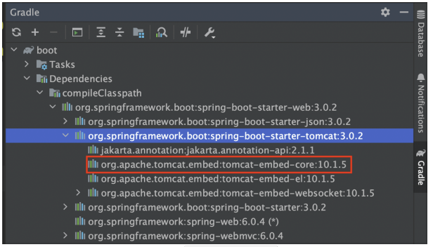

<div class="notice--danger">
    <b>해당 내용(톰캣서버 구성 등) 은 실사용 목적의 학습이 아닌, 스프링 부트 이해를 위한 학습입니다.</b>
</div>

# 0. WAS 배포 방식의 단점

WAS 로 웹 애플리케이션을 개발하고 배포하려면 다음과 같은 과정을 거쳐야 한다.

- 톰캣 같은 웹 애플리케이션 서버(WAS)를 별도로 설치해야 한다.
-  애플리케이션 코드를 WAR로 빌드해야 한다. 
- 빌드한 WAR 파일을 WAS에 배포해야 한다.

이러한 방식은 개발 환경 설정, 배포 과정 등이 복잡하다. 따라서 서버를 라이브러리처럼 제공하는 내장 톰캣 기능을 사용한다.


# 1. 내장 톰캣 설정

**build.gradle**

```
dependencies {
    //스프링 MVC 추가
    implementation 'org.springframework:spring-webmvc:6.0.4'
    //내장 톰캣 추가
    implementation 'org.apache.tomcat.embed:tomcat-embed-core:10.1.5'
}
...
//일반 Jar 생성
task buildJar(type: Jar) {
    manifest {
    	attributes 'Main-Class': 'hello.embed.EmbedTomcatSpringMain'
    }
    with jar
}
//Fat Jar 생성
task buildFatJar(type: Jar) {
    manifest {
    	attributes 'Main-Class': 'hello.embed.EmbedTomcatSpringMain'
    }
    duplicatesStrategy = DuplicatesStrategy.WARN
    from { configurations.runtimeClasspath.collect { it.isDirectory() ? it : zipTree(it) } }
    with jar
}
```


# 2. 내장 톰캣2 - 서블릿

내장 톰캣은 쉽게 이야기해서 톰캣을 라이브러리로 포함하고 자바 코드로 직접 실행하는 것이다.

**EmbedTomcatServletMain**

```java
package hello.embed;

import hello.servlet.HelloServlet;
import org.apache.catalina.Context;
import org.apache.catalina.LifecycleException;
import org.apache.catalina.connector.Connector;
import org.apache.catalina.startup.Tomcat;

import java.io.File;

public class EmbedTomcatServletMain {

    public static void main(String[] args) throws LifecycleException {
        
        System.out.println("EmbedTomcatServletMain.main()");
        
        //tomcat settings
        Tomcat tomcat = new Tomcat();
        Connector connector = tomcat.getConnector();
        connector.setPort(8080);
        tomcat.setConnector(connector);

        //Servlet Registration
        Context context = tomcat.addContext("", "/");
	    tomcat.addServlet("", "helloServlet", new HelloServlet());
        context.addServletMappingDecoded("/hello-servlet", "helloServlet");

        //추가 설정
        File docBaseFile = new File(context.getDocBase());
        if (!docBaseFile.isAbsolute()) {
            docBaseFile = new File(((org.apache.catalina.Host) context.getParent()).getAppBaseFile(), docBaseFile.getPath());
        }
        docBaseFile.mkdirs();

	    //톰캣 시작
        tomcat.start();

    }
}

```

실행 : `http://localhost:8080/hello-servlet` - >`hello servlet!`

# 3. 내장 톰캣2 - 서블릿

내장 톰캣에 스프링까지 연동

**EmbedTomcatSpringMain**

```java
package hello.embed;

import hello.spring.HelloConfig;
import org.apache.catalina.Context;
import org.apache.catalina.LifecycleException;
import org.apache.catalina.connector.Connector;
import org.apache.catalina.startup.Tomcat;
import org.springframework.web.context.support.AnnotationConfigWebApplicationContext;
import org.springframework.web.servlet.DispatcherServlet;

public class EmbedTomcatSpringMain {

    public static void main(String[] args) throws LifecycleException {
        System.out.println("EmbedTomcatSpringMain.main()");

        //tomcat settings
        Tomcat tomcat = new Tomcat();
        Connector connector = tomcat.getConnector();
        connector.setPort(8080);
        tomcat.setConnector(connector);

        //create Spring container
        AnnotationConfigWebApplicationContext appContext = new AnnotationConfigWebApplicationContext();
        appContext.register(HelloConfig.class);

        //create spring mvc dispatcher servlet, connect to spring container
        DispatcherServlet dispatcher = new DispatcherServlet(appContext);

        //dispatcher servlet Registration
        Context context = tomcat.addContext("", "/");
        tomcat.addServlet("", "dispatcher", dispatcher);
        context.addServletMappingDecoded("/", "dispatcher");
        
        //added setting 
        File docBaseFile = new File(context.getDocBase());
        if (!docBaseFile.isAbsolute()) {
            docBaseFile = new File(((org.apache.catalina.Host) context.getParent()).getAppBaseFile(), docBaseFile.getPath());
        }
        docBaseFile.mkdirs();

        tomcat.start();
    }
}
```

main() 메서드를 실행하면 다음과 같이 동작한다.

- 내장 톰캣을 생성해서 8080 포트로 연결하도록 설정한다. 
- 스프링 컨테이너를 만들고 필요한 빈을 등록한다. 
- 스프링 MVC 디스패처 서블릿을 만들고 앞서 만든 스프링 컨테이너에 연결한다. 
- 디스패처 서블릿을 내장 톰캣에 등록한다. 
- 내장 톰캣을 실행한다.

# 4. 내장 톰캣4 - 빌드와 배포1

자바의 main() 메서드를 실행하기 위해서는 jar 형식으로 빌드해야 한다. 그리고 jar 안에는 META-INF/MANIFEST.MF 파일에 실행할 main() 메서드의 클래스를 지정해주어야 한다.

META-INF/MANIFEST.MF

```
Manifest-Version: 1.0
Main-Class: hello.embed.EmbedTomcatSpringMain
```

**Gradle** 에 다음과 같은 코드를 추가하여 main 메서드 지정을 쉽게 해줄 수 있다.

```
task buildJar(type: Jar) {
     manifest {
     attributes 'Main-Class': 'hello.embed.EmbedTomcatSpringMain
	}
	with jar
}
```

다음과 같이 빌드한다.

`./gradlew clean buildJar`


**Jar 파일 실행**

`java -jar embed-0.0.1-SNAPSHOT.jar`

실행 결과 : 스프링 관련 클래스를 찾을 수 없다는 오류가 발생한다.

```
... % java -jar embed-0.0.1-SNAPSHOT.jar
Error: Unable to initialize main class hello.embed.EmbedTomcatSpringMain
Caused by: java.lang.NoClassDefFoundError: org/springframework/web/context/
WebApplicationContext
```


**오류 원인**

`jar -xvf embed-0.0.1-SNAPSHOT.jar` 로 jar 파일 압축을 풀어보면, 스프링 라이브러리나 내장 톰캣 라이브러리가 전혀 보이지 않는다. 따라서 해당 오류가 발생한 것이다.

**jar 파일은 jar파일을 포함할 수 없다.**

- WAR와 다르게 JAR 파일은 내부에 라이브러리 역할을 하는 JAR 파일을 포함할 수 없다. 포함한다고 해도 인식이 안된다. 이것이 JAR 파일 스펙의 한계이다. 그렇다고 WAR를 사용할 수 도 없다. WAR는 웹 애플리케이션 서버(WAS) 위에서만 실행할 수 있다.

# 5. 내장 톰캣5 - 빌드와 배포2

위 오류의 대안으로는 는 `fat jar` 가 있다. 라이브러리에 사용되는 jar 를 풀면 class 들이 나온다. 이 class 를 뽑아서 새로 만드는 jar 에 포함하는 것이다. 이렇게 하면 수 많은 라이브러리에서 나오는 class 때문에 뚱뚱한(fat) jar 가 탄생한다. 그래서 Fat Jar 라고 부르는 것이다.

**build.gradle**

```java
task buildFatJar(type: Jar) {
    manifest {
        attributes 'Main-Class': 'hello.embed.EmbedTomcatSpringMain'
    }
    duplicatesStrategy = DuplicatesStrategy.WARN
    from { configurations.runtimeClasspath.collect { it.isDirectory() ? it : zipTree(it) } }
    with jar
}
```

빌드 : `./gradlew clean buildFatJar`

**Fat Jar의 단점**

- 어떤 라이브러리가 포함되어 있는지 확인하기 어렵다.
- 파일명 중복을 해결할 수 없다.
  - 클래스나 리소스 명이 같은 경우 하나를 포기해야 한다.
  - `META-INF/services/jakarta.servlet.ServletContainerInitializer` 이 파일이 여러 라이브러리( jar )에 있을 수 있다.
  - A 라이브러리와 B 라이브러리 둘다 해당 파일을 사용해서 서블릿 컨테이너 초기화를 시도한다. 둘다 해당 파일을 jar 안에 포함한다. 
  - Fat Jar 를 만들면 파일명이 같으므로 A , B 라이브러리가 둘다 가지고 있는 파일 중에 하나의 파일만 선택된다. 결과적으로 나머지 하나는 포함되지 않으므로 정상 동작하지 않는다.

# 6. Custom 부트 클래스 만들기

지금까지 진행한 내장 톰캣 실행, 스프링 컨테이너 생성, 디스패처 서블릿 등록의 모든 과정을 편리하게 처리해주는 부트 클래스를 만든다.

**MySpringApplication**

```java
package hello.boot;

import hello.spring.HelloConfig;
import org.apache.catalina.Context;
import org.apache.catalina.LifecycleException;
import org.apache.catalina.connector.Connector;
import org.apache.catalina.startup.Tomcat;
import org.springframework.web.context.support.AnnotationConfigWebApplicationContext;
import org.springframework.web.servlet.DispatcherServlet;

import java.io.File;
import java.util.List;

public class MySpringApplication {

    public static void run(Class configClass, String[] args) {

        System.out.println("MySpringApplication.main args=" + List.of(args));

        //tomcat settings
        Tomcat tomcat = new Tomcat();
        Connector connector = tomcat.getConnector();
        connector.setPort(8080);
        tomcat.setConnector(connector);

        //create Spring container
        AnnotationConfigWebApplicationContext appContext = new AnnotationConfigWebApplicationContext();
        appContext.register(configClass);

        //create spring mvc dispatcher servlet, connect to spring container
        DispatcherServlet dispatcher = new DispatcherServlet(appContext);

        //dispatcher servlet Registration
        Context context = tomcat.addContext("", "/");
        tomcat.addServlet("", "dispatcher", dispatcher);
        context.addServletMappingDecoded("/", "dispatcher");

        File docBaseFile = new File(context.getDocBase());
        if (!docBaseFile.isAbsolute()) {
            docBaseFile = new File(((org.apache.catalina.Host) context.getParent()).getAppBaseFile(), docBaseFile.getPath());
        }
        docBaseFile.mkdirs();

        try {
            tomcat.start();
        } catch (LifecycleException e) {
            throw new RuntimeException(e);
        }
    }
}
```

코드 자체는 이전꺼와 비슷하다.

파라미터의 `configClass` : 스프링 설정 (config) 을 파라미터로 전달받는다.

**@MySpringBootApplication**

```java
package hello.boot;

import org.springframework.context.annotation.ComponentScan;

import java.lang.annotation.*;

@Target(ElementType.TYPE)
@Retention(RetentionPolicy.RUNTIME)
@Documented
@ComponentScan
public @interface MySpringBootApplication {
}
```

컴포넌트 스캔 기능이 추가된 단순한 애노테이션이다.

**MySpringBootAppMain**

```java
package hello;

import hello.boot.MySpringApplication;
import hello.boot.MySpringBootApplication;

@MySpringBootApplication
public class MySpringBootMain {
        public static void main(String[] args) {
            MySpringApplication.run(MySpringBootMain.class, args);
        }
}
```

- 패키지 위치는 hello 로, 그 하위의 모든 폴더를 컴포넌트 스캔해야 하기 때문이다.
- 그렇게 스캔하여 스프링 빈 정보를 등록한 Config 를 `MySpringApplication.run(MySpringBootMain.class, args);` 으로 전달해준다.

*지금까지 만든 것을 라이브러리로 만들어서 배포한다면? 그것이 바로 스프링 부트이다.*


# 7. 스프링 부트와 웹 서버 - 프로젝트 생성

스프링 부트는 지금까지 고민한 문제를 깔끔하게 해결해준다. 

- 내장 톰캣을 사용해서 빌드와 배포를 편리하게 한다. 
- 빌드시 하나의 Jar를 사용하면서, 동시에 Fat Jar 문제도 해결한다. 
- 지금까지 진행한 내장 톰캣 서버를 실행하기 위한 복잡한 과정을 모두 자동으로 처리한다.

간단하게 denpendencies 를 다음과 같이 추가하고, HelloController 를 만들어보자.

```
implementation 'org.springframework.boot:spring-boot-starter-web'
testImplementation 'org.springframework.boot:spring-boot-starter-test'
```

```java
package hello.boot.controller;

import org.springframework.web.bind.annotation.GetMapping;
import org.springframework.web.bind.annotation.RestController;

@RestController
public class HelloController {

    @GetMapping("/hello-spring")
    public String hello(){
        System.out.println("HelloController.hello()");
        return "Hello Spring Boot!";
    }
}
```

**내장 톰캣 의존관계 확인**



라이브러리 의존관계를 따라가보면 내장 톰캣( tomcat-embed-core )이 포함된 것을 확인할 수 있다.

# 8. 스프링 부트와 웹 서버 - 실행 과정

**스프링 부트의 실행 과정**

```java
@SpringBootApplication
public class BootApplication {
	public static void main(String[] args) {
    	SpringApplication.run(BootApplication.class, args);
    }
}
```

- 스프링 부트를 실행할 때는 자바 main() 메서드에서 SpringApplication.run() 을 호출해주면 된다. 
- 여기에 메인 설정 정보를 넘겨주는데, 보통 @SpringBootApplication 애노테이션이 있는 현재 클래스를 지정해주면 된다.
-  참고로 현재 클래스에는 @SpringBootApplication 애노테이션이 있는데, 이 애노테이션 안에는 컴포넌트 스캔을 포함한 여러 기능이 설정되어 있다. 기본 설정은 현재 패키지와 그 하위 패키지 모두를 컴포넌트 스캔한다.

# 9. 스프링 부트와 웹 서버 - 빌드와 배포

내장 톰캣이 포함된 스프링 부트를 직접 빌드해보자.

jar 빌드 : `./gradlew clean build`

**스프링 부트 jar 분석**

jar 압축을 풀어보면 (`jar -xvf boot-0.0.1-SNAPSHOT.jar`) `/BOOT-INF/lib` 안에 외부 라이브러리가 jar 파일로 들어가 있다. 

> 참고 : 빌드 결과를 보면 boot-0.0.1-SNAPSHOT-plain.jar 파일도 보이는데, 이것은 우리가 개발한 코드만 순수한 jar로 빌드한 것이다.


# 10. 스프링 부트 실행 가능 Jar

**실행가능 jar**

스프링 부트는 **jar 내부에 jar를 포함할 수 있는 특별한 구조의 jar를 만들고 동시에 만든 jar를 내부 jar를 포함해서 실행할 수 있게 했다.** 이것을 실행 가능 Jar(Executable Jar)라 한다. 이 실행 가능 Jar를 사용하면 다음 문제들을 깔끔하게 해결할 수 있다.

- 문제: 어떤 라이브러리가 포함되어 있는지 확인하기 어렵다. 
  - 해결: jar 내부에 jar를 포함하기 때문에 어떤 라이브러리가 포함되어 있는지 쉽게 확인할 수 있다.
- 문제: 파일명 중복을 해결할 수 없다. 
  - 해결: jar 내부에 jar를 포함하기 때문에 a.jar , b.jar 내부에 같은 경로의 파일이 있어도 둘다 인식할 수 있다.

**META-INF/MANIFEST.MF**

java -jar xxx.jar 를 실행하게 되면 우선 META-INF/MANIFEST.MF 파일을 찾는다. 그리고 여기에 있는 Main-Class 를 읽어서 main() 메서드를 실행하게 된다. 

```
Manifest-Version: 1.0
Main-Class: org.springframework.boot.loader.JarLauncher
Start-Class: hello.boot.BootApplication
//스프링부트 버전
Spring-Boot-Version: 3.0.2
//개발한 클래스의 경로
Spring-Boot-Classes: BOOT-INF/classes/
//라이브러리 경로
Spring-Boot-Lib: BOOT-INF/lib/
//외부 라이브러리 모음
Spring-Boot-Classpath-Index: BOOT-INF/classpath.idx
//스프링 부트 구조 정보
Spring-Boot-Layers-Index: BOOT-INF/layers.idx
Build-Jdk-Spec: 17
```

- **Main-Class**
  - 우리가 기대한 main() 이 있는 hello.boot.BootApplication 이 아니라 JarLauncher 라는 전혀 다른 클래스를 실행하고 있다.
  - JarLauncher 는 스프링 부트가 빌드시에 넣어준다. org/springframework/boot/loader/ JarLauncher 에 실제로 포함되어 있다. 스프링 부트는 jar 내부에 jar를 읽어들이는 기능이 필요하다. 또 특별한 구조에 맞게 클래스 정보도 읽어들여야 한다. 바로 JarLauncher 가 이런 일을 처리해준다. 이런 작업을 먼저 처리한 다음 Start-Class: 에 지정된 main() 을 호출한다.
- **Start-Class** :  우리가 기대한 main() 이 있는 hello.boot.BootApplication 가 적혀있다. 기타: 스프링 부트가 내부에서 사용하는 정보들이다.
- 참고: Main-Class 를 제외한 나머지는 자바 표준이 아니다. 스프링 부트가 임의로 사용하는 정보이다.

**스프링 부트 로더**

- org/springframework/boot/loader 하위에 있는 클래스들이다. 
- JarLauncher 를 포함한 스프링 부트가 제공하는 실행 가능 Jar를 실제로 구동시키는 클래스들이 포함되어 있다. 스프링 부트는 빌드시에 이 클래스들을 포함해서 만들어준다.

**BOOT-INF**

- classes : 우리가 개발한 class 파일과 리소스 파일 
- lib : 외부 라이브러리 
- classpath.idx : 외부 라이브러리 모음 
- layers.idx : 스프링 부트 구조 정보