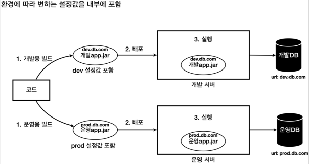
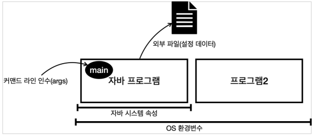
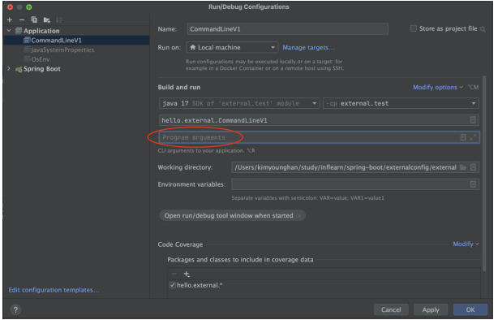

# 0. 외부설정이란?

하나의 애플리케이션을 여러 다른 환경에서 사용해야 할 때가 있다. 대표적으로 개발이 잘 진행되고 있는지 내부에서 확인하는 용도의 개발 환경, 그리고 실제 고객에게 서비스하는 운영 환경이 있다. 

하지만 해당 환경이 다르기 때문에 서로 다른 설정값이 필요하다.



이렇게 되면 다음과 같은 문제가 발생한다.

- 환경에 따라 빌드를 여러 번 해야한다.
- 개발 버전과 운영 버전의 결과물이 달라질 수 있는 문제가 발생한다.
- 각 환경에 맞춘 결과물은 다른 환경에서 사용할 수 없어서 유연성이 떨어진다.

따라서 보통 다음과 같이 환경에 맞춰서 실행 시점에 외부 설정값을 주입한다.


- 배포 환경과 무관하게 하나의 빌드 결과물을 만든다. 여기서는 app.jar 를 빌드한다. 
- 이 안에는 설정값을 두지 않는다. 설정값은 실행 시점에 각 환경에 따라 외부에서 주입한다
  - 개발 서버: app.jar 를 실행할 때 dev.db.com 값을 외부 설정으로 주입한다. 
  - 운영 서버: app.jar 를 실행할 때 prod.db.com 값을 외부 설정으로 주입한다.

**외부변수**

외부 설정은 일반적으로 다음 4가지 방법이 있다.

- **OS 환경 변수**: OS에서 지원하는 외부 설정, ㄲ해당 OS를 사용하는 모든 프로세스에서 사용 
- **자바 시스템 속성**: 자바에서 지원하는 외부 설정, 해당 JVM안에서 사용 
- **자바 커맨드 라인 인수**: 커맨드 라인에서 전달하는 외부 설정, 실행시 main(args) 메서드에서 사용 
- **외부 파일(설정 데이터)**: 프로그램에서 외부 파일을 직접 읽어서 사용 
  - 애플리케이션에서 특정 위치의 파일을 읽도록 해둔다. 예) data/hello.txt 
  - 그리고 각 서버마다 해당 파일안에 다른 설정 정보를 남겨둔다. 
    - 개발 서버 hello.txt : url=dev.db.com 
    - 운영 서버 hello.txt : url=prod.db.com




# 1. 외부 설정 - OS 환경 변수

OS 환경 변수(OS environment variables)는 해당 OS를 사용하는 모든 프로그램에서 읽을 수 있는 설정값이다. 한마디로 다른 외부 설정과 비교해서 사용 범위가 가장 넓다.

**조회 방법** : 윈도우 OS -  set / MAC, 리눅스 OS - printenv

**자바에서 OS 환경 변수 사용**

OsEnv - src/test 하위

```java
package hello.external;

import lombok.extern.slf4j.Slf4j;

import java.util.Map;

@Slf4j
public class OsEnv {

    public static void main(String[] args) {
        Map<String, String> envMap = System.getenv();
        for (String key : envMap.keySet()) {
            log.info("env {}={}", key, envMap.get(key));
        }

        //DBURL = dev.db.com 개발서버
        //DBURL = prod.db.com 운영서버
        System.getenv("DBURL");
    }
}
```

- System.getenv() 를 사용하면 전체 OS 환경 변수를 Map 으로 조회할 수 있다. 
- System.getenv(key) 를 사용하면 특정 OS 환경 변수의 값을 String 으로 조회할 수 있다

**결과**

```
env PATH=/usr/local/bin:/usr/bin:/bin:/usr/sbin:/sbin
env SHELL=/bin/zsh
env USER=kimyounghan
env TMPDIR=/var/folders/zs/...
env COMMAND_MODE=unix2003
env LOGNAME=kimyounghan
env LC_CTYPE=ko_KR.UTF-8
env HOME=/Users/kimyounghan
```


*OS 환경 변수는 전역 변수 같은 효과가 있다. 여러 프로그램에서 사용하는 것이 맞을 때도 있지만, 해당 애플리케이션을 사용하는 자바 프로그램 안에서만 사용되는 외부 설정값을 사용하고 싶을 때는 맞지 않다.*


# 2. 외부 설정 - 자바 시스템 속성

자바 시스템 속성(Java System properties)은 실행한 JVM 안에서 접근 가능한 외부 설정이다. 추가로 자바가 내부에서 미리 설정해두고 사용하는 속성들도 있다.

자바 시스템 속성은 다음과 같이 자바 프로그램을 실행할 때 사용한다.

예) `java -Durl=dev -jar app.jar`

**JavaSystemProperties - src/test 하위**

```java
package hello.external;

import lombok.extern.slf4j.Slf4j;

import java.util.Properties;

@Slf4j
public class JavaSystemProperties {

    public static void main(String[] args) {


        Properties properties = System.getProperties();
        for (Object key : properties.keySet()) {
            log.info("property {}={}", key, System.getProperty((String) key));
        }

        String url = System.getProperty("url");
        String username = System.getProperty("username");
        String password = System.getProperty("password");

        log.info("url={}", url);
        log.info("username={}", username);
        log.info("password={}", password);
        
        System.setProperty("hello_key", "hello_value");
        String hello_key = System.getProperty("hello_key");
        log.info("hello_key={}", hello_key);

    }
}
```

- System.getProperties() 를 사용하면 Map 과 유사한( Map 의 자식 타입) key=value 형식의 Properties 를 받을 수 있다. 이것을 통해서 모든 자바 시스템 속성을 조회할 수 있다.
- `System.setProperty("hello_key", "hello_value");` 처럼 자바 시스템 속성을 자바 코드 내부에서 추가하는 것도 가능하다.

# 3. 외부 설정 - 커맨드 라인 인수

커맨드 라인 인수(Command line arguments)는 애플리케이션 실행 시점에 외부 설정값을 main(args) 메서드의 args 파라미터로 전달하는 방법이다.

다음과 같이 사용한다.

`java -jar app.jar dataA dataB` 필요한 데이터를 마지막 위치에 스페이스로 구분해서 전달하면 된다. 
이 경우 dataA , dataB 2개의 문자가 args 에 전달된다.

**CommandLineV1 - src/test 하위**

```java
package hello.external;

import lombok.extern.slf4j.Slf4j;

@Slf4j
public class CommandLineV1 {

    public static void main(String[] args) {
        for (String arg : args) {
            log.info("arg {}", arg);
        }
    }
}
```

**IDE에서 실행시 커맨드 라인 인수 추가**



여기에 `url=devdb username=dev_user password=dev_pw` 를 입력하고 실행한다.

```
CommandLineV1 - arg url=devdb
CommandLineV1 - arg username=dev_user
CommandLineV1 - arg password=dev_pw
```

- 커맨드 라인 인수는 key=value 형식이 아니다. 단순히 문자를 여러게 입력 받는 형식인 것이다. 그래서 3가지 문자가 입력되었다.
- 이것은 파싱되지 않은, 통 문자이다. 이 경우 개발자가 = 을 기준으로 직접 데이터를 파싱해서 key=value 형식에 맞도록 분리해야 한다. 
- 실제 애플리케이션을 개발할 때는 주로 key=value 형식을 자주 사용하기 때문에 결국 파싱해서 Map 같은 형식으로 변환하도록 직접 개발해야 하는 번거로움이 있다.


# 4. 외부 설정 - 커맨드 라인 옵션 인수

프링에서는 커맨드 라인 인수를 key=value 형식으로 편리하게 사용할 수 있도록 스프링 만의 표준 방식을 정의했는데, 그것이 바로 커맨드 라인 옵션 인수이다.

스프링은 커맨드 라인에 - (dash) 2개( -- )를 연결해서 시작하면 key=value 형식으로 정하고 이것을 커맨드 라인 옵션 인수라 한다. 

- --key=value 형식으로 사용한다. 
- --username=userA --username=userB 하나의 키에 여러 값도 지정할 수 있다.

**CommandLineV2 - src/test 하위**

```java
package hello.external;

import lombok.extern.slf4j.Slf4j;
import org.springframework.boot.ApplicationArguments;
import org.springframework.boot.DefaultApplicationArguments;

import java.util.List;
import java.util.Set;

@Slf4j
public class CommandLineV2 {

    public static void main(String[] args) {
        for (String arg : args) {
            log.info("arg {}", arg);
        }

        ApplicationArguments appArgs = new DefaultApplicationArguments(args);
        log.info("SourceArgs = {}", List.of(appArgs.getSourceArgs()));
        log.info("NonOptionsArgs = {}", appArgs.getNonOptionArgs());
        log.info("OptionsNames = {}", appArgs.getOptionNames());

        Set<String> optionNames = appArgs.getOptionNames();
        for (String optionName : optionNames) {
            log.info("option arg {}={}", optionName, appArgs.getOptionValues(optionName));

            List<String> url = appArgs.getOptionValues("url");
            List<String> username = appArgs.getOptionValues("username");
            List<String> password = appArgs.getOptionValues("password");
            List<String> mode = appArgs.getOptionValues("mode");

            log.info("url={}", url);
            log.info("username={}", username);
            log.info("password={}", password);
            log.info("mode={}", mode);
        }
    }
}
```

**실행**

커맨드 라인 인수에 다음과 같이 입력하고 실행한다.

`--url=devdb --username=dev_user --password=dev_pw mode=on`

**실행결과**

```
arg --url=devdb
arg --username=dev_user
arg --password=dev_pw
arg mode=on

SourceArgs = [--url=devdb, --username=dev_user, --password=dev_pw, mode=on]
NonOptionArgs = [mode=on]

OptionNames = [password, url, username]

option args password=[dev_pw]
option args url=[devdb]
option args username=[dev_user]

url=[devdb]
username=[dev_user]
password=[dev_pw]
mode=null

```

- arg : 커맨드 라인의 입력 결과를 그대로 출력한다.
- SourceArgs : 커맨드 라인 인수 전부를 출력한다.
- NonOptionArgs = [mode=on] : 옵션 인수가 아니다. key=value 형식으로 파싱되지 않는다. -- 를 앞에 사용하지 않았다.
- OptionNames = [password, url, username] : key=value 형식으로 사용되는 옵션 인수다. -- 를 앞에 사용했다.
- url , username , password 는 옵션 인수이므로 appArgs.getOptionValues(key) 로 조회할 수 있다.
- mode 는 옵션 인수가 아니므로 appArgs.getOptionValues(key) 로 조회할 수 없다. 따라서 결과는 null 이다.

> ​	로 옵션 인수는 --username=userA --username=userB 처럼 하나의 키에 여러 값을 포함할 수 있기 때문에 appArgs.getOptionValues(key) 의 결과는 리스트( List )를 반환한다.
>
> 커맨드 라인 옵션 인수는 자바 언어의 표준 기능이 아니다. 스프링이 편리함을 위해 제공하는 기능이다.

# 5. 외부 설정 - 커맨드 라인 옵션 인수와 스프링 부트

스프링 부트는 커맨드 라인을 포함해서 커맨드 라인 옵션 인수를 활용할 수 있는 ApplicationArguments 를 스프링 빈으로 등록해둔다. 그리고 그 안에 입력한 커맨드 라인을 저장해둔다. 그래서 해당 빈을 주입 받으면 커맨드 라인으로 입력한 값을 어디서든 사용할 수 있다.

**CommandLineBean - src/main 하위**

```java
package hello;

import jakarta.annotation.PostConstruct;
import lombok.extern.slf4j.Slf4j;
import org.springframework.boot.ApplicationArguments;
import org.springframework.stereotype.Component;

import java.util.List;
import java.util.Set;

@Slf4j
@Component
public class CommandLineBean {

    private final ApplicationArguments arguments;

    public CommandLineBean(ApplicationArguments arguments) {
        this.arguments = arguments;
    }

    @PostConstruct
    public void init() {
        log.info("source {}", List.of(arguments.getSourceArgs()));
        log.info("optionNames {}", arguments.getOptionNames());
        Set<String> optionNames = arguments.getOptionNames();
        for (String optionName : optionNames) {
            log.info("option arg {}={}", optionName, arguments.getOptionValues(optionName));
        }
    }
}
```

**실행**

`--url=devdb --username=dev_user --password=dev_pw mode=on`

**실행 결과**

```
CommandLineBean: source [--url=devdb, --username=dev_user, --password=dev_pw,
mode=on]
CommandLineBean: optionNames [password, url, username]
CommandLineBean: option args password=[dev_pw]
CommandLineBean: option args url=[devdb]
CommandLineBean: option args username=[dev_user]
```

