# 0. 마이크로미터 소개

세상에는 수 많은 모니터링 툴이 있고, 시스템의 다양한 정보를 이 모니터링 툴에 전달해서 사용하게 된다.

이 때 모니터링 툴과 어플리케이션을 연동하려면 그에 맞는 형식으로 API 를 보내야 한다.


하지만 이렇게 되면, 모니터링 툴이 변경되었을 때 유연하게 대처하지 못한다.

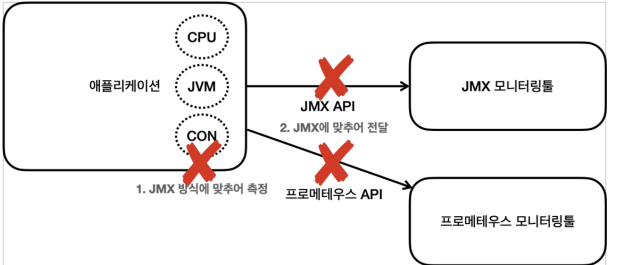

따라서 마이크로미터 추상화 기능이 필요하다.

**마이크로미터 추상화**

마이크로미터는 애플리케이션 메트릭 파사드라고 불리는데, 애플리케이션의 메트릭(측정 지표)을 마이크로미터가 정한 표준 방법으로 모아서 제공해준다.

따라서 개발자는 마이크로미터가 정한 표준 방법으로 메트릭(측정 지표)를 전달하면 된다. 그리고 사용하는 모니터링 툴에 맞는 구현체를 선택하면 된다. 이후에 모니터링 툴이 변경되어도 해당 구현체만 변경하면 된다. 애플리케이션 코드는 모니터링 툴이 변경되어도 그대로 유지할 수 있다.

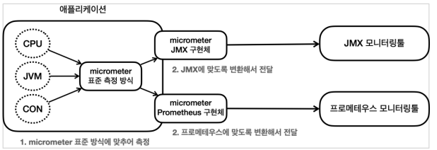


# 1. 메트릭 확인하기

CPU, JVM, 커넥션 사용 등등 수 많은 지표들을 어떻게 수집해야 할까? 개발자가 각각의 지표를 직접 수집해서 그것을 마이크로미터가 제공하는 표준 방법에 따라 등록하면 된다.

다행히도 마이크로미터는 다양한 지표 수집 기능을 이미 만들어서 제공한다. 그리고 스프링 부트 액츄에이터는 마이크로미터가 제공하는 지표 수집을 @AutoConfiguration 을 통해 자동으로 등록해준다.

**metrics 엔드포인트**

`metrics` 엔드포인트를 사용하면 기본으로 제공되는 메트릭들을 확인할 수 있다.

`http://localhost:8080/actuator/metrics`

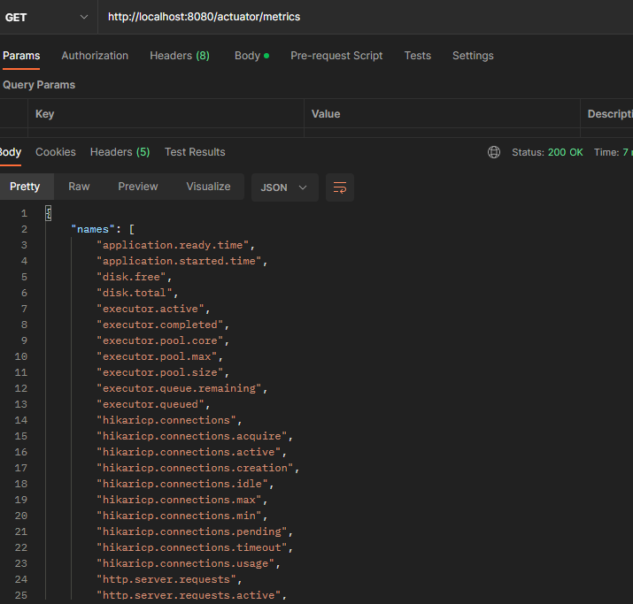

**자세히 확인하기**

metrics 엔드포인트는 다음과 같은 패턴을 사용해서 더 자세히 확인할 수 있다. 
`http://localhost:8080/actuator/metrics/{name}`

JVM 메모리 사용량을 확인해보자.

실행 : `http://localhost:8080/actuator/metrics/jvm.memory.used`

결과 : 

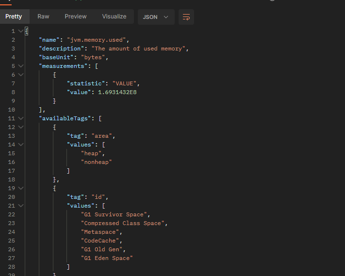

**Tag 필터**

availableTags 를 보면 다음과 같은 항목을 확인할 수 있다.

- tag:area , values[heap, nonheap] 
- tag:id , values[G1 Survivor Space, ...]

해당 Tag를 기반으로 정보를 필터링해서 확인할 수 있다. tag=KEY:VALUE 과 같은 형식을 사용해야 한다.

다음과 같이 쿼리문으로 실행할 수 있다.

- `http://localhost:8080/actuator/metrics/jvm.memory.used?tag=area:heap` 
  - heap 메모리 조회
- `http://localhost:8080/actuator/metrics/jvm.memory.used?tag=area:nonheap`
  - nonheap  메모리 조회

​	

# 2. 다양한 메트릭

마이크로미터와 액츄에이터가 기본으로 제공하는 다양한 메트릭을 확인해보자.

- **JVM 메트릭** : JVM 관련 메트릭을 제공한다. (메모리 및 버퍼 풀 세부 정보, 가비지 수집 관련 통계, 스레드 활용, 로드 및 언로드된 클래스 수, JVM 버전 정보, JIT 컴파일 시간)
- **시스템 메트릭** (CPU 지표, 파일 디스크립터 메트릭, 가동 시간 메트릭, 사용 가능한 디스크 공간)
- **애플리케이션 시작 메트릭** : 애플리케이션 시작 시간 메트릭을 제공한다.
- **스프링 MVC 메트릭** : 스프링 MVC 컨트롤러가 처리하는 모든 요청을 다룬다.
- **데이터 소스 메트릭** : DataSource , 커넥션 풀에 관한 메트릭을 확인할 수 있다. 최대 커넥션, 최소 커넥션, 활성 커넥션, 대기 커넥션 수 등을 확인할 수 있다.
- **로그 메트릭** : logback 로그에 대한 메트릭을 확인할 수 있다. trace , debug , info , warn , error 각각의 로그 레벨에 따른 로그 수를 확인할 수 있다.
- **톰캣 메트릭** : 아래에서 설명
- 기타 수 많은 메트릭이 있다. 사용자가 메트릭을 직접 정의하는 것도 가능하다.

**톰캣 메트릭**

- 톰캣 메트릭을 모두 사용하려면 다음 옵션을 켜야한다. (옵션을 켜지 않으면 tomcat.session. 관련 정보만 노출된다.)

application.yml

```yml
server:
 tomcat:
   mbeanregistry:
     enabled: true

```

- 톰캣의 최대 쓰레드, 사용 쓰레드 수를 포함한 다양한 메트릭을 확인할 수 있다.
- 아래처럼 최대 쓰레드를 확인할 수 있다.  (200개)
- 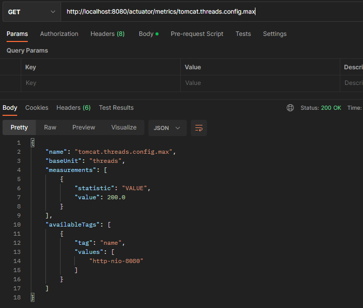


*그 밖에도 HTTP 클라이언트 메트릭( RestTemplate , WebClient ), 캐시 메트릭, 작업 실행과 스케줄 메트릭, 스프링 데이터 리포지토리, 메트릭 몽고DB 메트릭, 레디스 메트릭 등이 있다.*


**사용자 정의 메트릭**

사용자가 직접 메트릭을 정의할 수도 있다. 예를 들어서 주문수, 취소수를 메트릭으로 만들 수 있다. 사용자 정의 메트릭을 만들기 위해서는 마이크로미터의 사용법을 먼저 이해해야 한다


# 3. 프로메테우스와 그라파나

**프로메테우스**

애플리케이션에서 발생한 메트릭을 그 순간만 확인하는 것이 아니라 과거 이력까지 함께 확인하려면 메트릭을 보관하는 DB가 필요하다. 이렇게 하려면 어디선가 메트릭을 지속해서 수집하고 DB에 저장해야 한다. 프로메테우스가 바로 이런 역할을 담당한다.

**그라파나** 

프로메테우스가 DB라고 하면, 이 DB에 있는 데이터를 불러서 사용자가 보기 편하게 보여주는 대시보드가 필요하다. 그라파나는 매우 유연하고, 데이터를 그래프로 보여주는 툴이다. 수 많은 그래프를 제공하고, 프로메테우스를 포함한 다양한 데이터소스를 지원한다.

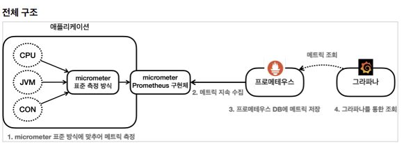

1. 스프링 부트 액츄에이터와 마이크로미터를 사용하면 수 많은 메트릭을 자동으로 생성한다.
   - 마이크로미터 프로메테우스 구현체는 프로메테우스가 읽을 수 있는 포멧으로 메트릭을 생성한다.
2. 프로메테우스는 이렇게 만들어진 메트릭을 지속해서 수집한다.
3. 프로메테우스는 수집한 메트릭을 내부 DB에 저장한다.
4. 사용자는 그라파나 대시보드 툴을 통해 그래프로 편리하게 메트릭을 조회한다. 이때 필요한 데이터는 프로메테우스를 통해서 조회한다

# 4. 프로메테우스 설치 및 설정

설치 : https://prometheus.io/download/
실행 : `prometheus.exe` 실행

기본 포트는 9090 이다. `http://localhost:9090`

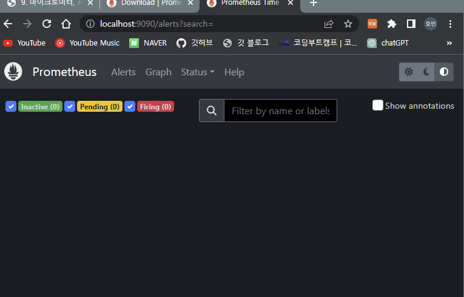

## 프로메테우스 - 애플리케이션 설정

프로메테우스가 우리 애플리케이션의 메트릭을 수집하도록 연동하려면 2가지 작업이 필요하다.

1. 애플리케이션 설정: 프로메테우스가 애플리케이션의 메트릭을 가져갈 수 있도록 애플리케이션에서 프로메테우스 포멧에 맞추어 메트릭 만들기
2. 프로메테우스 설정: 프로메테우스가 우리 애플리케이션의 메트릭을 주기적으로 수집하도록 설정

**build.gradle 추가**

```java
implementation 'io.micrometer:micrometer-registry-prometheus' //추가
```

- 이렇게 하면 스프링 부트와 액츄에이터가 자동으로 마이크로미터 프로메테우스 구현체를 등록해서 동작하도록 설정해준다. 

- 액츄에이터에 프로메테우스 메트릭 수집 엔드포인트가 자동으로 추가된다. `/actuator/prometheus`

- 실행 : `http://localhost:8080/actuator/prometheus`

  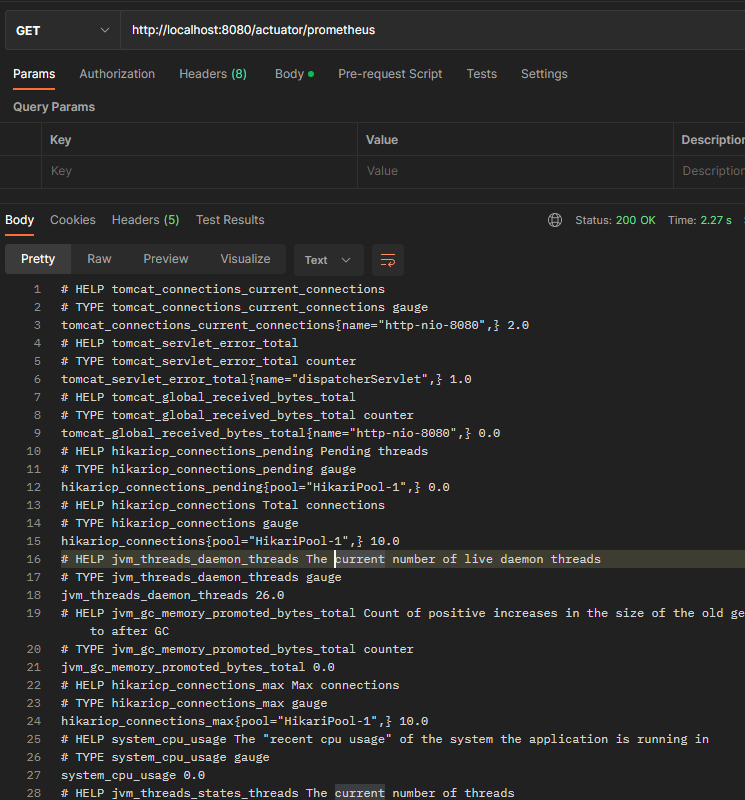

- 모든 메트릭이 프로메테우스 포멧으로 만들어 진 것을 확인할 수 있다.

## 프로메테우스 - 수집 설정

이제 프로메테우스가 애플리케이션의 /actuator/prometheus 를 호출해서 메트릭을 주기적으로 수집하도록 설정해보자.
프로메테우스 폴더에 있는 prometheus.yml 파일을 수정해야 한다.

**prometheus.yml**

제일 아래에 다음과 같이 추가한다.

```yaml
...

scrape_configs:
  - job_name: "prometheus"
    static_configs:
      - targets: ["localhost:9090"]

#추가되는 부분
  - job_name: "spring-actuator"
    metrics_path: '/actuator/prometheus'
    scrape_interval: 1s # normally set 10s~1m
    static_configs:
      - targets: ['localhost:8080']
```

- scrape_interval 은 수집할 주기인데, 보통 15s~1m 이며 default 는 1m 이다. 하지만 실습을 위해 1s 로 설정했다.
- 이렇게 설정하면 프로메테우스는 다음 경로를 1초에 한번씩 호출해서 애플리케이션의 메트릭들을 수집한다. `http://localhost:8080/actuator/prometheus`

**프로메테우스 연동 확인**

- 프로메테우스 메뉴 -> Status -> Configuration 에 들어가서 `prometheus.yml` 에 입력한 부분이 추가되어 있는지 확인해보자. http://localhost:9090/config

  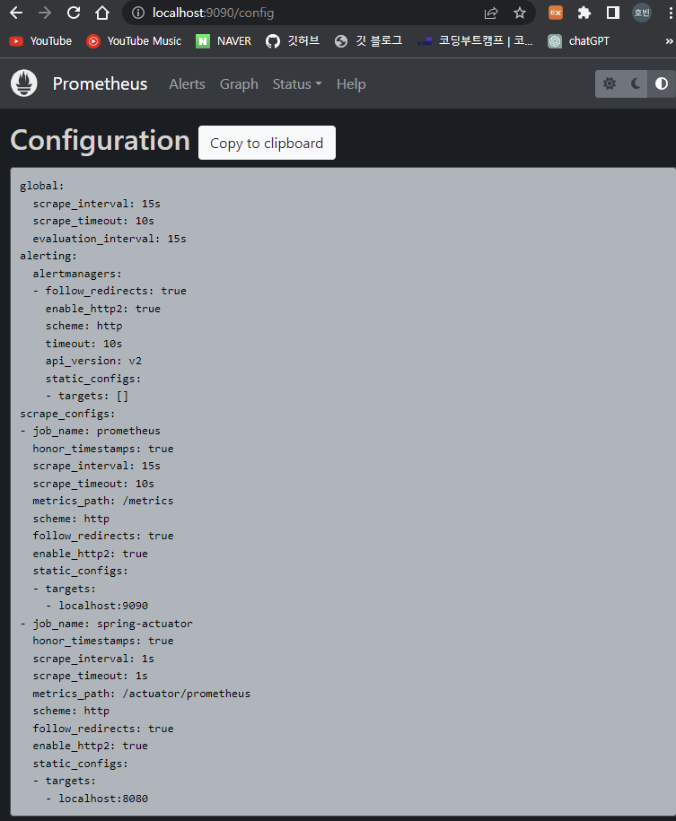

**프로메테우스를 통한 데이터 조회**

프로메테우스를 통해서 연동한 메트릭을 간단히 조회해보자.

- jvm_info 를 검색창에 넣고 실행해보면 수집한 메트릭을 조회할 수 있다.

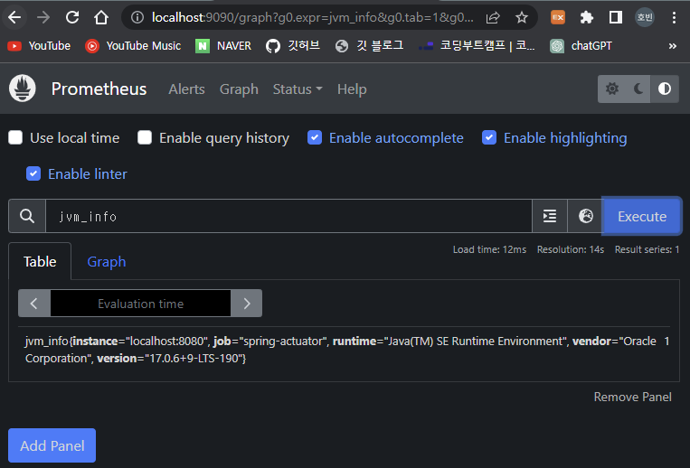

# 5. 프로메테우스 - 기본 기능

검색창에 http_server_requests_seconds_count 를 입력하고 실행해보자

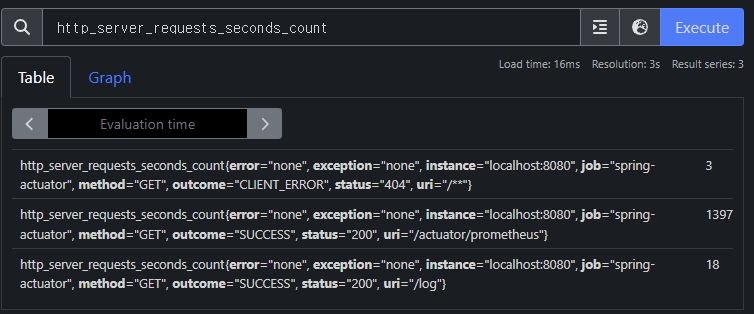

- 태그, 레이블: error , exception , instance , job , method , outcome , status , uri 는 각각의 메트릭 정보를 구분해서 사용하기 위한 태그이다. 마이크로미터에서는 이것을 태그(Tag)라 하고, 프로메테우스에서는 레이블(Label)이라 한다. 
- 숫자: 끝에 마지막에 보면 132 , 4 와 같은 숫자가 보인다. 이 숫자가 바로 해당 메트릭의 값이다.

**기본 기능**

- Table : Evaluation time 을 수정해서 과거 시간 조회 가능 
- Graph : 메트릭을 그래프로 조회 가능

**필터**

레이블을 기준으로 필터를 사용할 수 있다. 필터는 중괄호( {} ) 문법을 사용한다.

**레이블 일치 연산자**

- `=` : 제공된 문자열과 정확히 동일한 레이블 선택 
- `!=` 제공된 문자열과 같지 않은 레이블 선택 
- `=~` 제공된 문자열과 정규식 일치하는 레이블 선택 
- `!~` 제공된 문자열과 정규식 일치하지 않는 레이블 선택

예시

- uri=/log , method=GET 조건으로 필터 : `http_server_requests_seconds_count{uri="/log", method="GET"}`
- /actuator/prometheus 는 제외한 조건으로 필터 : `http_server_requests_seconds_count{uri!="/actuator/prometheus"}`
- method 가 GET , POST 인 경우를 포함해서 필터 : `http_server_requests_seconds_count{method=~"GET|POST"}`
- /actuator 로 시작하는 uri 는 제외한 조건으로 필터 : `http_server_requests_seconds_count{uri!~"/actuator.*"}`

**연산자 쿼리와 함수**

- **sum by** : `sum by(method, status)(http_server_requests_seconds_count)` SQL의 group by 기능과 유사하다.

```
{method="GET", status="404"} 3
{method="GET", status="200"} 120
```

- **count** : `count(http_server_requests_seconds_count)` 메트릭 자체의 수 카운트
- **topk** : `topk(3, http_server_requests_seconds_count)` 상위 3개 메트릭 조회
- **오프셋 수정자** : `http_server_requests_seconds_count offset 10m` offset 10m 과 같이 나타낸다. 현재를 기준으로 특정 과거 시점의 데이터를 반환한다.
- **범위 벡터 선택기** : `http_server_requests_seconds_count[1m]` 마지막에 [1m] , [60s] 와 같이 표현한다. 지난 1분간의 모든 기록값을 선택한다.
  - 참고로 범위 벡터 선택기는 차트에 바로 표현할 수 없다. 데이터로는 확인할 수 있다. 범위 벡터 선택의 결과를 차트에 표현하기 위해서는 약간의 가공이 필요하다.

# 6. 프로메테우스 - 게이지와 카운터

메트릭은 크게 보면 게이지와 카운터라는 2가지로 분류할 수 있다.

**게이지(Gauge)**

- 임의로 오르내일 수 있는 값 
- 예) CPU 사용량, 메모리 사용량, 사용중인 커넥션

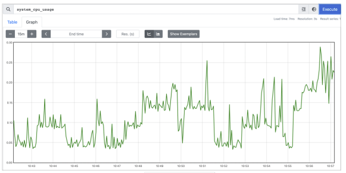

**카운터(Counter)** 

- 단순하게 증가하는 단일 누적 값 
- 예) HTTP 요청 수, 로그 발생 수

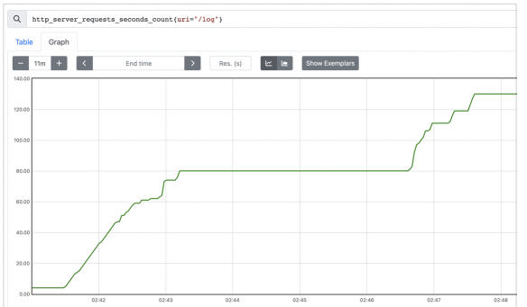

- 이렇게 증가만 하는 그래프에서는 특정 시간에 얼마나 고객의 요청이 들어왔는지 한눈에 확인하기 매우 어렵다. 이런 문제를 해결하기 위해 increase() , rate() 같은 함수를 지원한다.

**increase()**

- increase() 를 사용하면 이런 문제를 해결할 수 있다. 지정한 시간 단위별로 증가를 확인할 수 있다. 마지막에 [시간] 을 사용해서 범위 벡터를 선택해야 한다. 
- `increase(http_server_requests_seconds_count{uri="/log"}[1m])`

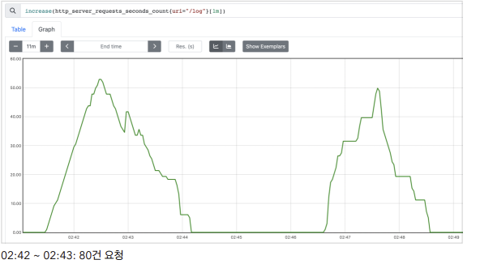

**rate()**

- 범위 백터에서 초당 평균 증가율을 계산한다.
- `rate(http_server_requests_seconds_count{uri="/log"}[1m])`

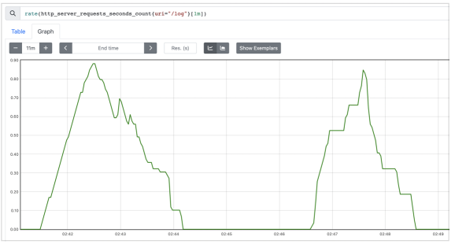

**irate()**

- rate 와 유사한데, 범위 벡터에서 초당 순간 증가율을 계산한다. 급격하게 증가한 내용을 확인하기 좋다. 

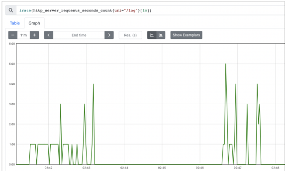


> 프로메테우스의 단점은 한눈에 들어오는 대시보드를 만들어보기 어렵다는 점이다. 이 부분은 그라파나를 사용하면 된다.

# 7. 그라파나 - 설치 및 연동

https://grafana.com/grafana/download 본인에게 맞는 OS를 선택해서 다운로드 한다.

실행 : `grafana-server.exe` 실행

`http://localhost:3000` 

- email or username: admin Password: admin

## 그라파나 - 연동

설정(톱니바퀴) 에서 Configuration 으로 들어간다.

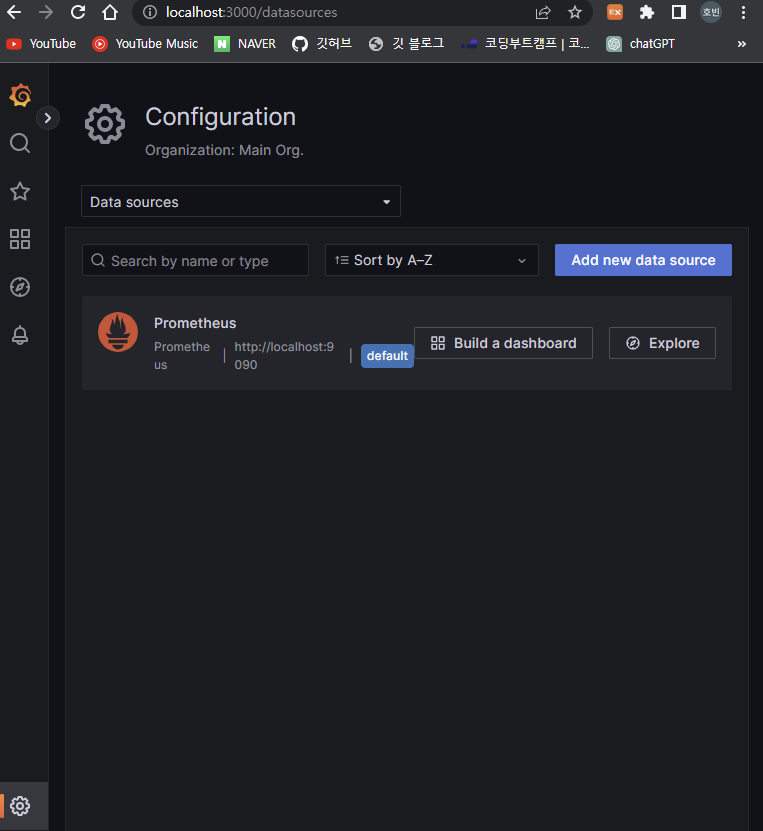

add new data source 를 클릭하고 prometheus 를 선택한다.

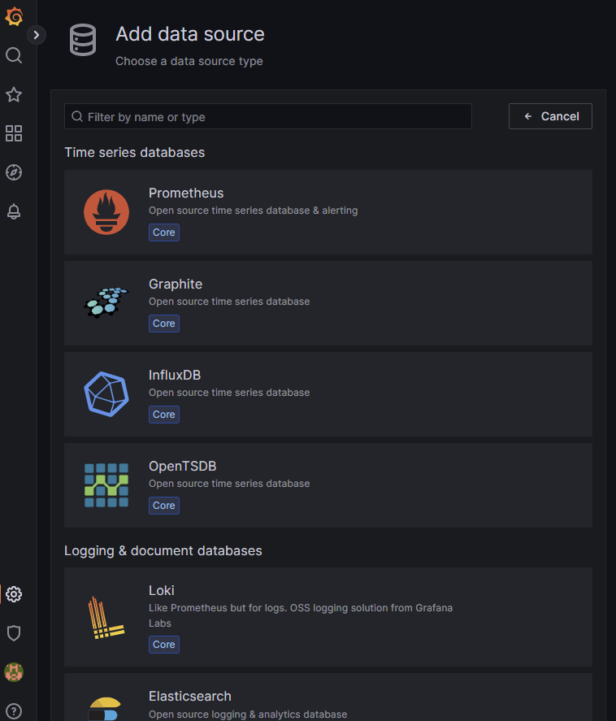

url 에 localhost:9090 을 넣으면 된다.

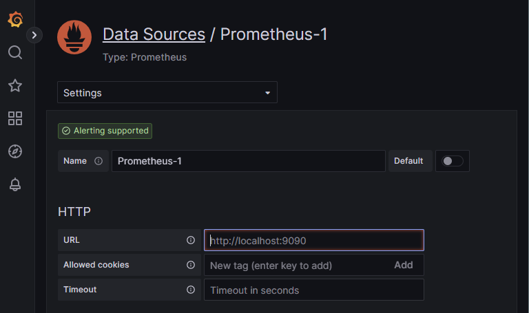

save & test 버튼을 누르면 잘 동작하는 것을 확인할 수 있다.

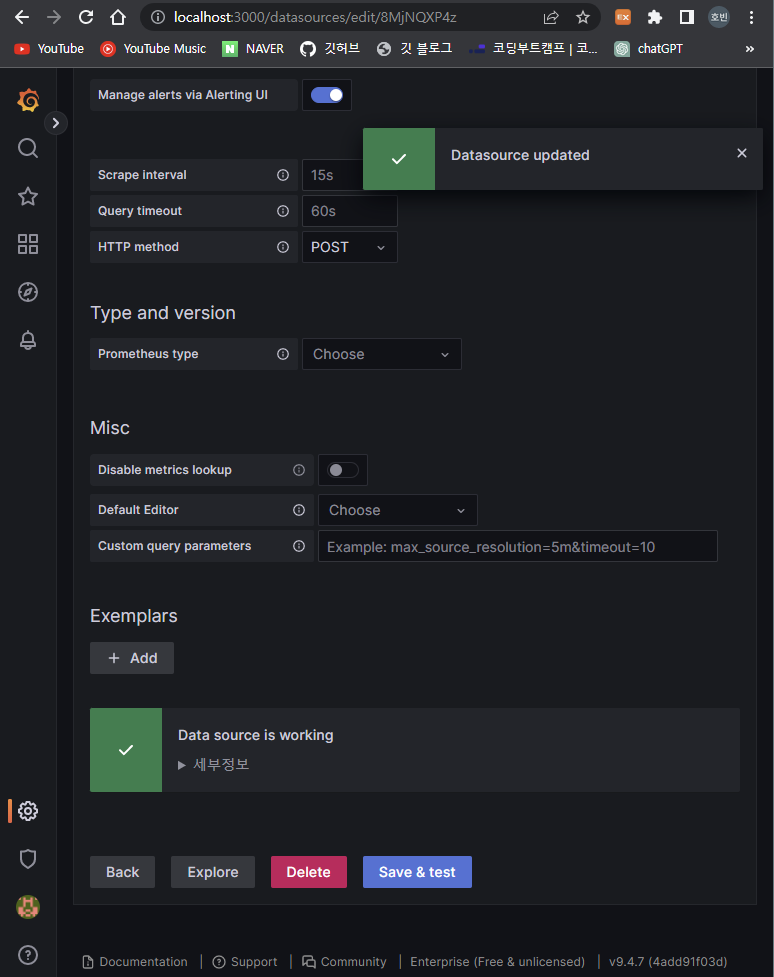


# 8. 대시보드 만들기

**대시보드 저장**

대시보드 메뉴에서 new Deashboard 클릭

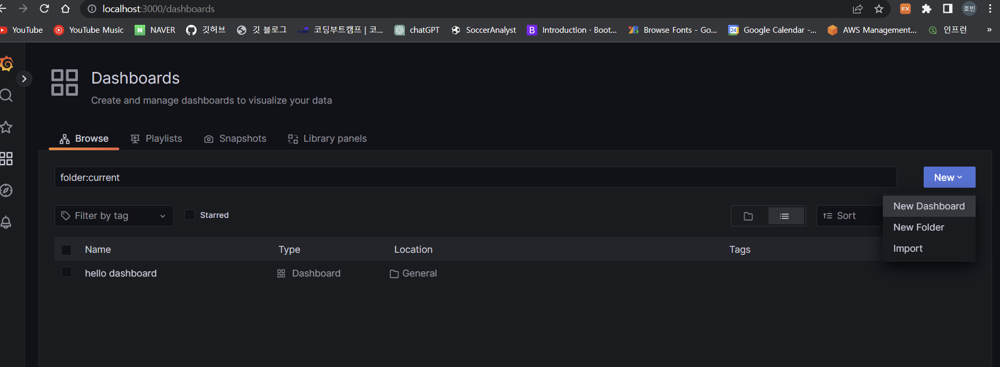

**대시보드에 패널 만들기**

1. add panel 클릭
2. add a new panel 클릭

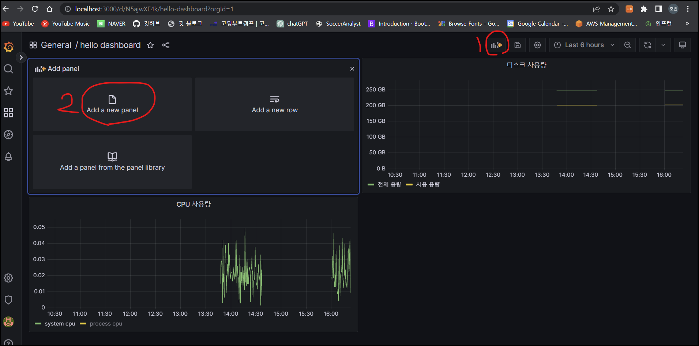

**CPU 메트릭 만들기**

1. PromQL 쿼리문 작성
2. Run queries 로 적용
3. Lgend(범례) 를 Custom 으로 변경해서 이름 작성
4. Title 에서 대시보드 변경

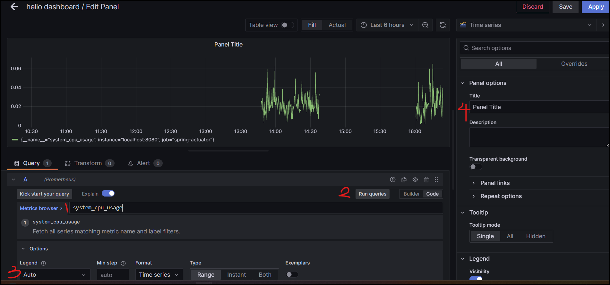

**기타 설정**

- 그래프 데이터 사이즈 변경 : `Standard options` ->  `Unit` -> `Data` 에서 적절한 사이즈로 선택
- 최소값 변경 : `Standard` ->  `options` -> `Min` 에서 선택

다음과 같이 CPU, 디스크 사용량 설정이 가능하다.

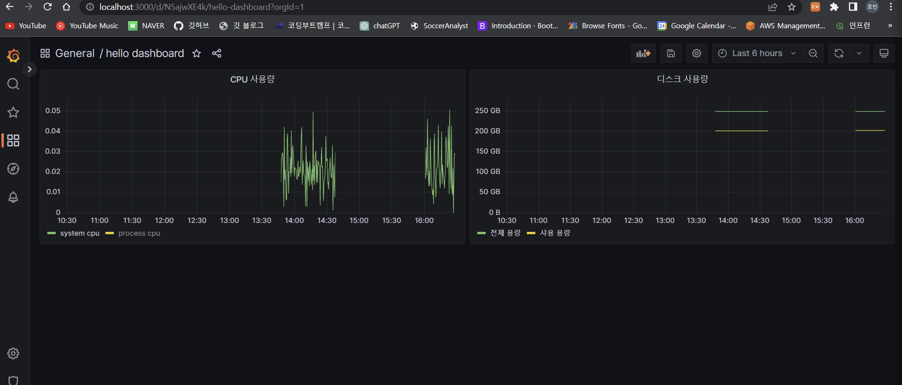


*<u>그런데 이렇게 하나하나 직접 대시보드를 입력하는 것도 참으로 힘든 일이다. 그라파나는 이미 만들어둔 대시보드를 가져다가 사용할 수 있는 기능을 제공한다.</u>*

# 9. 그라파나 - 공유 대시보드 활용

다음 사이트에 접속하자 https://grafana.com/grafana/dashboards

검색창에 spring이라고 검색해보면 다양한 대시보드를 확인할 수 있다. Copy Id to clipboard 를 선택하자. 또는 ID: 11378 이라고 되어 있는 부분의 숫자를 저장하면 된다.

**대시보드 불러오기**

1. new 에서 Import 클릭

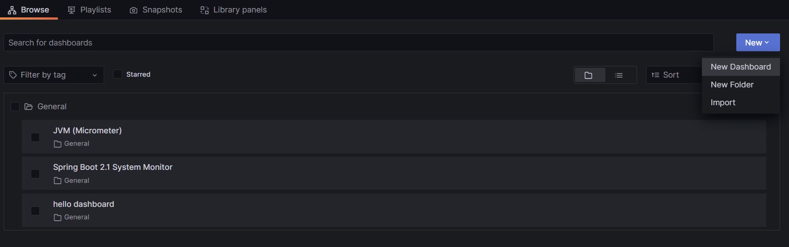

2. import via grafana.com 에 ID 입력 후 Load

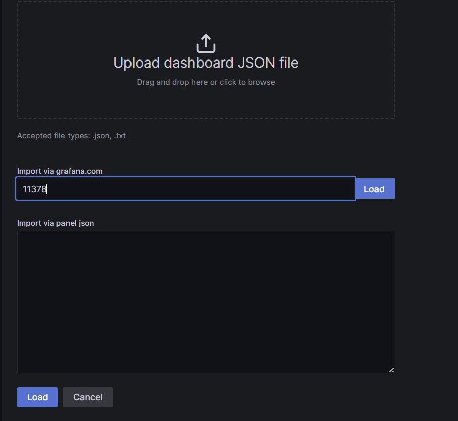

3. 다음과 같은 dashboard 를 얻을 수 있다.

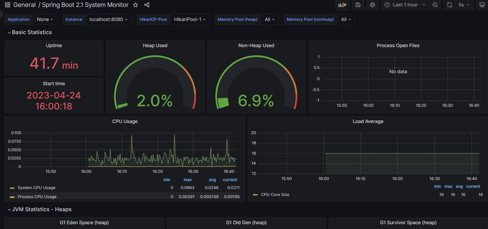

4. 오른쪽 상단의 settings 로 들어간 뒤 Editable 로 변경한다.

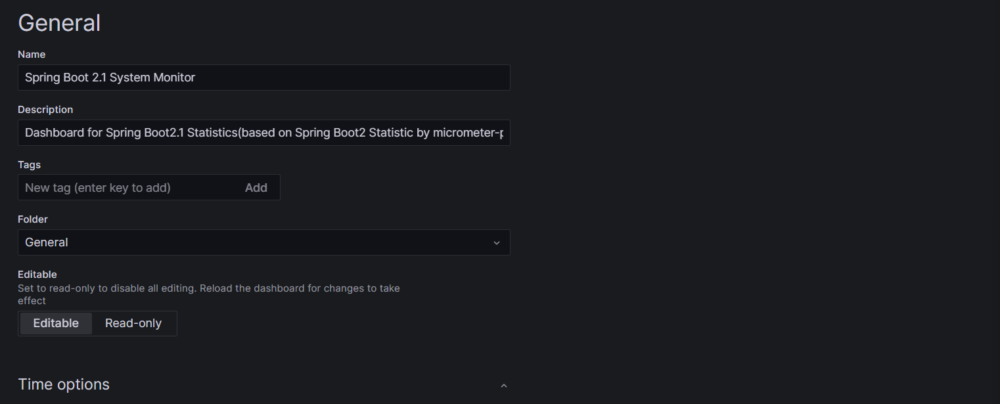

**불러온 대시보드 수정하기**

1. Thread Config Max 패널 설정 변경
   - jetty_threads_config_max -> tomcat_threads_config_max_threads 로 변경
2. Thread 패널 설정 변경
   - jetty_threads_current -> tomcat_threads_current_threads 
   - jetty_threads_busy -> tomcat_threads_busy_threads 
   - jetty_threads_idle 제거, jetty_threads_jobs 제거

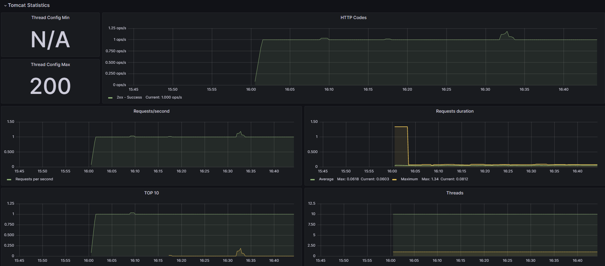

- 다음과 같이 tomcat 과 관련된 쓰레드 정보를 얻을 수 있다.