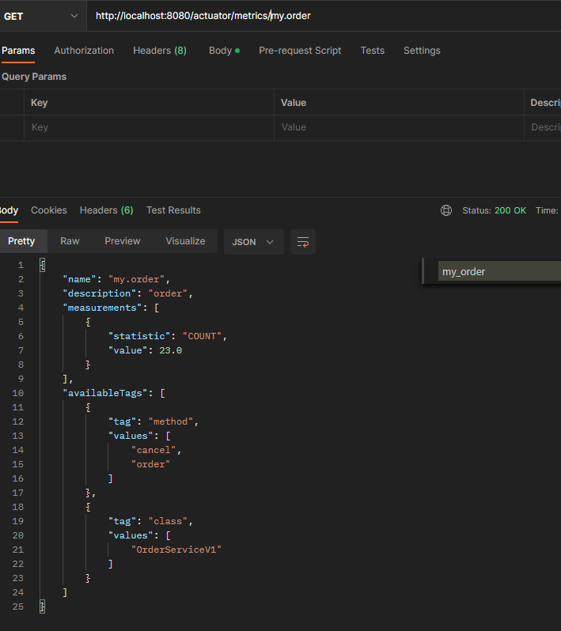
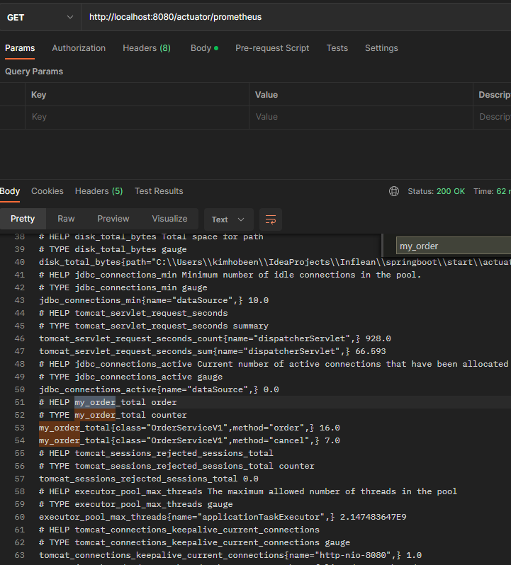
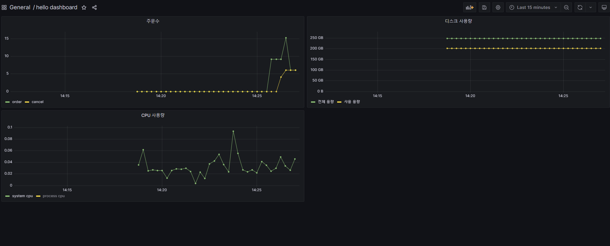
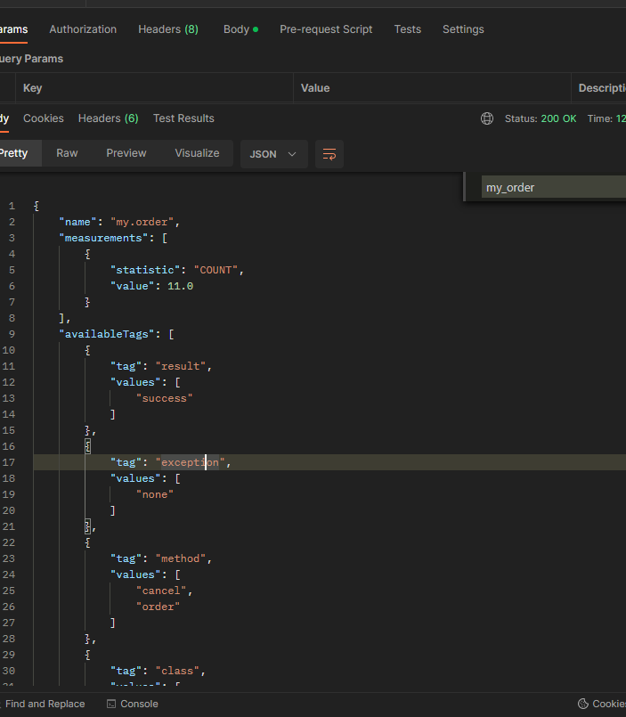
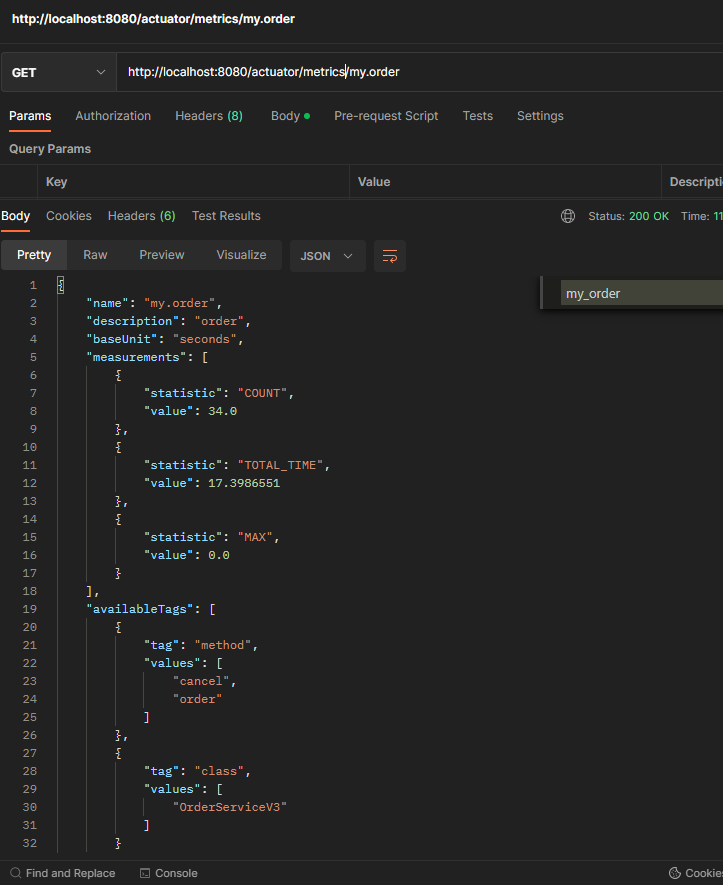
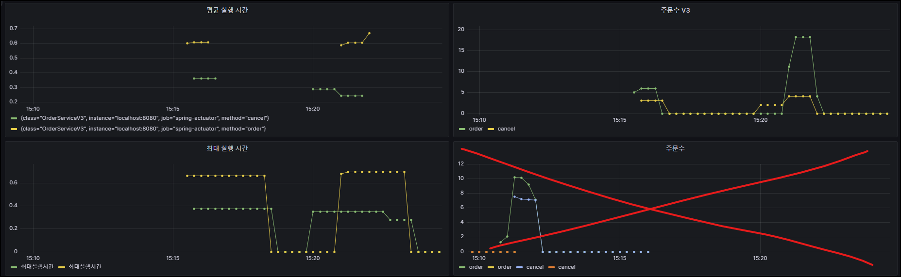
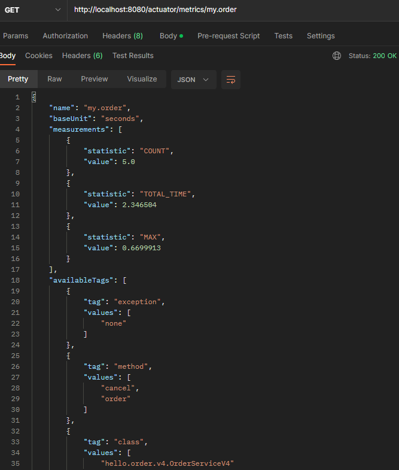
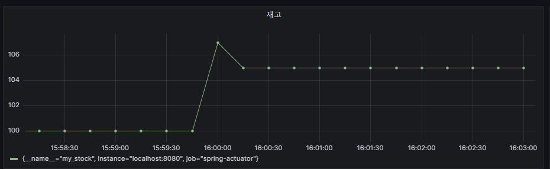

inflearn - actuator 프로젝트 사용

# 0. 메트릭 등록 - 예제 만들기

주문, 주문 취소, 재고량을 확인하는 예제다.

**OrderService**

```java
package hello.order;

import java.util.concurrent.atomic.AtomicInteger;

public interface OrderService {
    void order();
    void cancel();
    AtomicInteger getStock();
}

```

**OrderServiceV0**

```java
package hello.order.v0;

import hello.order.OrderService;
import lombok.extern.slf4j.Slf4j;

import java.util.concurrent.atomic.AtomicInteger;

@Slf4j
public class OrderServiceV0 implements OrderService {

    private AtomicInteger stock = new AtomicInteger(100);

    @Override
    public void order() {
        log.info("order");
        stock.decrementAndGet();
    }

    @Override
    public void cancel() {
        log.info("cancel");
        stock.incrementAndGet();
    }

    @Override
    public AtomicInteger getStock() {
        return stock;
    }
}
```

- `new AtomicInteger(100)` : 초기값을 100으로 설정해둔다. 재고 수량이 100부터 시작한다고 가정한다. 

**OrderConfigV0**

```java
package hello.order.v0;

import hello.order.OrderService;
import org.springframework.context.annotation.Bean;
import org.springframework.context.annotation.Configuration;

@Configuration
public class OrderConfigV0 {

    @Bean
    OrderService orderService() {
        return new OrderServiceV0();
    }
}
```

**OrderController**

```java
package hello.controller;


import hello.order.OrderService;
import lombok.extern.slf4j.Slf4j;
import org.springframework.web.bind.annotation.GetMapping;
import org.springframework.web.bind.annotation.RestController;

@Slf4j
@RestController
public class OrderController {

    public final OrderService orderService;


    public OrderController(OrderService orderService) {
        this.orderService = orderService;
    }

    @GetMapping("/order")
    public String order(){
        log.info("order");
        orderService.order();
        return "order";
    }

    @GetMapping("/cancel")
    public String cancel(){
        log.info("cancel");
        orderService.cancel();
        return "cancel";
    }

    @GetMapping("/stock")
    public int stock(){
        log.info("stock");
        return orderService.getStock().get();
    }
}
```

**ActuatorApplication**

```java
package hello;

import hello.order.v0.OrderConfigV0;
import org.springframework.boot.SpringApplication;
import org.springframework.boot.actuate.audit.InMemoryAuditEventRepository;
import org.springframework.boot.actuate.web.exchanges.InMemoryHttpExchangeRepository;
import org.springframework.boot.autoconfigure.SpringBootApplication;
import org.springframework.context.annotation.Bean;
import org.springframework.context.annotation.Import;

@SpringBootApplication(scanBasePackages = "hello.controller")
@Import(OrderConfigV0.class)
public class ActuatorApplication {

    public static void main(String[] args) {
        SpringApplication.run(ActuatorApplication.class, args);
    }

    @Bean
    public InMemoryHttpExchangeRepository httpExchangeRepository() {
        return new InMemoryHttpExchangeRepository();
    }

}
```


# 1. 메트릭 등록1 - 카운터

마이크로미터를 사용해서 메트릭을 직접 등록하는 방법을 알아보자. 먼저 주문수, 취소수를 대상으로 카운터 메트릭을 등록해보자.

**MeterRegistry**

마이크로미터 기능을 제공하는 핵심 컴포넌트. 스프링을 통해서 주입 받아서 사용하고, 이곳을 통해서 카운터, 게이지 등을 등록한다.

**Counter(카운터)**

- 단조롭게 증가하는 단일 누적 측정항목
- 프로메테우스에서는 일반적으로 카운터의 이름 마지막에 _total 을 붙여서 my_order_total 과 같이 표현함

## 주문수 취소수 서비스에 카운터 메트릭을 적용

**OrderServiceV1**

```java
package hello.order.v1;

import hello.order.OrderService;
import io.micrometer.core.instrument.Counter;
import io.micrometer.core.instrument.MeterRegistry;
import lombok.extern.slf4j.Slf4j;

import java.util.concurrent.atomic.AtomicInteger;

@Slf4j
public class OrderServiceV1 implements OrderService {

    private final MeterRegistry registry;
    private AtomicInteger stock = new AtomicInteger(100);

    public OrderServiceV1(MeterRegistry registry) {
        this.registry = registry;
    }

    @Override
    public void order() {
        log.info("order");
        stock.decrementAndGet();

        Counter.builder("my.order")
                .tag("class", this.getClass().getSimpleName())
                .tag("method", "order")
                .description("order")
                .register(registry).increment();
    }

    @Override
    public void cancel() {
        log.info("cancel");
        stock.incrementAndGet();

        Counter.builder("my.order")
                .tag("class", this.getClass().getSimpleName())
                .tag("method", "cancel")
                .description("order")
                .register(registry).increment();
    }

    @Override
    public AtomicInteger getStock() {
        return stock;
    }
}
```

- `Counter.builder(name)` 를 통해서 카운터를 생성한다. `name` 에는 메트릭 이름을 지정한다.
- `tag` 를 사용했는데, 프로메테우스에서 필터할 수 있는 레이블로 사용된다.
- 주문과 취소는 메트릭 이름은 같고 tag 를 통해서 구분하도록 했다.
- `register(registry)` : 만든 카운터를 MeterRegistry 에 등록한다. 이렇게 등록해야 실제 동작한다.
- `increment()` : 카운터의 값을 하나 증가한다.

**OrderConfigV1**

```java
package hello.order.v1;

import hello.order.OrderService;
import io.micrometer.core.instrument.MeterRegistry;
import org.springframework.context.annotation.Bean;
import org.springframework.context.annotation.Configuration;

@Configuration
public class OrderConfigV1 {

    @Bean
    OrderService orderService(MeterRegistry registry) {
        return new OrderServiceV1(registry);
    }
}
```

**ActuatorApplication - 수정**

```java
package hello;

import hello.order.v1.OrderConfigV1;
import org.springframework.boot.SpringApplication;
import org.springframework.boot.actuate.web.exchanges.InMemoryHttpExchangeRepository;
import org.springframework.boot.autoconfigure.SpringBootApplication;
import org.springframework.context.annotation.Bean;
import org.springframework.context.annotation.Import;

@SpringBootApplication(scanBasePackages = "hello.controller")
@Import(OrderConfigV1.class)
public class ActuatorApplication {

    public static void main(String[] args) {
        SpringApplication.run(ActuatorApplication.class, args);
    }

    @Bean
    public InMemoryHttpExchangeRepository httpExchangeRepository() {
        return new InMemoryHttpExchangeRepository();
    }

}
```

- OrderConfigV0 -> OrderConfigV1 이 설정되도록 변경한다.

### 실행

주문과 취소를 각각 한번씩 실행한 다음에 메트릭을 확인해보자. (각각 실행해야 메트릭이 등록된다.)

**액츄에이터 메트릭 확인**



- 메트릭을 확인해보면 method 로 구분할 수 있다.

**프로메테우스 포멧 메트릭 확인**

`http://localhost:8080/actuator/prometheus`



- 메트릭 이름이 my.order my_order_total 로 변경된 것을 확인할 수 있다.

**그라파나 등록 - 주문수, 취소수**

- Title : 주문수
- `increase(my_order_total{method="order"}[1m])` / Legend : `{{method}}`
- `increase(my_order_total{method="cancel"}[1m])` / Legend : `{{method}}`

> 참고: 카운터는 계속 증가하기 때문에 특정 시간에 얼마나 증가했는지 확인하려면 increase() , rate() 같은 함수와 함께 사용하는 것이 좋다.



# 2. 메트릭 등록2 - @Counted

AOP 를 활용해서 Service 클래스의 메트릭 등록을 분리해보자.
마이크로미터는 이런 상황에 맞추어 필요한 AOP 구성요소를 이미 다 만들어두었다.

**OrderServiceV2**

```java
package hello.order.v2;

import hello.order.OrderService;
import io.micrometer.core.annotation.Counted;
import lombok.extern.slf4j.Slf4j;

import java.util.concurrent.atomic.AtomicInteger;

@Slf4j
public class OrderServiceV2 implements OrderService {

    private AtomicInteger stock = new AtomicInteger(100);

    @Counted("my.order")
    @Override
    public void order() {
        log.info("order");
        stock.decrementAndGet();

    }

    @Counted("my.order")
    @Override
    public void cancel() {
        log.info("cancel");
        stock.incrementAndGet();

    }

    @Override
    public AtomicInteger getStock() {
        return stock;
    }
}
```

- `@Counted` 애노테이션을 측정을 원하는 메서드에 적용한다. 주문과 취소 메서드에 적용했다.
- 그리고 메트릭 이름을 지정하면 된다. 여기서는 이전과 같은 `my.order` 를 적용했다.
- 이렇게 사용하면 `tag` 에 `method` 를 기준으로 분류해서 적용한

**OrderConfigV2**

```java
package hello.order.v2;

import hello.order.OrderService;
import io.micrometer.core.aop.CountedAspect;
import io.micrometer.core.instrument.MeterRegistry;
import org.springframework.context.annotation.Bean;
import org.springframework.context.annotation.Configuration;

@Configuration
public class OrderConfigV2 {

    @Bean
    public OrderService orderService() {
        return new OrderServiceV2();
    }

    @Bean
    public CountedAspect countedAspect(MeterRegistry registry) {
        return new CountedAspect(registry);
    }
}
```

- CountedAspect 를 등록하면 @Counted 를 인지해서 Counter 를 사용하는 AOP를 적용한다.

**Metrics 확인**



- `@Counted` 를 사용하면 result , exception , method , class 같은 다양한 `tag` 를 자동으로 적용한다.

# 3. 메트릭 등록3 - Timer

**Timer**

Timer는 좀 특별한 메트릭 측정 도구인데, 시간을 측정하는데 사용된다.

Timer 는 다음과 같은 내용을 한번에 측정해준다.

- `seconds_count` : 누적 실행 수 - 카운터 
- `seconds_sum` : 실행 시간의 합 - sum 
- `seconds_max` : 최대 실행 시간(가장 오래걸린 실행 시간) - 게이지
  - 내부에 타임 윈도우라는 개념이 있어서 1~3분 마다 최대 실행 시간이 다시 계산된다.

**OrderServiceV3**

```java
package hello.order.v3;

import hello.order.OrderService;
import io.micrometer.core.instrument.Counter;
import io.micrometer.core.instrument.MeterRegistry;
import io.micrometer.core.instrument.Timer;
import lombok.extern.slf4j.Slf4j;

import java.util.Random;
import java.util.concurrent.atomic.AtomicInteger;

@Slf4j
public class OrderServiceV3 implements OrderService {

    private final MeterRegistry registry;
    private AtomicInteger stock = new AtomicInteger(100);

    public OrderServiceV3(MeterRegistry registry) {
        this.registry = registry;
    }

    @Override
    public void order() {
        Timer timer = Timer.builder("my.order")
                .tag("class", this.getClass().getSimpleName())
                .tag("method", "order")
                .description("order")
                .register(registry);

        timer.record(() -> {
            log.info("order");
            stock.decrementAndGet();
            sleep(500);
        });

    }

    @Override
    public void cancel() {
        Timer timer = Timer.builder("my.order")
                    .tag("class", this.getClass().getSimpleName())
                    .tag("method", "cancel")
                    .description("order")
                    .register(registry);

        timer.record(() -> {
            log.info("cancel");
            stock.incrementAndGet();
            sleep(200);
        });
    }

    @Override
    public AtomicInteger getStock() {
        return stock;
    }

    private static void sleep(int l) {
        try {
            Thread.sleep(l + new Random().nextInt(200));
        } catch (InterruptedException e) {
            throw new RuntimeException(e);
        }
    }
}
```

- Timer.builder(name) 를 통해서 타이머를 생성한다. `name` 에는 메트릭 이름을 지정한다.
- `register(registry)` : 만든 타이머를 `MeterRegistry` 에 등록한다. 이렇게 등록해야 실제 동작한다. 
- 타이머를 사용할 때는 `timer.record()` 를 사용하면 된다. 그 안에 시간을 측정할 내용을 함수로 포함하면 된다.

*\* 걸리는 시간을 확인하기 위해 주문은 0.5초, 취소는 0.2초 대기하도록 했다.*

**OrderConfigV3**

```java
package hello.order.v3;

import hello.order.OrderService;
import hello.order.v1.OrderServiceV1;
import io.micrometer.core.instrument.MeterRegistry;
import org.springframework.context.annotation.Bean;
import org.springframework.context.annotation.Configuration;

@Configuration
public class OrderConfigV3 {

    @Bean
    OrderService orderService(MeterRegistry registry) {
        return new OrderServiceV3(registry);
    }
}
```


## 실행

주문과 취소를 각각 한번씩 실행한 다음에 메트릭을 확인해보자.

**액츄에이터 메트릭 확인**



- measurements 항목을 보면 COUNT, TOTAL_TIME, MAX 이렇게 총 3가지 측정 항목을 확인할 수 있다.

**그라파나 등록**



- 평균 실행 시간 : `increase(my_order_seconds_sum[1m]) / increase(my_order_seconds_count[1m])`
- 주문수 
  - `increase(my_order_seconds_count{method="order"}[1m])` / Legend : `{{method}}`
  - `increase(my_order_seconds_count{method="cancel"}[1m])` / Legend : `{{method}}`
- 최대 실행시간 : `my_order_seconds_max`


# 4. 메트릭 등록4 - @Timed

타이머는 `@Timed` 라는 애노테이션을 통해 AOP를 적용할 수 있다.

**OrderServiceV4**

```java
package hello.order.v4;

import hello.order.OrderService;
import io.micrometer.core.annotation.Timed;
import io.micrometer.core.instrument.MeterRegistry;
import io.micrometer.core.instrument.Timer;
import lombok.extern.slf4j.Slf4j;

import java.util.Random;
import java.util.concurrent.atomic.AtomicInteger;

@Slf4j
@Timed("my.order")
public class OrderServiceV4 implements OrderService {

    private AtomicInteger stock = new AtomicInteger(100);

    @Override
    public void order() {

        log.info("order");
        stock.decrementAndGet();
        sleep(500);

    }

    @Override
    public void cancel() {
        log.info("cancel");
        stock.incrementAndGet();
        sleep(200);
    }

    @Override
    public AtomicInteger getStock() {
        return stock;
    }

    private static void sleep(int l) {
        try {
            Thread.sleep(l + new Random().nextInt(200));
        } catch (InterruptedException e) {
            throw new RuntimeException(e);
        }
    }
}
```

- `@Timed("my.order")` : 타입이나 메서드 중에 적용할 수 있다. 타입에 적용하면 해당 타입의 모든 public 메서드에 타이머가 적용된다. 참고로 이 경우 `getStock()` 에도 타이머가 적용된다.

**OrderConfigV4**

```java
package hello.order.v4;

import hello.order.OrderService;
import hello.order.v2.OrderServiceV2;
import io.micrometer.core.aop.CountedAspect;
import io.micrometer.core.aop.TimedAspect;
import io.micrometer.core.instrument.MeterRegistry;
import org.springframework.context.annotation.Bean;
import org.springframework.context.annotation.Configuration;

@Configuration
public class OrderConfigV4 {

    @Bean
    public OrderService orderService() {
        return new OrderServiceV4();
    }

    @Bean
    public TimedAspect timedAspect(MeterRegistry registry) {
        return new TimedAspect(registry);
    }
}
```

**액츄에이터 메트릭 확인** 

http://localhost:8080/actuator/metrics/my.order



- exception 태크까지 있는 것을 확인할 수 있다.

**그라파나 대시보드 확인**

- 메트릭 이름과 `tag` 가 기존과 같으므로 같은 대시보드에서 확인할 수 있다.


# 5. 메트릭 등록5 - 게이지

**Gauge(게이지)**

게이지는 임의로 오르내릴 수 있는 단일 숫자 값을 나타내는 메트릭이다. 예) 차량의 속도, CPU 사용량, 메모리 사용량

## StockConfigV1

**StockConfigV1**

- 다음과 같이 inner class 를 생성하여 config 하나로 등록할 수 있다.

```java
package hello.order.gauge;

import hello.order.OrderService;
import io.micrometer.core.instrument.Gauge;
import io.micrometer.core.instrument.MeterRegistry;
import jakarta.annotation.PostConstruct;
import lombok.extern.slf4j.Slf4j;
import org.springframework.context.annotation.Bean;
import org.springframework.context.annotation.Configuration;

@Configuration
public class StockConfigV1 {

    @Bean
    public MyStockMetric myStockMetric(OrderService orderService, MeterRegistry registry){
        return new MyStockMetric(orderService, registry);
    }

    @Slf4j
    static class MyStockMetric{
        private OrderService orderService;
        private MeterRegistry registry;

        public MyStockMetric(OrderService orderService, MeterRegistry registry) {
            this.orderService = orderService;
            this.registry = registry;
        }

        @PostConstruct
        public void init(){
            Gauge.builder("my.stock", orderService, service -> {
                log.info("stock gauge call");
                return service.getStock().get();
            }).register(registry);
        }
    }
}
```

- `my.stock` 이라는 이름으로 게이지를 등록했다.
- 게이지를 만들 때 함수를 전달했는데, 이 함수는 외부에서 메트릭을 확인할 때 마다 호출된다. 이 함수의 반환 값이 게이지의 값이다.

**ActuatorApplication - 변경**

```java
package hello;

import hello.order.gauge.StockConfigV1;
import hello.order.gauge.StockConfigV2;
import hello.order.v1.OrderConfigV1;
import hello.order.v2.OrderConfigV2;
import hello.order.v3.OrderConfigV3;
import hello.order.v4.OrderConfigV4;
import org.springframework.boot.SpringApplication;
import org.springframework.boot.actuate.web.exchanges.InMemoryHttpExchangeRepository;
import org.springframework.boot.autoconfigure.SpringBootApplication;
import org.springframework.context.annotation.Bean;
import org.springframework.context.annotation.Import;

@SpringBootApplication(scanBasePackages = "hello.controller")
@Import({OrderConfigV4.class, StockConfigV1.class})
public class ActuatorApplication {

    public static void main(String[] args) {
        SpringApplication.run(ActuatorApplication.class, args);
    }

    @Bean
    public InMemoryHttpExchangeRepository httpExchangeRepository() {
        return new InMemoryHttpExchangeRepository();
    }
}
```


**실행**

- 애플리케이션을 실행하면 stock gauge call 로그가 주기적으로 남는 것을 확인할 수 있다. 게이지를 확인하는 함수는 외부에서 메트릭을 확인할 때 호출 된다. 현재 프로메테우스가 다음 경로를 통해 주기적으로 메트릭을 확인하기 때문이다. `http://localhost:8080/actuator/prometheus`
- 프로메테우스를 종료해보면 해당 함수가 호출되지 않는 것을 확인할 수 있다. 물론 메트릭 확인 경로를 직접 호출하면 해당 함수가 호출된다.

**액츄에이터 메트릭 확인**


**그라파나 등록 - 재고**

- 패널 옵션 - Title : 재고 
- PromQL : my_stock



## StockConfigV2 - 게이지 단순하게 등록하기

**StockConfigV2**

- `MeterBinder` 타입으로 바로 반환해도 된다.

```java
package hello.order.gauge;

import hello.order.OrderService;
import io.micrometer.core.instrument.Gauge;
import io.micrometer.core.instrument.MeterRegistry;
import io.micrometer.core.instrument.binder.MeterBinder;
import jakarta.annotation.PostConstruct;
import lombok.extern.slf4j.Slf4j;
import org.springframework.context.annotation.Bean;
import org.springframework.context.annotation.Configuration;

@Slf4j
@Configuration
public class StockConfigV2 {

    @Bean
    public MeterBinder stockSize(OrderService orderService){
        return registry -> Gauge.builder("my.stock", orderService, service -> {
            log.info("stock gauge call");
            return service.getStock().get();
        }).register(registry);
    }
}
```

- 실행 결과는 똑같다.


# 정리

메트릭은 100% 정확한 숫자를 보는데 사용하는 것이 아니다. 약간의 오차를 감안하고 실시간으로 대략의 데이터를 보는 목적으로 사용한다.

## 실무 모니터링 환경 구성 팁

모니터링 3단계 : 대시보드, 애플리케이션 추적 - 핀포인트, 로그

**대시보드** : 전체를 한눈에 볼 수 있는 가장 높은 뷰(마이크로미터, 프로메테우스, 그라파나 등등)

- 시스템 메트릭(CPU, 메모리) 
- 애플리케이션 메트릭(톰캣 쓰레드 풀, DB 커넥션 풀, 애플리케이션 호출 수) 
- 비즈니스 메트릭(주문수, 취소수)

**애플리케이션 추적** : 주로 각각의 HTTP 요청을 추적, 일부는 마이크로서비스 환경에서 분산 추적

- 핀포인트(오픈소스), 스카우트(오픈소스), 와탭(상용), 제니퍼(상용)

**로그** : 가장 자세한 추적

- 원하는데로 커스텀 가능 같은 HTTP 요청을 묶어서 확인할 수 있는 방법이 중요
- MDC 적용

**알람은 2가지 종류로 꼭 구분해서 관리** (경고, 심각)

- 경고는 하루 1번 정도 사람이 직접 확인해도 되는 수준(사람이 들어가서 확인) 심각은 즉시 확인해야 함, 
- 슬랙 알림(앱을 통해 알림을 받도록), 문자, 전화