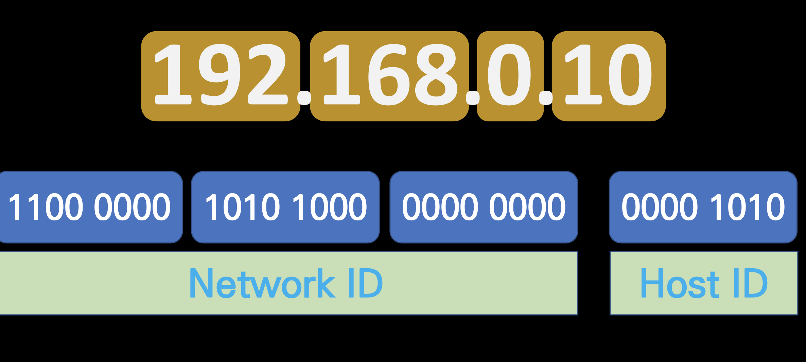
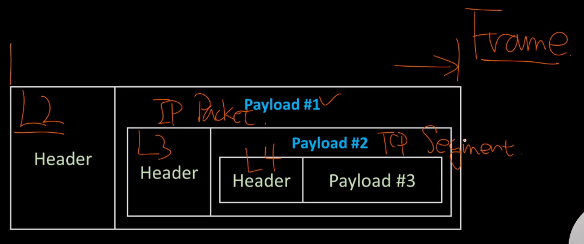
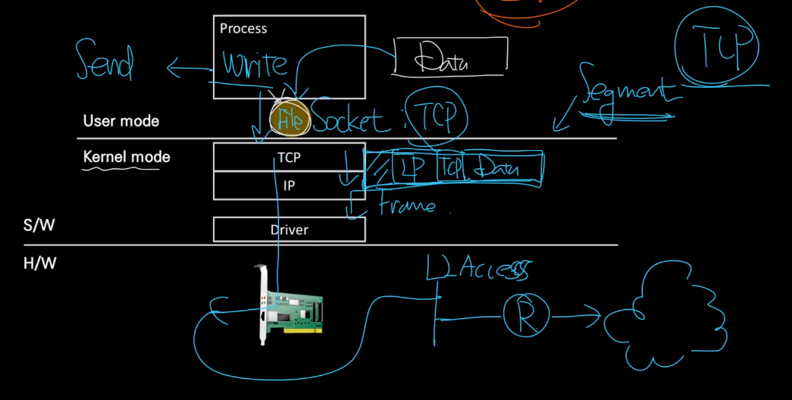
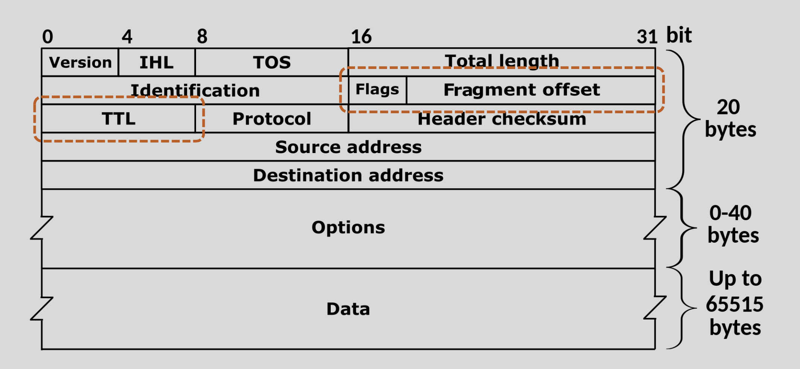

# IPv4

IP 주소는 네트워크 상에서 호스트를 식별하기 위한 식별자입니다. 



네트워크 ID, 호스트 ID 로 나눌 수 있습니다. **네트워크 ID**는 네트워크를 구분하여 주는 ID입니다. 네트워크 ID가 같다는 의미는 같은 네트워크 상에 있다는 의미로, 같은 네트워크 상에 있다면 서로 자유롭게 통신을 할 수 있습니다.  **호스트 ID**는 해당 네트워크에 속한 사용자에게 부여하는 고유의 번호입니다.

# L3 IP Packet, Encapsulation, Decapsulation

​	Packet 은 IP 의 단위 데이터로 최대크기는 MTU(1500byte) 입니다. IP 는 Header 와 Payload 로 나뉘어지는데 Header 에는 Dst, Src 와 같은 정보가 포함되어 있습니다.

**Encapsulation**

​	캡슐화는 보내려는 데이터를 '단위화' 하는 것입니다. 



위 전체는 Frame 입니다. 따라서 Header 는 L2 의 헤더이며 안에 Payload 가 있습니다. 그 Payload 안에는 또 L3 의 패킷이 있습니다. 또 반복적으로 L4 의 Segment 가 있습니다.

**Decapsulation**

Decapsulation 은 캡슐화의 반대로, 단위를 L2 Frame 에서 데이터를 추출한 뒤, 그 안에서 다시 데이터를 추출하는 과정을 반복하는 것입니다. 즉, 껍질을 계속 벗다고 보면 됩니다.


# 패킷의 생성과 전달

​	패킷의 흐름은 아래 그림을 보면 이해하기 쉽습니다.



​	process 에서는 보낼 데이터를 Socket 을 통해 커널 영역으로 보냅니다. 그러면 L4 에서 TCP 헤더를 붙인 segment 를 만듭니다. 다시 L3 에서 IP 헤더를 붙여 Packet 을 만들고, L2 에서 Frame 헤더를 붙여서 최종적으로 NIC 밖으로 나갑니다. 그러면 스위치와 라우터를 통과하고 네트워크로 나가게 됩니다. 

​	네트워크 상에서 목적지를 찾게 되면 반대로 decapsulation 되면서 최종적으로 데이터만 목적지 process 로 전달됩니다.


# TCP/IP 송수신 구조

​	naver 서버에서 이미지를 다운로드 받는 상황을 가정하겠습니다. 컴퓨터와 네이버가 TCP 로 잘 연결되었다고 할 때, 네이버가 이미지를 잘 포장해서 네트워크로 보내는 것이 송신의 과정이 되겠습니다.

1. SSD, HDD, DB 등에서 이미지를 Block 단위로 읽어서 프로세스의 Buffer 에 적재됩니다.
2. 프로세스 Buffer 에 담겨있는 데이터가 소켓 I/O Buffer 로 Copy 됩니다.(소켓 I/O  에 Buffer 가 있으면 buffered I/O, 없으면 non0buffered I/O)
3. 소켓에서 커널 영역으로 데이터를 넘길 때 Segment 크기에 맞게 분해하고 넘버링을 합니다. (L4)
4. Segment 는 다시 L3 로 넘어와 패킷이 됩니다.
5. Paket 은 L2 계층에서 프레임이 되어 나가는데, 중요한 건 이 Frame 은 네트워크 상에서 수시로 바뀝니다. 

이제 수신과정을 보겠습니다.

1. 네트워크 상에서 도착지로 Frame 을 보내서 수신측에서 받습니다. 받으면 Frame 은 사라집니다. (L2)
2. 패킷에서 Segment 를 꺼냅니다. (L3)
3. Segment 에서 데이터를 꺼 Socket I/O buffer 에 쌓습니다. buffer 가 어느정도 쌓이면 어플리케이션이 buffer 에서 데이터를 꺼냅니다.
4. buffer 에 일정 데이터가 쌓이면 송신측으로 ACK 를 보내 어디까지 받았다고 보냅니다. 
5. 송신측 또한 데이터를 어느정도 보내면 wait 를 하며 ACK 가 올 때까지 기다립니다. 만약 ACK 가 안오면 Re-transmission 을 합니다.

송수신 과정에서 다음과 같은 문제가 발생할 수 있습니다.

**Loss** : 네트워크 상에서 데이터가 유실되는 문제로 주로 네트워크의 문제입니다.

**ACK-Duplicated** : 송신측이 wait 를 하고 있다가 ACK 가 오지 않으면 데이터를 다시 보냅니다. 하지만 수신측에서 ACK 신호를 보냈는데 송신측에 아직 도달하지 않았을 경우 수신측은 데이터를 다시 받고 ACK 신호를 또 보내게 됩니다. 이는 네트워크의 문제일수도 있고 end-point 의 문제일 수도 있습니다.

**Out of Order** : 데이터가 순서대로 도착하지 않는 문제로 주로 네트워크 문제입니다.

**Zero Window** : 수신측에서 Socket 여유 공간(window size) 가 없어 데이터를 받을 수 없는 상태로 end-point 의 문제입니다.


# IP 헤더 형식

​	패킷의 크기는 최대 MTU(1500bytes) 이며 그  Header 는 20bytes 입니다. IP 의 형식은 아래 그림을 보도록 하겠습니다.



패킷은 그림과 같이 32bit 씩 끊어서 처리됩니다.

- Version : IPv4, IPv6 등의 형식입니다.
- IHL : Internet Header Length 로 헤더의 길이입니다. 값이 보통 5 인데, 5줄이 header 임을 의미하고, 5줄이면 20bytes 입니다.
- TOS : Type Of Service 로, 교환하는 데이터의 종류에 따라 지연 통신효율, 신뢰성의 우선순위를 지정할 수 있습니다.
- Total length : 패킷 전체의 길이로, 최대 2^16 bytes 만큼 지정할 수 있습니다. 하지만 보통 MTU 크기만큼 지정합니다.
- Identification : 두번째 줄은 모두 단편화와 관련있습니다. 다른 네트워크에서 MTU 가 1300 bytes 면 데이터를 쪼개야 하기 때문입니다. identification 은 호스트가 전송한 패킷을 유일하게 식별해줍니다.
- Flags : 패킷이 쪼개질 수 있는지, 패킷이 조각났을 때 뒤에 다른조각이 있는지에 대한 항목입니다.
- Fragment offset : 단편화된 조각들을 하나의 패킷으로 합칠 때 전체 데이터그램에서의 위치 표시입니다.
- TTL : Time To Live, 패킷이 지날 수 있는 라우터 수에 대한 생존시간입니다.
- Protocol : 패킷에 입력된 상위 계층의 프로토콜을 말합니다. (TCP, UDP 등) 상위 계층에서 어떤 프롴토콜로 해석해야 하는지 알려줍니다.
- Header checksum : IP 헤더 손상여부를 파악할 수 있습니다.
- Source address : 출발지 주소로, 32비트입니다.
- Destination address : 목적지 주소입니다. 

# 서브넷 마스크와 CIDR

​	서브넷 마스크와 CIDR 둘다 네트워크 ID 와 호스트 ID 를 식별하기 위한 방법입니다. 서브넷 마스크 표기는 다음과 같습니다.

```
192.168.0.10
255.255.255.0
```

서브넷 마스크와 IP 의 각 옥텟을 and 연산한 값이 네트워크 ID 입니다. 192 & 255.168 & 255.0 & 255.10 & 0 으로 192.168.0.0 이 네트워크 ID 입니다. 이렇게 계산하는 것을 mask 연산이라고 합니다. 이때 8비트를 네트워크 ID 로 사용하는 것을 A 클래스, 16비트를 B 클래스, 24비트를 C 클래스라고 하는데, 이렇게 비교하는 이유는 컴퓨터의 구조적 특징 때문입니다. 하지만 컴퓨터 성능이 발전하면서 현재는 class 개념을 사용하지 않습니다.

​	CIDR 는 Classless Inter-Domian Routing 의 약자로 다음과 같이 표기합니다.

```
192.168.0.10/24
```

Classless 에서 알 수 있듯이 클래스 개념이 없고, 앞에서부터 몇개의 비트가 네트워크 ID 인지 `/` 를 통해 표시합니다.

# Broadcast IP 주소

host ID 부분을 전부 1 로 채우면 네트워크 id 를 가지는 모든 호스트에 브로드캐스팅을 합니다. 예를 들어서 다음과 같이 보내면 해당 네트워크 전체에 대한 브로드캐스팅입니다.

```
192.168.0.255/24
```


# Host 자신을 가리키는 IP 주소

​	프로세스 2개가 실행될 때 한 프로세스가 다른 프로세스로 접근해야 할 때가 있습니다. 이때 IP 주소로 127.0.0.1 을 사용하면 자기 자신의 IP 로 접근할 수 있습니다. 이 IP 를 loopback IP 라고 하며 이러한 통신을 IPC(프로세스 간 통신, Inter-Process Communication) 이라고 합니다.


# TTL 과 단편화

​	TTL(Time To Live) 는 세포의 '텔로미어' 같은 역할을 합니다. 패킷이 네트워크 상을 떠돌아다니다가 목적지를 못찾으면 소멸되게 됩니다. 보통 128 이나 255 를 기본 단위로 합니다. TTL 은 라우터를 지날 때마다 1 씩 줄어드는데, 이 라우터 간 간격을 홉(Hop) 이라고 합니다.

​	단편화는 MTU 크기 차이로 발생합니다. MTU 는 보통 1500 bytes 인데 1400 bytes 인 네트워크(라우터)가 있으면 패킷이 유실될 수도 있기 때문에, 데이터를 쪼개고 각각 IP 헤더를 붙여서 2개의 패킷을 만듭니다. 그리고 패킷의 조립은 수신측이 책임집니다. 예를 들어 송신측과 수신측 사이에 라우터가 3개 있다고 가정하겠습니다. 
(송신 - 1 - 2 - 3 - 수신)
이 때 2번 라우터의 MTU 크기가 1400bytes 면 2번 라우터에서 패킷이 둘로 나뉜 뒤 수신측까지 전송됩니다. 패킷이 나뉘면 IP 헤더에서 Flags 와 Fragment offset 이 변경됩니다.


# DHCP

​	컴퓨터로 네트워크를 사용하기 위해서는 IP 주소, Gateway 주소, Subnet mask 등을 설정해야 합니다. 하지만 우리는 컴퓨터를 연결할 때 이를 직접하지 않고 DHCP(Dynamic Host Configuration Protocol) 체계를 사용하여 주소를 할당하는 서버로부터 설정정보를 받습니다.

​	이러한 DHCP 서버는 게이트웨이 안쪽에 있습니다. host 는 시작하면서 브로드캐스팅으로 DHCP 서버를 찾고, 처음으로 할당받거나 전에 쓰던 IP 가 있으면 계속 써도 되는지 묻습니다. 만약 처음 할당받는다면 DHCP 서버는 IP pool 에서 IP 주소, Gateway 주소, Subnet mask 등을 Host 로 보내게 됩니다.


# ARP

​	ARP 는 IP 주소로 MAC 주소를 알아내려할 때 사용되는 3계층 프로토콜입니다. 보통의 경우 PC 를 부팅하면 gateway 의 MAC 주소를 찾아내기 위해 ARP Request 가 발생하고, Gateway 는 Reply 로 MAC 주소를 반환합니다.

​	end-point 는 받은 MAC 주소로 frame 을 구성합니다. 즉, google 로 보내는 frame 을 만들 때 google 의 MAC 주소가 아닌 gateway 의 MAC 주소가 씌워집니다. 계속해서 ip 로 다음 라우터를 찾으면서 해당 라우터의 MAC 주소를 Frame 에 씌우며 네트워크를 돌아다니게 됩니다.