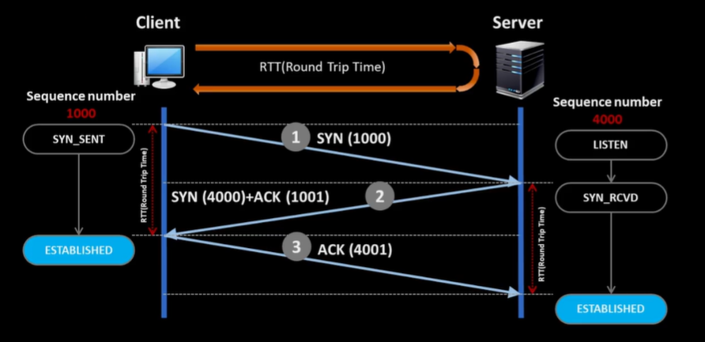
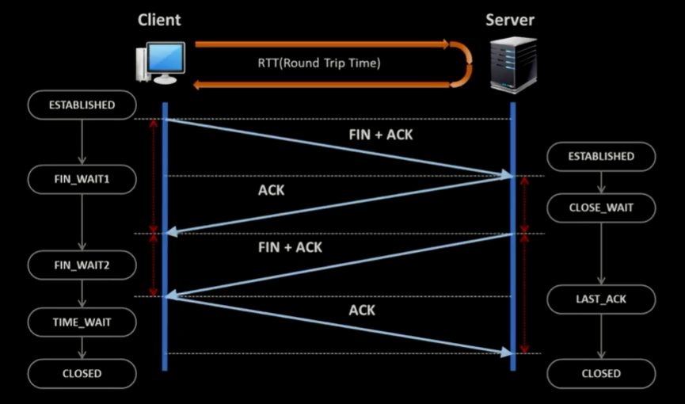
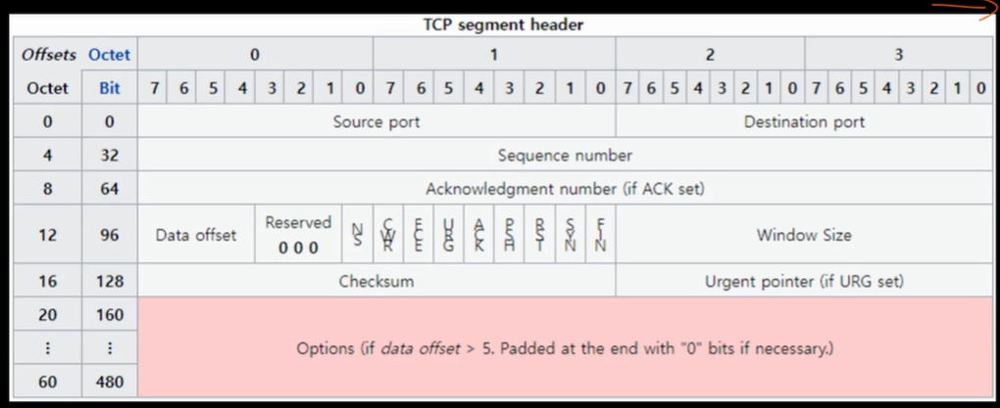
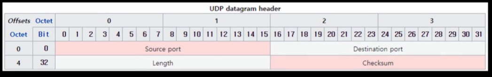

# TCP 연결과정

​	TCP 의 연결과정은 3-way handshaking 으로 진행됩니다. 두 end-point 는 이 과정을 통해 sequence number 와 여러가지 정책을 교환합니다. 이 정책 중 중요한 정책은 **MSS(Maximum segment size)** 로, 각 end-point 가 받을 수 있는 segment 의 사이즈입니다. 만약 MSS 가 다르다면 두 end-point 중 하나가 Segment size 를 줄여야겠죠.

1. 클라이언트 측에서 연결이 가능한지 **SYN** Segment 를 보냅니다. 연결과정의 Segment 는 payload 가 없고 단순히 연결을 위한 데이터입니다. 여기에 Sequence number 가 들어가있습니다.
1. 서버측에서 SYN 을 받으면 잘 받았다는 의미로 클라이언트측의 Sequence number 에 1 을 더하고, 자신의 Sequence number 를 포함하여 **ACK** 로 보냅니다.
1. 클라이언트 측이 ACK 를 받으면 서버측으로 ACK 를 보내면서 연결이 성공적으로 됐다고 판단합니다.
1. 서버 측도 ACK 를 받으면 연결이 성공적으로 됐다고 판단합니다. 따라서 연결 성공 시점의 판단은 클라이언트와 서버 측이 다릅니다.

# TCP 연결종료 및 상태변화

​	다음은 TCP 연결종료 과정으로 4-way handshaking 입니다.

1. 클라이언트에서 연결을 끊자는 의미로 FIN + ACK 를 서버로 보내고 FIN 을 기다리는 FIN_WAIT 상태가 됩니다.
2. 서버는 FIN + ACK 를 받으면 응답의 의미로 ACK 를 보냅니다.
3. 클라이언트는 ACK 를 받으면 다시 서버로부터 FIN + ACK 가 올 때까지 FIN_WAIT 상태가 됩니다.
4. 서버는 일정시간 뒤에 다시 FIN + ACK 를 보냅니다.
5. 클라이언트는 FIN + ACK 를 받고 TIME_WAIT 상태가 됩니다. 일정 시간이 지나면 소켓이 회수됩니다.
6. 서버가 ACK 를 받으면 소켓이 회수됩니다.

여기서 중요한 점은 서버를 끊자고 한 쪽에서 TIME_WAIT 가 발생한다는 점입니다.  Socket 은 자원이기 때문에 시간이 지나야만 소켓이 회수됩니다. 특히 서버는 소켓 자원을 관리해야 하기 때문에 먼저 연결을 끊자고 하기보다는 클라이언트가 연결을 끊도록 유도해야 합니다. 

아래 표는 지금까지의 연결과 종료를 도표로 표현한 것입니다.

# TCP/UDP Header 형식

먼저 TCP 헤더입니다.

1. Source port / Destination port : 출발, 도착지 포트번호입니다. 포트번호는 2^16 으로 표현되는데, 0번과 65535번은 없습니다.
2. Sequence number : 데이터 길이(byte 단위) 만큼 증가하며 다쓰면 다시 1부터 시작합니다. 예를 들어 이전 Sequence number 가 1000 이었고 이번 세그먼트의 길이가 200 이면 Sequence number 는 1200 이 됩니다.
3. Acknowledgment number : ACK 는 잘 받았다는 의미로, sequence number + 1 로 응답합니다.
4. Data offset : segment payload 위치를 나타냅니다. IP 의 IHL 과 비슷한 의미입니다.
5. flags : 어떤 플래그인지 명시합니다.
6. Window Size : 소켓에 남은 여유공간을 나타냅니다.
7. checksum : 데이터 손상 여부 확인할 수 있습니다.

다음은 UDP 헤더입니다. 송수신측 포트번호, 길이, Checksum 만 있습니다. 게임이나 IPTV 등 데이터를 빨리 보내야 하고 네트워크 상태에 맞춰서 동기화를 하면 품질이 저하될 때 사용합니다.

# TCP '연결' 이라는 착각

​	파일을 다운로드 중 LAN 케이블을 분리했다가 다시 연결하면 TCP 연결은 어떻게 될까요? 잠깐 분리했다가 다시 연결하면 파일은 정상적으로 다운로드가 됩니다. 즉, 연결은 일정시간 유지되는거죠. 운영체제는 '재전송 타이머' 를 통해 연결 상태를 지속적으로 확인합니다.

​	재전송 타이머의 기본  근사 값은 대략 3초지만 대부분의 운영체제들은 1초 미만입니다. 재전송 타이머 만료 후에서 확인 응답을 받지 못한 경우 세그먼트를 재전송하고 **RTO (Retransmission TIme-Out)** 을 2배로 증가시킵니다. RTO 가 1초, 2초, 4초, 8초, 16초 간격으로 늘어나면서 재전송하는거죠. 따라서 랜케이블을 분리하고 1 ~ 2초 후에 다시 연결하면 파일 다운로드가 잠깐 멈췄다가 다시 되는겁니다. L4 의 논리적 연결은 지속되어있기 때문입니다.

​	랜케이블이 빠지는 것과 같이 응답을 못받는 상황을 충격이라고 하는데, 유선랜은 드물지만 무선랜에서는 잦은 상황입니다. Wifi 가 변경되거나 지하철에서 특정구간에 잠깐씩 무선 연결이 끊길 수도 있지만 스트리밍이 완전히 멈추지는 않죠. 이러한 재전송은 5회 시도고 5회 이상 모두 실패 시 보통 전송 오류가 발생합니다.

​	서버와 클라이언트 입장에서 TCP 연결은 정말로 '연결' 된 것이 아니라 연결되었다고 가정하고 데이터를 주고 받는 것입니다. 어떤 논리적인 통로가 개설된 게 아니라는 거죠.