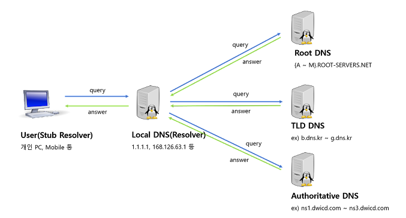

# DNS

Domain Name Service 는 Domain Name 을 통해 IP 를 검색해서 얻을 수 있는 데이터베이스 서비스입니다. DNS 데이터 베이스는 트리 구조의 도메인 네임 체계입니다.

​	예를 들어 www.naver.com 을 주소창에 입력하면 host 는 먼저 DNS 서버에 질의를 하고 네이버의 ip 주소를 얻습니다. 이 때 유효기간도 같이 오게 되는데요. host 는 유효기간과 ip 주소를 저장하게 됩니다. 유효기간이 2시간이면 2시간 동안은 추가적인 DNS 서버 질의 없이 네이버에 접속할 수 있게 되는 겁니다. 이를 **DNS Cache** 라고 합니다. 또한 DNS 질의 없이 컴퓨터 내의 hosts 파일에 정보를 기술해놓을 수도 있고, 공유기가 DNS 서버 역할을 할 수도 있습니다.(forth-forwarding) 다음 그림을 보겠습니다.

1. user 가 Local DNS 에 Domain Name(www.naver.com) 을 질의합니다.
1. 만약 Local DNS 에 해당 Domain Name 이 없다면 DNS 서버 트리구조의 제일 루트노드인 Root DNS 서버에 질의합니다.
1. Root DNS 는 .com 목록이 있는 DNS 서버의 ip 목록을 알려줍니다.
1. Local DNS 는 해당 ip 로 naver.com 을 질의합니다.
1. TLD DNS 서버는 naver.com 의 ip 를 알려줍니다.
1. Local DNS 는 Domain Name 의 ip 까지는 알아냈습니다. 이제 해당 ip 인 naver.com 으로 질의하여 호스트 도메인(www.naver.com) 의 ip 주소를 질의합니다.
1. naver.com 에서는 host ip 주소를 알려줍니다.
1. Local DNS 는 해당 주소를 DNS Cache 에 저장하고 user 에게 응답합니다.