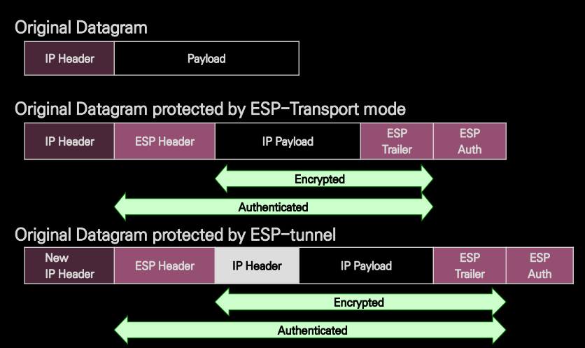
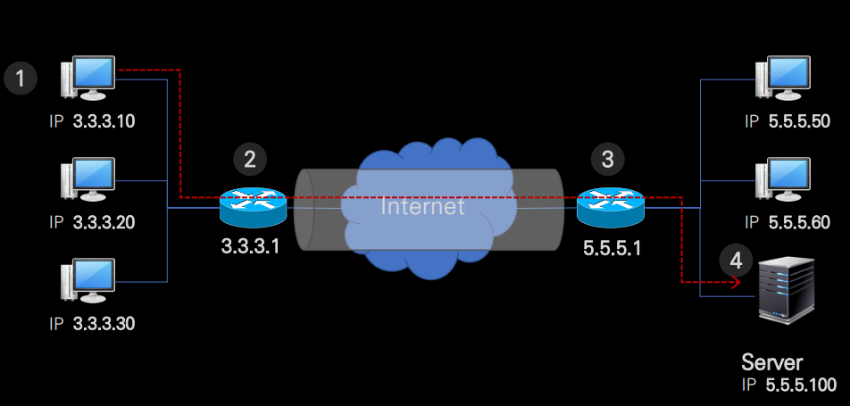
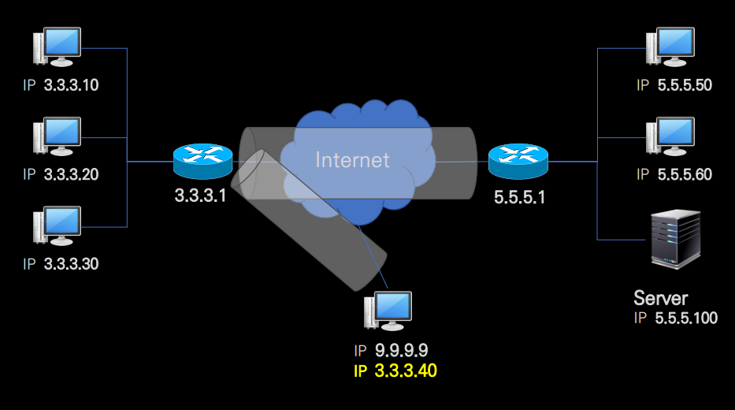

# PN 과 VPN

​	**PN** 은 Private Network 입니다. PN 은 사설망으로, 물리적으로 통제가 되는 범위의 네트워크이며 개략적으로 LAN 이라고 볼 수 있습니다. 따라서 보안성이 요구되는 네트워크망입니다.

​	**VPN** 은 PN 앞에 Virtual 이 붙은 가상 사설망입니다. VPN 은 Internet 의 인프라를 쓰되 PN 이 요구하는 보안성을 추가해서 확장하는 기술입니다. 즉, Public 망을 논리적으로 Private 하게 만들어주는 가상 망입니다. 다음과 같은 기술을 사용합니다.

- **보안 서비스 기술** : 내부 사설망을 외부로부터 스스로 보호하고, 사용자 인증을 통한 접근 통제가 가능하도록 하능 기술
- **데이터 인증 및 암호화 기술** : 무결성과 기밀성을 위해 모든 트래픽에 인증 메커니즘을 적용하거나, 정보 유출의 방지를 위해서 암호화하는 기술
- **터널링 기술** : 기존의 공개 네트워크에서 가상의 사설 망을 구성하기 위해, 기존 네트워크에서 정보 이동이 가능하도록 정보를 캡슐화하고, 다시 풀어 내어 논리적으로 두 네트워크를 연결하는 기술

# IPSec VPN 과 터널링

IPSec 은 IP Security 이며, 터널링은 터널에 들어간 것처럼 안보인다는 뜻으로 데이터를 암호화한 것입니다. 다음과 같이 암호화된다고 보면 되고, IP 를 터널링하므로 **L3 Tunneling** 입니다.

여기에 적용되는 IP Sec Protocol 은 크게 3 가지가 있습니다.

- ISAKMP (Internet Security Association Key Management Protocol) : 보안 협상 및 암호화 키들을 관리하는 메커니즘입니다.
- IP AH (Authentication Header) : 데이터의 원본 인증 및 무결성 재연공격 방지 기능을 제공합니다.
- IP ESP (Encapsulation Security Payload) : 데이터의 기밀성, 원본 인증, 기밀성 재연공격 방지 기능을 제공합니다.

1번 pc 가 2번 라우터를 통과할 때 IP packet 에 위와 같은 프로토콜이 적용되는 겁니다. 따라서 인터넷 망에서 해당 패킷의 출발지와 목적지는 알 수 있지만 어떤 내용인지는 모릅니다. 3번 라우터를 통과할 때 복호화가 됩니다.

# VPN GtoE

​	VPN GtoG 는 게이트웨이 간 PN 입니다. 하지만 개인이 재택근무를 통해 회사 서버로 접속하기 원한다면 어떻게 될까요? 이를 위한 통신이 **VPN GtoE** 입니다.

아래에 있는 9.9.9.9 가 접속을 원하는 재택 근무 pc 입니다. 해당 pc 에 VPN Client 를 설치한다면 Secure Gateway(3.3.3.1) 에 해당 host 에 새로운 ip 주소를 할당합니다. (3.3.3.40) 따라서 해당 호스트는 ip 가 2개 생깁니다. 

​	최초 host 에서 패킷이 나갈 때는 src 3.3.3.40, dst 5.5.5.100 으로 갑니다. 이때 IPSec 프로그램이 이 모든 패킷을 암호화하고 src 9.9.9.9, dst 3.3.3.1 로 변경하여 Secure Gateway 로 보냅니다. Secure Gateway 가 받으면 복호화를 하고 다시 암호화하여 src 는 3.3.3.1, dst 는 5.5.5.1 로 변경하여 보냅니다. 서버 gateway 가 해당 패킷을 받고 복호화를 하면 결국 src 3.3.3.40, dst 5.5.5.100 가 남고, 서버로 패킷이 보내지게 됩니다. 복잡해보이지만 결국, 데이터를 Secure Gateway 로 보내서 다시 server 로 보내는 기술입니다.

​	이런 VPN 이 악용된다면 마치 다른 IP 에서 접속하는 것처럼 속이는 게 가능하겠습니다