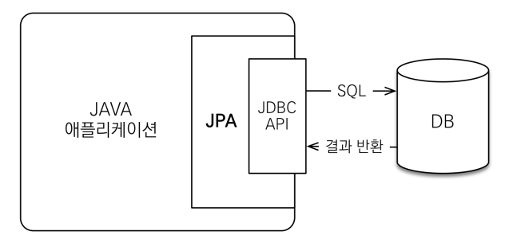
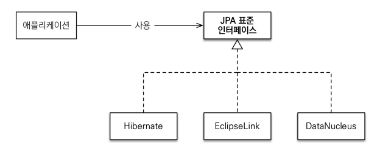

# JPA 소개

​	객체는 객체 지향의 특징을 가지고(상속, 다형성, 추상화, 캡슐화) RDB 는 관계 지향형입니다. 따라서 상속, 연관관계 설정, 데이터 타입, 데이터 식별 방법 등에서 차이가 있습니다. 이러한 차이를 해소하기 위한 기술이  **ORM(Object-relational mapping)**입니다. ORM 은 객체와 RDB 의 차이 때문에 등장하게 되었습니다. 

​	ORM 은 객체는 객체대로, RDB 는 RDB 대로 설계하고 ORM 프레임워크가 중간에서 매핑합니다. 그리고 **JPA(Java Persistence API) 는 자바 진영의 ORM 기술 표준**입니다. 아래와 같은 구조로 되어있습니다.

​	

> JPA 는 Hibernate 라는 오픈소스에서 출발한 표준입니다.

​	JPA 는 표준 명세로서, 인터페이스의 모음이라고 볼 수 있습니다. JPA 표준 명세를 위한 3가지 구현체가 있는데 그중에 **Hibernate** 를 주로 사용합니다.

# JPA 를 사용하는 이유

1. 생산성이 향상됩니다.
   - 저장 : jpa.persist(member)
   - 조회 : Member member = jpa.find(memberId)
   - 수정 : member.setName("변경할 이름")
   - 삭제 : jpa.remove(member)
2. JPA 는 필드만 추가하면 되고, SQL 은 JPA 가 처리하기 때문에 **유지보수 영역이 줄어듭니다.**
3. JPA 와 패러다임의 불일치를 해결해줍니다. (상속, 연관관계, 객체 그래프 탐색, 조회된 객체 간 비교 등)
   - 같은 트랜잭션 내에서 객체의 동일성을 보장해줍니다. 
4. JPA 의 성능 최적화 기능이 있습니다.
   - 1차 캐시와 동일성 보장 (JPA 에서 결과를 캐시합니다.)
   - 트랜잭션을 지원하는 쓰기 지연이 있습니다.
   - 지연로딩(객체가 실제 사용될 때 로딩), 즉시 로딩(JOIN SQL 로 한번에 연관된 객체까지 미리 조회) 를 둘 다 지원합니다.