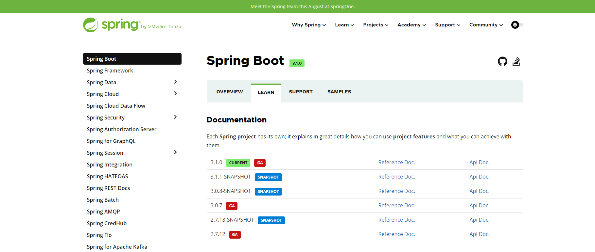
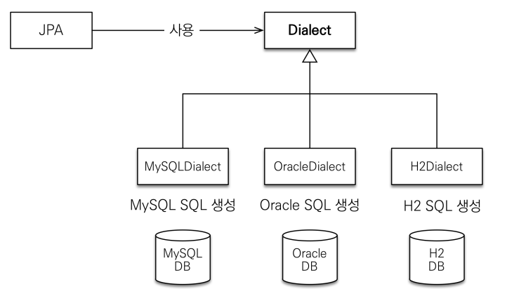
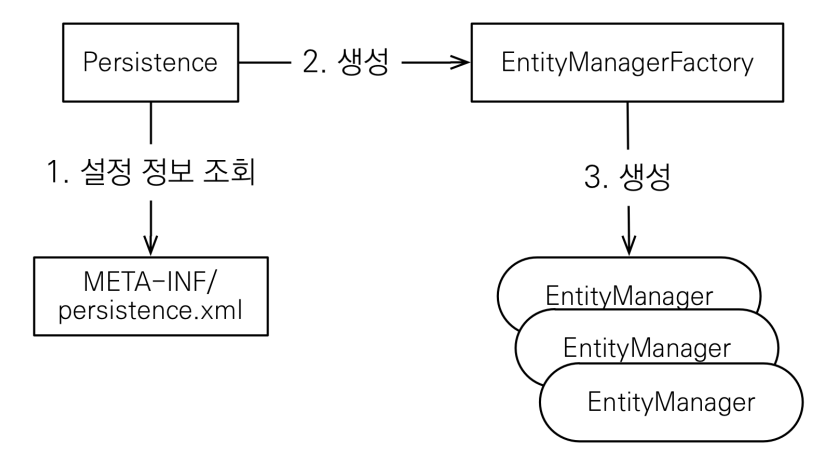
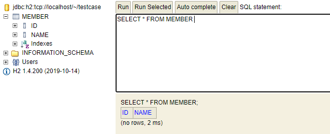

# 실습 환경

​	실습 환경 세팅입니다. 

- H2

- java 11, Maven

- springboot : 2.7.12 (강의와 최대한 맞췄습니다.)

- dependencies : hibernate-entitymanager, h2

  - 버전은 아래 페이지에서 검색해줍니다. https://spring.io/projects/spring-boot#learn

    

## persistence.xml

​	JPA 를 사용하기 위해서 먼저 설정을 해줘야 합니다. 설정은 resources 에서 META-INF 디렉토리에 넣습니다. 해당 디렉토리는 spring 이 읽는 설정파일이라고 보면 됩니다.

```xml
<?xml version="1.0" encoding="UTF-8"?>
<persistence version="2.2"
 xmlns="http://xmlns.jcp.org/xml/ns/persistence" xmlns:xsi="http://www.w3.org/2001/XMLSchema-instance"
 xsi:schemaLocation="http://xmlns.jcp.org/xml/ns/persistence http://xmlns.jcp.org/xml/ns/persistence/persistence_2_2.xsd">
<!-- 이름 지정 -->
 <persistence-unit name="hello">
 <properties>
 <!-- 필수 속성 -->
 <property name="javax.persistence.jdbc.driver" value="org.h2.Driver"/>
 <property name="javax.persistence.jdbc.user" value="sa"/>
 <property name="javax.persistence.jdbc.password" value=""/>
 <property name="javax.persistence.jdbc.url" value="jdbc:h2:tcp://localhost/~/test"/>
 <property name="hibernate.dialect" value="org.hibernate.dialect.H2Dialect"/>

 <!-- 옵션 -->
 <property name="hibernate.show_sql" value="true"/>
 <property name="hibernate.format_sql" value="true"/>
 <property name="hibernate.use_sql_comments" value="true"/>
 <!--<property name="hibernate.hbm2ddl.auto" value="create" />-->
 </properties>
 </persistence-unit>
</persistence>
```

​	여기서 javax.persistence 는 JPA 표준속성이고, hibernate 로 시작하는 건 hibernate 전용 속성입니다. libarary 가 바뀌면 사용하지 못합니다.

​	JPA 는 특정 DB 에 종속되지 않지만 각각의 DB 가 제공하는 SQL 문법이 조금씩 다릅니다. 따라서 `hibernate.dialect` 속성 설정이 필요합니다.




# Hello JPA - 어플리케이션 개발

​	JPA 구동 방식입니다.



​	JPA 는 `persistence.xml` 설정파일을 읽어서 `EntityManagerFactory` 클래스를 만듭니다. 그리고 그 '공장'에서 만든 `EntityManager` 를 통해 데이터에 접근합니다. 아래 코드를 보겠습니다.

```java
package hellojpa;

import javax.persistence.EntityManager;
import javax.persistence.EntityManagerFactory;
import javax.persistence.EntityTransaction;
import javax.persistence.Persistence;

public class JpaMain {

    public static void main(String[] args){
        EntityManagerFactory emf = Persistence.createEntityManagerFactory("hello");
        EntityManager em = emf.createEntityManager();

        em.close();
        emf.close();


    }
}

```

​	main 메서드에 바로 적어주도록 하겠습니다. 먼저 `Persistence.createEntityManagerFactory` 를 통해 `EntityManagerFactory` 를 만듭니다. **`EntityManagerFactory `는 하나만 생성해서 애플리케이션 전체에서 공유합니다.** 이때 인자로 설정 파일의 이름을 받는데, 앞에서 설정해둔 "hello" 입니다. 그리고 해당 factory 에서 `createEntityManager()` 를 통해 `EntityManager` 를 만듭니다. **엔티티 매니저는 쓰레드간에 공유하지 않습니다.** 즉, 사용하고 버려야 합니다. **각각을 호출해주면 마지막에 close() 메서드로 닫아줘야 합니다.**

​	이제 안에 **멤버를 생성하는 코드**를 작성해보겠습니다. 하지만 그 전에 DB 에 접근할 Entity 가 있어야겠죠. DB 에 Member 테이블이 있고 id, name 필드가 있다고 하겠습니다.



```java
package hellojpa;

import javax.persistence.*;

@Entity
public class Member {
    @Id
    private Long id;
    private String name;

   //getter, setter;
}

```

위 사진은 h2 서버에 Member 테이블을 만든 모습이고, 아래 코드는 자바에서 Member 클래스입니다. 해당 클래스를 통해 DB 에 접근합니다.

​	여기서 중요한 점은 **JPA의 모든 데이터 변경은 트랜잭션 안에서 실행되어야 한다는 겁니다.** 따라서 `em.getTransaction()` 으로 트랜잭션을 먼저 열어준 후 데이터를 저장합니다.

```java
public class JpaMain {

    public static void main(String[] args){
        EntityManagerFactory emf = Persistence.createEntityManagerFactory("hello");

        EntityManager em = emf.createEntityManager();

        //트랜잭션 get
        EntityTransaction tx = em.getTransaction();
        //트랜잭션 begin
        tx.begin();
        //실제 코드 작성
        Member member = new Member();
        member.setId(1L);
        member.setName("HelloA");
        em.persist(member);
        tx.commit();

        em.close();
        emf.close();
    }
}
```

트랜잭션은 begin 과 commit / rollback 이 한쌍입니다. 이를 반영하면 아래와 같이 됩니다.

```java
public static void main(String[] args){
        EntityManagerFactory emf = Persistence.createEntityManagerFactory("hello");

        EntityManager em = emf.createEntityManager();

        EntityTransaction tx = em.getTransaction();
        tx.begin();
        //실제 코드 작성
        try{
            Member member = new Member();
            member.setId(1L);
            member.setName("HelloA");
            em.persist(member);
            tx.commit();
        }catch (Exception e){
            tx.rollback();
        }finally {
            em.close();
        }
        emf.close();
    }
```

이 때 entityManager 는 트랜잭션을 계속 가지고 있기 때문에 무조건 close 를 해줘야 합니다.

**멤버 조회 및 수정**

​	멤버 조회 및 수정은 아래와 같습니다.

```java
public static void main(String[] args){
    EntityManagerFactory emf = Persistence.createEntityManagerFactory("hello");

    EntityManager em = emf.createEntityManager();

    EntityTransaction tx = em.getTransaction();
    tx.begin();
    //실제 코드 작성
    try{
        Member findMember = em.find(Member.class, 1L); //read
        System.out.println("findMember.id = " + findMember.getId());
        System.out.println("findMember.name = " + findMember.getName());

        findMember.setName("HelloJPA"); //update

        tx.commit();
    }catch (Exception e){
        tx.rollback();
    }finally {
        em.close();
    }
    emf.close();
}
```

여기서 의문이 있습니다. `findMember.setName("HelloJPA");` 에서 update 쿼리를 날리는 메서드가 실행되지 않았는데 어떻게 업데이트가 될까요? **바로 `EntityManager` 가 트랜잭션이 시작되고 커밋되기 전까지 생성된 객체를 모두 관리하기 때문입니다.** 즉, 생성된 findMember 를 추적하고 있다가, 변경되면 update 쿼리를 날립니다.


# JPQL

​	JPQL 은 조건을 가지고 검색할 수 있는 가장 간단한 방법입니다. SQL과 문법 유사하고 SELECT, FROM, WHERE, GROUP BY, HAVING, JOIN 등을 지원합니다. 차이점은 **JPQL은 엔티티 객체를 대상으로 쿼리한다면 SQL은 데이터베이스 테이블을 대상으로 쿼리한다는 점입니다.** 아래 코드를 보겠습니다.

```java
public static void main(String[] args){
        EntityManagerFactory emf = Persistence.createEntityManagerFactory("hello");

        EntityManager em = emf.createEntityManager();

        EntityTransaction tx = em.getTransaction();
        tx.begin();
        //실제 코드 작성
        try{
            List<Member> result = em.createQuery("select m from Member as m", Member.class)
                    .getResultList();

            for (Member member : result) {
                System.out.println("member.name = " + member.getName());
            }
            tx.commit();
        }catch (Exception e){
            tx.rollback();
        }finally {
            em.close();
        }
        emf.close();
    }
```

​	`em.createQuery("select m from Member as m", Member.class)` 를 통해 Member 클래스의 모든 member 를 가져와서 리스트로 반환합니다. `Member.class` 를 사용하는 이유는 List<T> 에 맞춰주기 위함입니다. 안써도 무방하나, 제네릭이 다르면 에러가 날 수 있습니다.

​	여기서 눈여겨봐야 할 건 query 문의 대상이 테이블이 아니라 객체라는 겁니다. 그래서 `select m` 으로 Member 테이블에서 모든 member 를 가져옵니다.

​	아래와 같이 쿼리문이 아닌 메서드를 통해서 페이징이 가능합니다. **이렇게 메서드를 통해 쿼리문을 만들 수 있어서 DB 에 종속적이지 않게 됩니다.**

```java
...
List<Member> result = em.createQuery("select m from Member as m", Member.class)
            .setFirstResult(0)
            .setMaxResults(8)
            .getResultList();
...
```

