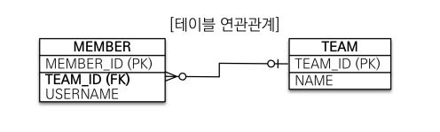
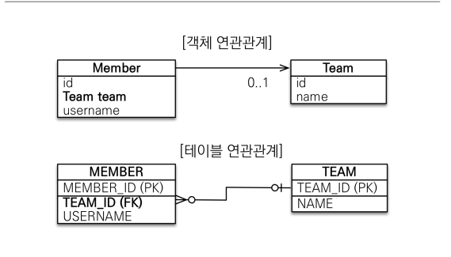
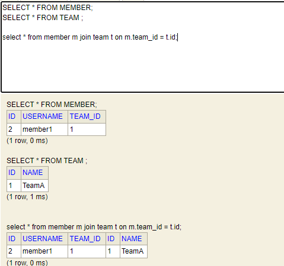
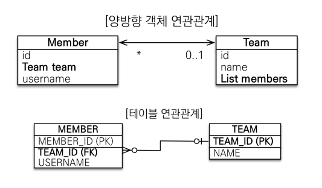
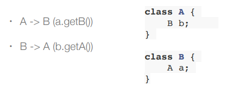
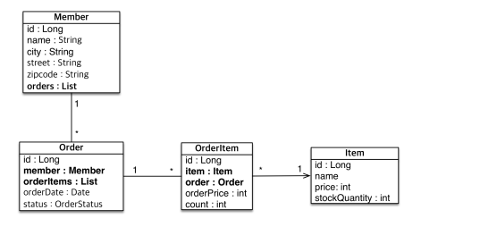

# 단방향 연관관계

​	객체를 테이블에 맞추어 모델링한 예제를 보겠습니다.



```java
@Entity
public class Member {

    @Id
    @GeneratedValue
    @Column(name = "MEMBER_ID")
    private Long id;
    private String username;
    @Column(name = "TEAM_ID")
    private Long teamId;
    
    //getter, setter...
}

@Entity
public class Team {

    @Id
    @GeneratedValue
    @Column(name = "TEAM_ID")
    private Long id;
    private String name;
    
    //getter, setter...
}
```

​	Member 와 Team 은 N:1 관계이므로 외래키를 Member 에 넣었습니다. `teamId` 로 들어가있습니다. **테이블을 그대로 객체로 옮긴 모습입니다.** 이제 객체를 생성해서 저장하고 조회하는 JPA 쿼리문을 만들어보겠습니다.

```java
public static void main(String[] args){
    EntityManagerFactory emf = Persistence.createEntityManagerFactory("hello");

    EntityManager em = emf.createEntityManager();

    EntityTransaction tx = em.getTransaction();
    tx.begin();
    try{
        Team team = new Team();
        team.setName("TeamA");
        em.persist(team);

        Member member = new Member();
        member.setUsername("member1");
        //외래키를 직접 사용
        member.setTeamId(team.getId());
        em.persist(member);

        Member findMember = em.find(Member.class, member.getId());
        //외래키를 직접 사용해서 다시 쿼리문을 날려서 꺼내야 함
        Long findTeamId = findMember.getTeamId();
        Team findTeam = em.find(Team.class, findTeamId);

        tx.commit();
    }catch (Exception e){
        tx.rollback();
    }finally {
        em.close();
    }
    emf.close();
}
```

​	member 객체를 저장할 때 `member.setTeamId(team.getId());` 처럼 외래키를 직접 사용하게 됩니다. 조회를 할 때는 더 복잡한데요. member 의 id 로 해당 member 를 찾은 다음에, 거기서 다시 외래키를 꺼내서 쿼리문을 다시 보내야 합니다. **전혀 객체 지향스럽지 않은 모습이 되버린 겁니다.**

​	이제 객체지향스럽게 바꿔보겠습니다. 아래 그림과 같이 Member 안에는 Team 클래스를 직접 넣습니다.



```java
@Entity
public class Member {

    @Id
    @GeneratedValue
    private Long id;
    private String username;

    @ManyToOne
    @JoinColumn(name = "TEAM_ID")
    private Team team;
    
    //getter, setter
    
}
```

​	Member 클래스만 변경하면 됩니다. `private Team team;` 처럼 객체를 직접 들고 옵니다. 이렇게 되면 인텔리제이에서 오류메세지를 내는데, Team 과의 관계가 설정되지 않았기 때문입니다. `@ManyToOne` 를 통해 관계를 설정하고, `@JoinColumn(name = "TEAM_ID")` 로 외래키 컬럼 이름을 지정합니다.

​	이제 아까와 같이, 객체를 생성해서 저장하고 조회하는 JPA 쿼리문을 만들어보겠습니다.

```java
public static void main(String[] args){
    EntityManagerFactory emf = Persistence.createEntityManagerFactory("hello");

    EntityManager em = emf.createEntityManager();

    EntityTransaction tx = em.getTransaction();
    tx.begin();
    try{
        Team team = new Team();
        team.setName("TeamA");
        em.persist(team);

        Member member = new Member();
        member.setUsername("member1");

        member.setTeam(team);
        em.persist(member);

        Member findMember = em.find(Member.class, member.getId());
        Team findTeam = findMember.getTeam();

        tx.commit();
    }catch (Exception e){
        tx.rollback();
    }finally {
        em.close();
    }
    emf.close();
}
```

​	아까와는 다르게 Member 가 team 을 직접 필드로 저장합니다. 또한 조회 시에 `findMember.getTeam();` 로 팀을 찾을 수 있습니다. 좀 더 객체지향스럽게 바뀐 겁니다.

​	실행 후 객체가 H2 DB 에 어떻게 저장되는지 보겠습니다.



​	제일 아래의 조인 테이블을 보면 조인이 잘 된다는 것을 알 수 있습니다. 

# 양방향 연관관계와 연관관계의 주인



​	이제 위와 같이 양방향 연관관계를 설정해보겠습니다. 양방향 연관관계가 필요한 이유는 Team 객체로도 member 를 찾기 위함입니다. 이전 예제에서는 `findMember.getTeam();` 으로 member 의 team 을 찾았지만, `findTeam.getMember()` 는 안되기 때문입니다. 다음과 같이 코드를 수정하면 됩니다.

```java
@Entity
public class Member {

    @Id
    @GeneratedValue
    private Long id;
    private String username;

    @ManyToOne
    @JoinColumn(name = "TEAM_ID")
    private Team team;
    
	//getter, setter ...
}

@Entity
public class Team {

    @Id
    @GeneratedValue
    private Long id;
    private String name;
    //반대편 사이드의 뭐랑 연결되어 있는지 알려주는 것
    @OneToMany(mappedBy = "team") //mappedBy 는 연관관계의 주인이 아니다. 읽기 전용이다. (읽기만 가능하고, 수정, 삭제 불가능)
    private List<Member> members = new ArrayList<>(); //널 값 방지를 위해 ArrayList 로 초기화
    
    //getter, setter ...
}
```

​	 이제 `List<Member> members = findMember.getTeam().getMembers();` 처럼 Team 에게서 Member 를 가져올 수 있습니다. 여기서 `mappedBy` 속성이 중요한데요.`mappedBy = "team"` 을 통해 Member Entity 의 어떤 필드와 연결되어있는지 알려줄 수 있습니다. **mappedBy 가 있으면 해당 Entity 는 연관관계의 주인이 아니라는 뜻입니다.** 따라서 Team Entity 에서는 members 를 읽을 수만 있고 수정, 삭제 등은 불가능합니다. 왜 이런 차이를 둘까요?

​	먼저 연관관계 주인을 설정하는 이유부터 알아야 합니다. **연관관계의 주인(Owner) 이란 양방향 연관관계에서 누가 관리 주인이 되느냐 입니다.** 연관관계의 주인을 따져야 하는 이유는 객체와 테이블의 차이 때문입니다. **테이블**은 FK 를 통해 JOIN 만 하면 되기 때문에 양방향 연관관계라도 변화가 없습니다. 즉, 테이블은 FK 값 하나로 모든 연관관계를 표현할 수 있습니다. 반면 **객체는** 양방향 연관 관계라기보다는 단방향 연관관계가 2개 있는 겁니다. 아래처럼요.



​	이때 문제점은 FK 값을 바꾸고 싶을 때 객체에서 어떤 값을 바꿀지 정해지지 않는다는 겁니다. 예를 들어서, member1.team 은 team1 이라고 하겠습니다. 그러면 `member1.team = team1` 이고 `team1.members = {member1}` 이겠죠? (보기 편하게 private 은 무시하겠습니다.) 이때 member1 의 team 을 team2 로 바꾸려면 어떻게 할까요?

1. member1.team = team2
2. team1.members.remove(member1) + team2.members.add(member1)

1번은 member1 의 팀을 바꿔주는 방법입니다. 2번은 team1 에 member1 을 없애고 team2 에 추가하는 방법입니다. 얼핏 1번이 더 간단해보이지만 어쨋든 둘 다 외래키로서의 기능이 가능합니다. **따라서 연관관계의 주인을 정해서 둘 중 하나로 외래 키를 관리해야 합니다.** 이를 위해서 `mappedBy` 속성을 사용하는 겁니다. 연관관계의 주인만이 외래 키를 관리(등록, 수정) 하고 주인이 아닌쪽은 읽기만 가능합니다.

​	그렇다면 누구를 주인으로 만들면 될까요? 바로 테이블에서 외래 키가 있는 있는 곳을 주인으로 정하면 됩니다. 여기서는 Member 가 이 연관관계의 주인이 되겠습니다.

​	반대로 설정하면 어떻게 될까요? 물론 설정을 잘하면 team 을 주인으로 할 수도 있습니다. 하지만 결국 DB 테이블에 FK 는 Member 에 있으므로 해당 관계가 변경되면 업데이트 쿼리가 member 로 날라가게 됩니다. 분명 team.members 를 변경했는데 쿼리문은 update team 이 아니라 update member 가 되는거죠. 

## 양방향 연관관계 설정 시 주의점

​	이전 예제에서는 member 에만 team 을 세팅하고 team 에는 member 를 넣지 않았습니다. 하지만 team.members 값을 읽으면 member 가 설정되어 있습니다.

```java
public class JpaMain {

    public static void main(String[] args){
        EntityManagerFactory emf = Persistence.createEntityManagerFactory("hello");

        EntityManager em = emf.createEntityManager();

        EntityTransaction tx = em.getTransaction();
        tx.begin();
        try{
            Team team = new Team();
            team.setName("TeamA");
            
          //team.getMembers().add(member); //해당 값을 설정하지 않아도 자동 설정 된다.
            em.persist(team);

            Member member = new Member();
            member.setUsername("member1");
            member.chanageTeam(team);
            em.persist(member);

            em.flush();
            em.clear();
            
            //db 에서 읽을 때 members 테이블도 함께 읽는다
            Team findTeam = em.find(Team.class, team.getId());
            List<Member> members = findTeam.getMembers();

            for(Member m : members){
                System.out.println("m = " + m.getUsername());
            }


            tx.commit();
        }catch (Exception e){
            tx.rollback();
        }finally {
            em.close();
        }
        emf.close();
    }
}
```

위 코드의 결과는 `"m = member1"` 입니다. 중간에 flush() 로 DB 에 반영해주고 다시 들고 왔기 때문입니다. 다시 들고 올 때는 team 테이블과 member 테이블에 select 가 2번 반영됩니다.

하지만 중간에 flush() 가 없다면 어떻게 될까요? 그러면 값들은 DB 에 반영되지 않고 1차 캐시에 머무르게 됩니다. 이 때 team 에서 members 를 찾는다면 아무 결과가 없습니다. 왜냐하면 1차 캐시에 저장된 team 값에는 members 정보가 없기 때문입니다. **즉, em.flush(), em.clear() 를 하지 않으면 순수한 객체상태라서 출력되는게 없습니다.**

​	결론은, 양방향 연관관계일 때 양방향에 값을 세팅하는 게 맞습니다. 아래와 같이 **"연관관계 편의 메소드를 생성"합니다.**

```java
@Entity
public class Member {

    @Id
    @GeneratedValue
    private Long id;
    private String username;

    @ManyToOne
    @JoinColumn(name = "TEAM_ID")
    private Team team;

    ...

    public void chanageTeam(Team team) {
        this.team = team;
        team.getMembers().add(this);
    }
}
```

​	`chanageTeam()` 을 보면 member 의 team 을 변경하면서 해당 team 에 member 를 add 합니다. 이렇게 함께 설정해주는 이유는 하나의 메서드로 양방향 연관관계를 자동으로 설정해주면서 코드 오류를 줄일 수 있기 때문입니다.

## 양방향 연관관계 문제점

​	하지만 양방향 매핑 시 무한 루프를 조심해야 합니다. 예를 들어 아래와 같이 JSON 으로 변경하는 코드를 보겠습니다.

```java
public class JpaMain {

    public static void main(String[] args){
        EntityManagerFactory emf = Persistence.createEntityManagerFactory("hello");

        EntityManager em = emf.createEntityManager();

        EntityTransaction tx = em.getTransaction();
        tx.begin();
        try{
            Team team = new Team();
            team.setName("TeamA");
            em.persist(team);

            Member member = new Member();
            member.setUsername("member1");
            member.changeTeam(team);
            em.persist(member);

//            em.flush();
//            em.clear();

            Member findMember = em.find(Member.class, member.getId());


            //json 변환기
            ObjectMapper objectMapper = new ObjectMapper();
            String s = objectMapper.writeValueAsString(findMember);
            System.out.println("json = " + s);
            tx.commit();
        }catch (Exception e){
            tx.rollback();
        }finally {
            em.close();
        }
        emf.close();
    }
}
```

​	`objectMapper.writeValueAsString(findMember)` 를 호출하면 정상적으로 동작하지 않습니다. 왜냐하면 Member 안에 Team 이 members 를 가지고 있고, 다시 members 의 member 가 team 을 가지고 있어서 **무한루프**에 빠지기 때문입니다. 이는 toString() 도 마찬가지입니다. 따라서 양방향 매핑시에 무한 루프를 조심해야 합니다.

​	사실 단방향 매핑만으로도 이미 연관관계 매핑은 끝난 거고, 양방향 매핑은 반대 방향으로 조회(객체 그래프 탐색) 기능이 추 가된 것 뿐입니다. **따라서 단방향 매핑을 잘 하고 양방향은 필요할 때 추가해도 됩니다.**

​	양방향 매핑 시 toString() 은 사용하지 않는 게 좋습니다. JSON 은 어차피 DTO 로 데이터를 다루기 때문에 큰 문제는 없습니다.


# 실전 예제 2. 연관관계 매핑 시작

​	이제 연관관계 매핑을 통해 참조를 사용하도록 변경해보겠습니다.



## Order 와 OrderItem

Order 와 OrderItem 는 1:N 관계입니다. 이때 **양방향으로 매핑할지는 비즈니스적 관점으로 생각해야 합니다.** Order (주문 내역) 을 통해서 OrderItem (주문목록) 을 조회할 일이 많을까요? 답은 Yes 입니다. 따라서 해당 관계는 양방향으로 합니다.

```java
@Entity
@Table(name = "ORDERS") //order 가 reserved 일 수도 있음
public class Order {

    @Id
    @GeneratedValue
    @Column(name = "ORDER_ID")
    private Long id;
    @ManyToOne
    @JoinColumn(name = "MEMBER_ID")
    private Member member;

    @OneToMany(mappedBy = "order")
    private List<OrderItem> orderItems = new ArrayList<>();

    private LocalDateTime orderDate;

    @Enumerated(EnumType.STRING)
    private OrderStatus status;

    public void addOrderItem(OrderItem orderItem){
        orderItems.add(orderItem);
        orderItem.setOrder(this);
    }

}

@Entity
public class OrderItem {

    @Id
    @GeneratedValue
    @Column(name = "ORDER_ITEM_ID")
    private Long id;

    @ManyToOne
    @JoinColumn(name = "ORDER_ID")
    private Order order;
    
    @ManyToOne
    @JoinColumn(name = "ITEM_ID")
    private Item item;

    private int orderPrice;
    
    private int count;
}
```

## Member 와 Order

​	Member 와 Order 또한 1:N 관계입니다. 하지만 실제 개발을 할 때는 주문 -> 회원을 참조하는 경우는 많지만, 회원 -> 주문을 연관관계를 가지고 참조하는 경우는 드뭅니다. 주문 자체가 하나의 의미있는 단위이기 때문에  회원을 조회하고, 거기에 있는 주문을 찾기 보다는, 주문 자체를 바로 찾는 경우가 더 많습니다.

​	물론 연관관계를 두어도 되지만, 여기에서 끊어줘야 한다는 것은 연관관계가 너무 복잡해지기 때문입니다.

- 회원 -> 주문
- 회원 -> 장바구니
- 회원 -> 리뷰

등등 이렇게 회원에 연관관계를 모두 양방향으로 만들면 회원 객체는 너무 많은 연관관계를 가지게 됩니다. 위 객체 구조 그림에서는 `List<Order> orders` 가 있지만 학습 목적이라고 생각하면 되고, 실제로는 필요가 없습니다.

```java
package hellojpa.domain;

@Entity
public class Member {

    @Id
    @GeneratedValue
    @Column(name = "MEMBER_ID")
    private Long id;
    private String username;

    private String street;
    private String city;
    private String zipcode;
}
```

​	이후 JPQL을 사용하면 이런 상황에 연관관계가 없어도 Order를 별도로 조회하는 좋은 방법들이 있습니다.