# 연관관계 매핑시 고려사항 3가지

**다중성**

- N:1 : @ManyToOne
- 1:N : @OneToMany
- 1:1 : @OneToOne
- N:M: @ManyToMany

​	여기서 다대다는 사용하면 안됩니다.

**단방향, 양방향**

​	객체는 참조용 필드가 있는 쪽으로만 참조가 가능합니다. 한쪽만 참조하면 단방향이고 양쪽이 서로 참조하면 양방향입니다.

**연관관계의 주인**

​	테이블은 외래 키 하나로 두 테이블이 연관관계를 맺음 반면, 객체 양방향 관계는 A->B, B->A 처럼 참조가 2군데 있습니다. 둘중 테이블의 외래 키 를 관리할 곳을 지정해야 하는데 이 참조가 연관관계의 주인이 됩니다. 주인의 반대편은 외래 키에 영향을 주지 않고 단순 조회만 가능합니다.

# 다대일(N:1)

​	**다대일 단방향**입니다. 항상 N 쪽에 외래키가 들어가야 합니다.

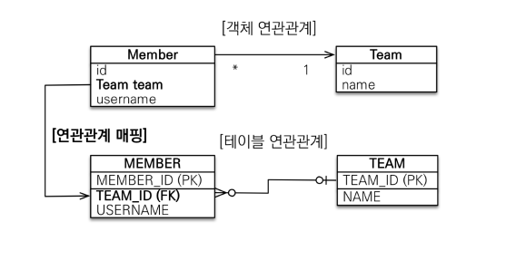

​	**다대일 양방향**입니다. 반대쪽 클래스(Team) 에 List members 를 추가해줍니다.

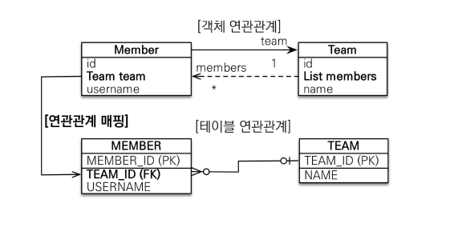

```java
@Entity
public class Team {

    @Id
    @GeneratedValue
    private Long id;
    private String name;

    @OneToMany(mappedBy = "team") 하고, 수정, 삭제 불가능)
    private List<MemberEX> members = new ArrayList<>();
}
```


# 일대다(1:N)

​	1:N 관계에서는 1 이 연관관계의 주인이 됩니다. 권장되는 모델은 아니지만 표준 스펙에서 지원하기는 합니다. 

​	먼저 **일대다 단방향**입니다.

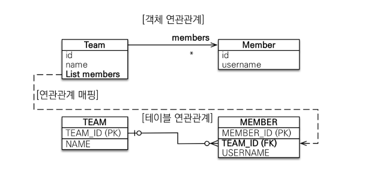

​	Team 은 Member 를 알아야 하지만, Member 객체는 굳이 team 을 알 필요가 없을 때 설계할 수 있습니다. 하지만 **DB 입장에서 FK 는 무조건 N 쪽으로 들어가게 됩니다.** 따라서 객체와 테이블의 차이 때문에 반대편 테이블의 외래 키를 관리하는 특이한 구조입니다.

```java
@Entity
public class Team {

    @Id
    @GeneratedValue
    private Long id;
    private String name;
    @OneToMany
    @JoinColumn(name = "TEAM_ID")
    private List<MemberEX> members = new ArrayList<>();
}

public class JpaMain {

    public static void main(String[] args){
        EntityManagerFactory emf = Persistence.createEntityManagerFactory("hello");

        EntityManager em = emf.createEntityManager();

        EntityTransaction tx = em.getTransaction();
        tx.begin();
        try{

            MemberEX member = new MemberEX();
            member.setUsername("member1");
            em.persist(member);

            Team team = new Team();
            team.setName("teamA");
            //team 테이블에 insert 되는 게 아님
            team.getMembers().add(member);
            em.persist(team);

            tx.commit();
        }catch (Exception e){
            tx.rollback();
        }finally {
            em.close();
        }
        emf.close();
    }
}
```

​	여기서 `@JoinColumn(name = "TEAM_ID")` 는 무조건 써줘야하는데요. 해당 어노테이션이 없으면 중간 테이블을 하나 추가해 조인 테이블 방식을 사용하게 됩니다.

​	이 상태에서 `team.getMembers().add(member);` 을 하면 update 쿼리는 update team 으로 가는 게 아니라 update member 로 날라가게 됩니다. 따라서 쿼리문 추적이 어렵기 때문에 1:N 단방향 매핑보다는 N:1 양방향 매핑을 사용하는 게 권장됩니다.

**일대다 양방향**

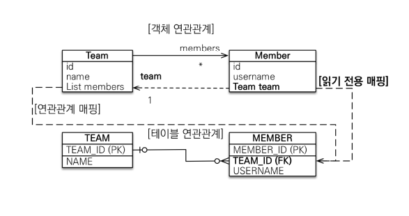

​	일대다 양방향 매핑은 공식적으로 존재하지 않지만 사용할 수는 있습니다. `@JoinColumn` 의 insertable 과 updatable 속성을 이용하는 것입니다.

```java
@Entity
public class MemberEX {

    @Id
    @GeneratedValue
    private Long id;
    private String username;
    
    @ManyToOne
    @JoinColumn(name = "TEAM_ID", insertable = false, updatable = false)
    private Team team;
}
```

​	이를 통해서 team 을 읽기 전용으로만 만듭니다. 이 속성이 없으면 양방향에서 모두 객체 수정이 가능해지는 오류가 생깁니다.


# 일대일(1:1)

​	1:1 관계는 그 반대도 1:1 입니다.  따라서 주 테이블이나 대상 테이블 중에 외래 키 선택 가능합니다. **외래 키에 데이터베이스 유니크(UNI) 제약조건 추가해야 합니다.** 그게 아니라면 여러 개를 가질 수도 있어서 N:1 이 되겠죠.

**일대일: 주 테이블에 외래 키 단방향**

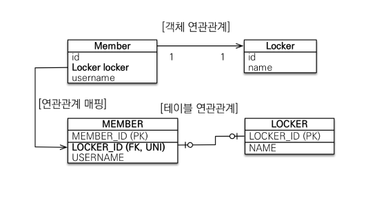

​	다대일(@ManyToOne) 단방향 매핑과 유사합니다.

```java
@Entity
public class MemberEX {

    @Id
    @GeneratedValue
    private Long id;
    private String username;

    @ManyToOne
    @JoinColumn(name = "TEAM_ID", insertable = false, updatable = false)
    private Team team;

    @OneToOne
    @JoinColumn(name = "LOCKER_ID")
    private Locker locker;
}

@Entity
public class Locker {

    @Id
    @GeneratedValue
    private Long id;

    private String name;
}

```

**일대일: 주 테이블에 외래 키 양방향**

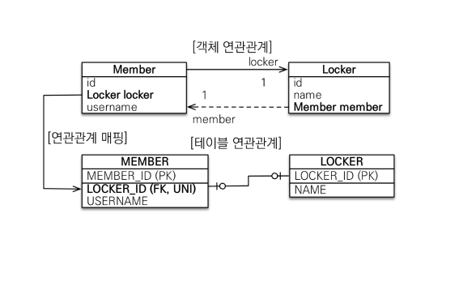

​	양방향은 마찬가지로 Locker 에 Member 를 추가해주면 됩니다.

```java
@Entity
public class Locker {

    @Id
    @GeneratedValue
    private Long id;

    private String name;

    @OneToOne(mappedBy = "locker")
    private MemberEX member;
}
```

반대편은 mappedBy 적용해야 합니다.

**일대일: 대상 테이블에 외래 키 단방향**

해당 관계는 성립되지 않습니다.

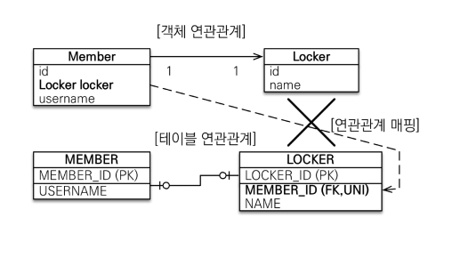

**일대일: 대상 테이블에 외래 키 양방향**

사실 일대일 주 테이블에 외래 키 양방향과 매핑 방법은 같습니다.

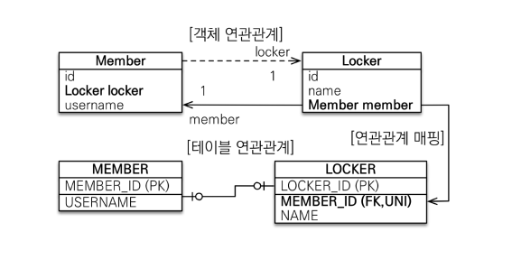

## 외래 키를 어디에 두어야 할까

​	**주 테이블에 외래 키**를 두면 다음과 같은 특징을 가집니다.

-  객체가 대상 객체의 참조를 가지는 것처럼 주 테이블에 외래 키를 두고 대상 테이블을 찾습니다.
- 객체지향 개발자 선호하며, JPA 매핑이 편리해집니다.
- 장점으로 주 테이블만 조회해도 대상 테이블에 데이터가 있는지 확인이 가능합니다. 반면 단점으로 값이 없으면 외래 키에 null 을 허용하게 됩니다.

​	**대상 테이블에 외래 키**를 두면 다음과 같은 특징을 가집니다.

- 대상 테이블에 외래 키가 존재하는 방식입니다.
- 전통적인 데이터베이스 개발자가 선호하는 방식입니다.
- 장점으로 주 테이블과 대상 테이블을 일대일에서 일대다 관계로 변경할 때 테이블 구조를 유지할 수 있습니다.
- 단점으로는 프록시 기능의 한계로 지연 로딩으로 설정해도 항상 즉시 로딩됩니다.

# 다대다(N:M)

​	**관계형 데이터베이스는 정규화된 테이블 2개로 다대다 관계를 표현할 수 없습니다.** 따라서 아래 그림처럼 연결 테이블을 추가해서 일대다, 다대일 관계로 풀어내야 합니다.

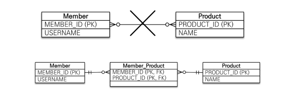

​	하지만 객체는 컬렉션을 사용해서 객체 2개로 다대다 관계 매핑이 가능합니다. @ManyToMany 를 사용하고 @JoinTable로 연결 테이블을 지정합니다.

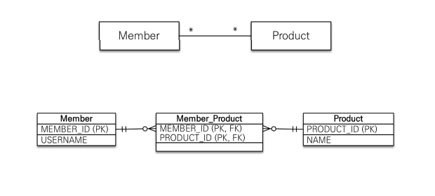

## 다대다 매핑의 한계

​	**편리해 보이지만 실무에서 사용할 수 없습니다.** 연결 테이블이 단순히 연결만 하고 끝나지 않고, 아래와 같이 주문시간, 수량 같은 데이터가 들어올 수 있습니다. 하지만 JPA 에서 집어넣을 수 없습니다.

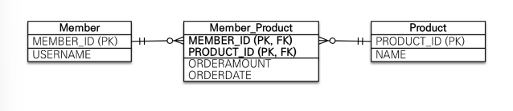

## 다대다 한계 극복

​	연결 테이블용 Entity 를 추가합니다. 연결 테이블을 엔티티로 승격시키는 겁니다.

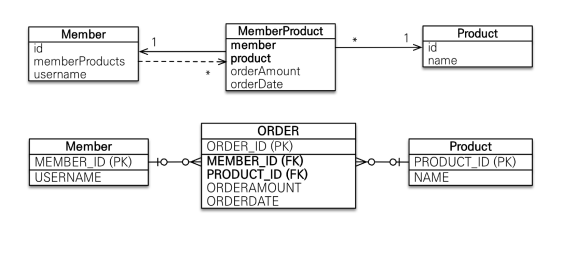

```java
@Entity
public class MemberEX {

    @Id
    @GeneratedValue
    private Long id;
    private String username;

    @OneToMany(mappedBy = "member")
    private List<MemberEXProduct> memberProducts = new ArrayList<>();
}

@Entity
public class Product {

    @Id
    @GeneratedValue
    @Column(name = "PRODUCT_ID")
    private Long id;
    private String name;

    @OneToMany(mappedBy = "product")
    private List<MemberEXProduct> memberProducts = new ArrayList<>();
}

@Entity
public class MemberEXProduct {

    @Id
    @GeneratedValue
    private Long id;

    @ManyToOne
    @JoinColumn(name = "MEMBER_ID")
    private MemberEX member;

    @ManyToOne
    @JoinColumn(name = "PRODUCT_ID")
    private Product product;

    private int count;
    private int price;
    private LocalDateTime orderDateTime;
}
```

​	위 코드에서 MemberEX 와 Product 에는 각각 `memberProducts` 필드가 들어가서 `MemberEXProduct` 클래스와 양방향 매핑을 하고 있습니다. `MemberEXProduct` 클래스는 연결 테이블인데, 추가적인 정보 또한 가지고 있습니다. (count, price, orderDateTime 등) 따라서 비즈니스적인 관점에서도 사용될 수 있습니다.

# 실전 예제 3. 다양한 연관관계 매핑

​	실전 예제 2 에서 배송, 카테고리 테이블을 추가해보겠습니다. 주문과 배송은 1:1(@OneToOne) 관계이며 상품과 카테고리는 N:M(@ManyToMany) 입니다. 여기서는 **학습을 위해 @ManyToMany 를 사용하지만 실전에서는 사용하면 안됩니다.**

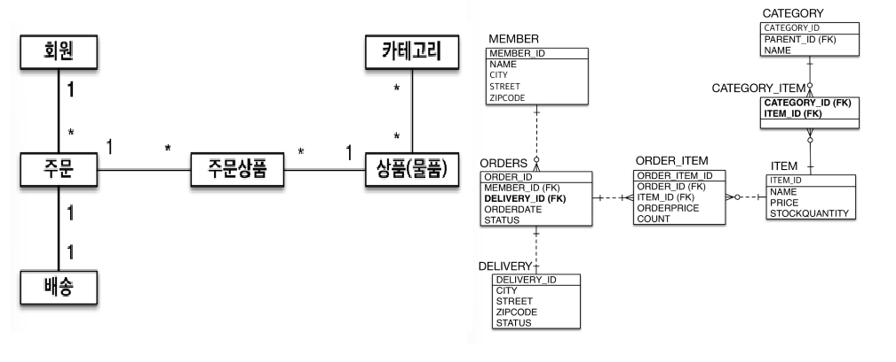

**ORDERS 와 DELIVERY**

```java
@Entity
@Table(name = "ORDERS") 
public class Order {

    @Id
    @GeneratedValue
    @Column(name = "ORDER_ID")
    private Long id;
    
	...

    @OneToOne
    @JoinColumn(name = "DELIVERY_ID")
    private Delivery delivery;

	...
}

@Entity
public class Delivery {

    @Id
    @GeneratedValue
    private Long id;

    ...
        
    @OneToOne(mappedBy = "delivery")
    private Order order;

	...
}
```

​	불필요한 필드 및 Getter/Setter 는 지웠습니다. Order 를 기준으로 배송을 조회할 일이 많으니 Order 를 연관관계의 주인으로 하고, Delivery 는 읽기 전용으로만 뒀습니다.

**Item 과 Category**

```java
@Entity
public class Item {

    @Id
    @GeneratedValue
    @Column(name = "ITEM_ID")
    private Long id;
    
	...

    @ManyToMany(mappedBy = "items") //연관관계 주인이 아님을 명시
    private List<Category> categories = new ArrayList<>();

}

@Entity
public class Category {

    @Id
    @GeneratedValue
    private Long id;
    private String name;

    @ManyToOne
    @JoinColumn(name = "PARENT_ID")
    private Category parent;

    @OneToMany(mappedBy = "parent")
    private List<Category> child = new ArrayList<>();

    @ManyToMany
    @JoinTable(name = "CATEGORY_ITEM",
            joinColumns = @JoinColumn(name = "CATEGORY_ID"),
            inverseJoinColumns = @JoinColumn(name = "ITEM_ID"))
    private List<Item> items = new ArrayList<>();
}

```

​	Category 별로 Item 을 찾을 일이 많으니 연관관계 주인이 Category 인 양방향 다대다 매핑입니다. `@JoinTable` 속성을 사용하여 조인 테이블 이름, 컬럼명을 설정해줍니다.

​	또한 자기 참조도 하고 있는데요. Category 의 상위 Category 를 두고 있습니다. 이때 상위 카테고리는 `@ManyToOne` 으로 연관관계의 주인이 되고, 하위 카테고리는 `@OneToMany(mappedBy = "parent")` 로 설정됩니다.