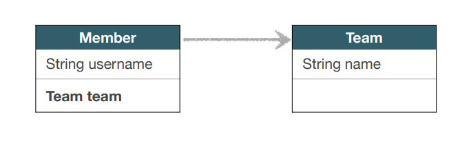
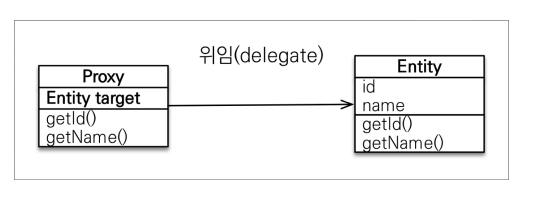
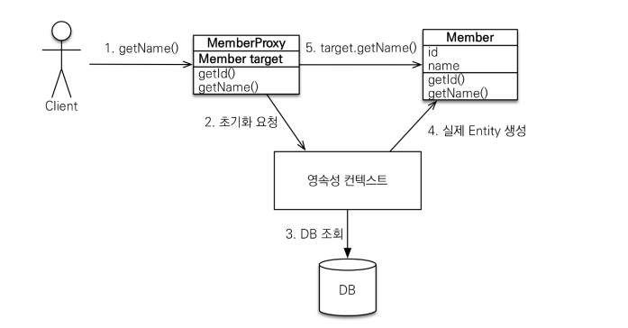
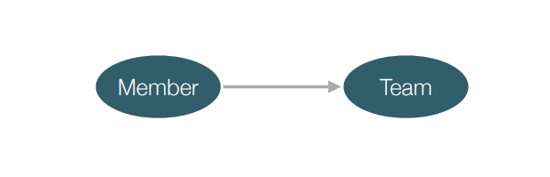

# 프록시



​	위 그림과 같이 Team 을 가지는 Member 객체가 있다고 가정해보겠습니다. 이 때 Member 를 조회한다면 Team 정보까지 함께 조인되어 조회됩니다. 하지만 Member 의 정보만 필요해서 조회했는데 Team 까지 같이 온다면 조인 쿼리로 인해 자원이 낭비되는 문제가 있습니다. 아래와 같은 경우입니다.

```java
public static void main(String[] args){
        EntityManagerFactory emf = Persistence.createEntityManagerFactory("hello");

        EntityManager em = emf.createEntityManager();

        EntityTransaction tx = em.getTransaction();
        tx.begin();
        try{

            Member member = new Member();
            member.setUsername("member1");

            em.persist(member);

            em.flush();
            em.clear();

            Member findMember = em.getReference(Member.class, member.getId()); 
            System.out.println("findMember.getId() = " + findMember.getId()); 
            System.out.println("findMember.getUsername() = " + findMember.getUsername());

            tx.commit();
        }catch (Exception e){
            tx.rollback();
        }finally {
            em.close();
        }
        emf.close();
    }
```

​	위 코드는 member 에 있는 Id 와 username 만 조회하지만 select 쿼리문을 보면 team 의 레코드도 들고 옵니다.

```mysql
select
        member0_.id as id1_3_0_,
        member0_.createdBy as createdb2_3_0_,
        member0_.createdDate as createdd3_3_0_,
        member0_.lastModifiedBy as lastmodi4_3_0_,
        member0_.lastModifiedDate as lastmodi5_3_0_,
        member0_.TEAM_ID as team_id7_3_0_,
        member0_.username as username6_3_0_,
        team1_.id as id1_7_1_,
        team1_.name as name2_7_1_ 
    from
        Member member0_ 
    left outer join
        Team team1_ 
            on member0_.TEAM_ID=team1_.id 
    where
        member0_.id=?
```

따라서 필요하다면 **지연 로딩 LAZY을 사용해서** member 만 가져오는 전략이 필요합니다. 이를 위해서 먼저 프록시의 개념을 이해해야 합니다.



​	**프록시(Proxy)**는 실제 클래스를 상속 받아서 만들어진 가짜 객체입니다. 하지만 사용하는 입장에서는 진짜 객체인지 프록시 객체인지 구분하지 않고 사용하면 됩니다. 프록시 객체는 실제 객체의 참조(target)를 보관합니다. 프록시 객체를 호출하면 프록시 객체는 실제 객체의 메소드 호출하게 됩니다.

​	프록시 객체를 초기화하는 방법은 `.getReference()` 메서드를 사용하는 것입니다. 아래 코드를 보겠습니다.

```java
public static void main(String[] args){
    EntityManagerFactory emf = Persistence.createEntityManagerFactory("hello");

    EntityManager em = emf.createEntityManager();

    EntityTransaction tx = em.getTransaction();
    tx.begin();
    try{

        Member member = new Member();
        member.setUsername("member1");
        em.persist(member);

        em.flush();
        em.clear();

        Member findMemberProxy = em.getReference(Member.class, member.getId()); //호출하는 시점에 쿼리를 안함
        System.out.println("findMember.getClass() = " + findMemberProxy.getClass()); //하이버네이트가 만든 프록시 클래스 Member$HibernateProxy$4Grelffo
        System.out.println("findMember.getId() = " + findMemberProxy.getId()); //실제 사용될 때 쿼리됨
        System.out.println("findMember.getUsername() = " + findMemberProxy.getUsername());
        System.out.println("findMemberProxy.getClass() = " + findMemberProxy.getClass()); //클래스는 계속 프록시

        tx.commit();
    }catch (Exception e){
        tx.rollback();
    }finally {
        em.close();
    }
    emf.close();
}
```

​	여기서 select 쿼리문이 나가는 시점은 `findMember.getId()` 를 호출할 때입니다. `getReference` 로 불러온 `findMemberProxy` 의 클래스는 `Member$HibernateProxy$4Grelffo` 처럼 프록시 객체가 됩니다.

​	쿼리문이 한번 나갔다고 해서 `findMemberProxy` 가 다시 Member 클래스가 되는 건 아닙니다. 두 번째에 호출한 `findMemberProxy.getClass()` 에서 보듯, 해당 객체는 계속 프록시 객체입니다.

​	아래 그림은 프록시의 초기화 과정입니다.



​	Client 가 프록시 객체를 통해 getName() 을 호출할 때 영속성 컨텍스트로 초기화 요청이 들어옵니다. 그러면 영속성 컨텍스트는 DB 를 조회하여 실제 Entity 를 만들고, 프록시는 실제 Entity 를 참고해 getName() 값을 반환합니다.

## 프록시의 특징

1. 프록시 객체는 처음 사용할 때 한 번만 초기화됩니다. 이후에 계속 메서드를 호출해도, 이미 초기화가 되어 영속성 컨텍스트에 저장되어 있으니 초기화를 할 필요가 없습니다.

2. `getClass()` 코드를 통해 살펴봤듯이, 프록시 객체를 초기화 할 때 프록시 객체가 실제 엔티티로 바뀌는 것은 아닙니다. 초기화되면 프록시 객체를 통해서 실제 엔티티에 접근이 가능해지는 것뿐입니다.

3. 프록시 객체는 원본 엔티티를 상속받습니다. 따라서 타입 체크시 주의해야 합니다. `==` 비교는 실패하기 때문에 `instanceof` 를 사용해야 합니다. 아래 코드에서 `==` 비교와 `instanceof` 비교의 값이 다름을 알 수 있습니다.

   ```java
   public class JpaMain {
   
       public static void main(String[] args){
           EntityManagerFactory emf = Persistence.createEntityManagerFactory("hello");
   
           EntityManager em = emf.createEntityManager();
   
           EntityTransaction tx = em.getTransaction();
           tx.begin();
           try{
   
               Member member1 = new Member();
               member1.setUsername("member1");
               em.persist(member1);
   
               Member member2 = new Member();
               member2.setUsername("member2");
               em.persist(member2);
   
               em.flush();
               em.clear();
   
   
               Member findMember = em.find(Member.class, member1.getId());
               Member findMemberProxy = em.getReference(Member.class, member2.getId());
               System.out.println("compare proxy : " + (findMember.getClass() == findMemberProxy.getClass())); //false
               System.out.println("instanceof proxy : " + (findMemberProxy instanceof Member)); //true
   
               tx.commit();
           }catch (Exception e){
               tx.rollback();
           }finally {
               em.close();
           }
           emf.close();
       }
   }
   ```

4. 영속성 컨텍스트에 찾는 엔티티가 이미 있으면 em.getReference()를 호출해도 실제 엔티티 반환합니다. 1차 캐시에 이미 있는데 굳이 프록시를 반환할 필요가 없기 때문입니다.

   ```java
   Member findMember = em.find(Member.class, member1.getId());
   Member findMemberProxy = em.getReference(Member.class, member1.getId()); 
   System.out.println("compare proxy : " + (findMember.getClass() == findMemberProxy.getClass()));
   System.out.println("instanceof proxy : " + (findMemberProxy instanceof Member));
   System.out.println("findMemberProxy = " + findMemberProxy.getClass()); //class hellojpa.ex.Member
   ```

   - findMember 는 member1 을 조회한 것이므로 member1 이 1차 캐시로 들어갑니다.

   - 1차 캐시에 member1 이 있으므로 findMemberProxy 는 그대로 member1 엔티티가 들어갑니다.

   - 따라서  `==` 또한 true 를 반환합니다.

   - 프록시 객체의 getClass() 는 `class hellojpa.ex.Member` 를 반환합니다.

   - 또한 JPA 는 **한 트랜잭션 안에서 두 객체가 같은 엔티티를 가리키고 있으면 `==` 이 항상 참이 되어야 한다**는 원칙을 가지고 있습니다. **중요한 건 프록시이든 아니든 신경쓰지 않고 개발할 수 있게 해주는 겁니다.**

     ```java
      Member findMemberProxy = em.getReference(Member.class, member1.getId());
     System.out.println("findMemberProxy.getClass() = " + findMemberProxy.getClass());
     
     Member findMember = em.find(Member.class, member1.getId());
     System.out.println("findMember.getClass() = " + findMember.getClass());
     
     System.out.println("proxy == entity " + (findMemberProxy == findMember)); //true
     ```

5. 영속성 컨텍스트의 도움을 받을 수 없는 준영속 상태일 때 프록시를 초기화하면 문제가 발생합니다.

   ```java
   public static void main(String[] args){
       EntityManagerFactory emf = Persistence.createEntityManagerFactory("hello");
   
       EntityManager em = emf.createEntityManager();
   
       EntityTransaction tx = em.getTransaction();
       tx.begin();
       try{
   
           Member member1 = new Member();
           member1.setUsername("member1");
           em.persist(member1);
   
           em.flush();
           em.clear();
   
   
           Member findMemberProxy = em.getReference(Member.class, member1.getId());
           System.out.println("findMemberProxy.getClass() = " + findMemberProxy.getClass());
   
           em.detach(findMemberProxy);
           //em.close(); //닫아도 마찬가지임
           //em.clear(); //영속성 컨텍스트를 끄지 않아도 초기화되어서 프록시를 사용할 수 없음
   
           findMemberProxy.getUsername(); //LazyInitializationException 오류 발생
   
           tx.commit();
       }catch (Exception e){
           tx.rollback();
           e.printStackTrace(); ////LazyInitializationException 오류 발생
       }finally {
           em.close();
       }
       emf.close();
   }
   ```

   - `em.detach(findMemberProxy);` 로 영속성 컨텍스트에서 프록시를 준영속 상태로 만들면 프록시를 초기화할 수 없습니다. (LazyInitializationException 오류 발생)
   - 이는 `em.close()` 나 `em.clear()` 도 마찬가지입니다.

## 프록시 확인

​	프록시의 상태를 확인하는 몇 가지 메서드를 소개하겠습니다.

```java
try{

    Member member1 = new Member();
    member1.setUsername("member1");
    em.persist(member1);

    em.flush();
    em.clear();

    Member findMemberProxy = em.getReference(Member.class, member1.getId());
    System.out.println("findMemberProxy.getClass() = " + findMemberProxy.getClass());

    System.out.println("isLoaded : " + emf.getPersistenceUnitUtil().isLoaded(findMemberProxy)); //false
    Hibernate.initialize(findMemberProxy); //강제 초기화
    System.out.println("isLoaded : " + emf.getPersistenceUnitUtil().isLoaded(findMemberProxy)); //true 

    tx.commit();
    }
```

`emf.getPersistenceUnitUtil().isLoaded(findMemberProxy)` : `EntityManagerFactory` 에서 `PersistenceUnitUtil` 를 가져와서 `findMemberProxy` 가 초기화되었는지 boolean 값으로 반환합니다. 첫 번째 사용 시에는 false 이며 두 번째 사용 시에는 그전에 초기화가 되었으므로 true 를 반환합니다.

`Hibernate.initialize(findMemberProxy);` : `findMemberProxy` 를 강제로 초기화합니다. 하이버네이트 기능이며 JPA 표준은 강제 초기화 기능이 없습니다. JPA 에서 강제 초기화하려면 ` member.getName()` 등과 같이 메서드를 호출해야 합니다.

# 지연 로딩과 즉시 로딩

## 지연로딩 (Lazy)



​	이제 앞에서 했던 고민을 다시 해보겠습니다. Member 를 조회할 때 Team 은 조회할 필요가 없는데도 계속 같이 조회되는 문제가 있습니다. 이를 해결하기 위해 Lazy 로딩을 사용합니다.

​	지연 로딩은 해당 객체만 조회하고 **연관된 객체는 프록시로만 들고 옵니다.** 만약 Team 의 값도 사용해야 할 일이 있을 때 초기화가 되는 거죠. 아래 Member 클래스의 코드를 보겠습니다.

```java
@Entity
public class Member extends BaseEntity{

    @Id
    @GeneratedValue
    private Long id;
    private String username;

    @ManyToOne(fetch = FetchType.LAZY) //team 을 프록시 객체로 조회함
    @JoinColumn(name = "TEAM_ID")
    private Team team;
    
    ...
}
```

​	Team 필드의 `@ManyToOne` 의 속성으로 `fetch = FetchType.LAZY` 를 줍니다. 그러면 member 를 조회할 때 team 은 DB 에서 조회되는 게 아니라 프록시 객체로 조회합니다. 아래 메인 메서드의 주석을 보겠습니다.

```java
public class JpaMain {

    public static void main(String[] args){
        EntityManagerFactory emf = Persistence.createEntityManagerFactory("hello");

        EntityManager em = emf.createEntityManager();

        EntityTransaction tx = em.getTransaction();
        tx.begin();
        try{

            Team team = new Team();
            team.setName("teamA");
            em.persist(team);

            Member member1 = new Member();
            member1.setUsername("member1");
            member1.setTeam(team);
            em.persist(member1);

            em.flush();
            em.clear();
            //member 호출, memeber 만 조회하는 Select 문
            Member m = em.find(Member.class, member1.getId());
            //team 은 프록시, class hellojpa.ex.Team$HibernateProxy$v2WdeBU5
            System.out.println("m.getTeam().getClass() = " + m.getTeam().getClass());
            System.out.println("====================");
            //프록시 객체를 초기화, team 조회 쿼리문이 나감
            m.getTeam().getName(); 
            System.out.println("====================");

            tx.commit();
        }catch (Exception e){
            tx.rollback();
            e.printStackTrace();
        }finally {
            em.close();
        }
        emf.close();
    }
}
```

​	나가는 쿼리문은 아래와 같습니다. member 조회와 team 조회가 따로 나가고 있음을 알 수 있습니다.

```mysql
# em.find(member) 이후
select
    member0_.id as id1_3_0_,
    member0_.createdBy as createdb2_3_0_,
    member0_.createdDate as createdd3_3_0_,
    member0_.lastModifiedBy as lastmodi4_3_0_,
    member0_.lastModifiedDate as lastmodi5_3_0_,
    member0_.TEAM_ID as team_id7_3_0_,
    member0_.username as username6_3_0_ 
from
    Member member0_ 
where
    member0_.id=?

# m.getTeam().getName() 호출 이후
select
    team0_.id as id1_7_0_,
    team0_.name as name2_7_0_ 
from
    Team team0_ 
where
    team0_.id=?
```


## 즉시 로딩 (EAGER)

​	만약 Member 와 Team 을 항상 같이 이용한다면 어떻게 될까요? Lazy 로딩에서는 항상 쿼리문을 두 번씩 날려야 합니다. 차라리 원래대로 JOIN 쿼리로 한번에 조회하는 게 낫겠죠. 그를 위한 전략이 즉시 로딩 (EAGER) 입니다.

```java
@Entity
public class Member extends BaseEntity{

    @Id
    @GeneratedValue
    private Long id;
    private String username;

    @ManyToOne(fetch = FetchType.EAGER) //team 을 즉시 로딩
    @JoinColumn(name = "TEAM_ID")
    private Team team;
    
    ...
}
```

​	` @ManyToOne` 의 속성을 `fetch = FetchType.EAGER` 로만 변경해주면 즉시 로딩이 됩니다. 아래와 같이 **조인 쿼리문**이 날라가게 됩니다.

```mysql
select
    member0_.id as id1_3_0_,
    member0_.createdBy as createdb2_3_0_,
    member0_.createdDate as createdd3_3_0_,
    member0_.lastModifiedBy as lastmodi4_3_0_,
    member0_.lastModifiedDate as lastmodi5_3_0_,
    member0_.TEAM_ID as team_id7_3_0_,
    member0_.username as username6_3_0_,
    team1_.id as id1_7_1_,
    team1_.name as name2_7_1_ 
from
    Member member0_ 
left outer join
    Team team1_ 
        on member0_.TEAM_ID=team1_.id 
where
    member0_.id=?
```


## 프록시와 즉시로딩 주의점

​	실무에서는 가급적 지연 로딩만 사용하는 것이 좋습니다. 왜냐하면 아래와 같은 몇 가지 문제점이 있기 때문입니다.

1. 즉시 로딩을 적용하면 예상하지 못한 SQL이 발생합니다.

   - member 만 조회했는데 team 이 함께 조회가 됩니다. JOIN 으로 걸리는 테이블이 수 개 ~ 수십 개가 되면 그때부터 성능에 악영향을 미칩니다.

2. 즉시 로딩은 JPQL에서 N+1 문제를 일으킵니다.

   - N + 1 문제란 최초 쿼리를 1개 날렸는데 그거 때문에 추가쿼리 N 개가 나간다고 해서 N + 1 문제라고 합니다.

     ```java
     try{
     
         Team team1 = new Team();
         team1.setName("teamA");
         em.persist(team1);
     
         Team team2 = new Team();
         team2.setName("teamB");
         em.persist(team2);
     
         Member member1 = new Member();
         member1.setUsername("member1");
         member1.setTeam(team1);
     
         Member member2 = new Member();
         member2.setUsername("member2");
         member2.setTeam(team2);
     
         em.persist(member1);
         em.persist(member2);
     
         em.flush();
         em.clear();
     
         List<Member> members = em.createQuery("select m from Member m", Member.class)
                 .getResultList();
     
         //SQL : select * from Member;
         //가져와보니 team 이 필요해서 다시 select team 쿼리를 날림
     
         tx.commit();
     }
     ```

   - createQuery 로 조회하는 Member 의 쿼리문은 `select * from Member;` 입니다.

   - 그런데 쿼리를 통해 조회된 Member 객체는 각각 즉시 로딩이 필요한 Team 을 가지고 있습니다. 따라서 각각의 객체마다 team 을 조회하는 쿼리가 2번 나가게 됩니다. 

     ```mysql
     # member 조회 쿼리 1번
     select
         m 
     from
         Member m */ select
             member0_.id as id1_3_,
             member0_.createdBy as createdb2_3_,
             member0_.createdDate as createdd3_3_,
             member0_.lastModifiedBy as lastmodi4_3_,
             member0_.lastModifiedDate as lastmodi5_3_,
             member0_.TEAM_ID as team_id7_3_,
             member0_.username as username6_3_ 
         from
             Member member0_
     # member1 의 team 조회 쿼리
     select
         team0_.id as id1_7_0_,
         team0_.name as name2_7_0_ 
     from
         Team team0_ 
     where
         team0_.id=?
     # member2 의 team 조회 쿼리
     select
         team0_.id as id1_7_0_,
         team0_.name as name2_7_0_ 
     from
         Team team0_ 
     where
         team0_.id=?
     ```

3. @ManyToOne, @OneToOne은 기본이 즉시 로딩이므로 직접 LAZY로 설정해야 합니다.

4. 반면 @OneToMany, @ManyToMany는 기본이 지연 로딩이므로 디폴트값으로 두어도 됩니다.

​	결론적으로, **실무에서는 무조건 지연 로딩을 활용**해야 하며 조인 쿼리문이 필요할 때는 **즉시 로딩을 사용하지 말고 JPQL fetch 조인이나, 엔티티 그래프 기능을 사용**해야 합니다.


# 영속성 전이: CASCADE

​	특정 엔티티를 영속 상태로 만들 때 연관된 엔티티도 함께 영속 상태로 만드는 경우 사용합니다. 예를 들어 아래와 같이 Parent 와 Child 가 1:N 관계에 있다고 해보겠습니다.

```java
@Entity
public class Parent {

    @Id
    @GeneratedValue
    private Long id;

    private String name;

    @OneToMany(mappedBy = "parent")
    private List<Child> childList = new ArrayList<>();

    public void addChild(Child child) {
        childList.add(child);
        child.setParent(this);
    }
}

@Entity
public class Child {

    @Id
    @GeneratedValue
    private Long id;

    private String name;

    @ManyToOne
    @JoinColumn(name = "PARENT_ID")
    private Parent parent;
}
```

​	이 때 Child 를 2개 호출하고 Parent 를 1개 호출하여 연관관계를 설정하고 저장해보겠습니다.

```java
public class JpaMain {

    public static void main(String[] args){
        EntityManagerFactory emf = Persistence.createEntityManagerFactory("hello");

        EntityManager em = emf.createEntityManager();

        EntityTransaction tx = em.getTransaction();
        tx.begin();
        try{

            Child child1 = new Child();
            Child child2 = new Child();

            Parent parent = new Parent();
            parent.addChild(child1);
            parent.addChild(child2);

            em.persist(parent); //parent 저장
            em.persist(child1); //child1 저장
            em.persist(child2); //child2 저장

            tx.commit();
        }catch (Exception e){
            tx.rollback();
            e.printStackTrace();
        }finally {
            em.close();
        }
        emf.close();
    }
}
```

​	코드에서 보는 것처럼, Child 를 저장하기 위해서 따로 em.persist 를 해줘야 합니다. 하지만 코드를 Parent 중심으로 코드를 구성하고 싶고, Parent 가 Child 를 함께 관리하고 저장하도록 하기 위해서는 어떻게 해야할까요? 아래와 같이 `@OneToMany` 에 `cascade` 속성을 추가합니다.

```java
@Entity
public class Parent {

    @Id
    @GeneratedValue
    private Long id;

    private String name;

    @OneToMany(mappedBy = "parent", cascade = CascadeType.ALL)
    private List<Child> childList = new ArrayList<>();

    public void addChild(Child child) {
        childList.add(child);
        child.setParent(this);
    }
}
```

이제 em.persist(child) 를 없애도 insert 쿼리가 날라가는 걸 볼 수 있습니다.

​	**CASCADE 의 종류**는 아래와 같습니다. 보통 모두 적용할 때 ALL, 저장할 때만 라이프 사이클을 맞추고 싶을 때 PERSIST 를 사용합니다.

- ALL: 모두 적용
- PERSIST: 영속
- REMOVE: 삭제
- MERGE: 병합
- REFRESH: REFRESH
- DETACH: DETACH

​	N:1 관계에서 소유자가 단 1개일 때 CASCADE 를 사용하면 됩니다. 하지만 **예를 들어 SCHOOL 테이블이 있고 해당 테이블이 Child 테이블과 관계를 가진다면 사용하지 않는 게 좋습니다.** 단일 Entity 에 완전히 종속적일 때만 사용해야 합니다.

# 고아 객체

​	고아 객체랑 부모 Entity 와 연관관계가 끊어진 자식 Entity 를 말합니다. 부모 Entity 에서 `orphanRemoval = true` 속성이 있으면 고아 객체를 삭제합니다.

```java
@Entity
public class Parent {

    @Id
    @GeneratedValue
    private Long id;

    private String name;

    @OneToMany(mappedBy = "parent", cascade = CascadeType.ALL, orphanRemoval = true)
    private List<Child> childList = new ArrayList<>();

    public void addChild(Child child) {
        childList.add(child);
        child.setParent(this);
	}
}

```

​	위 코드에서 `@OneToMany` 에 `orphanRemoval = true` 속성이 있습니다. 

```java
public class JpaMain {

    public static void main(String[] args){
        EntityManagerFactory emf = Persistence.createEntityManagerFactory("hello");
        EntityManager em = emf.createEntityManager();
        EntityTransaction tx = em.getTransaction();
        
        tx.begin();
        
        try{

            Child child1 = new Child();
            Child child2 = new Child();

            Parent parent = new Parent();
            parent.addChild(child1);
            parent.addChild(child2);

            em.persist(parent);

            em.flush();
            em.clear();

            Parent findParent = em.find(Parent.class, parent.getId());
            findParent.getChildList().remove(0);

            tx.commit();
        }catch (Exception e){
            tx.rollback();
            e.printStackTrace();
        }finally {
            em.close();
        }
        emf.close();
    }
}
```

​	위 코드를 실행하면 0 번째 Child 를 삭제하는 쿼리가 다음과 같이 나갑니다.

```mysql
select
    childlist0_.PARENT_ID as parent_i3_2_0_,
    childlist0_.id as id1_2_0_,
    childlist0_.id as id1_2_1_,
    childlist0_.name as name2_2_1_,
    childlist0_.PARENT_ID as parent_i3_2_1_ 
from
    Child childlist0_ 
where
    childlist0_.PARENT_ID=?
    
# 연관된 Child 삭제
delete 
from
    Child 
where
    id=?
```

**고아 객체를 사용할 때 주의점**

	1. 참조가 제거된 엔티티는 다른 곳에서 참조하지 않는 고아 객체로 보고 삭제하는 기능입니다. **따라서 반드시 참조하는 곳이 하나일 때 사용해야 합니다.** 
	1. @OneToOne, @OneToMany 때만 사용할 수 있습니다.
	1. 개념적으로 부모를 제거하면 자식은 고아가 됩니다. 따라서 고아 객체 제거 기능을 활성화 하면, **부모를 제거할 때 자식도 함께 제거**됩니다. 이것은 **CascadeType.REMOVE처럼 동작하게 됩니다.**

**영속성 전이와 고아 객체, 생명주기**

​	CascadeType.ALL, orphanRemoval=true 을 함께 사용한다면 부모 Entity 를 통해서 자식의 생명 주기를 관리할 수 있게 됩니다. 이는 도메인 주도 설계(DDD)의 Aggregate Root개념을 구현할 때 유용합니다.