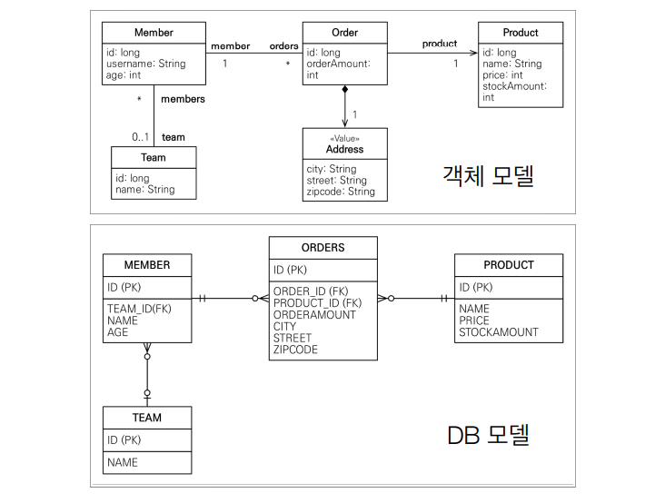

# JPQL 소개

​	JPA 는 엔티티 객체를 중심으로 개발하는 방법입니다. 따라서 검색을 할 때도 (`em.find()`) 테이블이 아닌 엔티티 객체를 대상으로 검색합니다. 하지만 **모든 DB 데이터를 객체로 변환해서 검색하는 것은 불가능합니다.** 따라서 애플리케이션이 필요한 데이터만 DB에서 불러오려면 결국 검색 조건이 포함된 SQL이 필요합니다.

​	JPA는 SQL을 추상화한 JPQL이라는 객체 지향 쿼리 언어 제공하고 있습니다. SQL과 문법 유사한데, SELECT, FROM, WHERE, GROUP BY, HAVING, JOIN 등을 지원합니다. 

​	예를 들어 특정 조건 (where) 을 통해 쿼리문을 날린다고 해보겠습니다.

```java
List<Member> result = em.createQuery(
            "select m From Member m where m.username like '%kim%'",
            Member.class
    ).getResultList();
```

그럼 이렇게 JPQL 문을 생성하면 그대로 JPA 가 DB 로 쿼리문을 보냅니다. JPQL 문은 `select m ` 처럼 필드를 검색하는 게 아니라 member 객체 그 자체를 검색할 수 있습니다.

## QueryDSL 소개

​	QueryDSL 은 문자가 아닌 자바코드로 JPQL 을 작성할 수 있습니다. 따라서 String 을 사용하는 것과 달리 컴파일 시점에서 문법 오류를 찾을 수 있고 동적 쿼리 작성이 편합니다.

```java
JPAFactoryQuery query = new JPAQueryFactory(em);
QMember m = QMember.member;
List<Member> list =
    query.selectFrom(m)
    .where(m.age.gt(18))
    .orderBy(m.name.desc())
    .fetch();
```

## 네이티브 SQL 소개

​	네이티브 SQL 은 JPA 가 제공하는 SQL 을 직접 사용하는 기능입니다. JPQL 로 해결할 수 없는 특정 DB 에 의존적인 기능을 위해 사용할 수 있습니다. (ex. 오라클 CONNECT BY, 특정 DB 만 사용하는 SQL 힌트)

```java
String sql = "SELECT ID, AGE, TEAM_ID, NAME FROM MEMBER WHERE NAME = 'kim'";
List<Member> resultList =
	em.createNativeQuery(sql, Member.class).getResultList();
```

# JPQL - 기본 문법과 기능

​	JPQL은 SQL을 추상화해서 특정데이터베이스 SQL에 의존하지 않습니다. JPQL 기본 문법은 다음과 같습니다.

```mysql
select m from Member as m where m.age > 18 
```

- 엔티티와 속성은 대소문자 구분을 해야합니다. (Member, age)
- JPQL 키워드는 대소문자 구분이 필요없습니다. (SELECT, FROM, where)
- 엔티티 이름을 사용해야 합니다. 테이블 이름을 사용하면 안됩니다.
- 별칭(m) 은 필수입니다. as 는 생략할 수 있습니다.

아래와 같은 모델을 구현했다고 생각하고 JPQL 문법을 사용해보겠습니다.



​	쿼리문을 날리고 반환값을 받을 때 **반환 타입이 명확하다면 TypeQuery, 그게 아니라면 Query 를 사용해야 합니다.**

```java
public class JpaMain {

    public static void main(String[] args) {
        EntityManagerFactory emf = Persistence.createEntityManagerFactory("hello");
        EntityManager em = emf.createEntityManager();

        EntityTransaction tx = em.getTransaction();
        tx.begin();

        try{

            Member member = new Member();
            member.setUsername("member1");
            em.persist(member);

            TypedQuery<Member> query1 = em.createQuery("select m from Member m", Member.class);
            TypedQuery<String> query2 = em.createQuery("select m.username from Member m", String.class);
            Query query3 = em.createQuery("select m.username, m.age from Member m");

        }catch (Exception e) {
            tx.rollback();
            e.printStackTrace();
        }finally {
            emf.close();
        }
    }
}

```

​	query1 은 반환타입이 Member 이므로 TypedQuery<Member> 를 사용하면 됩니다. query2 는 m.username 을 select 하는데, 해당 값은 String 이므로 마찬가지로 TypedQuery<String> 을 사용합니다. query3 의 경우는 m.username 과 m.age 를 하는데 반환타입이 섞여있어서 명확하지 않으므로 Query 를 사용합니다.

​	결과는 **query.getResultList()** 나 **query.getSingleResult()** 로 받을 수 있습니다.

```java
TypedQuery<Member> query = em.createQuery("select m from Member m where m.id = 10", Member.class);

List<Member> resultList = query1.getResultList(); //리스트로 반환
Member result = querySingle.getSingleResult(); //Member 클래스로 반환


```

​	getResultList 를 사용하면 결과를 리스트로 반환하고 결과가 없으면 빈 리스트를 반환합니다. getSingleResult 를 사용하면 단일 객체만 반환합니다. 이때 **결과가 없으면 NoResultException, 둘 이상이면 NonUniqueResultException 예외가 발생합니다.** Spring Data JPA 는 이를 Optional 로 처리해서 결과가 없으면 Null 이 반환되게 변경했지만 결국 내부에서는 try ~ catch 문을 사용합니다.

​	파라미터 바인딩으로도 쿼리문을 작성할 수 있는데요. 이름 기준과 위치 기준이 있습니다.

```java
Member result = em.createQuery("select m from Member m where m.username = :username", Member.class)
        .setParameter("username", usernameParam)
        .getSingleResult();

Member result2 = em.createQuery("select m from Member m where m.username = ?1", Member.class)
        .setParameter(1, usernameParam)
        .getSingleResult();

```

​	두 경우 모두 Query 에 .setParameter() 메서드를 사용해서 바로 결과값을 반환받고 있습니다. 이때 **위치 기준은 쿼리문이 변경되었을 때 위치가 달라질 수 있으므로 사용하지 않는 게 좋습니다.** 이름 기준이면 순서가 바껴도 이름은 같으니까 상관없습니다.

# 프로젝션

​	프로젝션이란 SELECT 절에 조회할 대상을 지정하는 것입니다. 프로젝션의 대상은 엔티티, 임베디드 타입, 스칼라 타입 등이 있습니다. 스칼라 타입이란 숫자, 문자 등 기본 데이터 타입을 말합니다.

```java
package com.example.jpql;

import com.example.entity.Address;
import com.example.entity.Member;
import com.example.entity.MemberDTO;
import com.example.entity.Team;

import javax.persistence.*;
import java.util.List;

public class JpaMain {

    public static void main(String[] args) {
        EntityManagerFactory emf = Persistence.createEntityManagerFactory("hello");
        EntityManager em = emf.createEntityManager();

        EntityTransaction tx = em.getTransaction();
        tx.begin();

        try{

            Member member = new Member();
            member.setUsername("member1");
            member.setAge(10);
            em.persist(member);

            List<Member> result1 = em.createQuery("select m from Member m", Member.class)
                    .getResultList(); //영속성 관리가 시작 됨

            List<Team> result2 = em.createQuery("select m.team from Member m", Team.class)
                    .getResultList(); //inner join 으로 나감

            List<Team> result3 = em.createQuery("select t from Member m join m.team t", Team.class)
                    .getResultList(); //이렇게 예측될 수 있게 짜야 한다.

            List<Address> result4 = em.createQuery("select o.address from Order o", Address.class)
                    .getResultList();//임베디드 타입도 가능
        
            tx.commit();

        }catch (Exception e) {
            tx.rollback();
            e.printStackTrace();
        }finally {
            emf.close();
        }
    }
}
```

- result1 : 단순하게 Member 를 조회하는 JPQL 쿼리문입니다. 해당 쿼리문이 날라가면 결과값은 영속성 관리가 시작됩니다.
- result2 : inner join 을 통해 member 의 team 을 가져옵니다. 하지만 JPQL 쿼리문과 SQL 문이 달라서 헷갈릴 수 있습니다.
- result3 : 결과 자체는 result2 와 같습니다. 하지만 join 을 사용해서 JPQL 쿼리문만 보더라도 SQL 문이 어떻게 나가는지 알 수 있습니다.
- result4 : 임베디드 타입도 조회가 가능합니다.

​	아래는 스칼라 타입 프로젝션 예시입니다. 스칼라 타입은 여러 타입이 섞여 있기때문에 타입 캐스팅이 필요합니다.

```java
List result5 = em.createQuery("select m.username, m.age from Member m")
        .getResultList();//여러개의 타입을 조회할 때는 Object[] 로 받아야 한다.
Object o = result5.get(0);
Object[] resultObject = (Object[]) o;
System.out.println("username = " + resultObject[0]);
System.out.println("age = " + resultObject[1]);

List<Object[]> result6 = em.createQuery("select m.username, m.age from Member m")
        .getResultList();//여러개의 타입을 조회할 때는 Object[] 로 받아야 한다.
Object[] resultObject2 = result6.get(0);
System.out.println("username = " + resultObject2[0]);
System.out.println("age = " + resultObject2[1]);

List<MemberDTO> result7 = em.createQuery("select new com.example.entity.MemberDTO(m.username, m.age) from Member m", MemberDTO.class)
        .getResultList();//여러개의 타입을 조회할 때는 Object[] 로 받아야 한다.

MemberDTO memberDTO = result7.get(0);
System.out.println("memberDTO = " + memberDTO.getUsername());
System.out.println("memberDTO = " + memberDTO.getAge());
```

- result5 : result 는 Object 타입의 배열로 들어옵니다. 따라서 `result5.get(0);` 을 (Object[]) 로 타입 캐스팅 한 뒤 배열값을 반환받아야 합니다.

- result6 : 최초 List 를 받을 때부터 반환값을 Object[] 로 받는 방법입니다.

- result7 : DTO 를 생성해서 받습니다. 패키지 명을 포함한 전체 클래스 명을 입력해야 하고, 순서와 타입이 일치하는 생성자가 필요합니다.

  - ```java
    package com.example.entity;
    
    public class MemberDTO {
    
        public MemberDTO(String username, int age) {
            this.username = username;
            this.age = age;
        }
    
        private String username;
        private int age;
    
        //getter, setter
    ```

    

# 페이징

​	페이징은 범위에 해당하는 레코드를 들고 오는 쿼리입니다. 

```java
//페이징 쿼리
 String jpql = "select m from Member m order by m.name desc";
List<Member> resultList = em.createQuery(jpql, Member.class)
    .setFirstResult(10)
    .setMaxResults(20)
	.getResultList();
```

# 조인

​	조인은 내부 조인, 외부 조인, 세타 조인이 있습니다. 세타 조인은 두 테이블의 레코드를 모두 곱한 뒤 조건에 맞는 레코드를 찾는 겁니다.

```java
String query = "select m from Member m inner join m.team t"; //내부 조인
List<Member> result = em.createQuery(query, Member.class)
        .getResultList();

String query2 = "select m from Member m, Team t where m.username = t.name"; //세타 조인
List<Member> result2 = em.createQuery(query2, Member.class)
        .getResultList();

String query3 = "select m from Member m left join m.team t on t.name = 'teamA'"; //외부 조인
List<Member> result3 = em.createQuery(query3, Member.class)
        .getResultList();

String query4 = "select m from Member m left join Team t on m.username = t.name"; //ON절을 활용해서 연관 관계가 없는 외부 조인
List<Member> result4 = em.createQuery(query4, Member.class)
        .getResultList();
```

​	ON 을 사용하면 연관관계가 없어도 조인을 할 수 있습니다.

# 서브쿼리

​	서브쿼리는 SQL 문에서 쿼리문이 중첩되어서 있는 쿼리입니다. EXIST, IN, ALL, ANY 등을 사용할 수 있습니다. 아래와 같은 예시를 들 수 있겠네요.

- 나이가 평균보다 많은 회원 

  ```mysql
  select m from Member m
  where m.age > (select avg(m2.age) from Member m2)
  ```

- 한 건이라도 주문한 고객

  ```mysql
  select m from Member m
  where (select count(o) from Order o where m = o.member) > 0 
  ```

- 전체 상품 각각의 재고보다 주문량이 많은 주문들

  ```mysql
  select o from Order o
  where o.orderAmount > ALL (select p.stockAmount from Product p) 
  ```

- 어떤 팀이든 팀에 소속된 회원

  ```mysql
  select m from Member m
  where m.team = ANY (select t from Team t
  ```

- 팀A 소속인 회원

  ```mysql
  select m from Member m
  where exists (select t from m.team t where t.name = ‘팀A')
  ```

​	JPA 는 WHERE, HAVING 절에서만 서브 쿼리를 사용할 수 있지만 하이버네이트에서 추가적으로 SELECT, FROM 절의 서브쿼리도 지원합니다. 

# JPQL 타입 표현

- 문자: ‘HELLO’, ‘She’’s’ 
- 숫자: 10L(Long), 10D(Double), 10F(Float)
- Boolean: TRUE, FALSE
- ENUM: jpabook.MemberType.Admin (패키지명 포함)
- 엔티티 타입: TYPE(m) = Member (상속 관계에서 사용), Dtype 으로 조회될 때 사용됩니다.

```java
String query = "select m.username, true, 1 from Member m where m.type = com.example.entity.MemberType.ADMIN";
List<Object[]> result = em.createQuery(query).getResultList();

for(Object[] objects : result){
    System.out.println("objects[0] = " + objects[0]);
    System.out.println("objects[1] = " + objects[1]);
    System.out.println("objects[2] = " + objects[2]);
}

/*
objects[0] = member
objects[1] = true
objects[2] = 1
*/
```

# 조건식 - CASE 식

​	조건식은 **기본 CASE 식과 단순 CASE 식**이 있습니다. 기본 CASE 식은 범위로 지정하는 조건식이고 단순 CASE 식은 정확하게 맞을 때 반환됩니다.

```java
String query = "select case " + //기본 CASE 식
        "when m.age <= 10 then '학생요금' " +
        "when m.age >= 60 then '경로요금' " +
        "else '일반요금' end " +
        "from Member m";

em.createQuery(query, String.class).getResultList().forEach(System.out::println);

String query2 = "select case t.name" + //단순 CASE 식
        "when '팀A' then ''인센티브110%' " +
        "when '팀B' then '인센티브120%' " +
        "else '인센티브105%' end " +
        "from Team t";

em.createQuery(query2, String.class).getResultList().forEach(System.out::println);
```

​	또한 특수한 경우를 따지는 COALESCE 와 NULLIF 가 있습니다. **COALESCE 는 하나씩 조회해서 null 이면 디폴트값으로 반환하고, NULLIF 는 조건이 만족하면 NULL 로 반환합니다.**

```java
String query2 = "select coalesce(m.username, '이름 없는 회원') from Member m"; //m.username 이 Null 이면 '이름 없는 회원' 으로 반환
em.createQuery(query2, String.class).getResultList().forEach(System.out::println);

String query3 = "select NULLIF(m.username, 'member') from Member m"; //m.username 이 'member' 면 null 로 반환
em.createQuery(query3, String.class).getResultList().forEach(System.out::println);
```

# JPQL 기본 함수

​	기본 함수는 아래와 같이 사용할 수 있습니다.

```java
//concat
String query = "select 'a' || 'b' from Member m";

//substring
query = "select substring(m.username, 2, 3) from Member m";

//trim
query = "select trim(m.username) from Member m";

//lower, upper
query = "select lower(m.username) from Member m";

//length
query = "select length(m.username) from Member m";

//locate
query = "select locate('de', 'abcdefg') from Member m";

//abs, sqrt, mod
query = "select abs(-1), sqrt(2), mod(1, 2) from Member m";

//size
query = "select size(t.members) from Team t";
```

​	그리고 사용자 정의 함수도 호출할 수 있는데요. 사용자 정의 함수는 먼저 사용하려는 방언을 상속받는 클래스를 만들고, 등록해줘야 합니다.

```java
public class MyH2Dialect extends H2Dialect {

    public MyH2Dialect(){
        registerFunction("group_concat", new StandardSQLFunction("group_concat", StandardBasicTypes.STRING));
    }
}
```

그리고 persistence.xml 에서 방언을 해당 클래스로 넣어줍니다.

```xml
<property name="hibernate.dialect" value="com.example.dialect.MyH2Dialect"/>
```

실행하면 아래와 같은 결과를 얻습니다.

```java
query = "select function('group_concat', m.username) from Member m";

List<String> result = em.createQuery(query, String.class)
        .getResultList();

for (String s : result) {
    System.out.println("s = " + s);
}

/*
s = member,member2
*/
```


