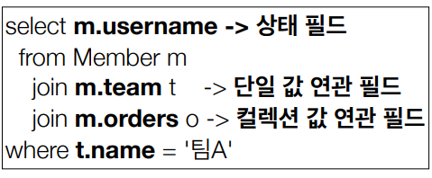
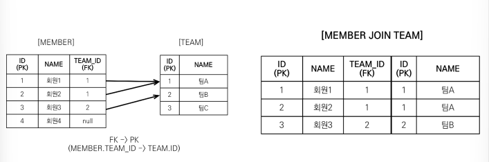
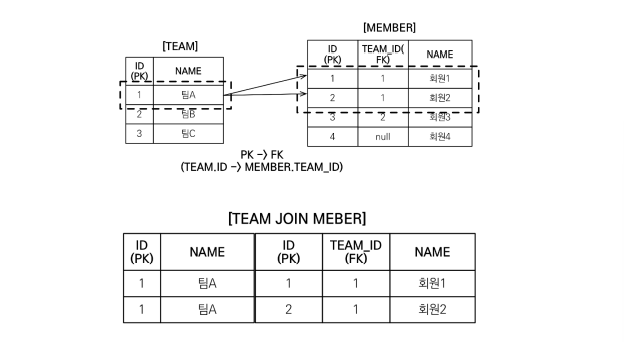
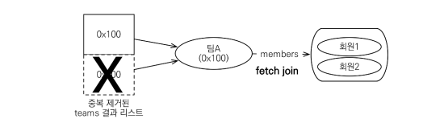
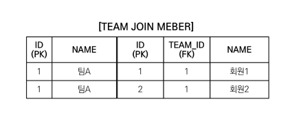
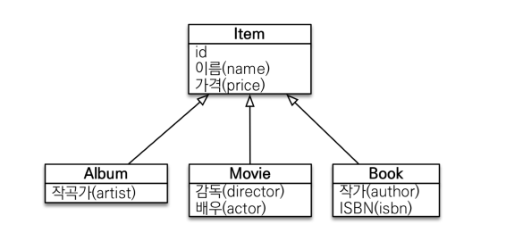
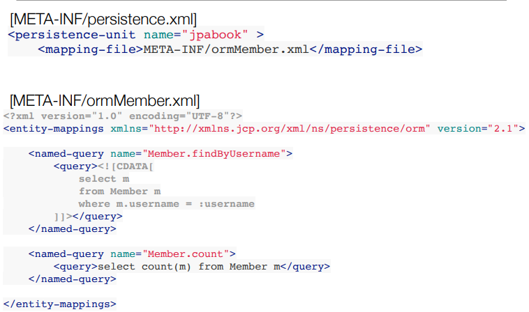

# 경로 표현식



​	경로 표현식이란 경로에 점을 찍어서 객체 그래프를 탐색하는 것입니다. 

- **상태필드**(static field) : 단순히 값을 저장하기 위한 필드입니다. 경로 탐색의 끝이며 더 이상 탐색되지 않습니다.

- **단일 값 연관 경로** : @ManyToOne, @OneToOne 인 필드이며 대상이 엔티티입니다. **묵시적으로 내부 조인이 발생합니다.**

  ```java
  String query = "select m.team From Member m";
  /*
  select
      team1_.id as id1_3_,
      team1_.name as name2_3_ 
  from
      Member member0_ 
  inner join
      Team team1_ 
          on member0_.TEAM_ID=team1_.id
  */
  ```

  쿼리문을 보면 join 문이 나가는 걸 볼 수 있습니다. **하지만 이렇게 조인문을 사용하지 않았는데 묵시적으로 발생하는 쿼리는 피해야 합니다.**

- **컬렉션 값 연관 경로** : @OneToMany, @ManyToMany 인 필드이며 대상이 컬렉션입니다. **묵시적으로 내부 조인이 발생합니다. 하지만 추가적인 탐색은 되지 않습니다.**

  ```java
  String query = "select t.members From Team t";
  //String query = "select t.members.username From Team t"; //추가적인 탐색 불가
  
  /*
  select
      members1_.id as id1_0_,
      members1_.age as age2_0_,
      members1_.TEAM_ID as team_id5_0_,
      members1_.type as type3_0_,
      members1_.username as username4_0_ 
  from
      Team team0_ 
  inner join
      Member members1_ 
          on team0_.id=members1_.TEAM_ID
  
  select
      team0_.id as id1_3_0_,
      team0_.name as name2_3_0_ 
  from
      Team team0_ 
  where
      team0_.id=?
  */
  ```

  먼저 members 를 가져옵니다. 그리고 members 를 출력할 때 team 을 가져오는 지연 로딩이 발생하게 됩니다. `t.members.username` 과 같이 컬렉션에서 추가적인 탐색은 불가능합니다. 만약 추가적인 탐색이 필요하다면 명시적 조인을 통해 별칭을 얻어야 합니다. ( `select m.username from Team t join t.members m` ) 

  ​	묵시적 조인은 항상 내부 조인을 발생시킵니다. **따라서 실무에서는 가급적 묵시적 조인 대신에 명시적 조인을 사용해야 합니다.** 조인은 SQL 튜닝에서 중요한 포인트거든요. 묵시적 조인이 일어나게 되면 상황을 한눈에 파악하기 힘듭니다.

# 페치 조인(fetch join)

​	페치 조인은 SQL 조인의 종류는 아닙니다. JPQL 에서 성능 최적화를 위해 제공하는 기능으로, 연관된 엔티티나 컬렉션을 SQL 한 번에 함께 조회하는 기능입니다. 아래와 같이 MEMBER 와 TEAM 테이블이 있고 member 를 조회하는 쿼리문을 날린다고 해보겠습니다.



```java
String query = "select m From Member m";

List<Member> result = em.createQuery(query, Member.class)
        .getResultList();

for (Member member : result) {
    System.out.println("member = " + member.getUsername() + ", " + member.getTeam().getName());
}
```

​	여기서 `member.getTeam().getName()` 을 통해 team 을 가져와야 하기 때문에 지연로딩전략으로 인해 쿼리문이 다시 나가게 됩니다.

```mysql
select
    member0_.id as id1_0_,
    member0_.age as age2_0_,
    member0_.TEAM_ID as team_id5_0_,
    member0_.type as type3_0_,
    member0_.username as username4_0_ 
from
    Member member0_

select
    team0_.id as id1_3_0_,
    team0_.name as name2_3_0_ 
from
    Team team0_ 
where
    team0_.id=?
#member1 조회 완료
member = member1, teamA
#member2 조회 완료 (member1 과 같은 팀이니까 영속성 컨텍스트에 있음)
member = member2, teamA

select
    team0_.id as id1_3_0_,
    team0_.name as name2_3_0_ 
from
    Team team0_ 
where
    team0_.id=?
#member3 조회완료
member = member3, teamB
```

​	쿼리문을 보면 각 member 당 team 을 조회할 때마다 select 쿼리문이 나가는 걸 볼 수 있습니다. 최악의 경우에는 member N 명을 조회했는데 각각의 팀이 다 다를 때 N 번의 쿼리가 나가겠죠. 이게 바로 **N + 1 문제**입니다. **이를 해결하기 위해 join fetch 를 사용합니다.**

```java
String jpql = "select m from Member m join fetch m.team";

List<Member> members = em.createQuery(jpql, Member.class).getResultList();

for (Member member : members) {
    System.out.println("username = " + member.getUsername() + ", " +
    "teamName = " + member.getTeam().name());
}
```

위 코드처럼 JPQL 문에 ` join fetch m.team` 을 붙이면 페치 조인으로 회원과 팀을 함께 조회하게 됩니다. 그러면 SQL 문이 한번만 나가서 N + 1 문제도 해결되겠죠.

## 컬렉션 페치 조인

​	일대다 관계에서는 컬렉션과 페치 조인을 하게 됩니다. TEAM 을 통해서 t.members 를 조회한다고 해보겠습니다.

```java
String query = "select t from Team t join fetch t.members where t.name = '팀A'";

List<Team> teams = em.createQuery(jpql, Team.class).getResultList();

for(Team team : teams) {
    System.out.println("teamname = " + team.getName() + ", team = " + team);
    for (Member member : team.getMembers()) {
        //페치 조인으로 팀과 회원을 함께 조회해서 지연 로딩 발생 안함
        System.out.println("-> username = " + member.getUsername()+ ", member = " + member);
	}	
}
```

위 코드는 페치 조인을 통해 team.name 이 teamA 인 팀과 멤버를 가지고 옵니다.



위 코드를 실행하면 결과는 아래와 같습니다.

```
teamname = 팀A, team = Team@0x100
-> username = 회원1, member = Member@0x200
-> username = 회원2, member = Member@0x300
teamname = 팀A, team = Team@0x100
-> username = 회원1, member = Member@0x200
-> username = 회원2, member = Member@0x300
```

같은 결과가 두번 조회되는데요. 그 이유는 **일대다 관계일 때 레코드의 수가 1개 이상으로 늘어날 수 있기 때문입니다.** DB 입장에서는 이렇게 테이블을 만드는 게 맞지만, 객체 지향 입장에서는 같은 내용을 두번 볼 필요는 없죠. **그래서 DISTINCT 명령어를 사용해야 합니다.**

​	JPQL 의 DISTINCT 는 2가지 기능을 제공하는데요. **첫번째는 SQL 에 DISTINCT 를 추가해주고, 두번째로 어플리케이션에서 엔티티 중복을 제거해줍니다.** SQL 문의 DISTINCT 는 완전히 같은 레코드만 제거하므로 현재로서는 중복 출력을 피할 수 없습니다. 따라서 어플리케이션에서 엔티티 중복을 제거해서 출력결과를 한번으로 만들어야 합니다.



**JPQL 의 DISTINCT 를 통해서 같은 식별자를 가진 Team 엔티티를 제거할 수 있습니다.**

```java
String query = "select distinct t from Team t join fetch t.members where t.name = '팀A'";

/*
teamname = 팀A, team = Team@0x100
-> username = 회원1, member = Member@0x200
-> username = 회원2, member = Member@0x300
*/
```

이제 결과가 하나만 나오는 걸 알 수 있습니다.

> 하이버네이트6 부터는 DISTINCT 명령어를 사용하지 않아 도 애플리케이션에서 중복 제거가 자동으로 적용됩니다. 

## 페치 조인과 일반 조인의 차이

​	일반 조인은 실행시에 조인을 하더라도 연관된 엔티티를 함께 조회하지 않습니다. 지연 로딩 전략이 계속 적용되는 겁니다.

```java
sring sql = "select t from Team t join t.members m where t.name = '팀A'"
```

​	위 쿼리문을 실행하면 아래와 같이 조인 자체는 들어가지만 member 까지 select 하지는 않습니다. 따라서 select 문이 2번 이상 나가게 되죠.

```mysql
select
    team0_.id as id1_3_,
    team0_.name as name2_3_ 
from
    Team team0_ 
inner join
    Member members1_ 
        on team0_.id=members1_.TEAM_ID 
where
    team0_.name='teamA'

select
    members0_.TEAM_ID as team_id5_0_0_,
    members0_.id as id1_0_0_,
    members0_.id as id1_0_1_,
    members0_.age as age2_0_1_,
    members0_.TEAM_ID as team_id5_0_1_,
    members0_.type as type3_0_1_,
    members0_.username as username4_0_1_ 
from
    Member members0_ 
where
    members0_.TEAM_ID=?
```

​	페치 조인을 사용할 때만 즉시 로딩으로 연관된 엔티티도 함께 조회합니다. 페치 조인은 객체 그래프를 SQL 한번에 조회하는 개념입니다.

# 페치 조인의 특징과 한계

## 페치 조인의 한계

1. 페치 조인 대상에게는 별칭을 줄 수 없습니다. 기본적으로 JPQL 은 컬렉션을 다 가져오는 걸로 생각하고 설계되어 있습니다. 따라서 별칭을 주고 아래와 같이 일부만 들고 오면 문제가 발생합니다.

   ```java
   String query = "select t from Team t fetch join t.members m where m.age > 10";
   ```

   영속성 컨텍스트에서 데이터 정합성 문제가 발생할 수도 있고, cascade 등 옵션이 있는데 잘못하면 나머지 컬렉션이 지워지거나 이상한 동작이 발생할 수도 있습니다. 따라서 특정 범위만 들고 오고 싶으면 member 를 대상으로 쿼리문을 작성해야 합니다.

2. 둘 이상의 컬렉션은 페치 조인 할 수 없습니다. 페치 조인은 모두 다 들고 오는 건데, 둘 이상의 컬렉션을 페치 조인하면 곱하기가 돼버려서 레코드 수가 엄청나게 늘어나기 때문입니다.

3. 컬렉션을 페치 조인하면 페이징 API(setFirstResult, setMaxResults)를 사용할 수 없습니다. 일대일, 다대일 같은 단일 값 연관 필드들은 페치 조인해도 페이징이 가능합니다. 페이징 자체는 가능하지만 원하는 결과가 나오지 않을 수 있습니다. 하이버네이트는 컬렉션 패치 조인 시 페이징을 하면 경고 로그를 남기고 메모리에서 페이징합니다. **메모리에서 페이징을 한다는 뜻은 모든 값을 메모리에 적재시킨 후 페이징을 한다는 건데, 들고 오는 데이터 수를 줄이기 위해 페이징을 하는데 메모리에 다 적재시키면 심각한 성능 저하를 야기할 수 있습니다.**

## 컬렉션 페치 조인 페이징

​	컬렉션 페치 조인 페이징을 좀 더 자세히 보겠습니다. 예를 들어 TEAM 을 기준으로 MEMBER 를 페치 조인했을 때는 아래와 같이 나옵니다.

```java
String query = "select t from Team t join fetch t.members m"; //아래 그림은 where 문이 포함된거라서 약간 다릅니다.

List<Team> result = em.createQuery(query, Team.class)
        .setFirstResult(0)
        .setMaxResults(1)
        .getResultList();

System.out.println("result.size() = " + result.size());

for (Team team : result) {
    System.out.println("team = " + team.getName() + "| members = " + team.getMembers().size());
}
```



​	하지만 여기서 페이징을 1개만 한다면 어떻게 될까요? 팀A 의 멤버는 2명인데, 1명만 페이징되는 결과가 발생합니다. 따라서 데이터가 완전히 달라지는거죠. 따라서 하이버네이트는 경고로그를 남기고 메모리에서 페이징합니다.

```mysql
# WARN: HHH000104: firstResult/maxResults specified with collection fetch; applying in memory!
select
    team0_.id as id1_3_0_,
    members1_.id as id1_0_1_,
    team0_.name as name2_3_0_,
    members1_.age as age2_0_1_,
    members1_.TEAM_ID as team_id5_0_1_,
    members1_.type as type3_0_1_,
    members1_.username as username4_0_1_,
    members1_.TEAM_ID as team_id5_0_0__,
    members1_.id as id1_0_0__ 
from
    Team team0_ 
inner join
    Member members1_ 
        on team0_.id=members1_.TEAM_ID
# result.size() = 1
# team = teamA| members = 2
```

제일 위에 보면 'applying in memory!' 라고 해서 경고 로그가 남죠. 그리고 **select 를 보면 페이징해서 들고 오는게 아니라 모든 데이터를 들고 오는 걸 알 수 있습니다.**

​	**첫번째 해결방법은 방향을 뒤집는 겁니다.** 일대다에서는 페이징을 할 때 중간에 끊기는 문제가 발생하지 않으니까요.

```java
String query = "select m from Member m join fetch m.team t";
```

​	**두번째 해결방법은 batchSize 를 사용하는 겁니다.** 일단 team 을 그냥 지연 로딩으로 조회하도록 구성합니다.

```java
String query = "select t from Team t";

List<Team> result = em.createQuery(query, Team.class)
        .setFirstResult(0)
        .setMaxResults(2)
        .getResultList();
```

그러면 team.getMembers() 를 할 때마다 쿼리문을 날리기 때문에 N + 1 문제가 발생하겠죠. 그래서 Team 의 members 에 @BatchSize 어노테이션을 붙입니다.

```java
@Entity
public class Team {
	...
	@BatchSize(size = 100)
    @OneToMany(mappedBy = "team", fetch = FetchType.LAZY)
    private List<Member> members = new ArrayList<>();
    ...
}
```

이제 다시 main 메서드를 실행시켜보면 쿼리문이 다음과 같이 나가고, 각 팀의 members 가 한번에 조회됩니다.

```mysql
select
    members0_.TEAM_ID as team_id5_0_1_,
    members0_.id as id1_0_1_,
    members0_.id as id1_0_0_,
    members0_.age as age2_0_0_,
    members0_.TEAM_ID as team_id5_0_0_,
    members0_.type as type3_0_0_,
    members0_.username as username4_0_0_ 
from
    Member members0_ 
where
    members0_.TEAM_ID in (
        ?, ?
    )
```

마지막에 보면 ` members0_.TEAM_ID in (?, ?)` 가 있죠. 지연 로딩에서 한번 들고 올때 BatchSize 만큼 들고 오기 때문에 N + 1 문제를 해결할 수 있습니다.

​	BatchSize 를 글로벌로 정의할 수도 있는데요. 보통 최적화를 위해 글로벌로 정의를 한다고 합니다. persistence.xml 파일에서 다음과 같은 속성을 추가합니다.

```xml
<property name="hibernate.default_batch_fetch_size" value="100" />
```


## 페치 조인의 특징

​	페치 조인을 통해 연관된 엔티티들을 SQL 한 번으로 조회가 가능해서 성능을 최적화할 수 있습니다. 엔티티에 직접 적용하는 글로벌 로딩 전략보다 우선합니다. **실무에서 글로벌 로딩 전략은 모두 지연 로딩을 사용하고 최적화가 필요한 곳에 페치 조인을 적용해야 합니다.**

​	페치 조인은 객체 그래프를 유지할 때 사용하면 효과적입니다. 하지만 **여러 테이블을 조인해서 엔티티가 가진 모양이 아닌 전혀 다른 결과를 내야 한다면 페치 조인보다는 일반 조인을 사용하고 필요한 데이터들만 조회해서 DTO로 반환하는 것이 효과적입니다.**

# 다형성 쿼리



​	TYPE 을 통해서 조회할 수도 있습니다.

```java
String sql = "select i from Item i where type(i) IN (Book, Movie)"
```

TREAT 를 사용하면 자바의 타입 캐스팅과 유사하게 사용할 수 있습니다.

```java
String sql = "select i from Item i where treat(i as Book).author = 'kim'"
```

# 엔티티 직접 사용

## 기본 키 값

​	JPQL에서 엔티티를 직접 사용하면 SQL에서 해당 엔티티의 기본 키 값을 사용합니다.

JPQL

```mysql
select count(m.id) from Member m #엔티티의 아이디를 사용
select count(m) from Member m #엔티티를 직접 사용
```

변환되는 SQL

```mysql
select count(m.id) as cnt from Member m #둘 다 같은 SQL 문 실행
```

아래와 같이 엔티티를 파라미터로 직접 전달해도 SQL 문은 id 로 조회합니다.

```java
String jpql = “select m from Member m where m = :member”;
List resultList = em.createQuery(jpql)
    .setParameter("member", member)
    .getResultList(); 

/*
select m.* from Member m where m.id=? 
*/
```

## 외래 키 값

​	외래키 값으로도 엔티티를 사용할 수 있습니다.

```java
Team team = em.find(Team.class, 1L);

String qlString = “select m from Member m where m.team = :team”;
List resultList = em.createQuery(qlString)
    .setParameter("team", team)
    .getResultList();

String qlString = “select m from Member m where m.team.id = :teamId”; //같은 결과
```

​	실행된 SQL 문은 아래와 같습니다.

```mysql
select m.* from Member m where m.team_id=?
```

# Named 쿼리

​	Named 쿼리는 미리 정의해서 이름을 부여해두고 사용하는 JPQL 문입니다. 정적 쿼리로 동적으로 변경하지는 못합니다. 어노테이션이나 XML 에 정의합니다. **애플리케이션 로딩 시점에 초기화 후 재사용되어 파싱을 하는 비용을 줄이고, 어플리케이션 로딩 시점에 쿼리를 검증해줍니다.**

```java
@Entity
@NamedQuery(
    name = "Member.findByUsername",
    query="select m from Member m where m.username = :username")
    public class Member {
    ...
    }
    
List<Member> resultList = em.createNamedQuery("Member.findByUsername", Member.class)
    .setParameter("username", "회원1")
    .getResultList();
```

위 코드처럼 엔티티에 `@NamedQuery` 를 붙여서 사용합니다. 로직에서는 `createNamedQuery` 메서드로 사용합니다.

XML 에서는 다음과 같이 사용할 수 있습니다.



​	Named 쿼리를 설정할 때 XML 이 항상 우선권을 가집니다.

# JPQL - 벌크 연산

​	벌크 연산은 쿼리 한 번으로 여러 테이블 로우를 변경하는 방법입니다. UPDATE, DELETE 가 지원되며 하이버네이트에서 INSERT 를 지원합니다.

```java
int resultCount = em.createQuery("update Member m set m.age = 20")
                    .executeUpdate();
```

​	벌크 연산을 사용할 때는 주의점이 있는데요. **벌크 연산은 영속성 컨텍스트를 무시하고 데이터베이스에 직접 쿼리한다는 점입니다. 따라서 영속성 컨텍스트와 데이터 정합성이 맞지 않을 수도 있습니다.**

```java
public class JpaMain {

    public static void main(String[] args) {
        EntityManagerFactory emf = Persistence.createEntityManagerFactory("hello");
        EntityManager em = emf.createEntityManager();

        EntityTransaction tx = em.getTransaction();
        tx.begin();

        try{
            Member member1 = new Member();
            member1.setUsername("member1");
            member1.setAge(10);

            Member member2 = new Member();
            member2.setUsername("member2");
            member1.setAge(10);

            em.persist(member1);
            em.persist(member2);

            //flush 자동 호출
            int resultCount = em.createQuery("update Member m set m.age = 20")
                    .executeUpdate();

            //영속성 컨텍스트의 member1, age = 10
            Member findMember = em.find(Member.class, member1.getId());
            
            System.out.println("findMember.getAge() = " + findMember.getAge());
            System.out.println("resultCount = " + resultCount);

            tx.commit();

        }catch (Exception e) {
            tx.rollback();
            e.printStackTrace();
        }finally {
            emf.close();
        }
    }
}
```

​	위 코드를 보면 findMember 의 age 는 여전히 10 입니다. 하지만 DB 에는 20 이 반영된 것을 알 수 있습니다. 이는 **벌크 연산이 영속성 컨텍스트를 거치치 않고 데이터베이스에 직접 쿼리하기 때문인데요.** 이를 해결하기 위해 두가지 방법을 사용할 수 있습니다.

1. 벌크 연산을 먼저 실행합니다. 

2. 벌크 연산 수행 후 영속성 컨텍스트 초기화합니다.

   ```java
   //flush 자동 호출
   int resultCount = em.createQuery("update Member m set m.age = 20")
       	.executeUpdate();
       	
   em.clear(); //영속성 컨텍스트 초기화합니다.
   
   Member findMember = em.find(Member.class, member1.getId());
   System.out.println("findMember.getAge() = " + findMember.getAge());
   System.out.println("resultCount = " + resultCount);
   ```

   
