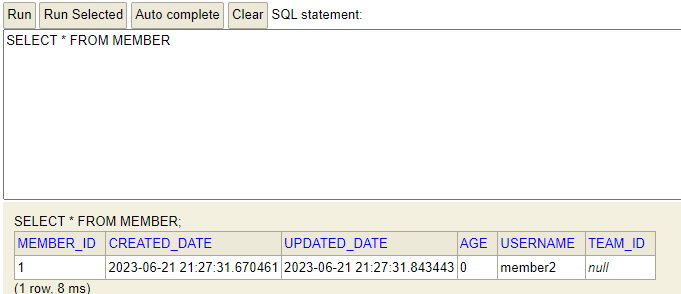
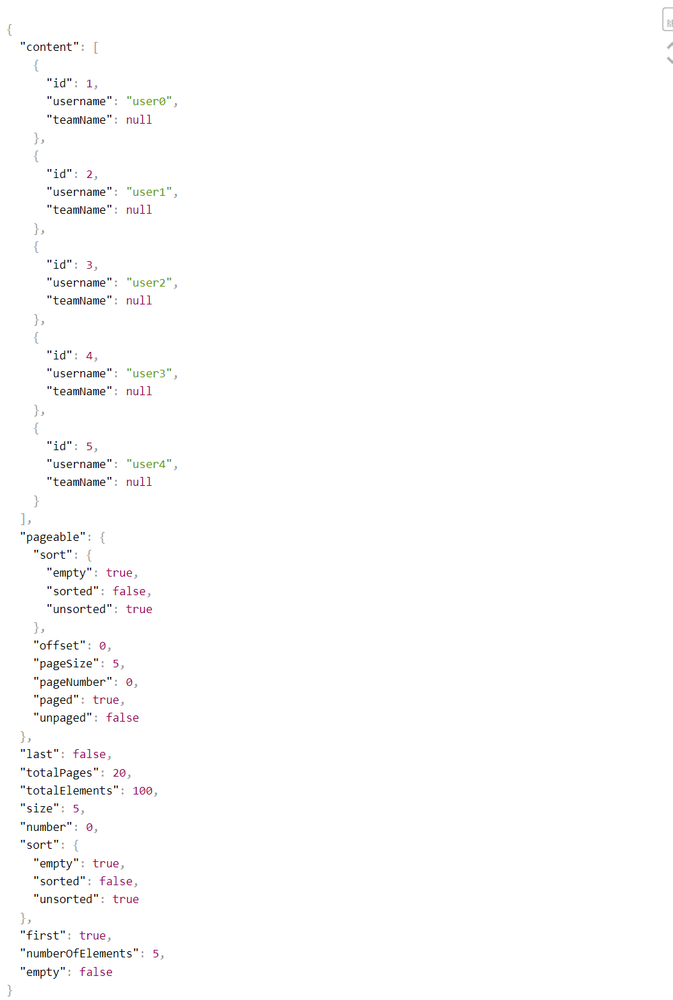

# 사용자 정의 리포지토리 구현

​	인터페이스의 메서드를 직접구현하고 싶다면 `MemberRepositoryImpl` 을 만들어야 합니다. 예를 들어, `findMemberCustom()` 메서드를 만든다고 해보겠습니다. 

1. 먼저 `MemberRepositoryCustom` 을 만듭니다. 인터페이스명은 아무거나 해도 상관없습니다.

   ```java
   public interface MemberRepositoryCustom {
   
       List<Member> findMemberCustom();
   }
   
   ```

2. 그리고 `MemberRepositoryCustom` 을 구현하는 `MemberRepositoryImpl` 클래스를 만듭니다. **해당 클래스명은 명명 규칙에 의해 `MemberRepository`(JpaRepository 를 상속받는 리포지토리 인터페이스 이름) + `Impl` 로 만들어야 합니다.**

   ```java
   @RequiredArgsConstructor
   public class MemberRepositoryImpl implements MemberRepositoryCustom { //MemberRepository + Impl 로 이름을 지어야 합니다. (의무 규칙)
   
       private final EntityManager em;
   
       @Override
       public List<Member> findMemberCustom() {
           return em.createQuery("select m from Member m", Member.class)
                   .getResultList();
       }
   }
   ```

3. `MemberRepository` 또한 `MemberRepositoryCustom` 인터페이스를 상속받아야 어떤 구현체를 사용하는지 알 수 있습니다.

   ```java
   public interface MemberRepository extends JpaRepository<Member, Long>, MemberRepositoryCustom {
   }
   ```

4. 메서드는 아래와 같이 사용하면 됩니다.

   ```java
   List<Member> result = memberRepository.findMemberCustom();
   ```

만약 명명규칙을 변경하고 싶다는 메인 클래스에서 아래와 같이 어노테이션을 추가합니다.

```java
@SpringBootApplication
@EnableJpaRepositories(basePackages = "datajpa.repository",
		repositoryImplementationPostfix = "Impl2")
public class DataJpaApplication {

	public static void main(String[] args) {
		SpringApplication.run(DataJpaApplication.class, args);
	}
	
}
```

이제 명명 규칙은 `memberRepository` + `Impl2` 입니다. **하지만 유지보수와 협업을 위해 굳이 이름을 바꾸지 않는 게 좋습니다.**

또한 **스프링 데이터 2.x 부터는 사용자 정의 구현 클래스에 `리포지토리 인터페이스 이름 + Impl` 을 적용하는 대신에 `사용자 정의 인터페이스 명 + Impl` 방식도 지원합니다.** 예를 들어서 위 예제의 `MemberRepositoryImpl` 대신에 `MemberRepositoryCustomImpl` 같이 구현해도 됩니다. **기존 방식보다 이 방식이 사용자 정의 인터페이스 이름과 구현 클래스 이름이 비슷하므로 더 직관적이고  여러 인터페이스를 분리해서 구현하는 것도 가능하기 때문에 새롭게 변경된 이 방식을 사용하는 것이 더 권장됩니다.**

> 항상 사용자 정의 리포지토리가 필요한 건 아닙니다. 복잡하고 분리해야 할 쿼리, 라이프 사이클이 다른 쿼리(화면에 맞는 쿼리문, 통계성 쿼리문 등) 은 클래스로 따로 만들어서 따로 관리하는 편이 나을 수 있습니다.

# Auditing

​	auditing 은 엔티티 생성 및 변경 시 변경한 사람과 시간을 추적하는 방법입니다. 먼저 순수 JPA 를 사용하는 방법부터 확인해보겠습니다.

## 순수 JPA 를 사용한 Auditing

```java
@MappedSuperclass
@Getter
public class JpaBaseEntity {

    @Column(updatable = false)
    private LocalDateTime createdDate;
    private LocalDateTime updatedDate;
    
    @PrePersist
    public void prePersist() {
        LocalDateTime now = LocalDateTime.now();
        createdDate = now;
        updatedDate = now;
    }
    
    @PreUpdate
    public void preUpdate() {
    	updatedDate = LocalDateTime.now();
    }
}
```

- `@MappedSuperclass` 를 붙여줘야 부모클래스로 사용될 때 필드값들을 자식 클래스 엔티티가 사용할 수 있습니다.
- `@PrePersist` : persist 전에 실행되는 메서드입니다.
- `@PreUpdate` : 업데이트 이전에 실행되는 메서드입니다.
- `@Column(updatable = false)` : `updatable` 속성을 `false` 로 주어서 생성날짜를 변경하지 못하게 합니다.

```java
package datajpa.entity;

import lombok.*;

import javax.persistence.*;

@Entity
@Getter @Setter
@NoArgsConstructor(access = AccessLevel.PROTECTED)
@NamedEntityGraph(name = "Member.all", attributeNodes = @NamedAttributeNode("team"))
@ToString(of = {"id", "username", "age"})
public class Member extends JpaBaseEntity{
	...
}
```

엔티티인 `Member` 클래스에서는 `JpaBaseEntity` 를 상속받기만 하면 사용이 됩니다.

아래와 같이 테스트 코드를 실행했을 때 DB 값입니다.

```java
@Test
public void JpaEventBaseEntity() throws InterruptedException {
    Member member = new Member("member1");
    memberRepository.save(member); // @PrePersist

    Thread.sleep(100);
    member.setUsername("member2");

    em.flush();
    em.clear();

    Member findMember = memberRepository.findById(member.getId()).orElseThrow();
    System.out.println("findMember.getCreatedDate() = " + findMember.getCreatedDate());
    System.out.println("findMember.getUpdatedDate() = " + findMember.getUpdatedDate());
}
```



`CREATE_DATE` 와 `UPDATED_DATE` 가 잘 들어간걸 볼 수 있습니다.

## Spring Data JPA 를 사용한 Auditing

​	등록일, 수정일, 등록자, 수정자가 있는 Auditing 입니다.

```java
@EntityListeners(AuditingEntityListener.class)
@MappedSuperclass
@Getter
public class BaseEntity {

    @CreatedDate
    @Column(updatable = false)
    private LocalDateTime createdDate;
    @LastModifiedDate
    private LocalDateTime lastModifiedDate;

    @CreatedBy
    @Column(updatable = false)
    private String createdBy;

    @LastModifiedBy
    private String lastModifiedBy;
}

```

- `@CreatedDate` : 등록일자입니다. `@Column(updatable = false)` 와 함께 사용하면 됩니다.
- `@LastModifiedDate` : 수정일자입니다.
- `@CreatedBy` : 등록자입니다. `@Column(updatable = false)` 와 함께 사용하면 됩니다.
- `@LastModifiedBy` : 수정자입니다.
- `@EntityListeners(AuditingEntityListener.class)` : 리스너를 등록해줘야 등록자와 수정자를 추가할 수 있습니다.

그리고 메인 클래스에 다음과 같이 추가합니다.

```java
@SpringBootApplication
@EnableJpaAuditing //추가
public class DataJpaApplication {

	public static void main(String[] args) {
		SpringApplication.run(DataJpaApplication.class, args);
	}

	@Bean
	public AuditorAware<String> auditorProvider(){
		//원래는 세션에서 UserId 를 꺼내서 넣어줘야 합니다.
		return () -> Optional.of(UUID.randomUUID().toString());
	}
}
```

- `@EnableJpaAuditing` 을 추가해서 Auditing 이 가능하게 합니다.
- `auditorProvider()` 은 등록 및 수정자에 대한 정보를 반환합니다. 세션이나 스프링 시큐리티 로그인 정보에서 UserId 를 꺼내서 넣어주는 등, 식별할 수 있는 값을 반환해야 합니다. 지금은 따로 식별자가 없어서 UUID 를 사용했습니다.

그리고 나서 `Member` 클래스가 아래와 같이 `BaseEntity` 를 상속받게 합니다.

```java
@Entity
@Getter @Setter
@NoArgsConstructor(access = AccessLevel.PROTECTED)
public class Member extends BaseEntity{
	...
}
```

실무에서 대부분의 엔티티는 등록시간, 수정시간이 필요하지만, 등록자, 수정자는 없을 수도 있습니다. 그래서 다음과 같이 Base 타입을 분리하고, 원하는 타입을 선택해서 상속할 수도 있습니다.

```java
public class BaseTimeEntity {
    @CreatedDate
    @Column(updatable = false)
    private LocalDateTime createdDate;
    
    @LastModifiedDate
    private LocalDateTime lastModifiedDate;
}
public class BaseEntity extends BaseTimeEntity {
    @CreatedBy
    @Column(updatable = false)
    private String createdBy;
    
    @LastModifiedBy
    private String lastModifiedBy;
}
```

만약 등록시간, 수정시간만 필요하다면 `BaseTimeEntity` 를 상속받고, 등록자, 생성자도 필요하다면 `BaseEntity` 를 상속받으면 됩니다.

# Web 확장 - 도메인 클래스 컨버터

​	도메인 클래스 컨버터는 API 계층에서 `pk` 로 파라미터를 받아서 바로 테이블을 조회하는 기능입니다.

```java
@RestController
@RequiredArgsConstructor
public class MemberController {

    private final MemberRepository memberRepository;

    @GetMapping("/members/{id}")
    public String findMember(@PathVariable("id") Member member){
        return member.getUsername();
    }

    @PostConstruct
    public void init(){
        memberRepository.save(new Member("userA"));
    }
}

```

​	`findMember` 핸들러는 `@PathVariable("id") Member member` 파라미터를 받습니다. 이때 `id` 값을 바로 `member` 로 변환하여 사용합니다. **HTTP 요청은 회원 `id` 를 받지만 도메인 클래스 컨버터가 중간에 동작해서 회원 엔티티 객체를 반환하는 것입니다.** 도메인 클래스 컨버터도 리파지토리를 사용해서 엔티티를 찾습니다.

​	**도메인 클래스 컨버터로 엔티티를 파라미터로 받으면, 이 엔티티는 단순 조회용으로만 사용해야 합니다.** 트랜잭션이 없는 범위에서 엔티티를 조회했으므로, 엔티티를 변경해도 DB에 반영되지 않습니다.

​	그리고 보통 pk 값으로 정보를 주고 받는 일이 없으므로 보통 사용하지 않고, 정말 단순할 때만 사용합니다. 

# Web 확장 - 페이징과 정렬

​	핸들러 메서드에서 파라미터로 `Pageable` 을 받을 수 있습니다.

```java
@GetMapping("/members")
public Page<MemberDto> list(Pageable pageable){

    return memberRepository.findAll(pageable).map(MemberDto::new);
}
```

기본값은 page = 0, size = 20 으로 설정됩니다. param 값으로 변경할 수 있습니다.

**`localhost:8080/members?page=0&size=5`**



기본값을 설정할 수도 있습니다.

- 글로벌 설정 : 스프링 부트 (기본 사이즈 10, 최대 사이즈 2000)

  ```yaml
  spring:
    data:
      web:
        pageable:
          default-page-size: 10
          max-page-size: 2000
  ```

- 개별 설정 : `@PageableDefault` 어노테이션을 사용

  ```java
  @GetMapping("/members")
  public Page<MemberDto> list(@PageableDefault(size = 12, sort = "username",
   direction = Sort.Direction.DESC) Pageable pageable){
  
      return memberRepository.findAll(pageable).map(MemberDto::new);
  }
  
  ```

  - size 는 12, 정렬은 `username` 기준, DESC 로 정렬했습니다.

​	요청 파라미터로 해당값을 하려면 **`/members?page=0&size=12&sort=username,desc`** 로 사용됩니다. 이 때 페이징 정보가 둘 이상이면 접두사로 구분하게 됩니다. 

`/members?member_page=0&order_page=1`

```java
public String list(
     @Qualifier("member") Pageable memberPageable,
     @Qualifier("order") Pageable orderPageable, ...){...}
```

​	만약 Page를 1부터 시작하고 싶다면 다음과 같은 속성을 추가해줍니다. `one-indexed-parameters: true`

```yaml
spring:
  data:
    web:
      pageable:
        default-page-size: 10
        max-page-size: 2000
        one-indexed-parameters: true # 추가
```

이제 `/localhost:8080/members?page=1` 로 요청하면 0 페이지가 출력됩니다. 이때 Page 반환값에는 그대로 0페이지로 되어있으니 주의해서 사용해야 합니다.