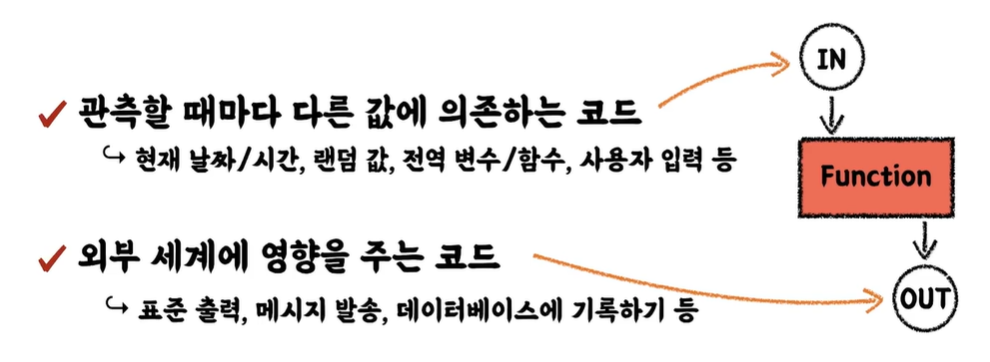

*Section 2 이전은 소개 강의이기 때문에 넣지 않았습니다.*

# 수동 테스트 VS. 자동화된 테스트

코드 : https://github.com/wbluke/practical-testing/tree/lesson2-3

```java
@Test
void add() {
    CafeKiosk cafeKiosk = new CafeKiosk();
    cafeKiosk.add(new Americano());

    System.out.println(">>> 담긴 음료 수 : " + cafeKiosk.getBeverages().size());
    System.out.println(">>> 담긴 음료 : " + cafeKiosk.getBeverages().get(0).getName());
}

/*
>>> 담긴 음료 수 : 1
>>> 담긴 음료 : 아메리카노
*/
```

위 코드를 실행한 결과는 의도대로 잘 나왔습니다. 하지만 해당 테스트는 **수동 테스트**라고 할 수 있습니다.

- 먼저 콘솔에 결과값을 찍어서 사람이 확인합니다. 결국 최종단계에서 사람이 확인해야 해서 휴먼 에러가 발생할 수 있습니다.
- 또한 다른 사람이 이 테스트코드를 봤을 때 뭘 검증하고, 어떤 게 맞는 케이스고 실패하는 케이스인지 알 수 없습니다.

# JUnit5 로 테스트하기

`spring-boot-starter-test` dependency 에 `JUnit5`, `AssertJ` 가 포함되어 있습니다.

​	**단위 테스트란 작은 코드 단위(클래스나 메서드) 를 독립적으로 검증하는 테스트**입니다. 검증 속도가 빠르고 안정적입니다.

> AssertJ
>
> :heavy_check_mark: 테스트 코드 작성을 원활하게 돕는 테스트 라이브러리
>
> :heavy_check_mark: 풍부한 API, 메서드 체이닝 지원

`CafeKiosk` 에 있는 `add()`, `remove()`, `clear()` 메서드를 `JUnit5` 와 `AssertJ` 를 이용해서 테스트해보겠습니다.

```java
package sample.cafekiosk.unit;

import org.assertj.core.api.Assertions;
import org.junit.jupiter.api.Test;
import sample.cafekiosk.unit.beverage.Americano;
import sample.cafekiosk.unit.beverage.Latte;

import static org.assertj.core.api.Assertions.*;
import static org.junit.jupiter.api.Assertions.*;

class CafeKioskTest {

    @Test
    void add_auto_test() {
        CafeKiosk cafeKiosk = new CafeKiosk();
        cafeKiosk.add(new Americano());

        assertThat(cafeKiosk.getBeverages()).hasSize(1);
        assertThat(cafeKiosk.getBeverages().get(0).getName()).isEqualTo("아메리카노");
        
    }
    
    @Test
    void remove() {
        CafeKiosk cafeKiosk = new CafeKiosk();
        Americano americano = new Americano();
        cafeKiosk.add(americano);
        assertThat(cafeKiosk.getBeverages()).hasSize(1);

        cafeKiosk.remove(americano);
        assertThat(cafeKiosk.getBeverages()).isEmpty();
    }

    @Test
    void clear() {
        CafeKiosk cafeKiosk = new CafeKiosk();
        Americano americano = new Americano();
        Latte latte = new Latte();
        cafeKiosk.add(americano);
        cafeKiosk.add(latte);
        assertThat(cafeKiosk.getBeverages()).hasSize(2);

        cafeKiosk.clear();
        assertThat(cafeKiosk.getBeverages()).isEmpty();
    }
}
```

- `.hasSize(1)` : 리스트가 해당 사이즈를 가지고 있는지 검증합니다.
- `.isEmpty()` : 리스트가 비어있는지 검증합니다.

# 테스트 케이스 세분화하기

**요구사항 추가**

:heavy_check_mark: *한 종류의 음료 여러 잔을 한번에 담는 기능*

요구사항이 추가되면 테스트 케이스를 세분화해야 합니다.

- 해피 케이스 : 요구사항을 그대로 만족하는 테스트 (위 요구사항은 해피 케이스만 있음)
- 예외 케이스 : 암묵적인 예외 사항 (:question: 아메리카노 0잔이 입력되면 어떻게 대처할지? -1 이 입력되면?)

## 경계값 테스트

​	범위(이상, 이하, 초과, 미만), 구간, 날짜 등 경계값이 있는 조건이 있다면 해피 케이스는 경계값에 대한 검증을 하고, 예외 케이스는 경계값에 해당되지 않는 검증을 하는 게 좋습니다.

예를 들어 `CafeKiosk` 클래스에 아래와 같이 개수를 통해 주문하는 메서드를 만듭니다. `0잔` 을 입력하면 예외를 발생하게 합니다. (예외 상황 도출)

```java
@Getter
public class CafeKiosk {

    private final List<Beverage> beverages = new ArrayList<>();

    public void add(Beverage beverage, int count) {

        if(count <= 0){
            throw new IllegalArgumentException("음료는 1잔 이상 주문해야 합니다.");
        }

        for (int i = 0; i < count; i++) {
            beverages.add(beverage);
        }
    }
    
    ...
}
```

테스트 케이스는 아래와 <u>해피 케이스와 예외 케이스로 나눠서 같이 작성</u>합니다.

```java
package sample.cafekiosk.unit;

import org.assertj.core.api.Assertions;
import org.junit.jupiter.api.DisplayName;
import org.junit.jupiter.api.Test;
import sample.cafekiosk.unit.beverage.Americano;
import sample.cafekiosk.unit.beverage.Latte;

import static org.assertj.core.api.Assertions.*;
import static org.junit.jupiter.api.Assertions.*;

class CafeKioskTest {

    @Test
    void addSeveralBeverages() {
        CafeKiosk cafeKiosk = new CafeKiosk();
        Americano americano = new Americano();

        cafeKiosk.add(americano, 2);

        assertThat(cafeKiosk.getBeverages().get(0)).isEqualTo(americano);
        assertThat(cafeKiosk.getBeverages().get(1)).isEqualTo(americano);
    }

    @Test
    @DisplayName("여러 개 주문 예외상황")
    void addZeroBeverages() {
        CafeKiosk cafeKiosk = new CafeKiosk();
        Americano americano = new Americano();

        assertThatThrownBy(() -> cafeKiosk.add(americano, 0))
                .isInstanceOf(IllegalArgumentException.class)
                .hasMessageContaining("음료는 1잔 이상 주문해야 합니다.");
    }
```

`assertThatThrownBy` : Exception 발생을 검증합니다. `isInstanceOf` 와 `hasMessageContaining` 을 사용할 수 있습니다.

# 테스트하기 어려운 영역을 분리하기

**요구사항 추가**

:heavy_check_mark: *가게 운영 시간(10:00 ~ 22:00) 외에는 주문을 생성할 수 없다.*

`CafeKiosk` 클래스의 `createOrder` 메서드에서 아래와 같이 주문시간을 검증하는 로직을 넣어주겠습니다.

```java
@Getter
public class CafeKiosk {

    private final List<Beverage> beverages = new ArrayList<>();
    private static final LocalTime SHOP_OPEN_TIME  = LocalTime.of(10, 0);
    private static final LocalTime SHOP_CLOSE_TIME = LocalTime.of(22, 0);

    ...
        
	public Order createOrder(){
        LocalDateTime currentDateTime = LocalDateTime.now();
        LocalTime currentTime = currentDateTime.toLocalTime();

        if(currentTime.isBefore(SHOP_OPEN_TIME) || currentTime.isAfter(SHOP_CLOSE_TIME)){
            throw new IllegalStateException("주문 가능 시간이 아닙니다.");
        }


        return new Order(currentDateTime, beverages);
    }
}
```

테스트 코드는 아래와 같이 만들 수 있습니다.

```java
@Test
@DisplayName("주문 가능 시간일 때 주문")
void createOrder() {
    CafeKiosk cafeKiosk = new CafeKiosk();
    Americano americano = new Americano();

    cafeKiosk.add(americano);

    Order order = cafeKiosk.createOrder();

    assertThat(order.getBeverages()).hasSize(1);
    assertThat(order.getBeverages().get(0).getName()).isEqualTo("아메리카노");
}
```

하지만 여기에는 문제가 있는데요. 바로 **테스트를 수행하는 시간에 따라서 테스트 결과가 달라진다는 점**입니다. 만약 10시 ~ 22시 사이에 수행을 하면 테스트는 정상 검증이 됩니다. 하지만 그 이외의 시간에는 에러가 나겠죠. 이렇게 **테스트하기 어려운 영역은 외부에서 주입받도록 분리**해야 합니다.

## 테스트하기 어려운 영역

아래 기술된 영역은 **테스트하기 어려운 영역**이기 때문에 분리해야 합니다.



함수를 기준으로, 관측할 때마다 다른 값에 의존하는 코드는 외부세계에서 들어오는 코드라고 할 수 있습니다. 반대로 외부 세계에 영향을 주는 코드는 함수의 결과로 다른 값에 영향을 줄 때입니다.

반대로 테스트하기 쉬운 함수는 외부세계와 단절된 **순수함수**(pure functions) 입니다.

- 같은 입력에는 항상 같은 결과
- 외부 세상과 단절된 형태
- 테스트하기 쉬운 코드

아래는 테스트하기 쉽도록 수정된 `createOrder` 입니다. `LocalDateTime` 을 파라미터로 받도록 했습니다.

```java
public Order createOrder(LocalDateTime currentDateTime){

        LocalTime currentTime = currentDateTime.toLocalTime();

        if(currentTime.isBefore(SHOP_OPEN_TIME) || currentTime.isAfter(SHOP_CLOSE_TIME)){
            throw new IllegalStateException("주문 가능 시간이 아닙니다.");
        }

        return new Order(currentDateTime, beverages);
    }
```

이제 주문 시간에 따른 해피 케이스와 예외 케이스를 작성해보겠습니다.

```java
@Test
@DisplayName("현재 시간을 직접 지정하여 주문 가능 시간 테스트")
void createOrderWithCurrentTime() {
    CafeKiosk cafeKiosk = new CafeKiosk();
    Americano americano = new Americano();

    cafeKiosk.add(americano);

    Order order = cafeKiosk.createOrder(LocalDateTime.of(2023, 1, 17, 10, 0));

    assertThat(order.getBeverages()).hasSize(1);
    assertThat(order.getBeverages().get(0).getName()).isEqualTo("아메리카노");
}

@Test
@DisplayName("주문 가능 시간 예외 테스트")
void createOrderOutsideOpenTime() {
    CafeKiosk cafeKiosk = new CafeKiosk();
    Americano americano = new Americano();

    cafeKiosk.add(americano);

    assertThatThrownBy(() -> cafeKiosk.createOrder(LocalDateTime.of(2023, 1, 17, 9, 59)))
            .isInstanceOf(IllegalStateException.class)
            .hasMessageContaining("주문 가능 시간이 아닙니다.");
}
```

이제 현재 시간에 관계없이 테스트가 가능해졌습니다.

<u>이처럼 테스트하기 어려운 영역을 구분하고 분리하면 테스트 가능한 코드가 많아지게 됩니다. 물론 모든 영역을 가장 상단 레이어로 올리는 건 아닙니다. 어느정도 한계가 필요합니다.</u>


